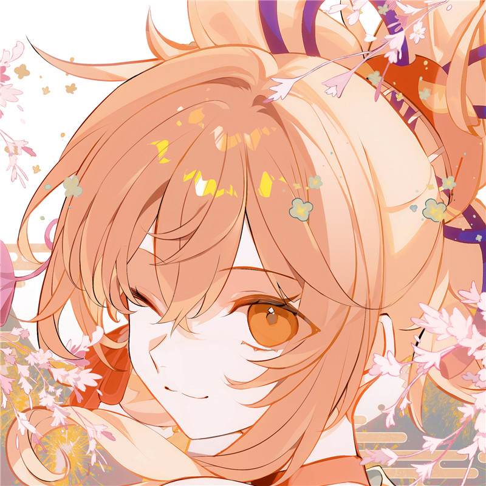
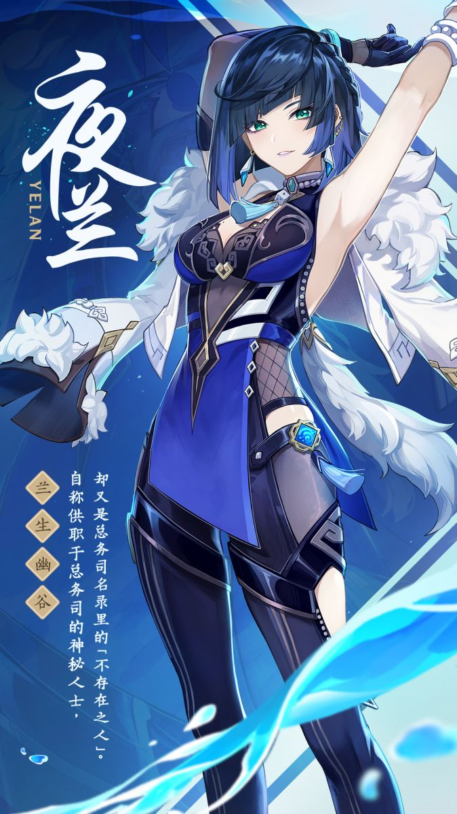
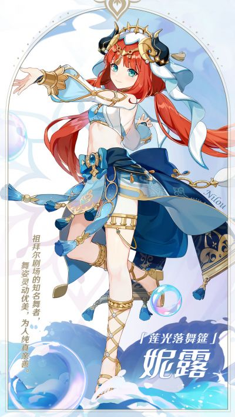
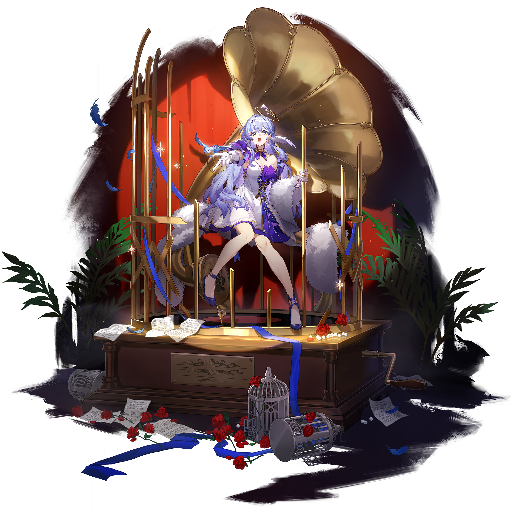
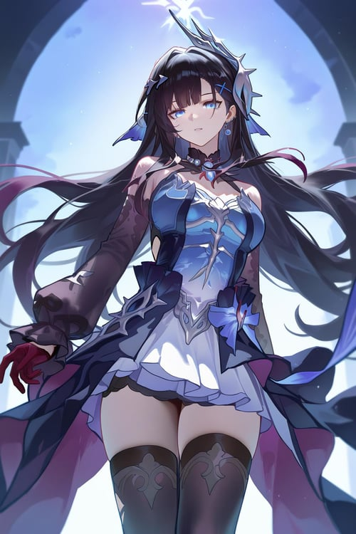
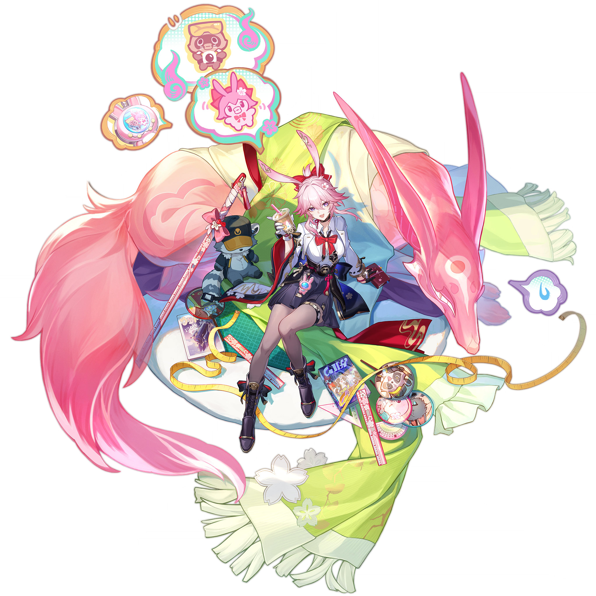
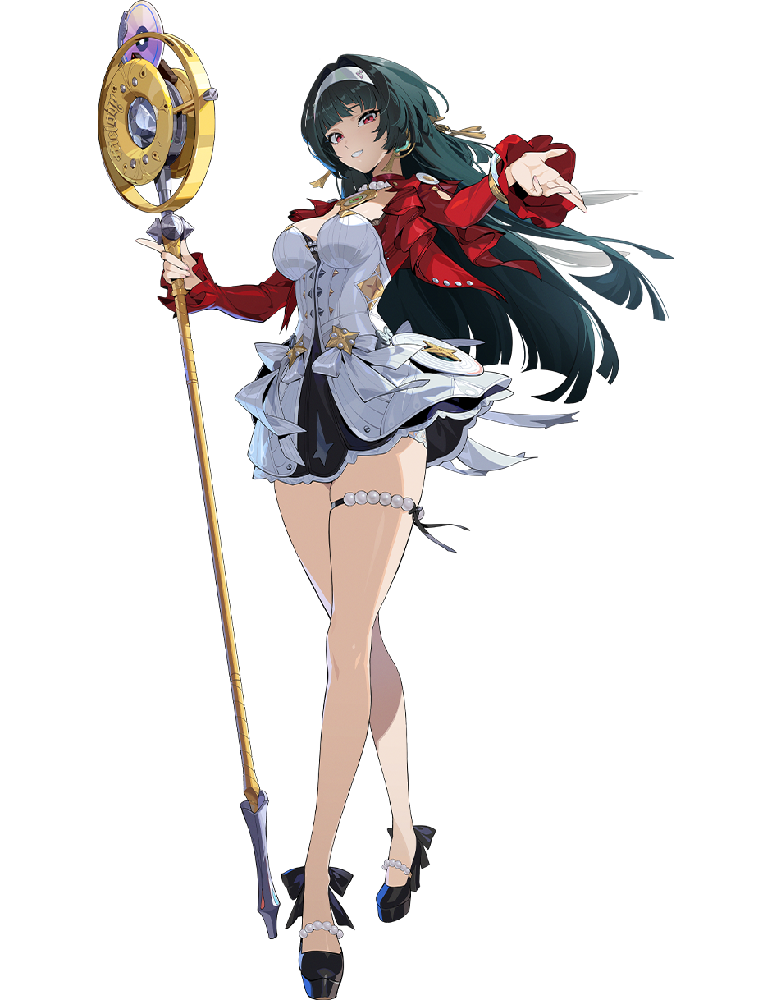
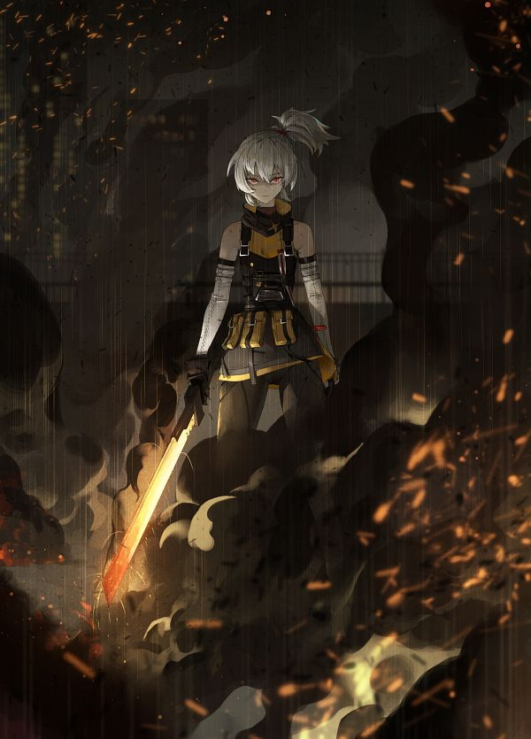

# 元气应援签·米哈游角色JK九签（为生活打气）

> 类型：F 签图（用户手动触发生成）。
>
> 核心设计：这不是普通JK壁纸，而是一张张可抽取的「应援签」——统一模板为「奶油纸质底 + 手绘放射日光线（sunburst）+ 左上角大缎带蝴蝶结 + 底部留白横幅 + 空白朱红印章 + 四角金银星屑」，全系列只有三处变化：**角色本体、主题色（放射线/蝴蝶结/领结/裙格纹同色联动）、应援道具**（一人一件，共九件）。全员 JK 制服性感风（短款衬衫+领结+格纹百褶裙），尺度守住红线：tasteful and elegant throughout，仅限成年角色。
>
> 主题：为生活打气——每签的签名统一嵌「气」字，签语呼应角色与应援道具，抽中即打气。
>
> 输出比例：`9:20 vertical mobile wallpaper`。
>
> 图片零文字纪律：**图片内部绝对不出现任何文字**——签名、签位、签语、假名、字母、数字一律不进图；底部横幅与朱红印章全部留白，文字由后期统一添加（签名+签位写横幅，签语放抽签页/字幕），保证九签字体排版完全一致。
>
> 角色去重对照：不与「月谕圣牌」（胡桃、芙宁娜、钟离、温迪、卡芙卡、流萤、黑天鹅、三月七、星见雅、艾莲、妮可、安比）及「风物签」（纳西妲、可莉、万叶、丹恒、姬子、白露、猫又、可琳、朱鸢）任何角色重复；本期九人均为首次出签。
>
> 角色参考图：全部保留于 `refs/`，经视觉工具逐张校对（发色、瞳色、配饰均以下列描述为准）。图生图时对应图作角色识别参考，构图、JK制服、模板元素以本文件为最高约束。
>
> 备注：`原神/宵宫/image.png` 实为刻晴街头风二创图（墙上有 KEQING 涂鸦），宵宫仅 `image-1.png`（脸部特写）可用，已复制为 `refs/yoimiya-face.png`；建议后续修正该目录的 image.png 命名。

## 一 · 宵宫｜烟火朝气

**签位：上上签**

**签语：把今天点着就行，火花比你想象中耐烧。**

参考图：

Positive Prompt:
9:20 vertical mobile wallpaper, hand-drawn Japanese anime illustration with clean flowing lineart, soft flat coloring and a limited warm palette, designed as a cheerful cheer-up fortune-sign card. The whole card is a plain warm cream washi-paper background with a very subtle paper grain, and behind the character spreads one huge hand-drawn sunburst of thin radiating lines in vivid orange, the lines evenly spaced and gently fading toward the edges, filling the card with a minimal, energetic vibe. In the upper left corner sits one big satin ribbon bow in vivid orange with two flowing ribbon tails; the four corners of the paper are sprinkled with the same small gold and silver star confetti and tiny paper-scrap accents.

Yoimiya from Genshin Impact appears full-body, standing cheerfully at the center with her weight on one leg, one hand raised high holding a pair of fluffy orange cheerleading pompoms, the other hand resting on her hip, head turned toward the viewer with a bright encouraging smile. Her unmistakable features: long vivid-orange hair tied in a high ponytail with small side braids and blunt bangs, warm golden-orange eyes, a red-and-gold tassel hair ornament. She wears a JK cheer uniform: a white short-sleeve shirt slightly cropped at the waist, a vivid-orange ribbon bow tie at the collar, and a vivid-orange tartan pleated mini skirt, bare legs with orange-and-white sneakers, tasteful and elegant throughout, no explicit content. At the bottom edge, one narrow blank cream paper banner lies flat with a small blank vermilion square seal shape beside it — both completely empty, no characters, no letters, no marks. Bright encouraging mood, clean composition, sharp focus on Yoimiya, hand-drawn anime aesthetic.

Negative Prompt:
low quality, worst quality, blurry, pixelated, bad anatomy, extra limbs, bad hands, extra fingers, fewer fingers, missing fingers, fused fingers, webbed fingers, merged fingers, overlapping fingers, deformed fingers, mutated fingers, six fingers, four fingers, three fingers, more than five fingers, disfigured hands, poorly drawn hands, bad hand anatomy, asymmetrical hands, broken fingers, claw hands, blurry hands, indistinct fingers, smeared hands, twisted legs, rotated hips, extra legs, fused legs, malformed knees, deformed feet, wrong hair color, wrong eye color, photorealistic, 3D render, semi-realistic, painterly, thick oil paint, any text, letters, numbers, japanese characters, chinese characters, logo, watermark, signature, UI elements, nude, topless, nipples, areola, explicit, childlike, loli, underage, dark gloomy background, cluttered background, busy props, kimono, festival jacket, thigh-high stockings.

## 二 · 夜兰｜底气十足

**签位：上吉**

**签语：底牌握在手里的人，从不急着亮牌。**

参考图：

Positive Prompt:
9:20 vertical mobile wallpaper, hand-drawn Japanese anime illustration with clean flowing lineart, soft flat coloring and a limited warm palette, designed as a cheerful cheer-up fortune-sign card. The whole card is a plain warm cream washi-paper background with a very subtle paper grain, and behind the character spreads one huge hand-drawn sunburst of thin radiating lines in deep blue-violet, the lines evenly spaced and gently fading toward the edges, filling the card with a minimal, energetic vibe. In the upper left corner sits one big satin ribbon bow in deep blue-violet with two flowing ribbon tails; the four corners of the paper are sprinkled with the same small gold and silver star confetti and tiny paper-scrap accents.

Yelan from Genshin Impact appears full-body, standing cheerfully at the center with her weight on one leg, one hand raised high holding a star-topped cheer wand, the other hand resting on her hip, head turned toward the viewer with a confident encouraging smile. Her unmistakable features: short dark blue-black hair with sharp side locks, teal-green eyes, teal teardrop earrings and a jade-and-gold tassel pendant. She wears a JK cheer uniform: a white short-sleeve shirt slightly cropped at the waist, a deep blue-violet ribbon bow tie at the collar, and a deep blue-violet tartan pleated mini skirt, deep blue-violet thigh-high stockings with black loafers, tasteful and elegant throughout, no explicit content. At the bottom edge, one narrow blank cream paper banner lies flat with a small blank vermilion square seal shape beside it — both completely empty, no characters, no letters, no marks. Bright encouraging mood, clean composition, sharp focus on Yelan, hand-drawn anime aesthetic.

Negative Prompt:
low quality, worst quality, blurry, pixelated, bad anatomy, extra limbs, bad hands, extra fingers, fewer fingers, missing fingers, fused fingers, webbed fingers, merged fingers, overlapping fingers, deformed fingers, mutated fingers, six fingers, four fingers, three fingers, more than five fingers, disfigured hands, poorly drawn hands, bad hand anatomy, asymmetrical hands, broken fingers, claw hands, blurry hands, indistinct fingers, smeared hands, twisted legs, rotated hips, extra legs, fused legs, malformed knees, deformed feet, wrong hair color, wrong eye color, photorealistic, 3D render, semi-realistic, painterly, thick oil paint, any text, letters, numbers, japanese characters, chinese characters, logo, watermark, signature, UI elements, nude, topless, nipples, areola, explicit, childlike, loli, underage, dark gloomy background, cluttered background, busy props, fur coat, cheongsam, qipao, bare legs.

## 三 · 妮露｜舞出灵气

**签位：生签（缓缓向上的运气）**

**签语：转不动就先转半圈，剩下的交给音乐接手。**

参考图：

Positive Prompt:
9:20 vertical mobile wallpaper, hand-drawn Japanese anime illustration with clean flowing lineart, soft flat coloring and a limited warm palette, designed as a cheerful cheer-up fortune-sign card. The whole card is a plain warm cream washi-paper background with a very subtle paper grain, and behind the character spreads one huge hand-drawn sunburst of thin radiating lines in aqua-blue, the lines evenly spaced and gently fading toward the edges, filling the card with a minimal, energetic vibe. In the upper left corner sits one big satin ribbon bow in aqua-blue with two flowing ribbon tails; the four corners of the paper are sprinkled with the same small gold and silver star confetti and tiny paper-scrap accents.

Nilou from Genshin Impact appears full-body, standing cheerfully at the center with her weight on one leg, one hand raised high holding a small bunch of aqua-blue balloons, the other hand resting on her hip, head turned toward the viewer with a soft encouraging smile. Her unmistakable features: long deep-red hair with two horn-like curved golden headdress pieces, aqua-blue eyes. She wears a JK cheer uniform: a white short-sleeve shirt slightly cropped at the waist, an aqua-blue ribbon bow tie at the collar, and an aqua-blue tartan pleated mini skirt, bare legs with white loafers, tasteful and elegant throughout, no explicit content. At the bottom edge, one narrow blank cream paper banner lies flat with a small blank vermilion square seal shape beside it — both completely empty, no characters, no letters, no marks. Bright encouraging mood, clean composition, sharp focus on Nilou, hand-drawn anime aesthetic.

Negative Prompt:
low quality, worst quality, blurry, pixelated, bad anatomy, extra limbs, bad hands, extra fingers, fewer fingers, missing fingers, fused fingers, webbed fingers, merged fingers, overlapping fingers, deformed fingers, mutated fingers, six fingers, four fingers, three fingers, more than five fingers, disfigured hands, poorly drawn hands, bad hand anatomy, asymmetrical hands, broken fingers, claw hands, blurry hands, indistinct fingers, smeared hands, twisted legs, rotated hips, extra legs, fused legs, malformed knees, deformed feet, wrong hair color, wrong eye color, photorealistic, 3D render, semi-realistic, painterly, thick oil paint, any text, letters, numbers, japanese characters, chinese characters, logo, watermark, signature, UI elements, nude, topless, nipples, areola, explicit, childlike, loli, underage, dark gloomy background, cluttered background, busy props, dancer costume, veil, belly dance outfit, thigh-high stockings.

## 四 · 知更鸟｜人气正旺

**签位：上上签**

**签语：你哼的那句调子，正在被很多人悄悄喜欢。**

参考图：

Positive Prompt:
9:20 vertical mobile wallpaper, hand-drawn Japanese anime illustration with clean flowing lineart, soft flat coloring and a limited warm palette, designed as a cheerful cheer-up fortune-sign card. The whole card is a plain warm cream washi-paper background with a very subtle paper grain, and behind the character spreads one huge hand-drawn sunburst of thin radiating lines in mint green, the lines evenly spaced and gently fading toward the edges, filling the card with a minimal, energetic vibe. In the upper left corner sits one big satin ribbon bow in mint green with two flowing ribbon tails; the four corners of the paper are sprinkled with the same small gold and silver star confetti and tiny paper-scrap accents.

Robin from Honkai: Star Rail appears full-body, standing cheerfully at the center with her weight on one leg, one hand raised high holding a glowing star-shaped penlight, the other hand resting on her hip, head turned toward the viewer with a bright encouraging smile. Her unmistakable features: long wavy mint-aqua hair, gentle green eyes, a thin white halo ring floating above her head, small blue feather accents, a tiny blue bird perching near her shoulder. She wears a JK cheer uniform: a white short-sleeve shirt slightly cropped at the waist, a mint-green ribbon bow tie at the collar, and a mint-green tartan pleated mini skirt, white thigh-high stockings with blue loafers, tasteful and elegant throughout, no explicit content. At the bottom edge, one narrow blank cream paper banner lies flat with a small blank vermilion square seal shape beside it — both completely empty, no characters, no letters, no marks. Bright encouraging mood, clean composition, sharp focus on Robin, hand-drawn anime aesthetic.

Negative Prompt:
low quality, worst quality, blurry, pixelated, bad anatomy, extra limbs, bad hands, extra fingers, fewer fingers, missing fingers, fused fingers, webbed fingers, merged fingers, overlapping fingers, deformed fingers, mutated fingers, six fingers, four fingers, three fingers, more than five fingers, disfigured hands, poorly drawn hands, bad hand anatomy, asymmetrical hands, broken fingers, claw hands, blurry hands, indistinct fingers, smeared hands, twisted legs, rotated hips, extra legs, fused legs, malformed knees, deformed feet, wrong hair color, wrong eye color, photorealistic, 3D render, semi-realistic, painterly, thick oil paint, any text, letters, numbers, japanese characters, chinese characters, logo, watermark, signature, UI elements, nude, topless, nipples, areola, explicit, childlike, loli, underage, dark gloomy background, cluttered background, busy props, stage costume, feathered bolero, concert background, microphone stand.

## 五 · 海瑟音｜锐气如虹

**签位：上吉**

**签语：心里那首歌别调小声，喊出来才算数。**

参考图：

Positive Prompt:
9:20 vertical mobile wallpaper, hand-drawn Japanese anime illustration with clean flowing lineart, soft flat coloring and a limited warm palette, designed as a cheerful cheer-up fortune-sign card. The whole card is a plain warm cream washi-paper background with a very subtle paper grain, and behind the character spreads one huge hand-drawn sunburst of thin radiating lines in deep indigo-blue, the lines evenly spaced and gently fading toward the edges, filling the card with a minimal, energetic vibe. In the upper left corner sits one big satin ribbon bow in deep indigo-blue with two flowing ribbon tails; the four corners of the paper are sprinkled with the same small gold and silver star confetti and tiny paper-scrap accents.

Hysilens from Honkai: Star Rail appears full-body, standing cheerfully at the center with her weight on one leg, one hand raised high holding a small cute megaphone, the other hand resting on her hip, head turned toward the viewer with a bold encouraging grin. Her unmistakable features: long wavy deep-indigo hair with wine-red inner streaks, deep-blue eyes, a dark spiky crown-like headpiece, a dark pearl choker. She wears a JK cheer uniform: a white short-sleeve shirt slightly cropped at the waist, a deep indigo-blue ribbon bow tie at the collar, and a deep indigo-blue tartan pleated mini skirt, black thigh-high stockings with black loafers, tasteful and elegant throughout, no explicit content. At the bottom edge, one narrow blank cream paper banner lies flat with a small blank vermilion square seal shape beside it — both completely empty, no characters, no letters, no marks. Bright encouraging mood, clean composition, sharp focus on Hysilens, hand-drawn anime aesthetic.

Negative Prompt:
low quality, worst quality, blurry, pixelated, bad anatomy, extra limbs, bad hands, extra fingers, fewer fingers, missing fingers, fused fingers, webbed fingers, merged fingers, overlapping fingers, deformed fingers, mutated fingers, six fingers, four fingers, three fingers, more than five fingers, disfigured hands, poorly drawn hands, bad hand anatomy, asymmetrical hands, broken fingers, claw hands, blurry hands, indistinct fingers, smeared hands, twisted legs, rotated hips, extra legs, fused legs, malformed knees, deformed feet, wrong hair color, wrong eye color, photorealistic, 3D render, semi-realistic, painterly, thick oil paint, any text, letters, numbers, japanese characters, chinese characters, logo, watermark, signature, UI elements, nude, topless, nipples, areola, explicit, childlike, loli, underage, dark gloomy background, cluttered background, busy props, gothic dress, sheer sleeves, red glove, concert stage.

## 六 · 绯英｜淘气满分

**签位：中吉**

**签语：偶尔使点小坏不算错，快乐本来就要带点顽皮。**

参考图：

Positive Prompt:
9:20 vertical mobile wallpaper, hand-drawn Japanese anime illustration with clean flowing lineart, soft flat coloring and a limited warm palette, designed as a cheerful cheer-up fortune-sign card. The whole card is a plain warm cream washi-paper background with a very subtle paper grain, and behind the character spreads one huge hand-drawn sunburst of thin radiating lines in sakura pink, the lines evenly spaced and gently fading toward the edges, filling the card with a minimal, energetic vibe. In the upper left corner sits one big satin ribbon bow in sakura pink with two flowing ribbon tails; the four corners of the paper are sprinkled with the same small gold and silver star confetti and tiny paper-scrap accents.

Evanescia from Honkai: Star Rail appears full-body, standing cheerfully at the center with her weight on one leg, one hand raised high waving a small triangular cheer flag, the other hand resting on her hip, head turned toward the viewer with a playful encouraging grin and a wink. Her unmistakable features: cherry-pink hair with a red bunny-ear shaped ribbon ornament, pink-violet eyes, and a big fluffy pink tail swaying behind her. She wears a JK cheer uniform: a white short-sleeve shirt slightly cropped at the waist, a sakura-pink ribbon bow tie at the collar, and a sakura-pink tartan pleated mini skirt, sakura-pink thigh-high stockings with short black boots, tasteful and elegant throughout, no explicit content. At the bottom edge, one narrow blank cream paper banner lies flat with a small blank vermilion square seal shape beside it — both completely empty, no characters, no letters, no marks. Bright encouraging mood, clean composition, sharp focus on Evanescia, hand-drawn anime aesthetic.

Negative Prompt:
low quality, worst quality, blurry, pixelated, bad anatomy, extra limbs, bad hands, extra fingers, fewer fingers, missing fingers, fused fingers, webbed fingers, merged fingers, overlapping fingers, deformed fingers, mutated fingers, six fingers, four fingers, three fingers, more than five fingers, disfigured hands, poorly drawn hands, bad hand anatomy, asymmetrical hands, broken fingers, claw hands, blurry hands, indistinct fingers, smeared hands, twisted legs, rotated hips, extra legs, fused legs, malformed knees, deformed feet, wrong hair color, wrong eye color, photorealistic, 3D render, semi-realistic, painterly, thick oil paint, any text, letters, numbers, japanese characters, chinese characters, logo, watermark, signature, UI elements, nude, topless, nipples, areola, explicit, childlike, loli, underage, dark gloomy background, cluttered background, busy props, bubble tea cup, koi serpent, kimono coat, ruler blade.

## 七 · 耀嘉音｜贵气加身

**签位：大吉**

**签语：把自己当主角款待，生活自会按档期回礼。**

参考图：

Positive Prompt:
9:20 vertical mobile wallpaper, hand-drawn Japanese anime illustration with clean flowing lineart, soft flat coloring and a limited warm palette, designed as a cheerful cheer-up fortune-sign card. The whole card is a plain warm cream washi-paper background with a very subtle paper grain, and behind the character spreads one huge hand-drawn sunburst of thin radiating lines in radiant gold, the lines evenly spaced and gently fading toward the edges, filling the card with a minimal, energetic vibe. In the upper left corner sits one big satin ribbon bow in radiant gold with two flowing ribbon tails; the four corners of the paper are sprinkled with the same small gold and silver star confetti and tiny paper-scrap accents.

Astra Yao from Zenless Zone Zero appears full-body, standing cheerfully at the center with her weight on one leg, one hand raised high holding a small golden trophy, the other hand resting on her hip, head turned toward the viewer with a graceful encouraging smile. Her unmistakable features: long dark-green hair held by a white headband, red eyes, pearl earrings. She wears a JK cheer uniform: a white short-sleeve shirt slightly cropped at the waist, a radiant-gold ribbon bow tie at the collar, and a radiant-gold tartan pleated mini skirt, bare legs with black loafers accented in gold, tasteful and elegant throughout, no explicit content. At the bottom edge, one narrow blank cream paper banner lies flat with a small blank vermilion square seal shape beside it — both completely empty, no characters, no letters, no marks. Bright encouraging mood, clean composition, sharp focus on Astra Yao, hand-drawn anime aesthetic.

Negative Prompt:
low quality, worst quality, blurry, pixelated, bad anatomy, extra limbs, bad hands, extra fingers, fewer fingers, missing fingers, fused fingers, webbed fingers, merged fingers, overlapping fingers, deformed fingers, mutated fingers, six fingers, four fingers, three fingers, more than five fingers, disfigured hands, poorly drawn hands, bad hand anatomy, asymmetrical hands, broken fingers, claw hands, blurry hands, indistinct fingers, smeared hands, twisted legs, rotated hips, extra legs, fused legs, malformed knees, deformed feet, wrong hair color, wrong eye color, photorealistic, 3D render, semi-realistic, painterly, thick oil paint, any text, letters, numbers, japanese characters, chinese characters, logo, watermark, signature, UI elements, nude, topless, nipples, areola, explicit, childlike, loli, underage, dark gloomy background, cluttered background, busy props, corset dress, red bolero jacket, golden disc staff, thigh garter, thigh-high stockings.

## 八 · 11号｜士气全开

**签位：大吉**

**签语：今天的任务只有一个——把状态一寸寸练回来。**

参考图：

Positive Prompt:
9:20 vertical mobile wallpaper, hand-drawn Japanese anime illustration with clean flowing lineart, soft flat coloring and a limited warm palette, designed as a cheerful cheer-up fortune-sign card. The whole card is a plain warm cream washi-paper background with a very subtle paper grain, and behind the character spreads one huge hand-drawn sunburst of thin radiating lines in flame red, the lines evenly spaced and gently fading toward the edges, filling the card with a minimal, energetic vibe. In the upper left corner sits one big satin ribbon bow in flame red with two flowing ribbon tails; the four corners of the paper are sprinkled with the same small gold and silver star confetti and tiny paper-scrap accents.

Soldier 11 from Zenless Zone Zero appears full-body, standing cheerfully at the center with her weight on one leg, one hand raised high holding a rolled-up cheering towel, the other hand resting on her hip, head turned toward the viewer with a disciplined yet bright encouraging smile. Her unmistakable features: short silver-white hair with a small high ponytail and bangs, sharp red-orange eyes. She wears a JK cheer uniform: a white short-sleeve shirt slightly cropped at the waist, a flame-red ribbon bow tie at the collar, and a flame-red tartan pleated mini skirt, bare legs with black-and-red sneakers, tasteful and elegant throughout, no explicit content. At the bottom edge, one narrow blank cream paper banner lies flat with a small blank vermilion square seal shape beside it — both completely empty, no characters, no letters, no marks. Bright encouraging mood, clean composition, sharp focus on Soldier 11, hand-drawn anime aesthetic.

Negative Prompt:
low quality, worst quality, blurry, pixelated, bad anatomy, extra limbs, bad hands, extra fingers, fewer fingers, missing fingers, fused fingers, webbed fingers, merged fingers, overlapping fingers, deformed fingers, mutated fingers, six fingers, four fingers, three fingers, more than five fingers, disfigured hands, poorly drawn hands, bad hand anatomy, asymmetrical hands, broken fingers, claw hands, blurry hands, indistinct fingers, smeared hands, twisted legs, rotated hips, extra legs, fused legs, malformed knees, deformed feet, wrong hair color, wrong eye color, photorealistic, 3D render, semi-realistic, painterly, thick oil paint, any text, letters, numbers, japanese characters, chinese characters, logo, watermark, signature, UI elements, nude, topless, nipples, areola, explicit, childlike, loli, underage, dark gloomy background, cluttered background, busy props, tactical vest, military gear, detached sleeves, fire sword, weapon, rain, night.

## 九 · 格莉丝｜元气满格

**签位：中吉**

**签语：电量见底就去充电，机器和你一样，休息不算偷懒。**

参考图：

Positive Prompt:
9:20 vertical mobile wallpaper, hand-drawn Japanese anime illustration with clean flowing lineart, soft flat coloring and a limited warm palette, designed as a cheerful cheer-up fortune-sign card. The whole card is a plain warm cream washi-paper background with a very subtle paper grain, and behind the character spreads one huge hand-drawn sunburst of thin radiating lines in electric teal, the lines evenly spaced and gently fading toward the edges, filling the card with a minimal, energetic vibe. In the upper left corner sits one big satin ribbon bow in electric teal with two flowing ribbon tails; the four corners of the paper are sprinkled with the same small gold and silver star confetti and tiny paper-scrap accents.

Grace Howard from Zenless Zone Zero appears full-body, standing cheerfully at the center with her weight on one leg, one hand raised high holding a giant battery-shaped power-up bat, the other hand resting on her hip, head turned toward the viewer with a bright encouraging grin. Her unmistakable features: messy dark grey-black hair in a low side ponytail, red-orange eyes, large grey goggles with orange-red lenses resting on top of her head, a dark choker, a gear-shaped mechanical implant mark on her right shoulder. She wears a JK cheer uniform: a white short-sleeve shirt slightly cropped at the waist, an electric-teal ribbon bow tie at the collar, and an electric-teal tartan pleated mini skirt, charcoal-grey thigh-high stockings with orange-accented sneakers, tasteful and elegant throughout, no explicit content. At the bottom edge, one narrow blank cream paper banner lies flat with a small blank vermilion square seal shape beside it — both completely empty, no characters, no letters, no marks. Bright encouraging mood, clean composition, sharp focus on Grace Howard, hand-drawn anime aesthetic.

Negative Prompt:
low quality, worst quality, blurry, pixelated, bad anatomy, extra limbs, bad hands, extra fingers, fewer fingers, missing fingers, fused fingers, webbed fingers, merged fingers, overlapping fingers, deformed fingers, mutated fingers, six fingers, four fingers, three fingers, more than five fingers, disfigured hands, poorly drawn hands, bad hand anatomy, asymmetrical hands, broken fingers, claw hands, blurry hands, indistinct fingers, smeared hands, twisted legs, rotated hips, extra legs, fused legs, malformed knees, deformed feet, wrong hair color, wrong eye color, photorealistic, 3D render, semi-realistic, painterly, thick oil paint, any text, letters, numbers, japanese characters, chinese characters, logo, watermark, signature, UI elements, nude, topless, nipples, areola, explicit, childlike, loli, underage, dark gloomy background, cluttered background, busy props, tank top, cargo pants, wrench, robot drone, bare shoulders, bare legs.

---

## 落地说明

- **系列验收清单**：九签只允许三处不同——①角色本体（外貌锚点+发色瞳色配饰）；②主题色（放射日光线、蝴蝶结、领结、裙格纹四处同色联动）；③应援道具（彩球/应援棒/气球/手灯/小喇叭/小旗/奖杯/毛巾/充电棒，一人一件）。其余所有模板句（纸质底、四角星屑、横幅、印章、姿势句、JK制服句式、零文字纪律）必须逐字一致。
- **主题色谱序**：橙（宵宫）→ 蓝紫（夜兰）→ 水蓝（妮露）→ 薄荷绿（知更鸟）→ 靛蓝（海瑟音）→ 粉（绯英）→ 金（耀嘉音）→ 火红（11号）→ 电光青（格莉丝），九色相邻不撞色。
- **腿部方案**（用户确认：过膝袜或光腿均可）：光腿×4（宵宫/妮露/耀嘉音/11号）+ 主题色过膝袜×5（夜兰/知更鸟/海瑟音/绯英/格莉丝），每签 negative 已互斥排除另一种，避免混出。
- **img2img 定稿流程**：先用第一签「烟火朝气」定稿 → 用户确认后，以定稿图为底图逐签 img2img（低重绘幅度，约 0.4~0.5），只替换角色、主题色与道具，保证框架元素像素级一致。
- **后期加字规范**：签名 + 签位写在底部留白横幅上（如「烟火朝气 · 上上签」），签语放抽签页或视频字幕；九签使用同一字体、同一字号、同一排版，印章保持留白或后期加统一「应援」小字。
- **签文速查**：一 宵宫「烟火朝气」上上签；二 夜兰「底气十足」上吉；三 妮露「舞出灵气」生签；四 知更鸟「人气正旺」上上签；五 海瑟音「锐气如虹」上吉；六 绯英「淘气满分」中吉；七 耀嘉音「贵气加身」大吉；八 11号「士气全开」大吉；九 格莉丝「元气满格」中吉。九个签名全部嵌「气」字，呼应「为生活打气」主题；签位分布：上上签×2、大吉×2、上吉×2、中吉×2、生签×1。
- **角色去重对照**：本期九人（宵宫、夜兰、妮露、知更鸟、海瑟音、绯英、耀嘉音、11号、格莉丝）均未在「月谕圣牌」与「风物签」中出现，系列内亦无重复。
- **遗留问题**：`原神/宵宫/image.png` 为刻晴二创图（非宵宫），本系列已改用其 `image-1.png` 脸部特写（`refs/yoimiya-face.png`，发色/瞳色锚点足够，JK服装由 prompt 定义不受影响）；建议后续将该目录的 image.png 重命名或替换为宵宫官方立绘。
