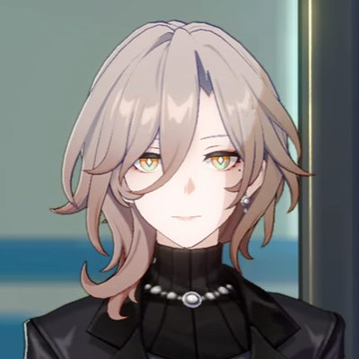
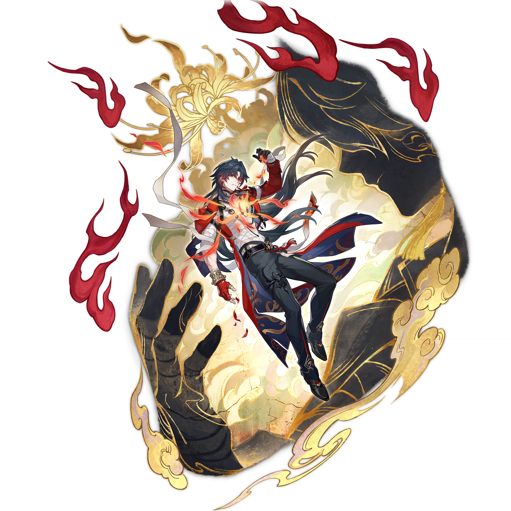
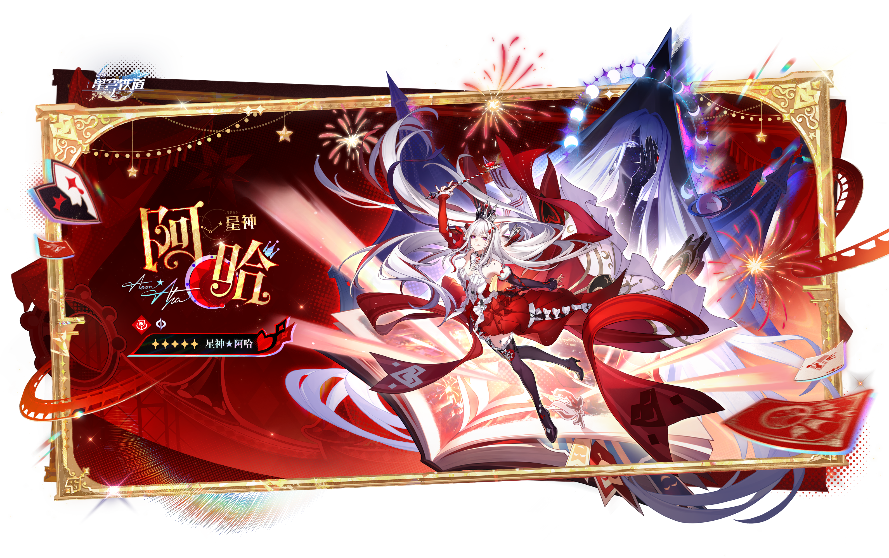

# 与兽共舞·4.6前瞻特辑 — 2026.09.21
> 视频类型：B · 主题类型合集
> 主题说明：崩铁 4.6「月升之前，与兽共舞」前瞻特别节目特辑——五张壁纸对应 4.6 前瞻的五大热点角色，每人一张 16:9 横版 + 一张 20:9 手机竖版，共 10 条 prompts。全系列共用同一套「月升之前 + 与兽共舞」视觉基调：每张画面中都有一位「兽」（古兽阴影/巨兽爪/翼兽/深海古兽/星神大马戏的狂欢兽群意象）+ 中秋前夜的月色余韵，角色主题色点亮
> 热点背景：①崩铁 4.6 前瞻特别节目昨晚（9/20 19:30）播出，版本「月升之前，与兽共舞」9/28 上线，兑换码今晚 23:59 到期，前瞻热度正处峰值；②上半卡池真珠+绯英、下半卡池虚照+千冶·刃，真珠与千冶·刃为讨论度最高的配队新核心；③剧情核心朽叶（贪饕古兽×治安官双重身份）社区热议爆表；④风堇星琼新时装「一眼万年」「青春版八重樱」刷屏；⑤9/25 中秋节将至（4 天），月色话题持续
> 涉及角色：朽叶（4.6 剧情核心·新晋热议角色）、千冶·刃（4.6 下半卡池·火属性虚无命途）、阿哈（欢愉星神·前瞻特别节目包装主角）、风堇（前瞻公布星琼新时装的主角）、真珠（4.6 上半卡池·智械美神）
> 选定类型理由：昨晚 4.6 前瞻刚播完，今日热点呈「多点爆发」形态——新卡池（真珠/千冶·刃）、剧情核心（朽叶）、新时装（风堇）、特别节目主角（阿哈）同时高热，天然适合多角色横向展示 → 类型 B 特辑。若做类型 A，最优候选朽叶尚未确认实装、官方全身立绘未公开（仅 400px 角色卡），素材风险高；次优千冶·刃为男性角色（类型 A 性别系数 0.5 不满足例外条款）→ 按规范改选 B 类多角色合集消化，千冶·刃以成员身份入列
> 选角理由：朽叶=4.6 剧情绝对核心+社区热议峰值+工作区首次覆盖；千冶·刃=4.6 下半卡池+前瞻解析讨论度最高+动画短片刚放出；阿哈=前瞻特别节目包装主角+「可以成为我母亲的女人」系列热梗；风堇=星琼新时装刷屏+「青春版八重樱」话题；真珠=4.6 上半卡池新五星+「海中的维纳斯」称号语（工作区已覆盖单人集，本篇以主题新场景复用）
> 参考图说明：朽叶参考图已下载自 B站WIKI（xiuye-official.png 400px 角色卡 + xiuye-avatar.png 头像，经视觉校对：灰粉棕中长波浪卷发+蓬松刘海、琥珀金瞳、左眼下小泪痣、珍珠串颈链+圆形胸针、黑色高领内搭+黑色皮质外套、温柔浅笑）；千冶·刃立绘已下载自 B站WIKI（qianye-splash.png 2048px，经视觉校对：深青黑长发发梢红渐变、金红瞳、白色绷带缠胸与左臂、胸口金红火焰莲纹发光、敞开的绯红+藏蓝金纹长袍、黑色束脚长裤金饰流苏、左手红色露指手套、金色臂环、身后巨大黑兽爪剪影环抱金云、金色菊花纹、红焰飘带）；阿哈/风堇/真珠外观描述沿用工作区已视觉校对的官方立绘资料（阿哈 splash-art.png、风堇 splash-art.png、真珠 splash-art-2.png）

---

## 1（朽叶·月升之前的执勤夜）

Positive Prompt:
16:9 2K wallpaper, Xiuye from Honkai: Star Rail, highly detailed anime-style illustration, polished game-art quality, a dreamlike city street in the hour before moonrise.

A quiet boulevard of the whimsical dream-city Er Yuan Le Yuan (Two-Phase Paradise) at night, pastel facades dimmed to blue-grey silhouettes under a faint pre-moonrise glow, string lights half-lit, paper posters fluttering. Xiuye stands alone in the middle of the empty street on night patrol, her black leather coat swaying in a gentle wind, one hand tucked in her coat pocket, the other holding a glowing patrol lantern low at her side, her gaze turned directly at the viewer with a soft gentle smile that is just a little too calm — the smile of a sheriff who knows exactly what she is. Her unmistakable features: ash-brown shoulder-length wavy hair with loose messy bangs, warm amber-orange eyes, a tiny beauty mark under her left eye, a pearl-strand choker with a round silver brooch at her high black collar. Behind her, cast across the pavement by the lantern light, her shadow is subtly wrong — it stretches and rises into the colossal silhouette of a ravenous ancient beast with curling horns and a ring of faint amber eyes, barely visible, as if the beast inside her is stretching before the moon rises. Cool blue-grey night palette with amber lantern glow and pearl-white accents, thin moonlit mist along the street, one faint full-moon halo low behind the rooftops. highly detailed background, sharp focus on Xiuye.

perfect hands, five fingers on each hand, anatomically correct hands, well-defined fingers, one hand relaxed in pocket, the other gripping the lantern handle naturally, natural hand pose.

Negative Prompt:
low quality, worst quality, blurry, pixelated, bad anatomy, extra limbs, bad hands, extra fingers, fewer fingers, missing fingers, fused fingers, webbed fingers, merged fingers, overlapping fingers, deformed fingers, mutated fingers, six fingers, four fingers, three fingers, more than five fingers, less than five fingers, disfigured hands, poorly drawn hands, bad hand anatomy, asymmetrical hands, broken fingers, claw hands, blurry hands, indistinct fingers, smeared hands, wrong hair color, wrong eye color, male, wrong gender, full moon high in sky, bright daylight, sunny sky, chibi, photorealistic, 3D render, text, watermark, logo, signature.

## 1b（朽叶·同景手机竖版）

Positive Prompt:
20:9 vertical mobile wallpaper, same scene and character as the previous image: Xiuye from Honkai: Star Rail standing in the middle of a moonlit dream-city boulevard on night patrol, tall vertical composition with the faint pre-moonrise halo glowing above the rooftops at the top of the frame, the boulevard receding below her feet. Ash-brown shoulder-length wavy hair with messy bangs, warm amber-orange eyes, a tiny beauty mark under her left eye, pearl-strand choker with round silver brooch, black high-collar top and swaying black leather coat, one hand in her pocket, the other holding a glowing patrol lantern at her side, soft smile with a hint of something ancient. Across the pavement her shadow rises into the colossal horned silhouette of an ancient beast with faint amber eyes, lantern light stretching it long. Cool blue-grey palette with amber lantern glow, thin mist, paper posters on the walls. highly detailed anime-style illustration, sharp focus on Xiuye, quietly unsettling pre-moonrise mood.

perfect hands, five fingers on each hand, anatomically correct hands, well-defined fingers, natural hand pose.

Negative Prompt:
low quality, worst quality, blurry, pixelated, bad anatomy, extra limbs, bad hands, extra fingers, fewer fingers, missing fingers, fused fingers, webbed fingers, merged fingers, overlapping fingers, deformed fingers, mutated fingers, six fingers, four fingers, three fingers, more than five fingers, less than five fingers, disfigured hands, poorly drawn hands, bad hand anatomy, asymmetrical hands, broken fingers, claw hands, blurry hands, indistinct fingers, smeared hands, wrong hair color, wrong eye color, male, wrong gender, full moon high in sky, bright daylight, landscape orientation, wide horizontal framing, chibi, photorealistic, 3D render, text, watermark, logo, signature.

---

## 2（千冶·刃·忿怒本相·以身为剑）

Positive Prompt:
16:9 2K wallpaper, Qianye Blade from Honkai: Star Rail, highly detailed anime-style illustration, polished game-art quality, a wrathful ascension tableau of fire and swords.

He floats at the center of a vast ritual circle of golden clouds, arms half-spread, suspended between heaven and a sea of blade-light. A gigantic dark beast claw, ink-black with golden cloud patterns, curls around the radiant cloud-sea behind him like a mountain cradling fire — the manifestation of his wrath. At his sternum blazes a crimson-gold fire lotus, its petals of flame scattering embers upward. His unmistakable features: long dark teal-black hair with red gradient tips streaming upward in the heat, sharp golden-red eyes burning with calm fury, white bandage wraps around his torso and left forearm, an open crimson and navy long coat embroidered with golden cloud motifs and dark blue lining billowing around him, black fitted trousers with an ornate belt, hanging tassels and jade accents, a red fingerless glove on his left hand, a heavy gold bangle on his right wrist. Around him, translucent sword-shapes of light rise from the clouds to form a towering barrier array, golden chrysanthemum petals and crimson flame ribbons spiraling in the updraft, thin cracks of ember light running through the cloud sea. Deep crimson, gold and ink-black palette with teal hair accents, solemn overwhelming power, highly detailed background, sharp focus on Qianye Blade.

perfect hands, five fingers on each hand, anatomically correct hands, well-defined fingers, both hands relaxed and half-open at his sides with fingers naturally extended, natural hand pose.

Negative Prompt:
low quality, worst quality, blurry, pixelated, bad anatomy, extra limbs, bad hands, extra fingers, fewer fingers, missing fingers, fused fingers, webbed fingers, merged fingers, overlapping fingers, deformed fingers, mutated fingers, six fingers, four fingers, three fingers, more than five fingers, less than five fingers, disfigured hands, poorly drawn hands, bad hand anatomy, asymmetrical hands, broken fingers, claw hands, blurry hands, indistinct fingers, smeared hands, wrong hair color, wrong eye color, female, wrong gender, bright daylight, blue sky, cute, chibi, photorealistic, 3D render, text, watermark, logo, signature.

## 2b（千冶·刃·同景手机竖版）

Positive Prompt:
20:9 vertical mobile wallpaper, same scene and character as the previous image: Qianye Blade from Honkai: Star Rail floating at the center of a towering vertical composition, tall frame rising from a golden cloud-sea below to the colossal dark beast claw curling overhead like a wrathful god's hand, the crimson-gold fire lotus blazing at his sternum. Long dark teal-black hair with red gradient tips streaming upward, sharp golden-red eyes, white bandage wraps on torso and left forearm, open crimson and navy coat with golden cloud embroidery billowing, black fitted trousers with ornate belt and tassels, red fingerless glove, heavy gold bangle. Translucent swords of light rise in a vertical array through the frame, golden chrysanthemum petals and crimson flame ribbons spiraling upward, ember cracks glowing in the clouds. Deep crimson, gold and ink-black palette, highly detailed anime-style illustration, sharp focus on Qianye Blade, solemn overwhelming wrath.

perfect hands, five fingers on each hand, anatomically correct hands, well-defined fingers, both hands relaxed and half-open at his sides, natural hand pose.

Negative Prompt:
low quality, worst quality, blurry, pixelated, bad anatomy, extra limbs, bad hands, extra fingers, fewer fingers, missing fingers, fused fingers, webbed fingers, merged fingers, overlapping fingers, deformed fingers, mutated fingers, six fingers, four fingers, three fingers, more than five fingers, less than five fingers, disfigured hands, poorly drawn hands, bad hand anatomy, asymmetrical hands, broken fingers, claw hands, blurry hands, indistinct fingers, smeared hands, wrong hair color, wrong eye color, female, wrong gender, bright daylight, landscape orientation, wide horizontal framing, cute, chibi, photorealistic, 3D render, text, watermark, logo, signature.

---

## 3（阿哈·千星城大马戏开演之夜）

Positive Prompt:
16:9 2K wallpaper, Aha the Aeon of Elation from Honkai: Star Rail, highly detailed anime-style illustration, polished game-art quality, the grand premiere night of a celestial circus.

A colossal open storybook lies spread across a crimson velvet stage like a floating island, its pages curling into ramps and balconies, golden filigree framing the scene. Aha floats playfully above the book's glowing pages mid-twirl, one leg kicked back, one arm raised high flourishing a conductor's baton trailing stardust, the other hand scattering a fan of glowing playing cards into the air, head tilted back laughing — pure mischief given divine form. Her unmistakable features: extremely long flowing white hair filling the air like silk ribbons, bright red eyes sparkling with delight, a small ornate crown tilted on her head, a black choker with a red gem. She wears her canonical frilly red and white gown with layered ruffles and bow details, detached white puffs at the shoulders, long black gloves, dark thigh-high boots with red bows. Around her, fireworks of red and gold burst across the dark circus tent sky, floating playing cards and comedy-tragedy masks drift on the updraft, spotlights of warm red cutting through the dark, tiny masked revelers (clown-ish silhouettes and marching toy beasts) parading along the book's edges below. Rich crimson and gold palette with white hair contrast, ecstatic carnival energy, a faint silver full-moon glow peeking through the tent's crown opening. highly detailed background, sharp focus on Aha.

perfect hands, five fingers on each hand, anatomically correct hands, well-defined fingers, one hand flourishing the baton high, the other fanning the playing cards, natural hand pose.

Negative Prompt:
low quality, worst quality, blurry, pixelated, bad anatomy, extra limbs, bad hands, extra fingers, fewer fingers, missing fingers, fused fingers, webbed fingers, merged fingers, overlapping fingers, deformed fingers, mutated fingers, six fingers, four fingers, three fingers, more than five fingers, less than five fingers, disfigured hands, poorly drawn hands, bad hand anatomy, asymmetrical hands, broken fingers, claw hands, blurry hands, indistinct fingers, smeared hands, wrong hair color, wrong eye color, male, wrong gender, horror, creepy, dark gritty atmosphere, daylight, chibi, photorealistic, 3D render, text, watermark, logo, signature.

## 3b（阿哈·同景手机竖版）

Positive Prompt:
20:9 vertical mobile wallpaper, same scene and character as the previous image: Aha the Aeon of Elation from Honkai: Star Rail floating mid-twirl above a colossal open glowing storybook, tall vertical composition with the circus tent's dark canopy and bursting red-gold fireworks rising to the top of the frame where a faint silver full moon glows through the crown opening. Extremely long flowing white hair filling the vertical frame like silk ribbons, bright red laughing eyes, small tilted ornate crown, black choker with red gem, canonical frilly red and white gown with layered ruffles, long black gloves, dark thigh-high boots with red bows, one arm raised flourishing a stardust baton, glowing playing cards and comedy-tragedy masks drifting upward around her, tiny masked revelers parading on the book's pages far below. Rich crimson and gold palette with white hair contrast, highly detailed anime-style illustration, sharp focus on Aha, ecstatic divine carnival energy.

perfect hands, five fingers on each hand, anatomically correct hands, well-defined fingers, natural hand pose.

Negative Prompt:
low quality, worst quality, blurry, pixelated, bad anatomy, extra limbs, bad hands, extra fingers, fewer fingers, missing fingers, fused fingers, webbed fingers, merged fingers, overlapping fingers, deformed fingers, mutated fingers, six fingers, four fingers, three fingers, more than five fingers, less than five fingers, disfigured hands, poorly drawn hands, bad hand anatomy, asymmetrical hands, broken fingers, claw hands, blurry hands, indistinct fingers, smeared hands, wrong hair color, wrong eye color, male, wrong gender, horror, creepy, daylight, landscape orientation, wide horizontal framing, chibi, photorealistic, 3D render, text, watermark, logo, signature.

---

## 4（风堇·与翼兽共舞的春日圆舞曲）

Positive Prompt:
16:9 2K wallpaper, Hyacine from Honkai: Star Rail, highly detailed anime-style illustration, polished game-art quality, a joyful dance with a winged companion under the first light of the pre-moonrise sky.

On a floating meadow island drifting in a pastel dusk sky, Hyacine dances a carefree waltz with her companion — a small chubby winged unicorn with cream-white fur, a fluffy pink mane, a tiny golden crown and a sky-blue bow — the unicorn hovering on its little wings to match her twirl, both of them mid-spin with hooves and toes just brushing the flower grass. Her unmistakable features: pink curly twin-tails with teal-blue inner streaks bouncing with the spin, bright teal eyes curved with laughter, a red beret with a white ribbon bow. She wears her canonical outfit: white puff-sleeve blouse, a deep crimson bodice with gold embroidery and gold tassel ornaments, a layered white skirt fluttering in the spin, black mary-jane shoes with red bows, large soft cream angel wings spread wide behind her. In her hand she holds her tall vine staff crowned with sunflowers, ribbons of rainbow light spiraling around the dancing pair like a maypole streamer, wildflowers and drifting petals caught in their wake. Soft pre-moonrise palette: warm rose-gold horizon melting into lavender-blue, a slim crescent of the coming moon low on the horizon, gentle rim light on her wings. joyful healing mood, highly detailed background, sharp focus on Hyacine.

perfect hands, five fingers on each hand, anatomically correct hands, well-defined fingers, one hand holding the sunflower staff aloft, the other hand extended toward her companion, natural hand pose.

Negative Prompt:
low quality, worst quality, blurry, pixelated, bad anatomy, extra limbs, bad hands, extra fingers, fewer fingers, missing fingers, fused fingers, webbed fingers, merged fingers, overlapping fingers, deformed fingers, mutated fingers, six fingers, four fingers, three fingers, more than five fingers, less than five fingers, disfigured hands, poorly drawn hands, bad hand anatomy, asymmetrical hands, broken fingers, claw hands, blurry hands, indistinct fingers, smeared hands, wrong hair color, wrong eye color, male, wrong gender, dark night, horror, gritty, chibi, photorealistic, 3D render, text, watermark, logo, signature.

## 4b（风堇·同景手机竖版）

Positive Prompt:
20:9 vertical mobile wallpaper, same scene and character as the previous image: Hyacine from Honkai: Star Rail twirling in a waltz with her small winged unicorn companion on a floating flower meadow island, tall vertical composition rising from the meadow flowers below through the dancing pair to a soft lavender dusk sky with a slim crescent moon at the top. Pink curly twin-tails with teal-blue inner streaks bouncing mid-spin, bright teal laughing eyes, red beret with white ribbon bow, white puff-sleeve blouse, deep crimson bodice with gold embroidery and tassels, layered white skirt in motion, black mary-jane shoes, large cream angel wings spread, sunflower-crowned vine staff held aloft, rainbow ribbon of light spiraling up around them, petals drifting. Warm rose-gold and lavender palette, gentle rim light, highly detailed anime-style illustration, sharp focus on Hyacine, joyful healing mood.

perfect hands, five fingers on each hand, anatomically correct hands, well-defined fingers, natural hand pose.

Negative Prompt:
low quality, worst quality, blurry, pixelated, bad anatomy, extra limbs, bad hands, extra fingers, fewer fingers, missing fingers, fused fingers, webbed fingers, merged fingers, overlapping fingers, deformed fingers, mutated fingers, six fingers, four fingers, three fingers, more than five fingers, less than five fingers, disfigured hands, poorly drawn hands, bad hand anatomy, asymmetrical hands, broken fingers, claw hands, blurry hands, indistinct fingers, smeared hands, wrong hair color, wrong eye color, male, wrong gender, dark night, landscape orientation, wide horizontal framing, chibi, photorealistic, 3D render, text, watermark, logo, signature.

---

## 5（真珠·深海古兽圆舞曲）

Positive Prompt:
16:9 2K wallpaper, Pearl from Honkai: Star Rail, highly detailed anime-style illustration, polished game-art quality, a graceful underwater ballroom waltz with a gentle leviathan.

In the astral deep sea beneath a moon-filtered surface far above, an immense gentle sea beast — a whale-like ancient leviathan with a shell of constellations on its back and trails of stardust from its fins — coils in a slow circle around Pearl as they dance, its vast eye calm and warm, moonlight shafts piercing the blue water between them. Pearl glides along the leviathan's current with arms extended in an opening ballet port de bras, her long hair and ribbons floating weightlessly, small bubbles of pearl-light rising around her. Her unmistakable features: extremely long pale-golden cream hair with pale-blue gradient inner streaks drifting like sea silk, light blue eyes serene and luminous, her golden tiara circlet with a central blue gem and pearl accents. She wears her canonical outfit: a white strapless top with exposed shoulders, a large blue scallop-shell drape over her right shoulder, wide flowing white detached sleeves, coral-red ribbons trailing at her chest, a blue bow sash, a white layered high-slit skirt billowing in the water, subtle golden android joints glinting at her wrists and knees. Schools of tiny glowing fish part around her like living confetti, giant pearls rest on the seabed coral below, ink-wash soft mountains of deep blue in the far distance. Cool deep-blue palette with cream-gold and coral accents, majestic tender mood, highly detailed background, sharp focus on Pearl.

perfect hands, five fingers on each hand, anatomically correct hands, well-defined fingers, both arms extended gracefully with fingers softly separated, natural hand pose.

Negative Prompt:
low quality, worst quality, blurry, pixelated, bad anatomy, extra limbs, bad hands, extra fingers, fewer fingers, missing fingers, fused fingers, webbed fingers, merged fingers, overlapping fingers, deformed fingers, mutated fingers, six fingers, four fingers, three fingers, more than five fingers, less than five fingers, disfigured hands, poorly drawn hands, bad hand anatomy, asymmetrical hands, broken fingers, claw hands, blurry hands, indistinct fingers, smeared hands, wrong hair color, wrong eye color, missing tiara, male, wrong gender, scary monster, sharp teeth, dark gritty atmosphere, daylight surface scene, chibi, photorealistic, 3D render, text, watermark, logo, signature.

## 5b（真珠·同景手机竖版）

Positive Prompt:
20:9 vertical mobile wallpaper, same scene and character as the previous image: Pearl from Honkai: Star Rail gliding in a weightless underwater waltz, tall vertical composition rising from the coral seabed with giant pearls below, through the dancing pair, to the moon-filtered water surface glowing far above — the immense constellation-shelled sea leviathan coiling in a slow circle around her, its vast gentle eye watching from beside the frame. Extremely long pale-golden cream hair with pale-blue inner streaks floating like sea silk, light blue serene eyes, golden tiara with central blue gem and pearls, canonical white strapless outfit with blue scallop-shell drape on her right shoulder, wide detached sleeves, coral-red ribbons, blue bow sash, white high-slit skirt billowing, golden android joints glinting. Schools of glowing fish parting around her, bubbles of pearl-light rising, moonlight shafts cutting the deep blue. Cool deep-blue palette with cream-gold and coral accents, highly detailed anime-style illustration, sharp focus on Pearl, majestic tender underwater nocturne.

perfect hands, five fingers on each hand, anatomically correct hands, well-defined fingers, natural hand pose.

Negative Prompt:
low quality, worst quality, blurry, pixelated, bad anatomy, extra limbs, bad hands, extra fingers, fewer fingers, missing fingers, fused fingers, webbed fingers, merged fingers, overlapping fingers, deformed fingers, mutated fingers, six fingers, four fingers, three fingers, more than five fingers, less than five fingers, disfigured hands, poorly drawn hands, bad hand anatomy, asymmetrical hands, broken fingers, claw hands, blurry hands, indistinct fingers, smeared hands, wrong hair color, wrong eye color, missing tiara, male, wrong gender, scary monster, sharp teeth, daylight, landscape orientation, wide horizontal framing, chibi, photorealistic, 3D render, text, watermark, logo, signature.

---

## 注
- 全系列统一视觉基调：「月升之前 + 与兽共舞」——每张画面中都有一位「兽」（朽叶=影中古兽、千冶·刃=巨兽之爪、阿哈=马戏兽群意象、风堇=翼兽伙伴、真珠=深海古兽）+ 中秋前夜的月色余韵（月晕/新月/水面月光/穹顶月色），角色主题色点亮（朽叶琥珀+珍珠白、千冶·刃绯红+鎏金、阿哈猩红+金、风堇粉+青+彩虹、真珠奶油金+珊瑚红）。第 1 条朽叶为风格基调定义图，后续角色可引用其生成图作为系列氛围参考。
- 每角色 16:9 横版 + 20:9 竖版成对产出，方便视频「横屏展示+竖屏特写」交替剪辑；手机竖版比例按 2026-09-18 定稿规范使用 20:9。
- 朽叶尚未确认实装（4.6 卡池公开角色为真珠/绯英/虚照/千冶·刃），本篇将其定位为「4.6 剧情核心角色」，prompts 仅基于已视觉校对的 400px 官方角色卡描述其已公开外观（灰粉棕波浪发、琥珀瞳、珍珠颈链、黑衣），未虚构额外服饰细节；若官方后续公布全身立绘，可再补一条升级版。
- 千冶·刃的伴生元素「忿怒本相·巨兽之爪」已通过官方立绘（qianye-splash.png）视觉确认：身后巨大黑兽爪金色云纹环抱，prompts 按此描述。
- 风堇 4.6 星琼新时装官方高清图暂未入库（B站WIKI 暂无该时装图源），本篇采用其已校对的常服装扮；新时装热度留给 titles.md 文案层面承载。
