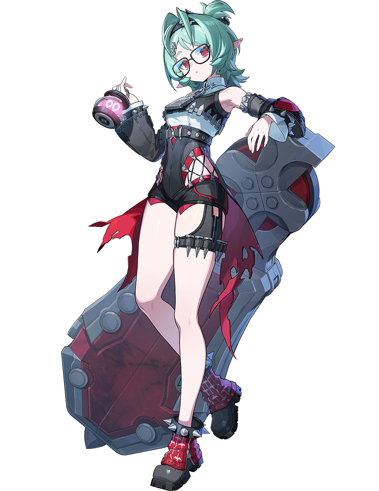
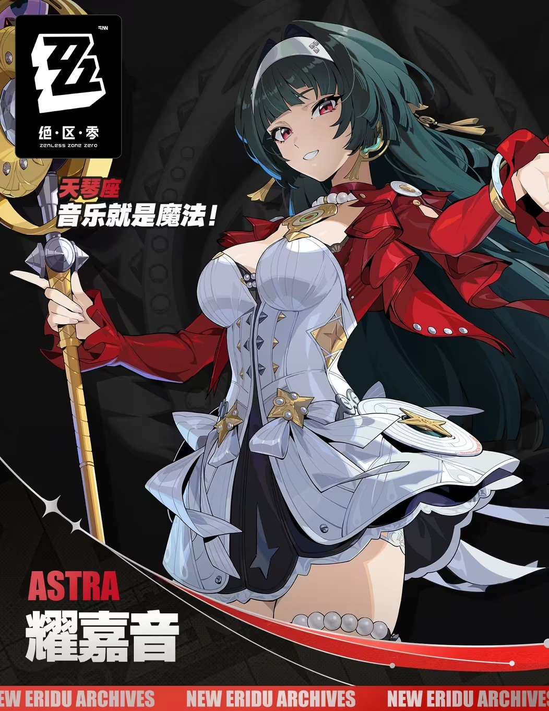
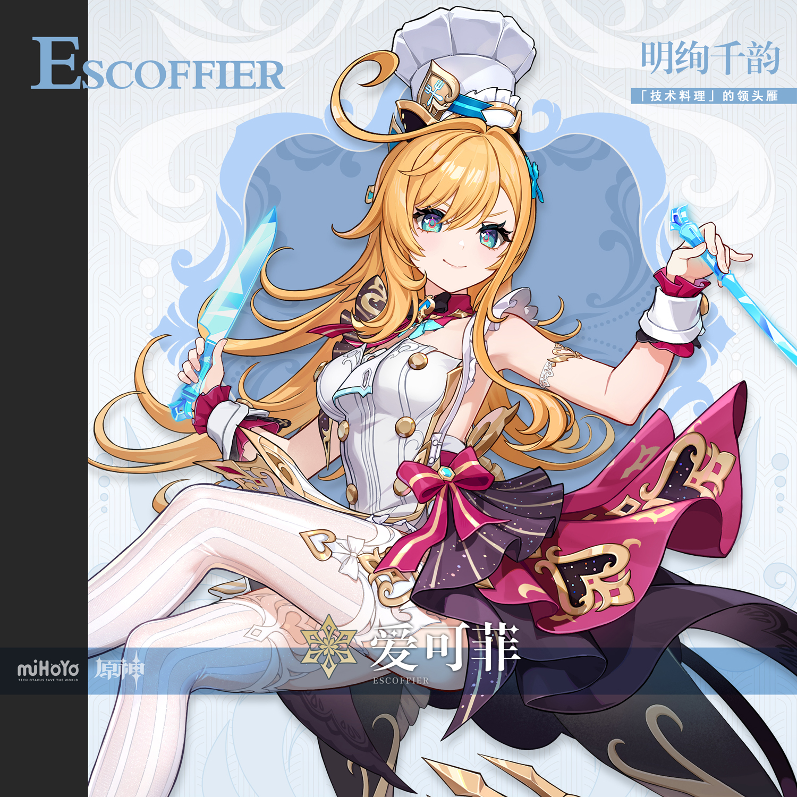

# 国庆黄金周·假日写真 — 2026.10.01
> 视频类型：B · 主题类型合集
> 统一比例：**3:4 竖版**（`3:4 vertical portrait wallpaper`），8 条 prompts 全部一致
> 主题说明：国庆黄金周「假日写真」特辑——六位角色各自踏上黄金周旅途，在列车站台、老街古镇、花火夜市、山间花田、美食市集、海岸观景台留下假日影像。统一视觉母题：**旅行影像 + 假日金光**——每张画面必须出现一个「摄影/旅行元素」（相机、拍立得照片、胶片、行李箱、伴手礼纸袋任选其一），整体为暖金色秋日假日光 + 红金节日点缀，成片像一卷黄金周旅行胶片
> 热点背景：①今天 10/1 国庆节，黄金周出游是全网最强时事节点（景区人从众、特种兵旅游、逛吃逛吃）；②原神六周年余热正盛，10/2 命座自选、10/3 十连签到（耀星烁熠累计登录今日 04:00 开启）；③绝区零 3.2 下半卡池 9/30 刚开，洛克茜（风·击破）热度正盛；④崩铁 4.6 在版本中期，可做新角色已全覆盖，热点让位国庆节点
> 涉及角色：三月七（星穹列车·赵相机·工作区首次单人入列）、洛克茜（绝区零 3.2 下半新角色·翘班女王）、宵宫（长野原烟花店·花火匠人）、流萤（春信皮肤·假日出街形态）、耀嘉音（大明星微服出游）、爱可菲（技术料理领头雁·逛吃担当）
> 选定类型理由：今日无单一角色爆发型热点（崩铁 4.6 角色已全覆盖、原神 7.2 瓦列里立绘尚未放出、六周年特辑昨日已做）→ 时事节点国庆黄金周适合多角色横向展示 → 类型 B
> 选角理由：①三月七=相机不离身、网名「赵相机」、3.6 剧情实锤「本体就是照相机」，与「旅行拍照」主题完美咬合，且工作区从未单独覆盖；②洛克茜=3.2 卡池 9/30 刚开热度正盛，官方台词「来得正好，翘班的理由找到了」就是黄金周翘班旅游代言人；③宵宫=烟花与节日天然绑定，国庆夜市花火场景专属；④流萤=「春信」皮肤本身就是假日出街造型（花束+伴手礼纸袋）；⑤耀嘉音=大明星微服私游的反差感；⑥爱可菲=黄金周「逛吃逛吃」的美食担当。全女性阵容，2 原神 + 2 崩铁 + 2 绝区零，三游戏均衡
> 参考图说明：六人均沿用工作区已视觉校对的官方立绘——三月七（开学季JK制服学园/march7th-splash.png：粉白短发呆毛、粉紫渐变瞳、蓝白制服裙、腰挂蓝色相机）、洛克茜（绝区零/洛克茜/splash-art.png：薄荷绿短发高马尾、红瞳圆框眼镜、尖耳、黑白朋克短打、巨型轮盾）、宵宫（原神/宵宫/image-1.png 官方面部特写：橙发琥珀瞳、花火发饰）、流萤（皮肤立绘 skin-spring-letter-splash.png）、耀嘉音（绝区零/耀嘉音/official-intro.png 官方档案卡）、爱可菲（原神/爱可菲/splash-art.png 官方介绍图）
> ⚠️ 参考图错位备忘（未改动文件，仅记录）：`原神/宵宫/image.png` 实为耀嘉音官方立绘；`绝区零/耀嘉音/splash-art.png` 为一张 AI 生成的刻晴涂鸦壁纸（非官方素材）；`崩坏星穹铁道/流萤/original-splash-art.png` 仅为 100px 缩略头像不可用。本次已分别改用正确文件
> 系列画面规则：所有画面统一暖金色假日光 + 红金节日小点缀；每张必须出现相机/拍立得/行李/伴手礼等旅行元素之一；第一位角色 prompt 最详细定义基调，后续角色引用第一张图作风格参考但**不可复制人物姿态**；尺度把控：成年角色、姿态优雅不露点，negative 统一排除 nude/topless/childlike

---

## 1（三月七·站台的出发快门）【基调定义 · 最详细】

Positive Prompt:
3:4 vertical portrait wallpaper, March 7th from Honkai: Star Rail, highly detailed anime-style illustration, polished game-art quality, a sunlit retro railway station platform on the first morning of a golden-week holiday, warm golden autumn sunlight streaming diagonally across the platform, a vintage suitcase and a backpack standing beside a wooden bench, red-and-gold festive bunting flags strung above the platform, drifting maple leaves. March 7th stands in the center of the platform, weight on one leg in a natural bouncy stance, leaning slightly forward with her blue-and-white compact camera raised to her eye to take a snapshot, one eye closed in a cheerful wink, her other hand waving high in the air toward the viewer, five fingers on each hand, fingers naturally curled, well-defined fingers. Her expression is pure holiday excitement — a wide radiant grin, sparkling eyes, cheeks slightly flushed with departure-day thrill. Keep March 7th's recognizable features: shoulder-length messy pink-white hair with a large bouncy ahoge sticking up from the top of her head, pink-to-violet gradient eyes, fair skin, petite youthful figure. She wears her canonical outfit: white sailor-style blouse with a blue ribbon bow at the collar, short blue jacket with white bows and a four-petal flower badge on the sleeve, dark blue pleated skirt with white trim, black waist corset piece, her blue-and-white compact camera hanging at her hip on a strap, white socks and dark shoes. Soft golden rim light from the morning sun, warm amber and cream palette with pink and blue accents echoing her hair and outfit, faint ice-crystal sparkles floating around her like confetti, joyful "first day of the trip" atmosphere, film-travel-photo warm tones. tasteful and elegant throughout, no explicit content. Perfect hands, five fingers on each hand, anatomically correct hands, well-defined fingers, natural hand pose. Correct hip-to-thigh-to-knee anatomy, natural leg proportions, natural standing posture.

Negative Prompt:
low quality, worst quality, blurry, pixelated, bad anatomy, extra limbs, bad hands, extra fingers, fewer fingers, missing fingers, fused fingers, webbed fingers, merged fingers, overlapping fingers, deformed fingers, mutated fingers, six fingers, four fingers, three fingers, more than five fingers, less than five fingers, disfigured hands, poorly drawn hands, bad hand anatomy, asymmetrical hands, broken fingers, claw hands, blurry hands, indistinct fingers, smeared hands, missing legs, missing feet, missing calves, cropped legs, legs out of frame, twisted legs, rotated hips, dislocated hip, extra legs, third leg, fused legs, malformed knees, knees bending in opposite directions, unnatural sitting pose, disproportionate limbs, elongated calves, deformed feet, nude, topless, nipples, areola, explicit, childlike, loli, underage, male, wrong hair color, wrong eye color, incorrect character, text, watermark, logo, signature.

---

## 2（三月七·列车窗边的拍立得整理）

Referring to the attached first artwork for style, lighting, and holiday atmosphere only, generate a 3:4 vertical portrait wallpaper of March 7th from Honkai: Star Rail in the same warm golden-week travel mood. March 7th sits upright by the large window of a vintage star-train observation car, knees together, feet flat on the floor, a small fold-out table before her covered with freshly shaken polaroid photos of her trip. She holds one polaroid up toward the light with both hands, five fingers on each hand, fingers naturally curled around its edges, admiring it with a soft, satisfied smile and slightly curved happy eyes; a few more polaroids tucked into her jacket pocket. Keep all her canonical features from the first artwork: shoulder-length messy pink-white hair with a large ahoge, pink-to-violet gradient eyes, white sailor-style blouse with blue ribbon bow, short blue jacket with white bows and flower badge, dark blue pleated skirt, blue compact camera resting on the table beside the photos. Outside the window a golden-hour landscape rolls past — sunlit fields, distant mountains, drifting clouds tinted amber; warm sunlight pools on the table and catches the polaroid frames, red-and-gold festive ribbon tied around a cup on the table, cozy end-of-a-perfect-holiday-day atmosphere, film warm tones. tasteful and elegant throughout, no explicit content. Perfect hands, five fingers on each hand, anatomically correct hands, well-defined fingers. Correct hip-to-thigh-to-knee anatomy, natural leg proportions, natural seated posture.

Negative Prompt:
low quality, worst quality, blurry, pixelated, bad anatomy, extra limbs, bad hands, extra fingers, fewer fingers, missing fingers, fused fingers, webbed fingers, merged fingers, overlapping fingers, deformed fingers, mutated fingers, six fingers, four fingers, three fingers, more than five fingers, less than five fingers, disfigured hands, poorly drawn hands, bad hand anatomy, asymmetrical hands, broken fingers, claw hands, blurry hands, indistinct fingers, smeared hands, missing legs, missing feet, missing calves, cropped legs, legs out of frame, twisted legs, rotated hips, dislocated hip, extra legs, third leg, fused legs, malformed knees, knees bending in opposite directions, unnatural sitting pose, one leg crossed over the other, disproportionate limbs, elongated calves, deformed feet, nude, topless, nipples, areola, explicit, childlike, loli, underage, male, wrong hair color, wrong eye color, incorrect character, text, watermark, logo, signature.

---

## 3（洛克茜·天台翘班的假日）

Referring to the attached first artwork for style, lighting, and holiday atmosphere only, generate a 3:4 vertical portrait wallpaper of Lucy (Luoxixi / Lucía) from Zenless Zone Zero in the same warm golden-week travel mood. Lucy lounges on the rooftop terrace of a small holiday café overlooking a sunlit city, sitting side-saddle on a rattan chair with both knees together and pointing in the same direction, calves hanging down side by side in natural parallel alignment, one arm draped lazily over the chair back, her other hand holding a retro film camera resting on her lap, fingers naturally curled, well-defined fingers. Her expression is the picture of a perfectly justified day off — eyes half-lidded behind her round glasses, a lazy smug little smirk, chin slightly lifted, as if to say "slacking off? this is scheduled rest." Keep Lucy's recognizable features: short mint-green hair tied up in a small high ponytail with loose bangs, vivid red eyes behind thin round glasses, long pointed elf-like ears, fair skin, slender figure. She wears her canonical outfit: white cropped sleeveless top under a black buckled harness vest, black corset-style shorts with red criss-cross lacing at the hips, studded thigh strap with ammunition loops on her left thigh, oversized black detached sleeve on one arm, dark choker, red-patterned ankle boots, her giant gunmetal gear-like wheel shield leaning against the wall behind the chair, a small lantern with a glowing pink face sitting on the café table beside an iced drink. Warm late-afternoon golden light washing over the rooftop, string lights and a small red-gold holiday ornament on the railing, faint teal wind swirls drifting past, laid-back "recharge day" atmosphere, film warm tones. tasteful and elegant throughout, no explicit content. Perfect hands, five fingers on each hand, anatomically correct hands, well-defined fingers. Correct hip-to-thigh-to-knee anatomy, natural leg proportions, natural seated posture.

Negative Prompt:
low quality, worst quality, blurry, pixelated, bad anatomy, extra limbs, bad hands, extra fingers, fewer fingers, missing fingers, fused fingers, webbed fingers, merged fingers, overlapping fingers, deformed fingers, mutated fingers, six fingers, four fingers, three fingers, more than five fingers, less than five fingers, disfigured hands, poorly drawn hands, bad hand anatomy, asymmetrical hands, broken fingers, claw hands, blurry hands, indistinct fingers, smeared hands, missing legs, missing feet, missing calves, cropped legs, legs out of frame, twisted legs, rotated hips, dislocated hip, extra legs, third leg, fused legs, malformed knees, knees bending in opposite directions, unnatural sitting pose, one leg crossed over the other, disproportionate limbs, elongated calves, deformed feet, nude, topless, nipples, areola, explicit, childlike, loli, underage, male, wrong hair color, wrong eye color, incorrect character, text, watermark, logo, signature.

---

## 4（宵宫·夜市的花火职责）

Referring to the attached first artwork for style, lighting, and holiday atmosphere only, generate a 3:4 vertical portrait wallpaper of Yoimiya from Genshin Impact in the same warm golden-week travel mood. Yoimiya stands in a bustling holiday night market street, weight on one leg in a natural relaxed stance, both arms raised high above her head in a proud presenter pose — fingers naturally curled, well-defined fingers — presenting the night sky where her own handmade fireworks are blooming in huge golden and red chrysanthemum bursts above the market lanterns. Her face is lit from below by warm lantern light, turned up toward the fireworks with a wide delighted open-mouthed grin, amber-orange eyes sparkling with reflected light. Keep Yoimiya's recognizable features: bright orange-blonde hair tied in a high spiky ponytail with a large red-and-gold braided rope ornament, straight bangs with loose face-framing strands, golden-amber eyes, flower and firework hairpins pinned on the left side of her head, fair skin. She wears her canonical outfit: short orange kimono-style coat slipping off both shoulders, decorated with goldfish and firework patterns, cream inner top, red obi sash tied at her back, dark fitted shorts, her red rope belt with a small golden firework charm. Rows of red lanterns and festival stalls with candy apples and masks line the street, a film camera hanging around her neck on a strap, floating embers and paper confetti in red and gold, lively festive "festival made by hand" atmosphere, film warm tones. tasteful and elegant throughout, no explicit content. Perfect hands, five fingers on each hand, anatomically correct hands, well-defined fingers, natural hand pose.

Negative Prompt:
low quality, worst quality, blurry, pixelated, bad anatomy, extra limbs, bad hands, extra fingers, fewer fingers, missing fingers, fused fingers, webbed fingers, merged fingers, overlapping fingers, deformed fingers, mutated fingers, six fingers, four fingers, three fingers, more than five fingers, less than five fingers, disfigured hands, poorly drawn hands, bad hand anatomy, asymmetrical hands, broken fingers, claw hands, blurry hands, indistinct fingers, smeared hands, missing legs, missing feet, missing calves, cropped legs, legs out of frame, twisted legs, rotated hips, dislocated hip, extra legs, third leg, fused legs, malformed knees, knees bending in opposite directions, disproportionate limbs, elongated calves, deformed feet, nude, topless, nipples, areola, explicit, childlike, loli, underage, male, wrong hair color, wrong eye color, incorrect character, text, watermark, logo, signature.

---

## 5（流萤·古镇的伴手礼巡礼）

Referring to the attached first artwork for style, lighting, and holiday atmosphere only, generate a 3:4 vertical portrait wallpaper of Firefly from Honkai: Star Rail in her casual spring-letter outing outfit, in the same warm golden-week travel mood. Firefly walks down a sun-dappled old-town shopping street lined with wooden storefronts and hanging red-gold festive ornaments, weight on one leg mid-step in a natural walking stance, hugging a kraft-paper shopping bag full of souvenir boxes against her chest with one arm, five fingers on each hand, fingers naturally curled around the bag, her other hand holding up a small paw-shaped pastry toward the viewer with a delighted look. Her expression is bright and gentle — a warm open smile, eyes curved with joy, cheeks faintly pink from the autumn sun. Keep all her canonical features from the reference: long silver-gray hair with soft teal-green gradient at the tips, a pale headband, gentle blue eyes, fair slim figure. She wears her canonical spring-letter outfit: white sailor-collar jacket with gold buttons and green plaid bow at the collar, gray-blue plaid pleated skirt, white thigh-high socks with a small clover emblem, brown loafers, a yellow ribbon trailing from her shopping bag. A film camera dangles from her wrist on a strap, golden afternoon light filtering through ginkgo leaves, falling leaves drifting past the storefronts, steam rising from a street-food stall behind her, cozy souvenir-hunting holiday atmosphere, film warm tones. tasteful and elegant throughout, no explicit content. Perfect hands, five fingers on each hand, anatomically correct hands, well-defined fingers, natural hand pose.

Negative Prompt:
low quality, worst quality, blurry, pixelated, bad anatomy, extra limbs, bad hands, extra fingers, fewer fingers, missing fingers, fused fingers, webbed fingers, merged fingers, overlapping fingers, deformed fingers, mutated fingers, six fingers, four fingers, three fingers, more than five fingers, less than five fingers, disfigured hands, poorly drawn hands, bad hand anatomy, asymmetrical hands, broken fingers, claw hands, blurry hands, indistinct fingers, smeared hands, missing legs, missing feet, missing calves, cropped legs, legs out of frame, twisted legs, rotated hips, dislocated hip, extra legs, third leg, fused legs, malformed knees, knees bending in opposite directions, disproportionate limbs, elongated calves, deformed feet, nude, topless, nipples, areola, explicit, childlike, loli, underage, male, wrong hair color, wrong eye color, incorrect character, text, watermark, logo, signature.

---

## 6（流萤·湖畔的野餐午后）

Referring to the attached first artwork for style, lighting, and holiday atmosphere only, generate a 3:4 vertical portrait wallpaper of Firefly from Honkai: Star Rail in her casual spring-letter outing outfit, in the same warm golden-week travel mood. Firefly sits on a red-and-white checkered picnic blanket on a lakeside hillside meadow, sitting upright with her knees together and both feet tucked neatly to one side in a natural side-saddle pose, calves in natural parallel alignment, a wicker picnic basket with sandwiches and a thermos beside her. She holds a polaroid photo up in both hands at chest height, five fingers on each hand, fingers naturally curled, gazing at it with a soft wistful smile — the polaroid showing a blurred golden landscape. Keep all her canonical features from the reference: long silver-gray hair with teal-green gradient tips, pale headband, gentle blue eyes, white sailor-collar jacket with green plaid bow, gray-blue plaid pleated skirt, white thigh-high socks. Her blue compact camera rests on the picnic blanket beside the basket, a scatter of maple leaves and one red-gold festive ribbon on the blanket, the calm lake reflecting warm sunset gold, distant hills in soft haze, tranquil "last afternoon of the holiday" atmosphere, film warm tones. tasteful and elegant throughout, no explicit content. Perfect hands, five fingers on each hand, anatomically correct hands, well-defined fingers. Correct hip-to-thigh-to-knee anatomy, natural leg proportions, natural seated posture.

Negative Prompt:
low quality, worst quality, blurry, pixelated, bad anatomy, extra limbs, bad hands, extra fingers, fewer fingers, missing fingers, fused fingers, webbed fingers, merged fingers, overlapping fingers, deformed fingers, mutated fingers, six fingers, four fingers, three fingers, more than five fingers, less than five fingers, disfigured hands, poorly drawn hands, bad hand anatomy, asymmetrical hands, broken fingers, claw hands, blurry hands, indistinct fingers, smeared hands, missing legs, missing feet, missing calves, cropped legs, legs out of frame, twisted legs, rotated hips, dislocated hip, extra legs, third leg, fused legs, malformed knees, knees bending in opposite directions, unnatural sitting pose, one leg crossed over the other, disproportionate limbs, elongated calves, deformed feet, nude, topless, nipples, areola, explicit, childlike, loli, underage, male, wrong hair color, wrong eye color, incorrect character, text, watermark, logo, signature.

---

## 7（耀嘉音·微服出巡的观景台）

Referring to the attached first artwork for style, lighting, and holiday atmosphere only, generate a 3:4 vertical portrait wallpaper of Astra Yao from Zenless Zone Zero in the same warm golden-week travel mood. Astra Yao stands at a scenic coastal overlook at golden hour, weight on one hip in a natural elegant stance, wearing a wide-brimmed straw sun hat and oversized sunglasses pushed up on her head as a flimsy incognito disguise over her white headband, one hand tilting the hat brim with fingers elegantly relaxed, natural hand pose, her other hand holding a stack of freshly taken polaroid photos against her chest. Her expression is playful and conspiratorial — red-pink eyes glancing sideways at the viewer past the hat brim, lips curved in a mischievous half-smile, the look of a superstar happily convinced that nobody has recognized her yet (several passersby in the soft-focus background clearly have). Keep Astra Yao's recognizable features: long dark-green hair flowing past her waist, white headband, vivid red-pink eyes, fair skin, elegant curvy feminine figure. She wears her canonical outfit: white corset-style idol dress with a layered white-and-black skirt, red cropped jacket with gold buttons slipping off one shoulder, pearl necklace, pearl beads around her right thigh, black heels, her golden halo-shaped staff tucked against the overlook railing like a treasured travel companion, a film camera hanging at her side on a strap. Golden sunset light over a glittering sea below, seabirds in the warm sky, red-gold festive ribbon fluttering on the overlook railing, glamorous-yet-cozy "vacation in disguise" atmosphere, film warm tones. tasteful and elegant throughout, no explicit content. Perfect hands, five fingers on each hand, anatomically correct hands, well-defined fingers, natural hand pose.

Negative Prompt:
low quality, worst quality, blurry, pixelated, bad anatomy, extra limbs, bad hands, extra fingers, fewer fingers, missing fingers, fused fingers, webbed fingers, merged fingers, overlapping fingers, deformed fingers, mutated fingers, six fingers, four fingers, three fingers, more than five fingers, less than five fingers, disfigured hands, poorly drawn hands, bad hand anatomy, asymmetrical hands, broken fingers, claw hands, blurry hands, indistinct fingers, smeared hands, missing legs, missing feet, missing calves, cropped legs, legs out of frame, twisted legs, rotated hips, dislocated hip, extra legs, third leg, fused legs, malformed knees, knees bending in opposite directions, disproportionate limbs, elongated calves, deformed feet, nude, topless, nipples, areola, explicit, childlike, loli, underage, male, wrong hair color, wrong eye color, incorrect character, text, watermark, logo, signature.

---

## 8（爱可菲·市集的逛吃巡视）

Referring to the attached first artwork for style, lighting, and holiday atmosphere only, generate a 3:4 vertical portrait wallpaper of Escoffier from Genshin Impact in the same warm golden-week travel mood. Escoffier stands at a bustling holiday food market street, weight on one leg in a natural confident stance, holding a paper food tray of assorted market snacks in one hand at chest height — fingers naturally curled around the tray, well-defined fingers — her other hand raising her ice-blue crystal fork toward a skewer, a delicate swirl of frosty air keeping the snacks perfectly chilled. Her expression is the focused delight of a master chef on an inspection tour — bright aqua-blue eyes narrowed with professional approval, a pleased smile, one eyebrow slightly raised as she evaluates the street food against her own standards. Keep Escoffier's recognizable features: long wavy blonde hair, aqua-blue eyes with a light teal tint, fair skin, her tall white chef hat with blue accents, a small blue star hairpin. She wears her canonical outfit: white corset-style chef top with gold buttons and a red cravat at the collar, layered magenta-purple skirt with gold embroidery patterns, white knee-high boots, her ice-blue crystal knife and fork, delicate gold filigree on her arm. Market stalls with steaming dumplings, candied fruit and grilled skewers line the street under strings of red lanterns and red-gold festive bunting, golden evening light mixing with warm stall glow, a film camera hanging around her neck, lively gourmet-holiday atmosphere, film warm tones. tasteful and elegant throughout, no explicit content. Perfect hands, five fingers on each hand, anatomically correct hands, well-defined fingers, natural hand pose.

Negative Prompt:
low quality, worst quality, blurry, pixelated, bad anatomy, extra limbs, bad hands, extra fingers, fewer fingers, missing fingers, fused fingers, webbed fingers, merged fingers, overlapping fingers, deformed fingers, mutated fingers, six fingers, four fingers, three fingers, more than five fingers, less than five fingers, disfigured hands, poorly drawn hands, bad hand anatomy, asymmetrical hands, broken fingers, claw hands, blurry hands, indistinct fingers, smeared hands, missing legs, missing feet, missing calves, cropped legs, legs out of frame, twisted legs, rotated hips, dislocated hip, extra legs, third leg, fused legs, malformed knees, knees bending in opposite directions, disproportionate limbs, elongated calves, deformed feet, nude, topless, nipples, areola, explicit, childlike, loli, underage, male, wrong hair color, wrong eye color, incorrect character, text, watermark, logo, signature.

---

## 注
- 六人 = 国庆黄金周六个经典度假切片：出发（三月七）、翘班（洛克茜）、节庆（宵宫）、逛吃（爱可菲）、买手信（流萤）、微服打卡（耀嘉音）+ 三月七/流萤各加一张「旅程收尾」情感向，共 8 条。
- 社区梗素材（titles.md 头部已记录 URL）：三月七「赵相机」「本体是照相机」（3.6 剧情实锤）、「六十七种身世故事」；洛克茜「来得正好，翘班的理由找到了」+「拐力天花板」；耀嘉音官方档案卡「天琴座·音乐就是魔法！」；爱可菲「技术料理的领头雁」；宵宫「长野原烟花店」；流萤「春信」皮肤出街形态。
- 参考图错位备忘：`原神/宵宫/image.png` 实为耀嘉音官方立绘、`绝区零/耀嘉音/splash-art.png` 为 AI 生成刻晴壁纸、`崩坏星穹铁道/流萤/original-splash-art.png` 为 100px 缩略图——本次均已绕开，改用正确文件（宵宫 image-1.png 脸部特写 / 耀嘉音 official-intro.png / 流萤 skin-spring-letter-splash.png）。建议后续手动归位。
- 全员女性阵容，无性别系数问题；比例统一 3:4，场景互不重复（海滨仅作耀嘉音远景，避免与已有「千星城海滨度假」主题正面重复）。
