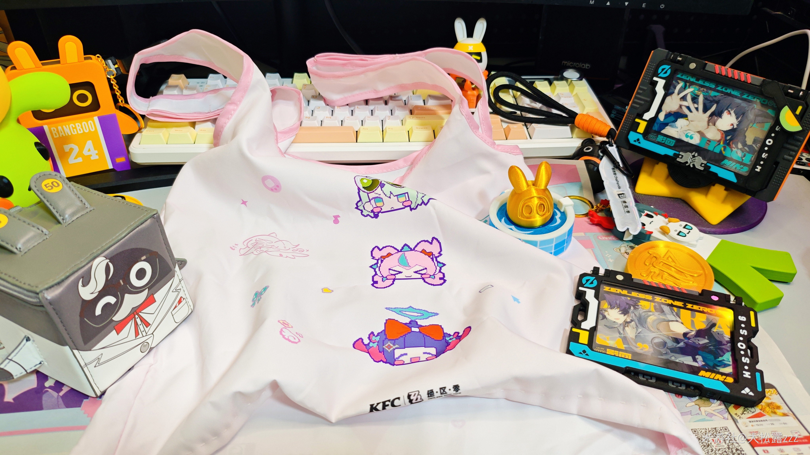
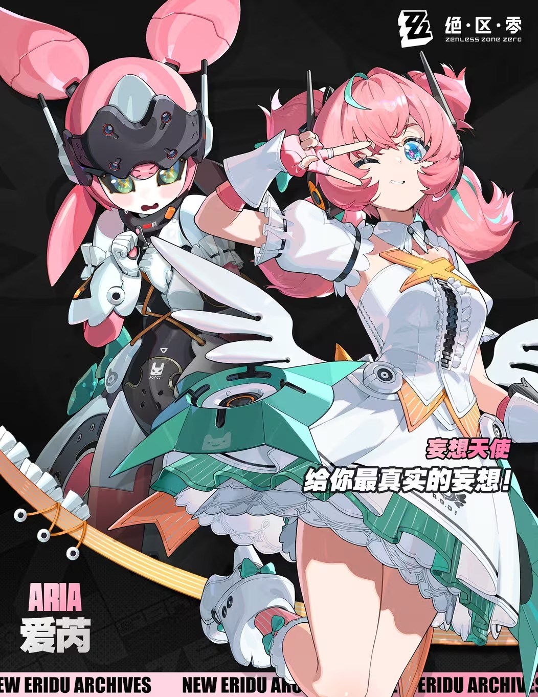
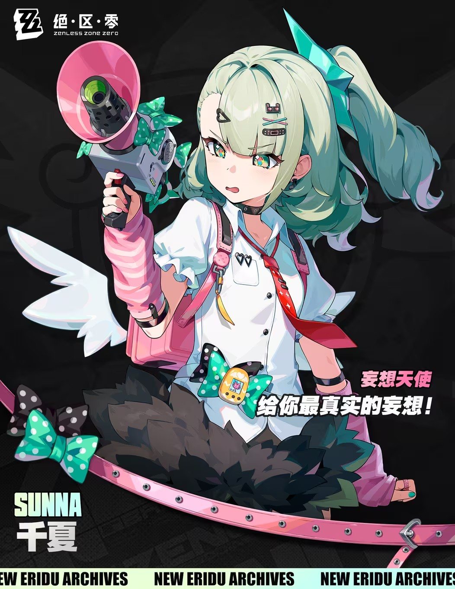

# 妄想天使·KFC小背心天团 — 2026.08.29
> 视频类型：B · 主题类型合集
> 主题说明：绝区零「妄想天使」虚拟偶像组合 × 肯德基联动「小背心」帆布袋梗被官方采纳为 3.2/3.3 版本免费时装，社区热度爆炸
> 热点背景：8月28日绝区零3.2前瞻直播官宣「妄想天使阵营系列时装」免费送，玩家梗「老大我们这样穿真的会提高人气吗」被振宇叔叔亲自实现，8月29日全网热传「感谢振宇」「官方最懂玩家」
> 涉及角色：南宫羽、爱芮、千夏（妄想天使三小只）
> 统一画风：highly detailed anime-style illustration, polished 3D-cel-shaded game-art quality, vibrant pastel idol-stage lighting with creamy white and soft pink atmosphere

---

## 主题风格参考

主题基调定义：以 KFC×妄想天使 联动帆布袋为灵感——纯白无袖短款背心配粉色滚边，正面印有像素风三小只Q版印花、星星与音符图案，底部带有 KFC 与 ZZZ 标志；下身搭配各具角色特色的短裙/短裤，整体为元气偶像舞台风。背景为梦幻 pastel 演唱会场景：巨型LED屏、心形气球、金粉纸屑与暖色聚光灯。

---

## 1（南宫羽 · 背心舞台首秀 — 风格定义图）

Positive Prompt:
16:9 2K wallpaper, Nangong Yu from Zenless Zone Zero, highly detailed anime-style illustration, polished 3D-cel-shaded game-art quality, vibrant pastel idol-stage lighting with creamy white and soft pink atmosphere.

Depict Nangong Yu center stage at a KFC-themed pop-idol concert, wearing the Delusion Angels × KFC collaboration tank-top outfit: a sleeveless white cropped tank top with pink scalloped trim along the collar and armholes, the front printed with colorful chibi pixel-art mascots of the Delusion Angels trio, scattered tiny stars, musical notes, and heart motifs in pastel pink and teal, with small KFC and Zenless Zone Zero logos near the bottom hem. She pairs this with a high-waisted glossy black pleated mini skirt featuring pink side stripes, sheer black thigh-high stockings with a single pink stripe at the top, and chunky black platform sneakers with pink laces and teal wing-shaped decals. She retains her signature black hair styled into two large round pink buns with teal wing hairpins, her sharp crimson-red eyes, and the small teal angel halo floating above her head. Her mechanical wing accessories on her back are folded into a compact V-shape, glowing faintly pink. She strikes a confident idol pose: one hand on her hip, the other holding a microphone shaped like a miniature KFC bucket with teal and pink accents, her expression playful and inviting with a slight wink toward the audience. The stage behind her is a dreamy pastel idol concert set: massive LED screens showing the Delusion Angels logo, floating heart-shaped balloons, confetti cannons releasing pink and white paper, and warm spotlights casting soft pink halos. Color palette: KFC red, creamy white, pastel pink, teal accent, stage gold. Perfect hands, five fingers on each hand, anatomically correct hands, well-defined fingers, natural hand pose, detailed hands, clean finger separation.

Negative Prompt:
low quality, worst quality, blurry, pixelated, bad anatomy, bad hands, extra fingers, fewer fingers, missing fingers, fused fingers, webbed fingers, merged fingers, overlapping fingers, deformed fingers, mutated fingers, six fingers, four fingers, three fingers, more than five fingers, less than five fingers, disfigured hands, poorly drawn hands, bad hand anatomy, asymmetrical hands, broken fingers, claw hands, blurry hands, indistinct fingers, smeared hands, extra limbs, chibi, photorealistic, wrong hair color, wrong eye color, missing angel halo, missing mechanical wings, dark gloomy atmosphere, medieval clothing, text, watermark, logo, signature.

---

## 2（南宫羽 · 背心特写肖像）

Referring to the attached image (Figure 1), generate a similar style close-up portrait of Nangong Yu from Zenless Zone Zero.

She wears the Delusion Angels × KFC white cropped tank top with pink scalloped trim and chibi pixel-art prints. Her large pink buns and teal wing hairpins frame her face perfectly. Her crimson-red eyes gaze directly at the viewer with a confident, slightly teasing expression — the look of an idol who knows she just turned a shopping bag into a sold-out concert. One hand reaches toward the camera as if offering a high-five, fingers perfectly defined and relaxed. Dramatic stage lighting from the upper left casts soft pink and gold across her features, with a pure creamy-white to pastel-pink gradient background. Her signature teal angel halo glows softly above her head. Color palette: creamy white, pastel pink, teal accent, stage gold. Perfect hands, five fingers on each hand, anatomically correct hands, well-defined fingers, natural hand pose, detailed hands, clean finger separation.

Negative Prompt:
low quality, worst quality, blurry, pixelated, bad anatomy, bad hands, extra fingers, fewer fingers, missing fingers, fused fingers, webbed fingers, merged fingers, overlapping fingers, deformed fingers, mutated fingers, six fingers, four fingers, three fingers, more than five fingers, less than five fingers, disfigured hands, poorly drawn hands, bad hand anatomy, asymmetrical hands, broken fingers, claw hands, blurry hands, indistinct fingers, smeared hands, extra limbs, chibi, photorealistic, wrong hair color, wrong eye color, missing angel halo, dark gloomy atmosphere, busy background, text, watermark, logo, signature.

---

## 3（爱芮 · 背心舞台元气 shot）

Referring to the attached image (Figure 1), generate a similar style image for Aria from Zenless Zone Zero on the same KFC-themed idol stage.

Depict Aria in the matching Delusion Angels × KFC tank-top outfit: a sleeveless white cropped tank top with pink scalloped trim, colorful chibi pixel-art prints of the trio, scattered stars and musical notes, and small KFC/ZZZ logos near the hem. She pairs it with a layered frilly mini skirt in white and mint green, white knee-high socks with pink ruffled cuffs, and chunky white platform boots with mint-green star decals. She retains her signature pink twin-tails with teal streaks, bright blue eyes, and her small mechanical companion robot floating beside her — the robot humorously wears a tiny matching white tank-top vest with a miniature pink KFC logo. Aria strikes a cheerful idol pose: both hands making peace signs near her cheeks, winking with a bright infectious smile, one leg kicked back playfully. The stage background matches Figure 1's dreamy pastel concert atmosphere: LED screens, heart balloons, confetti. Color palette shifts to mint green and soft pink as her main accent, with creamy white base. Perfect hands, five fingers on each hand, anatomically correct hands, well-defined fingers, natural hand pose, detailed hands, clean finger separation.

Negative Prompt:
low quality, worst quality, blurry, pixelated, bad anatomy, bad hands, extra fingers, fewer fingers, missing fingers, fused fingers, webbed fingers, merged fingers, overlapping fingers, deformed fingers, mutated fingers, six fingers, four fingers, three fingers, more than five fingers, less than five fingers, disfigured hands, poorly drawn hands, bad hand anatomy, asymmetrical hands, broken fingers, claw hands, blurry hands, indistinct fingers, smeared hands, extra limbs, chibi, photorealistic, wrong hair color, wrong eye color, missing robot companion, dark gloomy atmosphere, medieval clothing, text, watermark, logo, signature.

---

## 4（爱芮 · 与机器人伙伴后台小憩）

Referring to the attached image (Figure 1), generate a similar style image for Aria and her companion robot backstage at the KFC pop-up idol cafe.

Aria sits casually on a stack of pink KFC promotional boxes, wearing the white cropped tank top and layered frilly skirt. Her pink twin-tails bounce as she leans forward, offering a single french fry to her companion robot with an outstretched hand. The robot, wearing its tiny white KFC vest and looking adorable, reaches out with both mechanical hands to accept the fry. Aria's bright blue eyes sparkle with amusement, her expression soft and genuine. Backstage is cozy and intimate: warm amber lighting, scattered costume racks with Delusion Angels outfits, posters of the group on the walls, and a half-empty drink cup on a folding table. Color palette: warm white, mint green, soft pink, amber backstage light. Perfect hands, five fingers on each hand, anatomically correct hands, well-defined fingers, natural hand pose, detailed hands, clean finger separation.

Negative Prompt:
low quality, worst quality, blurry, pixelated, bad anatomy, bad hands, extra fingers, fewer fingers, missing fingers, fused fingers, webbed fingers, merged fingers, overlapping fingers, deformed fingers, mutated fingers, six fingers, four fingers, three fingers, more than five fingers, less than five fingers, disfigured hands, poorly drawn hands, bad hand anatomy, asymmetrical hands, broken fingers, claw hands, blurry hands, indistinct fingers, smeared hands, extra limbs, chibi, photorealistic, wrong hair color, wrong eye color, missing robot companion, dark gloomy atmosphere, text, watermark, logo, signature.

---

## 5（千夏 · 背心舞台迫真营业）

Referring to the attached image (Figure 1), generate a similar style image for Sunna from Zenless Zone Zero on the same KFC-themed idol stage.

Depict Sunna in the matching Delusion Angels × KFC tank-top outfit: a sleeveless white cropped tank top with pink scalloped trim and chibi pixel-art prints, paired with a black pleated mini skirt with jagged pink hem accents, mismatched legwear — one pink thigh-high stocking and one white knee-high sock — and black sneakers with pink soles. She retains her signature pale mint-green side ponytail tied with a teal ribbon, her green eyes, and her small white angel wings on her back. She holds her iconic pink megaphone, now decorated with KFC stickers and a tiny Delusion Angels keychain dangling from the handle. Her expression is slightly flustered but determined — the composer forced onto the stage, gripping the megaphone like a lifeline, cheeks faintly blushing. The stage background matches Figure 1's pastel concert atmosphere with LED screens and heart balloons. Color palette: mint green, creamy white, KFC red accent, soft pink. Perfect hands, five fingers on each hand, anatomically correct hands, well-defined fingers, natural hand pose, detailed hands, clean finger separation.

Negative Prompt:
low quality, worst quality, blurry, pixelated, bad anatomy, bad hands, extra fingers, fewer fingers, missing fingers, fused fingers, webbed fingers, merged fingers, overlapping fingers, deformed fingers, mutated fingers, six fingers, four fingers, three fingers, more than five fingers, less than five fingers, disfigured hands, poorly drawn hands, bad hand anatomy, asymmetrical hands, broken fingers, claw hands, blurry hands, indistinct fingers, smeared hands, extra limbs, chibi, photorealistic, wrong hair color, wrong eye color, missing white wings, dark gloomy atmosphere, medieval clothing, text, watermark, logo, signature.

---

## 6（千夏 · 主题咖啡店打工中）

Referring to the attached image (Figure 1), generate a similar style image for Sunna working at a KFC × Delusion Angels themed pop-up cafe.

Sunna wears the white cropped tank top, a black apron with the Delusion Angels logo printed in pink over it, and a small KFC employee visor cap tilted sideways on her head. Her mint-green side ponytail is tied with a pink bow. She holds a tray with a KFC bucket and a drink in one hand, while the other hand adjusts her visor. Her expression is slightly overwhelmed but polite, green eyes showing a hint of exhaustion — the composer who just wanted to write songs but ended up serving fries. The cafe interior is pastel idol-themed: pink and white booths, neon signs in teal and pink, posters of her own group on the walls, and a small stage corner with a karaoke machine. Color palette: warm cafe lighting, mint green, soft pink, creamy white, amber wood tones. Perfect hands, five fingers on each hand, anatomically correct hands, well-defined fingers, natural hand pose, detailed hands, clean finger separation.

Negative Prompt:
low quality, worst quality, blurry, pixelated, bad anatomy, bad hands, extra fingers, fewer fingers, missing fingers, fused fingers, webbed fingers, merged fingers, overlapping fingers, deformed fingers, mutated fingers, six fingers, four fingers, three fingers, more than five fingers, less than five fingers, disfigured hands, poorly drawn hands, bad hand anatomy, asymmetrical hands, broken fingers, claw hands, blurry hands, indistinct fingers, smeared hands, extra limbs, chibi, photorealistic, wrong hair color, wrong eye color, missing white wings, dark gloomy atmosphere, text, watermark, logo, signature.

---

## 7（妄想天使小背心天团 · 三人合照）

Referring to the attached image (Figure 1), generate a similar style group image featuring Nangong Yu, Aria, and Sunna from Zenless Zone Zero together on the KFC idol stage.

The trio stands in a dynamic idol group formation: Nangong Yu center-front with her KFC-bucket microphone held high, Aria to her left with both hands making peace signs and winking, Sunna to her right holding her decorated megaphone with a determined pout. All three wear matching Delusion Angels × KFC white cropped tank tops with pink scalloped trim and chibi prints, each paired with their own styled bottom — Nangong's black pleated skirt with pink stripes, Aria's layered white-and-mint frilly skirt, Sunna's jagged-hem black skirt with mismatched legwear. Their signature hairstyles and colors are clearly distinguishable: Nangong's black hair with large pink buns and teal wing hairpins, Aria's pink twin-tails with teal streaks, Sunna's mint-green side ponytail with teal ribbon. Behind them, a massive LED screen displays the KFC × Delusion Angels collaboration logo in bold red and white, and the stage erupts with pink and white confetti, heart-shaped balloons, and warm golden spotlights. The mood is joyful, energetic, and triumphant — three girls who turned a shopping-bag meme into a stadium-filling concert. Color palette: creamy white, pastel pink, teal accents, KFC red highlights, stage gold. Perfect hands, five fingers on each hand, anatomically correct hands, well-defined fingers, natural hand pose, detailed hands, clean finger separation.

Negative Prompt:
low quality, worst quality, blurry, pixelated, bad anatomy, bad hands, extra fingers, fewer fingers, missing fingers, fused fingers, webbed fingers, merged fingers, overlapping fingers, deformed fingers, mutated fingers, six fingers, four fingers, three fingers, more than five fingers, less than five fingers, disfigured hands, poorly drawn hands, bad hand anatomy, asymmetrical hands, broken fingers, claw hands, blurry hands, indistinct fingers, smeared hands, extra limbs, chibi, photorealistic, wrong hair color, wrong eye color, missing angel halo, missing mechanical wings, missing robot companion, missing white wings, dark gloomy atmosphere, medieval clothing, text, watermark, logo, signature.

---

## 8（竖屏壁纸 · 妄想天使小背心天团）

Positive Prompt:
9:16 2K vertical wallpaper, Nangong Yu, Aria, and Sunna from Zenless Zone Zero, highly detailed anime-style illustration, polished 3D-cel-shaded game-art quality, dramatic vertical idol group composition.

The trio is arranged in a vertical stack against a dreamy pastel concert backdrop: Sunna at the top holding her pink megaphone toward the sky with a flustered expression, Nangong Yu in the center striking a confident pose with her KFC-bucket microphone, and Aria at the bottom making a cheerful peace sign with both hands and winking. All three wear the matching Delusion Angels × KFC white cropped tank tops with pink scalloped trim and chibi prints. Floating heart-shaped balloons, musical notes, and golden confetti fill the vertical frame. A massive LED screen behind them glows with the collaboration logo. The composition draws the eye upward through the group, emphasizing their unity and energy. Color palette: creamy white, pastel pink, teal accents, KFC red highlights, stage gold. Perfect hands, five fingers on each hand, anatomically correct hands, well-defined fingers, natural hand pose, detailed hands, clean finger separation.

Negative Prompt:
low quality, worst quality, blurry, pixelated, bad anatomy, bad hands, extra fingers, fewer fingers, missing fingers, fused fingers, webbed fingers, merged fingers, overlapping fingers, deformed fingers, mutated fingers, six fingers, four fingers, three fingers, more than five fingers, less than five fingers, disfigured hands, poorly drawn hands, bad hand anatomy, asymmetrical hands, broken fingers, claw hands, blurry hands, indistinct fingers, smeared hands, extra limbs, chibi, photorealistic, wrong hair color, wrong eye color, horizontal composition, wide shot, dark gloomy atmosphere, text, watermark, logo, signature.

---

## 注

**角色准确外观要点**（经官方立绘视觉确认）：

- **南宫羽**：
  - 发色：黑色基底，两侧大型粉色圆球状发髻（类似花朵/包子头），配有青色羽翼发饰
  - 瞳色：深红/玫红色
  - 头部：青色天使光环悬浮于头顶
  - 背部：可折叠的机械羽翼配件，青白色，带星形装饰
  - 面部：自信、略带挑逗感的表情，眼型锐利
  - 气质：队长/编舞担当，舞台掌控力强，偶像气场全开
  - 武器/道具：大型机械麦克风-锤形武器，带有青色与粉色装饰

- **爱芮**：
  - 发色：粉色双马尾，发尾带有青色挑染
  - 瞳色：明亮的蓝色
  - 面部：元气治愈的少女形象，常带 wink 表情
  - 服装：白色与薄荷绿为主色调的偶像裙装，星星与爱心元素
  - 伴生元素：小型机械机器人伙伴——粉黑头盔、黑色面罩、白色装甲、兔耳天线，性格胆小怕生
  - 气质：主唱/门面担当，活泼可爱，但私下是个小机器人

- **千夏**：
  - 发色：淡薄荷绿/青绿色，侧单马尾，用青色丝带系起
  - 瞳色：青绿色
  - 面部：略带无奈/认真的表情，容易害羞
  - 头部：白色小天使羽翼于耳后/背部，猫耳发箍（部分造型）
  - 服装：白色衬衫配红色领带、黑色荷叶边短裙、粉色袖套
  - 道具：粉色扩音器/喇叭，带有装饰丝带
  - 气质：作曲家/幕后核心，被迫营业的社恐偶像

**参考图说明**：
- `nangongyu-base.png`：B站WIKI官方角色立绘（透明背景），完整展示发型、发饰、机械羽翼、武器
- `airui-base.png`：B站WIKI官方角色立绘（透明背景），展示粉色双马尾、蓝眼、机器人伙伴
- `qianxia-base.png`：B站WIKI官方角色立绘（透明背景），展示薄荷绿侧马尾、扩音器、白色羽翼
- `ref-kfc-bag1.jpg`：米游社玩家分享的 KFC×妄想天使 联动帆布袋实拍，小背心梗的起源素材

**社区热梗素材**（供 titles.md 使用）：
- 「老大我们这样穿真的会提高人气吗？」——官方前瞻台词，背心梗核心
- 「感谢振宇！」——社区弹幕/评论高频词，感谢制作人采纳玩家梗
- 「起初人们只是在玩梗，直到你振宇叔叔看到了」——B站二创金句
- 「不是，你还真把那袋子做成衣服了啊？」——玩家震惊语录
- 「妄想天使 给你最真实的妄想！」——组合官方口号
- 「南宫羽一个人就能顶十个！」——管家梗的偶像版误传（误用）
- 水熊老师画小背心珀尔曼、振宇/小Y穿上小背心的P图二创——社区整活高峰
