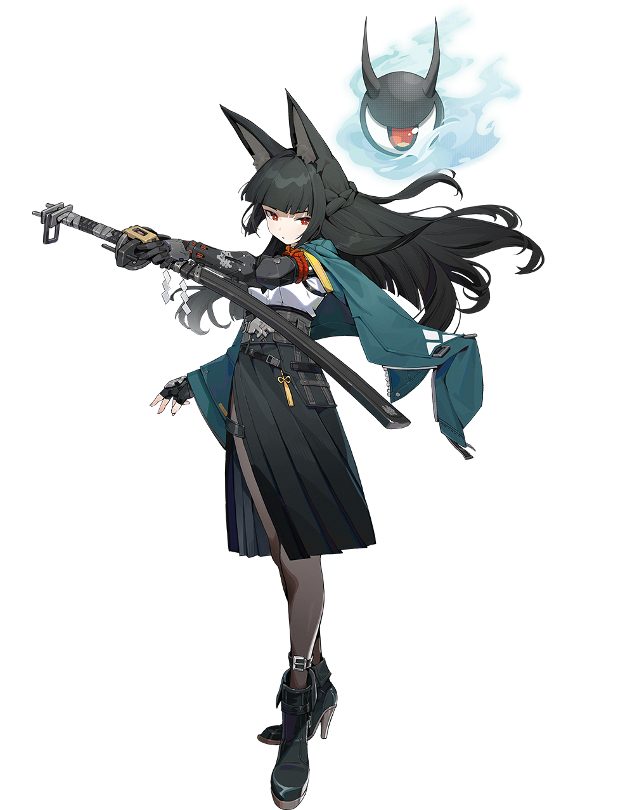
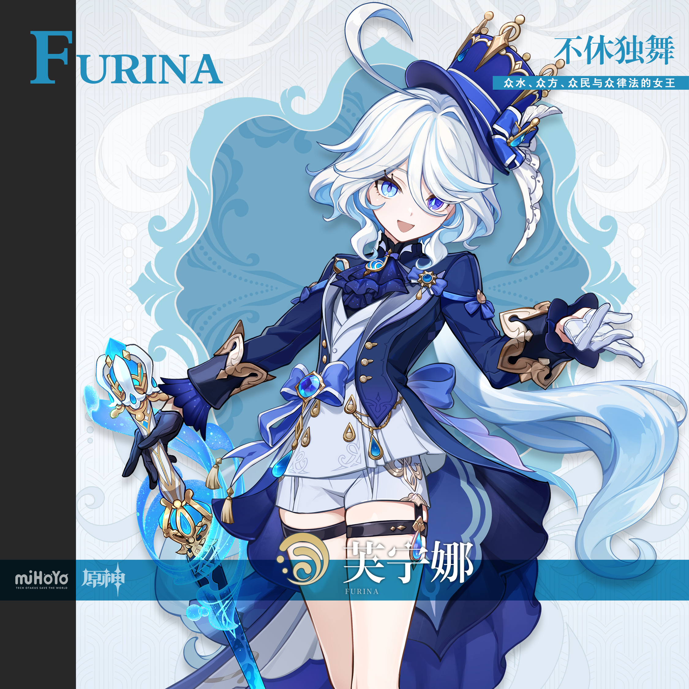
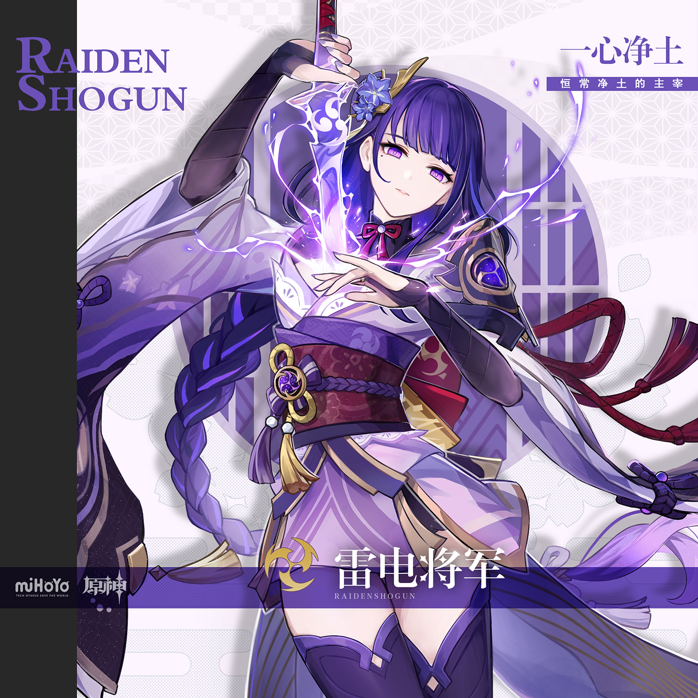

# 开学季·JK制服学园 Back-to-School Academy — 2026.08.31
> 视频类型：B · 主题类型合集
> 主题名称：开学季 JK制服学园
> 热点背景：2026年8月31日全国中小学返校报到，9月1日开学第一天。开学季是年度最强季节性时事热点之一，学生群体对「二次元角色×校园制服」题材有天然共鸣。同时星见雅JK二创在2026年持续火爆（淘宝JK衍生服热销、触站星见雅JK作品热度高），为开学主题提供了天然切入点。
> 涉及角色：星见雅（绝区零）、芙宁娜（原神）、雷电将军（原神）、卡芙卡（崩坏：星穹铁道）、三月七（崩坏：星穹铁道）、艾莲（绝区零）
> 场景设定：虚构「私立星光学园」——传统日式校门、银杏落叶走廊、阶梯教室、音乐室、天台、剑道部道场
> 统一画风：highly detailed anime-style illustration, polished game-art quality, cinematic warm morning light, nostalgic autumn school campus atmosphere, soft golden-hour palette with crisp academic details

---

## 1（星见雅 · 校门口的前辈气场）

Positive Prompt:
16:9 2K wallpaper, Hoshimi Miyabi from Zenless Zone Zero, highly detailed anime-style illustration, polished game-art quality, cinematic morning light, autumn school campus atmosphere, warm cream and teal color palette.

Depict Hoshimi Miyabi standing at the school gate of a fictional Japanese-style academy on a crisp autumn morning. Her iconic features are unmistakable: long flowing black hair with large upright fox ears, sharp red eyes, and a floating black oni mask with glowing red eyes and pale blue-white ethereal aura hovering behind her head. She wears a modern school uniform blended with her teal color theme: a dark teal blazer over a white sailor-collar blouse with a yellow-orange ribbon tie, a black pleated skirt, sheer black tights, and black loafers. Her long katana is carried in a black scabbard slung across her back beneath the blazer. One hand rests casually on the strap of her leather school bag over her shoulder, the other hand is tucked in her blazer pocket, perfect hands, five fingers on each hand, well-defined fingers, natural relaxed hand pose.

The school gate is grand and traditional: dark wooden torii-style arch with the school nameplate in gold characters, stone lanterns flanking the entrance, gingko trees with golden-yellow autumn leaves lining the path, scattered fallen leaves on the ground. Behind the gate, the school building stretches in warm beige brick and white trim, students in distant silhouettes. Soft morning sunlight filters through the trees, casting long golden rays and warm shadows. The mood is cool, poised, and quietly authoritative — the senior everyone respects.

Negative Prompt:
low quality, worst quality, blurry, pixelated, bad anatomy, extra limbs, bad hands, extra fingers, fewer fingers, missing fingers, fused fingers, webbed fingers, merged fingers, overlapping fingers, deformed fingers, mutated fingers, six fingers, four fingers, three fingers, more than five fingers, less than five fingers, disfigured hands, poorly drawn hands, bad hand anatomy, asymmetrical hands, broken fingers, claw hands, blurry hands, indistinct fingers, smeared hands, missing fox ears, missing oni mask, missing katana, wrong hair color, white hair, blue eyes, animal tail, chibi, combat pose, weapon drawn, blood, violence, summer uniform, beach background, winter scene, text, watermark, logo, signature

---

## 2（星见雅 · 放学后剑道部）

Referring to the attached image (Figure 1), generate a similar style image for Hoshimi Miyabi from Zenless Zone Zero in the school kendo dojo setting.

Depict Hoshimi Miyabi inside a traditional wooden kendo dojo after school, the late afternoon sunlight streaming through shoji screens. She wears the same school uniform as Figure 1 but with the teal blazer removed and hung on the wall, her white sailor blouse sleeves rolled up. She holds a wooden practice sword (bokken) in both hands in a standard kendo stance, the black oni mask floating behind her watching silently. Her fox ears are alert, her red eyes focused with calm intensity. The dojo floor is polished hardwood, a row of wooden swords on the rack, the school courtyard visible through the open sliding doors with autumn leaves drifting in. Keep the same anime illustration style, warm afternoon lighting, and autumn atmosphere as the reference image. Color palette: black, teal, warm wood browns, golden afternoon light.

Negative Prompt:
low quality, worst quality, blurry, pixelated, bad anatomy, extra limbs, bad hands, extra fingers, fewer fingers, missing fingers, fused fingers, webbed fingers, merged fingers, overlapping fingers, deformed fingers, mutated fingers, six fingers, four fingers, three fingers, more than five fingers, less than five fingers, disfigured hands, poorly drawn hands, bad hand anatomy, asymmetrical hands, broken fingers, claw hands, blurry hands, indistinct fingers, smeared hands, missing fox ears, missing oni mask, missing bokken, wrong hair color, blue eyes, modern casual clothes, chibi, photorealistic, text, watermark, logo, signature

---

## 3（芙宁娜 · 开学典礼新生代表）

Referring to the attached image (Figure 1), generate a similar style image for Furina from Genshin Impact in the school auditorium setting.

Depict Furina standing at the center of a grand school auditorium stage, delivering a theatrical self-introduction as a new transfer student. Her unmistakable features: very long white hair with pale blue streaks and wave-like curls, heterochromatic blue eyes (one lighter, one deeper blue) with distinctive teardrop-shaped pupils, and her signature blue top hat with gold accents and a small feather perched jauntily on her head. She wears a navy-blue school uniform blazer with gold buttons over a white ruffled blouse, a large blue bow at her collar, a pleated navy skirt, black thigh-high stockings with garter straps, and black Mary Jane shoes. Her white gloves are immaculate. One arm is dramatically outstretched toward the audience, the other hand placed theatrically over her heart, perfect hands, five fingers on each hand, well-defined fingers, natural expressive hand pose.

The auditorium is magnificent: red velvet curtains, polished wooden stage, golden spotlights casting dramatic beams, rows of empty wooden seats fading into soft shadow. A vintage microphone stands before her. Blue water-like energy swirls subtly at her feet — a nod to her Hydro element — and tiny sparkling droplets float in the spotlight. The mood is theatrical, triumphant, and irresistibly dramatic — a born performer owning the stage. Keep the same anime illustration style, warm spotlight lighting, and polished school atmosphere as the reference image. Color palette: navy blue, white, gold, soft black, warm wood tones.

Negative Prompt:
low quality, worst quality, blurry, pixelated, bad anatomy, extra limbs, bad hands, extra fingers, fewer fingers, missing fingers, fused fingers, webbed fingers, merged fingers, overlapping fingers, deformed fingers, mutated fingers, six fingers, four fingers, three fingers, more than five fingers, less than five fingers, disfigured hands, poorly drawn hands, bad hand anatomy, asymmetrical hands, broken fingers, claw hands, blurry hands, indistinct fingers, smeared hands, missing top hat, missing heterochromatic eyes, wrong hair color, blonde hair, brown eyes, combat pose, weapon, fantasy dress, medieval clothing, chibi, wrong uniform color, text, watermark, logo, signature

---

## 4（芙宁娜 · 天台午间小剧场）

Referring to the attached image (Figure 1), generate a similar style image for Furina from Genshin Impact on the school rooftop at lunch break.

Depict Furina sitting on the metal railing of a school rooftop, legs dangling casually over the edge, the blue sky and white clouds behind her. She wears the same navy-blue school uniform as Figure 1. Her blue top hat is tilted at a playful angle, one hand pointing dramatically at the horizon as if declaring ownership of the sky, the other hand holding a half-eaten sandwich, perfect hands, five fingers on each hand, well-defined fingers, natural playful hand pose. Her heterochromatic blue eyes sparkle with mischief, her lips curved in a theatrical grin. The school rooftop is detailed: concrete surface, chain-link fence, a few potted plants, distant cityscape with autumn trees. Keep the same anime illustration style, bright midday lighting, and cheerful school atmosphere as the reference image. Color palette: navy blue, white, sky blue, warm autumn gold.

Negative Prompt:
low quality, worst quality, blurry, pixelated, bad anatomy, extra limbs, bad hands, extra fingers, fewer fingers, missing fingers, fused fingers, webbed fingers, merged fingers, overlapping fingers, deformed fingers, mutated fingers, six fingers, four fingers, three fingers, more than five fingers, less than five fingers, disfigured hands, poorly drawn hands, bad hand anatomy, asymmetrical hands, broken fingers, claw hands, blurry hands, indistinct fingers, smeared hands, missing top hat, missing heterochromatic eyes, wrong hair color, combat pose, weapon, dark atmosphere, winter scene, text, watermark, logo, signature

---

## 5（雷电将军 · 早读课窗边座位）

Referring to the attached image (Figure 1), generate a similar style image for Raiden Shogun from Genshin Impact in the school classroom setting.

Depict Raiden Shogun seated by a classroom window during morning self-study, golden autumn sunlight streaming across her desk. Her iconic features: very long purple hair woven into a thick braid draped over her left shoulder, a delicate violet flower ornament pinned above her ear, and striking purple eyes with faintly glowing light pupils. She wears a refined school uniform in her signature violet palette: a deep purple blazer with gold trim over a white high-collar blouse, a dark red ribbon tie, a pleated black skirt, and black knee-high socks. One hand rests elegantly on an open book on the desk, the other hand gently holding a pen near her lips in quiet thought, perfect hands, five fingers on each hand, well-defined fingers, natural graceful hand pose.

The classroom is warm and atmospheric: wooden desks in neat rows, chalkboard with faint chalk dust, a vase of autumn flowers on the teacher's desk, soft morning light through large windows with white curtains billowing slightly. Outside the window, gingko trees glow golden. Faint purple electro energy sparkles drift lazily around her like fireflies — a subtle elemental signature. Her expression is serene, composed, and quietly imposing — the student council president nobody dares to interrupt. Keep the same anime illustration style, warm morning lighting, and peaceful academic atmosphere as the reference image. Color palette: deep purple, violet, black, white, dark red accents, warm gold sunlight.

Negative Prompt:
low quality, worst quality, blurry, pixelated, bad anatomy, extra limbs, bad hands, extra fingers, fewer fingers, missing fingers, fused fingers, webbed fingers, merged fingers, overlapping fingers, deformed fingers, mutated fingers, six fingers, four fingers, three fingers, more than five fingers, less than five fingers, disfigured hands, poorly drawn hands, bad hand anatomy, asymmetrical hands, broken fingers, claw hands, blurry hands, indistinct fingers, smeared hands, missing purple braid, missing flower hairpin, wrong hair color, wrong eye color, blonde hair, blue eyes, combat pose, weapon drawn, katana, fantasy armor, kimono, chibi, dark atmosphere, text, watermark, logo, signature

---

## 6（卡芙卡 · 音乐室的不良学姐）

Referring to the attached image (Figure 1), generate a similar style image for Kafka from Honkai: Star Rail in the school music room setting.

Depict Kafka lounging against a grand piano in an empty after-school music room, afternoon light filtering through horizontal blinds casting striped shadows across the floor. Her defining features: wavy medium-length magenta-purple hair, mysterious light-purple eyes half-lidded with knowing allure, and round-tinted sunglasses pushed up on top of her head. She wears a stylish school uniform with a rebellious twist: a black blazer with purple satin lining left open over a loosely buttoned white shirt, a loosely knotted red necktie, a short pleated black skirt, sheer black tights, and ankle boots. Her long black gloves reach past her elbows. One hand rests on the piano keys, the other hand holds a violin bow with casual elegance, perfect hands, five fingers on each hand, well-defined fingers, natural relaxed hand pose. A small black cat curls asleep on the piano bench beside her.

The music room is richly detailed: dark wood paneling, music stands with scattered sheet music, a cello case in the corner, dust motes dancing in the slanted amber light. The mood is sophisticated, mysterious, and slightly dangerous — the upperclassman who knows secrets. Keep the same anime illustration style, dramatic afternoon lighting with strong shadows, and refined school atmosphere as the reference image. Color palette: deep purple, black, crimson accents, warm amber light, dark wood browns.

Negative Prompt:
low quality, worst quality, blurry, pixelated, bad anatomy, extra limbs, bad hands, extra fingers, fewer fingers, missing fingers, fused fingers, webbed fingers, merged fingers, overlapping fingers, deformed fingers, mutated fingers, six fingers, four fingers, three fingers, more than five fingers, less than five fingers, disfigured hands, poorly drawn hands, bad hand anatomy, asymmetrical hands, broken fingers, claw hands, blurry hands, indistinct fingers, smeared hands, missing sunglasses, missing black gloves, wrong hair color, blonde hair, wrong eye color, combat pose, weapon, gun, chibi, bright cheerful lighting, outdoor scene, text, watermark, logo, signature

---

## 7（三月七 · 迟到狂奔）

Referring to the attached image (Figure 1), generate a similar style image for March 7th from Honkai: Star Rail rushing late to school.

Depict March 7th sprinting through a school corridor at full speed, toast clamped in her mouth, backpack bouncing wildly, one hand clutching a loose strap. Her unmistakable features: short pink hair with white highlights and a small blue flower hair clip on the left side, large bright blue eyes wide with panic, and a playful energetic expression. She wears a cute school uniform matching her blue-and-white palette: a light blue blazer with white trim over a white blouse, a blue ribbon bow, a pleated blue-and-white checkered skirt, white knee-high socks, and blue loafers. A small camera hangs from her neck by a strap. Her ice-element energy manifests as tiny sparkling blue-pink crystal butterflies fluttering behind her as she runs. One arm is pumping forward in a running motion, the other hand gripping her school bag strap, perfect hands, five fingers on each hand, well-defined fingers, natural dynamic hand pose.

The school corridor is classic anime style: rows of shoe lockers lining the wall, sunlight streaming through windows at the far end, scattered autumn leaves blown in through an open door, a wall clock showing 8:05. Lockers have student nameplates and small decorations. The mood is chaotic, adorable, and full of first-day energy. Keep the same anime illustration style, dynamic motion composition, and bright morning lighting as the reference image. Color palette: pink, light blue, white, soft crystal accents, warm morning gold.

Negative Prompt:
low quality, worst quality, blurry, pixelated, bad anatomy, extra limbs, bad hands, extra fingers, fewer fingers, missing fingers, fused fingers, webbed fingers, merged fingers, overlapping fingers, deformed fingers, mutated fingers, six fingers, four fingers, three fingers, more than five fingers, less than five fingers, disfigured hands, poorly drawn hands, bad hand anatomy, asymmetrical hands, broken fingers, claw hands, blurry hands, indistinct fingers, smeared hands, missing pink hair, missing blue flower hair clip, wrong hair color, wrong eye color, combat pose, weapon, bow, armor, chibi, dark atmosphere, winter scene, text, watermark, logo, signature

---

## 8（艾莲 · 值日扫除的睡眼）

Referring to the attached image (Figure 1), generate a similar style image for Ellen Joe from Zenless Zone Zero doing classroom cleaning duty after school.

Depict Ellen Joe leaning on a mop in an empty classroom at sunset, looking half-asleep and utterly unenthusiastic. Her signature features: short black hair with white/silver streaks on the sides, sharp red eyes half-lidded with exhaustion, and a small shark-tooth hairpin on the left side of her head. She wears a modified school sailor uniform that subtly echoes her maid aesthetic: a black sailor collar with white stripes over a white blouse, a short black pleated skirt, black tights, and black loafers. The sleeves are rolled up to her elbows. One hand grips the mop handle lazily, the other hand is tucked in her skirt pocket, perfect hands, five fingers on each hand, well-defined fingers, natural relaxed hand pose.

The classroom is warm and quiet in the golden hour: desks pushed to one side, a blackboard with faint chalk marks, sunlight streaming through windows casting long warm shadows, dust motes floating in the air. A bucket and cleaning supplies sit in the corner. Outside the window, the school courtyard is bathed in amber light with autumn trees. Her expression says "I just want to go home and sleep." Keep the same anime illustration style, warm sunset lighting, and cozy after-school atmosphere as the reference image. Color palette: black, white, deep red eyes, warm amber, soft cream.

Negative Prompt:
low quality, worst quality, blurry, pixelated, bad anatomy, extra limbs, bad hands, extra fingers, fewer fingers, missing fingers, fused fingers, webbed fingers, merged fingers, overlapping fingers, deformed fingers, mutated fingers, six fingers, four fingers, three fingers, more than five fingers, less than five fingers, disfigured hands, poorly drawn hands, bad hand anatomy, asymmetrical hands, broken fingers, claw hands, blurry hands, indistinct fingers, smeared hands, missing shark-tooth hairpin, missing white hair streaks, wrong hair color, wrong eye color, maid headdress, maid dress, combat pose, weapon, chibi, bright cheerful expression, outdoor scene, text, watermark, logo, signature

---

## 9（雷电将军 · 银杏树下的便当时间）

Referring to the attached image (Figure 1), generate a similar style image for Raiden Shogun from Genshin Impact having lunch under a school courtyard tree.

Depict Raiden Shogun sitting peacefully on a wooden bench beneath a large gingko tree in the school courtyard during lunch break. She wears the same deep purple school uniform as Figure 1. Her long purple braid is draped over her right shoulder, the violet flower ornament gleaming in the dappled sunlight. She holds a pair of chopsticks over a traditional bento box on her lap, her expression serene and contemplative. One hand holds the chopsticks delicately, the other hand rests on the bench beside her, perfect hands, five fingers on each hand, well-defined fingers, natural graceful hand pose. A few purple electro sparkle motes drift lazily around her like curious fireflies.

The school courtyard is beautiful in early autumn: golden gingko leaves scattered on the grass, a stone path winding past, the school building visible in soft focus behind her, warm midday light filtering through the leaves creating a dappled pattern on her uniform. The mood is tranquil, dignified, and quietly warm — a rare moment of peace for the student council president. Keep the same anime illustration style, soft dappled sunlight, and peaceful school atmosphere as the reference image. Color palette: deep purple, gold, green, warm sunlight, soft cream.

Negative Prompt:
low quality, worst quality, blurry, pixelated, bad anatomy, extra limbs, bad hands, extra fingers, fewer fingers, missing fingers, fused fingers, webbed fingers, merged fingers, overlapping fingers, deformed fingers, mutated fingers, six fingers, four fingers, three fingers, more than five fingers, less than five fingers, disfigured hands, poorly drawn hands, bad hand anatomy, asymmetrical hands, broken fingers, claw hands, blurry hands, indistinct fingers, smeared hands, missing purple braid, missing flower hairpin, wrong hair color, wrong eye color, combat pose, weapon, fantasy armor, kimono, chibi, dark atmosphere, text, watermark, logo, signature

---

## 10（六人合影·开学第一天大团圆）

Referring to the attached image (Figure 1), generate a similar style image featuring all six characters together at the school gate on the first day of school.

Depict a grand group composition at the school gate on a bright autumn morning: Hoshimi Miyabi stands cool and composed at the center with her fox ears prominent and katana bag slung over her shoulder; Furina strikes a theatrical pose with her blue top hat tilted and one arm dramatically extended; Raiden Shogun sits calmly on the stone gate step with her purple braid over her shoulder, holding a book; Kafka leans against the gatepost with sunglasses on her head, violin case beside her, a small black cat at her feet; March 7th is mid-jump throwing a peace sign with her camera around her neck, ice crystal butterflies sparkling around her; Ellen Joe stands at the edge looking half-asleep, leaning on a mop. All six wear coordinated school uniforms in their respective color themes: Miyabi in teal and black, Furina in navy and white, Raiden in deep purple, Kafka in black and purple, March 7th in light blue and white, Ellen in black and white.

The school gate is grand and traditional with dark wooden arches and stone lanterns, gingko trees blazing with autumn gold, fallen leaves swirling in a gentle breeze. Morning sunlight bathes the entire scene in warm golden light. The mood is celebratory, nostalgic, and full of new-semester energy. Keep the same anime illustration style, warm morning lighting, and autumn school atmosphere as the reference image.

Negative Prompt:
low quality, worst quality, blurry, pixelated, bad anatomy, extra limbs, bad hands, extra fingers, fewer fingers, missing fingers, fused fingers, webbed fingers, merged fingers, overlapping fingers, deformed fingers, mutated fingers, six fingers, four fingers, three fingers, more than five fingers, less than five fingers, disfigured hands, poorly drawn hands, bad hand anatomy, asymmetrical hands, broken fingers, claw hands, blurry hands, indistinct fingers, smeared hands, wrong hair color, wrong eye color, missing iconic accessories, chibi, photorealistic, text, watermark, logo, signature

---

## 注

**选角理由**：
- 星见雅：绝区零人气TOP角色，工作区首次覆盖；2026年社区JK二创热度极高（淘宝JK衍生服、触站星见雅JK同人作品），天然契合开学制服主题
- 芙宁娜：原神顶流人气角色，工作区此前仅做过表情包/塔罗主题，首次单人A类深度呈现
- 雷电将军：原神超人气角色，工作区从未覆盖；「雷电将军×制服」是二创经典组合
- 卡芙卡：崩铁人气角色，工作区早期做过但无titles；成熟大姐姐×不良学姐制服反差极具张力
- 三月七：崩铁人气角色，工作区首次覆盖；粉毛元气JK经典形象与迟到狂奔场景天然适配
- 艾莲：绝区零高人气角色，工作区此前仅做过单人壁纸但无titles；笨蛋鲨鲨× sleepy值日生反差萌极强

**主题一致性要点**：
- 统一场景：私立星光学园，传统日式校门+银杏树+木质走廊+阶梯教室+音乐室+剑道部+天台
- 统一时间：秋季早晨至午后金色光线（golden hour / warm morning light）
- 统一画风：highly detailed anime-style illustration, polished game-art quality
- 第一个角色（星见雅 第1条）定义整体风格基调，后续角色均引用此图保持风格一致
- 所有角色均保留标志性外貌特征（发色、瞳色、标志性配饰），仅服装替换为JK制服主题变体
