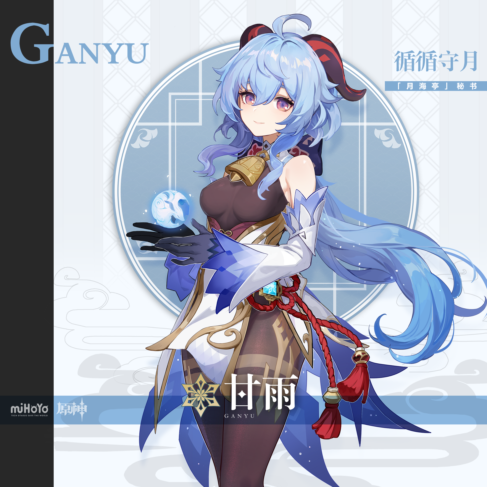

# 教师节·星光学园教师篇 Teachers' Academy — 2026.09.06
> 视频类型：B · 主题类型合集
> 主题名称：教师节特别篇「星光学园教师篇」（延续 8/31 开学季「私立星光学园」世界观，本次视角切换到教师办公室）
> 热点背景：2026年9月10日（周四）教师节。教师节是年度强情感向时事热点，「游戏角色×教师形象」的反差焕新题材兼具节日共鸣与视觉新鲜感；明日（9/7）另逢白露节气，可在文案中顺带提及形成话题衔接
> 涉及角色：姬子（崩坏：星穹铁道·领航天文课）、纳西妲（原神·自然通识课）、花火（崩坏：星穹铁道·戏剧课）、甘雨（原神·历史课）、朱鸢（绝区零·校园安全课教官）
> 选角理由：全部为高人气女角色且均未做过单人壁纸合集；避开开学季篇已有阵容（星见雅/芙宁娜/雷电将军/卡芙卡/三月七/艾莲）；教师契合度与反差感兼备——姬子是系列"教师气质本命"，纳西妲是"最年轻教授"反差萌，花火是"最不可能当老师的人"极致反差，甘雨有"三千年教龄"的资历梗，朱鸢是"警官转任教官"的飒爽焕新
> 场景设定：私立星光学园教师篇——天文观象台教室、自然温室、戏剧社排练厅、历史资料室、教师办公室、校门口护学岗
> 统一画风：highly detailed anime-style illustration, polished game-art quality, warm golden-hour classroom lighting, nostalgic campus atmosphere
> 参考图校对：splash-himeko.png / splash-nahida.jpg / splash-ganyu.png / splash-sparkle.png（B站WIKI官方立绘）与 splash-zhuyuan.png（官方档案头像，仅上半身）均已用视觉工具逐张确认

---

## 1（姬子 · 领航天文课的第一堂课）

Positive Prompt:
16:9 2K wallpaper, Himeko from Honkai: Star Rail, highly detailed anime-style illustration, polished game-art quality, warm sunset light streaming through a domed observatory classroom, nostalgic campus atmosphere, amber and deep-navy palette.

Depict Himeko as the academy's beloved astronomy and navigation teacher, standing beside a giant brass telescope in a domed observatory classroom. Her unmistakable features: long voluminous crimson-red hair flowing in soft waves over one shoulder, sharp amber-gold eyes, elegant confident smile. Her teacher outfit is a refined renewal of her canonical design: her black coat with gold trim worn like an open professor's gown over a white halter-style blouse with a high collar, a fitted black pencil skirt with her signature golden belt of gear-like ornaments at the waist, sheer black tights, and black heels. Black gloves on both hands. One hand rests on the telescope's adjustment knob, the other holds a steaming cup of black coffee, perfect hands, five fingers on each hand, anatomically correct hands, well-defined fingers, natural relaxed hand pose.

The observatory classroom is richly detailed: a huge brass refracting telescope pointed at the dusk sky through the open dome slit, star charts and constellation maps pinned on dark wooden walls, a glowing orrery model on the demonstration table, chalkboard covered with elegant orbital diagrams, and rows of empty wooden desks. Warm orange sunset light mixes with faint starlight beginning to appear through the dome. The mood is warm, wise, and quietly romantic — the teacher who once sailed among the stars, now lighting that spark for her students.

Negative Prompt:
low quality, worst quality, blurry, pixelated, bad anatomy, extra limbs, bad hands, extra fingers, fewer fingers, missing fingers, fused fingers, webbed fingers, merged fingers, overlapping fingers, deformed fingers, mutated fingers, six fingers, four fingers, three fingers, more than five fingers, less than five fingers, disfigured hands, poorly drawn hands, bad hand anatomy, asymmetrical hands, broken fingers, claw hands, blurry hands, indistinct fingers, smeared hands, wrong hair color, black hair, brown eyes, missing gloves, casual streetwear, fantasy armor, chibi, photorealistic, combat pose, text, watermark, logo, signature

---

## 2（姬子 · 教师办公室的招牌咖啡）

Positive Prompt:
16:9 2K wallpaper, Himeko from Honkai: Star Rail, highly detailed anime-style illustration, polished game-art quality, cozy staff-room evening atmosphere, warm lamp light, rich brown and amber palette with red accents.

Depict Himeko in the teachers' lounge after class, seated relaxed at a small round table, pouring freshly brewed black coffee from a copper pour-over kettle into her white cup with a knowing, slightly dangerous smile — the legend of her infamous "stomach-wrecking" home roast made visible in the ominously dark liquid. Her crimson-red wavy hair cascades over her shoulder, amber-gold eyes glinting with teasing amusement. Teacher outfit: white blouse with rolled sleeves under her black-and-gold coat draped over the chair back, black pencil skirt, sheer black tights, black heels, black gloves. One hand steadies the cup saucer, the other pours from the kettle in a smooth controlled stream, perfect hands, five fingers on each hand, anatomically correct hands, well-defined fingers, natural pouring hand pose.

The staff room is cozy: a bookshelf of star charts and novels, a small coffee bean grinder and filter set on the table, potted plants on the windowsill, the orange sunset sky visible outside, a chalkboard menu in the corner jokingly reading "今日特调·传闻会伤肠胃". Steam curls upward through the lamp light. The mood is intimate, teasing, and irresistibly warm — every student dares each other to take a sip, and Himeko knows it.

Negative Prompt:
low quality, worst quality, blurry, pixelated, bad anatomy, extra limbs, bad hands, extra fingers, fewer fingers, missing fingers, fused fingers, webbed fingers, merged fingers, overlapping fingers, deformed fingers, mutated fingers, six fingers, four fingers, three fingers, more than five fingers, less than five fingers, disfigured hands, poorly drawn hands, bad hand anatomy, asymmetrical hands, broken fingers, claw hands, blurry hands, indistinct fingers, smeared hands, wrong hair color, black hair, missing gloves, outdoor scene, classroom desks, combat pose, chibi, photorealistic, text, watermark, logo, signature

---

## 3（纳西妲 · 史上最年轻的教授）

Positive Prompt:
16:9 2K wallpaper, Nahida from Genshin Impact, highly detailed anime-style illustration, polished game-art quality, bright morning lecture hall with soft green-gold palette, fresh academic atmosphere.

Depict Nahida as the academy's youngest ever professor, standing at the lectern of a bright university lecture hall — so petite that she stands on a stack of thick textbooks behind the podium to reach the microphone, her expression serene yet adorably defiant, as if daring anyone to mention her height. Her unmistakable features: long white hair with green gradient tips tied into side twintails with braided strands, large vivid green eyes with flower-shaped pupils, pointed elf ears, a golden hair ornament shaped like leaves at the side of her head. Teacher outfit renewal: a white blouse with puffed short sleeves under a fitted sage-green vest with gold trim, a long flowing green-and-white skirt inspired by her canonical layered dress, a tiny golden bell brooch, and white laced shoes. One hand raised in a lively teaching gesture, the other resting on the stack of books, perfect hands, five fingers on each hand, anatomically correct hands, well-defined fingers, natural expressive hand pose.

The lecture hall is grand yet warm: tiered wooden seats, tall arched windows with morning light, a green chalkboard covered in beautifully drawn botanical diagrams and glowing dendro-green chalk illustrations of the world tree, potted plants lining the podium. Tiny glowing leaf particles drift in the sunbeams. The mood is inspiring, brilliant, and gently humorous — the goddess of wisdom teaching her first class, one textbook stack tall.

Negative Prompt:
low quality, worst quality, blurry, pixelated, bad anatomy, extra limbs, bad hands, extra fingers, fewer fingers, missing fingers, fused fingers, webbed fingers, merged fingers, overlapping fingers, deformed fingers, mutated fingers, six fingers, four fingers, three fingers, more than five fingers, less than five fingers, disfigured hands, poorly drawn hands, bad hand anatomy, asymmetrical hands, broken fingers, claw hands, blurry hands, indistinct fingers, smeared hands, wrong hair color, black hair, blue eyes, missing pointed ears, adult tall body, mature body proportions, dark gloomy atmosphere, combat pose, chibi, photorealistic, text, watermark, logo, signature

---

## 4（纳西妲 · 温室自然课的魔法瞬间）

Positive Prompt:
16:9 2K wallpaper, Nahida from Genshin Impact, highly detailed anime-style illustration, polished game-art quality, lush greenhouse botanical classroom, dappled green-gold light, fresh vibrant palette.

Depict Nahida leading a hands-on botany lesson inside the academy's glass greenhouse, crouching gently beside a young student's potted seedling — with a warm smile she cups the pot between her small hands, and the seedling erupts into bloom with glowing dendro-green light, leaves and flower petals spiraling upward around her in a delicate whirlwind. Her white hair with green gradient tips and braided side twintails catches the drifting petals, her green flower-pupil eyes shining with genuine delight, pointed elf ears visible. Teacher outfit: sage-green vest over white puffed-sleeve blouse, long flowing green-and-white skirt, golden leaf hair ornament. Both hands gently cradling the flower pot, perfect hands, five fingers on each hand, anatomically correct hands, well-defined fingers, natural gentle hand pose.

The greenhouse is magical: glass walls and vaulted glass ceiling with sunlight filtering through, rows of lush plants and hanging vines, watering cans and botany textbooks on wooden benches, butterflies and glowing pollen motes in the air, a chalkboard easel reading "今日课题·生命的形状". The mood is warm, wondrous, and nurturing — the youngest professor whose lessons literally blossom.

Negative Prompt:
low quality, worst quality, blurry, pixelated, bad anatomy, extra limbs, bad hands, extra fingers, fewer fingers, missing fingers, fused fingers, webbed fingers, merged fingers, overlapping fingers, deformed fingers, mutated fingers, six fingers, four fingers, three fingers, more than five fingers, less than five fingers, disfigured hands, poorly drawn hands, bad hand anatomy, asymmetrical hands, broken fingers, claw hands, blurry hands, indistinct fingers, smeared hands, wrong hair color, black hair, blue eyes, missing pointed ears, adult tall body, withered plants, dead leaves, dark horror atmosphere, combat pose, chibi, photorealistic, text, watermark, logo, signature

---

## 5（花火 · 戏剧课的疯狂导演）

Positive Prompt:
16:9 2K wallpaper, Sparkle from Honkai: Star Rail, highly detailed anime-style illustration, polished game-art quality, dramatic stage lighting in a theater rehearsal hall, theatrical crimson and black palette with gold accents.

Depict Sparkle as the academy's new drama club advisor, standing center-stage in the rehearsal hall with her arms spread wide in a grand welcoming gesture, her crimson eyes glinting with theatrical menace behind a playful grin — the most unpredictable teacher the school has ever hired, holding a paper fan where a pointer stick should be. Her unmistakable features: long black hair with vivid red inner streaks, large crimson-red eyes, a white fox mask pushed up on the side of her head, red flower hair ornaments. Teacher outfit renewal with her festival flair intact: a fitted black blazer worn over her red-and-black kimono-inspired top, a red pleated skirt layered over her canonical red patterned hakama-style shorts, one leg in a black thigh-high sock and one in a red stocking with her signature red shoe, a red obi-inspired waist sash where a teacher's lanyard with "戏剧社指导" badge hangs. Arms spread wide open in theatrical welcome, perfect hands, five fingers on each hand, anatomically correct hands, well-defined fingers, natural open-hand pose.

The rehearsal hall is dramatic: a raised wooden stage with heavy crimson curtains half-drawn, rows of theater seats in shadow, spotlights cutting through stage haze, props and masks scattered on racks — including a suspicious army of 999 small plush dolls neatly lined up on the stage edge like an audience. Golden confetti drifts in the spotlight beams. The mood is thrilling, mischievous, and magnetic — a drama queen in every sense, and her students would not have it any other way.

Negative Prompt:
low quality, worst quality, blurry, pixelated, bad anatomy, extra limbs, bad hands, extra fingers, fewer fingers, missing fingers, fused fingers, webbed fingers, merged fingers, overlapping fingers, deformed fingers, mutated fingers, six fingers, four fingers, three fingers, more than five fingers, less than five fingers, disfigured hands, poorly drawn hands, bad hand anatomy, asymmetrical hands, broken fingers, claw hands, blurry hands, indistinct fingers, smeared hands, wrong hair color, blonde hair, missing fox mask, horror atmosphere, blood, gore, real weapons, dark horror, combat pose, chibi, photorealistic, text, watermark, logo, signature

---

## 6（花火 · 不按剧本的随堂测验）

Positive Prompt:
16:9 2K wallpaper, Sparkle from Honkai: Star Rail, highly detailed anime-style illustration, polished game-art quality, mischievous classroom scene with playful theatrical lighting, crimson and cream palette.

Depict Sparkle as the drama teacher springing a surprise pop quiz, perched casually on top of the teacher's desk at the front of a classroom with one leg swinging, leaning forward with her chin resting on her hand and a wicked delighted grin, her crimson eyes gleaming as she watches the students' despair — papers are raining from the air where she dramatically scattered the quiz sheets. Her black hair with red inner streaks is slightly tousled, the white fox mask now held loosely in her free hand at her side. Teacher outfit: black blazer over red-and-black kimono-inspired top, red pleated skirt over hakama-style shorts, mismatched black and red stockings, red obi sash with teacher's lanyard. One hand supporting her chin, the other holding the fox mask loosely at her side, perfect hands, five fingers on each hand, anatomically correct hands, well-defined fingers, natural relaxed pose.

The classroom is vivid: wooden desks with scattered quiz papers mid-fall, a green chalkboard where "随堂测验" is written in huge exaggerated characters decorated with little bomb doodles, afternoon sunlight through tall windows, a single plush doll sitting smugly on a student's chair. The mood is chaotic, comedic, and full of "乐子" energy — no one knows if the quiz is real, least of all whether they'll survive the review session.

Negative Prompt:
low quality, worst quality, blurry, pixelated, bad anatomy, extra limbs, bad hands, extra fingers, fewer fingers, missing fingers, fused fingers, webbed fingers, merged fingers, overlapping fingers, deformed fingers, mutated fingers, six fingers, four fingers, three fingers, more than five fingers, less than five fingers, disfigured hands, poorly drawn hands, bad hand anatomy, asymmetrical hands, broken fingers, claw hands, blurry hands, indistinct fingers, smeared hands, wrong hair color, blonde hair, missing fox mask, horror atmosphere, blood, dark horror, angry violence, combat pose, chibi, photorealistic, text, watermark, logo, signature

---

## 7（甘雨 · 三千年教龄的历史课）

Positive Prompt:
16:9 2K wallpaper, Ganyu from Genshin Impact, highly detailed anime-style illustration, polished game-art quality, serene classical classroom with soft blue-white palette and warm parchment accents, scholarly atmosphere.

Depict Ganyu as the academy's history teacher — with three thousand years of first-hand knowledge, she teaches history without ever opening the textbook. She stands beside a huge wall map and a shelf of ancient scrolls, holding a wooden pointer toward a chalkboard timeline, her expression gentle, patient, and faintly amused behind a pair of elegant thin-framed glasses — a scholarly renewal that suits her perfectly. Her unmistakable features: long dark violet-blue hair with gradient to soft light blue at the ends, two dark red-and-black goat horns curving from her white hair, gentle purple-pink eyes, a red tassel ornament and small bell at her collar. Teacher outfit renewal: a fitted white blouse under a long deep-blue vest coat with gold trim inspired by her canonical bell sleeves, a long pleated navy skirt, black tights, low-heeled shoes; her signature detached white-and-blue sleeves reimagined as a shawl draped over her shoulders. One hand holding the wooden pointer toward the board, the other cradling a stack of graded papers against her hip, perfect hands, five fingers on each hand, anatomically correct hands, well-defined fingers, natural poised stance.

The classroom is scholarly and serene: a chalkboard timeline spanning three millennia, shelves of bound scrolls and leather books, a brass globe, dust motes in soft window light, a small potted qingxin flower on the desk. The mood is calm, wise, and quietly impressive — when she says "in my experience", she means it literally.

Negative Prompt:
low quality, worst quality, blurry, pixelated, bad anatomy, extra limbs, bad hands, extra fingers, fewer fingers, missing fingers, fused fingers, webbed fingers, merged fingers, overlapping fingers, deformed fingers, mutated fingers, six fingers, four fingers, three fingers, more than five fingers, less than five fingers, disfigured hands, poorly drawn hands, bad hand anatomy, asymmetrical hands, broken fingers, claw hands, blurry hands, indistinct fingers, smeared hands, wrong hair color, blonde hair, missing horns, human ears only, no horns, dark gloomy atmosphere, combat pose, ice attack, chibi, photorealistic, text, watermark, logo, signature

---

## 8（甘雨 · 深夜办公室的作业山）

Positive Prompt:
16:9 2K wallpaper, Ganyu from Genshin Impact, highly detailed anime-style illustration, polished game-art quality, cozy late-night teacher's office, warm desk-lamp glow against cool blue moonlight, intimate nocturnal palette.

Depict Ganyu at her desk in the teachers' office at 11 PM, dutifully grading a mountain of homework that towers beside her like a small fortress — the eternal overtime worker even among teachers, quietly wondering how marking never ends. Her dark violet-blue hair with light blue ends spills over one shoulder, her goat horns catching the lamplight, purple-pink eyes slightly bleary but steadfast, a tiny sleepy pout on her lips as she stamps another paper "已批阅". She wears thin-framed glasses pushed slightly down her nose. Teacher outfit: white blouse with sleeves helpfully rolled up, deep-blue vest coat with gold trim draped over her chair, navy pleated skirt, black tights. One hand pressing the grading stamp onto a paper, the other holding her cheek in a weary but adorable gesture, perfect hands, five fingers on each hand, anatomically correct hands, well-defined fingers, natural seated hand pose.

The office at night is atmospheric: a single warm desk lamp, neat stacks of homework forming a fortress around her, a mug of lukewarm tea, moonlight streaming through the blinds in cool blue stripes, a wall clock showing late hours, and a sticky note on her monitor reading "甘雨老师·五分钟后就好" — it has been there for three hours. The mood is endearing, relatable, and gently funny — the hardest working teacher in the school, self-aware about it.

Negative Prompt:
low quality, worst quality, blurry, pixelated, bad anatomy, extra limbs, bad hands, extra fingers, fewer fingers, missing fingers, fused fingers, webbed fingers, merged fingers, overlapping fingers, deformed fingers, mutated fingers, six fingers, four fingers, three fingers, more than five fingers, less than five fingers, disfigured hands, poorly drawn hands, bad hand anatomy, asymmetrical hands, broken fingers, claw hands, blurry hands, indistinct fingers, smeared hands, wrong hair color, blonde hair, missing horns, bright daylight, outdoor scene, combat pose, ice attack, chibi, photorealistic, text, watermark, logo, signature

---

## 9（朱鸢 · 校园安全课的飒爽教官）

Positive Prompt:
16:9 2K wallpaper, Zhu Yuan from Zenless Zone Zero, highly detailed anime-style illustration, polished game-art quality, bright crisp training-ground morning, energetic blue-orange palette, disciplined atmosphere.

Depict Zhu Yuan as the academy's new campus-safety instructor — a decorated city patrol officer seconded to teach the safety and law elective, and clearly the coolest teacher on campus. She stands confidently before an assembled class on the training ground, hands on her hips in a power stance, chin lifted with a proud sharp-eyed smile as she delivers her first lecture on public safety. Her unmistakable features: dark teal-green hair tied in a high ponytail with vivid orange streaks, sharp amber-orange eyes, a coiled orange tactical cable running from her earpiece. Teacher-instructor outfit renewal of her canonical uniform: a crisp white dress shirt with her green plaid tie under a fitted blue tactical uniform jacket with rolled sleeves, a black utility harness with pouches worn over it, black shorts, black thigh-high tactical socks, sturdy boots, white gloves. Both hands on her hips, perfect hands, five fingers on each hand, anatomically correct hands, well-defined fingers, confident power stance.

The training ground is energetic: an open asphalt yard with painted lesson lines, a chalkboard easel reading "校园安全第一课", safety cones, a first-aid demonstration table, morning sunlight and long shadows, other teachers watching from a distance with visible awe. The mood is brisk, cool, and inspiring — the teacher every student secretly wants to have, and the one every troublemaker fears.

Negative Prompt:
low quality, worst quality, blurry, pixelated, bad anatomy, extra limbs, bad hands, extra fingers, fewer fingers, missing fingers, fused fingers, webbed fingers, merged fingers, overlapping fingers, deformed fingers, mutated fingers, six fingers, four fingers, three fingers, more than five fingers, less than five fingers, disfigured hands, poorly drawn hands, bad hand anatomy, asymmetrical hands, broken fingers, claw hands, blurry hands, indistinct fingers, smeared hands, wrong hair color, blonde hair, missing orange streaks, real gun, firing weapon, blood, violence, dark gritty atmosphere, combat pose, chibi, photorealistic, text, watermark, logo, signature

---

## 10（朱鸢 · 放学后的护学岗）

Positive Prompt:
16:9 2K wallpaper, Zhu Yuan from Zenless Zone Zero, highly detailed anime-style illustration, polished game-art quality, golden after-school street scene, warm orange-blue palette, heartwarming slice-of-life atmosphere.

Depict Zhu Yuan off-duty from her instructor duties, volunteering at the school crossing after the final bell — standing at the zebra crossing in her tactical instructor uniform with a small handheld stop paddle raised, halting imaginary traffic with effortless authority while a stream of younger students crosses safely below her watchful amber gaze. Her dark teal-green high ponytail with orange streaks sways in the evening breeze, the coiled orange tactical cable by her ear glinting, her expression softened into a rare warm smile — the strict instructor is secretly the students' favorite. Outfit: white dress shirt with green plaid tie, blue tactical jacket with rolled sleeves, black utility harness, black shorts, black thigh-high socks, boots, white gloves. One hand raised holding the stop paddle, the other waving a small group of children across, perfect hands, five fingers on each hand, anatomically correct hands, well-defined fingers, natural guiding gesture.

The street scene is golden-hour beautiful: the school gate and gingko trees behind her, long soft shadows across the zebra stripes, a patrol car parked nearby with its hazard lights off, convenience store signage glowing warmly down the street, drifting dandelion seeds in the amber light. The mood is warm, protective, and quietly heroic — teaching safety in class, and living it after the bell.

Negative Prompt:
low quality, worst quality, blurry, pixelated, bad anatomy, extra limbs, bad hands, extra fingers, fewer fingers, missing fingers, fused fingers, webbed fingers, merged fingers, overlapping fingers, deformed fingers, mutated fingers, six fingers, four fingers, three fingers, more than five fingers, less than five fingers, disfigured hands, poorly drawn hands, bad hand anatomy, asymmetrical hands, broken fingers, claw hands, blurry hands, indistinct fingers, smeared hands, wrong hair color, blonde hair, missing orange streaks, real gun, firing weapon, blood, night scene, rain, combat pose, chibi, photorealistic, text, watermark, logo, signature

---

## 注

**角色外观校对基准**（均经官方立绘视觉确认，见本目录 splash-*.png）：
- 姬子：绯红色大波浪长发、琥珀金瞳、黑金边外套+白色挂脖礼服裙+金色齿轮腰带、黑色手套、高跟鞋
- 纳西妲：白色长发发尾渐变绿、侧双马尾编发、绿色花形瞳、尖耳、白色连衣裙+绿色金饰披纱
- 花火：黑色长发红色内挑染、绯红瞳、头部白色狐面、红花发饰、红黑祭典风短打、赤足单只红鞋（本篇教师装中保留狐面与红黑配色）
- 甘雨：紫蓝长发发尾浅蓝渐变、红黑龙角、紫粉瞳、金铃铛领饰、白蓝金裙装、黑色分离袖套（本篇改为披肩形式）
- 朱鸢：墨绿色高马尾橙色挑染、琥珀瞳、耳侧橙色战术线圈、白衬衫绿格领带+蓝色制服外套+黑色战术挂具（仅上半身官方头像图，下半身按官方立绘常识弱化描述为黑色短裤+黑色长筒袜，未写具体战术腿包细节）

**参考图说明**：
- `splash-himeko.png` / `splash-nahida.jpg` / `splash-ganyu.png` / `splash-sparkle.png`：B站WIKI官方立绘（API直链下载）
- `splash-zhuyuan.png`：B站WIKI官方档案头像（396×335，仅上半身；WIKI无独立立绘大图文件）

**社区热梗素材**（供titles.md使用）：
- 「姬子阿姨你的咖啡真好喝呐！连喝三杯」——抖音201万赞名场面
- 姬子的咖啡难喝梗：喝姬子的咖啡会"直接伤肠胃"、按黑芝麻糊的做法做的、强行喝还会晕过去（NGA/剧情梗）
- 顶级金牌咖啡师姬子新店开张，「姬奇猫拉花」（微博二创）
- 「姬子阿姨」——玩家对姬子的通用爱称，教师节天然适配
- 花火外号「花导」——宇宙级乐子人、假面愚者核心、疯批戏剧大师
- 花火999个炸弹玩偶梗（谐乐大典剧情）——本篇化为999个道具玩偶观众席彩蛋
- 花火SP「火花」命名倒放梗（hanabi→hibana，2026年1月4.0版本）——全网逆向整活名场面
- 「妈的！跟你爆了！」——花火经典Q版表情包台词
- 甘雨「五分钟后就好」加班梗——月海亭秘书出身，加班文化代言人，教师批作业完美映射
- 甘雨「循循守月·月海亭秘书」官方标签——三千年工作经验
- 朱鸢治安局（N.E.P.S.）王牌警官设定——警官转任教官的天然反差
- 教师节（9月10日）+ 白露节气（9月7日）双节点，可做话题衔接
