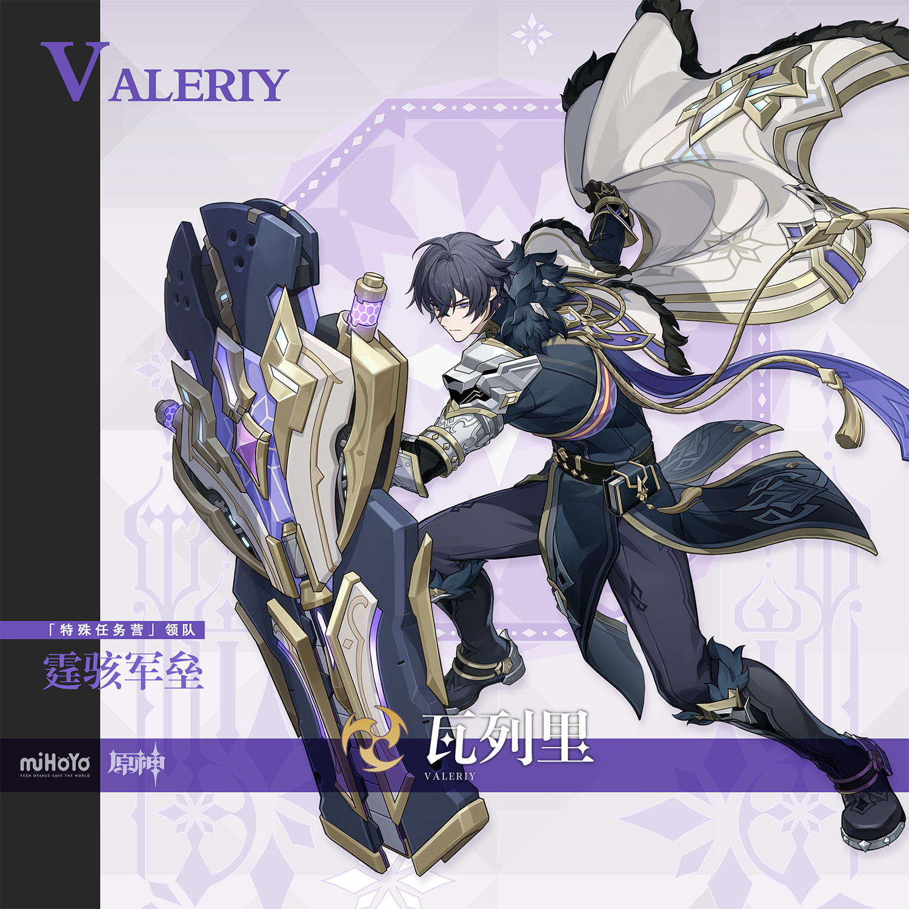
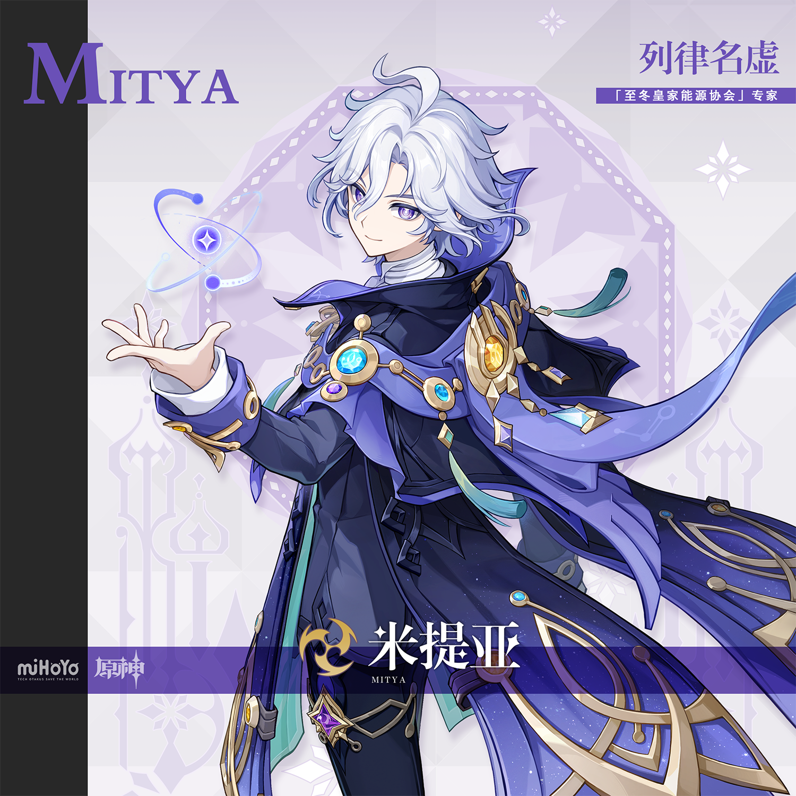
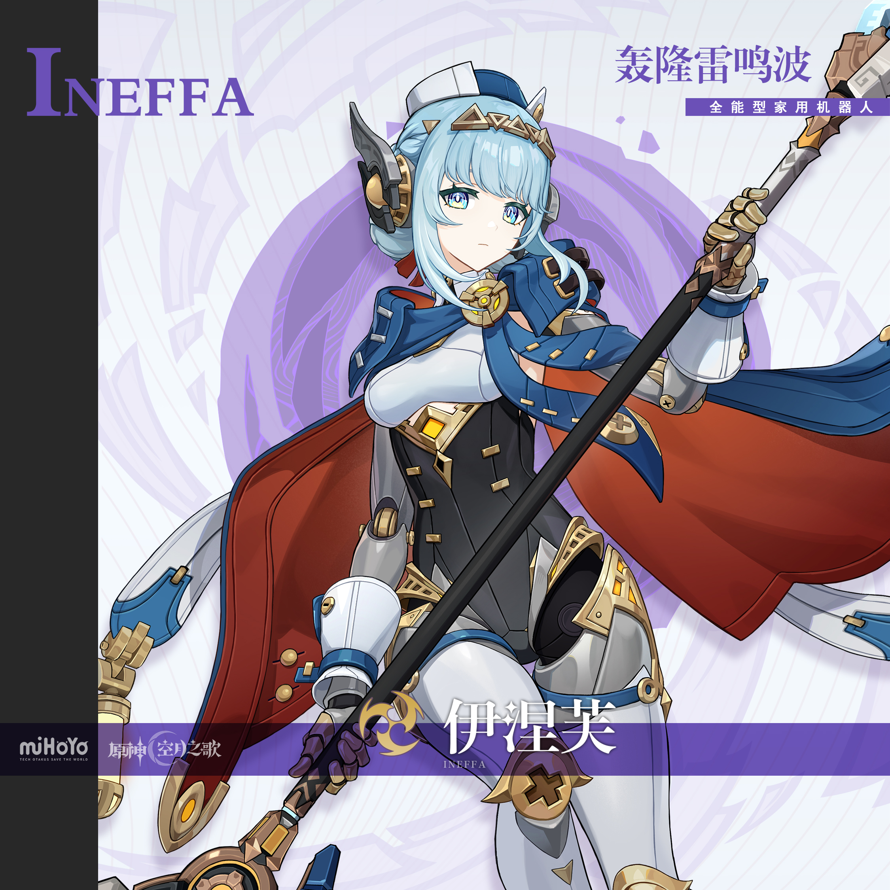
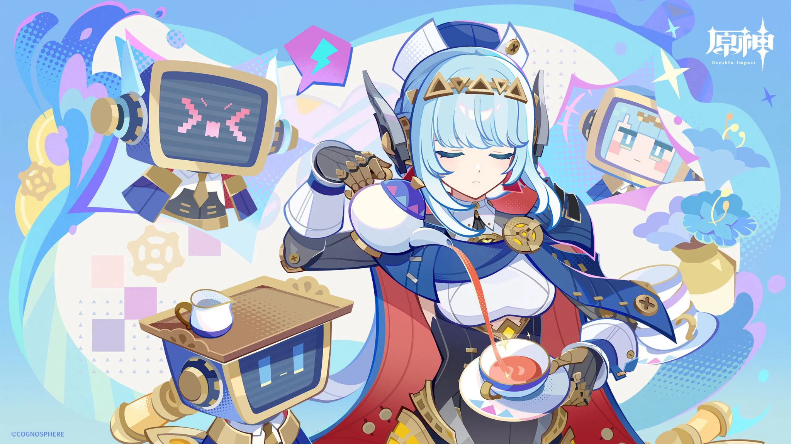
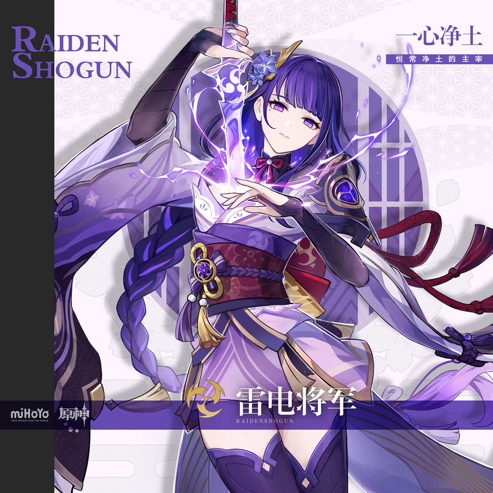
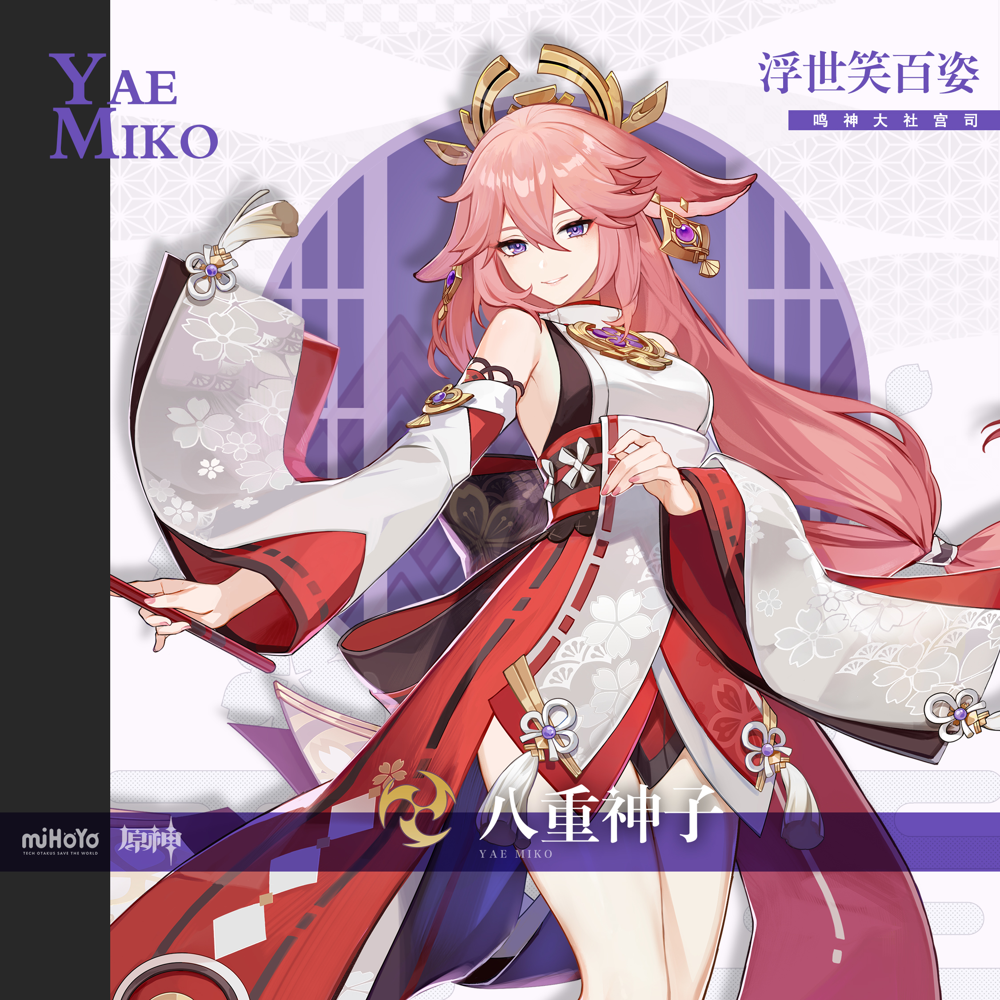
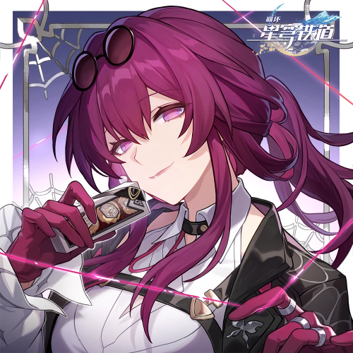
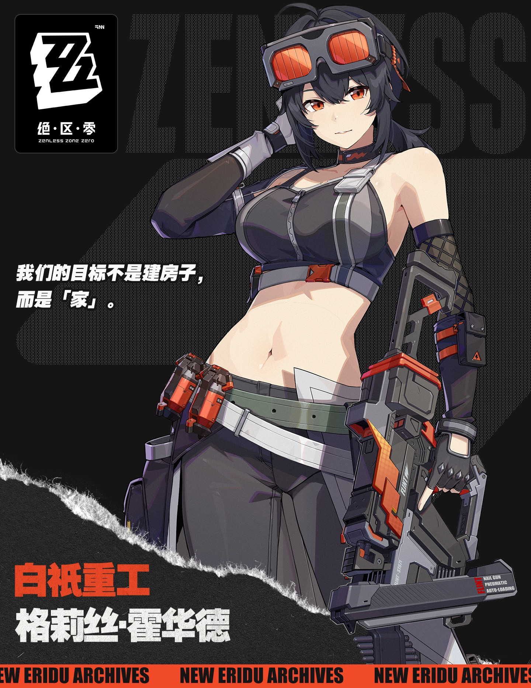

# 星超导·雷鸣战舰 — 2026.10.04
> 视频类型：B · 主题类型合集
> 统一比例：**3:4 竖版**（`3:4 vertical portrait wallpaper`），10 条 prompts 全部一致
> 主题说明：「星超导·雷鸣战舰」特辑——原神 7.2 双雷新角色（米提亚+瓦列里）领衔，横跨三款游戏的雷系角色全员登上至冬雷暴战舰甲板。统一视觉母题：**雷暴战舰甲板 + 紫电星辉**——每张画面必须出现紫电缠绕与一个「军事/工业金属元素」（巨盾、能量炉、舰炮、雷达、机械臂、射钉枪任选其一），主色调深蓝紫雷暴夜空 + 紫电白光 + 各角色主色点缀，成片像一艘乘风破雷的雷鸣战舰巡航日志
> 热点背景：①原神 7.2 版本双雷系新角色米提亚（新五星·列律名虚）与瓦列里（新四星·霆骇军垒）立绘已官宣，测试服 V2 进行中，前瞻直播定档 10/23 晚 8 点，「星超导」体系与「冰神战舰」配队讨论正热；②米提亚已在 9/28 做过单人集，本次以主题合集形式携新四星瓦列里返场；③绝区零 3.2 下半（洛克茜+普罗米娅复刻）9/30 开启、崩铁 4.6 真珠/绯英卡池进行中，雷系题材横跨三游正当时；④10/4 处于国庆黄金周中段，无新增单一角色爆发热点
> 涉及角色：瓦列里（原神 7.2 新四星·雷·双手剑·军械宫少校·工作区首次覆盖）、米提亚（原神 7.2 新五星·雷·至冬皇家能源协会专家）、伊涅芙（原神·雷·全能型家用机器人）、雷电将军（原神·雷·一心净土的主宰）、八重神子（原神·雷·鸣神大社宫司）、卡芙卡（崩铁·雷·星核猎手）、格莉丝（绝区零·电·白祇重工工程师）
> 选定类型理由：最优热点角色瓦列里为男性 → 按性别流量权重规则不出类型 A 单人集，改选类型 B 多角色合集消化；7.2 双雷新角色+星超导体系热点 → 「雷元素」天然适合多角色横向展示
> 选角理由：①瓦列里=7.2 唯一未覆盖的新角色、立绘刚官宣热度正盛；②米提亚=7.2 版本核心新五星，「老门」热度持续；③伊涅芙=月感电/雷系配队讨论常客，工作区已有校对立绘；④雷电将军=雷元素人气天花板、「充电宝」话题常青；⑤八重神子=米提亚强度对比的直接参照（"0命米提亚不如1命八重"正是当下热帖）；⑥卡芙卡=崩铁雷系人气代表、工作区已有官方面部素材；⑦格莉丝=绝区零电属性工程师，「我们的目标不是家」话题与军械宫工业气质呼应。5 原神 + 1 崩铁 + 1 绝区零，以 7.2 热点为轴心
> 参考图说明：瓦列里/米提亚/雷电将军/八重神子/格莉丝均为本期新下载并视觉校对的官方立绘；伊涅芙沿用工作区 splash-art.png（本期已复核）+ 薇尔琪塔官方图；卡芙卡使用工作区官方脸部特写 kafka-face.png（splash-art.png 为雨伞群像艺术图，本期不作为立绘引用）
> 系列画面规则：所有画面统一深蓝紫雷暴夜空 + 紫电白光 + 星辉超导粒子；每张必须出现紫电与至少一个军事/工业金属元素；第一位角色 prompt 最详细定义基调，后续角色引用第一张图作风格参考但**不可复制人物姿态**；尺度把控：成年角色、姿态优雅不露点，negative 统一排除 nude/topless/childlike

---

## 1（瓦列里·甲板哨卫·霆骇军垒）【基调定义 · 最详细】

Positive Prompt:
3:4 vertical portrait wallpaper, Valeriy from Genshin Impact, highly detailed anime-style illustration, polished game-art quality, a Thunder-Battleship deck under a deep blue-violet storm sky at night, rolling thunderclouds lit from within by violet lightning, a distant sea horizon, rain-slicked metal deck plates reflecting electric light. Valeriy stands at his sentry post mid-deck, weight on one leg in a firm military stance, holding his signature massive mechanical tower shield planted upright beside him with one hand — fingers naturally curled around the shield's grip, well-defined fingers — while his other hand rests calmly at his side. His expression is disciplined and alert — sharp violet eyes scanning the horizon, composed jaw, the quiet authority of a major who has never once failed a duty roster. Keep Valeriy's recognizable features: messy dark charcoal-blue hair with wind-blown fringe, violet eyes, fair skin, youthful masculine build with broad shoulders. He wears his canonical outfit: black long military tailcoat with gold trim and dark fur collar draped over his shoulders, white chest armor plate with silver pauldron, flowing white cape with gold-edged lining caught in the storm wind, purple-blue ribbons at his back, fitted black trousers and black boots with gold accents. His enormous black-blue-white mechanical shield with violet energy core and honeycomb canister stands beside him like a bastion. A giant zweihandler blade strapped across his back, faint Electro sparks crawling along the shield's edge, glowing star-light superconduct particles drifting in the storm air, naval rail guns and radar mast silhouetted in the background, violet lightning arcs and white electric highlights, deep indigo and violet palette with gold accents, heroic military atmosphere. tasteful and elegant throughout, no explicit content. Perfect hands, five fingers on each hand, anatomically correct hands, well-defined fingers, natural hand pose. Correct hip-to-thigh-to-knee anatomy, natural leg proportions, natural standing posture.

Negative Prompt:
low quality, worst quality, blurry, pixelated, bad anatomy, extra limbs, bad hands, extra fingers, fewer fingers, missing fingers, fused fingers, webbed fingers, merged fingers, overlapping fingers, deformed fingers, mutated fingers, six fingers, four fingers, three fingers, more than five fingers, less than five fingers, disfigured hands, poorly drawn hands, bad hand anatomy, asymmetrical hands, broken fingers, claw hands, blurry hands, indistinct fingers, smeared hands, missing legs, missing feet, missing calves, cropped legs, legs out of frame, twisted legs, rotated hips, dislocated hip, extra legs, third leg, fused legs, malformed knees, knees bending in opposite directions, unnatural sitting pose, disproportionate limbs, elongated calves, deformed feet, nude, topless, nipples, areola, explicit, childlike, loli, underage, feminine, androgynous, female body, skirt, crop top, warm cheerful lighting, sunny sky, indoor scene, wrong hair color, wrong eye color, incorrect character, text, watermark, logo, signature.

---

## 2（瓦列里·无缝之盾·护送专家）

Referring to the attached first artwork for style, lighting, and thunder-battleship atmosphere only, generate a 3:4 vertical portrait wallpaper of Valeriy from Genshin Impact in the same storm-deck mood, without copying the first pose. Valeriy kneels on one knee at the center of the warship deck in a classic shield-guard stance, his colossal mechanical tower shield planted before him and angled toward the viewer, violet Electro energy bursting from its core in a dome of crackling light, one gloved hand braced flat against the shield's face — five fingers on each hand, fingers naturally spread, well-defined fingers — the other hand gripping the strap across his chest. His expression is calm, unshakable, protective — eyes steady over the shield's rim, the face of a bodyguard who has intercepted ninety different threats and never flinched once. Keep all his canonical features from the first artwork: messy dark charcoal-blue hair, violet eyes, black military tailcoat with fur collar and white chest armor, white gold-lined cape billowing behind him. Rain and violet lightning streaks split against the invisible barrier of his shield, glowing superconduct star particles scattering like sparks on water, the storm sky and gun-metal superstructure looming behind, deep indigo-violet palette with white electric flashes and gold trim, steadfast guardian atmosphere. tasteful and elegant throughout, no explicit content. Perfect hands, five fingers on each hand, anatomically correct hands, well-defined fingers. Correct hip-to-thigh-to-knee anatomy, natural leg proportions.

Negative Prompt:
low quality, worst quality, blurry, pixelated, bad anatomy, extra limbs, bad hands, extra fingers, fewer fingers, missing fingers, fused fingers, webbed fingers, merged fingers, overlapping fingers, deformed fingers, mutated fingers, six fingers, four fingers, three fingers, more than five fingers, less than five fingers, disfigured hands, poorly drawn hands, bad hand anatomy, asymmetrical hands, broken fingers, claw hands, blurry hands, indistinct fingers, smeared hands, missing legs, missing feet, missing calves, cropped legs, legs out of frame, twisted legs, rotated hips, dislocated hip, extra legs, third leg, fused legs, malformed knees, knees bending in opposite directions, unnatural sitting pose, disproportionate limbs, elongated calves, deformed feet, nude, topless, nipples, areola, explicit, childlike, loli, underage, feminine, androgynous, warm cheerful lighting, sunny sky, indoor scene, wrong hair color, wrong eye color, incorrect character, text, watermark, logo, signature.

---

## 3（米提亚·能源炉畔·围巾与轨道）

Referring to the attached first artwork for style, lighting, and thunder-battleship atmosphere only, generate a 3:4 vertical portrait wallpaper of Mitya from Genshin Impact in the same storm-deck mood, without copying the first pose. Mitya lounges sideways on a supply crate beside the battleship's humming reactor core chamber, sitting side-saddle with both knees together and pointing in the same direction, calves hanging down side by side in natural parallel alignment, one hand lazily winding the end of his long white scarf — fingers naturally curled, well-defined fingers — the other hand balancing a floating miniature atom-orbit star sigil above his palm. His expression is a knowing, teasing smile — violet eyes half-lidded with playful brilliance, the look of an energy expert who abandoned his duty roster again and considers it a perfectly reasonable use of talent. Keep Mitya's recognizable features: fluffy layered silver-white hair with a springy ahoge, violet eyes, fair skin, slender youthful frame. He wears his canonical outfit: dark navy-blue long coat with black panels, high white cravat collar, sweeping blue-violet half-cape lined with starry nebula fabric and trimmed with golden orbital-ring brooches set with cyan, violet and amber gems, teal ribbons trailing from the shoulders, fitted dark trousers. Behind him a great brass-and-glass furnace core glows violet-blue through a round porthole window, gears and pressure gauges glinting, violet lightning dancing along conductor rails, drifting superconduct star particles, deep indigo and gold palette, relaxed genius-scientist atmosphere. tasteful and elegant throughout, no explicit content. Perfect hands, five fingers on each hand, anatomically correct hands, well-defined fingers. Correct hip-to-thigh-to-knee anatomy, natural leg proportions, natural seated posture.

Negative Prompt:
low quality, worst quality, blurry, pixelated, bad anatomy, extra limbs, bad hands, extra fingers, fewer fingers, missing fingers, fused fingers, webbed fingers, merged fingers, overlapping fingers, deformed fingers, mutated fingers, six fingers, four fingers, three fingers, more than five fingers, less than five fingers, disfigured hands, poorly drawn hands, bad hand anatomy, asymmetrical hands, broken fingers, claw hands, blurry hands, indistinct fingers, smeared hands, missing legs, missing feet, missing calves, cropped legs, legs out of frame, twisted legs, rotated hips, dislocated hip, extra legs, third leg, fused legs, malformed knees, knees bending in opposite directions, unnatural sitting pose, one leg crossed over the other, disproportionate limbs, elongated calves, deformed feet, nude, topless, nipples, areola, explicit, childlike, loli, underage, feminine, androgynous, warm cheerful lighting, sunny sky, outdoor daylight, wrong hair color, wrong eye color, incorrect character, text, watermark, logo, signature.

---

## 4（米提亚·超导领域·列律名虚）

Referring to the attached first artwork for style, lighting, and thunder-battleship atmosphere only, generate a 3:4 vertical portrait wallpaper of Mitya from Genshin Impact in the same storm-deck mood, without copying earlier poses. Mitya stands at the open center of the storm-swept deck, weight on one hip in a relaxed confident stance, one arm extended elegantly outward with fingers elegantly relaxed — natural hand pose, well-defined fingers — the other hand tucked behind his back, as a vast circular superconduct domain unfolds around him: concentric golden orbit-rings and violet Electro sigils spinning in the air like a living equation, lightning threads leaping between the rings. His expression is brilliant and satisfied — a wide delighted grin, violet eyes lit with the joy of a hypothesis finally proven, scarf and teal ribbons whipping in the electric wind. Keep all his canonical features from the first artwork: fluffy silver-white hair with springy ahoge, violet eyes, dark navy long coat with white cravat collar, blue-violet nebula-lined half-cape with golden orbital brooches and gem chains, teal ribbons, dark trousers. Above the deck the storm clouds spiral open in a vortex of violet light, giant glowing atom-orbit diagrams spinning like astral charts, rain suspended mid-fall around the domain edge, rail guns and the shield bastion silhouetted far behind, deep indigo-violet palette with gold equation-glow, triumphant scholar-of-thunder atmosphere. tasteful and elegant throughout, no explicit content. Perfect hands, five fingers on each hand, anatomically correct hands, well-defined fingers. Correct hip-to-thigh-to-knee anatomy, natural leg proportions, natural standing posture.

Negative Prompt:
low quality, worst quality, blurry, pixelated, bad anatomy, extra limbs, bad hands, extra fingers, fewer fingers, missing fingers, fused fingers, webbed fingers, merged fingers, overlapping fingers, deformed fingers, mutated fingers, six fingers, four fingers, three fingers, more than five fingers, less than five fingers, disfigured hands, poorly drawn hands, bad hand anatomy, asymmetrical hands, broken fingers, claw hands, blurry hands, indistinct fingers, smeared hands, missing legs, missing feet, missing calves, cropped legs, legs out of frame, twisted legs, rotated hips, dislocated hip, extra legs, third leg, fused legs, malformed knees, knees bending in opposite directions, disproportionate limbs, elongated calves, deformed feet, nude, topless, nipples, areola, explicit, childlike, loli, underage, feminine, androgynous, warm cheerful lighting, sunny sky, indoor scene, wrong hair color, wrong eye color, incorrect character, text, watermark, logo, signature.

---

## 5（伊涅芙·机巧随行·月感电回路）

Referring to the attached first artwork for style, lighting, and thunder-battleship atmosphere only, generate a 3:4 vertical portrait wallpaper of Ineffa from Genshin Impact in the same storm-deck mood, without copying the reference pose. Ineffa walks along the battleship's upper gangway mid-stride in a natural walking stance, her mechanical joints gleaming, one hand raised in a small commanding gesture with well-defined mechanical fingers, the other hand steadying the long orrery-topped staff resting against her shoulder. Her expression is composed and faintly curious — calm blue eyes with gold ringed irises watching the storm, serene android poise. Keep Ineffa's recognizable features: short pale ice-blue hair with side locks, gold triangle tiara headpiece, white bonnet-like head wings with dark mechanical ear pods, blue eyes with golden gear-shaped pupils, white-and-gold mechanical arms with exposed brass joints, dark corset bodice with gold studs, blue short cape with brass compass brooch and red-lined underside, white mechanical leg armor, a small red ribbon at her collar. Beside her marches her companion Verkita — a small boxy robot with a CRT television head displaying a cheerful pixel face, brass-blue body with spindly legs, keeping perfect step with her. Violet lightning crawls along the gangway rails and condenser coils, moon-charged electro particles floating like blue fireflies, a rotating radar dish and coil stack behind, deep indigo-violet storm palette with white-blue mechanical highlights, gentle machine-and-storm atmosphere. tasteful and elegant throughout, no explicit content. Perfect hands, five fingers on each hand, anatomically correct hands, well-defined fingers. Correct hip-to-thigh-to-knee anatomy, natural leg proportions, natural walking posture.

Negative Prompt:
low quality, worst quality, blurry, pixelated, bad anatomy, extra limbs, bad hands, extra fingers, fewer fingers, missing fingers, fused fingers, webbed fingers, merged fingers, overlapping fingers, deformed fingers, mutated fingers, six fingers, four fingers, three fingers, more than five fingers, less than five fingers, disfigured hands, poorly drawn hands, bad hand anatomy, asymmetrical hands, broken fingers, claw hands, blurry hands, indistinct fingers, smeared hands, missing legs, missing feet, missing calves, cropped legs, legs out of frame, twisted legs, rotated hips, dislocated hip, extra legs, third leg, fused legs, malformed knees, knees bending in opposite directions, disproportionate limbs, elongated calves, deformed feet, nude, topless, nipples, areola, explicit, childlike, loli, underage, fully human skin arms, warm cheerful lighting, sunny sky, indoor room, wrong hair color, wrong eye color, incorrect character, text, watermark, logo, signature.

---

## 6（雷电将军·无想一刀·雷光斩空）

Referring to the attached first artwork for style, lighting, and thunder-battleship atmosphere only, generate a 3:4 vertical portrait wallpaper of Raiden Shogun from Genshin Impact in the same storm-deck mood, without copying the reference pose. The Raiden Shogun stands upon the highest gun-platform of the battleship, weight balanced in a perfect warrior stance, drawing a blade of pure violet Electro light from her chest in one seamless motion — the blade held high mid-draw, both hands on the hilt with five fingers on each hand, fingers naturally wrapped, well-defined fingers. Her expression is serene and absolute — half-lidded violet eyes with quiet eternity behind them, no anger, only inevitability, like a bolt of lightning that has already decided where it will fall. Keep her recognizable features: long dark purple hair with pale lavender tips in a loose high braid, straight hime-cut bangs, violet eyes, a small beauty mark below her right eye, fair skin. She wears her canonical outfit: white and lavender kimono-style robe with deep purple sleeves, dark purple corset bodice with gold obi and central purple gem, single white sleeve with armored pauldron and dark bracer, red bow sash at the collar, dark thigh-high stockings with gold ornaments. The drawn Electro blade splits the storm sky with a colossal arc of violet-white light, thunderclouds parting in a circle above the ship, gun batteries and anchor chains silhouetted in the flash, drifting superconduct particles, deep indigo palette pierced by blinding violet-white lightning, majestic decisive-strike atmosphere. tasteful and elegant throughout, no explicit content. Perfect hands, five fingers on each hand, anatomically correct hands, well-defined fingers. Correct hip-to-thigh-to-knee anatomy, natural leg proportions, natural standing posture.

Negative Prompt:
low quality, worst quality, blurry, pixelated, bad anatomy, extra limbs, bad hands, extra fingers, fewer fingers, missing fingers, fused fingers, webbed fingers, merged fingers, overlapping fingers, deformed fingers, mutated fingers, six fingers, four fingers, three fingers, more than five fingers, less than five fingers, disfigured hands, poorly drawn hands, bad hand anatomy, asymmetrical hands, broken fingers, claw hands, blurry hands, indistinct fingers, smeared hands, missing legs, missing feet, missing calves, cropped legs, legs out of frame, twisted legs, rotated hips, dislocated hip, extra legs, third leg, fused legs, malformed knees, knees bending in opposite directions, disproportionate limbs, elongated calves, deformed feet, nude, topless, nipples, areola, explicit, childlike, loli, underage, bright cheerful daylight, warm cozy lighting, indoor scene, wrong hair color, wrong eye color, incorrect character, text, watermark, logo, signature.

---

## 7（八重神子·天狐戏雷·樱色雷光）

Referring to the attached first artwork for style, lighting, and thunder-battleship atmosphere only, generate a 3:4 vertical portrait wallpaper of Yae Miko from Genshin Impact in the same storm-deck mood, without copying the reference pose. Yae Miko perches gracefully on a coil of thick mooring rope at the deck rail, sitting side-saddle with both knees together and pointing in the same direction, calves hanging down side by side in natural parallel alignment, one hand holding a closed pink folding fan near her lips — fingers elegantly relaxed, natural hand pose — the other hand resting on her knee, a cluster of mischievous violet Electro fox-spirits circling her shoulders. Her expression is teasing and worldly — a knowing smile behind the fan, half-lidded violet eyes gleaming with five hundred years of gossip, utterly unbothered by the storm around her. Keep Yae Miko's recognizable features: long flowing pink hair with slack shoulder-length strands and tied side tufts, long pointed fox ears with gold ear ornaments, violet eyes, golden hairpin crown, fair skin. She wears her canonical outfit: white and red shrine-maiden inspired dress with detached white sleeves embroidered with cherry blossoms, dark red hakama-style shorts with gold leaf patterns, purple bow accents with white pom-poms, red ribbon sash. Beyond the rail, violet lightning illuminates drifting cherry blossom petals carried impossibly far out to sea, the ship's bronze fox-statue figurehead gleaming below her, Electro fox-spirit flames leaving violet trails, radar mast and signal lamps glowing in the rain, deep indigo-violet palette with sakura-pink accents, playful elegant trickster atmosphere. tasteful and elegant throughout, no explicit content. Perfect hands, five fingers on each hand, anatomically correct hands, well-defined fingers. Correct hip-to-thigh-to-knee anatomy, natural leg proportions, natural seated posture.

Negative Prompt:
low quality, worst quality, blurry, pixelated, bad anatomy, extra limbs, bad hands, extra fingers, fewer fingers, missing fingers, fused fingers, webbed fingers, merged fingers, overlapping fingers, deformed fingers, mutated fingers, six fingers, four fingers, three fingers, more than five fingers, less than five fingers, disfigured hands, poorly drawn hands, bad hand anatomy, asymmetrical hands, broken fingers, claw hands, blurry hands, indistinct fingers, smeared hands, missing legs, missing feet, missing calves, cropped legs, legs out of frame, twisted legs, rotated hips, dislocated hip, extra legs, third leg, fused legs, malformed knees, knees bending in opposite directions, unnatural sitting pose, one leg crossed over the other, disproportionate limbs, elongated calves, deformed feet, nude, topless, nipples, areola, explicit, childlike, loli, underage, human rounded ears, bright cheerful daylight, indoor shrine scene, wrong hair color, wrong eye color, incorrect character, text, watermark, logo, signature.

---

## 8（卡芙卡·星核猎手·紫电优雅）

Referring to the attached first artwork for style, lighting, and thunder-battleship atmosphere only, generate a 3:4 vertical portrait wallpaper of Kafka from Honkai: Star Rail in the same storm-deck mood, without copying the reference pose. Kafka strides down the rain-glinting deck toward the viewer in a relaxed confident walk, one hand sliding her dark sunglasses down the bridge of her nose just enough to reveal her wine-red eyes over the frames — fingers naturally curled on the temple of the glasses, well-defined fingers — the other hand tucked in her coat pocket. Her expression is leisurely and dangerous — a soft amused smile, the unhurried elegance of a woman who lets the storm come to her. Keep Kafka's recognizable features: long wine-purple hair in a loose high ponytail with face-framing strands and a small braid at the crown, dark round sunglasses pushed up on her head, purple-magenta eyes, fair skin, tall elegant feminine figure. She wears her canonical outfit: black fitted jacket with violet lining and gold buttons over a white ruffled blouse, black choker with a small purple gem, dark shorts with a brown leather harness strap across the hips, purple fingerless gloves reaching above the elbow, black thigh-high stockings with garter straps and dark heeled boots, a violin-case-like weapon case slung at her back. Violet lightning reflects in long streaks on the wet deck plates, glowing spirit-thread lines of magenta light drifting around her fingers, signal lamps and railing lights haloed in the rain, deep indigo-violet palette with wine-purple accents, noir-elegant hunter atmosphere. tasteful and elegant throughout, no explicit content. Perfect hands, five fingers on each hand, anatomically correct hands, well-defined fingers. Correct hip-to-thigh-to-knee anatomy, natural leg proportions, natural walking posture.

Negative Prompt:
low quality, worst quality, blurry, pixelated, bad anatomy, extra limbs, bad hands, extra fingers, fewer fingers, missing fingers, fused fingers, webbed fingers, merged fingers, overlapping fingers, deformed fingers, mutated fingers, six fingers, four fingers, three fingers, more than five fingers, less than five fingers, disfigured hands, poorly drawn hands, bad hand anatomy, asymmetrical hands, broken fingers, claw hands, blurry hands, indistinct fingers, smeared hands, missing legs, missing feet, missing calves, cropped legs, legs out of frame, twisted legs, rotated hips, dislocated hip, extra legs, third leg, fused legs, malformed knees, knees bending in opposite directions, disproportionate limbs, elongated calves, deformed feet, nude, topless, nipples, areola, explicit, childlike, loli, underage, blonde hair, green eyes, bright cheerful daylight, cozy indoor scene, wrong hair color, wrong eye color, incorrect character, text, watermark, logo, signature.

---

## 9（格莉丝·白祇重工·雷电改装）

Referring to the attached first artwork for style, lighting, and thunder-battleship atmosphere only, generate a 3:4 vertical portrait wallpaper of Grace Howard from Zenless Zone Zero in the same storm-deck mood, without copying the reference pose. Grace Howard stands at a makeshift workbench welded onto the battleship deck, weight on one leg in an easy engineer's stance, leaning slightly over her work with her giant black-and-orange nail gun resting against her shoulder like a rocket launcher, one gloved hand steadying its body — five fingers on each hand, fingers naturally wrapped around the grip, well-defined fingers — the other hand adjusting the orange goggles pushed up on her head. Her expression is focused delight — bright orange eyes lit with the thrill of an over-clock modification, a small confident smirk, the gaze of an engineer absolutely certain the machine will hold. Keep Grace's recognizable features: short messy black hair with a small low ponytail, vivid orange eyes, fair skin, athletic curvy figure. She wears her canonical outfit: black cropped sports tank top with grey straps, black choker with a small orange lightning emblem, olive-green utility belt with silver strap and red nail-canister pouches at the hip, dark grey cargo work pants, long black arm sleeves with orange checkered guard panel on the right forearm, fingerless work gloves. Her bench is covered with Voltage-calibrated coils, sparking welding arcs and a portable generator, violet Electro lightning from the storm arcing harmlessly into her grounding rod experiment, brass gauges and the ship's iron superstructure looming behind, deep indigo-violet storm palette with industrial orange-red accents, energetic workshop atmosphere. tasteful and elegant throughout, no explicit content. Perfect hands, five fingers on each hand, anatomically correct hands, well-defined fingers. Correct hip-to-thigh-to-knee anatomy, natural leg proportions, natural standing posture.

Negative Prompt:
low quality, worst quality, blurry, pixelated, bad anatomy, extra limbs, bad hands, extra fingers, fewer fingers, missing fingers, fused fingers, webbed fingers, merged fingers, overlapping fingers, deformed fingers, mutated fingers, six fingers, four fingers, three fingers, more than five fingers, less than five fingers, disfigured hands, poorly drawn hands, bad hand anatomy, asymmetrical hands, broken fingers, claw hands, blurry hands, indistinct fingers, smeared hands, missing legs, missing feet, missing calves, cropped legs, legs out of frame, twisted legs, rotated hips, dislocated hip, extra legs, third leg, fused legs, malformed knees, knees bending in opposite directions, disproportionate limbs, elongated calves, deformed feet, nude, topless, nipples, areola, explicit, childlike, loli, underage, red hair, blue eyes, bright cheerful daylight, cozy indoor office, wrong hair color, wrong eye color, incorrect character, text, watermark, logo, signature.

---

## 10（瓦列里 × 米提亚·少校与他的围巾专家）

Referring to the attached first artwork for style, lighting, and thunder-battleship atmosphere only, generate a 3:4 vertical portrait wallpaper featuring both Valeriy and Mitya from Genshin Impact together in the same storm-deck mood, without copying earlier poses. On the rain-cooled deck at watch's end, Valeriy stands at rigid parade attention beside the ship's rail, holding a neatly folded stack of reports against his chest with both hands — five fingers on each hand, fingers naturally curled, well-defined fingers — his massive shield planted upright at his other side, expression long-suffering but loyal. Perched cross-legged on top of the shield's flat rim like it is the most natural seat in Snezhnaya sits Mitya, knees drawn together, feet resting on the shield's boss, one hand waving a half-finished leave-request letter in the air, the other hand tugging his long white scarf so it flutters like a flag, violet eyes sparkling with unrepentant delight and a shameless grin. Keep both characters' canonical features: Valeriy with messy dark charcoal-blue hair, violet eyes, black military tailcoat with fur collar, white chest armor and gold-lined white cape; Mitya with fluffy silver-white hair and springy ahoge, violet eyes, dark navy long coat, white cravat, nebula-lined blue-violet half-cape with golden orbital brooches and teal ribbons. Between them floats a small glowing atom-orbit sigil with a tiny lightning bolt inside, a flickering lantern hanging from the rail above, violet lightning walking the distant clouds, superconduct star particles drifting between the two like sparks of an unlikely partnership, deep indigo-violet palette with gold and teal accents, warm comedic found-family atmosphere inside a thunderstorm. tasteful and elegant throughout, no explicit content. Perfect hands, five fingers on each hand, anatomically correct hands, well-defined fingers. Correct hip-to-thigh-to-knee anatomy, natural leg proportions, natural seated and standing postures.

Negative Prompt:
low quality, worst quality, blurry, pixelated, bad anatomy, extra limbs, bad hands, extra fingers, fewer fingers, missing fingers, fused fingers, webbed fingers, merged fingers, overlapping fingers, deformed fingers, mutated fingers, six fingers, four fingers, three fingers, more than five fingers, less than five fingers, disfigured hands, poorly drawn hands, bad hand anatomy, asymmetrical hands, broken fingers, claw hands, blurry hands, indistinct fingers, smeared hands, missing legs, missing feet, missing calves, cropped legs, legs out of frame, twisted legs, rotated hips, dislocated hip, extra legs, third leg, fused legs, malformed knees, knees bending in opposite directions, unnatural sitting pose, disproportionate limbs, elongated calves, deformed feet, nude, topless, nipples, areola, explicit, childlike, loli, underage, third person, crowd, duplicate characters, more than two people, feminine faces on male characters, bright cheerful daylight, indoor scene, wrong hair color, wrong eye color, incorrect character, text, watermark, logo, signature.

---

## 注
- 比例统一 3:4 竖版；第 1 条为基调定义条（最详细），第 2~10 条均通过「Referring to the attached first artwork for style, lighting, and thunder-battleship atmosphere only ... without copying」锁定系列成套感并禁止姿态复制
- 每张均含「紫电 + 军事/工业金属元素」母题：巨盾（1/2/10）、能量炉与导轨（3/4）、机械回路与雷达（5）、舰炮与刀光（6）、青铜狐像与信号灯（7）、湿甲板反光与信号灯（8）、焊接工作台与接地实验（9）
- 米提亚条目融入官方设定梗：围巾（晾晒围巾/保密权限文案）、原子轨道装饰（门捷列夫原型）、假条抗辩；第 10 条直接还原官方文案「瓦列里为米提亚的围巾申请保密权限 / 少校负责管理专家日程」的上下级喜剧关系
- 参考图 5 张为本期新下载（瓦列里×2、米提亚、雷电将军、八重神子、格莉丝），均已经视觉工具逐张校对；伊涅芙立绘与薇尔琪塔官方图为工作区已有文件，本期已复核内容一致
