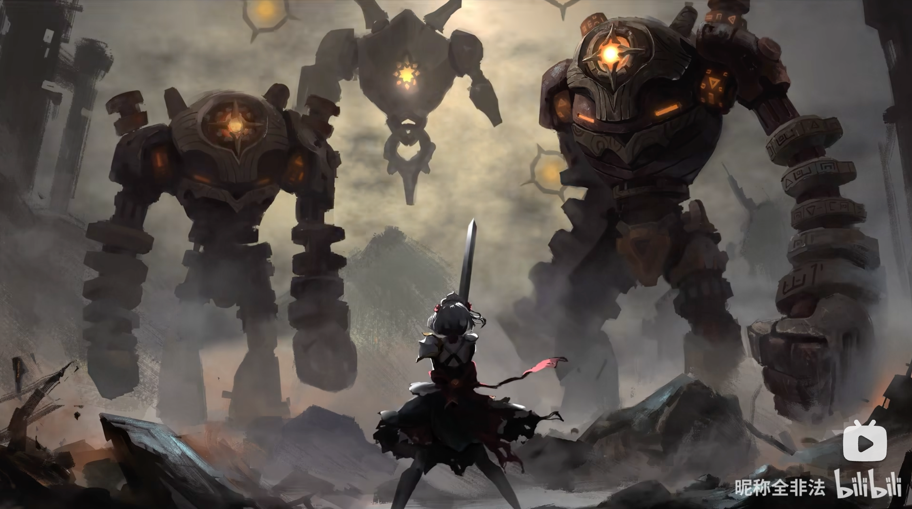

# 月升之前·中秋月夜 — 2026.09.19（v2 改版）
> 视频类型：B · 主题类型合集
> 统一比例：**3:4 竖版长宽比**（`3:4 vertical portrait wallpaper`），9 条 prompts 全部一致
> 主题说明：三个游戏 × 三位代表性女角色，共 9 人共赴同一轮中秋满月。全系列统一视觉母题：**一轮巨大明月悬于人物背后**，冷银月色为主基调，各角色主题色点缀；服装为性感妩媚向的夏日月光风格（比基尼式、JK 风、露脐短上衣与短裙等），尺度把握在优雅挑逗、不露不俗的范围内。
> 热点背景：①崩铁 4.6「月升之前，与兽共舞」前瞻 9/20 19:30 播出（预约 25.4 万人）；②原神 7.1（9/23 上线）返场璃月逐月节；③9/25 中秋节倒计时 6 天
> 选角（三游戏各 3 位代表性女角色）：
> - 原神：夜兰（妩媚天花板、悬念 agent）、妮露（舞台舞姬）、沃雅妮莎（7.1 上半新卡、深海女高音）
> - 崩铁：卡芙卡（成熟坏女人系顶流）、黄泉（冷艳浪客）、姬子（星际列车组熟龄优雅担当）
> - 绝区零：维琳娜（外务部优雅长官）、11号（飒爽军人身材）、南宫羽（天使光环偶像系）
> 外观资料来源：九人均引用工作区已视觉校对的官方立绘/已确认外观描述（黄泉经 acheron-splash.png 逐项校对：深紫蓝长发发梢银白渐变、紫瞳、左腿红色花焰纹身、白上衣黑短裤、蓝紫外套、红色油纸伞；维琳娜/南宫羽/11号/卡芙卡/姬子/夜兰/妮露/沃雅妮莎均沿用各自目录已确认描述）。
> 尺度把控：所有 prompt 均为成年角色、姿态优雅、不出现暴露走光细节；negative prompt 统一排除 nude/topless/nipples/childlike 等项，保证平台安全。

---

## 1（夜兰·月光下注）

Positive Prompt:
3:4 vertical portrait wallpaper, Yelan from Genshin Impact, highly detailed anime-style illustration, polished game-art quality, a sultry mid-autumn moonlit night.

A giant luminous full moon fills the sky directly behind her, its cold silver light rim-lighting her entire silhouette. Yelan sits side-saddle on the wide stone balustrade of a Liyue harbor rooftop at night, her body facing the viewer with relaxed shoulders, both knees together and pointing in the same direction, calves hanging down side by side in natural parallel alignment, correct hip-to-thigh-to-knee anatomy and natural leg proportions, one gloved hand resting on the railing post while the other holds a single glowing blue die between two fingers as if placing a midnight wager on the moon itself. Her unmistakable features: short asymmetrical dark-blue hair with blue highlights, pale skin, sharp blue-green eyes with a half-lidded inviting gaze, elegant slim figure, white fur mantle draped loosely off one shoulder. Moonlit summer outfit: a sleek black halter-neck one-piece swimsuit-style top with delicate gold trim, a sheer translucent blue sarong wrap knotted low at her hip and falling open over one long leg, long dark gloves, a single anklet. Cool silver-blue night palette with deep blue and gold accents, moonlight path shimmering on the sea behind the rooftops, faint glowing blue dice and Hydro light trails drifting around her, her expression confident, languid and subtly teasing. Tasteful and elegant throughout, no explicit content, sharp focus on Yelan.

perfect hands, five fingers on each hand, anatomically correct hands, well-defined fingers, one hand resting on the railing post, the other holding the die between two fingers, natural elegant hand pose, both legs in natural parallel alignment with correct proportions, natural seated posture.

Negative Prompt:
low quality, worst quality, blurry, pixelated, bad anatomy, extra limbs, bad hands, extra fingers, fewer fingers, missing fingers, fused fingers, webbed fingers, merged fingers, overlapping fingers, deformed fingers, mutated fingers, six fingers, four fingers, three fingers, more than five fingers, less than five fingers, disfigured hands, poorly drawn hands, bad hand anatomy, asymmetrical hands, broken fingers, claw hands, blurry hands, indistinct fingers, smeared hands, twisted legs, rotated hips, dislocated hip, extra legs, third leg, fused legs, malformed knees, knees bending in opposite directions, unnatural sitting pose, disproportionate limbs, elongated calves, deformed feet, wrong hair color, wrong eye color, nude, topless, nipples, areola, explicit, revealing nipples, childlike, loli, underage, male, wrong gender, daylight, bright sunny sky, chibi, photorealistic, 3D render, text, watermark, logo, signature.

## 2（妮露·月下谢幕）

Positive Prompt:
3:4 vertical portrait wallpaper, Nilou from Genshin Impact, highly detailed anime-style illustration, polished game-art quality, a graceful mid-autumn moonlit theater night.

A giant luminous full moon hangs directly behind her head like a silver stage spotlight, rim-lighting her silhouette with cold light. Nilou sits on the edge of a moonlit fountain stage in an empty open-air theater, petals drifting around her, one hand slipping off a single white dance shoe as the performance ends. Her unmistakable features: long flowing scarlet-red hair, bright turquoise eyes with a soft captivating gaze, her iconic black-and-gold horned headdress and small white veil kept in place. Moonlit summer outfit: a JK-style twist on her dancer elegance — a crisp white cropped school-style shirt tied at the waist with a navy ribbon bow, a high-waisted pale-blue pleated mini skirt with a sheer white overskirt panel like stage gauze, white knee socks rolled loosely at one ankle, delicate gold anklet and jewelry. Cool silver-blue night palette with scarlet and gold accents, lotus petals and pale-blue water light swirling around her, her expression gentle, charming and slightly flushed from the dance. Tasteful and elegant throughout, no explicit content, sharp focus on Nilou.

perfect hands, five fingers on each hand, anatomically correct hands, well-defined fingers, one hand slipping off a dance shoe, natural graceful hand pose.

Negative Prompt:
low quality, worst quality, blurry, pixelated, bad anatomy, extra limbs, bad hands, extra fingers, fewer fingers, missing fingers, fused fingers, webbed fingers, merged fingers, overlapping fingers, deformed fingers, mutated fingers, six fingers, four fingers, three fingers, more than five fingers, less than five fingers, disfigured hands, poorly drawn hands, bad hand anatomy, asymmetrical hands, broken fingers, claw hands, blurry hands, indistinct fingers, smeared hands, twisted legs, rotated hips, dislocated hip, extra legs, third leg, fused legs, malformed knees, knees bending in opposite directions, unnatural sitting pose, disproportionate limbs, elongated calves, deformed feet, wrong hair color, wrong eye color, missing horned headdress, nude, topless, nipples, areola, explicit, childlike, loli, underage, male, wrong gender, daylight, bright sunny sky, chibi, photorealistic, 3D render, text, watermark, logo, signature.

## 3（沃雅妮莎·月光歌后）

Positive Prompt:
3:4 vertical portrait wallpaper, Vanessa from Genshin Impact, highly detailed anime-style illustration, polished game-art quality, a mesmerizing mid-autumn moonlit aria.

A giant luminous full moon dominates the sky directly behind her, casting a cold silver halo around her silhouette. Vanessa stands knee-deep in a mirror-calm moonlit sea, head tilted slightly, one hand raised to her lips blowing a soft kiss toward the viewer while the other arm trails in the water, her translucent siren fin-tail of glowing moonlit water curling behind her. Her unmistakable features: long teal-to-blue gradient hair with wavy purple-blue highlight streaks drifting in the night breeze, a white flower ornament in her hair, violet-blue eyes with a smoldering half-lidded gaze. Moonlit summer outfit: a white pearl-accented bikini with delicate gold chain details at the hips, a sheer flowing white chiffon wrap floating loose around her arms, a gold shell bracelet. Cool silver-blue palette with teal and soft violet accents, glowing jellyfish rising past the moonlight, pale-blue songlight notes dissolving into the air around her, her expression alluring, serene and quietly seductive like a siren at midnight. Tasteful and elegant throughout, no explicit content, sharp focus on Vanessa.

perfect hands, five fingers on each hand, anatomically correct hands, well-defined fingers, one hand raised near her lips in a gentle kiss gesture, natural elegant hand pose.

Negative Prompt:
low quality, worst quality, blurry, pixelated, bad anatomy, extra limbs, bad hands, extra fingers, fewer fingers, missing fingers, fused fingers, webbed fingers, merged fingers, overlapping fingers, deformed fingers, mutated fingers, six fingers, four fingers, three fingers, more than five fingers, less than five fingers, disfigured hands, poorly drawn hands, bad hand anatomy, asymmetrical hands, broken fingers, claw hands, blurry hands, indistinct fingers, smeared hands, twisted legs, rotated hips, dislocated hip, extra legs, third leg, fused legs, malformed knees, knees bending in opposite directions, unnatural sitting pose, disproportionate limbs, elongated calves, deformed feet, wrong hair color, wrong eye color, nude, topless, nipples, areola, explicit, childlike, loli, underage, male, wrong gender, daylight, bright sunny sky, chibi, photorealistic, 3D render, text, watermark, logo, signature.

## 4（卡芙卡·月色狙击）

Positive Prompt:
3:4 vertical portrait wallpaper, Kafka from Honkai: Star Rail, highly detailed anime-style illustration, polished game-art quality, a dangerously elegant mid-autumn moonlit night.

A giant luminous full moon blazes directly behind her shoulders, its cold silver light outlining her figure with a bright rim glow. Kafka sits gracefully on the wide railing of a rooftop terrace at night, her body facing the viewer, both knees together and pointing in the same direction, calves hanging down side by side in natural parallel alignment with correct proportions, a glass of red wine held loosely in her fingertips, eyes fixed on the viewer over the rim of the glass as if deciding whether tonight's hunt is worth the pause. Her unmistakable features: dark magenta-purple hair tied in a messy high ponytail with two loose bangs framing her face, magenta-pink eyes with a teasing analytical gaze, sunglasses pushed up on top of her head, fair porcelain skin, elegant mature beauty. Moonlit summer outfit: a wine-red silk slip dress with a deep side slit and delicate black spider-web lace trim at the neckline and hem, one strap slipped teasingly down her shoulder, a thin black choker with a purple gem, strappy black heels dangling from her fingers. Cool silver-blue night palette with wine-red and purple accents, moonlight path on the city skyline below, faint violet spider-web light threads drifting in the breeze, her expression languid, predatory and irresistibly confident. Tasteful and elegant throughout, no explicit content, sharp focus on Kafka.

perfect hands, five fingers on each hand, anatomically correct hands, well-defined fingers, one hand holding the wine glass delicately, natural elegant hand pose.

Negative Prompt:
low quality, worst quality, blurry, pixelated, bad anatomy, extra limbs, bad hands, extra fingers, fewer fingers, missing fingers, fused fingers, webbed fingers, merged fingers, overlapping fingers, deformed fingers, mutated fingers, six fingers, four fingers, three fingers, more than five fingers, less than five fingers, disfigured hands, poorly drawn hands, bad hand anatomy, asymmetrical hands, broken fingers, claw hands, blurry hands, indistinct fingers, smeared hands, twisted legs, rotated hips, dislocated hip, extra legs, third leg, fused legs, malformed knees, knees bending in opposite directions, unnatural sitting pose, disproportionate limbs, elongated calves, deformed feet, wrong hair color, wrong eye color, nude, topless, nipples, areola, explicit, wardrobe malfunction, childlike, loli, underage, male, wrong gender, daylight, bright sunny sky, chibi, photorealistic, 3D render, text, watermark, logo, signature.

## 5（黄泉·月下红伞）

Positive Prompt:
3:4 vertical portrait wallpaper, Acheron from Honkai: Star Rail, highly detailed anime-style illustration, polished game-art quality, a coldly seductive mid-autumn moonlit night.

A giant luminous full moon rises directly behind her, its silver glow rim-lighting her silhouette against the night sky. Acheron stands in shallow black water that mirrors the moonlight, holding an open red paper umbrella tilted over one shoulder, her drawn katana resting against the other shoulder, red spider lilies blooming where the water ripples. Her unmistakable features: long dark purple-blue hair with silver-white gradient at the flowing tips, luminous violet eyes with a distant melancholic gaze, the red floral tattoo climbing her left thigh. Moonlit summer outfit: a white cropped sleeveless top with a black bikini top visible at the neckline, black high-waisted shorts slung low with a silver chain belt, her canonical blue-purple haori-style jacket worn loose and off the shoulders, black thigh-high boots. Cool silver-blue palette with crimson and violet accents, drifting red petals crossing the moonlight, faint bubble glints rising from the water, her expression aloof, quietly bewitching, like a wanderer who has seen a thousand moons. Tasteful and elegant throughout, no explicit content, sharp focus on Acheron.

perfect hands, five fingers on each hand, anatomically correct hands, well-defined fingers, one hand gripping the umbrella shaft, the other resting on the katana hilt, natural hand pose.

Negative Prompt:
low quality, worst quality, blurry, pixelated, bad anatomy, extra limbs, bad hands, extra fingers, fewer fingers, missing fingers, fused fingers, webbed fingers, merged fingers, overlapping fingers, deformed fingers, mutated fingers, six fingers, four fingers, three fingers, more than five fingers, less than five fingers, disfigured hands, poorly drawn hands, bad hand anatomy, asymmetrical hands, broken fingers, claw hands, blurry hands, indistinct fingers, smeared hands, twisted legs, rotated hips, dislocated hip, extra legs, third leg, fused legs, malformed knees, knees bending in opposite directions, unnatural sitting pose, disproportionate limbs, elongated calves, deformed feet, wrong hair color, wrong eye color, missing thigh tattoo, nude, topless, nipples, areola, explicit, gore, blood, childlike, loli, underage, male, wrong gender, daylight, bright sunny sky, chibi, photorealistic, 3D render, text, watermark, logo, signature.

## 6（姬子·月台咖啡）

Positive Prompt:
3:4 vertical portrait wallpaper, Himeko from Honkai: Star Rail, highly detailed anime-style illustration, polished game-art quality, a warm and graceful mid-autumn moonlit express stop.

A giant luminous full moon hangs low in the sky directly behind her, silver light rim-lighting her silhouette against the stars. Himeko sits elegantly on the rear observation platform of the Astral Express, parked at a moonlit cliff siding, both legs together with knees pointing in the same direction and calves hanging side by side in natural parallel alignment, a cup of black coffee held in both hands as steam curls into the night air. Her unmistakable features: waist-length bright crimson-red hair fading to deep indigo-navy at the tips, a half-up style secured by her V-shaped gold four-pointed star hairpiece, golden amber eyes with a mature knowing gaze, fair complexion, tall elegant figure. Moonlit summer outfit: a deep-red halter-style bikini top with gold star accents, a sheer coffee-brown chiffon wrap blouse left open and floating in the night breeze, high-waisted white linen shorts, gold earrings and a delicate bracelet. Cool silver-blue night palette with crimson and gold accents, rail tracks glinting toward the horizon under the moonlight, faint ember-gold particles drifting from her coffee, her expression warm, poised and gently captivating. Tasteful and elegant throughout, no explicit content, sharp focus on Himeko.

perfect hands, five fingers on each hand, anatomically correct hands, well-defined fingers, both hands cradling the coffee cup gracefully, natural hand pose.

Negative Prompt:
low quality, worst quality, blurry, pixelated, bad anatomy, extra limbs, bad hands, extra fingers, fewer fingers, missing fingers, fused fingers, webbed fingers, merged fingers, overlapping fingers, deformed fingers, mutated fingers, six fingers, four fingers, three fingers, more than five fingers, less than five fingers, disfigured hands, poorly drawn hands, bad hand anatomy, asymmetrical hands, broken fingers, claw hands, blurry hands, indistinct fingers, smeared hands, twisted legs, rotated hips, dislocated hip, extra legs, third leg, fused legs, malformed knees, knees bending in opposite directions, unnatural sitting pose, disproportionate limbs, elongated calves, deformed feet, wrong hair color, wrong eye color, nude, topless, nipples, areola, explicit, childlike, loli, underage, male, wrong gender, daylight, bright sunny sky, chibi, photorealistic, 3D render, text, watermark, logo, signature.

## 7（维琳娜·月下请柬）

Positive Prompt:
3:4 vertical portrait wallpaper, Velina from Zenless Zone Zero, highly detailed anime-style illustration, polished game-art quality, a composed and alluring mid-autumn moonlit night.

A giant luminous full moon floats in the sky directly behind her head, silver light rim-lighting her silhouette with an elegant glow. Velina stands on the terrace of a luminous high-rise above a floating sky-city at night, an embossed silver invitation card held between two gloved fingers, extending it toward the viewer with a gracious tilt of her head — an invitation to the moon-viewing ball. Her unmistakable features: extremely long silver-lavender wavy hair flowing past her waist with a thin side braid, a white military-style beret with gold studs, lavender-violet eyes with a calm commanding gaze, small pointed elf ears, gold fan-shaped drop earrings. Moonlit summer outfit: an ivory lace-trimmed satin camisole slip dress with a slit up the thigh, a cropped royal-blue jacket worn off one shoulder, a black lace-up corset belt cinching the waist, sleek navy heeled ankle boots, one white lace garter strap kept on her thigh. Cool silver-blue night palette with lavender and royal-blue accents, drifting gold fan-light particles, the sky-city's soft lights far below the moonlit clouds, her expression gracious, controlled and subtly seductive. Tasteful and elegant throughout, no explicit content, sharp focus on Velina.

perfect hands, five fingers on each hand, anatomically correct hands, well-defined fingers, one hand extending the invitation card between two fingers, natural elegant hand pose.

Negative Prompt:
low quality, worst quality, blurry, pixelated, bad anatomy, extra limbs, bad hands, extra fingers, fewer fingers, missing fingers, fused fingers, webbed fingers, merged fingers, overlapping fingers, deformed fingers, mutated fingers, six fingers, four fingers, three fingers, more than five fingers, less than five fingers, disfigured hands, poorly drawn hands, bad hand anatomy, asymmetrical hands, broken fingers, claw hands, blurry hands, indistinct fingers, smeared hands, twisted legs, rotated hips, dislocated hip, extra legs, third leg, fused legs, malformed knees, knees bending in opposite directions, unnatural sitting pose, disproportionate limbs, elongated calves, deformed feet, wrong hair color, wrong eye color, missing beret, nude, topless, nipples, areola, explicit, childlike, loli, underage, male, wrong gender, daylight, bright sunny sky, chibi, photorealistic, 3D render, text, watermark, logo, signature.

## 8（11号·月下哨戒）

Positive Prompt:
3:4 vertical portrait wallpaper, Soldier 11 from Zenless Zone Zero, highly detailed anime-style illustration, polished game-art quality, a disciplined yet alluring mid-autumn moonlit night.

A giant luminous full moon looms directly behind her, cold silver light rim-lighting her athletic silhouette. Soldier 11 stands atop a training-ground obstacle at night, straight-backed and poised, wiping her forehead with a forearm towel after a midnight drill, her fire-glaive planted upright beside her, embers glowing at its blade. Her unmistakable features: short silver-white hair tied in a slightly messy high ponytail, sharp golden eyes with a calm intense gaze, cool sharp facial features, athletic toned figure. Moonlit summer outfit: a fitted white cropped tank top with a zipper at the collar, black high-waisted tactical shorts with strap details, dog tags resting at her collarbone, fingerless gloves, one long black thigh strap, military boots unlaced and loosened for the break. Cool silver-blue night palette with ember-orange and silver accents, faint heat shimmer rising from the embers, the training ground quiet under the moonlight, her expression composed, steady and unexpectedly charming in her rare moment of rest. Tasteful and elegant throughout, no explicit content, sharp focus on Soldier 11.

perfect hands, five fingers on each hand, anatomically correct hands, well-defined fingers, one hand holding the towel at her collarbone, natural relaxed hand pose.

Negative Prompt:
low quality, worst quality, blurry, pixelated, bad anatomy, extra limbs, bad hands, extra fingers, fewer fingers, missing fingers, fused fingers, webbed fingers, merged fingers, overlapping fingers, deformed fingers, mutated fingers, six fingers, four fingers, three fingers, more than five fingers, less than five fingers, disfigured hands, poorly drawn hands, bad hand anatomy, asymmetrical hands, broken fingers, claw hands, blurry hands, indistinct fingers, smeared hands, twisted legs, rotated hips, dislocated hip, extra legs, third leg, fused legs, malformed knees, knees bending in opposite directions, unnatural sitting pose, disproportionate limbs, elongated calves, deformed feet, wrong hair color, wrong eye color, nude, topless, nipples, areola, explicit, gore, childlike, loli, underage, male, wrong gender, daylight, bright sunny sky, chibi, photorealistic, 3D render, text, watermark, logo, signature.

## 9（南宫羽·月下独舞）

Positive Prompt:
3:4 vertical portrait wallpaper, Nangong Yu from Zenless Zone Zero, highly detailed anime-style illustration, polished game-art quality, a dazzling mid-autumn moonlit stage fantasy.

A giant luminous full moon glows directly behind her like her own private stage spotlight, silver light rim-lighting her silhouette against the night. Nangong Yu dances mid-air on a moonlit rooftop stage, one leg bent in a light step, arms sweeping wide as her folded silver-white mechanical wings unfurl halfway behind her, her teal angel halo brightening as she spins, pink light trails following her choreography. Her unmistakable features: black hair styled into two large round pink buns with teal wing hairpins, sharp crimson-red eyes with a confident sparkling gaze, teal angel halo floating above her head. Moonlit summer outfit: a pink-and-black frilled micro two-piece stage costume with a heart-shaped cutout at the chest, a sheer pink shrug slipping off both shoulders, a high-waisted black micro skirt with layered pink ribbon streamers, sheer thigh-high stockings with a pink stripe, chunky platform boots. Cool silver-blue night palette with pink and teal accents, glowing pink feathers and light-note particles spiraling up past the moon, her expression radiant, playful and magnetic mid-performance. Tasteful and elegant throughout, no explicit content, sharp focus on Nangong Yu.

perfect hands, five fingers on each hand, anatomically correct hands, well-defined fingers, both arms sweeping gracefully with fingers extended, natural dance hand pose.

Negative Prompt:
low quality, worst quality, blurry, pixelated, bad anatomy, extra limbs, bad hands, extra fingers, fewer fingers, missing fingers, fused fingers, webbed fingers, merged fingers, overlapping fingers, deformed fingers, mutated fingers, six fingers, four fingers, three fingers, more than five fingers, less than five fingers, disfigured hands, poorly drawn hands, bad hand anatomy, asymmetrical hands, broken fingers, claw hands, blurry hands, indistinct fingers, smeared hands, twisted legs, rotated hips, dislocated hip, extra legs, third leg, fused legs, malformed knees, knees bending in opposite directions, unnatural sitting pose, disproportionate limbs, elongated calves, deformed feet, wrong hair color, wrong eye color, missing halo, missing wings, nude, topless, nipples, areola, explicit, childlike, loli, underage, male, wrong gender, daylight, bright sunny sky, chibi, photorealistic, 3D render, text, watermark, logo, signature.

---

## 注
- v2 改版说明（2026-09-19 用户指令）：比例由 16:9+9:16 改为统一 **3:4 竖版**；选角改为三游戏各 3 位代表性女角色（原神：夜兰/妮露/沃雅妮莎，崩铁：卡芙卡/黄泉/姬子，绝区零：维琳娜/11号/南宫羽）；服装风格改为性感妩媚向（比基尼式/JK 风/露脐短上衣与短裙），尺度控制在优雅范围内；SKILL.md 类型 B 规范已同步增补「统一 3:4 比例」条款。
- 统一视觉母题：每条 prompt 均要求「巨大满月悬于人物背后 + 冷银轮廓光 + 角色主题色点缀」，保证九图并列时的系列一致性；第 1 条夜兰为风格基调定义图，后续可引用其生成图作为氛围参考。
- 全部 9 人均为成年女性形象；negative prompt 已统一排除 nude/topless/nipples/childlike/loli/underage 等项。
- 尺度设计：夜兰（黑金吊带连体+透纱）、卡芙卡（酒红丝质吊带裙）、黄泉（白上衣黑比基尼+和风外褂）偏泳装系；妮露（JK 衬衫+百褶裙）、南宫羽（舞台感两件套）偏短裙系；姬子（挂脖泳装上衣+亚麻短裤）、维琳娜（缎面吊带裙）、11号（露脐背心+战术短裤）、沃雅妮莎（珍珠白比基尼+纱巾）居中。
- v2.1 姿势修复（2026-09-19 用户反馈）：首跑夜兰图出现大腿根/髋部衔接断裂、双膝朝向矛盾、小腿拉长扭曲——根因是「栏杆坐+跷二郎腿」复合姿势。已将夜兰/卡芙卡/姬子三个坐姿统一改为「侧坐、双膝并拢同向、小腿平行自然下垂」，positive 增加髋-腿解剖锚定词（correct hip-to-thigh-to-knee anatomy / both knees together pointing in the same direction / calves in natural parallel alignment），全部 9 条 negative 追加 twisted legs / rotated hips / extra legs / third leg / fused legs / malformed knees / elongated calves 等腿部排除词。后续教训：坐姿类 prompt 禁用「跷二郎腿 / 单脚钩栏杆」写法，站立或侧坐+双腿并拢为安全姿势。
