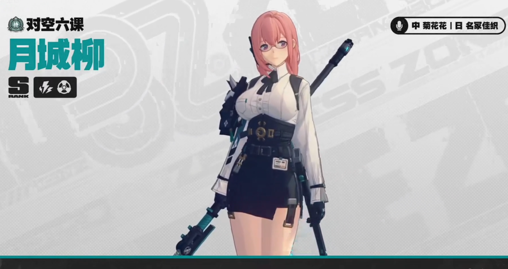

# 月升之前·中秋月夜 — 2026.09.19
> 视频类型：B · 主题类型合集
> 主题说明：五个世界之上同一轮满月——五位米哈游角色共赴一场中秋月夜：月下海面咏叹调、月光画卷、月城执勤夜、月光天鹅湖、满月斩月。每角色 2 条（16:9 横版 + 9:16 手机竖版），共 10 条 prompts，全系列共用同一套「巨大满月 + 冷银月色 + 角色主题色点缀」的视觉基调
> 热点背景：三重「月」热点汇聚——①崩铁 4.6 版本「月升之前，与兽共舞」前瞻特别节目明晚（9/20 19:30）播出，直播间预约已达 25.4 万人，版本名自带「月」字话题正在升温；②原神 7.1 六周年版本（9/23 上线）宣布返场璃月「逐月节」，游戏内月节与现实中秋撞车；③9/25 中秋节将至，社区月饼/赏月/玉兔内容开始起量
> 涉及角色：沃雅妮莎（原神 7.1 上半卡池新角色）、真珠（崩铁 4.6 前瞻主角）、月城柳（绝区零，「月城」之名+9/21 生日）、奥黛塔（原神 7.0 至冬芭蕾舞者）、镜流（崩铁，「无罅飞光」，技能全系带月）
> 选定类型理由：今日无新角色官宣/上线级重大热点（原神 7.1 四位角色均已在工作区覆盖，崩铁 4.6 新角色明日前瞻才揭晓），但「崩铁月升之前前瞻前夜 + 逐月节返场 + 中秋倒计时 6 天」三重时事主题高度汇聚，天然适合多角色横向展示 → 类型 B
> 选角理由：沃雅妮莎=7.1 最热新卡+月下深海歌声；真珠=4.6 前瞻主角+称号语「点染星月」自带月字；月城柳=名字即「月之城」+9/21 生日（后天）+工作区首次覆盖；奥黛塔=月光天鹅湖的经典意象；镜流=称号「无罅飞光」、技能「流光之月/寒川映月」、立绘本体就是月下挥剑，月主题第一人选
> 参考图说明：镜流立绘已下载自 B站WIKI（jingliu-splash.png 2048px，经视觉校对：浅蓝灰白长发高马尾+圆环发髻青丝发带、绯红眼瞳、天青/烟青色战裙、银色肩甲、蓝色护臂、黑色过膝长靴、月下冰晶背景）；月城柳立绘已下载自 B站WIKI（yanagi-ref.png，经视觉校对：粉色中长发低扎、浅紫眼瞳、浅色边框眼镜、白衬衫+黑色蝴蝶结领结、黑色束腰腰带金色扣、黑色包臀短裙、右肩黑色护甲、黑色手套、背后薙刀、对空六课徽章）；真珠/沃雅妮莎/奥黛塔外观描述沿用工作区已视觉校对的官方立绘资料

---

## 1（沃雅妮莎·月下深海咏叹调）

Positive Prompt:
16:9 2K wallpaper, Vanessa from Genshin Impact, highly detailed anime-style illustration, polished game-art quality, a breathtaking mid-autumn moonlit seascape.

A giant luminous full moon hangs low over a calm midnight sea, its silver reflection stretching across the water in a shimmering path of light. Vanessa stands upon the sea surface as if it were her opera stage, bare feet touching the mirrored moonlight, her head tilted back mid-aria with one graceful arm raised toward the moon, pale-blue songlight and translucent water spirits swirling from her lips into the night sky like visible music. Her unmistakable features: long teal-to-blue gradient hair with wavy purple-blue highlight streaks drifting weightlessly in the sea breeze, a white flower ornament pinned in her hair, violet-blue eyes half-closed in song, and a translucent siren fin-tail of glowing moonlit water curling behind her. She wears her canonical off-shoulder white opera gown with flowing sleeves and layered pale-blue hem, silver accents catching the moonlight. Around her, moonbeams pierce thin clouds, white seabirds glide across the giant moon disc, glowing jellyfish rise slowly from the deep, and opera-style music notes of pale water-light dissolve into the air. Cool silver-blue palette with teal and soft violet accents, gentle god-rays, serene and majestic opera-nocturne mood. highly detailed background, sharp focus on Vanessa.

perfect hands, five fingers on each hand, anatomically correct hands, well-defined fingers, one arm raised elegantly with fingers gently extended, natural hand pose.

Negative Prompt:
low quality, worst quality, blurry, pixelated, bad anatomy, extra limbs, bad hands, extra fingers, fewer fingers, missing fingers, fused fingers, webbed fingers, merged fingers, overlapping fingers, deformed fingers, mutated fingers, six fingers, four fingers, three fingers, more than five fingers, less than five fingers, disfigured hands, poorly drawn hands, bad hand anatomy, asymmetrical hands, broken fingers, claw hands, blurry hands, indistinct fingers, smeared hands, wrong hair color, wrong eye color, male, wrong gender, daylight, bright sunny sky, chibi, photorealistic, 3D render, text, watermark, logo, signature.

## 1b（沃雅妮莎·同景手机竖版）

Positive Prompt:
9:16 vertical mobile wallpaper, same scene and character as the previous image: Vanessa from Genshin Impact singing her moonlit aria upon a mirror-calm midnight sea under a giant luminous full moon, tall vertical composition with the great moon disc directly behind her head like a silver halo, her reflection shimmering down the water path below. Long teal-to-blue gradient hair with wavy purple-blue highlight streaks drifting in the night breeze, white flower hair ornament, violet-blue eyes half-closed in song, translucent siren fin-tail of glowing moonlit water curling at her side, canonical off-shoulder white opera gown with flowing sleeves. Pale-blue songlight and water spirits spiral upward around her into the starry sky, glowing jellyfish and white seabirds crossing the moonlight. Cool silver-blue palette with teal and soft violet accents, highly detailed anime-style illustration, sharp focus on Vanessa, serene majestic nocturne mood.

perfect hands, five fingers on each hand, anatomically correct hands, well-defined fingers, one arm raised elegantly with fingers gently extended, natural hand pose.

Negative Prompt:
low quality, worst quality, blurry, pixelated, bad anatomy, extra limbs, bad hands, extra fingers, fewer fingers, missing fingers, fused fingers, webbed fingers, merged fingers, overlapping fingers, deformed fingers, mutated fingers, six fingers, four fingers, three fingers, more than five fingers, less than five fingers, disfigured hands, poorly drawn hands, bad hand anatomy, asymmetrical hands, broken fingers, claw hands, blurry hands, indistinct fingers, smeared hands, wrong hair color, wrong eye color, male, wrong gender, daylight, bright sunny sky, landscape orientation, wide horizontal framing, chibi, photorealistic, 3D render, text, watermark, logo, signature.

---

## 2（真珠·月光画卷）

Positive Prompt:
16:9 2K wallpaper, Pearl from Honkai: Star Rail, highly detailed anime-style illustration, polished game-art quality, dreamlike mid-autumn ink-wash wonderland.

Referring to the shared series mood of a giant luminous full moon over a tranquil night, depict Pearl seated gracefully on a floating pale scrolls platform drifting on a moonlit ink-wash lake, painting the full moon itself onto an enormous unfurling scroll suspended in the air before her — her long calligraphy brush with golden shaft leaving a streak of luminous silver-white ink, and the freshly painted moon glowing brighter than the real one above, as if she could hang a new moon into the sky by brushstroke. Her unmistakable features: extremely long pale-golden cream hair with voluminous drifting strands and pale-blue gradient inner streaks floating gently around her, light blue eyes focused and serene, her golden tiara circlet with a central blue gem and pearl accents. She wears her canonical outfit: a white strapless top with exposed shoulders, a large blue scallop-shell draped piece over her right shoulder like a wave, wide flowing white detached sleeves, coral-red ribbons trailing at her chest, a blue bow sash at her waist, and a white layered high-slit skirt with blue lining. Subtle golden android joints visible at her wrists and knees. Around her, a school of glowing pink koi fish light effects arcs across the giant moon disc like living brushstrokes, silver ink vortexes and drifting gold leaf sparkles fill the air, distant mountains rendered in soft blue ink wash. Cool silver-blue palette with cream-gold and coral accents, elegant and poetic mood, highly detailed background, sharp focus on Pearl.

perfect hands, five fingers on each hand, anatomically correct hands, well-defined fingers, one hand holding the brush shaft delicately between fingers, the other hand steadying the floating scroll, natural hand pose.

Negative Prompt:
low quality, worst quality, blurry, pixelated, bad anatomy, extra limbs, bad hands, extra fingers, fewer fingers, missing fingers, fused fingers, webbed fingers, merged fingers, overlapping fingers, deformed fingers, mutated fingers, six fingers, four fingers, three fingers, more than five fingers, less than five fingers, disfigured hands, poorly drawn hands, bad hand anatomy, asymmetrical hands, broken fingers, claw hands, blurry hands, indistinct fingers, smeared hands, wrong hair color, wrong eye color, missing tiara, dark gritty atmosphere, horror atmosphere, daylight, bright sunny sky, chibi, photorealistic, 3D render, text, watermark, logo, signature.

## 2b（真珠·同景手机竖版）

Positive Prompt:
9:16 vertical mobile wallpaper, same scene and character as the previous image: Pearl from Honkai: Star Rail seated on a floating pale scrolls platform on a moonlit ink-wash lake, painting a glowing full moon onto a towering vertical scroll that rises through the tall composition — the painted moon near the top of the frame, the real moon veiled in thin clouds above it, her vertical brushstroke connecting the two like a bridge of silver ink. Extremely long pale-golden cream hair with pale-blue gradient inner streaks drifting around her, light blue eyes serene and focused, golden tiara circlet with central blue gem and pearl accents, canonical white outfit with blue scallop-shell drape over her right shoulder, wide flowing detached sleeves, coral-red ribbons, blue bow sash, white layered high-slit skirt, subtle golden android joints at wrists and knees. Glowing pink koi light effects spiral up the scroll, gold leaf sparkles drifting. Cool silver-blue palette with cream-gold and coral accents, highly detailed anime-style illustration, sharp focus on Pearl, elegant poetic mid-autumn mood.

perfect hands, five fingers on each hand, anatomically correct hands, well-defined fingers, one hand holding the brush shaft delicately between fingers, natural hand pose.

Negative Prompt:
low quality, worst quality, blurry, pixelated, bad anatomy, extra limbs, bad hands, extra fingers, fewer fingers, missing fingers, fused fingers, webbed fingers, merged fingers, overlapping fingers, deformed fingers, mutated fingers, six fingers, four fingers, three fingers, more than five fingers, less than five fingers, disfigured hands, poorly drawn hands, bad hand anatomy, asymmetrical hands, broken fingers, claw hands, blurry hands, indistinct fingers, smeared hands, wrong hair color, wrong eye color, missing tiara, dark gritty atmosphere, daylight, landscape orientation, wide horizontal framing, chibi, photorealistic, 3D render, text, watermark, logo, signature.

---

## 3（月城柳·月城执勤夜）

Positive Prompt:
16:9 2K wallpaper, Yanagi from Zenless Zone Zero, highly detailed anime-style illustration, polished game-art quality, a quiet cinematic mid-autumn night on a city rooftop.

A giant luminous full moon rises over the neon-dim skyline of a modern city, the rooftop of the Hollow Special Operations Section 6 office building beneath it. Yanagi stands at the rooftop railing on night duty, pausing for a rare moment of rest, holding a red-bean paste bun in one hand and a warm canned moon-viewing tea in the other, her expression soft and gently amused as if sharing a quiet dry joke with the moon itself. Her unmistakable features: shoulder-length pink hair loosely tied at the back with soft face-framing strands, lavender-purple eyes behind light-framed glasses catching a faint lens glint, a calm mature gentle aura. She wears her canonical Section 6 outfit: a crisp white long-sleeve shirt with a black ribbon bow at the collar, a black corset-style waist cinch with a gold buckle, a black pencil skirt, black tactical shoulder armor on her right shoulder, black gloves, her collapsible naginata propped against the railing within reach, an ID badge at her waist. On the railing beside her sit a small plate of mooncakes and a stack of paperwork weighted by a rabbit-shaped paperweight; faint teal electric sparks drift from her shoulder armor and dissolve like fireflies. Below the rooftop, distant city lights glow warm amber, a paper lantern or two floating up past the moon. Cool silver-blue night palette with pink and teal accents, warm bun steam curling in the moonlight, peaceful yet quietly dependable mood. highly detailed background, sharp focus on Yanagi.

perfect hands, five fingers on each hand, anatomically correct hands, well-defined fingers, one hand holding the red-bean bun naturally, the other hand cradling the tea can, natural relaxed hand pose.

Negative Prompt:
low quality, worst quality, blurry, pixelated, bad anatomy, extra limbs, bad hands, extra fingers, fewer fingers, missing fingers, fused fingers, webbed fingers, merged fingers, overlapping fingers, deformed fingers, mutated fingers, six fingers, four fingers, three fingers, more than five fingers, less than five fingers, disfigured hands, poorly drawn hands, bad hand anatomy, asymmetrical hands, broken fingers, claw hands, blurry hands, indistinct fingers, smeared hands, wrong hair color, wrong eye color, missing glasses, male, wrong gender, daylight, bright sunny sky, chibi, photorealistic, 3D render, text, watermark, logo, signature.

## 3b（月城柳·同景手机竖版）

Positive Prompt:
9:16 vertical mobile wallpaper, same scene and character as the previous image: Yanagi from Zenless Zone Zero standing at a rooftop railing on a quiet mid-autumn night shift, tall vertical composition with the giant luminous full moon high above her and the neon-dim city skyline falling away below. Shoulder-length pink hair loosely tied back, lavender-purple eyes behind light-framed glasses with a faint lens glint, calm gentle expression holding a warm canned tea toward the moon in a small toast, red-bean bun resting on the railing beside a small plate of mooncakes and a rabbit-shaped paperweight on her paperwork. Canonical Section 6 outfit: white long-sleeve shirt with black ribbon bow, black corset-style waist cinch with gold buckle, black pencil skirt, black tactical shoulder armor on her right shoulder, black gloves, collapsible naginata propped against the railing. Faint teal electric sparks drift upward like fireflies past the moon. Cool silver-blue night palette with pink and teal accents, highly detailed anime-style illustration, sharp focus on Yanagi, peaceful dependable mood.

perfect hands, five fingers on each hand, anatomically correct hands, well-defined fingers, one hand cradling the tea can toward the moon, natural relaxed hand pose.

Negative Prompt:
low quality, worst quality, blurry, pixelated, bad anatomy, extra limbs, bad hands, extra fingers, fewer fingers, missing fingers, fused fingers, webbed fingers, merged fingers, overlapping fingers, deformed fingers, mutated fingers, six fingers, four fingers, three fingers, more than five fingers, less than five fingers, disfigured hands, poorly drawn hands, bad hand anatomy, asymmetrical hands, broken fingers, claw hands, blurry hands, indistinct fingers, smeared hands, wrong hair color, wrong eye color, missing glasses, male, wrong gender, daylight, landscape orientation, wide horizontal framing, chibi, photorealistic, 3D render, text, watermark, logo, signature.

---

## 4（奥黛塔·月光天鹅湖）

Positive Prompt:
16:9 2K wallpaper, Odette from Genshin Impact, highly detailed anime-style illustration, polished game-art quality, a moonlit swan lake ballet scene of timeless elegance.

Referring to the shared series mood of a giant luminous full moon over tranquil water, depict Odette mid-arabesque on the glassy surface of a frozen moonlit lake, one leg extended behind her in perfect ballet line, arms curved in a swan-like port de bras, her reflection mirrored flawlessly on the ice beneath — and within the reflection, faint silver swan wings unfurl from her shoulders, as if the moonlight remembers she was once a swan. The giant full moon hangs directly behind her, rim-lighting her silhouette in cold silver. Her unmistakable features: long ice-blue hair flowing freely with the motion, purple eyes serene and distant, a silver swan-wing hair ornament catching the moonlight, pale skin, her Cryo Vision glowing softly at her chest. She wears her canonical white and pale-blue ballet-inspired gown with swan feather layering at the shoulders and a flowing translucent overskirt, pointe shoes laced at her ankles. Frost crystals bloom in feather patterns across the lake ice where her pointe shoe touches, tiny ice particles drift upward through the moonbeam like reverse snowfall, distant black pines and mist-blue mountains frame the shore. Cool silver and ice-blue palette with soft violet accents, ethereal melancholic beauty, highly detailed background, sharp focus on Odette.

perfect hands, five fingers on each hand, anatomically correct hands, well-defined fingers, arms curved gracefully with fingers softly extended in ballet port de bras, natural hand pose.

Negative Prompt:
low quality, worst quality, blurry, pixelated, bad anatomy, extra limbs, bad hands, extra fingers, fewer fingers, missing fingers, fused fingers, webbed fingers, merged fingers, overlapping fingers, deformed fingers, mutated fingers, six fingers, four fingers, three fingers, more than five fingers, less than five fingers, disfigured hands, poorly drawn hands, bad hand anatomy, asymmetrical hands, broken fingers, claw hands, blurry hands, indistinct fingers, smeared hands, wrong hair color, wrong eye color, male, wrong gender, daylight, bright sunny sky, chibi, photorealistic, 3D render, text, watermark, logo, signature.

## 4b（奥黛塔·同景手机竖版）

Positive Prompt:
9:16 vertical mobile wallpaper, same scene and character as the previous image: Odette from Genshin Impact holding a ballet arabesque on the glassy frozen surface of a moonlit lake, tall vertical composition with the giant full moon crowning the top of the frame and her mirrored reflection stretching down the ice below — faint silver swan wings unfurling within the reflection. Long ice-blue hair flowing with the motion, purple eyes serene and distant, silver swan-wing hair ornament, pale skin, Cryo Vision glowing softly at her chest, canonical white and pale-blue ballet gown with swan feather layering and translucent overskirt, pointe shoes laced at her ankles. Frost crystals bloom in feather patterns around her pointe shoe, tiny ice particles rising through the moonbeam like reverse snowfall, mist-blue mountains and black pines at the frame edges. Cool silver and ice-blue palette with soft violet accents, highly detailed anime-style illustration, sharp focus on Odette, ethereal melancholic beauty.

perfect hands, five fingers on each hand, anatomically correct hands, well-defined fingers, arms curved gracefully with fingers softly extended in ballet port de bras, natural hand pose.

Negative Prompt:
low quality, worst quality, blurry, pixelated, bad anatomy, extra limbs, bad hands, extra fingers, fewer fingers, missing fingers, fused fingers, webbed fingers, merged fingers, overlapping fingers, deformed fingers, mutated fingers, six fingers, four fingers, three fingers, more than five fingers, less than five fingers, disfigured hands, poorly drawn hands, bad hand anatomy, asymmetrical hands, broken fingers, claw hands, blurry hands, indistinct fingers, smeared hands, wrong hair color, wrong eye color, male, wrong gender, daylight, landscape orientation, wide horizontal framing, chibi, photorealistic, 3D render, text, watermark, logo, signature.

---

## 5（镜流·满月斩月）

Positive Prompt:
16:9 2K wallpaper, Jingliu from Honkai: Star Rail, highly detailed anime-style illustration, polished game-art quality, a legendary swordmaster's mid-autumn moon-slaying tableau.

A colossal full moon dominates the night sky above a sea of clouds, its light cold and merciless. Jingliu stands upon a shard of floating ice at the center of the frame, her drawn blade extended in a single clean diagonal line that seems to bisect the moon disc itself — the sword edge trailing a crescent of frost light, as if the next stroke would carve the moon out of the sky. Her unmistakable features: long pale blue-grey hair streaming in the high wind, a ring-shaped hair bun bound with a teal ribbon, crimson-red eyes gleaming beneath it, a teardrop earring glinting at her ear. She wears her canonical outfit: a cyan and smoky-blue martial dress with cloud and meander patterns, pale petal-pleated skirt layering, silver shoulder armor with flower-edged sleeves, a flowing split cape and ribbons printed with the phases of the moon shifting from crescent to full, epiphyllum flowers bound at her forearm, black knee-high boots. Shattered ice crystals and frost petals hang suspended in the air around her, the cloud sea rippling below, a single epiphyllum petal drifting across the moonlight. Cool silver and glacial blue palette with crimson and teal accents, solemn transcendent and quietly sorrowful mood — a swordsman who once swore to cut down the stars, now sharing one silent glance with the fullest moon of the year. highly detailed background, sharp focus on Jingliu.

perfect hands, five fingers on each hand, anatomically correct hands, well-defined fingers, one hand gripping the sword hilt firmly, the other hand relaxed at her side, natural hand pose.

Negative Prompt:
low quality, worst quality, blurry, pixelated, bad anatomy, extra limbs, bad hands, extra fingers, fewer fingers, missing fingers, fused fingers, webbed fingers, merged fingers, overlapping fingers, deformed fingers, mutated fingers, six fingers, four fingers, three fingers, more than five fingers, less than five fingers, disfigured hands, poorly drawn hands, bad hand anatomy, asymmetrical hands, broken fingers, claw hands, blurry hands, indistinct fingers, smeared hands, wrong hair color, wrong eye color, male, wrong gender, daylight, bright sunny sky, chibi, photorealistic, 3D render, text, watermark, logo, signature.

## 5b（镜流·同景手机竖版）

Positive Prompt:
9:16 vertical mobile wallpaper, same scene and character as the previous image: Jingliu from Honkai: Star Rail standing on a shard of floating ice in a sea of clouds beneath a colossal full moon, tall vertical composition with the moon disc crowning the top of the frame and her vertical sword line rising through the composition as if reaching to carve the moon from the sky, crescent frost light trailing along the blade. Long pale blue-grey hair streaming in the high wind, ring-shaped hair bun bound with teal ribbon, crimson-red eyes gleaming, teardrop earring glinting, canonical cyan and smoky-blue martial dress with cloud patterns, pale petal-pleated skirt, silver shoulder armor, flowing ribbons printed with moon phases, epiphyllum flowers bound at her forearm, black knee-high boots. Shattered ice crystals and frost petals suspended around her, cloud sea rippling far below, a single epiphyllum petal crossing the moonlight. Cool silver and glacial blue palette with crimson and teal accents, highly detailed anime-style illustration, sharp focus on Jingliu, solemn transcendent moonlit mood.

perfect hands, five fingers on each hand, anatomically correct hands, well-defined fingers, one hand gripping the sword hilt firmly, natural hand pose.

Negative Prompt:
low quality, worst quality, blurry, pixelated, bad anatomy, extra limbs, bad hands, extra fingers, fewer fingers, missing fingers, fused fingers, webbed fingers, merged fingers, overlapping fingers, deformed fingers, mutated fingers, six fingers, four fingers, three fingers, more than five fingers, less than five fingers, disfigured hands, poorly drawn hands, bad hand anatomy, asymmetrical hands, broken fingers, claw hands, blurry hands, indistinct fingers, smeared hands, wrong hair color, wrong eye color, male, wrong gender, daylight, landscape orientation, wide horizontal framing, chibi, photorealistic, 3D render, text, watermark, logo, signature.

---

## 注
- 全系列统一视觉基调：巨大满月 + 冷银月色 + 角色主题色点缀（沃雅妮莎青蓝、真珠奶油金+珊瑚红、月城柳粉+青电、奥黛塔冰蓝+紫、镜流绯红+青）。第 1 条沃雅妮莎为风格基调定义图，后续角色可引用其生成图作为氛围参考（Referring to the shared series mood...）。
- 每角色 16:9 + 9:16 成对产出，方便视频里做「横屏展示+竖屏特写」交替剪辑。
- 镜流立绘参考图（jingliu-splash.png）中无黑色眼罩（官方立绘态），prompts 采用露眼绯红瞳形态；如需遮眼形态可在 positive prompt 中加入 black blindfold with silver moon pattern。
- 月城柳生日为 9 月 21 日（本周一），本条「月城执勤夜」场景含红豆包彩蛋（其语音设定：让便当给别人吃自己吃红豆包），发布时间可蹭生日节点。
