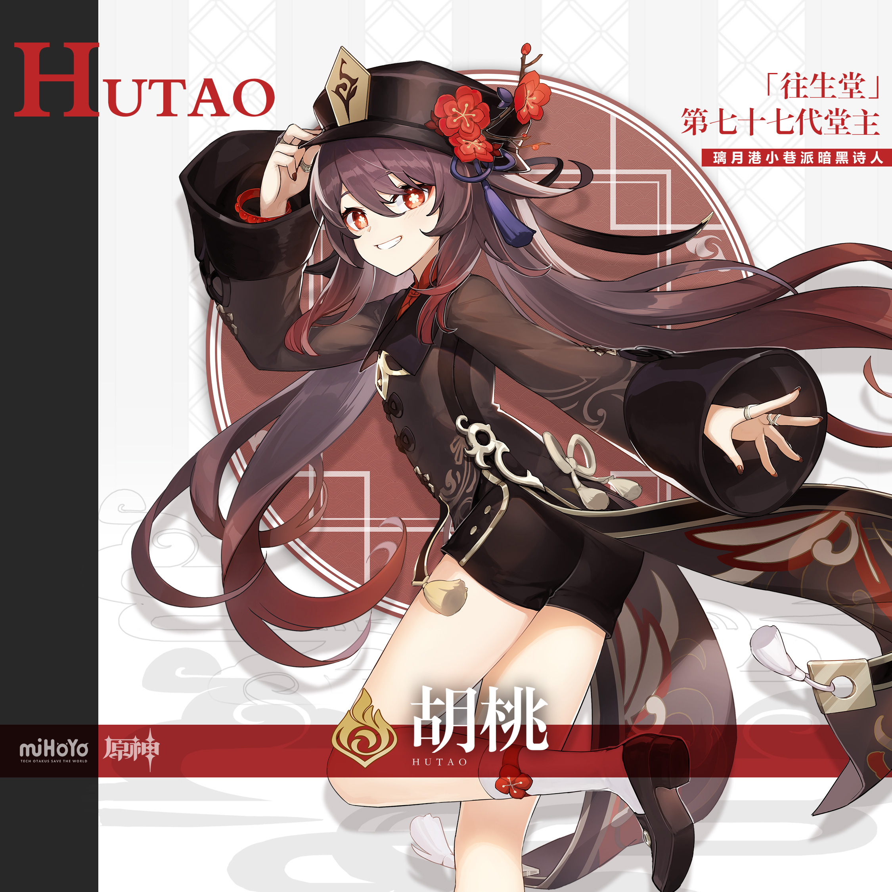
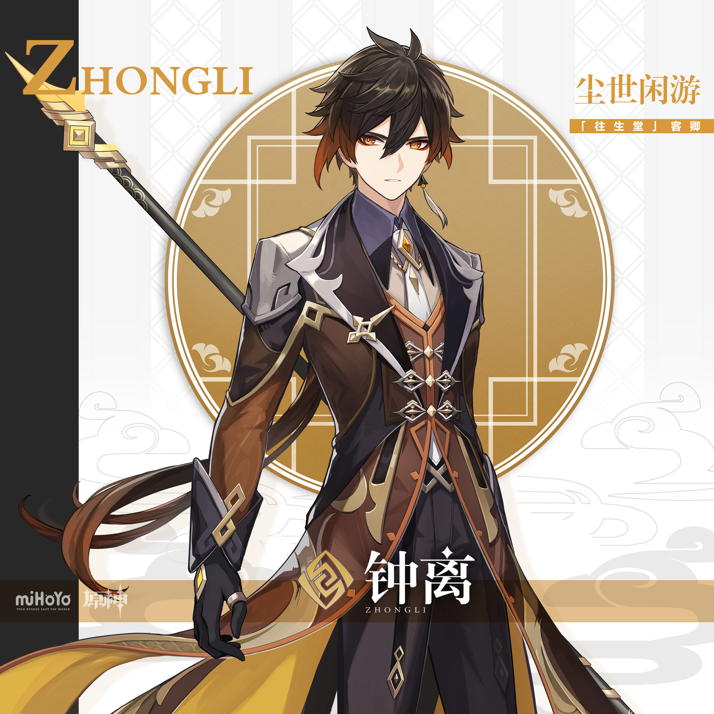
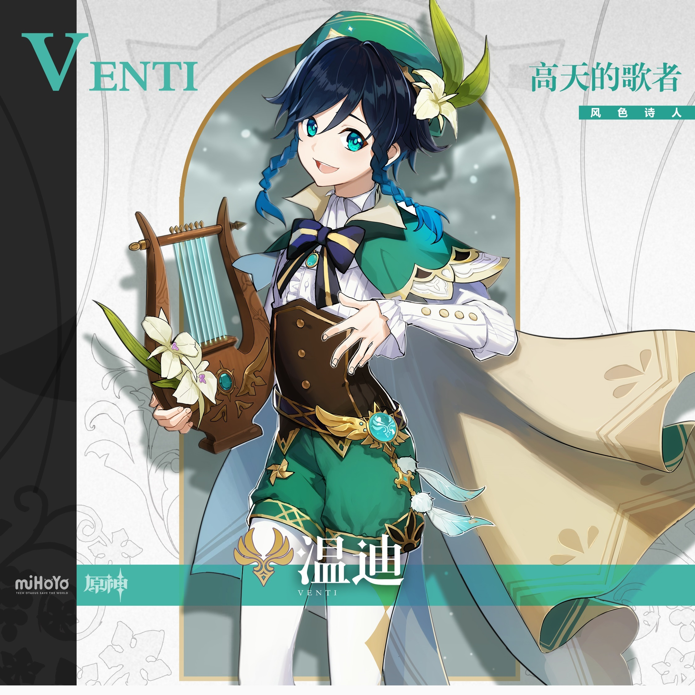
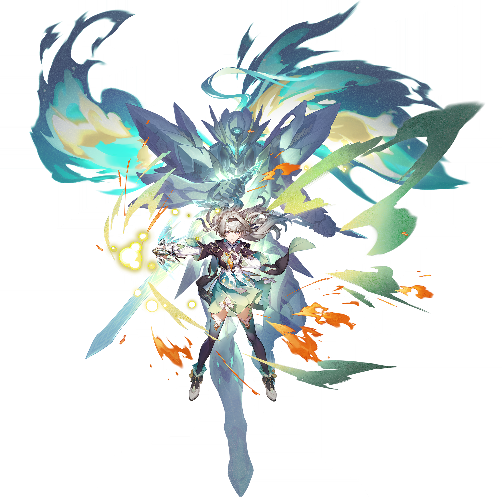
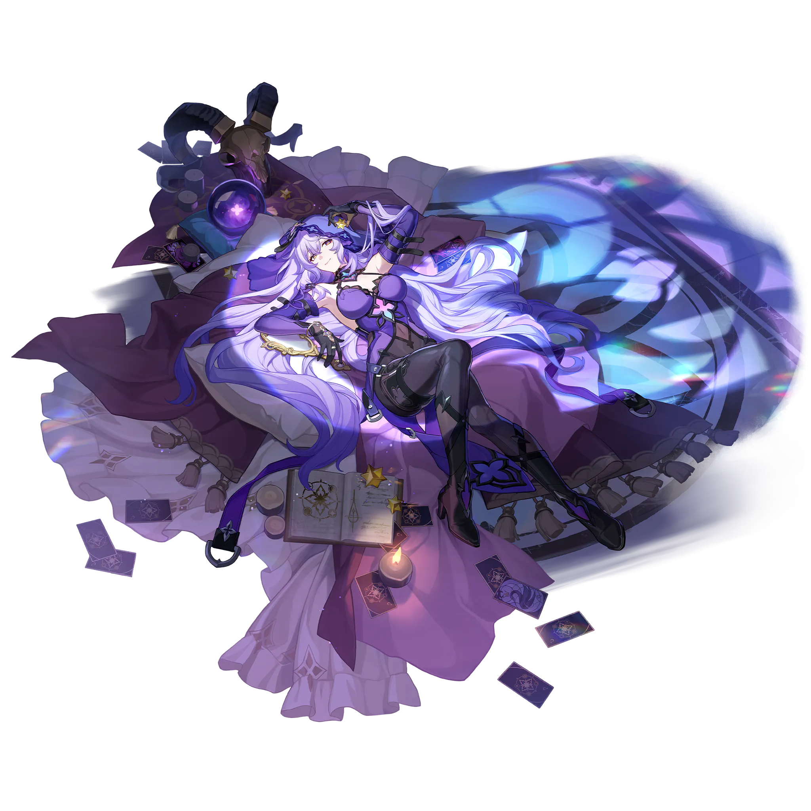
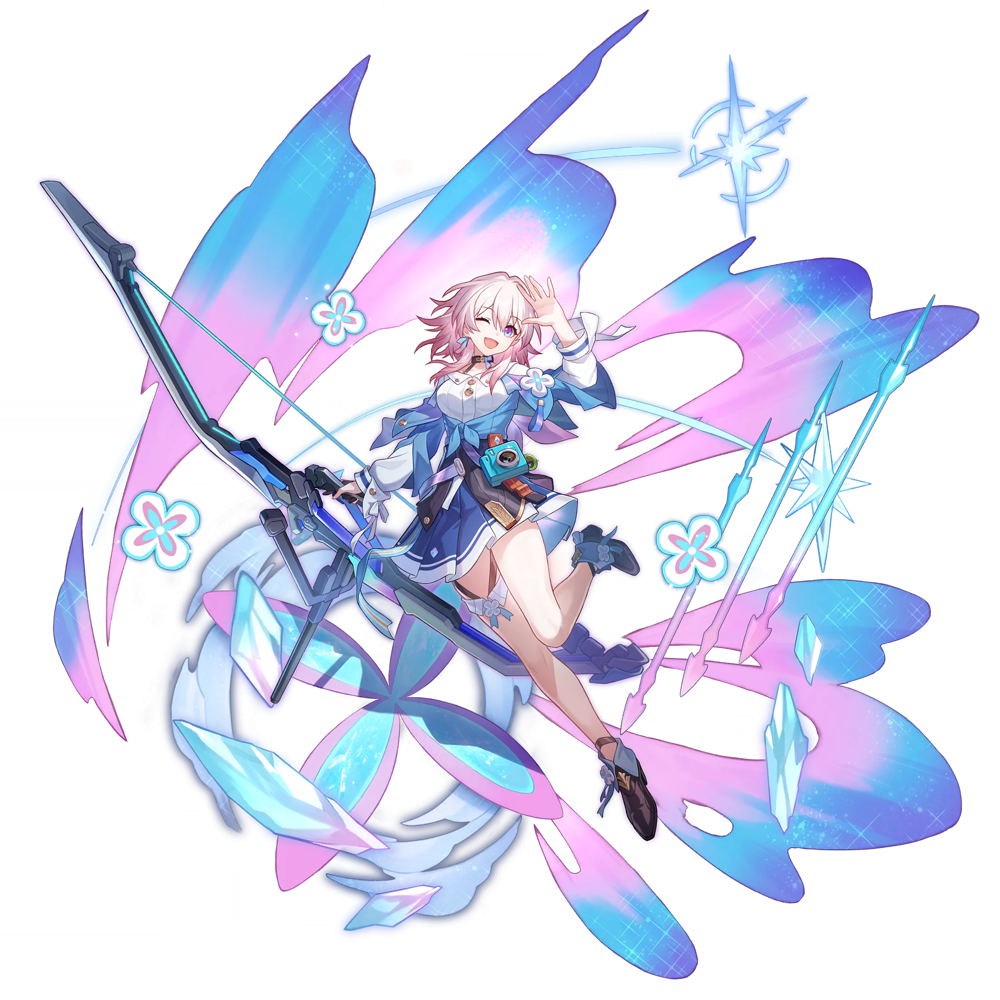
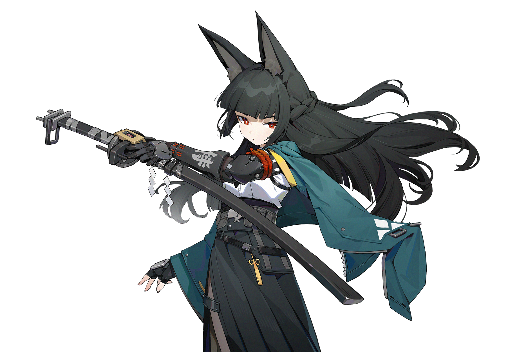
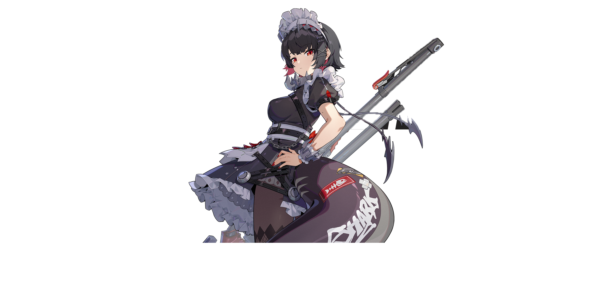

# 月谕签·米哈游角色像素签图十二签

> 类型：米哈游跨游戏角色抽签壁纸合集。
>
> 核心设计：这是“手机比例的像素签图”，不是普通角色壁纸加一个文字框。每张图必须首先被读成一张可抽取的签：四角独立像素角饰界定画面，角色被压缩为具有图腾感的像素签像，场景以牌义象征物而非写实叙事组织，底部仅保留一条窄像素卷轴来承载**牌名**。
>
> 输出比例：`9:16 vertical mobile wallpaper`，建议先按 `480 × 854` 像素风原生画布设计，再使用 nearest-neighbor / hard-edge pixel scaling 放大到 `1440 × 2560 px`。必须保持像素边缘清晰，不能是普通插画后叠加马赛克滤镜。
>
> 固定版式：上方 18% 保留干净的时钟安全区；中间约 70% 是角色签像和象征场景；底部约 12% 为窄像素卷轴。四角分别放置独立、对称但不完全相同的 L 形像素角饰：角饰从四角向内延伸约画布宽度的 12%，中间边缘保持断开，**不能形成厚重的完整矩形卡框**。四组角饰共同让画面一眼像“签图”，同时保留壁纸呼吸感。
>
> 像素签图风格：high-density handcrafted 32-bit pixel art, deliberately placed pixel clusters, crisp hard edges, limited curated palette, intentional dithering, pixel highlights, no anti-aliasing, no blur, no smooth vector gradients. 角色只需神似，允许做像素签像化缩减，但须保留每位角色的 3–4 个核心识别锚点（发型/发色、眼睛或头饰、主色、标志物）。
>
> 牌名规则：每张底部卷轴必须由 AI **直接生成准确的中文像素字**，而且只允许出现指定牌名，不能出现牌语、英文、数字、Logo 或其他任何文字。牌名应使用 chunky Chinese pixel-font glyphs / hand-drawn Chinese pixel lettering，而不是宋体、楷体、书法、衬线字体或现代 UI 字体。由于大多数生图模型的中文文字控制仍可能不稳定，若生成结果出现错字或乱码，优先反复局部重绘底部卷轴；牌语仅保留在本 Markdown 内，供抽签页、视频文案或评论区使用，不写入图片。
>
> 角色参考图：12 位角色官方立绘保留于 `refs/`。图生图时可以将对应图作为角色识别参考，但构图、像素语言、角饰和牌名必须以本文件为最高约束。

## I · 胡桃｜梅影引路

**牌语：莫怕夜深，灯会替你把路照亮。**

**AI 必须生成的牌名：`梅影引路`**

参考图：

Positive Prompt:
9:16 vertical mobile wallpaper, a true pixel-art divination sign image, designed as handcrafted 32-bit pixel art at 480x854 then hard-edge nearest-neighbor scaled, crisp deliberate pixel clusters, limited vermilion-plum-navy palette, intentional dithering, no anti-aliasing, no smooth illustration. The upper 18 percent is a clean deep-indigo pixel night sky with only sparse one-pixel stars and a tiny crescent, leaving clear lock-screen clock space. In the middle, a stylized but unmistakable Hu Tao from Genshin Impact stands on a simplified moonlit Liyue bridge: long dark-brown twin tails with crimson tips, red eyes with pale plum-shaped pupils, distinctive dark round hat with a red plum branch and blue tassel, dark brown and red coat silhouette. She holds one broad glowing plum lantern at her waist with both hands, making the hand pose simple; a stream of small amber pixel fire-butterflies crosses the bridge and leads into an abstract river of red reflections. Her expression is mischievous, gentle, and quietly guiding, never scary.

Make this unmistakably a sign image, not an ordinary character wallpaper: four independent L-shaped corner clusters made of plum branches, tiny lanterns, pixel flames, and crescent fragments occupy all four corners. The side motifs may point inward but must not join into a continuous thick rectangle. At the bottom, add one narrow dark-plum pixel scroll, only 10 to 12 percent of the canvas height, with a gold pixel outline, two tiny plum blossoms at its ends, and exactly this centered Chinese chunky pixel-font title: “梅影引路”. Render those four Chinese characters clearly in warm pale-gold blocky pixel glyphs; no other text anywhere. perfect hands, five fingers on each hand, anatomically correct hands, natural hand pose, both hands simply supporting one broad lantern. no logo, no watermark.

Negative Prompt:
low quality, worst quality, blurry, soft focus, pixelated photo filter, smooth vector art, anti-aliased edges, painterly brushwork, photorealistic, 3D render, bad anatomy, extra limbs, bad hands, extra fingers, fewer fingers, missing fingers, fused fingers, webbed fingers, merged fingers, overlapping fingers, deformed fingers, six fingers, four fingers, three fingers, disfigured hands, cropped character, landscape image, square image, thick continuous tarot border, full black card frame, large opaque bottom rectangle, large caption box, empty UI panel, social media template, character face in top clock safe area, busy top area, any text except exact Chinese title 梅影引路, wrong Chinese title, unreadable Chinese, English text, numerals, logo, watermark, signature, UI, wrong hair color, short hair, missing twin tails, missing plum blossom hat, wrong eye color, generic witch, generic funeral worker, horror, ghosts attacking, corpses, graves, skulls, blood, gore, ritual sacrifice, weapon drawn.

## II · 芙宁娜｜水镜舞台

**牌语：你不必完美，仍值得为自己谢幕。**

**AI 必须生成的牌名：`水镜舞台`**

参考图：

Positive Prompt:
9:16 vertical mobile wallpaper, a true pixel-art divination sign image, high-density handcrafted 32-bit pixel art, crisp hard-edged pixels, pearl and navy limited palette, fine intentional dithering, no anti-aliasing. Keep the upper 18 percent an uncluttered pearl-white-to-deep-navy pixel sky with two tiny ripple pixels and a dim crescent, entirely clear for a lock-screen clock. In the middle, show a stylized but recognizable Furina from Genshin Impact performing a theatrical bow on a circular water-mirror stage: pale white hair with light-blue tips, a small blue-white top hat with a water-drop jewel, heterochromatic water-drop eyes, deep navy tailcoat silhouette, white ruffles, blue bow, asymmetric gloves and stockings. She holds the broad edge of a stage curtain in one hand while the other rests over her heart; simplify both hand shapes into clear pixel silhouettes. A pearl moon, a small fountain, water-lily pads, and two silver fish sprites frame her like symbolic theatre scenery.

Signal “divination sign” through four separated L-shaped pixel corner ornaments: pearl beads and water-lily stems in upper corners, shell and ripple geometry in lower corners, all balanced but separated along the edges. The image must not look like a plain stage poster or standard wallpaper. At the bottom, include only one narrow frosted-aqua pixel scroll with pearl-gold corners, approximately 10 to 12 percent height, and render exactly the Chinese pixel-font title “水镜舞台” in centered pale-gold chunky pixel lettering. No extra letters, no numerals, no subtitles, no quote text. Make the four characters readable and square-pixel styled, not Songti, Kaiti, calligraphy, or modern typography. no logo, no watermark.

Negative Prompt:
low quality, worst quality, blurry, smooth vector art, anti-aliased edges, photo mosaic effect, painterly brushwork, photorealistic, 3D render, bad anatomy, extra limbs, bad hands, extra fingers, fewer fingers, missing fingers, fused fingers, webbed fingers, merged fingers, overlapping fingers, deformed fingers, six fingers, four fingers, three fingers, disfigured hands, landscape image, square image, thick continuous tarot border, full black card frame, large opaque bottom rectangle, large caption box, empty UI panel, social media template, face in upper clock safe area, busy top area, any text except exact Chinese title 水镜舞台, wrong Chinese title, garbled Chinese, English text, numerals, logo, watermark, signature, UI, wrong hair color, missing blue tips, matching eyes, missing top hat, generic princess, generic mermaid, modern microphone, weapon, horror, blood, gore.

## III · 钟离｜契约磐石

**牌语：先守住原则，再把承诺交给时间。**

**AI 必须生成的牌名：`契约磐石`**

参考图：

Positive Prompt:
9:16 vertical mobile wallpaper, pixel-art divination sign image, carefully handcrafted 32-bit pixel art, hard square pixels, mineral-pigment inspired amber, obsidian, ivory, and jade palette translated into pixel clusters, deliberate dithering, no soft gradients. Keep the top 18 percent as calm ivory-gray pixel mist with one muted amber sun disk and faint mountain pixels only, no character head or pillar cap, for the lock-screen clock. In the central field, show a stylized but instantly recognizable Zhongli from Genshin Impact standing on a floating amber stone terrace: deep-brown hair with burnt-amber ends, long low ponytail, amber eyes, black-and-brown long coat with crisp gold geometric trim, cream inner shirt, and a long tasseled earring. He holds a broad blank jade contract tablet close to his chest with both hands; the large tablet hides most finger detail. A short amber stone pillar, four orbiting faceted rocks, ginkgo leaves, and Liyue cloud silhouettes create an emblematic, stable composition.

Build the sign identity with four independent corner clusters: upper corners are gold geometric cloud braces and small sun-stones; lower corners are pixel mountain terraces and square jade seals without symbols. Keep the side edge gaps open; no continuous heavy rectangular border. At the bottom, put a slim warm-ivory pixel paper scroll set in dark amber stone, only 10 to 12 percent of the canvas height, and render exactly “契约磐石” as centered dark-amber chunky Chinese pixel-font glyphs, clean and legible. No other text. The title must look like handmade pixel lettering, never Songti, Kaiti, calligraphy, serif, or UI font. perfect hands, five fingers on each hand, anatomically correct hands, both hands simply holding one large square tablet. no logo, no watermark.

Negative Prompt:
low quality, worst quality, blurry, smooth gradient, anti-aliasing, vector art, photorealistic, 3D render, bad anatomy, extra limbs, bad hands, extra fingers, fewer fingers, missing fingers, fused fingers, webbed fingers, merged fingers, overlapping fingers, deformed fingers, six fingers, four fingers, three fingers, disfigured hands, landscape image, square image, thick continuous tarot border, full card frame, large opaque bottom rectangle, caption box, empty UI panel, face in upper clock safe area, busy top area, any text except exact Chinese title 契约磐石, wrong Chinese title, garbled Chinese, English text, numerals, logo, watermark, signature, UI, wrong hair color, short hair, missing amber hair tips, wrong eye color, generic emperor, crown, dragon form, meteor attack, modern business suit, weapon drawn, horror, blood, gore.

## IV · 温迪｜风中歌行

**牌语：让风吹过答案之前，先听听自己的心。**

**AI 必须生成的牌名：`风中歌行`**

参考图：

Positive Prompt:
9:16 vertical mobile wallpaper, pixel-art divination sign image, authentic 16-bit JRPG pixel art with intentional 32-bit detail, crisp pixel clusters, teal-emerald-cream limited palette, visible controlled dithering, no smooth gradients and no vector outlines. Reserve the upper 18 percent as a calm sky-blue pixel gradient with a tiny crescent and a few spaced cloud pixels, fully empty of head, lyre, and high contrast detail for phone time. In the center, show a chibi-leaning but recognizable Venti from Genshin Impact on a small floating moss island: dark navy-blue short hair with turquoise ends, two thin side braids, teal eyes, a green beret with white Cecilia flower and long feather, white ruffled shirt, brown vest, green capelet and shorts. He plays a large wooden lyre that covers both hands naturally. Square pixel wind ribbons lift his cape and lead to a distant tiny windmill silhouette; white Cecilia flowers and small gold music-sparkles float at the sides.

Make it visibly a signed divination image: independent L-shaped pixel corner ornaments made from cloud blocks, lyre strings, leaf scrolls, feather tips, and gold stars. Corner clusters must stay detached from one another, never forming a full thick game-card border. At the bottom, add only a narrow dark-teal pixel wood scroll with pale-gold pixel edges and tiny Cecilia ends, approximately 10 to 12 percent height. Render exactly the Chinese title “风中歌行” centered in cream-gold bold pixel glyphs, readable and composed of block pixels. Do not generate any other text, number, music notation, logo, or watermark. hands hidden behind the large lyre, clean simple pixel hand shapes.

Negative Prompt:
low quality, worst quality, blurry, photorealistic, 3D render, vector art, anti-aliased edges, smooth gradients, modern flat icon, bad anatomy, extra limbs, bad hands, extra fingers, fewer fingers, missing fingers, fused fingers, webbed fingers, merged fingers, deformed fingers, six fingers, four fingers, three fingers, landscape image, square image, thick continuous tarot border, full black frame, large opaque bottom plaque, subtitle box, empty UI panel, face in top clock safe area, busy top, any text except exact Chinese title 风中歌行, wrong Chinese title, unreadable Chinese, English text, numerals, logo, watermark, signature, UI, wrong hair color, missing braids, missing green beret, missing Cecilia flower, generic elf, generic bard, modern guitar, weapon, horror, blood, gore.

## V · 卡芙卡｜蛛网咏叹

**牌语：别急着挣脱，先找回属于你的节奏。**

**AI 必须生成的牌名：`蛛网咏叹`**

参考图：

Positive Prompt:
9:16 vertical mobile wallpaper, handcrafted pixel-art divination sign image, cinematic neo-noir translated into crisp 32-bit pixel art, aubergine, black, magenta, wine-red, and rain-silver limited palette, deliberate dark dithering, sharp hard pixel edges. Keep the upper 18 percent as an open black-aubergine rainy pixel sky with thin sparse violet thread lines and a dim moon ring, no face, no umbrella peak, no web center in the clock safe zone. In the center, a stylized but recognizable Kafka from Honkai: Star Rail sits elegantly on a black lacquer chair: long dark wine-red hair in a loose side ponytail, magenta-violet eyes, dark sunglasses on top of her head, pearl earring, white blouse, black coat draped on shoulders, deep purple-black corset, wine-red hip bow, black shorts and stockings. A broad closed black umbrella lies diagonally across her lap, making her hands simple and partially covered. Her expression is calm, patient, and knowingly amused.

A violet pixel thread web floats behind her like a halo, with rain streaks, train-window lights, and drifting rose-petal pixels as signs of rhythm and control. Use four independent L-shaped corner clusters: art-deco glass arches and web strands above, closed umbrella handles and rose thorns below; leave clear gaps along all edges. At the bottom, add a narrow smoked-violet pixel ribbon-scroll with pale-lilac edge pixels and two small rose knots, only 10 to 12 percent tall. Generate exactly “蛛网咏叹” in centered pale-lilac chunky Chinese pixel-font lettering; no other words, numerals, or marks. The title must be readable block pixel glyphs, not traditional print or calligraphy. perfect hands, five fingers on each hand, hands resting naturally on the broad closed umbrella. no logo, no watermark.

Negative Prompt:
low quality, worst quality, blurry, smooth digital art, photorealistic, 3D render, vector poster, anti-aliased edges, bad anatomy, extra limbs, bad hands, extra fingers, fewer fingers, missing fingers, fused fingers, webbed fingers, merged fingers, deformed fingers, six fingers, four fingers, three fingers, disfigured hands, landscape image, square image, thick continuous tarot border, full frame, large opaque lower rectangle, caption box, empty UI panel, face in upper clock area, busy top, any text except exact Chinese title 蛛网咏叹, wrong Chinese title, garbled Chinese, English text, numerals, logo, watermark, signature, UI, wrong hair color, missing side ponytail, missing umbrella, generic detective, generic dominatrix, spider monster, horror, blood, gore, weapon firing, battle pose.

## VI · 流萤｜萤火破茧

**牌语：微弱的光，也正在成为你。**

**AI 必须生成的牌名：`萤火破茧`**

参考图：

Positive Prompt:
9:16 vertical mobile wallpaper, original pixel-art divination sign image, luminous magical transformation rendered as handcrafted 32-bit pixel art, crisp square pixels, seafoam-aqua-silver-pink-night-blue palette, visible intentional dithering and pixel glow, no blurred bloom. The upper 18 percent is a clean midnight-blue pixel sky with just scattered single-pixel stars, no face, no large halo, and no bright chrysalis, suitable for lock-screen time. In the central field, a stylized but recognizable Firefly from Honkai: Star Rail floats within a tall cracked crystal chrysalis: long silvery-blonde hair with aqua-green tips, two-tone ocean-blue and sunset-pink eyes, black headband with a turquoise jewel, dark cropped jacket over a white blouse, large aqua ribbon, pale green skirt, black thigh-highs. She holds one large glowing seed crystal at her chest with both hands, keeping fingers covered. Her expression is soft, earnest, and quietly brave.

Behind her, show an abstract protective guardian shape only through cyan pixel flame-wings, angular cyan fragments, and gold spark trails; do not depict a specific mecha. Four independent L-shaped pixel corner ornaments use moth wings, tiny fireflies, crystal shards, and gentle gear fragments, visibly framing the sign while never joining into a continuous rectangle. The bottom has only one slim seafoam-glass pixel scroll with silver-gold corners, about 10 to 12 percent height. Render exactly “萤火破茧” at its center as bright cream chunky Chinese pixel lettering, fully legible; no quote, no subtitle, no other text. Pixel font only, no Songti, Kaiti, calligraphy, or modern UI type. perfect hands, five fingers on each hand, both hands simply embracing one large seed crystal. no logo, no watermark.

Negative Prompt:
low quality, worst quality, blurry, glow blur, smooth gradients, photorealistic, 3D render, vector art, anti-aliased edges, bad anatomy, extra limbs, bad hands, extra fingers, fewer fingers, missing fingers, fused fingers, webbed fingers, merged fingers, deformed fingers, six fingers, four fingers, three fingers, disfigured hands, landscape image, square image, full thick border, large opaque bottom box, caption panel, empty UI panel, face in upper clock area, busy top, any text except exact Chinese title 萤火破茧, wrong Chinese title, garbled Chinese, English text, numerals, logo, watermark, signature, UI, wrong hair color, missing aqua tips, wrong eye colors, missing headband jewel, generic angel, exact existing mecha design, full armored suit, weapon, horror, blood, gore.

## VII · 黑天鹅｜记忆倒影

**牌语：你反复回望的地方，藏着真正的答案。**

**AI 必须生成的牌名：`记忆倒影`**

参考图：

Positive Prompt:
9:16 vertical mobile wallpaper, surreal pixel-art divination sign image, handcrafted 32-bit pixel collage, crisp violet glass pixels, torn-paper pixel layers, intentional dither texture, high-detail but hard-edged sprite art. Keep the upper 18 percent a clean deep-violet void with a few faint pixel constellations and no face, crystal sphere, or card motif, leaving phone clock space. In the center, a stylized but recognizable Black Swan from Honkai: Star Rail sits in profile on a crescent-shaped pixel mirror: long pale lavender-white hair with curled darker violet ends, violet eyes with a warm inner glow, purple veil and hood, black choker, elegant black-white-purple diviner outfit, detached violet sleeves, and glossy black thigh-high boots. She holds one large oval mirror that hides most of one hand; the other rests open and simple on her lap. Her expression is calm, compassionate, and distant.

Behind her, arrange an abstract blank-sign card silhouette, crystal sphere, feathers, rose-petal pixels, and torn star-map pieces with no symbols, letters, or numbers. Four independent L-shaped corners contain violet ribbon loops, crescent mirrors, feather tips, and gold memory droplets; keep the edge gaps open. At the bottom, add a narrow smoky-lavender pixel ribbon with a dark inner fill and fine antique-gold pixel edging, only 10 to 12 percent height. AI must render exactly “记忆倒影” in centered warm ivory chunky Chinese pixel-font glyphs, crisp and readable; no other text anywhere. no logo, no watermark.

Negative Prompt:
low quality, worst quality, blurry, smooth collage, photorealistic, 3D render, vector art, anti-aliasing, bad anatomy, extra limbs, bad hands, extra fingers, fewer fingers, missing fingers, fused fingers, webbed fingers, merged fingers, deformed fingers, six fingers, four fingers, three fingers, disfigured hands, landscape image, square image, thick continuous border, large lower rectangle, caption box, empty UI panel, face in upper clock safe area, busy top, any text except exact Chinese title 记忆倒影, wrong Chinese title, unreadable Chinese, English text, numerals, logo, watermark, signature, UI, wrong hair color, short hair, missing veil, generic witch, generic nun, demon cards, scary faces, ghosts, skulls, blood, gore, ritual sacrifice, weapon.

## VIII · 三月七｜瞬间显影

**牌语：此刻的小快乐，值得被好好收藏。**

**AI 必须生成的牌名：`瞬间显影`**

参考图：

Positive Prompt:
9:16 vertical mobile wallpaper, cheerful pixel-art divination sign image, authentic handcrafted 32-bit pixel art, candy-pink, sky-blue, aqua, white, and navy limited palette, crisp block pixels, controlled dithering, no smooth sticker illustration. The upper 18 percent is a clean soft pink-to-sky-blue pixel sky with only sparse tiny stars and one empty photo-corner motif, no face, no camera flash, and no visual clutter for the phone clock. In the central field, a stylized but recognizable March 7th from Honkai: Star Rail jumps lightly beside a giant blank pixel photo-frame: shoulder-length light-pink hair with flipped layers, blue-and-pink heterochromatic eyes, blue-pink ribbon ear accessory and hair clip, white off-shoulder top, blue-pink short jacket, blue bow, navy pleated skirt, aqua camera. She holds one broad instant camera at chest level with both hands, hiding most fingers; she winks with open delighted energy.

Use pixel ice diamonds, pastel flowers, blank photo snapshots, tape tabs, stars, and a pink-blue comet trail as emblematic scenery. Four detached L-shaped corner ornaments are made from camera corners, blue snowflakes, pink bows, and pixel tape; do not create a thick full frame. At the bottom, place a narrow pearly-white pixel photo-strip scroll with navy shadow and pink-blue tabs, only 10 to 12 percent height. Render exactly “瞬间显影” as centered navy chunky Chinese pixel-font lettering, sharp and readable, no extra text. The title must be true square pixel lettering, never a serif, Songti, Kaiti, or handwritten font. perfect hands, five fingers on each hand, both hands holding a large camera body. no logo, no watermark.

Negative Prompt:
low quality, worst quality, blurry, smooth vector stickers, photorealistic, 3D render, anti-aliased edges, bad anatomy, extra limbs, bad hands, extra fingers, fewer fingers, missing fingers, fused fingers, webbed fingers, merged fingers, deformed fingers, six fingers, four fingers, three fingers, disfigured hands, landscape image, square image, thick continuous card frame, large opaque bottom rectangle, caption box, empty UI panel, face in upper clock area, busy top, any text except exact Chinese title 瞬间显影, wrong Chinese title, garbled Chinese, English text, numerals, logo, watermark, signature, UI, wrong hair color, long hair, missing camera, wrong eye colors, generic schoolgirl, weapon, grim expression, horror, blood, gore.

## IX · 星见雅｜霜刃守夜

**牌语：心不被杂音带走，路便仍在脚下。**

**AI 必须生成的牌名：`霜刃守夜`**

参考图：

Positive Prompt:
9:16 vertical mobile wallpaper, original pixel-art divination sign image, Japanese woodblock mood translated into handcrafted 32-bit sprite art, carved-looking pixel linework, ice-white, ink-black, deep-teal, muted red, and pale-gold palette, hard edges and deliberate dither. Leave the upper 18 percent as open ice-blue pixel night sky with sparse snow pixels and a tiny distant fox-mask cloud shape, no face, no sword, and no bright moon behind the head, preserving clear clock space. In the center, show a stylized but recognizable Hoshimi Miyabi from Zenless Zone Zero: long straight black hair, fox ears, red eyes, teal blue-green haori, white shirt, black tie, black split hakama-like lower silhouette, black tights, red-and-gold cord ornament. She holds one broad sheathed long blade horizontally at waist height with both hands; no blade drawn, and the sheath hides intricate finger detail. Her posture is still, disciplined, and protective.

A pale fox-mask image forms from pixel snow and frosted clouds behind her, while distant New Eridu shapes stay abstract and free of signs. Four separated L-shaped corner groups use snow crystals, fox ears, stylized waves, sheathed-blade forms, and red cords. They must visibly identify a sign image without joining into a thick box. At the bottom, add only one narrow dark-indigo lacquer pixel scroll with an ice-white inner field and red cord ends, 10 to 12 percent height. Render exactly “霜刃守夜” centered in dark teal chunky Chinese pixel-font glyphs, cleanly readable, no other writing. perfect hands, five fingers on each hand, both hands simply holding the broad sheath. no logo, no watermark.

Negative Prompt:
low quality, worst quality, blurry, smooth digital painting, photorealistic, 3D render, vector art, anti-aliased edges, bad anatomy, extra limbs, bad hands, extra fingers, fewer fingers, missing fingers, fused fingers, webbed fingers, merged fingers, deformed fingers, six fingers, four fingers, three fingers, disfigured hands, landscape image, square image, thick continuous border, full black card frame, large lower plaque, caption box, empty UI panel, face in upper safe area, busy top, any text except exact Chinese title 霜刃守夜, wrong Chinese title, Japanese text, English text, numerals, logo, watermark, signature, UI, wrong hair color, missing fox ears, wrong eye color, generic samurai, cat ears, blade drawn, combat pose, enemy, violence, blood, gore, horror.

## X · 艾莲·乔｜深海午休

**牌语：暂停不是退后，是为了继续向前游。**

**AI 必须生成的牌名：`深海午休`**

参考图：

Positive Prompt:
9:16 vertical mobile wallpaper, sleepy 1990s arcade pixel-art divination sign image, authentic handcrafted 32-bit pixel sprite art, crisp thick pixel contours, deep navy, aqua, white, muted red, and bubblegum-pink limited palette, patterned dithering, no smooth cel shading. The upper 18 percent is quiet deep-aqua aquarium darkness with sparse small bubbles and sleepy one-pixel stars, no face, no giant fin, no weapon, leaving a clean top clock area. In the central field, a stylized but recognizable Ellen Joe from Zenless Zone Zero lounges sideways on a crescent-shaped pixel shark float: short black hair with red inner highlights, red eyes, white frilled maid headband, black-and-white maid uniform, black tights, dark shark tail with tiny abstract sticker pixels, and a bored sleepy expression with one small pointed tooth. Her folded giant scissors appear only as a low-contrast background silhouette, never as an attack. She hugs a broad navy cushion with arms folded; both hands are fully hidden.

Use simple pixel bubbles, stylized ocean waves, sleepy stars, shark-fin motifs, and abstract arcade ramp shapes at the sides. The four independent L-shaped corner ornaments should combine maid frills, shark fins, checkerboard wave tiles, and small rounded sticker icons, with gaps between them. At the bottom, place a compact navy-aqua pixel surf-tag scroll with a pale inner strip and small frill corners, only 10 to 12 percent height. Render exactly “深海午休” as centered white chunky Chinese pixel lettering with aqua shadow pixels, no other text. This must look like clear pixel glyphs, not printed Chinese typography. no logo, no watermark.

Negative Prompt:
low quality, worst quality, blurry, photorealistic, 3D render, smooth anime illustration, vector art, anti-aliased edges, bad anatomy, extra limbs, visible bad hands, extra fingers, fewer fingers, missing fingers, fused fingers, deformed fingers, landscape image, square image, thick continuous border, full black card frame, large opaque bottom rectangle, caption box, empty UI panel, face in upper clock area, busy top, any text except exact Chinese title 深海午休, wrong Chinese title, garbled Chinese, English text, numerals, logo, watermark, signature, UI, wrong hair color, long hair, missing red hair highlights, missing maid headband, missing shark tail, generic shark girl, weapon attack, battle pose, gore, blood, horror, hyperactive smile.

## XI · 妮可·德玛拉｜幸运开张

**牌语：先迈出一步，机会才会认得你的门。**

**AI 必须生成的牌名：`幸运开张`**

参考图：

Positive Prompt:
9:16 vertical mobile wallpaper, bold pop-arcade pixel-art divination sign image, handcrafted 32-bit pixels, high-energy but limited hot-pink, neon-green, black, white, violet, and yellow palette, sharp screen-print-like pixel dithering, no smooth poster art. Leave the upper 18 percent as a clean hot-pink-to-violet pixel halftone sky with a few spaced neon-green stars and blank receipt shapes, no character face, no case, no huge burst, preserving lock-screen clock space. In the central field, show a stylized but recognizable Nicole Demara from Zenless Zone Zero leaning confidently against a large black equipment case: long pink high twin tails, green eyes, black rabbit-ear bows at the twin-tail bases, black off-shoulder cropped jacket, light gray-white cropped top, black shorts, asymmetric black stockings with straps, thick black boots, yellow earrings, heart choker, and a green rabbit waist pouch. Both hands rest simply on the broad equipment case top. Her smile is bold, inviting, and entrepreneurial.

Behind her, use symbolic pixel pop bursts, rabbit silhouettes, neon-green coin discs with no symbols, blank receipts, and an empty price-tag circle. Four detached L-shaped pixel corner ornaments use rabbit ears, compact-case hinges, heart charms, neon starbursts, and checkerboard chips; retain open edge gaps. At the bottom, include one narrow white-lacquer pixel scroll with black and neon-green edges, only 10 to 12 percent height. AI must render exactly “幸运开张” centered in black chunky Chinese pixel-font glyphs with a small neon-green pixel shadow. No other text, no currency signs, no brand names, no logo, no watermark. perfect hands, five fingers on each hand, both hands resting flat on a large case.

Negative Prompt:
low quality, worst quality, blurry, photorealistic, 3D render, smooth vector pop art, anti-aliased edges, bad anatomy, extra limbs, bad hands, extra fingers, fewer fingers, missing fingers, fused fingers, webbed fingers, merged fingers, deformed fingers, six fingers, four fingers, three fingers, disfigured hands, landscape image, square image, thick continuous frame, large opaque bottom plaque, caption box, empty UI panel, face in upper clock safe area, busy top, any text except exact Chinese title 幸运开张, wrong Chinese title, garbled Chinese, English text, numerals, brand names, currency symbols, logo, watermark, signature, UI, wrong hair color, missing twin tails, wrong eye color, missing rabbit-ear bows, generic bunny girl, gun firing, battle pose, horror, blood, gore.

## XII · 安比·德玛拉｜静电决心

**牌语：做完眼前一步，下一条路自然显现。**

**AI 必须生成的牌名：`静电决心`**

参考图：

Positive Prompt:
9:16 vertical mobile wallpaper, minimalist pixel-art divination sign image, handcrafted 32-bit pixel key visual, clean hard outlines, deliberately placed black-white-lime pixel planes, subtle amber accents, no anti-aliasing and no smooth gradients. Keep the upper 18 percent a calm warm-white industrial ceiling plane with one thin lime reflected pixel line, no character face, blade tip, or dense machinery, making a clear phone clock safe zone. In the central field, a stylized but recognizable Anby Demara from Zenless Zone Zero stands in a simplified industrial corridor: short silver-white bob haircut, amber-green eyes, black over-ear headphones, black and neon-lime cropped hooded jacket, white inner top, black pleated skirt, black thigh-highs, black-lime shoes, utility pouch. Her gray electric blade remains sheathed and vertical beside her; one hand rests on the broad sheath while the other hand is hidden inside her jacket pocket. Her expression is quiet, practical, and unwavering.

Three unlabeled battery-like geometric icons and minimal lime electric arcs float behind her. Four separated L-shaped pixel corner ornaments use headphones, lightning bolts, simple circuit traces, utility buckles, and lime brackets. Ensure those corner groups read as a special sign composition but never become a heavy full border. At the bottom, add only a narrow matte-black pixel scroll with a warm-white interior strip and a neon-lime outline, 10 to 12 percent height. Render exactly “静电决心” centered in dark graphite chunky Chinese pixel-font glyphs with subtle lime edge pixels. No other text, no numbers, no logo, no watermark. perfect hands, five fingers on each hand, one hand resting on a broad sheath and one hand fully tucked in pocket.

Negative Prompt:
low quality, worst quality, blurry, photorealistic, 3D render, painterly watercolor, smooth vector art, anti-aliased edges, bad anatomy, extra limbs, bad hands, extra fingers, fewer fingers, missing fingers, fused fingers, webbed fingers, merged fingers, deformed fingers, six fingers, four fingers, three fingers, disfigured hands, landscape image, square image, thick continuous border, full card frame, large lower rectangle, caption box, empty UI panel, face in upper clock safe area, busy top, any text except exact Chinese title 静电决心, wrong Chinese title, garbled Chinese, English text, numerals, logo, watermark, signature, UI, wrong hair color, long hair, wrong eye color, missing headphones, generic cyborg, full armor, weapon drawn, attack pose, battle scene, horror, blood, gore, cluttered background.

## 生成与落地说明

- 先生成 I「梅影引路」作为整套像素密度、四角签图感和卷轴高度的基准图。后续 11 张应沿用“像素分辨率、角饰占比、顶部留白、底部窄卷轴”的结构，角色画面可变，签图识别必须不变。
- 这套的“牌语”只用于抽签页面、视频字幕、图文说明或评论区；图片内部只生成牌名。这样既满足签图的仪式感，又不会让长句损害锁屏可读性。
- 若模型无法稳定生成精确中文，请优先用同一张成图做底部卷轴区域局部重绘，并重复使用每条 Prompt 中的 `render exactly` 牌名要求；不要把窄卷轴扩大成大字幕框。仍无法稳定时，可保留像素卷轴后由后期添加同款像素字体文字。
- 牌名排版建议：卷轴高度约 10%–12%，四字牌名横向居中，占卷轴宽度 48%–62%；字形使用粗颗粒中文像素字体，字距略宽，四字之间保留 1–2 个像素单位的呼吸感。禁止宋体、楷体、书法、圆体、现代无衬线 UI 字体。
- 角色只需神似而非复刻官方立绘：每张优先保留核心识别锚点，其他服装褶皱、配件密度和面部细节可被合理压缩为像素签像语言。这样可显著区分于普通角色壁纸，同时避免“只是在官方立绘上套滤镜”的效果。
