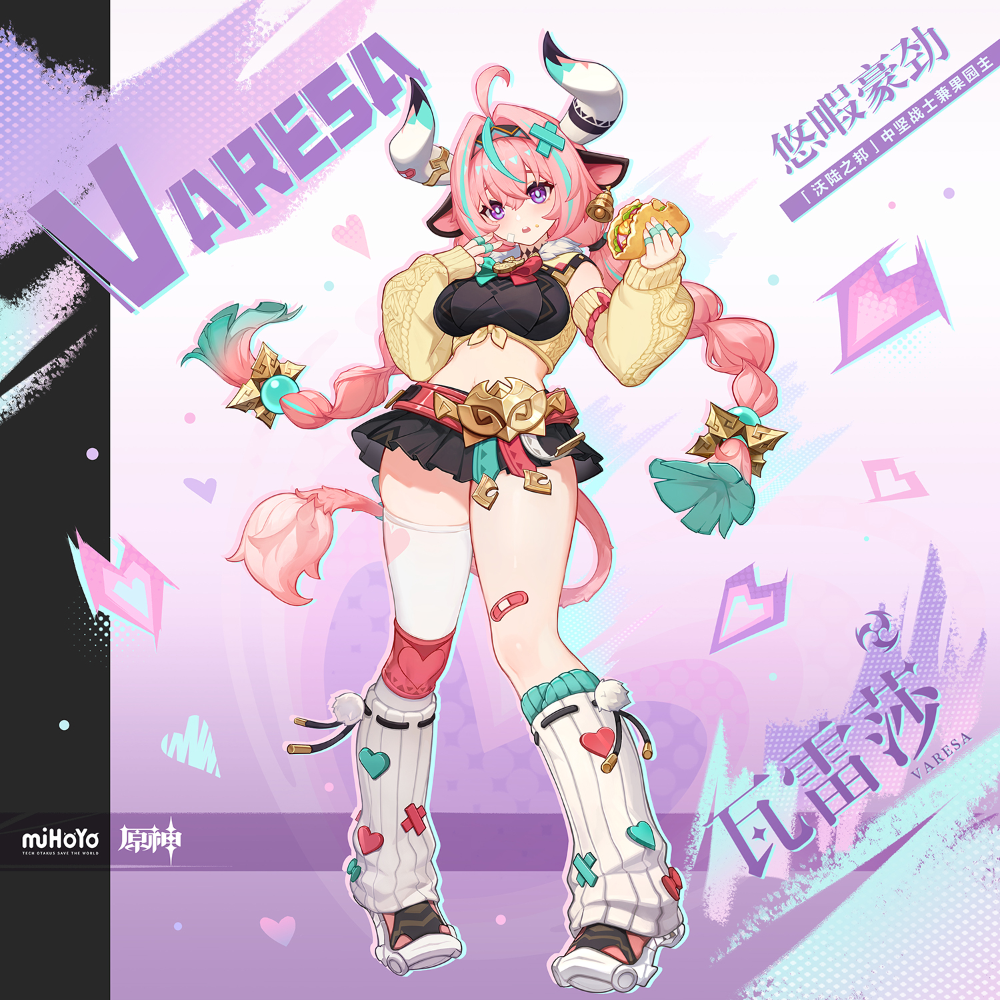
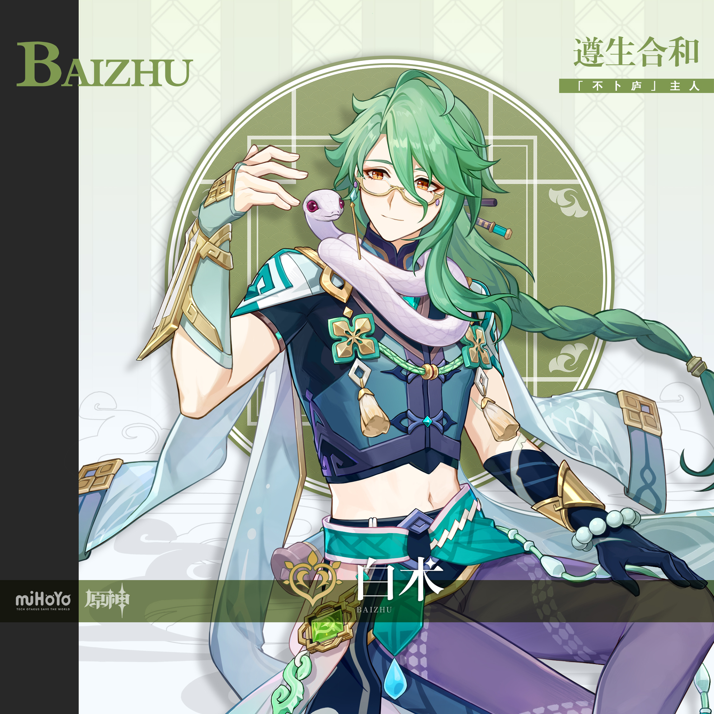
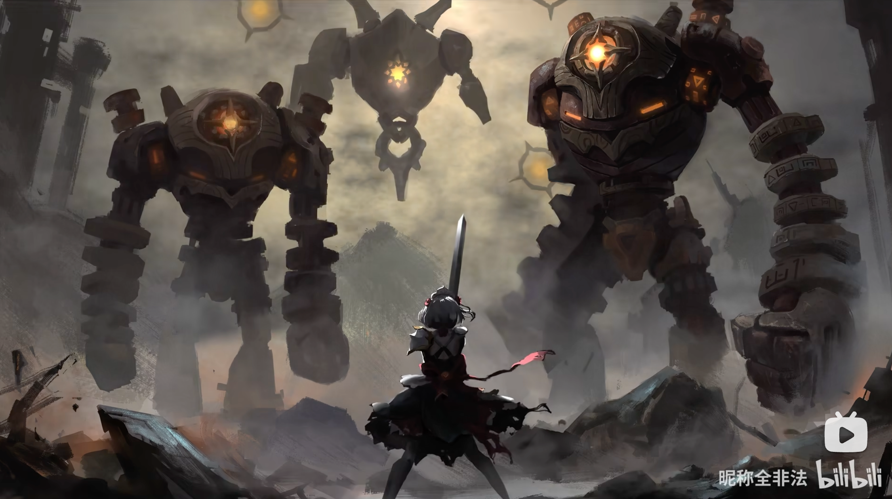
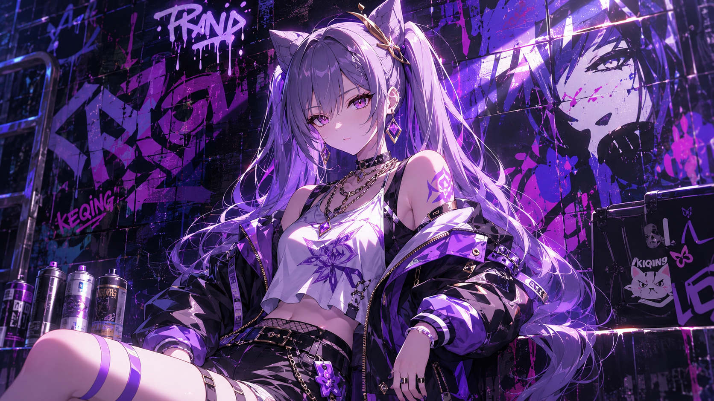
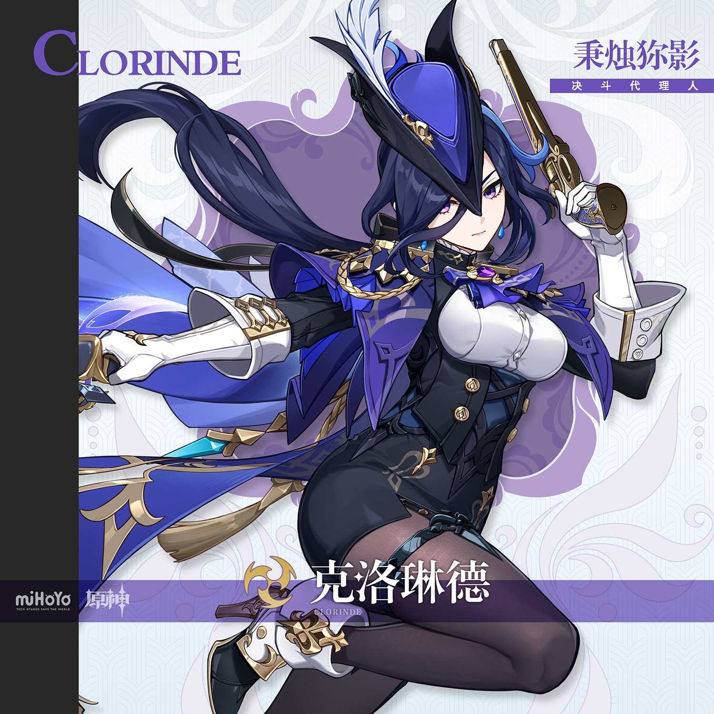
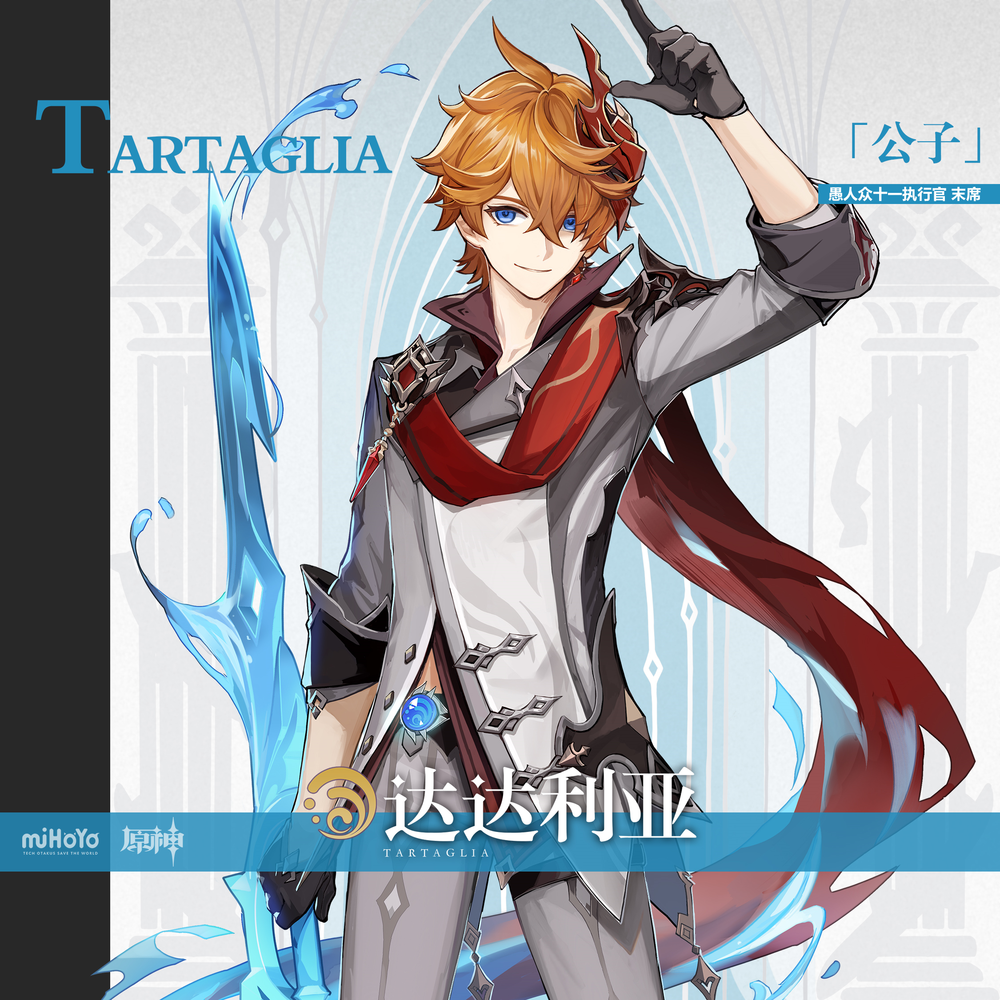
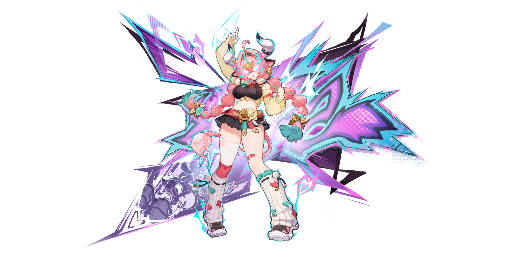
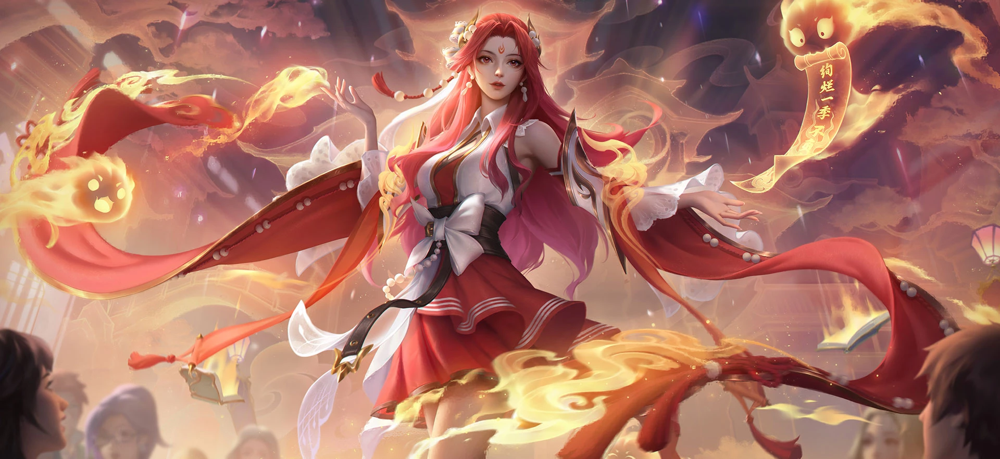

# 桌上剧团·冒险的前夜会 — 2026.09.29
> 视频类型：B · 主题类型合集
> 统一比例：**3:4 竖版**（`3:4 vertical portrait wallpaper`），8 条 prompts 全部一致
> 主题说明：原神六周年最重磅福利「桌上剧团·冒险的前夜会」自选限定五星特辑——六位候选角色各自收到一封火漆封印的「邀请函」，在同一座烛光剧院中上演"前夜会"。统一视觉母题：**烛光剧院 + 火漆邀请函**——每张画面中角色都持有一封烫金火漆封印的邀请函（封蜡印着该角色元素符号），背景为暖琥珀色烛光剧院（红丝绒帷幕、木质戏台、漂浮的金色尘埃、桌上的剧本卷轴与骰子），角色主题色作为点缀光源点亮画面
> 热点背景：①原神六周年庆典正日 9/28 昨日刚过，余热正盛；②六周年最重磅活动「桌上剧团·冒险的前夜会」进行中（9/23-11/3），通关魔神任务第七章第四幕后可**自选邀请一位限定五星**：达达利亚、妮露、白术、千织、克洛琳德、瓦雷莎，社区正处"六选一纠结"高峰（瓦雷莎热度登顶、"选错多个仓管""未来可期"争论刷屏）；③逐月节「银翎溯月，玄鸟结璘」进行中（至 10/12）；④崩铁 4.6 昨日上线但可做角色已全覆盖，热点让位原神周年自选
> 涉及角色：瓦雷莎（自选热度登顶·纳塔下落主C）、白术（工作区首次覆盖·不卜庐主人）、妮露（绽放队唯一核心）、千织（岩队核心·裁缝老板娘）、克洛琳德（决斗代理人·能显示区域特产）、达达利亚（万达国际·汤达人）
> 选定类型理由：今日热点呈「六角色并列爆发」形态——自选活动的本质就是六位角色同台让玩家"选人"，天然适合多角色横向展示 → 类型 B 特辑。若做类型 A：热度最高的瓦雷莎 9 月已做过单人集，次优新覆盖候选白术为男性角色（性别系数 0.5 不满足例外条款）→ 按规范改选 B 类多角色合集消化，白术与达达利亚以成员身份入列
> 选角理由：六位即活动全部候选名单，一网打尽"选谁"话题流量；其中 5 位工作区已有已校对官方立绘可直接引用，白术今日新下载立绘补齐
> 参考图说明：白术立绘今日下载自 B站WIKI（splash-art.png 2250px 实为 JPEG 数据 / gacha-art.png 2048px），经视觉校对：浅绿色中长发一侧编成粗长辫垂落、琥珀金瞳、金色细框半框眼镜配金色链式耳坠、白紫色小蛇「长生」（红色瞳孔）盘绕颈肩搭在白纱巾上、藏青黑色立领短款上衣露腰腹、肩部白绿拼色护甲金饰、白色连帽长袍滑落至臂弯、白纱巾围颈、左腕深色护腕+金色臂甲、黑手套、白绿玉珠念珠串、青绿色宽腰带、紫色蛇鳞纹长裤、腰侧挂草元素神之眼（绿色方形）与青玉坠饰、温和浅笑。其余五人均沿用工作区已视觉校对的官方立绘资料
> 系列画面规则：所有画面统一使用暖琥珀烛光 + 红丝绒帷幕 + 金色尘埃的剧院基调；每张必须出现一封**烫金火漆邀请函**（封蜡印角色元素符号）；第一位角色的 prompt 最详细定义整体基调，后续角色引用第一张图作风格参考但**不可复制人物姿态**；尺度把控：成年角色、姿态优雅不露点，negative 统一排除 nude/topless/childlike

---

## 1（瓦雷莎·邀请函拆封时刻）【基调定义 · 最详细】

Positive Prompt:
3:4 vertical portrait wallpaper, Varesa from Genshin Impact, highly detailed anime-style illustration, polished game-art quality, warm candlelit theater interior with red velvet curtains, a wooden stage bathed in amber spotlight, golden dust motes floating in the air, dice and rolled script scrolls scattered on a round table beside her. Varesa sits on the very edge of the wooden stage, sitting upright with her knees together and both feet resting on the stage floor, tearing open a luxurious gold-sealed invitation letter — the red wax seal embossed with a purple Electro lightning sigil cracks open in her fingers, a warm golden glow spilling from the envelope like stage light. She holds the letter with both hands, five fingers on each hand, fingers naturally curled around the paper edges, her expression a delighted, slightly smug grin, eyes sparkling as she reads her own name on the invitation. Keep Varesa's recognizable features: long pink hair with mint-green streaks, twin intake bangs, two thick braids cascading past her knees, violet eyes, round soft face, a small adhesive bandage on her right cheek, dark cow ears, white bison horns with blue-green gradient tips and gold rings, fluffy pink-tipped cow tail, full and curvy fair-skinned figure. She wears her canonical outfit: cream-yellow knitted cardigan slipping off her shoulders, black plaid tube top with a red bow and gold bell, black pleated miniskirt, oversized golden wrestling champion belt with mask motif, teal drape sash with red trim, fluffy teal wrist cuffs, single white thigh-high sock with a red heart patch on her left leg, red knee pads with white fur trim, oversized white knitted leg warmers embroidered with red and teal hearts, black-and-white sporty sandals. Perfect hands, five fingers on each hand, anatomically correct hands, well-defined fingers, natural hand pose. Correct hip-to-thigh-to-knee anatomy, natural leg proportions, natural seated posture. Warm candlelight from the stage footlights lights her from below and front, amber and gold palette with pink and purple accents, soft rim light in violet echoing her Electro element, cozy festive "eve of the show" atmosphere. tasteful and elegant throughout, no explicit content.

Negative Prompt:
low quality, worst quality, blurry, pixelated, bad anatomy, extra limbs, bad hands, extra fingers, fewer fingers, missing fingers, fused fingers, webbed fingers, merged fingers, overlapping fingers, deformed fingers, mutated fingers, six fingers, four fingers, three fingers, more than five fingers, less than five fingers, disfigured hands, poorly drawn hands, bad hand anatomy, asymmetrical hands, broken fingers, claw hands, blurry hands, indistinct fingers, smeared hands, missing legs, missing feet, missing calves, cropped legs, legs out of frame, twisted legs, rotated hips, dislocated hip, extra legs, third leg, fused legs, malformed knees, knees bending in opposite directions, unnatural sitting pose, disproportionate limbs, elongated calves, deformed feet, one leg crossed over the other, nude, topless, nipples, areola, explicit, childlike, loli, underage, wrong hair color, wrong eye color, incorrect character, male, text, watermark, logo, signature.

---

## 2（白术·包厢里的医师）

Referring to the attached image of the first artwork for style, lighting, and theater atmosphere only, generate a 3:4 vertical portrait wallpaper of Baizhu from Genshin Impact in the same candlelit theater. Baizhu stands in an ornate theater box seat, one hand raised with the gold-sealed invitation letter held between two fingers — fingers elegantly relaxed, natural hand pose — the red wax seal embossed with a green Dendro leaf sigil, faint green light seeping from the envelope. His other hand rests behind his back. Keep Baizhu's recognizable features: shoulder-length pale-green hair with one side braided into a single thick long braid falling over his shoulder, warm amber eyes, gold-rimmed half-frame glasses with delicate chain earpieces, a gentle knowing smile, fair skin, masculine slender build. His small white-and-lavender snake Changsheng with ruby-red eyes coils around his neck and rests over his white gauze scarf, head raised curiously toward the letter. He wears his canonical outfit: dark navy mandarin-collar cropped top baring his midriff, white-and-green shoulder armor with gold trim, white hooded physician's robe slipping off both arms and pooling at his elbows, white scarf around his neck, dark bracer and golden arm guard on his left arm, black glove, white-and-jade prayer bead bracelet, teal waist sash, purple serpentine-pattern trousers, his green Dendro Vision and jade pendant hanging at his hip. Warm amber candlelight from the theater box lamp, green and gold accents echoing his theme color, floating golden dust and a faint dendro glow around the letter, calm and scholarly atmosphere of a physician politely considering an offer. tasteful and elegant throughout, no explicit content. perfect hands, five fingers on each hand, anatomically correct hands, well-defined fingers.

Negative Prompt:
low quality, worst quality, blurry, pixelated, bad anatomy, extra limbs, bad hands, extra fingers, fewer fingers, missing fingers, fused fingers, webbed fingers, merged fingers, overlapping fingers, deformed fingers, mutated fingers, six fingers, four fingers, three fingers, more than five fingers, less than five fingers, disfigured hands, poorly drawn hands, bad hand anatomy, asymmetrical hands, broken fingers, claw hands, blurry hands, indistinct fingers, smeared hands, missing legs, missing feet, missing calves, cropped legs, legs out of frame, twisted legs, rotated hips, dislocated hip, extra legs, third leg, fused legs, malformed knees, knees bending in opposite directions, disproportionate limbs, elongated calves, deformed feet, feminine, androgynous, female body, crop top, skirt, makeup, nude, topless, explicit, childlike, underage, wrong hair color, wrong eye color, incorrect character, text, watermark, logo, signature.

---

## 3（妮露·舞台中央的邀约）

Referring to the attached first artwork for style, lighting, and theater atmosphere only, generate a 3:4 vertical portrait wallpaper of Nilou from Genshin Impact in the same candlelit theater. Nilou stands center stage in a single soft spotlight, holding the gold-sealed invitation letter pressed gently to her chest with both hands, five fingers on each hand, fingers naturally curled, the red wax seal embossed with a blue Hydro droplet sigil catching the light. Her expression is a serene, touched smile — the look of a dancer receiving the role of a lifetime. Keep Nilou's recognizable features: long white hair fading to vivid red at the tips, styled in a low side-tie with loose strands, white ram-horn shaped hair ornaments curving at both sides of her head, blue-to-green gradient eyes, golden forehead jewelry, fair skin, slender graceful dancer figure. She wears her canonical dancer outfit adapted for the theater night: white and teal-blue bodysuit dress with gold trim baring her midriff, flowing translucent white sleeves, red ribbons decorated with white pearls winding down her arms and waist, white layered skirt with blue water-flower embroidery, golden anklets, her blue Hydro Vision at her waist. Stage footlight warm amber glow from below with cool blue moonbeam accents from the stage rigging, water-droplet sparkles floating around her like stage glitter, red velvet curtains and wooden stage boards behind, elegant and festive atmosphere of opening night. tasteful and elegant throughout, no explicit content. perfect hands, five fingers on each hand, anatomically correct hands, well-defined fingers, natural hand pose.

Negative Prompt:
low quality, worst quality, blurry, pixelated, bad anatomy, extra limbs, bad hands, extra fingers, fewer fingers, missing fingers, fused fingers, webbed fingers, merged fingers, overlapping fingers, deformed fingers, mutated fingers, six fingers, four fingers, three fingers, more than five fingers, less than five fingers, disfigured hands, poorly drawn hands, bad hand anatomy, asymmetrical hands, broken fingers, claw hands, blurry hands, indistinct fingers, smeared hands, missing legs, missing feet, missing calves, cropped legs, legs out of frame, twisted legs, rotated hips, dislocated hip, extra legs, third leg, fused legs, malformed knees, knees bending in opposite directions, disproportionate limbs, elongated calves, deformed feet, nude, topless, nipples, areola, explicit, childlike, loli, underage, wrong hair color, wrong eye color, incorrect character, male, text, watermark, logo, signature.

---

## 4（千织·后台的裁缝间）

Referring to the attached first artwork for style, lighting, and theater atmosphere only, generate a 3:4 vertical portrait wallpaper of Chiori from Genshin Impact in the same candlelit theater, backstage costume workshop. Chiori stands at a tailor's mannequin dressed in a half-finished stage costume, pinning the gold-sealed invitation letter onto the mannequin's chest like a brooch — the red wax seal embossed with a golden Geo sigil — her other hand holding tailor scissors resting downward, fingers naturally curled around the handles, well-defined fingers. Her expression is cool and businesslike with a tiny smirk, one eyebrow slightly raised, appraising the costume like a shop owner judging a customer's taste. Keep Chiori's recognizable features: dark brown hair with yellow streaks styled in a side bun with a long section draped over one shoulder, a dark spider hair ornament, sharp crimson-red eyes with confident upward eyeliner, fair skin, slender feminine figure. She wears her canonical outfit: black off-shoulder kimono-inspired top with metallic clasps over a fitted inner layer, brown-and-yellow patterned draped skirt-short with obi-style sash, one leg in a black stocking, sturdy heeled boots, her golden Geo Vision at her waist. Warm amber workshop lamp light with scissors-and-fabric details — bolts of cloth, thread spools, measuring tape on the worktable — golden dust motes and faint geo-crystal shimmer, red curtain edge visible in the background, atmosphere of a backstage boss who runs the whole show. tasteful and elegant throughout, no explicit content. perfect hands, five fingers on each hand, anatomically correct hands, natural hand pose.

Negative Prompt:
low quality, worst quality, blurry, pixelated, bad anatomy, extra limbs, bad hands, extra fingers, fewer fingers, missing fingers, fused fingers, webbed fingers, merged fingers, overlapping fingers, deformed fingers, mutated fingers, six fingers, four fingers, three fingers, more than five fingers, less than five fingers, disfigured hands, poorly drawn hands, bad hand anatomy, asymmetrical hands, broken fingers, claw hands, blurry hands, indistinct fingers, smeared hands, missing legs, missing feet, missing calves, cropped legs, legs out of frame, twisted legs, rotated hips, dislocated hip, extra legs, third leg, fused legs, malformed knees, knees bending in opposite directions, disproportionate limbs, elongated calves, deformed feet, nude, topless, nipples, areola, explicit, childlike, loli, underage, wrong hair color, wrong eye color, incorrect character, male, text, watermark, logo, signature.

---

## 5（克洛琳德·棋局边的决斗人）

Referring to the attached first artwork for style, lighting, and theater atmosphere only, generate a 3:4 vertical portrait wallpaper of Clorinde from Genshin Impact in the same candlelit theater. Clorinde sits upright at the round game table, knees together, feet flat on the floor, a dueling board with dice and cards laid out before her. She holds the gold-sealed invitation letter up between two fingers, fingers elegantly relaxed, natural hand pose — the red wax seal embossed with a purple Electro sigil — her other hand resting flat on the table beside her fanned cards. Her expression is composed and confident, a faint knowing half-smile, violet eyes gazing directly at the viewer as if she has already calculated every possible move. Keep Clorinde's recognizable features: long dark-blue near-black hair with a light-blue streak, tied in a low ponytail with a black ribbon, long side bangs, violet eyes, blue teardrop earring on her left ear, fair skin, elegant athletic feminine figure. She wears her canonical duelist outfit: white high-collar puff-sleeve blouse, blue-purple cravat with golden aiguillette sash, her Electro Vision on a cord at her collar, navy-blue gold-buckled corset vest, dark blue gold-trimmed cape draped from one shoulder, white long gloves with golden armored cuffs, black shorts over black tights with a blue thigh strap on her left leg, black-white-gold heeled boots. Warm amber candlelight from a table candelabra mixing with cool violet accent light, dice mid-tumble frozen in the air, faint electro sparks around the letter, intense and elegant atmosphere of a duelist reading her invitation like reading an opponent. tasteful and elegant throughout, no explicit content. perfect hands, five fingers on each hand, anatomically correct hands, well-defined fingers. Correct hip-to-thigh-to-knee anatomy, natural leg proportions, natural seated posture.

Negative Prompt:
low quality, worst quality, blurry, pixelated, bad anatomy, extra limbs, bad hands, extra fingers, fewer fingers, missing fingers, fused fingers, webbed fingers, merged fingers, overlapping fingers, deformed fingers, mutated fingers, six fingers, four fingers, three fingers, more than five fingers, less than five fingers, disfigured hands, poorly drawn hands, bad hand anatomy, asymmetrical hands, broken fingers, claw hands, blurry hands, indistinct fingers, smeared hands, missing legs, missing feet, missing calves, cropped legs, legs out of frame, twisted legs, rotated hips, dislocated hip, extra legs, third leg, fused legs, malformed knees, knees bending in opposite directions, unnatural sitting pose, one leg crossed over the other, disproportionate limbs, elongated calves, deformed feet, nude, topless, nipples, areola, explicit, childlike, loli, underage, wrong hair color, wrong eye color, incorrect character, male, text, watermark, logo, signature.

---

## 6（达达利亚·帷幕后的大盗绅士）

Referring to the attached first artwork for style, lighting, and theater atmosphere only, generate a 3:4 vertical portrait wallpaper of Tartaglia (Childe) from Genshin Impact in the same candlelit theater. Tartaglia is male — do not render him with feminine features or attire. He leans one shoulder against the tall red velvet curtain frame at the stage wing, standing with his weight on one leg in a natural relaxed stance, holding the gold-sealed invitation letter up beside his face between two fingers, fingers elegantly relaxed, natural hand pose — the red wax seal embossed with a blue Hydro droplet sigil — his other hand tucked in his pocket. His expression is the signature Tartaglia grin: bright, confident, and just a little dangerous, ocean-blue eyes looking straight at the viewer like a challenger sizing up the next duel. Keep Tartaglia's recognizable features: messy short ginger-orange hair with one long reddish-orange strand sticking up from the top of his head, dull ocean-blue eyes, fair skin, masculine athletic build with broad shoulders. He wears his canonical outfit: gray-white military-style coat with black trim slipping off both shoulders, white shirt with gray vest, a long bright-red scarf around his neck, black gloves, gray trousers and black boots, his blue Hydro Vision at his left hip. Warm amber stage-wing lantern light with cool blue accents, faint hydro swirls around the letter, golden dust and curtain tassels, roguish and theatrical atmosphere of the troupe's favorite dangerous guest star. tasteful and elegant throughout, no explicit content. perfect hands, five fingers on each hand, anatomically correct hands, well-defined fingers.

Negative Prompt:
low quality, worst quality, blurry, pixelated, bad anatomy, extra limbs, bad hands, extra fingers, fewer fingers, missing fingers, fused fingers, webbed fingers, merged fingers, overlapping fingers, deformed fingers, mutated fingers, six fingers, four fingers, three fingers, more than five fingers, less than five fingers, disfigured hands, poorly drawn hands, bad hand anatomy, asymmetrical hands, broken fingers, claw hands, blurry hands, indistinct fingers, smeared hands, missing legs, missing feet, missing calves, cropped legs, legs out of frame, twisted legs, rotated hips, dislocated hip, extra legs, third leg, fused legs, malformed knees, knees bending in opposite directions, disproportionate limbs, elongated calves, deformed feet, feminine, androgynous, female body, skirt, crop top, makeup, slender feminine figure, nude, topless, explicit, childlike, underage, wrong hair color, wrong eye color, incorrect character, text, watermark, logo, signature.

---

## 7（瓦雷莎·开幕前的彩排）

Referring to the attached first artwork for style, lighting, and theater atmosphere only, generate a 3:4 vertical portrait wallpaper of Varesa from Genshin Impact in the same candlelit theater, now on the main stage for a pre-show rehearsal. Varesa stands center stage with her weight on one leg in a natural bouncy stance, both arms raised high above her head in a champion's victory pose — the golden invitation letter with its cracked Electro wax seal held aloft in one hand, five fingers on each hand, fingers naturally curled around the paper, well-defined fingers — her fluffy pink-tipped cow tail swishing behind her. Her expression is a huge excited grin with sparkling violet eyes, cheeks slightly flushed with show-time thrill. Keep all her canonical features from the first artwork: long pink hair with mint-green streaks, twin intake bangs, two thick braids past her knees, bandage on her right cheek, dark cow ears, white bison horns with blue-green gradient tips and gold rings, cream-yellow knitted cardigan off-shoulder, black plaid tube top with red bow and gold bell, black pleated miniskirt, oversized golden wrestling champion belt, teal drape sash, fluffy teal wrist cuffs, single white thigh-high sock with red heart patch, red fur-trimmed knee pads, white knitted leg warmers with heart embroidery, black-and-white sporty sandals. Above the stage a small fluffy cream-colored baby saurian with a green fin-like crest and purple eyes peeks down from a stage rope, watching its partner rehearse. Warm amber spotlight from above, violet electro sparks crackling playfully around her raised hand, golden confetti dust, red curtains and stage rigging, high-energy festive atmosphere of opening night. tasteful and elegant throughout, no explicit content. perfect hands, five fingers on each hand, anatomically correct hands, natural hand pose.

Negative Prompt:
low quality, worst quality, blurry, pixelated, bad anatomy, extra limbs, bad hands, extra fingers, fewer fingers, missing fingers, fused fingers, webbed fingers, merged fingers, overlapping fingers, deformed fingers, mutated fingers, six fingers, four fingers, three fingers, more than five fingers, less than five fingers, disfigured hands, poorly drawn hands, bad hand anatomy, asymmetrical hands, broken fingers, claw hands, blurry hands, indistinct fingers, smeared hands, missing legs, missing feet, missing calves, cropped legs, legs out of frame, twisted legs, rotated hips, dislocated hip, extra legs, third leg, fused legs, malformed knees, knees bending in opposite directions, disproportionate limbs, elongated calves, deformed feet, nude, topless, nipples, areola, explicit, childlike, loli, underage, wrong hair color, wrong eye color, incorrect character, male, text, watermark, logo, signature.

---

## 8（妮露·月色水袖的谢幕舞）

Referring to the attached first artwork for style, lighting, and theater atmosphere only, generate a 3:4 vertical portrait wallpaper of Nilou from Genshin Impact in the same candlelit theater, captured mid-performance on the main stage. Nilou dances a graceful spin, one arm extended upward with the golden invitation letter held delicately between her fingers — fingers elegantly relaxed, natural hand pose — the other arm sweeping low, a long ribbon of flowing water and red silk spiraling around her body like a blooming lotus. Her expression is radiant and serene, eyes gently closed, lips curved in a dancer's blissful smile, her white-and-red hair swirling with the motion. Keep all her canonical features from the first artwork: white hair fading to vivid red at the tips, white ram-horn shaped hair ornaments, blue-to-green gradient eyes, golden forehead jewelry, white and teal-blue dancer dress with gold trim, translucent white sleeves, red pearl-decorated ribbons, golden anklets, blue Hydro Vision at her waist. Water droplets catch the light and float like stage glitter around her, warm amber footlights blending with a cool blue moonbeam from the stage's star cloth, red velvet curtains framing the scene, dreamlike atmosphere of the show's final bow. tasteful and elegant throughout, no explicit content. perfect hands, five fingers on each hand, anatomically correct hands, well-defined fingers.

Negative Prompt:
low quality, worst quality, blurry, pixelated, bad anatomy, extra limbs, bad hands, extra fingers, fewer fingers, missing fingers, fused fingers, webbed fingers, merged fingers, overlapping fingers, deformed fingers, mutated fingers, six fingers, four fingers, three fingers, more than five fingers, less than five fingers, disfigured hands, poorly drawn hands, bad hand anatomy, asymmetrical hands, broken fingers, claw hands, blurry hands, indistinct fingers, smeared hands, missing legs, missing feet, missing calves, cropped legs, legs out of frame, twisted legs, rotated hips, dislocated hip, extra legs, third leg, fused legs, malformed knees, knees bending in opposite directions, disproportionate limbs, elongated calves, deformed feet, nude, topless, nipples, areola, explicit, childlike, loli, underage, wrong hair color, wrong eye color, incorrect character, male, text, watermark, logo, signature.

---

## 注
- 六位即「桌上剧团·冒险的前夜会」完整候选名单，视频标题可直接绑定"六选一"决策话题。
- 强度讨论素材（用于 titles.md）：瓦雷莎=当前版本强度较高主C+跑图T0+超载队俩四星就能玩，但吃队友（高命夏沃蕾/伊安珊）；妮露=绽放队唯一核心+锁配队+2命35%水草减抗；白术=万能挂草奶+枫丹战舰功臣；千织=岩队核心组件+补满命可选；克洛琳德=速切爆发+操作简单+能显示区域特产（没有林尼的心动点）；达达利亚=万达国际老牌核心+"汤达人"+"开服老登"。
- 白术参考图为本次新下载（splash-art.png 实为 JPEG 数据、2250px），已视觉校对；妮露/千织目录立绘为早期格式（image.png / image-1.png），prompt 中外观描述以官方设定通识+已确认特征为准。
- 男性角色（白术、达达利亚）以 B 类合集成员身份消化，符合性别流量权重规范。
