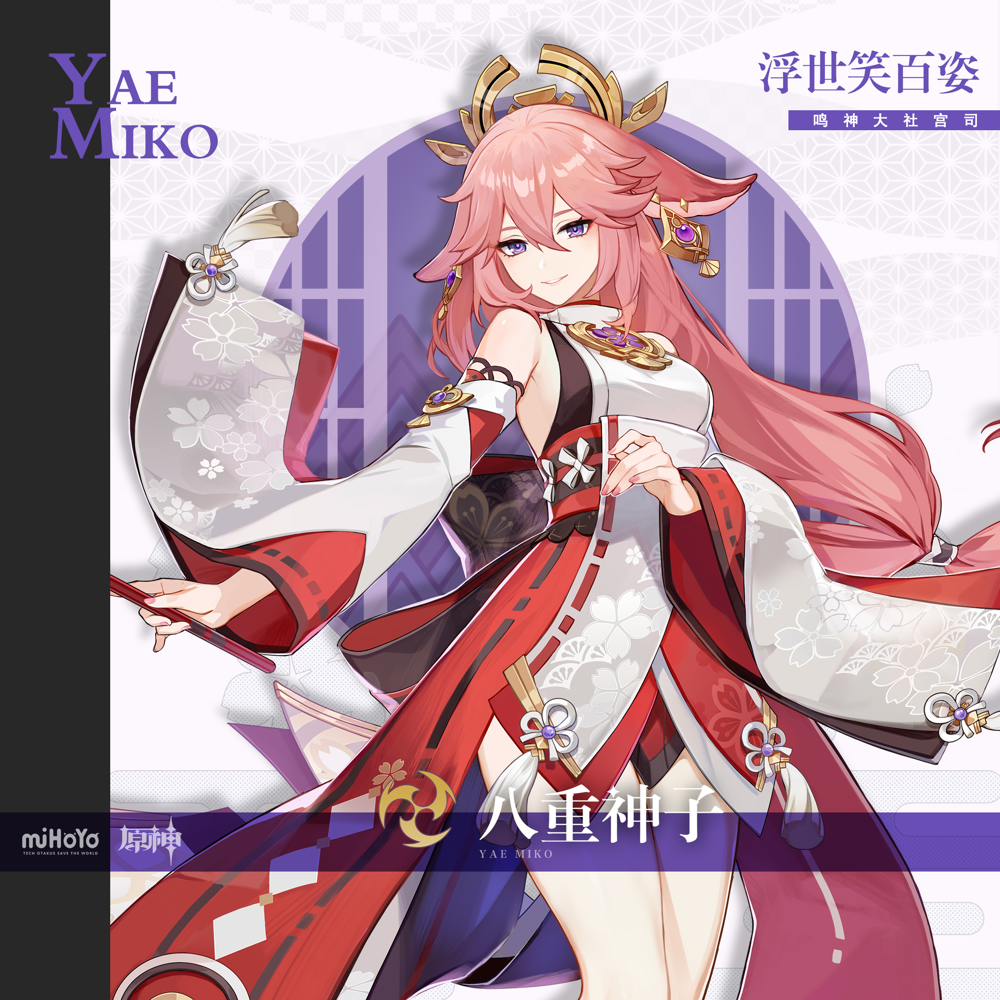
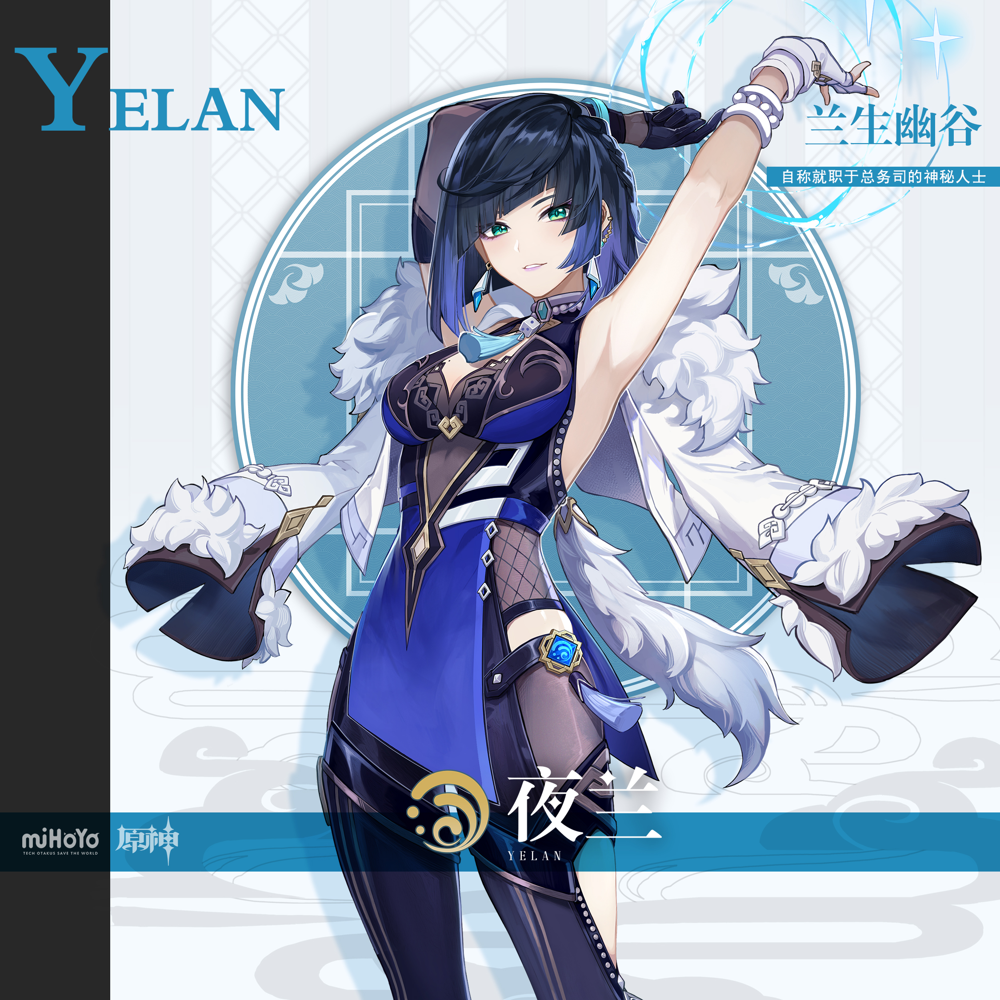
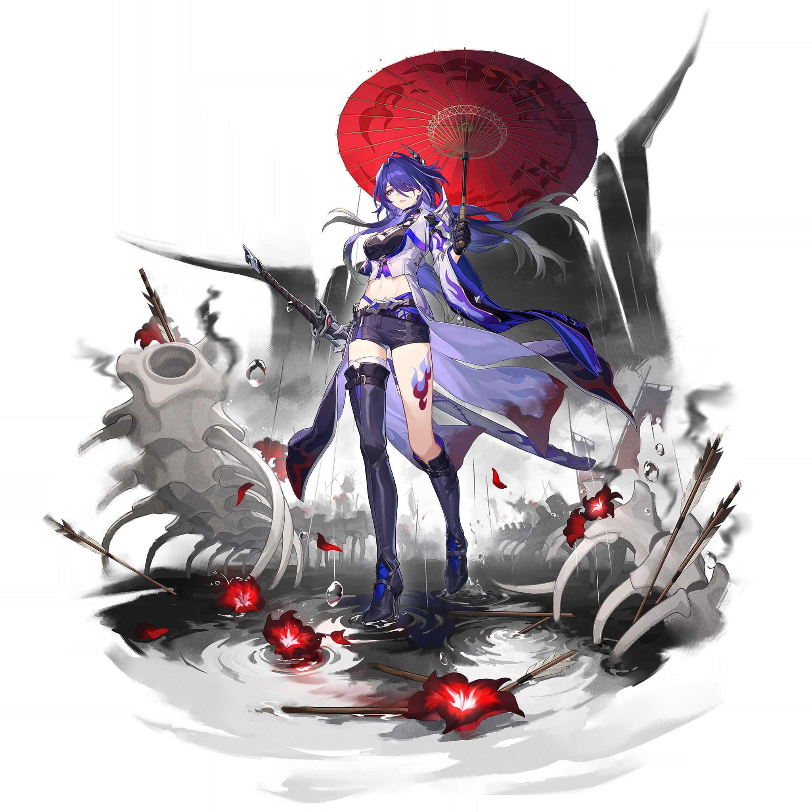
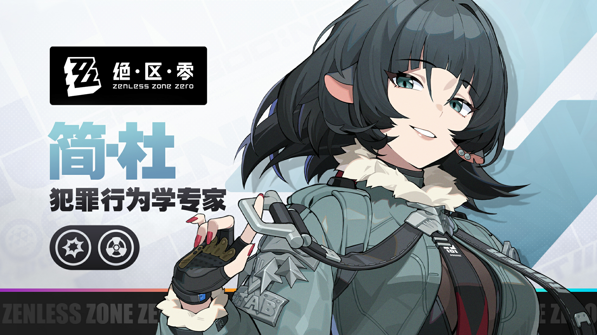

# 白露夜航·秋日冷光 — 2026.09.07

> 视频类型：B · 主题类型合集
> 主题说明：以 2026 年 9 月 7 日白露交节为灵感的自制节令企划。以露水、薄雾、月白冷光、雨后反射和初秋夜行串起不同世界的角色；不是游戏官方联动内容。
> 热点背景：白露于北京时间 2026 年 9 月 7 日 22:41 交节；当日没有更强且未覆盖的新角色热点，选择节令 B 类主题调节近期连续 A 类单人产出节奏。
> 涉及角色：八重神子（原神）、夜兰（原神）、黄泉（崩坏：星穹铁道）、简·杜（绝区零）。
> 选角理由：四位角色的既有高人气与「夜行、观察、游侠、卧底」气质能自然落入白露的冷雾叙事；夜兰在工作区已有早期单人素材，本次仅作为全新节令主题的横向角色之一，避免复用既有场景与标题。
> 参考图校对：`yae-miko-splash.png`、`yelan-splash.png`、`acheron-splash.png` 和 `jane-doe-banner.png` 均由 B 站 WIKI 资源下载并已逐张使用视觉工具校对。八重神子确认粉色长发、高马尾、紫瞳、金白发饰及白绯紫巫女装；夜兰确认深蓝短发、青绿瞳、白色毛领、靛蓝紧身装和蓝色骰子饰物；黄泉确认黑紫长发、紫瞳、绯红花饰、黑紫战衣与红伞意象；简·杜确认深墨绿短发、青绿色眼睛、深色耳朵、灰白毛领、灰蓝战术外套、黑色露指手套和红色美甲。简·杜参考图未完整展示尾部，故本组 prompts 不描述或依赖尾巴。
> 系列画面规则：所有画面统一使用月白、银灰、靛蓝与少量角色主色；露珠、薄雾和湿地反光应可见。后续条目可将第 1 张生成结果作为色调和笔触参考，但不可复制人物姿态。

---

## 1（八重神子·露落鸣神大社）

Positive Prompt:
16:9 2K wallpaper, Yae Miko from Genshin Impact, highly detailed anime-style illustration, refined game-art quality, a quiet White Dew pre-dawn at the stone steps of Narukami Grand Shrine. Preserve her recognizable appearance: long blush-pink hair gathered into an elegant high ponytail with loose flowing lengths, clear violet eyes, ornate gold-and-white ceremonial hair ornaments, and a white-and-crimson shrine-maiden-inspired ceremonial outfit with violet and gold accents. She stands beneath a vermilion torii, holding a folded pale paper umbrella low at her side; the other hand rests lightly against her sleeve, giving her a composed, knowing half-smile toward the viewer. Tiny dew beads cling to maple leaves and fox-shaped stone lanterns, while low silver mist settles over the stairs. Moon-white dawn light arrives from behind the shrine roof and catches the wet paving stones; a faint violet electro glow appears only as soft reflected light in puddles. The composition is calm, intelligent, slightly mischievous, and spacious, with clean foreground depth and no readable text. perfect hands, five fingers on each hand, anatomically correct hands, well-defined fingers, natural hand pose, detailed hands, clean finger separation; one hand naturally holding the umbrella handle and the other relaxed against her sleeve.

Negative Prompt:
low quality, worst quality, blurry, pixelated, bad anatomy, extra limbs, bad hands, extra fingers, fewer fingers, missing fingers, fused fingers, webbed fingers, merged fingers, overlapping fingers, deformed fingers, mutated fingers, six fingers, four fingers, three fingers, more than five fingers, less than five fingers, disfigured hands, poorly drawn hands, bad hand anatomy, asymmetrical hands, broken fingers, claw hands, blurry hands, indistinct fingers, smeared hands, wrong hair color, wrong eye color, incorrect character, chibi, photorealistic, heavy armor, modern streetwear, harsh midday sunlight, dry summer scenery, crowded festival, readable text, watermark, logo, signature.

---

## 2（八重神子·月下校稿）

Positive Prompt:
16:9 2K wallpaper, Yae Miko from Genshin Impact, highly detailed anime-style illustration, elegant nocturnal indoor scene in the same moon-white and indigo White Dew visual language established by Prompt 1. Keep her long blush-pink high ponytail, violet eyes, gold-and-white hair ornaments, and white-crimson-violet shrine-maiden-inspired outfit recognizable. She sits at a dark lacquer writing desk beside a half-open shoji window, reading an unmarked manuscript by a single warm paper lantern; one hand supports the page at its lower corner while the other rests over a closed book, her expression an amused, private smirk rather than an exaggerated smile. Outside the window, a cool blue garden is blurred by mist, droplets line the maple branches, and the full moon creates pale reflections across the polished desk. Use subtle fox and sakura motifs only as decorative shapes, not as additional characters. Warm amber lantern light sculpts her face against the cool silver-blue night, creating a restrained editorial, mysterious mood. perfect hands, five fingers on each hand, anatomically correct hands, well-defined fingers, natural hand pose, detailed hands, clean finger separation; one hand gently anchors a broad manuscript page and the other rests flat on a closed book.

Negative Prompt:
low quality, worst quality, blurry, pixelated, bad anatomy, extra limbs, bad hands, extra fingers, fewer fingers, missing fingers, fused fingers, webbed fingers, merged fingers, overlapping fingers, deformed fingers, mutated fingers, six fingers, four fingers, three fingers, more than five fingers, less than five fingers, disfigured hands, poorly drawn hands, bad hand anatomy, asymmetrical hands, broken fingers, claw hands, blurry hands, indistinct fingers, smeared hands, wrong hair color, wrong eye color, incorrect character, chibi, photorealistic, exposed skin emphasis, school uniform, busy library crowd, bright daylight, illegible paragraphs, readable text, watermark, logo, signature.

---

## 3（八重神子·雾中狐火）

Positive Prompt:
16:9 2K wallpaper, Yae Miko from Genshin Impact, highly detailed anime-style illustration, cinematic low-saturation White Dew night scene. Preserve her long blush-pink hair in a graceful high ponytail, violet eyes, gold-and-white hair ornaments, and her white, crimson, violet, and gold ceremonial shrine-maiden-inspired attire. She walks alone along a wet cedar path leading away from Narukami Grand Shrine, body angled three-quarters toward camera, with her sleeves gathered neatly in one hand and the other hand held behind her back. Her expression is serene and unreadable, like someone who knows the answer before the question is asked. A chain of small, abstract violet foxfire motes floats at a safe distance around the path, reflected in dark rainwater; they are atmospheric light effects rather than creatures. Dew-covered grass bends under moonlight, fog makes distant torii fade into silver layers, and a few pink petals contrast the blue-grey scene. Use a broad cinematic composition with a strong path leading line and refined soft contrast. perfect hands, five fingers on each hand, anatomically correct hands, well-defined fingers, natural hand pose, detailed hands, clean finger separation; one hand gathers her sleeve with relaxed fingers while the other remains simply hidden behind her back.

Negative Prompt:
low quality, worst quality, blurry, pixelated, bad anatomy, extra limbs, bad hands, extra fingers, fewer fingers, missing fingers, fused fingers, webbed fingers, merged fingers, overlapping fingers, deformed fingers, mutated fingers, six fingers, four fingers, three fingers, more than five fingers, less than five fingers, disfigured hands, poorly drawn hands, bad hand anatomy, asymmetrical hands, broken fingers, claw hands, blurry hands, indistinct fingers, smeared hands, wrong hair color, wrong eye color, incorrect character, chibi, photorealistic, fighting pose, weapon focus, horror monster, sunny summer beach, fireworks crowd, readable text, watermark, logo, signature.

---

## 4（夜兰·骰影秋汀）

Positive Prompt:
16:9 2K wallpaper, Yelan from Genshin Impact, highly detailed anime-style illustration, polished cinematic game-art quality, a moonlit White Dew riverside on the outskirts of Liyue. Preserve her recognizable look: short deep navy-blue hair with asymmetrical longer side locks, cool teal-green eyes, a white fur collar, a dark indigo-and-black fitted outfit, and the small blue dice ornament at her chest. She leans lightly against a weathered stone balustrade, looking over her shoulder at the viewer with calm, alert confidence. One hand holds a single large translucent blue die at waist level, with fingers clearly separated; the other hand is tucked naturally into the fall of her outer cape. The river below catches silver moonlight and the die’s soft cyan glow, while tall reeds are jeweled with dew and distant Liyue rooflines dissolve into mist. Use her deep blue palette as an accent against pearl-grey fog, with a clean spy-thriller atmosphere and no on-image lettering. perfect hands, five fingers on each hand, anatomically correct hands, well-defined fingers, natural hand pose, detailed hands, clean finger separation; one hand securely cups a large die and the other rests naturally beneath her cape edge.

Negative Prompt:
low quality, worst quality, blurry, pixelated, bad anatomy, extra limbs, bad hands, extra fingers, fewer fingers, missing fingers, fused fingers, webbed fingers, merged fingers, overlapping fingers, deformed fingers, mutated fingers, six fingers, four fingers, three fingers, more than five fingers, less than five fingers, disfigured hands, poorly drawn hands, bad hand anatomy, asymmetrical hands, broken fingers, claw hands, blurry hands, indistinct fingers, smeared hands, wrong hair color, wrong eye color, incorrect character, chibi, photorealistic, casino interior, exaggerated gambling imagery, modern police uniform, sunny daylight, crowded market, readable text, watermark, logo, signature.

---

## 5（夜兰·雨巷回声）

Positive Prompt:
16:9 2K wallpaper, Yelan from Genshin Impact, highly detailed anime-style illustration, preserve the moon-white, silver-grey, indigo, and wet-reflection series palette from Prompt 1. Keep Yelan’s short deep navy hair with asymmetric long side locks, teal-green eyes, white fur collar, dark indigo-black outfit, and blue dice ornament distinct. She crosses a narrow Liyue alley after a light autumn rain, viewed from a slightly elevated three-quarter angle. Her posture is purposeful but unhurried: one hand pulls the edge of a dark hooded cape forward to shield her hair from fine drizzle, while the other hand holds a folded, blank blue paper slip close to her body. Lanterns behind frosted glass create small warm pools of light without legible symbols; rainwater reflects them in elongated gold lines. Cool mist hangs at ankle height and fresh dew covers the stone steps and bamboo baskets. Her eyes glance toward an off-screen sound, creating a tense but elegant investigative beat rather than combat. perfect hands, five fingers on each hand, anatomically correct hands, well-defined fingers, natural hand pose, detailed hands, clean finger separation; one hand has a natural grip on the cape edge and the other holds a broad folded blank paper slip with relaxed fingers.

Negative Prompt:
low quality, worst quality, blurry, pixelated, bad anatomy, extra limbs, bad hands, extra fingers, fewer fingers, missing fingers, fused fingers, webbed fingers, merged fingers, overlapping fingers, deformed fingers, mutated fingers, six fingers, four fingers, three fingers, more than five fingers, less than five fingers, disfigured hands, poorly drawn hands, bad hand anatomy, asymmetrical hands, broken fingers, claw hands, blurry hands, indistinct fingers, smeared hands, wrong hair color, wrong eye color, incorrect character, chibi, photorealistic, revealing outfit, weapon drawn, chase scene, neon cyberpunk city, crowded street, readable text, watermark, logo, signature.

---

## 6（黄泉·雾过忘川）

Positive Prompt:
16:9 2K wallpaper, Acheron from Honkai: Star Rail, highly detailed anime-style illustration, cinematic dark-fantasy game-art quality, a vast White Dew road between black water and low silver reeds. Preserve her recognizable appearance conservatively: long black-violet hair flowing in the wind, deep violet eyes, a restrained black-and-crimson traveler’s coat with pale inner layers, a small crimson floral hair ornament, and a long sheathed blade carried at her side. She walks from left to right along an old stone causeway, head slightly tilted toward the misty horizon. One hand rests lightly over the scabbard near its guard without drawing the blade; the other hand is hidden beneath her flowing outer sleeve. Her face is distant but gentle, neither angry nor smiling. Pale dew shines on the stones and moonlight breaks through mist in thin diagonal beams. The water mirrors a faint violet edge-light from her silhouette, while the sky stays almost colorless. The image should feel quiet, solitary, and emotionally immense, with no extra people or readable lettering. perfect hands, five fingers on each hand, anatomically correct hands, well-defined fingers, natural hand pose, detailed hands, clean finger separation; one hand rests naturally over the broad scabbard while the other is simply concealed by her sleeve.

Negative Prompt:
low quality, worst quality, blurry, pixelated, bad anatomy, extra limbs, bad hands, extra fingers, fewer fingers, missing fingers, fused fingers, webbed fingers, merged fingers, overlapping fingers, deformed fingers, mutated fingers, six fingers, four fingers, three fingers, more than five fingers, less than five fingers, disfigured hands, poorly drawn hands, bad hand anatomy, asymmetrical hands, broken fingers, claw hands, blurry hands, indistinct fingers, smeared hands, wrong hair color, wrong eye color, incorrect character, chibi, photorealistic, blade unsheathed, violent battle, gore, cheerful festival, daytime sky, extra companions, readable text, watermark, logo, signature.

---

## 7（黄泉·露台候车）

Positive Prompt:
16:9 2K wallpaper, Acheron from Honkai: Star Rail, highly detailed anime-style illustration, elegant wide cinematic composition in the same cold White Dew palette. Keep Acheron’s long black-violet hair, violet eyes, crimson floral hair ornament, black-and-crimson traveler’s coat with pale inner layers, and sheathed blade accurate and recognizable. She waits alone on an open-air railway platform at the edge of an unnamed quiet world, sitting on a simple metal bench beneath a translucent canopy beaded with dew. Her sheathed blade rests safely beside the bench, not in her hands. One hand holds the handle of a broad travel case set on the ground, while the other folds naturally over her knee; her gaze remains lifted toward a distant silver rail vanishing into fog. No train is visible, only a small white signal glow softened by mist. A cool moon hangs behind thin clouds, and rainwater on the platform mirrors violet and pale grey light. Use a subtle sense of being lost yet continuing forward, without symbols, advertisements, or readable text. perfect hands, five fingers on each hand, anatomically correct hands, well-defined fingers, natural hand pose, detailed hands, clean finger separation; one hand naturally holds the large travel-case handle and the other rests flat on her knee.

Negative Prompt:
low quality, worst quality, blurry, pixelated, bad anatomy, extra limbs, bad hands, extra fingers, fewer fingers, missing fingers, fused fingers, webbed fingers, merged fingers, overlapping fingers, deformed fingers, mutated fingers, six fingers, four fingers, three fingers, more than five fingers, less than five fingers, disfigured hands, poorly drawn hands, bad hand anatomy, asymmetrical hands, broken fingers, claw hands, blurry hands, indistinct fingers, smeared hands, wrong hair color, wrong eye color, incorrect character, chibi, photorealistic, packed station, modern ad boards, readable signs, overt battle pose, drawn weapon, bright daylight, watermark, logo, signature.

---

## 8（黄泉·一线紫电）

Positive Prompt:
16:9 2K wallpaper, Acheron from Honkai: Star Rail, highly detailed anime-style illustration, restrained high-end game-art scene. Preserve her long black-violet hair, violet eyes, crimson floral hair ornament, black-and-crimson coat with pale inner layers, and long sheathed blade. She stands under a solitary dead tree on a hill after an autumn rain, shown in profile, looking into a field of silver-white reed plumes heavy with dew. Her long hair and coat move in a soft night breeze. One hand gently steadies the closed sheath against her hip, while the other hand is held behind her back with a simple relaxed wrist; the weapon is never drawn. A single very thin violet lightning line far away briefly illuminates the underside of the clouds, reflected in damp ground without becoming an action scene. The foreground contains sharply rendered dew drops and one fallen crimson leaf; the background fades into grey-blue mist. The final mood should be solemn, luminous, and still, as if an entire storm has chosen to speak quietly. perfect hands, five fingers on each hand, anatomically correct hands, well-defined fingers, natural hand pose, detailed hands, clean finger separation; one hand lightly steadies the closed sheath and the other remains naturally relaxed behind her back.

Negative Prompt:
low quality, worst quality, blurry, pixelated, bad anatomy, extra limbs, bad hands, extra fingers, fewer fingers, missing fingers, fused fingers, webbed fingers, merged fingers, overlapping fingers, deformed fingers, mutated fingers, six fingers, four fingers, three fingers, more than five fingers, less than five fingers, disfigured hands, poorly drawn hands, bad hand anatomy, asymmetrical hands, broken fingers, claw hands, blurry hands, indistinct fingers, smeared hands, wrong hair color, wrong eye color, incorrect character, chibi, photorealistic, dynamic sword slash, explosion, lightning overload, monstrous enemy, gore, sunny landscape, readable text, watermark, logo, signature.

---

## 9（简·杜·霓虹雨后）

Positive Prompt:
16:9 2K wallpaper, Jane Doe from Zenless Zone Zero, highly detailed anime-style illustration, polished urban game-art quality, a rain-washed New Eridu side street at White Dew night. Preserve her verified recognizable traits: short dark ink-green bob hair with layered side bangs, vivid teal-green eyes, dark animal-like ears, a pale grey-white fur collar, a desaturated blue-grey undercover tactical jacket with dark inner layers and metallic hardware, black fingerless gloves, and subtle red fingernails. She stands under the shallow awning of a closed street stall, turning slightly toward the viewer with a playful, unreadable expression. One hand lightly pinches the edge of a plain dark umbrella lowered over one shoulder, while the other hand remains tucked in the pocket of her jacket. Pale steam drifts from a street drain, dew and rainwater turn the pavement into blue-grey mirrors, and a few distant warm neon shapes blur into bokeh with no readable lettering. Use muted cyan, graphite, silver, and one small amber accent to keep the visual language consistent with the other characters. The result should feel sly, stylish, and observant rather than flirtatious or action-heavy. perfect hands, five fingers on each hand, anatomically correct hands, well-defined fingers, natural hand pose, detailed hands, clean finger separation; one hand has a relaxed grip on the umbrella edge while the other is naturally concealed inside a jacket pocket.

Negative Prompt:
low quality, worst quality, blurry, pixelated, bad anatomy, extra limbs, bad hands, extra fingers, fewer fingers, missing fingers, fused fingers, webbed fingers, merged fingers, overlapping fingers, deformed fingers, mutated fingers, six fingers, four fingers, three fingers, more than five fingers, less than five fingers, disfigured hands, poorly drawn hands, bad hand anatomy, asymmetrical hands, broken fingers, claw hands, blurry hands, indistinct fingers, smeared hands, wrong hair color, wrong eye color, incorrect character, chibi, photorealistic, exaggerated animal body, furry body, exposed skin emphasis, nightclub crowd, weapon focus, police chase, readable text, watermark, logo, signature.

---

## 10（简·杜·雾桥回望）

Positive Prompt:
16:9 2K wallpaper, Jane Doe from Zenless Zone Zero, highly detailed anime-style illustration, cinematic urban dawn scene following the same White Dew cold-light palette. Keep Jane Doe recognizable through her short dark ink-green layered bob, teal-green eyes, dark animal-like ears, pale grey-white fur collar, desaturated blue-grey undercover jacket with dark inner layers and metal hardware, black fingerless gloves, and red fingernails. She walks across a quiet elevated pedestrian bridge in New Eridu just before sunrise, then pauses to glance back over one shoulder. One hand holds the collar of her jacket closed against the cool air; the other rests on a wide concrete railing with naturally separated fingers. Below, wet city rails, blank light panels, and puddles reflect moon-white and pale cyan tones; a soft red signal glows far in the distance with no readable markings. Condensation beads on the railing and faint autumn fog wraps the bridge, creating a hush after the night’s unseen work. Keep the pose composed, independent, and non-combatant. perfect hands, five fingers on each hand, anatomically correct hands, well-defined fingers, natural hand pose, detailed hands, clean finger separation; one hand naturally holds her jacket collar and the other rests flat on a broad railing with clean finger separation.

Negative Prompt:
low quality, worst quality, blurry, pixelated, bad anatomy, extra limbs, bad hands, extra fingers, fewer fingers, missing fingers, fused fingers, webbed fingers, merged fingers, overlapping fingers, deformed fingers, mutated fingers, six fingers, four fingers, three fingers, more than five fingers, less than five fingers, disfigured hands, poorly drawn hands, bad hand anatomy, asymmetrical hands, broken fingers, claw hands, blurry hands, indistinct fingers, smeared hands, wrong hair color, wrong eye color, incorrect character, chibi, photorealistic, furry body, exaggerated animal anatomy, revealing outfit, combat pose, firearm, crowded traffic, readable text, watermark, logo, signature.

---

## 注

- 本组使用同一「白露夜航」镜头语言：低饱和银灰雾气、湿地反光、月白冷光和角色专属色点亮画面；不使用热闹节庆、盛夏光线或大面积暖色。
- 四张已下载参考图均在对应角色的首条 prompt 中嵌入；黄泉画面保留绯红花饰和刀鞘意象但不虚构额外召唤物，简·杜参考图未完整展示尾部，所有简·杜 prompt 均不依赖尾巴进行识别。
- 每条负面提示词均包含完整手部异常排除词；正面提示词亦明确了手部位置，降低多指、融合指及模糊手风险。
