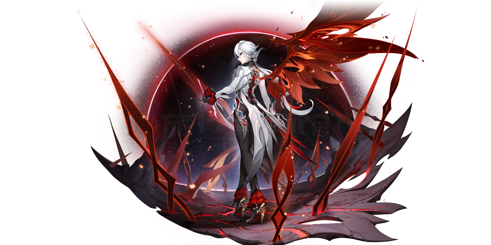
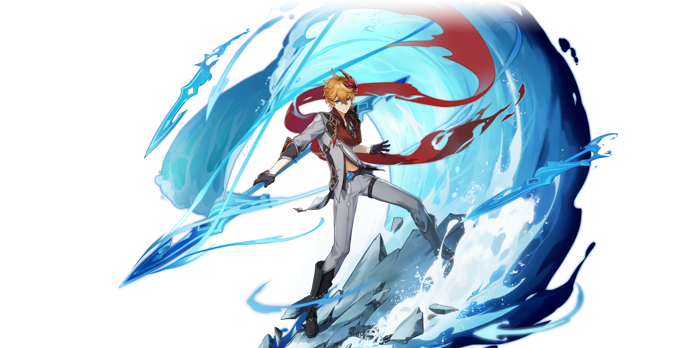
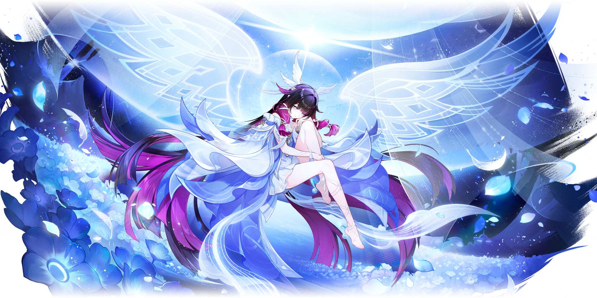
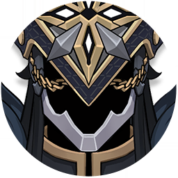

# 至冬执行官·暗黑时装周 Fatui Harbingers — Dark Haute Couture — 2026.08.08
> 视频类型：B · 主题类型合集
> 主题说明：将愚人众执行官放入暗黑高级定制时装秀/奢侈品广告大片的语境，每位执行官身着融合其角色标志性元素的暗黑哥特高定时装，在统一的至冬冰宫T台/暗黑摄影棚场景中走秀拍摄。风格对标 Alexander McQueen × Rick Owens × Noir Kei Ninomiya 的暗黑美学
> 热点背景：原神7.0「无神怜爱的雪国」版本8月12日上线（距今4天），愚人众执行官全员登场是至冬版本核心看点；BW2026展会7月10日以木偶桑多涅为主题打造展台，社区对执行官全员二创需求极高；7.0上半卡池复刻阿蕾奇诺+新角色奥黛塔，执行官话题热度拉满
> 涉及角色（全11席）：统括官「丑角」皮耶罗、第一席「队长」卡皮塔诺、第二席「博士」多托雷、第三席「少女」哥伦比娅、第四席「仆人」阿蕾奇诺、第五席「公鸡」普契涅拉、第六席「散兵」流浪者（已叛逃洗白）、第八席「女士」罗莎琳（已阵亡）、第九席「富人」潘塔罗涅、第十席「木偶」桑多涅、第十一席「公子」达达利亚
> 角色剧情状态备注：队长卡皮塔诺（本名瑟雷恩）在纳塔主线中以英雄式牺牲与夜神融合，代替玛薇卡坐上源火之圣座；女士罗莎琳在稻妻被雷电将军御前决斗处决阵亡；散兵在须弥主线叛逃并洗白为可玩角色「流浪者」
> 统一风格基调：暗黑哥特高级定制时装大片，冰宫T台/摄影棚，冷调灯光，16:9 2K wallpaper

## 1（阿蕾奇诺 · 仆人 · The Knave — 开场走秀主视觉）

Positive Prompt:
16:9 2K wallpaper, dark haute couture fashion editorial, Arlecchino "The Knave" from Genshin Impact, highly detailed anime-style illustration with fashion photography lighting, Alexander McQueen-inspired dark gothic runway aesthetic, luxury fashion campaign quality.

Arlecchino as the opening model of the "Fatui Harbingers Dark Haute Couture Collection." She strides down a long, gleaming obsidian runway inside an ice palace ballroom in Snezhnaya. The runway is polished black marble reflecting her silhouette like dark water. Her walk is predatory and hypnotic — one foot precisely in front of the other, tailcoat billowing behind her like a cape.

Her haute couture outfit reimagines her canonical design as high fashion: a dramatically oversized white-and-charcoal deconstructed tailcoat with asymmetric hemline (short at the front thigh, trailing to floor-length at the back), the interior lined with blood-red silk visible at every movement. Beneath: a structured charcoal corset-vest with visible black boning and a single crimson thread stitched down the center (replacing her tie), paired with razor-sharp tailored black trousers and pointed stiletto ankle boots in patent black leather with red lacquered soles. Her black leather opera gloves extend past the elbow, and she holds a single long-stemmed black rose — thorns gilded in gold. A fire-opal brooch blazes at her collar. Her X-shaped crimson pupils catch the spotlight.

Her ash-white hair with black bangs and red-gradient tips is styled in a severe slicked-back high ponytail, accentuating her sharp cheekbones and the cross-shaped beauty mark beneath her left eye. Expression: cold, imperious, untouchable — the face of someone who knows she is the most dangerous person in any room.

The ice palace ballroom behind the runway: towering Snezhnayan neoclassical columns of pale blue ice, enormous crystal chandeliers casting cold white light mixed with red accent spotlights, seated audience in deep shadow on both sides (silhouettes only — Fatui masks visible on some). The far wall is a massive arched window showing a blizzard raging outside, snowflakes visible against the dark sky. The contrast between the warmth of the interior spotlights and the frozen exterior creates the collection's visual thesis: beauty forged in the coldest place on earth.

Frontal composition, Arlecchino walking directly toward the viewer on the runway, centered, full body from head to boots, the long runway stretching behind her into the ice palace depth. Fashion photography lighting: single key light from above-front creating sharp cheekbone shadows, fill light from the runway reflection below.

perfect hands, five fingers on each hand, anatomically correct hands, well-defined fingers, one gloved hand holding black rose stem at hip height.

Negative Prompt:
low quality, worst quality, blurry, bad anatomy, bad hands, extra fingers, fewer fingers, missing fingers, fused fingers, webbed fingers, merged fingers, overlapping fingers, deformed fingers, mutated fingers, six fingers, four fingers, disfigured hands, poorly drawn hands, bad hand anatomy, broken fingers, blurry hands, indistinct fingers, smeared hands, extra limbs, wrong character, male character, casual clothing, outdoor natural setting, bright cheerful colors, cute expression, combat pose, weapons drawn, game UI elements, chibi, text, watermark.

## 2（达达利亚 · 公子 · Tartaglia — 水之王子走秀）

Referring to the attached reference image of Tartaglia's gacha art, generate a 16:9 2K wallpaper in the same dark haute couture fashion runway style as Figure 1 (Arlecchino walking the ice palace runway).

Tartaglia as the second model of the collection, bringing youthful warrior energy to the dark runway. He walks with a confident, slightly cocky stride — shoulders back, chin up, one hand casually in his trouser pocket, the other arm swinging with athletic grace. Unlike Arlecchino's predatory elegance, his energy is that of a young prince who fights for the thrill of it.

His haute couture outfit reimagines his canonical military-style uniform: a long navy-blue military overcoat with exaggerated peaked shoulders and silver chain epaulettes, left unbuttoned to reveal a tailored deep grey double-breasted waistcoat over a black silk shirt with no tie — the collar open to show his Hydro Vision as a glowing blue sapphire pendant at his throat. His signature red scarf is reimagined as a long, flowing crimson silk aviator scarf trailing behind him in the runway wind machine draft, creating dramatic movement. Slim-cut black trousers with a single wet-look sheen stripe down each leg, and polished black combat boots with silver buckle straps. His black leather gloves have subtle water-droplet embossing.

His bright orange/ginger hair is styled in a fashionably tousled side-swept cut, catching the spotlight with warm copper highlights. His blue eyes (notably lacking highlight reflections — a canonical design detail symbolizing the Abyss) gaze directly at the viewer with a charming, dangerous smirk. Youthful, handsome face with sharp jawline.

Same ice palace runway setting as Figure 1: black marble runway with reflection, Snezhnayan ice columns, crystal chandeliers, cold white + blue accent spotlights (shifted from Arlecchino's red accents to blue, matching his Hydro element). Subtle water-effect lighting patterns ripple across the runway surface around his steps, as if the marble has become liquid where he walks.

Same frontal runway composition as Figure 1, Tartaglia walking toward viewer, full body, centered on runway.

perfect hands, five fingers on each hand, anatomically correct hands, well-defined fingers, one hand in trouser pocket, other arm in natural walking swing.

Negative Prompt:
low quality, blurry, bad anatomy, bad hands, extra fingers, fewer fingers, missing fingers, fused fingers, webbed fingers, merged fingers, overlapping fingers, deformed fingers, mutated fingers, six fingers, four fingers, disfigured hands, poorly drawn hands, bad hand anatomy, broken fingers, blurry hands, indistinct fingers, smeared hands, extra limbs, female character, wrong hair color, brown hair, dark hair, casual streetwear, outdoor scene, bright colors, happy cheerful smile, weapons visible, bow drawn, dual blades, combat stance, chibi, text, watermark.

## 3（桑多涅 · 木偶 · Sandrone — 机械娃娃走秀）

Referring to the attached reference image of Sandrone's gacha art, generate a 16:9 2K wallpaper in the same dark haute couture fashion runway style as Figure 1.

Sandrone as the third model — but she does not walk alone. She glides down the runway seated atop a miniaturized, fashion-redesigned version of her mechanical construct Fajieou, which has been reimagined as an avant-garde mechanical throne/palanquin on spider-like articulated brass legs. She sits with her legs crossed, teacup and saucer in hand, being carried down the runway by her creation — the ultimate power move, letting the machine walk while she remains perfectly still and composed.

Her haute couture outfit reimagines her Victorian gothic maid aesthetic as high fashion: an architectural black-and-white crinoline ball gown with a dramatically exaggerated cage skirt structure (visible boning in gunmetal grey), the bodice a structured corseted piece in jet black with cream lace overlay and antique gold cogwheel buttons. Her signature maid bonnet/mob-cap is reimagined as an elaborate black tulle fascinator with gold gear ornaments and trailing black ribbons. White silk opera gloves with tiny gold clock-hand brooches at each wrist. Black ribbon choker with a glowing ice-blue Cryo gem pendant. Her signature winding key protrudes from her back, now gilded in 24-karat gold, catching the spotlight.

Her flaxen/pale blonde hair is styled in elaborate ringlet curls framing her doll-like face, with precise blunt-cut bangs. Her cold ice-blue eyes regard the audience with detached amusement — a clockwork princess surveying lesser beings. Porcelain-pale skin, expression of bored aristocratic superiority.

The mechanical palanquin beneath her: a miniature steampunk spider-throne of dark iron and brass, with exposed gears turning visibly, steam venting from joints, eight articulated legs moving in perfect synchronization down the runway. Integrated into its design are teapot-shaped exhaust vents and clockwork music-box mechanisms — it plays a tinkling melody as it walks.

Same ice palace runway setting, but with gold-and-cream accent spotlights matching her color scheme. The audience silhouettes lean forward, fascinated by the mechanical spectacle. Clockwork gears and watch parts are scattered decoratively along the runway edges.

Composition: Sandrone elevated above the runway on her mechanical throne, centered, the spider-legs creating a dramatic silhouette. Tea held elegantly in one hand, the other resting on the armrest.

perfect hands, five fingers on each hand, anatomically correct hands, well-defined fingers, one hand holding teacup handle delicately, other hand resting on armrest with fingers relaxed.

Negative Prompt:
low quality, blurry, bad anatomy, bad hands, extra fingers, fewer fingers, missing fingers, fused fingers, webbed fingers, merged fingers, overlapping fingers, deformed fingers, mutated fingers, six fingers, four fingers, disfigured hands, poorly drawn hands, bad hand anatomy, broken fingers, blurry hands, indistinct fingers, smeared hands, extra limbs, male character, standing walking pose, modern casual clothing, colorful outfit, warm colors, outdoor sunny scene, smiling expression, combat mode, large full-size mech, chibi, text, watermark.

## 4（哥伦比娅 · 少女 · Columbina — 月光天使走秀）

Referring to the attached reference image of Columbina's gacha art, generate a 16:9 2K wallpaper in the same dark haute couture fashion runway style as Figure 1.

Columbina as the fourth model — but she does not walk the runway in any conventional sense. She floats. Her bare feet hover three inches above the black marble surface, toes pointed downward like a ballerina en pointe, her flowing dress and hair drifting in an invisible updraft. She moves forward with ethereal, dreamlike slowness, arms slightly outstretched at her sides, palms up, as if sleepwalking through a beautiful nightmare. She is the most unsettling presence on the runway — serene and alien and heartbreakingly beautiful.

Her haute couture outfit transforms her canonical flowing white dress into a runway masterpiece: a diaphanous multilayered gown of white silk organza and moonlight-blue chiffon, each layer progressively more translucent, creating a ghostly depth effect. The bodice is an architectural corset of silver wire and crystal beading that traces the shape of dove wings across her collarbones. The skirt flows floor-length with an irregular jagged hem that resembles torn feathers or broken angel wings. Her bare shoulders and arms are painted with delicate silver body-art patterns resembling lunar phases. Her feet are truly bare — no shoes — with silver ankle chains connecting to toe rings, each chain set with tiny moonstone drops.

Her very long dark hair (black with purple inner undertones) flows freely behind and around her, unbound, reaching past her waist, individual strands catching the light like dark water. Her signature white X-shaped lace blindfold/mask covers her perpetually closed eyes — but for the runway, it has been reimagined in white Venetian lace with seed pearl embroidery, more ornate and fashion-forward. Feather-like white ribbon ornaments cascade from the back of her head like stylized dove wings. Expression: serene, sorrowful, transcendent — a smile so gentle it might be grief.

Same ice palace runway setting, but the lighting has shifted dramatically: all spotlights dim to near-darkness except for a single cone of pale blue-white moonlight from directly above, following her floating path. The runway surface beneath her reflects only her dress and the moonlight — everything else is swallowed by shadow. The effect is as if the moon itself has entered the ice palace to illuminate only her.

Composition: Columbina floating at center, slightly elevated above the runway, full body visible from head to bare toes, the moonlight cone creating a vertical column of light around her. The surrounding darkness makes her glow like an apparition.

perfect hands, five fingers on each hand, anatomically correct hands, well-defined fingers, hands open with palms facing upward at her sides, fingers slightly curved and relaxed.

Negative Prompt:
low quality, blurry, bad anatomy, bad hands, extra fingers, fewer fingers, missing fingers, fused fingers, webbed fingers, merged fingers, overlapping fingers, deformed fingers, mutated fingers, six fingers, four fingers, disfigured hands, poorly drawn hands, bad hand anatomy, broken fingers, blurry hands, indistinct fingers, smeared hands, extra limbs, male character, eyes open, aggressive expression, bright colorful clothing, red or warm tones, shoes or boots, standing firmly on ground, combat pose, weapons, modern casual outfit, chibi, text, watermark.

## 5（卡皮塔诺 · 队长 · Il Capitano — 纳塔英雄的最后行军）

Referring to the attached reference image of Capitano's portrait, generate a 16:9 2K wallpaper in the same dark haute couture fashion runway style as Figure 1.

Il Capitano — the First Harbinger, the strongest warrior among the Fatui, real name Thrain (瑟雷恩), a Khaenri'ah Sentinel Knight who bore the curse of immortality for 500 years. In the Natlan arc he made the ultimate sacrifice: fusing with the Night God to save Natlan and give his fallen soldiers' souls a final resting place. This is not a villain's walk — this is a hero's last march.

He walks with the measured, unstoppable cadence of a military march, each footfall precisely timed, his massive frame casting a shadow that engulfs the entire width of the runway. But there is something different about his stride compared to the other Harbingers — it carries the weight of five centuries of duty, and the quiet peace of a man who has finally found his purpose.

His haute couture outfit transforms his canonical military armor into a tribute to both Khaenri'ah and Natlan: a floor-length black leather trench coat with an impossibly high structured collar framing his helmeted head, the coat's surface etched with subtle chain-link patterns in matte black-on-black. But woven into the black leather are faint golden Natlan tribal motifs — sun-serpent patterns along the hem, barely visible unless the light catches them at the right angle, honoring his adopted homeland. Beneath: a full suit of fitted black body armor reimagined as tailored fashion — segmented plates in matte black titanium covering chest and shoulders, each plate edge lined with thin gold trim. Heavy black leather gauntlets with riveted knuckle plates. Knee-high black military boots with thick soles. A long black cape with a standing collar trails behind him, but its inner lining is not the expected dark silk — it is deep crimson-orange, the color of Natlan's sacred flame, visible only as the cape billows.

His helmet remains on — the angular black-and-silver mask with narrowed eye slits through which a faint warm glow now emanates (no longer pure void, but the soft light of the Night God's flame within). Gold filigree traces along the helmet's temples. Heavy chains — his canonical motif, representing the curse of immortality — hang from the helmet's jaw to his shoulder pauldrons, but on one chain hangs a small golden pendant shaped like a Natlan sun disk, swaying with each step.

His long black hair flows from beneath the helmet, straight and severe. No skin is visible anywhere. He is a monument, not a man — but a monument that chose to burn rather than stand forever.

Same ice palace runway setting, but for this walk the entire hall has shifted: all lights extinguished except for a single intense warm-white spotlight from directly behind him, turning his approaching silhouette into a dark figure rimmed with golden-orange backlight — as if the sacred flame of Natlan follows him even here in Snezhnaya. The audience is now standing — silhouettes risen from their seats in silent respect. The blizzard visible through the arched windows has stilled, snowflakes frozen mid-air, as if even the winter pauses for this soldier's final march.

Composition: Capitano walking toward viewer from the far end of the runway, full body, the warm backlighting creating a dramatic rim-light silhouette that contrasts with the cold ice palace. His shadow stretches toward the viewer along the black marble. He is the largest figure in any of the images — his scale deliberately exaggerated to convey the presence that earned him the title "First of the Harbingers."

perfect hands, five fingers on each hand, anatomically correct hands, well-defined fingers, gauntleted fists clenched at his sides while walking.

Negative Prompt:
low quality, blurry, bad anatomy, bad hands, extra fingers, fewer fingers, missing fingers, fused fingers, webbed fingers, merged fingers, overlapping fingers, deformed fingers, mutated fingers, six fingers, four fingers, disfigured hands, poorly drawn hands, bad hand anatomy, broken fingers, blurry hands, indistinct fingers, smeared hands, extra limbs, female character, face visible, helmet removed, bright colorful clothing, casual outfit, small stature, slim build, cheerful expression, outdoor sunny scene, daylight, cute style, chibi, text, watermark.

## 6（皮耶罗 · 丑角 · Pierro — 统括官的开幕致辞）

Positive Prompt:
16:9 2K wallpaper, dark haute couture fashion editorial, Pierro "The Jester" from Genshin Impact, the supreme leader of the Fatui Harbingers, highly detailed anime-style illustration with fashion photography lighting, regal dark gothic aesthetic, luxury fashion campaign quality.

Pierro does not walk the runway — he stands at the very end of it, facing the audience, delivering the collection's opening address. He is the creative director, the architect, the one who summoned all the others. He stands perfectly still at the runway's terminus with his arms clasped behind his back, chin raised, regarding the seated audience with the authority of a man who has outlived civilizations.

His haute couture outfit reimagines his canonical look as the ultimate dark formalist statement: a floor-length deep midnight-blue velvet overcoat with an impossibly high Mandarin collar, heavy military braiding in tarnished silver across the chest (Khaenri'ah court mage insignia abstracted into decorative frogging), and an asymmetric cape draped over his left shoulder in the same midnight blue lined with starfield-pattern silk — tiny silver dots scattered like constellations on black. Beneath: a structured charcoal three-piece suit of impeccable Savile Row tailoring, black silk cravat pinned with a pale blue Cryo gem stickpin. His shoes are polished black Oxford brogues — the only Harbinger wearing formal shoes rather than boots, befitting a man of intellect rather than combat. Black leather gloves with silver stitching.

His defining feature — the half-face mask covering the right side of his face — is rendered as a work of art: deep blue ceramic or lacquered surface with subtle Khaenri'ah geometric patterns etched in silver, covering from forehead to jaw on the right side, leaving only his left eye visible. That visible left eye is sharp, pale, and ancient — carrying 500 years of grief, fury, and calculated patience. His visible hair is silvery-white, swept back severely from his forehead, long enough to reach his collar. His exposed skin on the left side is pale and weathered — the face of a man who was old before the current gods were young.

He stands at the far end of the runway, the ice palace's grand arched entrance behind him. The lighting is a single cold blue spotlight from above, casting his half-masked face in dramatic shadow. His cape stirs slightly in a draft. His expression is unreadable — the left side shows calm authority, the masked right side reveals nothing.

Composition: Pierro standing at the far end of the runway facing the viewer, shot from a low angle to emphasize his authority, the runway stretching toward the viewer in the foreground. He is the only Harbinger who faces the audience rather than walking toward them — because he has nothing to prove.

perfect hands, five fingers on each hand, anatomically correct hands, well-defined fingers, both hands clasped behind back (one hand gripping the other wrist).

Negative Prompt:
low quality, blurry, bad anatomy, bad hands, extra fingers, fewer fingers, missing fingers, fused fingers, webbed fingers, merged fingers, overlapping fingers, deformed fingers, mutated fingers, six fingers, four fingers, disfigured hands, poorly drawn hands, bad hand anatomy, broken fingers, blurry hands, indistinct fingers, smeared hands, extra limbs, female character, no mask, full face visible, young appearance, colorful clothing, casual outfit, walking pose, combat stance, weapons, cheerful expression, bright setting, chibi, text, watermark.

## 7（多托雷 · 博士 · Il Dottore — 异端学者的解剖美学）

Positive Prompt:
16:9 2K wallpaper, dark haute couture fashion editorial, Il Dottore "The Doctor" from Genshin Impact, the second Harbinger, highly detailed anime-style illustration with surgical precision lighting, mad scientist meets avant-garde fashion, luxury editorial quality.

Dottore walks the runway with the leisurely, almost bored stride of a man conducting a routine experiment — the audience is merely his latest batch of test subjects. His head is slightly tilted, one gloved hand raised to adjust his mask, the other holding a thin glass vial filled with luminous turquoise liquid (the color of his experiments) between two fingers, held up to the light as if examining a specimen mid-walk.

His haute couture outfit reimagines his canonical Sumeru-influenced scholar aesthetic as dark clinical fashion: a long asymmetric lab coat in midnight black with one side cut short at the hip and the other trailing to the ankle, the fabric a stiff architectural canvas with visible topstitching in electric blue thread. Beneath: a fitted turtleneck in dark teal (his signature accent color) with a subtle pattern of anatomical diagrams woven into the fabric (visible only up close), paired with slim black trousers and pointed black leather shoes with a slight heel. His signature half-mask is reimagined as a sleek matte-black and teal Venetian plague doctor-inspired visor that covers the upper half of his face, with a subtle elongated nose-bridge — referencing both his Commedia dell'arte origin (the Doctor) and plague doctors of Renaissance Italy. His visible lower face shows a composed smirk of intellectual superiority. His hair is a striking layered cut in deep blue-black with teal-tipped ends, swept back from the mask with deliberate messiness — the look of someone who styles their hair between dissections.

Same ice palace runway setting, but the accent spotlights are teal/cyan, casting clinical operating-room shadows. On the runway surface around his steps, holographic anatomical diagrams flicker — projected hearts, brains, elemental circulation systems — as if the runway itself is his dissection table. A faint haze of turquoise vapor trails behind him from the vial.

Composition: Dottore walking at a slight angle, three-quarter view, one hand raised with the vial catching the teal spotlight, the other adjusting his mask. His expression beneath the mask is a knowing smirk.

perfect hands, five fingers on each hand, anatomically correct hands, well-defined fingers, one hand holding glass vial between thumb and index finger, other hand touching mask edge.

Negative Prompt:
low quality, blurry, bad anatomy, bad hands, extra fingers, fewer fingers, missing fingers, fused fingers, webbed fingers, merged fingers, overlapping fingers, deformed fingers, mutated fingers, six fingers, four fingers, disfigured hands, poorly drawn hands, bad hand anatomy, broken fingers, blurry hands, indistinct fingers, smeared hands, extra limbs, female character, no mask, full face visible, warm colors, orange tones, casual clothing, kind expression, outdoor scene, chibi, text, watermark.

## 8（普契涅拉 · 公鸡 · Pulcinella — 老狐狸的绅士步伐）

Positive Prompt:
16:9 2K wallpaper, dark haute couture fashion editorial, Pulcinella "The Rooster" from Genshin Impact, the fifth Harbinger, highly detailed anime-style illustration with warm-toned fashion photography lighting, old-world gentleman meets dark power broker aesthetic, luxury editorial quality.

Pulcinella brings a completely different energy to the runway — he is the oldest, the most politically shrewd, and paradoxically the most approachable of the Harbingers. He walks with the unhurried, slightly waddling gait of a man who has no need to impress anyone because he already owns everything. His small stature (he is notably short among the Harbingers) is compensated by an oversized personality visible in every gesture — he tips his hat to the audience, he adjusts his spectacles, he even gives a little bow.

His haute couture outfit is pure old-money Snezhnayan aristocracy reimagined through dark fashion: a three-quarter length overcoat in rich burgundy-black wool with a dramatic fur-trimmed shawl collar (Arctic fox, naturally), single-breasted with oversized gold buttons stamped with the Fatui insignia. Beneath: a dove-grey three-piece suit with pinstripe so fine it's almost invisible, a burgundy silk waistcoat with gold watch-chain draped across the belly, a crisp white shirt with a high starched collar, and a black silk cravat pinned with a diamond stickpin. He carries a black lacquered walking cane with a gold rooster-head handle — his namesake and his weapon. On his head: a tall black top hat with a burgundy silk band, slightly oversized for his small frame, adding a touch of theatrical absurdity. Round gold-rimmed spectacles perch on his long, distinctive hooked nose. His ears are notably pointed (elf-like), and he sports a neatly trimmed white mustache (八字胡). Despite his small, elderly frame, his eyes behind those spectacles are razor-sharp — the eyes of a man who has manipulated economies and toppled governments.

Same ice palace runway setting, but with warm amber-gold accent spotlights creating a cozy, old-library atmosphere around his walk — as if he brings his own warmth. A red carpet has been rolled over the black marble just for his segment. The audience silhouettes lean back, relaxed — he is the intermission, the palate cleanser, the grandfather everyone underestimates until it's too late.

Composition: Pulcinella walking toward the viewer at a slight angle, full body, one hand on his cane, the other tipping his hat. Despite being the smallest figure in the collection, his confidence fills the frame.

perfect hands, five fingers on each hand, anatomically correct hands, well-defined fingers, one hand gripping cane handle, other hand touching hat brim.

Negative Prompt:
low quality, blurry, bad anatomy, bad hands, extra fingers, fewer fingers, missing fingers, fused fingers, webbed fingers, merged fingers, overlapping fingers, deformed fingers, mutated fingers, six fingers, four fingers, disfigured hands, poorly drawn hands, bad hand anatomy, broken fingers, blurry hands, indistinct fingers, smeared hands, extra limbs, female character, young appearance, tall stature, muscular build, modern casual clothing, combat pose, aggressive expression, colorful outfit, chibi, text, watermark.

## 9（散兵/流浪者 · Scaramouche/Wanderer — 叛逆者的空席之风）

Positive Prompt:
16:9 2K wallpaper, dark haute couture fashion editorial, Scaramouche / The Wanderer from Genshin Impact, the former sixth Harbinger who defected and found his own path, highly detailed anime-style illustration with dramatic wind-effect fashion photography, rebellious avant-garde aesthetic, luxury editorial quality.

The Wanderer does not follow the runway's rules. He enters from the side — leaping down from the upper balcony of the ice palace, his wide-brimmed hat trailing behind him, landing on the runway in a crouch before slowly rising to a standing position. He walks against the direction of the other models — toward the backstage, away from the audience — because he has already left the Fatui, and this runway is no longer his stage. But he walks it one last time, for reasons only he understands.

His haute couture outfit is a fusion of his original Scaramouche Fatui uniform and his current Wanderer aesthetic, representing both identities simultaneously: a cropped black-and-indigo Japanese-inspired haori jacket with exaggerated wide sleeves, one sleeve intact (his Wanderer side) and the other torn and trailing (his Fatui past), the tear edges gilded in gold. Beneath: a fitted dark purple turtleneck with diagonal lightning-bolt topstitching in metallic silver (referencing his Electro origin as the Balladeer). His signature wide-brimmed hat — the most recognizable accessory among all Harbingers — is reimagined as an oversized haute couture statement piece: deep indigo felt with a dramatically high crown and wide brim, the underside lined with star-map patterns in gold thread (the "lie" of the sky he discovered), a single golden feather pinned to the band — his keepsake from the Raiden Shogun who created him. Black hakama-style wide-leg trousers with a single white stripe, and black tabi-style boots with slight heels.

His short dark indigo-purple hair is wind-tousled beneath the hat, a few strands falling across his forehead. His expression is complex — defiant, wistful, and darkly amused all at once. He is beautiful in a sharp, androgynous way: youthful appearance (though he is centuries old as a puppet), pale skin, vivid violet eyes with a hint of contempt.

Same ice palace runway setting, but a strong wind sweeps through the hall (his Anemo element), scattering rose petals and feathers from the previous models' walks. His haori sleeves billow dramatically. He is the only model walking away from the viewer — a deliberate statement. Above him, a single Anemo-green spotlight follows his retreating figure.

Composition: The Wanderer walking away from the viewer toward the far end of the runway, shot from behind at a slight angle, his wide hat and flowing sleeves creating a dramatic silhouette against the distant ice palace entrance. He has turned his head to look back over his shoulder at the viewer — one last glance at the world he left behind.

perfect hands, five fingers on each hand, anatomically correct hands, well-defined fingers, hands at sides, sleeves flowing.

Negative Prompt:
low quality, blurry, bad anatomy, bad hands, extra fingers, fewer fingers, missing fingers, fused fingers, webbed fingers, merged fingers, overlapping fingers, deformed fingers, mutated fingers, six fingers, four fingers, disfigured hands, poorly drawn hands, bad hand anatomy, broken fingers, blurry hands, indistinct fingers, smeared hands, extra limbs, female character, no hat, cheerful smiling, happy expression, Fatui uniform intact, combat puppet form, bright colors, outdoor summer scene, chibi, text, watermark.

## 10（女士 · 罗莎琳 · La Signora — 炎之魔女的空椅挽歌）

Positive Prompt:
16:9 2K wallpaper, dark haute couture fashion editorial, La Signora / Rosalyne from Genshin Impact, the fallen eighth Harbinger who died in Inazuma, highly detailed anime-style illustration with memorial/tribute lighting, tragic beauty meets haute couture, luxury editorial quality with melancholic atmosphere.

La Signora does not walk the runway — because she cannot. She is dead, executed by the Raiden Shogun's Musou no Hitotachi in Inazuma. Instead, her segment is a memorial: an empty chair sits alone at the center of the runway, bathed in a single warm amber spotlight. Draped over the chair is her haute couture outfit — arranged as if she had just stood up and left, but the wrinkles and folds tell the truth: she will never return.

The outfit on the chair reimagines her canonical design as tragic, romantic high fashion: a floor-length gown that transitions from ice-white at the bodice to deep crimson at the hem — representing her dual nature as the Cryo-masked Signora and the Pyro-burning Crimson Witch. The bodice is a structured white satin corset with frost-crystal beading and a high lace collar, while the skirt gradually becomes liquid crimson silk with flame-like ruffled edges, the fabric appearing to literally smolder at the hem where subtle embers seem to glow. A white fur stole with black tips drapes over one arm of the chair. Her signature ornate butterfly-shaped mask lies on the seat — in this version, it is half white porcelain (her Signora side) and half crimson lacquer (her Crimson Witch side), cracked down the middle where the two colors meet.

On the floor beside the chair: a pair of pointed white stiletto heels (she won't need them), a single white rose with its petals beginning to char at the edges (the eternal conflict between her ice and fire), and a small framed photograph turned face-down (her lost love Rostam, the "Young Wolf" of the Knights of Favonius).

The ice palace around this memorial segment is dimmed to near-darkness, with only the amber spotlight on the empty chair. In the background, the other Harbingers' silhouettes are visible at the far end of the runway — they have all paused to face this empty space. It is the most emotionally devastating moment of the show.

Composition: The empty chair at center, the outfit draped across it, the mask on the seat, the spotlight creating a warm island in the surrounding darkness. No character — only absence. This is fashion as eulogy.

perfect hands — N/A (no character present, only the outfit and props).

Negative Prompt:
low quality, blurry, bad anatomy, character present, Signora standing or walking, alive character, combat scene, battle form, bright cheerful colors, summer setting, crowded scene, modern casual clothing, chibi, text, watermark.

## 11（潘塔罗涅 · 富人 · Pantalone — 金融帝王的无声交易）

Positive Prompt:
16:9 2K wallpaper, dark haute couture fashion editorial, Pantalone "The Regrator" from Genshin Impact, the ninth Harbinger and master banker, highly detailed anime-style illustration with luxurious warm lighting against cold shadows, old-money elegance meets corporate menace, luxury editorial quality.

Pantalone walks the runway as if it were the trading floor of the Northland Bank — with absolute calm, a thin cigarette trailing a ribbon of smoke from one hand, his other hand tucked into his coat pocket where he fingers a gold coin out of habit. His stride is measured and elegant, each step placed with the precision of a man who calculates the cost of everything, including his own footfalls. He is lean, sharp-featured, and always smiling — the smile of a man who knows your price.

His haute couture outfit is pure plutocratic dark elegance: a full-length black cashmere overcoat with a subtle herringbone weave, the collar and cuffs trimmed with dark mink fur, a single gold-thread monogram "P" embroidered on the breast pocket. Beneath: a perfectly tailored three-piece suit in the darkest charcoal, the waistcoat a rich deep purple silk (his accent color), a black silk shirt with no tie — the collar left open to show a thin gold chain with a tiny Mora coin pendant. His hands are gloved in butter-soft black kidskin, except the fingers of his right hand are exposed to hold his cigarette — revealing long, pale, elegant fingers. On his feet: handmade black leather Chelsea boots with gold zippers. His rectangular spectacles are thin-framed in brushed gold. His hair is dark (black or very dark brown), long enough to be tied in a sleek low ponytail, with a few strands escaping artfully across his forehead. His eyes behind the spectacles are perpetually half-lidded — whether from amusement, calculation, or contempt, no one can tell.

Same ice palace runway setting, but the accent spotlights are warm gold, and the runway surface reflects not marble but the golden glint of Mora coins embedded in clear resin — he walks on money, literally. On both sides of the runway, instead of seated audience, there are stacks of Northland Bank vault boxes and gold ingots arranged as set dressing. A faint haze of cigarette smoke drifts in the spotlight beams.

Composition: Pantalone walking in a relaxed three-quarter view, one hand in pocket, the other at his side with cigarette trailing smoke, his reflection in the gold-flecked runway below.

perfect hands, five fingers on each hand, anatomically correct hands, well-defined fingers, one hand in coat pocket, other hand holding thin cigarette between index and middle finger.

Negative Prompt:
low quality, blurry, bad anatomy, bad hands, extra fingers, fewer fingers, missing fingers, fused fingers, webbed fingers, merged fingers, overlapping fingers, deformed fingers, mutated fingers, six fingers, four fingers, disfigured hands, poorly drawn hands, bad hand anatomy, broken fingers, blurry hands, indistinct fingers, smeared hands, extra limbs, female character, muscular build, young boyish appearance, colorful clothing, casual outfit, aggressive expression, combat pose, outdoor scene, chibi, text, watermark.

## 12（全员群像 · 冬夜愚戏再临 · 秀后合照）

Positive Prompt:
16:9 2K wallpaper, dark haute couture fashion group portrait, all eleven Fatui Harbingers from Genshin Impact in a carefully composed group shot on the ice palace runway after the show, highly detailed anime-style illustration, luxury fashion editorial group photo quality, dramatic chiaroscuro lighting, recreation of the iconic "Winter Night's Lazzo" PV composition.

Arrange all present Harbingers in a theatrical formation on the runway, recreating and reimagining the iconic "Winter Night's Lazzo" funeral scene as a fashion finale tableau:

Back row (standing, tallest): Capitano at center-left (tallest, black armored trench coat with Natlan-gold inner lining visible, helmet with warm glow in eye slits, arms at sides, chains swaying), Pierro at center-right (midnight-blue overcoat, half-face blue mask, hands clasped behind back, the only figure looking directly at the viewer).

Middle row (standing): Arlecchino (white deconstructed tailcoat, holding black rose, X-shaped eyes, cool superiority), Dottore (black asymmetric lab coat, teal mask, holding vial, smirking), Tartaglia (navy overcoat, red scarf, hands in pockets, cocky grin, orange hair), Pantalone (black cashmere overcoat, gold spectacles, cigarette, half-lidded eyes, thin smile).

Front row: Sandrone (seated on mechanical spider-throne, black-and-white ball gown, teacup, doll-like), Pulcinella (standing beside Sandrone, short stature, burgundy overcoat, top hat, gold-headed cane, spectacles, pointed ears), Columbina (seated on floor at Sandrone's feet, white organza gown, bare feet, blindfold, dark hair pooling around her, hands in lap, serene).

Special elements: The Wanderer/Scaramouche is NOT in the group — instead, his wide-brimmed hat rests on a runway post at the far left edge of the frame, a single golden feather pinned to it, representing his absence. La Signora's empty chair sits at the far right edge of the frame, her cracked butterfly mask on the seat, a single charring white rose beside it. These two absences frame the group and give the image its emotional weight.

The setting is the full ice palace runway at the end of the show: spotlights dimmed to intimate warmth, the crystal chandeliers now casting a soft amber glow, the blizzard outside the windows calmed to gently falling snow. On the runway behind the group, scattered props from the entire show — rose petals, clockwork gears, chains, white feathers, gold coins, smoke wisps — create an artful debris field.

Balanced wide composition with the group filling the center, the two memorial elements (hat and chair) at the edges. Every present face is clearly visible and individually detailed in their haute couture outfits. The mood is dangerous glamour tinged with loss — a family portrait of the most dysfunctional, magnificent family in Teyvat.

perfect hands, five fingers on each hand, anatomically correct hands, well-defined fingers on all characters.

Negative Prompt:
low quality, blurry, bad anatomy, bad hands, extra fingers, fewer fingers, missing fingers, fused fingers, webbed fingers, merged fingers, overlapping fingers, deformed fingers, mutated fingers, six fingers, four fingers, disfigured hands, poorly drawn hands, bad hand anatomy, broken fingers, blurry hands, indistinct fingers, smeared hands, extra limbs, wrong number of characters, Scaramouche present in group, Signora alive and present, duplicate characters, wrong hair colors, casual clothing, bright sunny setting, outdoor scene, combat poses, weapons drawn, game UI, happy cheerful group, peace signs, chibi, text, watermark.

## 注
角色选择依据：本合集收录了全部11席愚人众执行官（含统括官丑角），涵盖了7.0至冬版本中最具话题性的全员阵容。各角色按剧情状态分为三类处理：活跃执行官（皮耶罗、多托雷、阿蕾奇诺、普契涅拉、哥伦比娅、潘塔罗涅、桑多涅、达达利亚）正常走秀；已牺牲/离队角色以特殊方式致敬——队长卡皮塔诺（纳塔主线英雄式牺牲，与夜神融合坐上源火之圣座，prompt中以「英雄最后行军」+Natlan金色内衬+温暖逆光表现其纳塔归宿而非纯反派形象）、散兵/流浪者（叛逃洗白，以「反向行走+回望」表现告别）、女士罗莎琳（稻妻阵亡，以「空椅挽歌」表现缺席追思）。暗黑时装主题契合愚人众的暗势力身份和至冬的冰雪贵族美学，同时与已有的soccer-babe运动风主题形成强烈反差。
