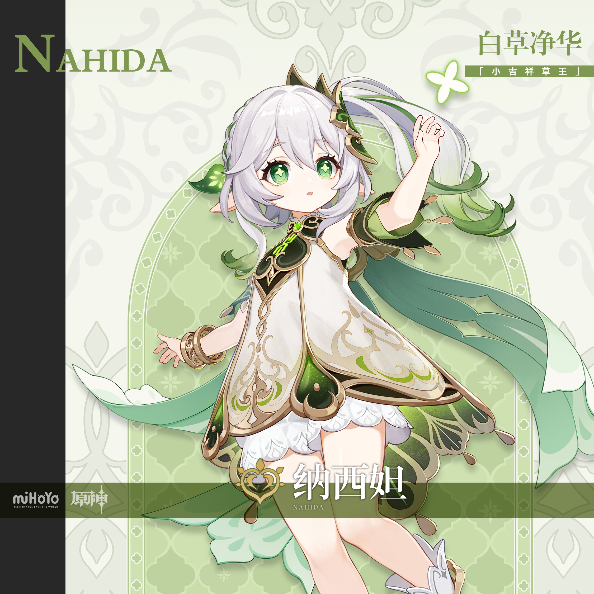
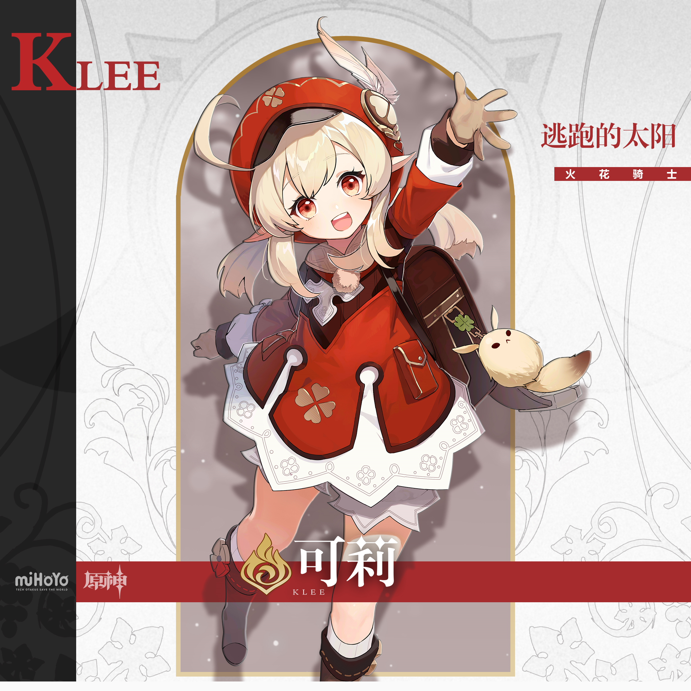
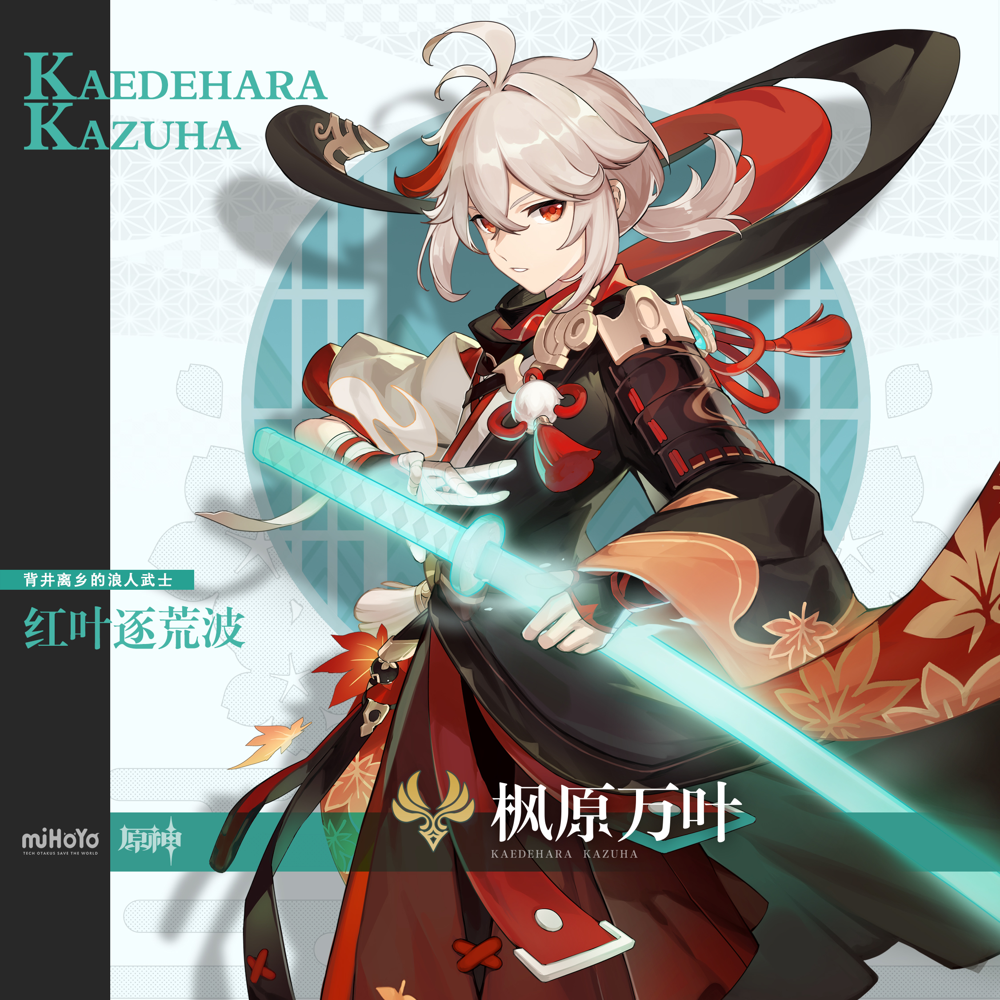
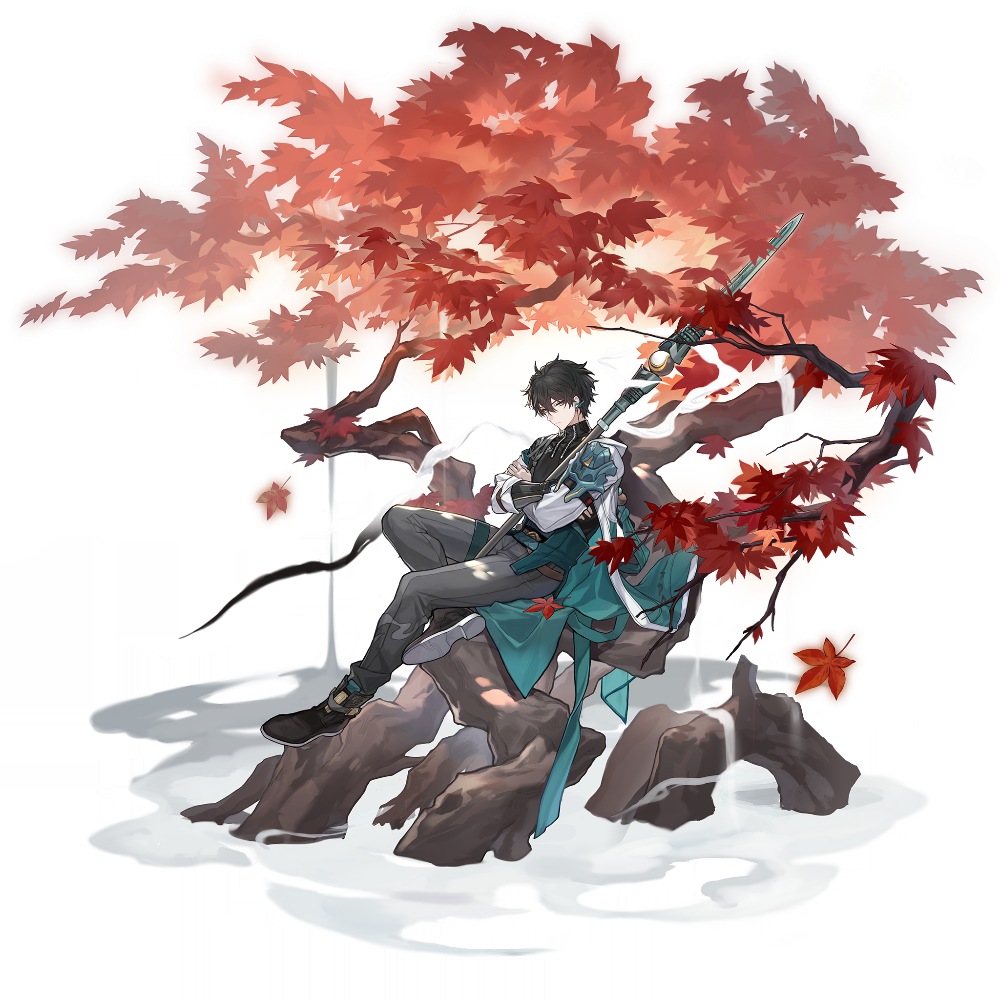
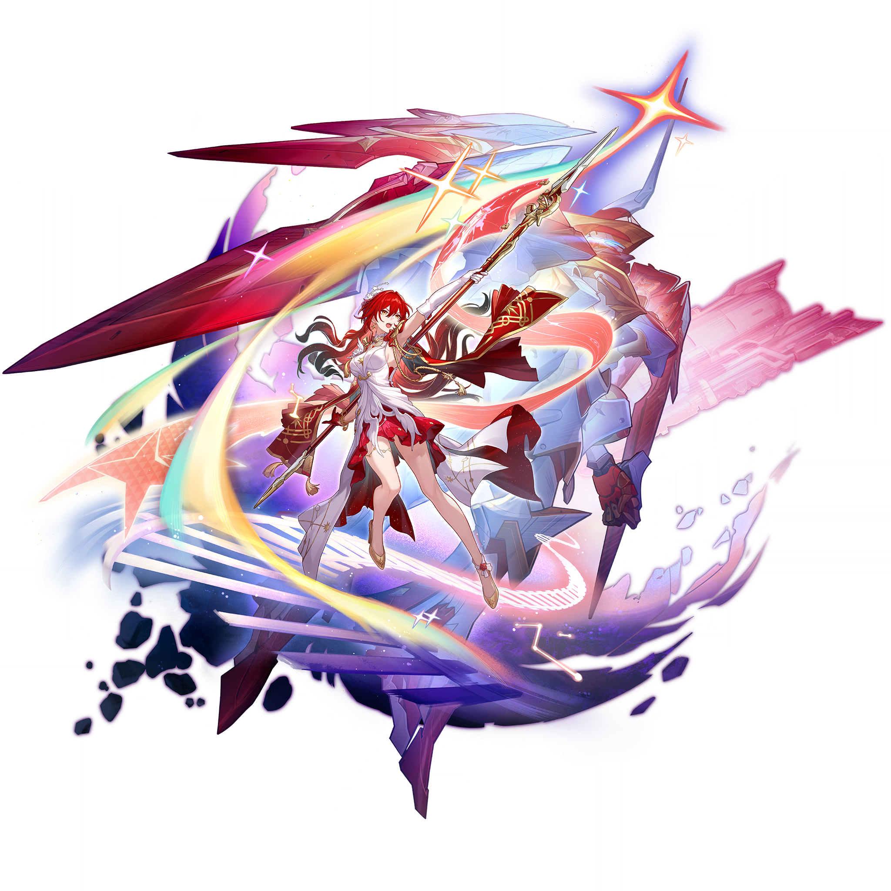
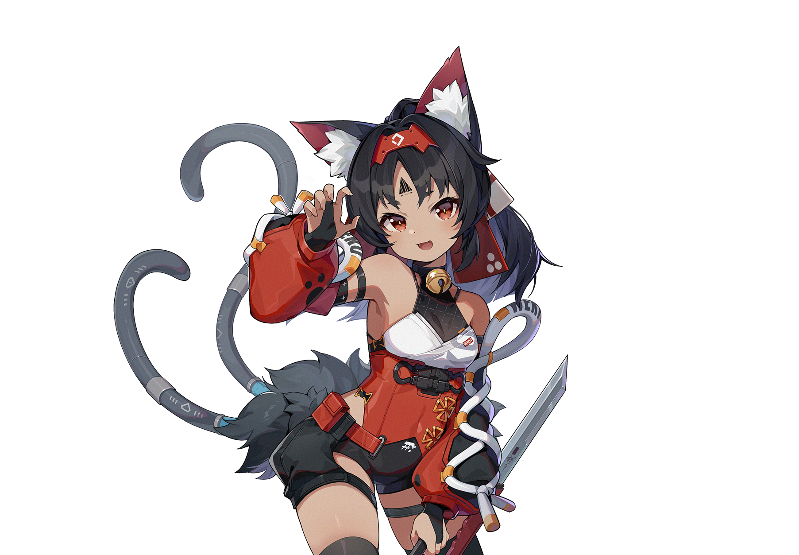
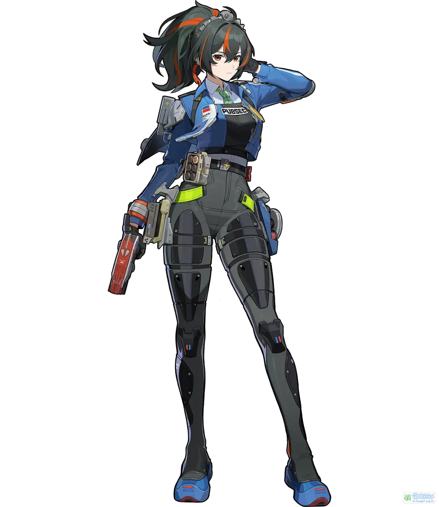

# 风物签·吉卜力风九签（圆窗统一版 v2）

> 类型：米哈游跨游戏角色吉卜力风抽签壁纸合集（三游戏各三签，共九签）。
>
> 角色不重复约束：九位角色全部避开「月谕圣牌-十二月相抽签塔罗」已用的十二人（胡桃、芙宁娜、钟离、温迪、卡芙卡、流萤、黑天鹅、三月七、星见雅、艾莲、妮可、安比）。
>
> **系列统一公式（三固定一变化）**——对标「月谕圣牌」的整套一卡逻辑，九签共用同一张构图形：
> - 固定一：整张**米白和纸底**（plain warm ivory washi paper），带极细纸纹，圆框外全部留白；
> - 固定二：画面上部居中一枚**巨大的手绘圆窗**（细墨线单圈描边），角色以半身像倚在圆框下缘——**双手平扶框沿**（九签完全相同的手部方案，规避手部翻车），**头和单肩微微跨出圆框边缘**探进纸边留白（本系列的视觉记忆点，像从窗口探出头打招呼）；
> - 固定三：纸面**四角同款墨绿细枝角饰**+底部**同一条空白米色纸签卷轴+同一枚空白朱红方印**；
> - 唯一变化：**圆内主题**——每签只有一个主题色平涂天空+一个标志物件（草、蒲公英、红枫、溪水、星轨、圆灯、猫影、花束、白鹭），圆内即该签的「签题世界」。
> 九张摆在一起就是同一张卡的九种颜色，一眼认出是同一套。
>
> 输出比例：`9:20 vertical mobile wallpaper`（现代全面屏手机比例），建议 1440 × 3200 px。
>
> 吉卜力简约风统一规则：Studio Ghibli inspired hand-painted anime style, simple clean flowing linework, soft watercolor and gouache texture, warm gentle natural light, muted palette, generous negative space, minimal detail, storybook illustration mood. 角色只求神似：保留 3–4 个核心识别锚点（发型发色、眼睛、标志性配件），服装细节大幅简化为平涂色块。
>
> 签名与签语规则：每签的**签名（嵌「窗」字四字签题）、签位（吉凶等第）与签语只保留在本 Markdown 内**；**图片内部绝对不出现任何文字**——包括签题、签语、假名、字母、数字。图片只提供空白卷轴与空白印章，文字由后期统一添加，保证九签字体完全一致；后期排版时签名+签位写卷轴，签语放卷轴上方或视频字幕/抽签页。
>
> 角色参考图：九位角色官方参考图已全部入库 `refs/`（姬子复用工作区立绘，其余八位下载自对应 B站WIKI，均经视觉校对）。角色外观锚点以下方各签校对后描述为准；构图与「无文字」约束以本文件为最高准则。

---

## 一 · 纳西妲｜一窗新绿

**签位：生签（缓缓向上的运气）**

**签语：别催自己，圆窗里的绿意自己会爬满整面纸。**

参考图：

Positive Prompt:
9:20 vertical mobile wallpaper, Studio Ghibli inspired Japanese anime style, hand-painted watercolor and gouache texture, simple clean flowing linework, generous negative space, series-consistent composition. The whole card is a plain warm ivory washi-paper background with a very subtle paper grain. Centered in the upper two thirds is one huge hand-drawn circle window with a clean thin ink outline. Inside the circle: a soft pale-green color wash sky with a few glowing dandelion-like seed puffs drifting upward and two or three tall grass blades in loose strokes — nothing else. Outside the circle the ivory margin stays empty and calm. A stylized but recognizable Nahida from Genshin Impact appears half-body, leaning on the lower rim of the circle window with both hands resting flat on the rim, her head and one shoulder crossing slightly beyond the circle's edge into the ivory margin: long white hair tied in a high side ponytail with light green gradient tips and a green four-petal hair ornament, gentle green eyes with lighter cross-shaped pupils, pointed elf ears, simple white dress with gold embroidery and dark green accents, a round white flower halo floating behind her head, curious kind expression. The four corners of the paper carry the same minimal ink-green sprig ornaments. At the bottom edge, one narrow blank cream paper scroll lies flat with a small blank vermilion square seal shape beside it — both completely empty, no characters, no letters, no marks. minimal detail, quiet fairy-tale mood, storybook illustration.

Negative Prompt:
low quality, worst quality, blurry, photorealistic, 3D render, glossy modern anime style, heavy detail, cluttered background, second circle, double frame, busy composition, dark gritty mood, full body shot, bad anatomy, extra limbs, bad hands, extra fingers, fewer fingers, missing fingers, fused fingers, webbed fingers, merged fingers, overlapping fingers, deformed fingers, six fingers, four fingers, three fingers, disfigured hands, poorly drawn hands, any text, Chinese characters, Japanese kanji, kana, English letters, numbers, caption, subtitle, logo, watermark, signature, UI, scroll with writing, printed characters, wrong hair color, missing side ponytail, missing elf ears, wrong eye color, bare feet, armor, weapon, battle, night, horror.

## 二 · 可莉｜满窗花信

**签位：大吉**

**签语：今天出门会捡到喜欢的东西——记得先笑再弯腰。**

参考图：

Positive Prompt:
9:20 vertical mobile wallpaper, Studio Ghibli inspired Japanese anime style, hand-painted watercolor and gouache texture, simple clean flowing linework, generous negative space, series-consistent composition. The whole card is a plain warm ivory washi-paper background with a very subtle paper grain. Centered in the upper two thirds is one huge hand-drawn circle window with a clean thin ink outline. Inside the circle: a soft warm-yellow color wash sky with drifting dandelion seeds in long simple strokes and one small red wildflower at the lower edge of the circle — nothing else. Outside the circle the ivory margin stays empty and calm. A stylized but recognizable Klee from Genshin Impact appears half-body, leaning on the lower rim of the circle window with both hands resting flat on the rim, her head and one shoulder crossing slightly beyond the circle's edge into the ivory margin: short blonde hair with long side locks, bright red eyes, red beret hat with a white four-leaf clover print, goggles and a white feather on it, white shirt under a red pinafore dress with white scalloped hem, her small brown backpack with a fluffy white Dodoco cat-doll charm visible at her side, wide happy smile with closed eyes. The four corners of the paper carry the same minimal ink-green sprig ornaments. At the bottom edge, one narrow blank cream paper scroll lies flat with a small blank vermilion square seal shape beside it — both completely empty, no characters, no letters, no marks. minimal detail, innocent adventure mood, storybook illustration.

Negative Prompt:
low quality, worst quality, blurry, photorealistic, 3D render, glossy modern anime style, heavy detail, cluttered background, second circle, double frame, busy composition, dark gritty mood, full body shot, explosives, bombs, fire, sparks, weapon, bad anatomy, extra limbs, bad hands, extra fingers, fewer fingers, missing fingers, fused fingers, webbed fingers, merged fingers, overlapping fingers, deformed fingers, six fingers, four fingers, three fingers, disfigured hands, poorly drawn hands, any text, Chinese characters, Japanese kanji, kana, English letters, numbers, caption, subtitle, logo, watermark, signature, UI, scroll with writing, printed characters, wrong hair color, missing red beret, missing Dodoco charm, wrong eye color, adult body, night, horror.

## 三 · 万叶｜枫过圆窗

**签位：中吉**

**签语：有些告别只是换了个方向陪你，像叶子落进窗里。**

参考图：

Positive Prompt:
9:20 vertical mobile wallpaper, Studio Ghibli inspired Japanese anime style, hand-painted watercolor and gouache texture, simple clean flowing linework, generous negative space, series-consistent composition. The whole card is a plain warm ivory washi-paper background with a very subtle paper grain. Centered in the upper two thirds is one huge hand-drawn circle window with a clean thin ink outline. Inside the circle: a soft maple-red to muted-gold color wash sky with three red maple leaves falling in long gentle strokes — nothing else. Outside the circle the ivory margin stays empty and calm. A stylized but recognizable Kaedehara Kazuha from Genshin Impact appears half-body, leaning on the lower rim of the circle window with both hands resting flat on the rim, his head and one shoulder crossing slightly beyond the circle's edge into the ivory margin: pale ash-white hair with a single red streak, short low ponytail with red gradient tips, calm red-amber eyes, a white haori draped over a dark kimono-style top with an orange-red maple-leaf printed hem, a white pom-pom tassel tied at his chest with red cords, soft unhurried smile. The four corners of the paper carry the same minimal ink-green sprig ornaments. At the bottom edge, one narrow blank cream paper scroll lies flat with a small blank vermilion square seal shape beside it — both completely empty, no characters, no letters, no marks. minimal detail, wandering poet stillness, storybook illustration.

Negative Prompt:
low quality, worst quality, blurry, photorealistic, 3D render, glossy modern anime style, heavy detail, cluttered background, second circle, double frame, busy composition, dark gritty mood, full body shot, storm, bad anatomy, extra limbs, bad hands, extra fingers, fewer fingers, missing fingers, fused fingers, webbed fingers, merged fingers, overlapping fingers, deformed fingers, six fingers, four fingers, three fingers, disfigured hands, poorly drawn hands, any text, Chinese characters, Japanese kanji, kana, English letters, numbers, caption, subtitle, logo, watermark, signature, UI, scroll with writing, printed characters, wrong hair color, dark hair, missing red hair streak, wrong eye color, blade drawn, combat pose, battle, blood, horror.

---

## 四 · 丹恒｜窗含溪色

**签位：上吉**

**签语：把心事放在水里涮一涮，捞起来就轻了一半。**

参考图：

Positive Prompt:
9:20 vertical mobile wallpaper, Studio Ghibli inspired Japanese anime style, hand-painted watercolor and gouache texture, simple clean flowing linework, generous negative space, series-consistent composition. The whole card is a plain warm ivory washi-paper background with a very subtle paper grain. Centered in the upper two thirds is one huge hand-drawn circle window with a clean thin ink outline. Inside the circle: a cool water-green color wash with simple concentric ripple rings and three smooth round pebbles at the lower edge of the circle — nothing else. Outside the circle the ivory margin stays empty and calm. A stylized but recognizable Dan Heng from Honkai: Star Rail appears half-body, leaning on the lower rim of the circle window with both hands resting flat on the rim, his head and one shoulder crossing slightly beyond the circle's edge into the ivory margin: dark blue-black hair with a teal-green streak, calm dark-red eyes, a simple white long-sleeve top with a teal sash draped over one shoulder and a dark shoulder guard, quiet unreadable expression softened by a hint of a smile. The four corners of the paper carry the same minimal ink-green sprig ornaments. At the bottom edge, one narrow blank cream paper scroll lies flat with a small blank vermilion square seal shape beside it — both completely empty, no characters, no letters, no marks. minimal detail, quiet resting-traveler mood, storybook illustration.

Negative Prompt:
low quality, worst quality, blurry, photorealistic, 3D render, glossy modern anime style, heavy detail, cluttered background, second circle, double frame, busy composition, dark gritty mood, full body shot, cluttered machinery, dragon transformation, horns, bad anatomy, extra limbs, bad hands, extra fingers, fewer fingers, missing fingers, fused fingers, webbed fingers, merged fingers, overlapping fingers, deformed fingers, six fingers, four fingers, three fingers, disfigured hands, poorly drawn hands, any text, Chinese characters, Japanese kanji, kana, English letters, numbers, caption, subtitle, logo, watermark, signature, UI, scroll with writing, printed characters, wrong hair color, missing teal hair streak, green eyes, wrong eye color, weapon drawn, combat pose, battle, blood, horror, night.

## 五 · 姬子｜星窗暖茶

**签位：上上签**

**签语：远路不怕，你兜里一直揣着让自己暖起来的办法。**

参考图：

Positive Prompt:
9:20 vertical mobile wallpaper, Studio Ghibli inspired Japanese anime style, hand-painted watercolor and gouache texture, simple clean flowing linework, generous negative space, series-consistent composition. The whole card is a plain warm ivory washi-paper background with a very subtle paper grain. Centered in the upper two thirds is one huge hand-drawn circle window with a clean thin ink outline. Inside the circle: a deep night-blue color wash with one thin golden arc of stars curving across it and a small steaming coffee cup resting on a tiny cloud ledge at the lower edge of the circle — nothing else. Outside the circle the ivory margin stays empty and calm. A stylized but recognizable Himeko from Honkai: Star Rail appears half-body, leaning on the lower rim of the circle window with both hands resting flat on the rim, her head and one shoulder crossing slightly beyond the circle's edge into the ivory margin: long dark-red hair falling over one shoulder, warm amber eyes, calm mature smile, white blouse, dark high-collared jacket with simple gold trim. The four corners of the paper carry the same minimal ink-green sprig ornaments. At the bottom edge, one narrow blank cream paper scroll lies flat with a small blank vermilion square seal shape beside it — both completely empty, no characters, no letters, no marks. minimal detail, quiet warm travel-night mood, storybook illustration.

Negative Prompt:
low quality, worst quality, blurry, photorealistic, 3D render, glossy modern anime style, heavy detail, cluttered background, second circle, double frame, busy composition, dark gritty mood, full body shot, cluttered machinery, futuristic cockpit, bad anatomy, extra limbs, bad hands, extra fingers, fewer fingers, missing fingers, fused fingers, webbed fingers, merged fingers, overlapping fingers, deformed fingers, six fingers, four fingers, three fingers, disfigured hands, poorly drawn hands, any text, Chinese characters, Japanese kanji, kana, English letters, numbers, caption, subtitle, logo, watermark, signature, UI, coffee cup with printed pattern, scroll with writing, printed characters, wrong hair color, wrong eye color, young girlish face, weapon, horror.

## 六 · 白露｜灯近窗前

**签位：大吉**

**签语：你怕黑的时候，其实早就有人把灯挂在你窗内了。**

参考图：

Positive Prompt:
9:20 vertical mobile wallpaper, Studio Ghibli inspired Japanese anime style, hand-painted watercolor and gouache texture, simple clean flowing linework, generous negative space, series-consistent composition. The whole card is a plain warm ivory washi-paper background with a very subtle paper grain. Centered in the upper two thirds is one huge hand-drawn circle window with a clean thin ink outline. Inside the circle: a deep indigo color wash night sky with sparse round stars and one single warm glowing round paper lantern hanging from the top of the circle, drawn as a simple glowing orb without any writing — nothing else. Outside the circle the ivory margin stays empty and calm. A stylized but recognizable Bailu from Honkai: Star Rail appears half-body, leaning on the lower rim of the circle window with both hands resting flat on the rim, her head and one shoulder crossing slightly beyond the circle's edge into the ivory margin: small petite figure, pale lavender-blue hair in a high ponytail with deep-blue gradient tips and small side braids, small antler-like dragon horns, bright green-teal eyes, simple white-and-aqua traditional dress with gold trim, a small dark-blue dragon tail curling beside her, wide delighted eyes and an open happy smile. The four corners of the paper carry the same minimal ink-green sprig ornaments. At the bottom edge, one narrow blank cream paper scroll lies flat with a small blank vermilion square seal shape beside it — both completely empty, no characters, no letters, no marks. minimal detail, gentle festival wonder, storybook illustration.

Negative Prompt:
low quality, worst quality, blurry, photorealistic, 3D render, glossy modern anime style, heavy detail, cluttered background, second circle, double frame, busy composition, dark gritty mood, full body shot, crowded market, lanterns with writing, paper lanterns with characters, bad anatomy, extra limbs, bad hands, extra fingers, fewer fingers, missing fingers, fused fingers, webbed fingers, merged fingers, overlapping fingers, deformed fingers, six fingers, four fingers, three fingers, disfigured hands, poorly drawn hands, any text, Chinese characters, Japanese kanji, kana, English letters, numbers, caption, subtitle, logo, watermark, signature, UI, scroll with writing, printed characters, wrong hair color, missing dragon horns, missing dragon tail, blue eyes, wrong eye color, tall adult body, horror, spooky shadows.

---

## 七 · 猫又｜窗沿猫聚

**签位：中吉**

**签语：陪人发呆是很高级的事，猫和懂你的人都知道。**

参考图：

Positive Prompt:
9:20 vertical mobile wallpaper, Studio Ghibli inspired Japanese anime style, hand-painted watercolor and gouache texture, simple clean flowing linework, generous negative space, series-consistent composition. The whole card is a plain warm ivory washi-paper background with a very subtle paper grain. Centered in the upper two thirds is one huge hand-drawn circle window with a clean thin ink outline. Inside the circle: a warm sunset-orange color wash sky with one low round sun disc and the simple silhouette of one small sitting cat on a rooftop ridge at the lower edge of the circle — nothing else. Outside the circle the ivory margin stays empty and calm. A stylized but recognizable Nekomiya Mana from Zenless Zone Zero appears half-body, leaning on the lower rim of the circle window with both hands resting flat on the rim, her head and one shoulder crossing slightly beyond the circle's edge into the ivory margin: dark bob hair with long side locks, red cat ears with white inner fur and a small red headplate, bright red-orange eyes, black choker with a gold bell, simplified white top with a red short jacket and red sleeve covers, a fluffy black cat tail with grey mechanical rings curling beside her, content smile with a small fang. The four corners of the paper carry the same minimal ink-green sprig ornaments. At the bottom edge, one narrow blank cream paper scroll lies flat with a small blank vermilion square seal shape beside it — both completely empty, no characters, no letters, no marks. minimal detail, lazy rooftop companionship mood, storybook illustration.

Negative Prompt:
low quality, worst quality, blurry, photorealistic, 3D render, glossy modern anime style, heavy detail, cluttered background, second circle, double frame, busy composition, dark gritty mood, full body shot, cluttered city, neon signs, bad anatomy, extra limbs, bad hands, extra fingers, fewer fingers, missing fingers, fused fingers, webbed fingers, merged fingers, overlapping fingers, deformed fingers, six fingers, four fingers, three fingers, disfigured hands, poorly drawn hands, any text, Chinese characters, Japanese kanji, kana, English letters, numbers, caption, subtitle, logo, watermark, signature, UI, scroll with writing, printed characters, wrong hair color, missing cat ears, missing cat tail, green eyes, wrong eye color, dog ears, weapons, daggers, combat pose, night darkness, horror.

## 八 · 可琳｜花倚窗开

**签位：上吉**

**签语：手别抖，你认真做的小事，比想象中漂亮得多。**

参考图：

Positive Prompt:
9:20 vertical mobile wallpaper, Studio Ghibli inspired Japanese anime style, hand-painted watercolor and gouache texture, simple clean flowing linework, generous negative space, series-consistent composition. The whole card is a plain warm ivory washi-paper background with a very subtle paper grain. Centered in the upper two thirds is one huge hand-drawn circle window with a clean thin ink outline. Inside the circle: a soft pink and leaf-green color wash with one simple bucket of pastel flowers at the lower edge of the circle and two petals drifting — nothing else. Outside the circle the ivory margin stays empty and calm. A stylized but recognizable Corin from Zenless Zone Zero appears half-body, leaning on the lower rim of the circle window with both hands resting flat on the rim, her head and one shoulder crossing slightly beyond the circle's edge into the ivory margin: long mint-grey-green low twin tails, violet eyes with a sleepy drowsy half-lidded expression, white plaid maid headdress, simplified dark maid dress with a white checkered apron, her giant green mechanical scissors nowhere in her hands. The four corners of the paper carry the same minimal ink-green sprig ornaments. At the bottom edge, one narrow blank cream paper scroll lies flat with a small blank vermilion square seal shape beside it — both completely empty, no characters, no letters, no marks. minimal detail, tender shy-industrious mood, storybook illustration.

Negative Prompt:
low quality, worst quality, blurry, photorealistic, 3D render, glossy modern anime style, heavy detail, cluttered background, second circle, double frame, busy composition, dark gritty mood, full body shot, cluttered shop, scissors in use, weapon attack, bad anatomy, extra limbs, bad hands, extra fingers, fewer fingers, missing fingers, fused fingers, webbed fingers, merged fingers, overlapping fingers, deformed fingers, six fingers, four fingers, three fingers, disfigured hands, poorly drawn hands, any text, Chinese characters, Japanese kanji, kana, English letters, numbers, caption, subtitle, logo, watermark, signature, UI, shop sign with writing, scroll with writing, printed characters, wrong hair color, missing twin tails, missing maid headdress, wrong eye color, horror, gloomy mood.

## 九 · 朱鸢｜鹭点晨窗

**签位：上上签**

**签语：清晨迈出的第一步，会替你把一整天铺成顺路。**

参考图：

Positive Prompt:
9:20 vertical mobile wallpaper, Studio Ghibli inspired Japanese anime style, hand-painted watercolor and gouache texture, simple clean flowing linework, generous negative space, series-consistent composition. The whole card is a plain warm ivory washi-paper background with a very subtle paper grain. Centered in the upper two thirds is one huge hand-drawn circle window with a clean thin ink outline. Inside the circle: a fresh pale-gold morning color wash over soft river-green bands with the simple silhouette of one white heron lifting off with wide wings at the lower edge of the circle — nothing else. Outside the circle the ivory margin stays empty and calm. A stylized but recognizable Zhu Yuan from Zenless Zone Zero appears half-body, leaning on the lower rim of the circle window with both hands resting flat on the rim, her head and one shoulder crossing slightly beyond the circle's edge into the ivory margin: dark green-black hair in a long high ponytail with orange streaks, red-orange eyes, refreshed smile, simplified blue-and-white uniform jacket with a white shoulder guard. The four corners of the paper carry the same minimal ink-green sprig ornaments. At the bottom edge, one narrow blank cream paper scroll lies flat with a small blank vermilion square seal shape beside it — both completely empty, no characters, no letters, no marks. minimal detail, bright dutiful-start mood, storybook illustration.

Negative Prompt:
low quality, worst quality, blurry, photorealistic, 3D render, glossy modern anime style, heavy detail, cluttered background, second circle, double frame, busy composition, dark gritty mood, full body shot, cluttered city, police car, siren, gun, weapon drawn, bad anatomy, extra limbs, bad hands, extra fingers, fewer fingers, missing fingers, fused fingers, webbed fingers, merged fingers, overlapping fingers, deformed fingers, six fingers, four fingers, three fingers, disfigured hands, poorly drawn hands, any text, Chinese characters, Japanese kanji, kana, English letters, numbers, caption, subtitle, logo, watermark, signature, UI, scroll with writing, printed characters, wrong hair color, missing high ponytail, missing orange streaks, wrong eye color, battle, arrest scene, horror.

---

## 生成与落地说明

- **系列一致性验收标准**：九签摆成一排时，应当只有三处不同——圆内的主题色、圆内的一个物件、角色本身；圆窗的位置与线宽、四角饰、底部空白卷轴与朱红小印、米白纸底必须完全一致。生成时建议先用第一签「一窗新绿」定稿，然后把其余八签全部以定稿图为构图底图（img2img 低重绘幅度，只改圆内与角色），像「月谕圣牌」一样保证九签是一张卡的九次变色。
- **视觉记忆点**：角色半身倚在圆框下缘、双手平扶框沿、头和单肩微微跨出圆框——这个「从窗口探出来」的姿势是整套系列的签名动作，九签必须保持一致；它同时把所有手部处理统一成「扶框」一个方案，是手部翻车率最低的构图。
- **图片内不出现任何文字**仍是最高约束：统一 Negative 已含 any text / Chinese characters / Japanese kanji / English letters 穷举，白露（灯笼带字）、可琳（招牌带字）另有针对性排除；若圆内星星、天空误生成字形，对圆内区域局部重绘。
- **签名与签语后期添加**：四字签名横排写在底部空白卷轴上（圆润手写体或细宋体，墨色取该签圆内主题色），签语一行小字放卷轴正上方或视频字幕/抽签页；九签字体务必统一。
- 签名/签位/签语速查：一 纳西妲「一窗新绿」生签；二 可莉「满窗花信」大吉；三 万叶「枫过圆窗」中吉；四 丹恒「窗含溪色」上吉；五 姬子「星窗暖茶」上上签；六 白露「灯近窗前」大吉；七 猫又「窗沿猫聚」中吉；八 可琳「花倚窗开」上吉；九 朱鸢「鹭点晨窗」上上签。九个签名全部嵌「窗」字，与圆窗模板互为呼应；签位分布：生签×1、中吉×2、上吉×2、大吉×2、上上签×2，可做抽签页的轻重手感。
- 角色防重复核对：对照「月谕圣牌」十二人名单逐签排除；万叶一签卡在 9/23 秋分前的初秋节点，可作发布时的季节话题点。
- 圆内主题速记（一签一物）：纳西妲=发光草絮、可莉=蒲公英与小红花、万叶=三片红枫、丹恒=溪水涟漪与卵石、姬子=星轨弧线与咖啡杯、白露=一颗圆灯、猫又=屋顶猫剪影与落日、可琳=一桶粉花、朱鸢=起飞的白鹭。九签圆内颜色连起来是「绿—黄—红—碧—蓝—靛—橙—粉—金」的彩虹环，视频文案可按此顺序串讲。
