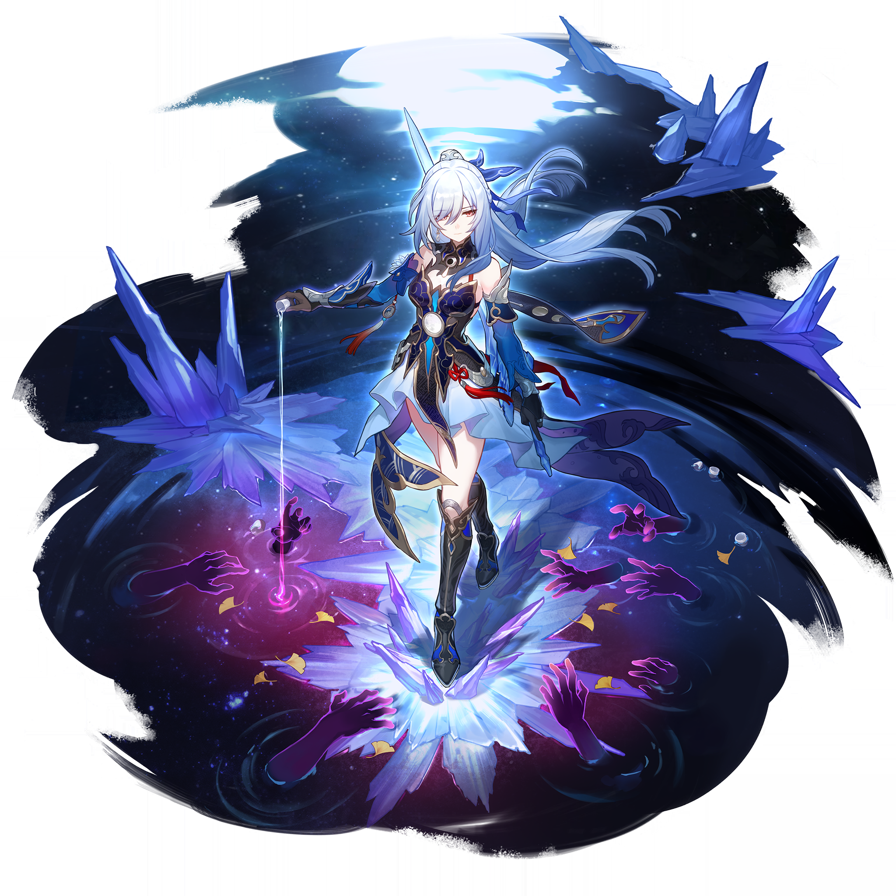

# 中秋玉兔·月宫萌化特辑 — 2026.09.25
> 视频类型：C · 可爱动物萌化形象合集
> 动物类型：兔兔（中秋玉兔特辑）
> 热点背景：①今天 9/25 正是中秋节，玉兔捣药是中秋最经典意象；②原神 7.1（9/23 上线）同步返璃月逐月节活动「银翎溯月，玄鸟结璘」，游戏内游戏外双月同辉；③崩铁 4.6「月升之前，与兽共舞」9/28 上线（星际幻宠玩法带火萌宠话题），三款游戏本周期全带「月」字议题。
> 选题依据：中秋 B 主题合集已于 9/19 完成（月升之前·中秋月夜，9 人），今日正日改做萌化向调节节奏；兔兔形象此前未做过（猫猫 3 批次 + 海岛小鸟已用，18 位角色不重复）；选角避开已萌化角色，三游戏各取 2 位人气角色。
> 选角（6 位，均已用视觉工具校对官方立绘）：
> - 原神：甘雨（麒麟→玉兔，月海亭秘书，中秋契合度天花板）、胡桃（月亮出来咯咱也出来了，捣蛋墨兔）
> - 崩铁：三月七（粉白兔+铃铛项圈+相机）、镜流（罗浮剑首→霜月剑兔）
> - 绝区零：维琳娜（外务部优雅长官→月宫贵妇兔）、艾莲（鲨鱼妹→兔鲨混血，保留鲨鱼尾玩梗）
> 统一视觉母题：一轮巨大明月悬于每只兔兔身后，冷银月色为主基调，各角色主题色点缀；场景元素在明月、桂树、云海、月饼、捣药臼中选取；毛色=角色主发色，保留标志性头饰/瞳色/配饰，移除人类服装。
> 外观资料来源：甘雨/胡桃为本次经 B站WIKI MediaWiki API 下载并逐张视觉校对的官方立绘（ref-ganyu-splash.png / ref-hutao-splash.png）；三月七/镜流/维琳娜/艾莲沿用工作区已校对立绘（引用路径见各节）。

---

## 1（甘雨·月宫玉兔秘书）

Prompt 要点：
- 画面比例：16:9 2K wallpaper
- 兔品种：蓝白长毛垂耳兔（毛色=浅蓝渐变深蓝紫发色），头顶保留标志性的深红黑色麒麟弯角与呆毛卷
- 保留：紫粉色圆眼、脖子上的深色项圈与金色铃铛、腰间红色绳结与流苏挂饰缩小版
- 可添加：前爪捧一只小小的白瓷捣药臼，旁边放一块印花月饼
- 背景：璃月山巅明月夜，巨大满月悬于身后，桂树枝斜出，云海翻涌，冷银蓝月色

Positive Prompt:
16:9 2K wallpaper, highly detailed anime-style illustration, a cute fluffy rabbit version of Ganyu from Genshin Impact celebrating the Mid-Autumn Festival. A small chibi-proportioned long-haired lop rabbit with soft pale-blue fur fading to deep blue-violet at the ear tips and tail, a single curly ahoge tuft of fur standing on top of her head, and her iconic two dark crimson-black qilin horns curving back from her forehead — clearly recognizable as Ganyu. Large round violet-pink eyes with a gentle, slightly sleepy expression, tiny pink nose. She wears her signature dark collar with a large golden bell around her neck. She sits upright on a mossy mountain ledge, paws neatly placed, both forepaws holding a small white porcelain moon-medicine mortar, a tiny mooncake with an osmanthus pattern placed beside her. Simple clean background, not overly complex: a giant luminous full moon rising directly behind her, an osmanthus branch with tiny golden blossoms leaning into the frame, drifting sea of clouds below, faint ice-crystal sparkles floating in the air, cool silver-blue moonlight palette with soft red-gold accents echoing her canonical colors. Cute, serene, festival atmosphere, soft moonlit rim lighting, sharp focus on the rabbit.

Negative Prompt:
low quality, worst quality, blurry, pixelated, bad anatomy, extra limbs, extra ears, third ear, deformed face, bad hands, extra fingers, fused fingers, twisted legs, rotated hips, dislocated hip, extra legs, malformed knees, elongated calves, deformed feet, wrong fur color, wrong eye color, human body, human skin, human clothes, human hair, bikini, swimsuit, text, watermark, logo, signature, photorealistic, 3D render, scary, dark horror, cluttered background, complex buildings, daylight, bright sun.

## 2（胡桃·捣蛋墨兔堂主）

参考第 1 张甘雨玉兔图的整体画风、月夜氛围与兔兔造型规则，为胡桃生成同系列的玉兔形象。

Prompt 要点：
- 画面比例：16:9 2K wallpaper
- 兔品种：黑色小獭兔（毛色=棕黑渐变红发色，耳尖泛红棕），个头比甘雨兔更小、更闹腾
- 保留：标志性的黑色小礼帽（金符牌+红梅花+蓝流苏，原样缩小戴在双耳之间）、红橙色梅花纹圆眼、小虎牙、爪上的小红手环
- 可添加：一只幽蝶火蝴蝶停在耳朵上，身边散落两块融了半边的流心月饼
- 背景：往生堂屋檐月夜，巨大满月+桂树影，暖火光点缀冷银月色

Positive Prompt:
Referring to the previous rabbit illustration's style, palette discipline and moonlit-night atmosphere, generate a matching Mid-Autumn rabbit image for Hu Tao from Genshin Impact: a small, mischievous black rex rabbit with sleek dark maroon-black fur and warm red-brown gradient tips on her ears and tail, wearing her unmistakable black porkpie hat shrunk to rabbit size, decorated with a golden talisman plate, red plum blossoms and a blue tassel, perched between her two upright ears. Large round red-orange eyes with plum-blossom pupils, one tiny fang peeking from a cheeky grin, a small red bracelet on one front paw. She is caught mid-pounce on a rooftop ridge, one ear flopped back, having just stolen a half-eaten lava mooncake; a small glowing crimson ghost-butterfly flutters above her ear, another mooncake lying abandoned beside her. Simple clean background: a giant full moon behind the curved eaves of the Wangsheng Funeral Parlor roof, an osmanthus branch silhouette, drifting petals, cool silver-blue moonlight mixed with playful warm ember accents. Cute, mischievous, festival-night atmosphere, same anime illustration style as the reference, sharp focus on the rabbit.

Negative Prompt:
low quality, worst quality, blurry, pixelated, bad anatomy, extra limbs, extra ears, third ear, deformed face, bad hands, extra fingers, fused fingers, twisted legs, rotated hips, dislocated hip, extra legs, malformed knees, elongated calves, deformed feet, wrong fur color, wrong eye color, missing hat, human body, human skin, human clothes, human hair, text, watermark, logo, signature, photorealistic, 3D render, horror, gore, scary ghost, cluttered background, daylight, bright sun.

## 3（三月七·快门粉兔）

参考第 1 张图的系列画风，为三月七生成同系列玉兔形象。

Prompt 要点：
- 画面比例：16:9 2K wallpaper
- 兔品种：粉白相间的荷兰垂耳兔（毛色=粉白短发色+发梢渐白），脸颊圆乎乎
- 保留：蓝紫渐变圆眼、头侧的两枚蓝色花朵发卡移到耳根、脖子上她标志性的深色项圈金色小铃铛（立绘确认佩戴）
- 可添加：一台青色小相机挂在脖子上，正单眼闭起摆自拍姿势
- 背景：星穹列车车窗边的月夜，窗外巨大满月与星轨，窗台放一块兔子造型的月饼

Positive Prompt:
Referring to the first rabbit illustration's style, generate a matching Mid-Autumn rabbit image for March 7th from Honkai: Star Rail: a small fluffy Holland lop rabbit with soft cream-pink fur and pale snow-white tips on her floppy ears and round tail, two blue flower hairpins clipped at the base of one ear, large round blue-violet eyes sparkling with excitement, one eye playfully winking for a selfie. She keeps her signature dark choker with a tiny golden bell around her neck, and a small teal instant camera hangs from a strap in front of her chest. She sits on the windowsill of the Astral Express at night, one front paw raised in a peace-sign selfie pose, a rabbit-shaped mooncake with pink glaze sitting on the sill beside her. Simple clean background: through the large train window behind her, a giant luminous full moon and streaking star trails cross the night sky, warm cabin light mixing with cold silver moonlight, soft pink and blue palette echoing her colors. Cute, cheerful, cozy travel-night atmosphere, same anime illustration style as the reference, sharp focus on the rabbit.

Negative Prompt:
low quality, worst quality, blurry, pixelated, bad anatomy, extra limbs, extra ears, third ear, deformed face, bad hands, extra fingers, fused fingers, twisted legs, rotated hips, dislocated hip, extra legs, malformed knees, elongated calves, deformed feet, wrong fur color, wrong eye color, missing choker, human body, human skin, human clothes, human hair, text, watermark, logo, signature, photorealistic, 3D render, cluttered background, daylight, bright sun, dark horror.

## 4（镜流·霜月剑兔）

参考第 1 张图的系列画风，为镜流生成同系列玉兔形象。

Prompt 要点：
- 画面比例：16:9 2K wallpaper
- 兔品种：银白色长毛狮子兔（毛色=银白长发色，颈毛蓬如霜雪）
- 保留：红色圆瞳（刘海状长毛遮住一只眼）、高马尾改为一束蓝色缎带系在耳后
- 可添加：一柄缩小版带裂纹的古剑斜插在身旁冰晶间，红色剑穗垂落
- 背景：寒冰水镜月夜，巨大满月倒映在结霜的水面，紫色冰棱环立，金色银杏叶零星飘落

Positive Prompt:
Referring to the first rabbit illustration's style, generate a matching Mid-Autumn rabbit image for Jingliu from Honkai: Star Rail: an elegant long-maned lionhead rabbit with frost-silver white fur, the thick mane around her neck like piled snow, a high ponytail of fur bound with her signature blue ribbon at the base of one ear, long bangs of fur covering one eye while her visible round crimson eye gazes calmly ahead — cool, aloof, quietly majestic. A tiny cracked ancient Chinese sword is planted in the ice beside her, its red tassel drifting in the cold wind. She sits still on a frozen mirror-like water surface, one front paw resting on a small mooncake as if it were an offering. Simple clean background: a giant full moon reflected perfectly on the frosted water, a few violet ice crystals rising around her, golden ginkgo leaves drifting through the silver-blue moonlight, restrained cold palette with red and gold accents. Cute yet serene and slightly lonely, same anime illustration style as the reference, sharp focus on the rabbit.

Negative Prompt:
low quality, worst quality, blurry, pixelated, bad anatomy, extra limbs, extra ears, third ear, deformed face, bad hands, extra fingers, fused fingers, twisted legs, rotated hips, dislocated hip, extra legs, malformed knees, elongated calves, deformed feet, wrong fur color, wrong eye color, human body, human skin, human clothes, human hair, text, watermark, logo, signature, photorealistic, 3D render, battle, fighting, blood, gore, purple hands, monsters, cluttered background, daylight, bright sun.

## 5（维琳娜·月宫贵妇兔）

参考第 1 张图的系列画风，为维琳娜生成同系列玉兔形象。

Prompt 要点：
- 画面比例：16:9 2K wallpaper
- 兔品种：月白色安哥拉长毛兔（毛色=银白泛淡蓝光的长发色），体态优雅端庄
- 保留：紫蓝色圆眼（一只眼微眨的优雅感）、头上白色蕾丝女仆风头饰（原样缩小）、金贝壳耳环挂耳侧
- 可添加：一只前爪轻摇一把小巧的折扇，身前摆着一盏月白色兔子灯
- 背景：罗斯凯利法外务部露台月夜，巨大满月+贝壳与纸鹤纹样的银蓝纹样点缀

Positive Prompt:
Referring to the first rabbit illustration's style, generate a matching Mid-Autumn rabbit image for Velina from Zenless Zone Zero: a graceful angora rabbit with flowing moonlit silver-white fur tinted with pale blue-grey, long elegant ears, wearing her unmistakable white frilled maid-style headdress shrunk to fit between her ears, golden shell earrings dangling at the base of one ear. Large round violet-blue eyes with one eye winking in a poised, knowing way, an unhurried gentle smile. One front paw elegantly holds a small folding fan half-open, the other rests lightly on a glowing white rabbit-shaped paper lantern before her. She sits with perfect posture on a moonlit terrace railing. Simple clean background: a giant luminous full moon behind her, faint silver-blue patterns of seashells and paper cranes drifting in the air like workshop motifs, soft drifting feathers, cool silver palette with gold accents echoing her colors. Cute, refined, noble-lady atmosphere, same anime illustration style as the reference, sharp focus on the rabbit.

Negative Prompt:
low quality, worst quality, blurry, pixelated, bad anatomy, extra limbs, extra ears, third ear, deformed face, bad hands, extra fingers, fused fingers, twisted legs, rotated hips, dislocated hip, extra legs, malformed knees, elongated calves, deformed feet, wrong fur color, wrong eye color, missing headdress, human body, human skin, human clothes, human hair, text, watermark, logo, signature, photorealistic, 3D render, cluttered background, daylight, bright sun, dark horror.

## 6（艾莲·兔鲨混血）

参考第 1 张图的系列画风，为艾莲生成同系列玉兔形象。

Prompt 要点：
- 画面比例：16:9 2K wallpaper
- 兔品种：黑色雷克斯兔（毛色=黑发色+红色内层挑染→耳内侧红），玩法核心梗：**兔耳兔身但保留鲨鱼尾**，「鲨鲨变兔兔尾巴不换」
- 保留：红色圆眼、眼下泪痣、白色女仆发箍、嘴叼棒棒糖、睡眼惺忪节能表情
- 可添加：尾巴上贴纸与涂鸦元素保留（小贴纸），尾巴卷在身边；身侧放一块咬了一口的冰皮月饼
- 背景：维多利亚家政天台月夜，巨大满月，晾着的白色桌布在夜风里轻扬

Positive Prompt:
Referring to the first rabbit illustration's style, generate a matching Mid-Autumn rabbit image for Ellen Joe from Zenless Zone Zero: a small black rex rabbit with short plush dark-grey-black fur and striking crimson-red coloring inside her long upright ears, round red eyes half-lidded with a sleepy, low-energy expression, a tiny teardrop mole under one eye, and a small sharp tooth peeking as she lazily chews a lollipop. She keeps her white frilled maid headband between her ears. Her most iconic feature stays: a large grey-purple shark tail with a fin, covered in tiny stickers, curled around her body — a rabbit-shark hybrid, clearly recognizable as Ellen Joe. Beside her lies a half-bitten snow-skin mooncake. She sprawls comfortably on a rooftop terrace of a Victorian mansion at night. Simple clean background: a giant full moon low in the sky, a white tablecloth fluttering gently on a clothesline in the night breeze, faint silver mist, cool grey-blue moonlit palette with crimson and white accents. Cute, sleepy, effortlessly cool atmosphere, same anime illustration style as the reference, sharp focus on the rabbit.

Negative Prompt:
low quality, worst quality, blurry, pixelated, bad anatomy, extra limbs, extra ears, third ear, deformed face, bad hands, extra fingers, fused fingers, twisted legs, rotated hips, dislocated hip, extra legs, malformed knees, elongated calves, deformed feet, missing shark tail, wrong fur color, wrong eye color, human body, human skin, human clothes, human hair, text, watermark, logo, signature, photorealistic, 3D render, scary, horror, blood, cluttered background, daylight, bright sun.

## 注

- 选角理由：中秋正日（9/25）+ 原神逐月节活动进行中 + 崩铁 4.6「月升之前」蓄势，三游戏共享「月」议题；兔兔为本频道萌化系列首个兔形象（此前猫猫 3 批 + 小鸟），新鲜感与节日契合双高。
- 梗埋点：①甘雨=椰羊（官方玩梗「椰奶在作祟」），麒麟变玉兔自带话题；②艾莲=鲨鱼妹/圆鲨鲨，「就算你盯着看，尾巴也是不会给你摸的」→ 兔鲨混血保留尾巴即玩梗；③胡桃「太阳出来我晒太阳~月亮出来我晒月亮咯~」与中秋完美对口；④三月七立绘自带金色铃铛项圈，玉兔铃铛零违和。
- 形象一致性：6 条均引用第 1 张甘雨兔作为系列风格参考（文案中已写明），保证成套感。
- 比例：全部 16:9 2K wallpaper，无混用。
