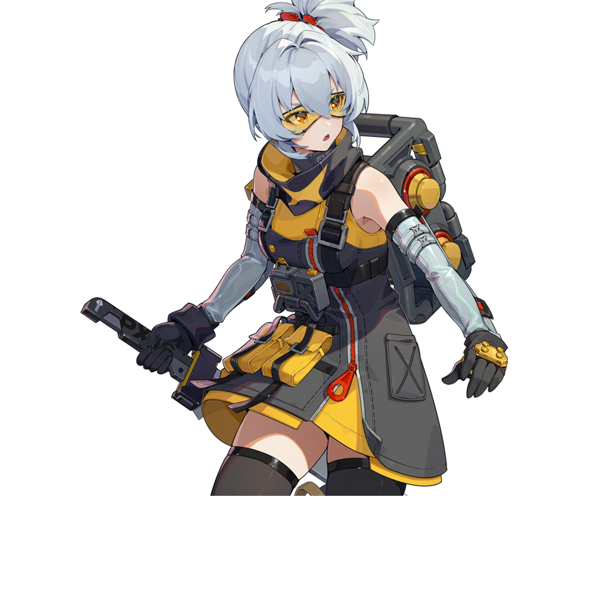
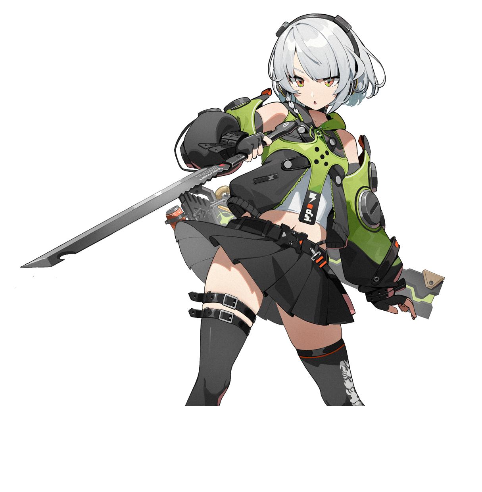

# 绝区零萌宠·猫咪形象系列（第三批·3.2上线预热篇）

> 视频类型：C · 可爱动物萌化形象合集
> 统一动物：精致 Q 版二次元猫猫，16:9 2K wallpaper
> 热点背景：绝区零 3.2 版本「她与她的隐秘往事」将于 2026 年 9 月 9 日（明日）上线，四大 UP 角色齐亮相：克拉蕾（上半新角色·首位锋御）、南宫羽（上半复刻）、洛克茜（下半新角色·棺材商管家）、普罗米娅（下半复刻）；本期猫猫第三批将四大 UP 角色全部猫猫化，凑齐「3.2 全卡池猫猫图鉴」，搭配高人气老角色为版本上线前夜预热。
> 选角逻辑：第三批继续聚焦绝区零，避开第一批（宵宫、伊涅芙、桑多涅、可莉、芙宁娜、刻晴）与第二批（妮可、朱鸢、青衣、星见雅、耀嘉音、仪玄）已做角色，也不重复工作区已做猫猫的角色（艾莲猫猫化此前已有产出，本期不再收录）。选定克拉蕾、洛克茜（3.2 双新角色）、南宫羽、普罗米娅（3.2 上/下半复刻，四位正好凑齐「3.2 四大 UP 角色猫猫全图鉴」）、11号（银白军猫）、安比（呆萌耳机猫）、简·杜（本身就是圆耳兽人，“猫希人变真猫”社区梗），毛色、瞳色、职业道具与环境配色差异明显，组成统一而有辨识度的猫猫合集。
> 参考图校对：全部 7 张官方立绘（`ref-*.png`，普罗米娅首张影画 Banner 为紫色剪影海报已弃用，换用正式角色立绘）已用视觉工具逐张确认发色/瞳色/标志配饰/气质后动笔。

## 1 — 克拉蕾·傲娇大小姐金渐层猫

（角色官方立绘·外观校对基准）

Positive Prompt:

16:9 2K wallpaper, a cute chibi anime cat version of Claret Flint from Zenless Zone Zero, polished character-design sheet aesthetic, clean line art, soft cel shading, simple decorative frame, no human body, full cat anatomy only. A fluffy golden British Longhair cat with champagne-gold fur, deep crimson-red inner-ear tufts and tail-tip fading to pale lilac, vivid ruby-red eyes, a tiny visible fang poking from a proud pouting expression, and two high twin fluffy tail-tufts echoing her signature twintails. A small white bone-shaped hairpin is pinned above one ear, and she wears only a slim black gothic collar with a tiny crimson bat-wing charm — never human clothes. The cat sits upright with a haughty, tsundere posture on a polished dark anvil-shaped pedestal, chin raised, one front paw resting on a stack of two pastel macarons, tail flicking away in mock indifference, perfect cat paws, four toes visible on each front paw, clean toe separation, natural paw pose.

Background: a simple dark forge-workshop corner in charcoal and crimson tones, subtle glowing molten-metal sparkles and abstract bat-wing silhouettes, a faint golden hammer emblem without readable text, uncluttered wallpaper composition. Warm forge-light from the left with crimson rim light, glossy highlights in the eyes, haughty-but-adorable mood.

Negative Prompt:

low quality, worst quality, blurry, pixelated, bad animal anatomy, malformed cat, human body, human hands, human hair, humanoid cat, extra limbs, extra legs, missing legs, extra paws, missing paws, fused paws, webbed paws, merged toes, overlapping toes, deformed paws, mutated paws, more than four toes, less than four toes, blurry paws, indistinct toes, distorted face, incorrect fur color, incorrect eye color, wrong character, clothing, dress, corset, text, watermark, logo, signature.

## 2 — 洛克茜·冷淡管家青绿猫

（角色官方立绘·外观校对基准）

Referring to the attached first cat image for series style, generate a similar chibi anime cat wallpaper for Roxy Ifritta Price from Zenless Zone Zero, clean line art, soft cel shading, simple decorative frame, full cat anatomy only. A sleek short-haired cat with muted teal-green fur, darker slate tabby markings, pale pink ear tips, and calm deep-rose eyes seen through oversized round black-framed glasses perched on its muzzle — the glasses are the signature accessory and must stay. A thin black headband-like marking crosses between the ears, and she wears only a dark harness-style collar with a tiny spike accent, never human clothes. Her expression is a deadpan poker face, slightly sleepy and unimpressed. The cat sits beside a miniature coffin-shaped pet bed propped open like a display casket, one paw on the lid, with a tiny glowing pink lantern hanging from the collar, four toes visible on each front paw, clean toe separation, natural relaxed pose.

Background: a minimal dark workshop interior in charcoal gray with muted crimson drape silhouettes and one soft pink lantern glow, no readable text, plenty of negative space. Cool ambient light with a single warm pink accent, quiet deadpan-service mood.

Negative Prompt:

low quality, worst quality, blurry, pixelated, bad animal anatomy, malformed cat, human body, human hands, human hair, humanoid cat, extra limbs, extra legs, missing legs, extra paws, missing paws, fused paws, webbed paws, merged toes, overlapping toes, deformed paws, mutated paws, more than four toes, less than four toes, blurry paws, indistinct toes, distorted face, incorrect fur color, incorrect eye color, wrong character, clothing, human outfit, text, watermark, logo, signature.

## 3 — 南宫羽·妄想天使黑白猫

（角色官方立绘·外观校对基准）

Referring to the attached first cat image for series style, generate a similar chibi anime cat wallpaper for Nangong Yu from Zenless Zone Zero, clean line art, soft cel shading, simple decorative frame, full cat anatomy only. A fluffy black-and-white cat with jet-black fur, a white chest and ruff, twin fluffy tail-tips fading from black to soft pink like her twintail gradient, bright crimson-red eyes, and a sweet closed-eye smile with a tiny open mouth — her idol-sweet performance face. A small mint-green ring-shaped halo floats above her head as the signature accessory, and she wears only a white collar with a mint-green bow and a tiny blank white cat-mask charm hanging from it, never human clothes. Beside her sits her companion reimagined as a small spiky black ball toy with pale green glints. The cat strikes a playful idol pose with one front paw raised in a finger-point gesture, perfect cat paws, four toes visible on each front paw, clean toe separation, natural pose.

Background: a minimal fantasy-stage corner in black, white and pink, soft mint-green ribbon silhouettes and abstract polka-dot balloons without readable text, uncluttered wallpaper composition. Bright stage spotlight from above with pink and mint accents, sweet delusion-idol mood.

Negative Prompt:

low quality, worst quality, blurry, pixelated, bad animal anatomy, malformed cat, human body, human hands, human hair, humanoid cat, extra limbs, extra legs, missing legs, extra paws, missing paws, fused paws, webbed paws, merged toes, overlapping toes, deformed paws, mutated paws, more than four toes, less than four toes, blurry paws, indistinct toes, distorted face, incorrect fur color, incorrect eye color, wrong character, clothing, dress, frilled dress, text, watermark, logo, signature.

## 4 — 普罗米娅·蓝紫骑士长毛猫

（角色官方立绘·外观校对基准）

Referring to the attached first cat image for series style, generate a similar chibi anime cat wallpaper for Promya from Zenless Zone Zero, clean line art, soft cel shading, simple decorative frame, full cat anatomy only. An elegant longhaired cat with deep blue-violet fur, pale silver-lilac chest and inner-ear tufts, calm violet eyes glancing back over one shoulder in a graceful over-the-shoulder pose — her signature composed retrospection. Her exceptionally long flowing tail is bound with small white ring markings at intervals, echoing her segmented braid, and the tail trails elegantly around her like a ribbon. A slim silver collar with a round heraldic medallion, never human clothes. The cat sits in a poised, knightly posture on a stone plinth, back slightly turned with head glancing back, tail draped in a noble curve, four toes visible on each front paw, clean toe separation, natural regal pose.

Background: a minimal twilight knight-hall corner in deep indigo and silver, abstract banner silhouettes and faint starlight through a blurred arched window, no readable text, uncluttered composition. Cool moonlit key light with a silver rim light, quiet noble-guardian mood.

Negative Prompt:

low quality, worst quality, blurry, pixelated, bad animal anatomy, malformed cat, human body, human hands, human hair, humanoid cat, extra limbs, extra legs, missing legs, extra paws, missing paws, fused paws, webbed paws, merged toes, overlapping toes, deformed paws, mutated paws, more than four toes, less than four toes, blurry paws, indistinct toes, distorted face, incorrect fur color, incorrect eye color, wrong character, clothing, cloak, coat, armor, text, watermark, logo, signature.

## 5 — 11号·战场银白军猫

（角色官方立绘·外观校对基准）

Referring to the attached first cat image for series style, generate a similar chibi anime cat wallpaper for Soldier 11 from Zenless Zone Zero, clean line art, soft cel shading, simple decorative frame, full cat anatomy only. An athletic silver-white shorthair cat with pale gray tabby stripes, a messy high tuft of fur standing up between the ears like her ponytail, sharp golden-amber eyes, and a serious disciplined expression. A pair of yellow tactical goggles is pushed up onto her forehead fur — the signature accessory — and she wears only a dark tactical harness collar with a tiny gold buckle, never human clothes. The cat sits at attention in a perfectly straight military posture on a supply crate, chest out, front paws aligned side by side, tail wrapped neatly around them, four toes visible on each front paw, clean toe separation, natural precise pose.

Background: a minimal training-ground corner at dusk in warm amber and gunmetal gray, abstract target-ring shapes and a few floating embers without legible symbols, uncluttered wallpaper composition. Low orange sun light from the side with cool shadow, earnest soldier-on-duty mood.

Negative Prompt:

low quality, worst quality, blurry, pixelated, bad animal anatomy, malformed cat, human body, human hands, human hair, humanoid cat, extra limbs, extra legs, missing legs, extra paws, missing paws, fused paws, webbed paws, merged toes, overlapping toes, deformed paws, mutated paws, more than four toes, less than four toes, blurry paws, indistinct toes, distorted face, incorrect fur color, incorrect eye color, wrong character, clothing, military uniform, armor, weapon in paws, text, watermark, logo, signature.

## 6 — 安比·影迷耳机猫

（角色官方立绘·外观校对基准）

Referring to the attached first cat image for series style, generate a similar chibi anime cat wallpaper for Anby Demara from Zenless Zone Zero, clean line art, soft cel shading, simple decorative frame, full cat anatomy only. A round-faced silver-gray shorthair cat with pale ice-blue sheen on the fur tips, a single thin braided strand of fur beside one cheek, wide olive-green eyes, and a slightly open-mouthed dazed "still processing" expression — her signature deadpan blankness. A chunky black headphone rests over her ears as the signature accessory, and she wears only a slim charcoal collar with a tiny green lightning-bolt tag, never human clothes. The cat sits with a small head-tilt in front of a tiny retro TV showing only static light, one paw raised mid-air as if pausing a movie, four toes visible on each front paw, clean toe separation, natural pose.

Background: a minimal video-rental corner at night in cool blue-gray with a soft green screen glow, a few abstract film-strip silhouettes without readable titles, uncluttered composition. Cool ambient light with one warm popcorn-yellow accent, zoned-in-on-the-movie mood.

Negative Prompt:

low quality, worst quality, blurry, pixelated, bad animal anatomy, malformed cat, human body, human hands, human hair, humanoid cat, extra limbs, extra legs, missing legs, extra paws, missing paws, fused paws, webbed paws, merged toes, overlapping toes, deformed paws, mutated paws, more than four toes, less than four toes, blurry paws, indistinct toes, distorted face, incorrect fur color, incorrect eye color, wrong character, clothing, jacket, human outfit, text, watermark, logo, signature.

## 7 — 简·杜·犯罪行为学专家真·猫

（角色官方立绘·外观校对基准）

Referring to the attached first cat image for series style, generate a similar chibi anime cat wallpaper for Jane Doe from Zenless Zone Zero, clean line art, soft cel shading, simple decorative frame, full cat anatomy only. A poised slate blue-gray cat with dark navy rosette tabby markings and subtle teal sheen, luminous teal-green eyes with a sly upward glance, and a confident toothy smirk showing one small fang — the signature knowing smile. Her round gray ears already match her thiren design, so they stay natural; the distinguishing details are glossy dark-red claw tips on each toe like her painted nails, and a small silver ring earring on one ear. She wears only a sage-gray utility collar with a tiny metal badge, never human clothes. The cat reclines sideways in an elegant investigative sprawl across an open case file folder, tail curled like a question mark, one paw flipping a paper-clipped photo, red claw tips clearly visible, four toes on each front paw, clean toe separation, natural flexible pose.

Background: a minimal investigation-office corner in cool slate and teal, blurred evidence-board silhouettes with abstract string lines but no readable text, uncluttered wallpaper composition. Cool noir lighting with a warm desk-lamp accent, clever-cat-about-to-solve-the-case mood.

Negative Prompt:

low quality, worst quality, blurry, pixelated, bad animal anatomy, malformed cat, human body, human hands, human hair, humanoid cat, extra limbs, extra legs, missing legs, extra paws, missing paws, fused paws, webbed paws, merged toes, overlapping toes, deformed paws, mutated paws, more than four toes, less than four toes, blurry paws, indistinct toes, distorted face, incorrect fur color, incorrect eye color, wrong character, clothing, police uniform, jacket, text, watermark, logo, signature.

## 注

- 系列一致性：第 2~7 条均以第 1 条生成图作为风格参考，配色、线稿、装饰框、构图密度保持统一；若第 1 条生成效果理想，后续角色的参考图可直接替换为第 1 条的成图。
- 品种与梗对应：克拉蕾→金渐层（傲娇大小姐+甜品两份梗，马卡龙×2）、洛克茜→青绿冷调短毛猫（棺材商+灯笼）、南宫羽→黑白猫（妄想天使光环+猫面具挂坠+黑色刺球伙伴）、普罗米娅→蓝紫长毛猫（分节白色环扣长尾 echo 辫子+骑士回眸）、11号→银白军猫（护目镜推额）、安比→耳机呆猫（影迷属性）、简·杜→灰蓝虎斑猫（红指甲梗→红爪尖，社区“简姐”气场）。
- 毛色/瞳色/标志配饰均对照官方立绘校对：克拉蕾金发红挑染红瞳骨饰、洛克茜青绿发黑框眼镜粉耳尖、南宫羽黑发粉渐变红瞳天使光环白面具、普罗米娅蓝紫发分节环扣长辫紫瞳银徽章、11号银白发金瞳黄护目镜、安比银白发绿瞳黑耳机、简·杜蓝黑发青绿瞳灰圆耳红指甲。
