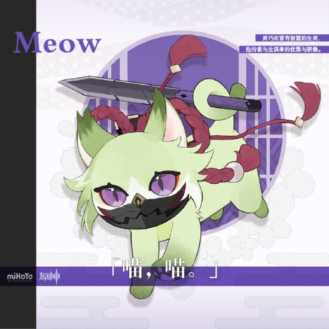
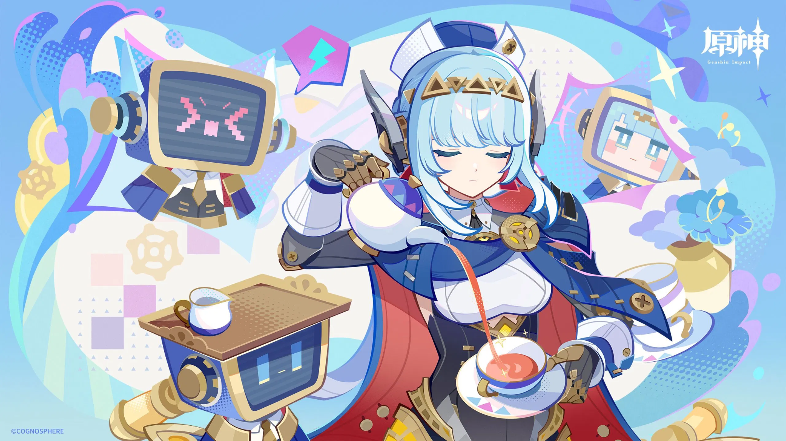
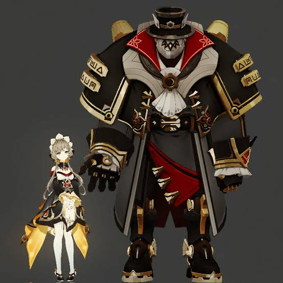
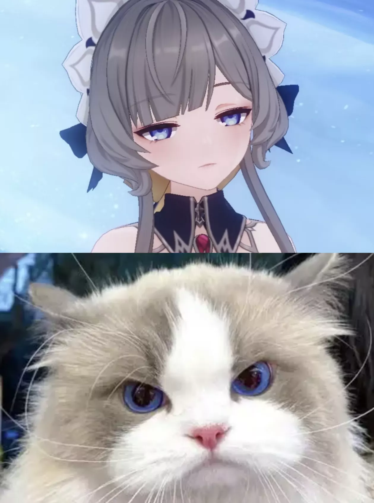
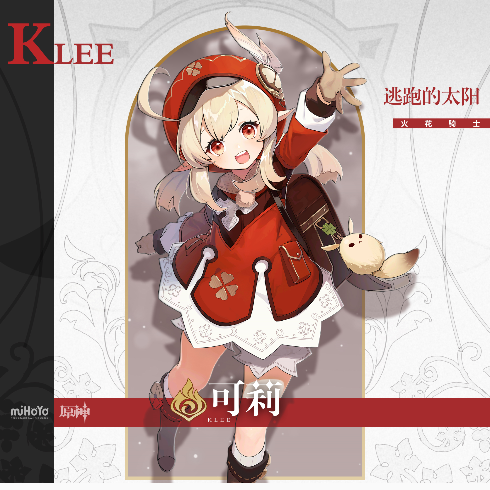
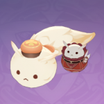
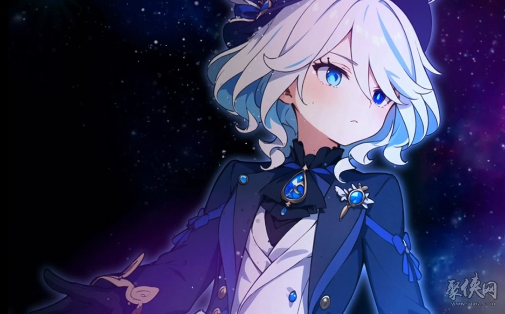
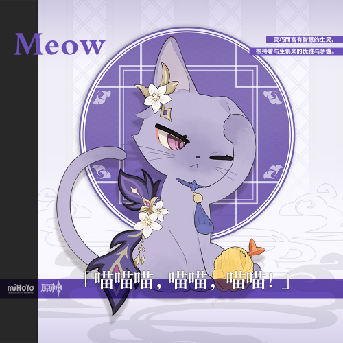
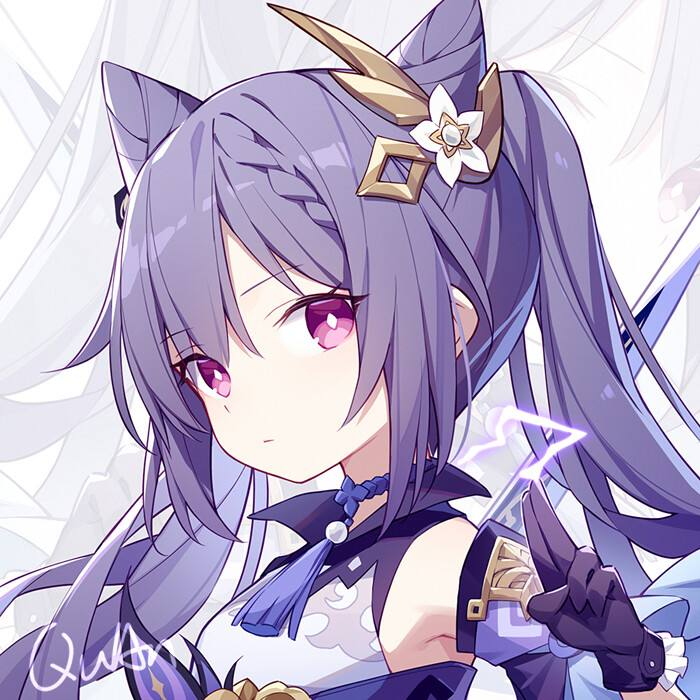

# 萌宠-猫咪系列
## 1（宵宫）

The attached image is of Kuki Shinobu's cat, but the background is rather plain. Please generate a cat image for Yoimiya as well, but it needs to be placed in a background that suits her backstory, personality traits, and main color scheme, in 16:9 2K wallpaper format.

## 2（伊涅芙）

Please generate a mechanical cat image for Ineffa as well. But it needs to be placed in a background that suits her backstory, personality traits, and main color scheme. The background should not be overly elaborate; a simple and plain background that matches the character's personality is sufficient. Retain the headdress and other distinctive features, modify the background, and add a small TV (as shown in the attached image). In 16:9 2K wallpaper format. 

## 3（桑多涅）
 （人物设定与并肩作战的同伴）
 （猫猫参考图）
Please generate a cat image for Sandrone from Genshin Impact as well. But it needs to be placed in a background that suits her backstory(For example, gears.), personality traits, and main color scheme(yellow and black). The background should not be overly elaborate; a simple and plain background that matches the character's personality is sufficient. In 16:9 2K wallpaper format. Change the large robot on the right side of the attached image into a small toy to serve as Sandrone's toy. The design should be based on the appearance of a Ragdoll cat; also, your primary color is incorrect. And the headpiece, too.

## 4（可莉）
 （人物立绘）
 （嘟嘟可玩偶）
Please generate a cat image for Klee from Genshin Impact as well. But it needs to be placed in a background that suits her backstory, personality traits, and main color scheme(The clothing is red, and the fur color should be blonde.). The background should not be overly elaborate; a simple and plain background that matches the character's personality is sufficient. In 16:9 2K wallpaper format. Retain her hat, and figure 2 shows two toys drawn as her toys.

## 5（芙宁娜）
 （人物绘画作品）
Please generate a cat image for Furina from Genshin Impact as well. Refer to the attached pic1. The hair is light blue, and the clothes are dark blue. There's a tuft of hair sticking up. Note that the character needs to be a cat. Remain the hat of her.
（微调关键词）Remove human hair, keep the ahoge (in the form of cat hair), everything else remains the same. Remove the clothing, but keep the gem around the neck. Note that the fur should be light blue. (16:9 wallpaper format)

## 6（刻晴）
 （人物猫猫形象参考图）
 （人物绘画作品）
Refer to the attached image and generate a cat image of Keqing. She lay on the bed, one paw raised as if stretching lazily