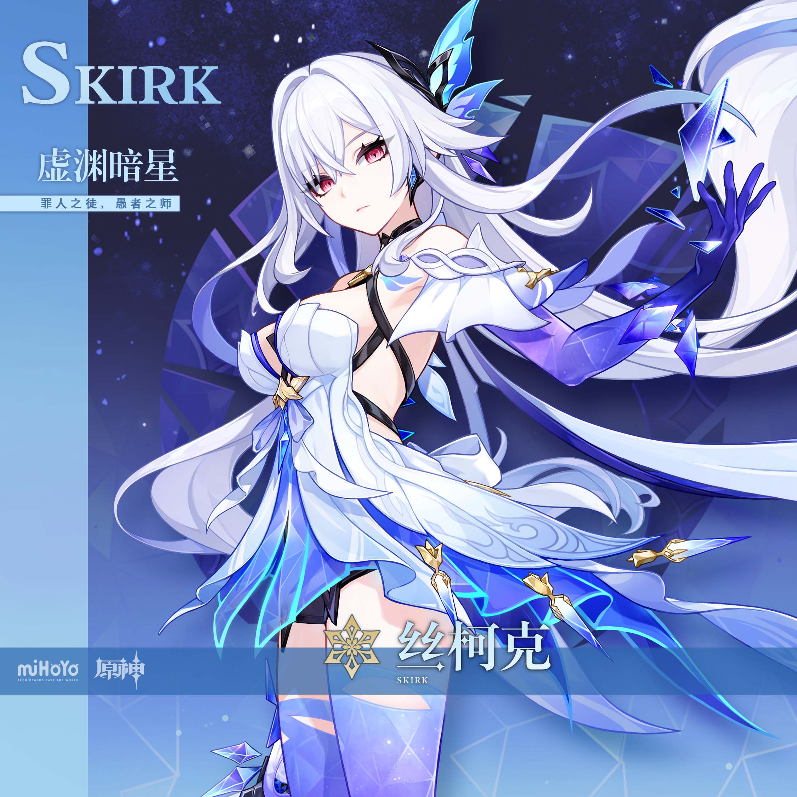
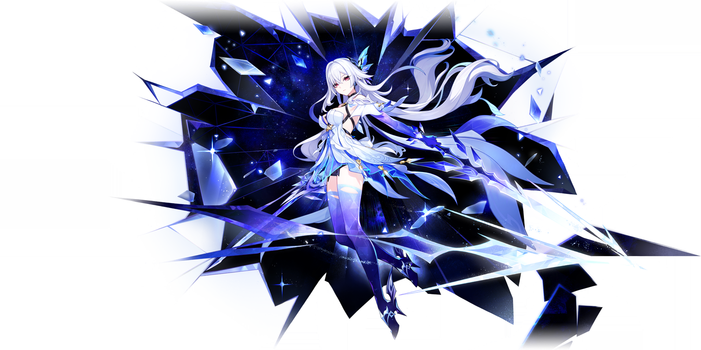

# 丝柯克 Skirk — 2026.09.12
> 视频类型：A · 角色单人壁纸合集
> 角色来源：原神 5.7 实装 · 5星冰元素单手剑（7.1 周年庆版本复刻）
> 身份：「公子」达达利亚的师父，「极恶骑」苏尔特洛奇的徒弟，行走于深渊的至强武者，称号「虚渊暗星·罪人之徒，愚者之师」
> 设计参考：银白长发+深渊之力幻化的双手（正常人类手形，深渊色）+冰晶碎片意象，中配谢莹/日配置户松遥
> 热点背景：今晚 20:00 原神 7.1「往冥府的安魂歌」前瞻直播（六周年庆版本），多渠道报道 7.1 卡池含丝柯克/爱可菲复刻（下半或与沃雅妮莎同池），周年庆送自选五星+20抽，冰之女皇实机同场引爆话题
> 决策理由：官方热点 40%（7.1前瞻当晚+复刻）｜社区热度 25%（T0冰C持续高讨论）｜时事契合 20%（周年庆版本+复刻预热）｜素材覆盖 15%（工作区从未做过丝柯克；薇斯纳/沃雅妮莎/安娜丝塔夏(冰神)均已做过，故不选）
> 外观校对：基于 B站WIKI 官方档案卡 splash-art.png 与抽卡立绘 gacha-art.png 视觉确认——极长银白及腰长发、侧边黑色发饰+蓝色晶蝶饰件、绯红偏粉瞳色、黑色颈环、白色抹胸式紧身衣+黑色交叉绑带、裸肩、常态手臂缠绕白色分离袖套、双手均为深渊之力幻化——正常人类手形五指，描绘为「深渊拟态手套」：小臂浅蓝、手掌至手指纯深蓝（双色分区，非渐变；同腿部半透明过膝袜的处理，非爪子形态）、白色层叠不对称裙摆+蓝色半透明晶体纱+金色饰扣、白色渐变薰衣草紫半透明过膝袜、黑色短裤
> ⚠️ 手部设定说明（2026.09.12 用户校对修正）：丝柯克双手均为深渊之力幻化，但是正常人类手的形状（五指齐全），配色为小臂浅蓝、手掌/手指纯深蓝（双色分区，非渐变），并非爪子/怪物形态。为消除生图时的"异化感"，正向 prompt 统一采用「深渊拟态手套」描绘法（abyss-mimicry gloves）：像一层贴合手部的特殊半透明丝袜/手套材质，与官方图中腿部半透明过膝袜的处理方式一致，内部为正常人类手。所有手部负面词条均包含 "claw hands" 排除爪化。

# 必需

## 1 — 涂鸦墙街头风（必需1）

Positive Prompt:
Refer to the attached reference image (Figure 1). Generate a similar style image of Skirk from Genshin Impact sitting casually in front of a bold graffiti wall. Skirk is seated in a relaxed but confident posture, leaning back against the graffiti wall with one knee raised, her other leg stretched out casually, one hand resting on her knee while her other hand loosely holds a spray paint can, with her body language calm, controlled, and slightly provocative. Her expression should show cold, disdainful eyes, aloof, sharp, and superior, as if she is silently judging the viewer.

Keep Skirk's recognizable features: extremely long silver-white hair flowing past her waist, black hair ornament with cyan-blue crystal butterfly accents on one side, pale pinkish-red eyes, black choker, and both of her hands covered in sleek form-fitting abyss-mimicry gloves — rendered like a special pair of glossy translucent gloves, light blue along the forearm shifting to a solid deep blue across palm and fingers (two-tone color blocking, not a smooth gradient), the same material treatment as her translucent thigh-high stockings, with normal human hands beneath, five human fingers (canonical character design). Blend her canonical design with a modern edgy streetwear aesthetic: a white cropped tube top, a cropped silver-white bomber jacket worn open and slipping off her shoulders, black high-waist denim shorts, one sheer lavender gradient thigh-high stocking and one bare leg, white chunky sneakers, a silver chain necklace and a small cryo snowflake earring. Preserve her identity while giving her a fresh urban street-style look.

The graffiti wall behind her should be vivid and layered, full of expressive abstract shapes and energetic street-art textures in ice-blue, silver-white and deep indigo tones, with graffiti elements including the name "SKIRK" in angular ice-cracked lettering, a cryo snowflake sigil, a shadowy whale silhouette swallowing a star, and cracked-frost geometric patterns, creating a rebellious urban backdrop that resonates with her character theme. Add subtle cryo energy effects, drifting ice crystal shards, and a faint violet abyss glow around her abyss-mimicry gloves to reinforce her identity.

Use a wide cinematic framing suitable for a 16:9 wallpaper, with Skirk as the main focal point while still showing enough of the graffiti wall and surrounding environment for atmosphere. The mood should feel cool, stylish, intimidating, and mysterious. Highly detailed background, rich shadows, ice-blue glowing highlights, sharp focus on Skirk, and a refined high-end anime illustration look. 16:9 2K wallpaper. Perfect hands, five fingers on both hands, anatomically correct hands.

Negative Prompt:
low quality, worst quality, blurry, pixelated, bad anatomy, extra limbs, wrong hair color, wrong eye color, incorrect character, text, watermark, logo, signature, bad hands, extra fingers, fewer fingers, missing fingers, fused fingers, webbed fingers, merged fingers, overlapping fingers, deformed fingers, mutated fingers, six fingers, three fingers, more than five fingers, less than five fingers, disfigured hands, poorly drawn hands, bad hand anatomy, asymmetrical hands, broken fingers, claw hands, blurry hands, indistinct fingers, smeared hands, standing, standing pose, upright posture, singing, open mouth singing, warm smile, gentle smile, cheerful expression, cute expression, adorable, sweet, innocent, game canonical outfit, official costume, fantasy dress, medieval clothing, armor, full gown, formal dress, beach background, ocean background, nature background, indoor background, plain background, minimal background, missing graffiti wall, low detail graffiti, generic graffiti, wrong graffiti colors, wrong streetwear, missing crop top, missing jacket, missing shorts, missing skirt, long dress, full pants, business suit, school uniform

## 2 — 特写肖像·断刃与孤星（必需2）

Positive Prompt:
Refer to the attached reference image (Figure 2). Generate a cinematic close-up portrait of Skirk from Genshin Impact. She holds a broken shard of an ice-forged blade close to the left side of her face, the fractured translucent shard tilted upward so its jagged edge crosses her cheekbone, partially obscuring her left eye. Her visible right eye gazes directly at the viewer — calm, ancient, and quietly dangerous. Expression: the detached serenity of a warrior who has already survived the end of her own world, layered with a faint, almost imperceptible curiosity, as if measuring whether the viewer's blade could ever reach her — a look simultaneously inviting and threatening, a faint melancholy that never reaches sorrow. Dramatic single-source lighting from the upper right casts deep chiaroscuro across her features, the crystal shard glowing pale blue where the light passes through it, with a subtle violet abyss shimmer along the fractured edge. Her pale skin contrasts sharply against a pure black background. Her signature extremely long silver-white hair spills in soft waves across the frame, fading into darkness; her black choker is only barely visible at the collar. A wanderer who outlived her world, a master forged by a cruel one — she sealed the abyss inside her own arm and calls it strength. 16:9 2K wallpaper. Perfect hands, five fingers on her holding hand, anatomically correct fingers, well-defined fingers.

Negative Prompt:
low quality, worst quality, blurry, pixelated, bad anatomy, extra limbs, wrong hair color, wrong eye color, incorrect character, text, watermark, logo, signature, bad hands, extra fingers, fewer fingers, missing fingers, fused fingers, webbed fingers, merged fingers, overlapping fingers, deformed fingers, mutated fingers, six fingers, three fingers, more than five fingers, less than five fingers, disfigured hands, poorly drawn hands, bad hand anatomy, asymmetrical hands, broken fingers, claw hands, blurry hands, indistinct fingers, smeared hands, full body shot, wide shot, landscape, multiple subjects, busy background, bright cheerful lighting, outdoor scene, action pose, weapon drawn

# 人物设定

## 3 — 深渊修行·裂空一剑

Positive Prompt:
Skirk from Genshin Impact in her canonical outfit, mid-swing sword strike inside a shattered void dimension. She wields a translucent crystalline ice blade with both hands in a powerful diagonal slash, a sweeping arc of blue-white frost energy trailing from the blade edge. The background is an endless dark abyss space filled with floating shattered glass-like fragments and tilted mirror shards reflecting starlight, deep indigo and black tones. Her extremely long silver-white hair whips dramatically through the air, black hair ornament with cyan crystal butterfly catching the light, pale pinkish-red eyes narrowed in fierce concentration, black choker at her throat. Her arms wrapped in white detached sleeve fabric, both her hands sheathed in sleek form-fitting abyss-mimicry gloves — light blue along the forearm and solid deep blue over palm and fingers, like a special translucent stocking material over normal human hands, five fingers, with small crystal shards orbiting them (canonical design). White layered asymmetric skirt with translucent blue crystal panels and gold clasps flowing with the motion, sheer lavender gradient thigh-high stockings. Ice crystal shards suspended mid-air around her, faint snowflake motes. Dynamic action composition, dramatic rim lighting in ice-blue, high contrast, highly detailed anime-style illustration, sharp focus. 16:9 2K wallpaper.

Negative Prompt:
low quality, worst quality, blurry, pixelated, bad anatomy, extra limbs, wrong hair color, wrong eye color, incorrect character, text, watermark, logo, signature, bad hands, extra fingers, fewer fingers, missing fingers, fused fingers, webbed fingers, merged fingers, overlapping fingers, deformed fingers, mutated fingers, six fingers, three fingers, more than five fingers, less than five fingers, disfigured hands, poorly drawn hands, bad hand anatomy, asymmetrical hands, broken fingers, claw hands, blurry hands, indistinct fingers, smeared hands, chibi, photorealistic, static pose, standing still, smiling cheerfully, bright daylight, colorful cheerful background

## 4 — 深渊之力觉醒·噬星之刻

Positive Prompt:
Skirk from Genshin Impact, dramatic low-angle hero shot, her gloved hand raised toward the sky as its abyss power awakens — a sleek form-fitting abyss-mimicry glove hugging a normal human-shaped hand with five fingers — light blue at the forearm turning solid deep blue across the palm and fingers, like glossy special translucent fabric, veins of violet abyss energy crackling along the glove's surface, razor-sharp crystal shards erupting and orbiting around it like a dark halo. Her face in three-quarter view above: pale pinkish-red eyes blazing with cold fury, expression fierce and commanding, lips slightly parted, extremely long silver-white hair billowing upward in the energy wind, black hair ornament with cyan crystal butterfly, black choker. Her canonical outfit: white corset-style bodysuit with black criss-cross straps, white layered skirt with translucent blue crystal panels and gold clasps, sheer lavender gradient thigh-high stockings. Background: a fractured void sky, black torn open by a huge jagged rift leaking violet and blue light, snowflake ash drifting down. Intense rim light in violet and ice-blue, volumetric glow, dark epic atmosphere, highly detailed anime-style illustration. 16:9 2K wallpaper. Both of her hands wear the same abyss-mimicry gloves with five human fingers beneath (character design), her other hand clenched in a fist.

Negative Prompt:
low quality, worst quality, blurry, pixelated, bad anatomy, extra limbs, wrong hair color, wrong eye color, incorrect character, text, watermark, logo, signature, bad hands, extra fingers, fewer fingers, missing fingers, fused fingers, webbed fingers, merged fingers, overlapping fingers, deformed fingers, mutated fingers, six fingers, three fingers, more than five fingers, less than five fingers, disfigured hands, poorly drawn hands, bad hand anatomy, asymmetrical hands, broken fingers, claw hands, blurry hands, indistinct fingers, smeared hands, chibi, cute, soft pastel colors, cheerful, bright daylight, smiling warmly

## 5 — 午夜酒馆的背影

Positive Prompt:
Atmospheric scene inside a dimly lit tavern at midnight. Skirk from Genshin Impact sits alone at the far corner of the wooden counter, seen mostly from behind at a three-quarter rear angle — a mysterious silhouette the way rumors describe her. Her extremely long silver-white hair spills down her back and over the bar stool, catching the warm amber glow of hanging oil lamps. She wears a travel-worn white cloak over her canonical outfit, the white layered skirt with translucent blue crystal panels peeking beneath, sheer lavender thigh-high stocking visible where she crosses her legs elegantly. One hand wrapped loosely around a warm mug on the counter, five fingers visible, natural relaxed grip. The counter surface reflects soft lamplight, scattered bottles and glasses bokeh in the background, faint chatter atmosphere suggested by blurred distant patrons, deep shadows in warm brown and cool blue contrast. Her posture is quiet, guarded, unhurried — a wanderer who avoids deep connections. Melancholic, intimate, cinematic mood, Rembrandt-style warm-cool light contrast, highly detailed anime-style illustration, sharp focus on her hair and silhouette. 16:9 2K wallpaper.

Negative Prompt:
low quality, worst quality, blurry, pixelated, bad anatomy, extra limbs, wrong hair color, wrong eye color, incorrect character, text, watermark, logo, signature, bad hands, extra fingers, fewer fingers, missing fingers, fused fingers, webbed fingers, merged fingers, overlapping fingers, deformed fingers, mutated fingers, six fingers, three fingers, more than five fingers, less than five fingers, disfigured hands, poorly drawn hands, bad hand anatomy, asymmetrical hands, broken fingers, claw hands, blurry hands, indistinct fingers, smeared hands, facing camera directly, front view portrait, cheerful crowd around her, bright daylight, outdoor scene, action pose

## 6 — 至冬雪原·夜行者

Positive Prompt:
Skirk from Genshin Impact walking through a frozen tundra at night in a gentle snowfall, approaching the viewer with calm unhurried strides. She wears a long white fur-lined traveler cloak with a deep hood pushed back off her head, over her canonical outfit — white corset-style bodysuit with black straps, layered white and translucent blue crystal-panel skirt swaying with each step, gold clasps, sheer lavender gradient thigh-high stockings, boots pressing fresh prints into the snow. Her extremely long silver-white hair streams in the icy wind, black hair ornament with cyan crystal butterfly, pale pinkish-red eyes calm and distant, black choker. Her arms in their white sleeve wraps, her hands in sleek abyss-mimicry gloves (light blue forearms, solid deep blue palms and fingers over normal human hands, five fingers, canonical design) tucked inside the cloak. Background: vast snowfield under a deep blue night sky with a green-violet aurora, a distant frozen city glowing with warm lantern light on the horizon, snow-dusted dead trees. Soft moonlight and aurora glow, cold blue color scheme with warm accent lights, snowflakes catching the light, cinematic wide shot, highly detailed anime-style illustration. 16:9 2K wallpaper.

Negative Prompt:
low quality, worst quality, blurry, pixelated, bad anatomy, extra limbs, wrong hair color, wrong eye color, incorrect character, text, watermark, logo, signature, bad hands, extra fingers, fewer fingers, missing fingers, fused fingers, webbed fingers, merged fingers, overlapping fingers, deformed fingers, mutated fingers, six fingers, three fingers, more than five fingers, less than five fingers, disfigured hands, poorly drawn hands, bad hand anatomy, asymmetrical hands, broken fingers, claw hands, blurry hands, indistinct fingers, smeared hands, summer, tropical, desert, bright sunny day, cheerful expression, running, modern city street

## 7 — 反差日常·深渊里的读书人

Positive Prompt:
Cozy contrast scene: Skirk from Genshin Impact sitting cross-legged on top of a large floating crystal outcrop, quietly absorbed in reading an old thick book held in both hands, five fingers visible, natural page-holding pose. Her sword leans against the crystal beside her within arm's reach. She wears her canonical outfit — white corset-style bodysuit with black straps, white layered asymmetric skirt with translucent blue crystal panels draped over the crystal, gold clasps, sheer lavender gradient thigh-high stockings. Her extremely long silver-white hair pools softly around her, black hair ornament with cyan crystal butterfly, black choker, pale pinkish-red eyes lowered toward the pages with a rare, faint soft expression — the barest hint of peace. Her abyss-gloved hands — sleek form-fitting abyss-mimicry gloves, light blue at the forearm and solid deep blue at the palm and fingers, over normal human hands with five fingers — rest casually on her knee (canonical design). A small handcrafted ice-crystal lantern floats nearby casting gentle blue light on her face, faint drifting snowflake motes and tiny crystal shards around. Background: the soft dark violet haze of the abyss void, calm and quiet rather than menacing. Warm-cool lantern glow contrast, intimate quiet atmosphere, highly detailed anime-style illustration. 16:9 2K wallpaper.

Negative Prompt:
low quality, worst quality, blurry, pixelated, bad anatomy, extra limbs, wrong hair color, wrong eye color, incorrect character, text, watermark, logo, signature, bad hands, extra fingers, fewer fingers, missing fingers, fused fingers, webbed fingers, merged fingers, overlapping fingers, deformed fingers, mutated fingers, six fingers, three fingers, more than five fingers, less than five fingers, disfigured hands, poorly drawn hands, bad hand anatomy, asymmetrical hands, broken fingers, claw hands, blurry hands, indistinct fingers, smeared hands, action pose, fighting, fierce expression, angry, holding sword, standing, bright cheerful daylight, crowd

## 8 — 现代风·雪夜都会

Positive Prompt:
Modern urban fashion edition: Skirk from Genshin Impact standing on a snowy city crosswalk at night, waiting elegantly as fine snow falls. She wears a chic modern winter outfit: a long tailored white wool coat over a black turtleneck sweater, a loosely wrapped pale-silver cashmere scarf, black slim trousers, white leather boots, small cryo snowflake silver earrings, black choker retained as a fashion choker. Her extremely long silver-white hair flows loose over the coat, black hair ornament with cyan crystal butterfly pinned at the side, pale pinkish-red eyes gazing calmly past the viewer with cool detachment. One hand tucked in her coat pocket, the other holding a warm paper coffee cup close to her chest, five fingers visible, natural grip. Background: a neon-lit city street after dark, glowing shop signs reflected in blue and violet bokeh on wet snow, soft streetlamp halo, falling snowflakes illuminated by the lights. Cold elegant color palette of white, silver and deep blue with neon accents, cinematic night photography mood rendered as highly detailed anime-style illustration. 16:9 2K wallpaper.

Negative Prompt:
low quality, worst quality, blurry, pixelated, bad anatomy, extra limbs, wrong hair color, wrong eye color, incorrect character, text, watermark, logo, signature, bad hands, extra fingers, fewer fingers, missing fingers, fused fingers, webbed fingers, merged fingers, overlapping fingers, deformed fingers, mutated fingers, six fingers, three fingers, more than five fingers, less than five fingers, disfigured hands, poorly drawn hands, bad hand anatomy, asymmetrical hands, broken fingers, claw hands, blurry hands, indistinct fingers, smeared hands, canonical fantasy outfit, armor, cape, sword, medieval clothing, fantasy background, daylight, tropical, cheerful grin

## 9 — 六周年·冰晶烟花

Positive Prompt:
Festive anniversary edition: Skirk from Genshin Impact standing on the pier of a frozen harbor at night, seen in three-quarter profile, looking upward at a spectacular firework bloom overhead that blossoms into the shape of a giant crystalline snowflake, its ice-blue and violet light washing over her upturned face. For once her expression carries a genuine, quiet warmth — a faint real smile, eyes reflecting the fireworks. Her canonical outfit: white corset-style bodysuit with black straps, white layered skirt with translucent blue crystal panels and gold clasps stirring in the night breeze, sheer lavender gradient thigh-high stockings. Her extremely long silver-white hair flows down her back, black hair ornament with cyan crystal butterfly glinting, black choker, her abyss-gloved hands hanging relaxed at her sides (canonical design). Firework light reflections scatter across the frozen sea surface like shattered gems, distant festival lanterns of a snow-covered city glow behind her, snowflakes drifting. Celebratory yet serene atmosphere, ice-blue and gold color scheme, cinematic composition with the firework as focal crown, highly detailed anime-style illustration. 16:9 2K wallpaper.

Negative Prompt:
low quality, worst quality, blurry, pixelated, bad anatomy, extra limbs, wrong hair color, wrong eye color, incorrect character, text, watermark, logo, signature, bad hands, extra fingers, fewer fingers, missing fingers, fused fingers, webbed fingers, merged fingers, overlapping fingers, deformed fingers, mutated fingers, six fingers, three fingers, more than five fingers, less than five fingers, disfigured hands, poorly drawn hands, bad hand anatomy, asymmetrical hands, broken fingers, claw hands, blurry hands, indistinct fingers, smeared hands, cold disdainful expression, frowning, daylight, indoor, crowd of people around her, text banners

# 参考图

## 10（官方档案立绘·16:9 壁纸重构）

Positive Prompt:
Refer to the attached official character art of Skirk from Genshin Impact. Recreate her exact canonical design as a high-resolution 16:9 wallpaper: Skirk standing in a graceful three-quarter turn looking back over her shoulder at the viewer, extremely long silver-white hair flowing dramatically behind her, black hair ornament with cyan-blue crystal butterfly accents, pale pinkish-red eyes, black choker. White corset-style bodysuit with black criss-cross straps and bare shoulders, her arms wrapped in white detached sleeves, her arm raised elegantly, the hand sheathed in a sleek form-fitting abyss-mimicry glove — light blue at the forearm, solid deep blue across palm and fingers, hugging a normal human hand with five fingers, floating blue crystal shards around it (canonical design). White layered asymmetric skirt with translucent blue crystal-fabric panels and gold clasps, sheer white-to-lavender gradient thigh-high stockings. Background: dark cosmic void with drifting ice crystal shards and faint star fragments, deep indigo and silver palette. Preserve her canonical colors and every design detail faithfully, premium official-art quality, highly detailed anime-style illustration, elegant composition. 16:9 2K wallpaper.

Negative Prompt:
low quality, worst quality, blurry, pixelated, bad anatomy, extra limbs, wrong hair color, wrong eye color, incorrect character, color shift on outfit, text, watermark, logo, signature, bad hands, extra fingers, fewer fingers, missing fingers, fused fingers, webbed fingers, merged fingers, overlapping fingers, deformed fingers, mutated fingers, six fingers, three fingers, more than five fingers, less than five fingers, disfigured hands, poorly drawn hands, bad hand anatomy, asymmetrical hands, broken fingers, claw hands, blurry hands, indistinct fingers, smeared hands, chibi, style change, western cartoon style, bright cheerful background, multiple characters

## 11（官方抽卡立绘·9:16 手机壁纸）

Positive Prompt:
Refer to the attached official gacha art of Skirk from Genshin Impact. Recreate this exact scene as a vertical 9:16 mobile wallpaper: Skirk floating weightlessly in a shattered dimensional void, surrounded by enormous jagged shards of dark glass and glowing ice crystals suspended mid-air, a luminous crystalline ice blade gleaming beside her leg. Her canonical design preserved exactly: extremely long silver-white hair drifting upward, black hair ornament with cyan crystal butterfly, pale pinkish-red eyes, black choker, white corset bodysuit with black straps, her hands in sleek form-fitting abyss-mimicry gloves, light blue at the forearm and solid deep blue over palm and fingers, on normal human hands with five fingers (canonical design), white layered skirt with translucent blue crystal panels and gold clasps, sheer lavender gradient thigh-high stockings. Deep black and indigo background with starlight glints on the shattered shards, cool blue glow, ethereal floating composition with her body centered vertically. Preserve her canonical colors and design faithfully, premium official-art quality, highly detailed anime-style illustration. 9:16 2K mobile wallpaper.

Negative Prompt:
low quality, worst quality, blurry, pixelated, bad anatomy, extra limbs, wrong hair color, wrong eye color, incorrect character, color shift on outfit, text, watermark, logo, signature, bad hands, extra fingers, fewer fingers, missing fingers, fused fingers, webbed fingers, merged fingers, overlapping fingers, deformed fingers, mutated fingers, six fingers, three fingers, more than five fingers, less than five fingers, disfigured hands, poorly drawn hands, bad hand anatomy, asymmetrical hands, broken fingers, claw hands, blurry hands, indistinct fingers, smeared hands, horizontal composition, landscape background, daylight, chibi, style change, multiple characters

# 跨领域参考图

## 12（参考深空气泡星云摄影·「虚渊暗星」宇宙融合）

Positive Prompt:
Refer to the attached photograph of the Bubble Nebula — a luminous teal-blue spherical gas bubble glowing inside dark interstellar space, surrounded by faint golden nebula clouds and scattered stars. Generate a fusion artwork: Skirk from Genshin Impact drifting serenely at the center of this cosmic scene, her body and flowing silver-white hair blending with the nebula's teal-blue glow, as if she herself is the dark star at the heart of the bubble. Her canonical design preserved: black hair ornament with cyan crystal butterfly, pale pinkish-red eyes calm and fathomless, black choker, white corset bodysuit with black straps, abyss-gloved hands softly trailing stardust, white layered skirt with translucent blue crystal panels dissolving into nebula gas at the hem, sheer lavender gradient thigh-high stockings. The nebula bubble's glowing rim arcs behind her like a halo, golden dust clouds in the upper corner, tiny stars piercing the darkness. The ice crystal shards around her echo the nebula's spherical form. Cosmic, sublime, quietly powerful atmosphere — the void is her home, the dark star is her name. Preserve her facial and outfit design clarity against the painterly cosmic background, highly detailed anime-style illustration blended with astrophotography color palette. 16:9 2K wallpaper.

Negative Prompt:
low quality, worst quality, blurry, pixelated, bad anatomy, extra limbs, wrong hair color, wrong eye color, incorrect character, text, watermark, logo, signature, bad hands, extra fingers, fewer fingers, missing fingers, fused fingers, webbed fingers, merged fingers, overlapping fingers, deformed fingers, mutated fingers, six fingers, three fingers, more than five fingers, less than five fingers, disfigured hands, poorly drawn hands, bad hand anatomy, asymmetrical hands, broken fingers, claw hands, blurry hands, indistinct fingers, smeared hands, ground terrain, city, daylight sky, blue sky with clouds, cartoon flat colors, busy cluttered composition

## 13（参考雪山银河摄影·至冬夜空下的暗星）

Positive Prompt:
Refer to the attached photograph of snow-covered mountain peaks under a purple-pink Milky Way with a falling shooting star. Generate a fusion artwork: Skirk from Genshin Impact standing on a snowy mountain ridge in the foreground right, her long white fur-lined cloak and extremely long silver-white hair streaming in the high-altitude wind, gazing up at the purple-pink galaxy band flooding the night sky. She reaches up with her gloved hand — the abyss-mimicry glove open in a natural human hand shape with five fingers, the glove solid deep blue across palm and fingers with light blue up the forearm, catching the falling shooting star just above her palm, the star's light resting between her fingers like a captive fragment of dawn. Her canonical outfit beneath the cloak: white corset bodysuit with black straps, white layered skirt with translucent blue crystal panels and gold clasps, sheer lavender gradient thigh-high stockings, black hair ornament with cyan crystal butterfly, black choker, pale pinkish-red eyes reflecting the galaxy. Dark pine forest silhouettes below the ridge, snow sparkling under starlight, deep blue-violet night palette with soft pink nebula glow. A wanderer from a dead world, catching a living star. Preserve her design clarity against the photographic landscape atmosphere, highly detailed anime-style illustration blended with astrophotography color palette. 16:9 2K wallpaper.

Negative Prompt:
low quality, worst quality, blurry, pixelated, bad anatomy, extra limbs, wrong hair color, wrong eye color, incorrect character, text, watermark, logo, signature, bad hands, extra fingers, fewer fingers, missing fingers, fused fingers, webbed fingers, merged fingers, overlapping fingers, deformed fingers, mutated fingers, six fingers, three fingers, more than five fingers, less than five fingers, disfigured hands, poorly drawn hands, bad hand anatomy, asymmetrical hands, broken fingers, claw hands, blurry hands, indistinct fingers, smeared hands, daytime, sunny sky, city buildings, crowd, flat cartoon colors, low detail background
