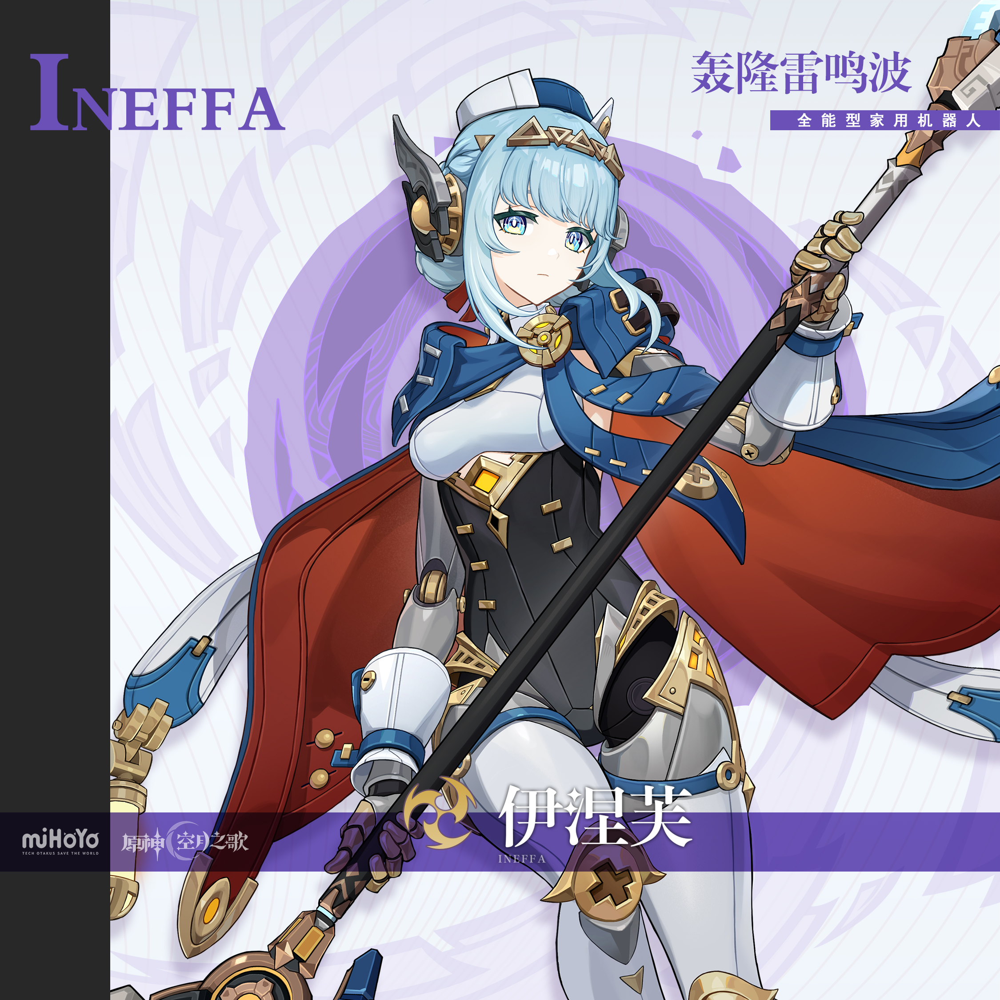
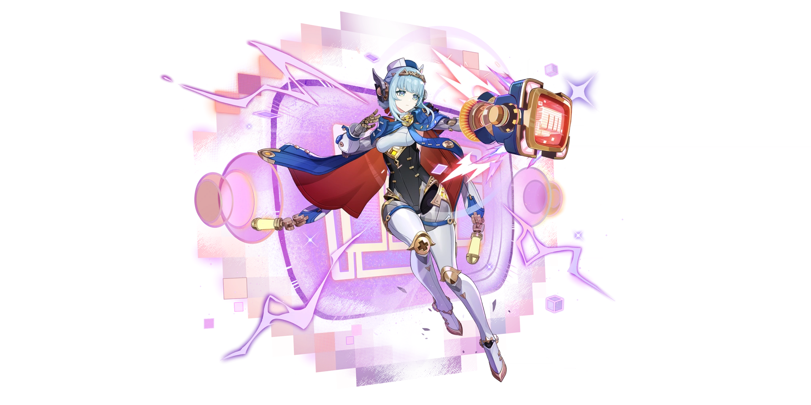
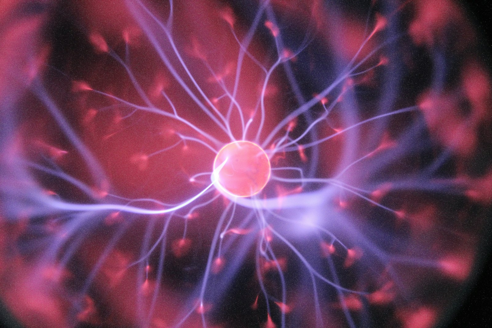
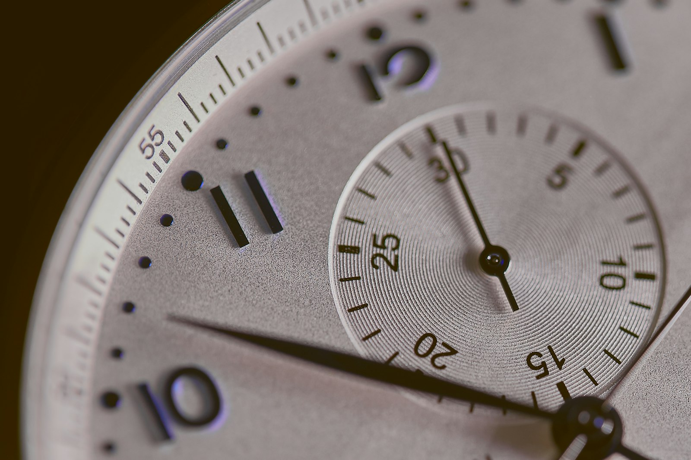

# 伊涅芙 Ineffa — 2026.08.11

> 视频类型：A · 角色单人壁纸合集
> 角色来源：原神 5.8 版本登场 · 五星雷元素长柄武器 · 7.0「无神怜爱的雪国」下半卡池复刻
> 身份：挪德卡莱「叮铃哐啷蛋卷工坊」制造的全能型家用机器人
> 称号：轰隆雷鸣波 · 全能型家用机器人
> 原名梗：「哔卟嘀嗒哐当唰啦咕噜啵伊（中略）泛用型万用机」
> 同伴：多用途智能辅助单元「薇尔琪塔」（Verkita）—— **顶着老式CRT电视机脑袋的方盒小机器人**：立方体头部嵌圆角矩形屏幕、厚金黄铜边框，屏幕以像素点阵显示表情（蓝色方块眼+短横嘴为默认，粉色叉叉眼为生气，雪花干扰为被电），头部两侧有金色圆柱形旋钮，矮胖人形身体着海军蓝+白色小制服配红色小披风（呼应伊涅芙配色），四肢为黄铜金短机械肢。**不是悬浮无人机、没有单个红色镜头眼**。官方图中可见多台同型机体，承担管家/家务职能（如端木质托盘送奶壶）
> 创造者：爱诺（叮铃哐啷蛋卷工坊天才少女）
> 配音：中文CV 美加 / 日文CV 中岛爱
> 设计参考：18世纪自动人偶（automaton）、蒸汽朋克机关术、挪德卡莱军装制服、瑞士精密机芯
> 核心机制：「月感电」体系核心辅助兼后台副C，雷暴云 + 光流屏障护盾 + 火箭飞拳
> 热点背景：原神 7.0「无神怜爱的雪国」8月12日上线（倒计时1天，明日更新）。7.0下半卡池（9月1日起）伊涅芙与菲林斯双双复刻，二者被社区称为「月感电黄金搭档」。攻略区抽卡优先级普遍排在【奥黛塔 > 伊涅芙 > 菲林斯 > 仆人】的第二位，是本次复刻中呼声最高的辅助角色。工作区已覆盖 7.0 全部相关角色（奥黛塔、阿蕾奇诺、阿罗夏、菲林斯），唯独伊涅芙尚未制作，本期正好补齐 7.0 完整角色阵容
> 今日特殊：7.0 版本上线前夜（倒计时1天），版本热度峰值
> 外观校对：本文所有外观描述均已对照 splash-art.png 与 gacha-art.png 逐项核对

# 必需

Refer to the attached reference image (Figure 1). Generate a similar style image of Ineffa from Genshin Impact standing in front of a bold graffiti-covered concrete wall in a dim urban alleyway, looking at the camera with a flat, deadpan, slightly unimpressed expression — the blank-faced stare of a household robot that has been asked one too many silly questions. She wears modernized streetwear with a mechanical twist: an oversized white-and-navy varsity bomber jacket worn open with rolled sleeves exposing her brass-gold mechanical forearms, a light grey cropped tank top underneath, high-waisted dark navy cargo shorts with gold buckle straps, and chunky white sneakers over her silver-white armored mechanical legs. Keep her recognizable features exactly: short pale ice-blue hair with soft inward-curling side locks framing her face and two small twisted buns at the sides, blunt bangs, a small white flat-top sailor cap with a gold trim band sitting on top of her head, angular dark-grey and gold mechanical ear units mounted where human ears would be, large blue-grey eyes with a subtle mechanical iris ring, pale porcelain skin, and gold-brass segmented mechanical joints at her elbows and knees. Her companion robot "Verkita" stands beside her — a small boxy CRT-television-headed robot: a cube-shaped head housing a rounded-rectangle screen set in a thick gold-brass bezel, the screen displaying a simple pixel-art face made of glowing blue rectangular eyes and a small flat dash mouth, with gold cylindrical dial knobs mounted on each side of the head like antenna spools. Its stubby humanoid body wears a miniature navy-blue and white outfit with a small red cape, echoing Ineffa's own color scheme, and it has short articulated brass-gold arms and legs. Here its screen shows a smug pixel-art expression with narrowed eyes, leaning casually against the wall beside her. The graffiti wall behind her features pale ice-blue, violet, and electric-purple abstract patterns with lightning bolt tags, gear and cog motifs, and scattered circuit-line designs. Cool violet-blue neon light from an unseen sign casts crisp shadows across the scene. 16:9 2K wallpaper format. perfect hands, five fingers on each hand, anatomically correct hands, well-defined fingers, one hand in jacket pocket, other hand relaxed at her side.

Negative Prompt: low quality, worst quality, blurry, pixelated, bad anatomy, bad hands, extra fingers, fewer fingers, missing fingers, fused fingers, webbed fingers, merged fingers, overlapping fingers, deformed fingers, mutated fingers, six fingers, four fingers, three fingers, more than five fingers, less than five fingers, disfigured hands, poorly drawn hands, bad hand anatomy, asymmetrical hands, broken fingers, claw hands, blurry hands, indistinct fingers, smeared hands, extra limbs, chibi, childish, wrong hair color, blonde hair, pink hair, dark hair, wrong eye color, red eyes, missing sailor cap, missing mechanical ear units, missing mechanical joints, fully human body, warm sunny daylight, cheerful wide smile, text, watermark, logo, signature.

# 必需2 — 特写肖像

Refer to the attached reference image (Figure 2). Generate a cinematic close-up portrait of Ineffa from Genshin Impact. She holds a small brass gear — tarnished gold with precisely cut teeth and a central circular hole — between her thumb and forefinger at eye level, positioned just in front of her right eye so the viewer sees her blue-grey iris peering through the gear's center hole, the ring of metal framing her pupil like a mechanical aperture within a mechanical eye. Her visible left eye gazes directly at the camera with a still, searching intensity — not sadness, not curiosity, but the quiet bewilderment of a machine examining a single component and trying to determine whether it once belonged to her own body or someone else's. Expression: lips faintly parted, the barest downturn at one corner that could be concentration or could be grief, her brow smooth and untroubled in a way that makes the almost-emotion beneath it more unsettling — a face built to default neutral, failing to fully render what it feels. Dramatic single-source lighting from the upper left, warm amber-bronze, picks out the metallic texture of the gear and the sharp porcelain planes of her face in chiaroscuro, a faint violet Electro glint licking along the gear's teeth where her thumb touches it — the only trace of the element that powers her. Her pale ice-blue hair dissolves into the pure black background at the edges, only the blunt bangs and one side lock catching the amber light; her small white sailor cap with gold trim is barely implied at the crown of the frame. Only her face, her hand, and the gear exist in the frame — minimalist, intimate, and hauntingly still. A machine trying very hard to remember if this piece once belonged to her, uncertain whether the answer would comfort her or break something she cannot repair. 16:9 2K wallpaper.

perfect hands, five fingers on each hand, anatomically correct hands, well-defined fingers, thumb and forefinger holding gear, remaining fingers naturally curled.

Negative Prompt: low quality, worst quality, blurry, pixelated, bad anatomy, bad hands, extra fingers, fewer fingers, missing fingers, fused fingers, webbed fingers, merged fingers, overlapping fingers, deformed fingers, mutated fingers, six fingers, four fingers, three fingers, disfigured hands, poorly drawn hands, bad hand anatomy, asymmetrical hands, broken fingers, claw hands, blurry hands, indistinct fingers, full body shot, wide shot, landscape, multiple subjects, busy background, bright cheerful lighting, outdoor scene, action pose, weapon drawn, battle effects, warm sunny daylight, cheerful wide smile, multiple characters, wrong hair color, wrong eye color, missing sailor cap, missing mechanical ear units, incorrect character, chibi, text, watermark, logo, signature.

# 人物设定

## 1 — 叮铃哐啷蛋卷工坊·清晨启动（标志性场景）

Positive Prompt:
16:9 2K wallpaper, Ineffa from Genshin Impact, highly detailed anime-style illustration, polished game-art quality, warm workshop atmosphere, cozy steampunk interior, gentle morning light.

Depict Ineffa standing in the cluttered, warmly lit interior of the "Ding-Ling Kuang-Lang Egg Roll Workshop" (叮铃哐啷蛋卷工坊) in Nod-Krai at the moment of her daily morning startup sequence. Her blue-grey eyes have just illuminated with a soft inner glow, faint violet Electro sparks arcing between her mechanical ear units as her systems come online. Her expression is calm, neutral, and quietly attentive — the composed blank-faced look of a machine running a self-diagnostic, with just the faintest hint of contentment. One hand rests on a wooden workbench for balance, the other adjusts the gold trim band of her small white sailor cap.

Full canonical design with maximum detail: short pale ice-blue hair with soft inward-curling side locks framing her cheeks and two small twisted side buns, blunt bangs across her forehead, a gold decorative headband with angular geometric plates visible beneath the small white flat-top sailor cap. Angular dark-grey and gold mechanical ear units mounted at the sides of her head with small vents and panel lines. She wears her signature outfit: a deep navy-blue military-style shoulder cape with gold clasps and a large circular gold-and-amber brooch at the throat, the cape's interior lining a rich crimson red; beneath it a white and light-grey fitted chest piece over a black high-collared bodysuit with gold rectangular buttons in a double-breasted arrangement and a gold-and-amber gemstone belt buckle at the waist. Her arms are brass-gold segmented mechanical limbs with white enamel upper-arm plating and articulated gauntlet hands; her legs are silver-white armored mechanical limbs with gold cross-shaped knee plates and blue accent panels.

The workshop around her is a delightful mess of invention: wooden shelves crammed with brass gears, coiled copper wire, half-assembled clockwork parts, glass jars of screws, and blueprints pinned to the walls. A cast-iron stove glows warmly in the corner. Tools hang from pegboards. Her companion robot "Verkita" — a small boxy CRT-television-headed robot with a cube head, a rounded-rectangle screen in a thick gold-brass bezel, gold cylindrical dial knobs on each side of the head, a stubby humanoid body in a miniature navy-and-white outfit with a small red cape, and short articulated brass-gold limbs — is already awake and bustling nearby, carrying a small wooden serving tray with a white ceramic milk pitcher on it. Its screen displays a cheerful pixel-art face: two curved blue arc eyes and a tiny open mouth. Golden morning sunlight streams through a frost-edged window, catching floating dust motes and making her brass joints gleam.

Medium composition with Ineffa at center-left, the workshop depth extending behind her, the window light source at the right. Warm amber and honey-gold tones dominate, contrasted against her cool ice-blue hair and the crimson of her cape lining. The mood is warm, homey, and quietly magical — a machine that has found a home.

perfect hands, five fingers on each hand, anatomically correct hands, well-defined fingers, one hand flat on workbench, other hand touching cap brim.

Negative Prompt:
low quality, worst quality, blurry, pixelated, bad anatomy, bad hands, extra fingers, fewer fingers, missing fingers, fused fingers, webbed fingers, merged fingers, overlapping fingers, deformed fingers, mutated fingers, six fingers, four fingers, three fingers, disfigured hands, poorly drawn hands, bad hand anatomy, asymmetrical hands, broken fingers, claw hands, blurry hands, indistinct fingers, smeared hands, extra limbs, fully human arms, fully human legs, missing mechanical joints, missing sailor cap, wrong hair color, wrong eye color, incorrect character, combat pose, weapon drawn, battle effects, dark horror atmosphere, nighttime, multiple humanoid characters, chibi, text, watermark, logo, signature.

## 2 — 轰隆雷鸣波·月感电全开（元素爆发战斗形态）

Positive Prompt:
16:9 2K wallpaper, Ineffa from Genshin Impact, highly detailed anime-style illustration, dynamic action composition, spectacular Electro elemental effects, polished game-art quality, epic battle atmosphere.

Depict Ineffa at the peak of her Elemental Burst "Thunderous Roar Wave" (轰隆雷鸣波). She hovers slightly above the ground in a powerful mid-air combat stance, her long ornate polearm — a brass-and-steel mechanical spear with geometric gold fittings, a dark shaft, and an angular blade head — held extended in both hands diagonally across her body. A massive violet-purple thundercloud (雷暴云) churns in the sky directly above her, discharging branching arcs of brilliant white-violet lightning down onto the battlefield in the signature Moon-Galvanize (月感电) reaction.

Her mechanical limbs have partially disengaged and float in articulated segments around her body — forearms, upper arms, and shin plates separated at the joints and suspended in mid-air by Electro energy, glowing violet at every disconnection point, exactly as in her official gacha art. Her rocket-fist module has launched: a large boxy brass-and-navy mechanical gauntlet blasting forward on a jet of orange-red thruster flame, trailing violet lightning. A translucent hexagonal Electro barrier shield (光流屏障) shimmers faintly around her in a geodesic pattern.

Her pale ice-blue hair whips upward in the energy vortex, side locks streaming, the small white sailor cap somehow staying perfectly in place. Her blue-grey eyes blaze with intensified violet-white light, pupils narrowed into sharp mechanical apertures. Her expression is one of pure focused calculation — no anger, no strain, just absolute machine precision. Her navy cape with crimson lining billows dramatically behind her, gold clasps catching the lightning flashes. Her companion robot "Verkita" — the small boxy CRT-television-headed unit with its gold-bezeled screen, side dial knobs, and miniature navy-and-white outfit with red cape — has been swept up into the air beside her by the energy surge, its short brass limbs flailing, and its screen displays an alarmed pixel-art face: wide startled blue eyes and a small open mouth, with tiny pink static jitter lines flickering across the display from the electrical interference.

The battlefield is a rain-slicked stone plaza in Nod-Krai under a violent night storm. Rainwater on the ground conducts the Electro discharge outward in glowing violet ripples and branching fractal patterns. Shattered stone fragments and water droplets hang suspended in the air, frozen by the shockwave. Distant Gothic Nod-Krai spires are silhouetted against the storm.

Dynamic diagonal composition with Ineffa as the central force at slight low angle looking up, the thundercloud filling the upper third, lightning creating strong vertical lines connecting sky to ground. Deep navy-black shadows contrast with blazing violet, white, and amber energy highlights.

perfect hands, five fingers on each hand, anatomically correct hands, well-defined fingers, both hands firmly gripping the polearm shaft.

Negative Prompt:
low quality, worst quality, blurry, pixelated, bad anatomy, bad hands, extra fingers, fewer fingers, missing fingers, fused fingers, webbed fingers, merged fingers, overlapping fingers, deformed fingers, mutated fingers, six fingers, four fingers, three fingers, disfigured hands, poorly drawn hands, bad hand anatomy, asymmetrical hands, broken fingers, claw hands, blurry hands, indistinct fingers, smeared hands, extra limbs, stiff pose, weak effects, flat lighting, bright cheerful daylight, cute peaceful expression, missing weapon, fire Pyro effects, Cryo ice effects, orange flames as main element, wrong hair color, wrong eye color, incorrect character, chibi, text, watermark, logo, signature.

## 3 — 记忆碎片·明晨之镜的谬误（剧情叙事场景）

Positive Prompt:
16:9 2K wallpaper, Ineffa from Genshin Impact, highly detailed anime-style illustration, surreal dreamlike atmosphere, melancholic narrative composition, ethereal lighting, polished game-art quality.

Depict Ineffa standing alone in a vast, surreal memory-space — the fractured inner world of her own damaged data core. She stands on an invisible reflective plane that mirrors her perfectly, surrounded by hundreds of floating shards of broken mirror suspended in dark violet void. Each mirror fragment reflects a different fragmented image: a workshop bench, a caravan road, a snowy horizon, a pair of unfamiliar eyes, gears turning, and in some shards a shadowy regal silhouette that is not quite her — the trace of "The Mirror of Bright Dawn" (明晨之镜), the eleventh seat whose operational error gave rise to her existence.

Her expression is the emotional core of this piece: not sad exactly, but searching — head tilted slightly upward, blue-grey eyes wide and softly luminous, lips faintly parted, one brass-gold mechanical hand raised toward a floating mirror shard, fingers extended but not quite touching it. It is the face of a machine trying very hard to remember something that may never have belonged to her.

Full canonical design rendered with dreamlike softness: short pale ice-blue hair with inward-curling side locks and twisted side buns, blunt bangs, small white sailor cap with gold trim, gold geometric headband plates, angular dark-grey and gold mechanical ear units. Her navy shoulder cape with crimson interior lining drifts weightlessly as if underwater, gold circular brooch at the throat glowing faintly. White-grey chest piece over black high-collared bodysuit with gold double-breasted buttons and amber belt gem. Brass-gold mechanical arms and silver-white armored legs with gold cross knee plates, several joint segments gently detached and floating, connected by thin threads of violet light. Faint violet Electro motes drift upward around her like fireflies.

The palette is deep indigo and violet void, silver-white mirror shards, pale ice-blue hair, and warm amber-gold accents from her mechanical parts — the only warmth in an otherwise cold space. Volumetric light beams filter down from an unseen source above, catching the mirror edges and creating prismatic refractions.

Wide atmospheric composition with Ineffa small in the lower-center third of the frame, dwarfed by the vast field of floating mirrors extending upward and outward into darkness. The scale contrast emphasizes her solitude. The mood is haunting, tender, and deeply melancholic.

perfect hands, five fingers on each hand, anatomically correct hands, well-defined fingers, one hand raised with fingers elegantly relaxed and naturally extended, other hand hanging at her side.

Negative Prompt:
low quality, worst quality, blurry, pixelated, bad anatomy, bad hands, extra fingers, fewer fingers, missing fingers, fused fingers, webbed fingers, merged fingers, overlapping fingers, deformed fingers, mutated fingers, six fingers, four fingers, three fingers, disfigured hands, poorly drawn hands, bad hand anatomy, asymmetrical hands, broken fingers, claw hands, blurry hands, indistinct fingers, smeared hands, extra limbs, bright cheerful daylight, outdoor natural landscape, combat pose, weapon drawn, aggressive expression, crowded scene, multiple humanoid characters, wrong hair color, wrong eye color, incorrect character, chibi, text, watermark, logo, signature.

## 4 — 全能型家用机器人·家务模式（温馨日常反差）

Positive Prompt:
16:9 2K wallpaper, Ineffa from Genshin Impact, highly detailed anime-style illustration, warm slice-of-life atmosphere, cozy domestic interior, charming humorous character moment, polished game-art quality.

Depict Ineffa in full "all-purpose household robot" mode — living up to her official designation with absolute mechanical seriousness. She stands in a warm, cluttered Nod-Krai kitchen performing four household tasks simultaneously using her detachable mechanical limbs: her main two hands carefully hold a tray of freshly baked white-lily egg rolls (白灵蛋卷), while two additional detached brass-gold mechanical forearms float independently in the air beside her — one holding a feather duster mid-swipe over a shelf, the other stirring a copper pot on the stove with a wooden spoon. Faint violet Electro threads connect the floating limbs back to her shoulders.

Her expression is the joke: utterly deadpan, calm, and matter-of-fact, blue-grey eyes looking straight ahead with total composure, as if doing four chores at once with detached flying arms is the most ordinary thing imaginable. A small wisp of steam has fogged one corner of her vision. Her companion robot "Verkita" — the small boxy CRT-television-headed unit with its gold-bezeled screen, gold side dial knobs, miniature navy-and-white outfit with red cape, and short brass limbs — stands on a wooden stool beside the stove balancing a serving tray with a white ceramic milk pitcher, supervising the pot with great seriousness. Its screen shows a stern pixel-art face: narrowed angular blue eyes and a flat dash mouth, the very picture of a tiny household manager who takes the job far too seriously.

Full canonical design in a domestic context: short pale ice-blue hair with inward-curling side locks and twisted side buns, blunt bangs, small white sailor cap with gold trim band, gold geometric headband plates, angular dark-grey and gold mechanical ear units. Her navy shoulder cape with crimson lining is pushed back over her shoulders and a simple cream-white apron with a small gear-motif embroidered pocket is tied over her black-and-white bodysuit — the apron is the only non-canonical addition and it should look natural over the gold double-breasted buttons and amber belt buckle. Brass-gold mechanical arms and silver-white armored legs with gold cross knee plates fully visible.

The kitchen is charmingly lived-in: a cast-iron stove with a copper kettle, wooden countertops dusted with flour, a rack of hanging herbs and copper pans, open shelves with mismatched ceramic jars, a small frost-rimmed window showing snowy Nod-Krai rooftops outside. Warm amber light from the stove and a hanging brass lamp fills the room. Flour dust hangs in the golden air.

Medium composition with Ineffa center-frame, the floating extra arms creating visual interest to the left and right, the warm kitchen wrapping around her. Rich warm amber, cream, and copper tones against her cool ice-blue hair and crimson cape lining. The mood is cozy, gently funny, and endearing.

perfect hands, five fingers on each hand, anatomically correct hands, well-defined fingers, main hands holding tray by its edges, detached floating hands gripping duster handle and spoon handle naturally.

Negative Prompt:
low quality, worst quality, blurry, pixelated, bad anatomy, bad hands, extra fingers, fewer fingers, missing fingers, fused fingers, webbed fingers, merged fingers, overlapping fingers, deformed fingers, mutated fingers, six fingers, four fingers, three fingers, disfigured hands, poorly drawn hands, bad hand anatomy, asymmetrical hands, broken fingers, claw hands, blurry hands, indistinct fingers, smeared hands, extra limbs growing from torso, malformed detached arms, dark horror atmosphere, combat pose, weapon drawn, aggressive expression, battle effects, nighttime exterior, wrong hair color, wrong eye color, incorrect character, chibi, text, watermark, logo, signature.

## 5 — 雪原巡行·商队的护卫（至冬雪国场景 · 7.0版本主题）

Positive Prompt:
16:9 2K wallpaper, Ineffa from Genshin Impact, highly detailed anime-style illustration, vast snowy landscape, cinematic wide shot, cold atmospheric beauty, polished game-art quality.

Depict Ineffa walking point ahead of a small merchant caravan across the frozen wastes at the border between Nod-Krai and Snezhnaya — a callback to how she first traveled with the caravan while searching for her lost memories, now set against the newly opened Snezhnayan winter frontier. She strides forward through knee-deep powder snow with steady mechanical rhythm, her polearm carried resting across one shoulder, her free hand raised to shield her optical sensors as she scans the white horizon.

Her expression is alert and analytical, blue-grey eyes narrowed slightly against the glare and blowing snow, a thin rime of frost crystals collecting on her mechanical ear units, on the gold trim of her sailor cap, and along the shoulder line of her navy cape. Small puffs of warm vapor vent from the joint seams of her brass-gold mechanical arms as her internal systems work to stay warm — a lovely detail showing she is a machine in a hostile climate.

Full canonical design: short pale ice-blue hair with inward-curling side locks and twisted side buns whipped by wind, blunt bangs, small white flat-top sailor cap with gold trim band, gold geometric headband plates, angular dark-grey and gold mechanical ear units now frost-dusted. Navy-blue military shoulder cape streaming hard to one side in the wind revealing its crimson interior lining, large circular gold-and-amber brooch at the throat. White-grey chest piece, black high-collared bodysuit with gold rectangular double-breasted buttons, gold-and-amber gemstone belt buckle. Brass-gold segmented mechanical arms with white enamel plating, silver-white armored mechanical legs with gold cross knee plates, snow packed into the joint recesses. Her companion robot "Verkita" trudges just ahead of her at scout position, its short brass-gold legs sinking deep into the powder with each step, the small boxy CRT-television head with its gold-brass bezel and side dial knobs dusted with snow, its miniature navy-and-white outfit and small red cape whipping in the wind. Its screen glows warmly in the white-out, casting a small pool of light and displaying a determined pixel-art face: firm angular blue eyes and a flat set mouth, with a few pixels of frost creeping in at the screen corners.

The landscape is immense and beautiful: an endless rolling snowfield under a pale lavender-grey overcast sky, jagged ice-capped mountains on the far horizon, and behind her in the middle distance the dark silhouettes of three caravan wagons and their draft beasts, small against the vastness. Wind-driven snow streams diagonally across the frame. Faint aurora shimmer of pale green and violet touches the sky near the mountains.

Panoramic wide composition with Ineffa at the left third in the foreground, the caravan behind her at mid-right, the mountain horizon establishing scale. Cool palette of white, pale lavender, and slate grey, punctuated by the crimson of her cape lining, her gold brass fittings, and the warm glow of Verkita's screen — small points of warmth in an overwhelming cold. The mood is lonely, resolute, and quietly epic.

perfect hands, five fingers on each hand, anatomically correct hands, well-defined fingers, one hand steadying polearm on shoulder, other hand raised flat to shield eyes.

Negative Prompt:
low quality, worst quality, blurry, pixelated, bad anatomy, bad hands, extra fingers, fewer fingers, missing fingers, fused fingers, webbed fingers, merged fingers, overlapping fingers, deformed fingers, mutated fingers, six fingers, four fingers, three fingers, disfigured hands, poorly drawn hands, bad hand anatomy, asymmetrical hands, broken fingers, claw hands, blurry hands, indistinct fingers, smeared hands, extra limbs, summer scenery, green grass, warm sunny daylight, tropical setting, indoor scene, cheerful wide smile, wrong hair color, wrong eye color, incorrect character, chibi, text, watermark, logo, signature.

## 6 — 蒸汽朋克舞会·发条淑女（现代/风格改造）

Positive Prompt:
16:9 2K wallpaper, Ineffa from Genshin Impact, highly detailed anime-style illustration, opulent steampunk Victorian ballroom, elegant fashion illustration quality, warm gaslight atmosphere, polished character art.

Reimagine Ineffa as the guest of honor at a lavish steampunk-Victorian ball in a grand Nod-Krai mansion. She wears an elegant reimagined formal gown that translates her canonical color scheme into haute couture: a floor-length midnight-navy velvet ball gown with a structured corseted bodice trimmed in gold filigree that echoes her double-breasted button motif, an off-shoulder neckline framed by a short crimson-lined capelet fastened with her signature large circular gold-and-amber brooch, and a sweeping skirt whose inner layers flash crimson red as she moves. Exposed clockwork detailing is integrated as deliberate high fashion: a transparent crystal panel set into the bodice reveals delicate turning brass gears beneath, and fine gold chains drape from shoulder to waist.

Her brass-gold mechanical arms are on full elegant display, polished to a mirror shine and wearing sheer white opera-length fingerless gloves that stop at the wrist so the articulated metal hands remain visible — the deliberate fusion of machine and elegance is the entire point of this piece. Her silver-white armored legs are partly visible through a high skirt slit, gold cross knee plates polished bright.

Her hair and head remain fully canonical: short pale ice-blue hair with inward-curling side locks and twisted side buns, blunt bangs, angular dark-grey and gold mechanical ear units, gold geometric headband plates — but the small white sailor cap is replaced by a delicate gold filigree headpiece with a single small amber gem, sitting at the same angle. Her expression is serene, poised, and faintly amused, blue-grey eyes looking slightly off-camera with the calm confidence of someone who knows she is the most remarkable thing in the room. She holds a closed lace fan in one hand, the other resting lightly on the polished brass banister of a staircase.

The ballroom is magnificent: soaring ceilings with an enormous brass-and-crystal chandelier whose gaslight flames flicker warm gold, exposed decorative gearwork and pendulums built into the architecture, tall arched windows with frost on the glass, a polished dark parquet floor reflecting the light, and blurred elegantly dressed guests in the background. Warm amber gaslight from the chandelier is the key light; cool blue moonlight from the windows provides rim lighting on her hair and shoulders.

Medium-full composition with Ineffa positioned on the staircase at the right third, the ballroom depth and chandelier filling the left and upper frame. Rich palette of midnight navy, crimson, warm brass gold, and amber, set against her cool ice-blue hair. The mood is glamorous, refined, and quietly extraordinary.

perfect hands, five fingers on each hand, anatomically correct hands, well-defined fingers, one hand holding closed fan by its handle, other hand resting flat on banister, fingers elegantly relaxed.

Negative Prompt:
low quality, worst quality, blurry, pixelated, bad anatomy, bad hands, extra fingers, fewer fingers, missing fingers, fused fingers, webbed fingers, merged fingers, overlapping fingers, deformed fingers, mutated fingers, six fingers, four fingers, three fingers, disfigured hands, poorly drawn hands, bad hand anatomy, asymmetrical hands, broken fingers, claw hands, blurry hands, indistinct fingers, smeared hands, extra limbs, fully human arms, fully human legs, hidden mechanical parts, modern contemporary clothing, casual streetwear, combat pose, weapon drawn, battle effects, outdoor scene, daylight, wrong hair color, wrong eye color, incorrect character, chibi, text, watermark, logo, signature.

## 7 — 与薇尔琪塔·维修夜（情感/私人时刻）

Positive Prompt:
16:9 2K wallpaper, Ineffa from Genshin Impact, highly detailed anime-style illustration, intimate quiet night scene, warm lamplight, tender emotional atmosphere, polished game-art quality.

Depict a quiet private moment: Ineffa sitting cross-legged on the wooden floor of a small attic room late at night, performing gentle maintenance on her companion robot "Verkita." The little CRT-television-headed robot sits propped in her lap facing her, its cube-shaped head with the thick gold-brass screen bezel tilted back and a small access panel opened at the base of its neck, its miniature navy-and-white outfit and small red cape slightly rumpled, its short brass-gold limbs hanging limp and relaxed. Its screen is dimmed to a soft low-brightness glow displaying a sleepy pixel-art face: two simple horizontal dash eyes and a tiny content curve of a mouth, the display flickering gently. One of its gold side dial knobs has been unscrewed and set aside. Ineffa holds a fine brass screwdriver in one hand and steadies the robot's cube head with the other, her head bent close over her work.

The emotional core is her expression: this is the softest we ever see her. Her blue-grey eyes are lowered in complete concentration, her usual deadpan replaced by something unmistakably gentle — the faintest curve at the corner of her mouth, brows relaxed. A machine caring for another machine, with a tenderness that no one programmed into her. Her own left forearm has its access panel open too, revealing softly glowing violet inner workings and delicate brass gearwork, momentarily forgotten while she tends to Verkita first.

Full canonical design in relaxed off-duty state: short pale ice-blue hair with inward-curling side locks and twisted side buns, blunt bangs falling slightly into her eyes, the small white sailor cap set aside on the floorboards beside her next to a scattering of tiny screws and a folded cloth. Gold geometric headband plates still in place. Angular dark-grey and gold mechanical ear units catching the lamplight. Her navy cape with crimson lining is draped loosely around her shoulders like a blanket rather than worn formally, the gold circular brooch unfastened. Black high-collared bodysuit with gold double-breasted buttons, white-grey chest piece. Brass-gold mechanical arms and silver-white armored legs with gold cross knee plates, folded comfortably.

The attic is small, warm, and personal: bare wooden floorboards and sloped rafters, a single brass oil lamp on the floor casting a pool of warm golden light, a small round window showing a deep blue night sky with scattered stars and falling snow outside, a folded blanket, a stack of well-worn books, and a few keepsake trinkets on a low shelf. Toolboxes and spare parts sit neatly organized nearby.

Intimate close-medium composition, slightly high camera angle looking down at her seated figure, the pool of lamplight defining the frame and everything beyond falling into soft warm shadow. Deep warm amber and honey gold dominate, with cool blue moonlight from the window providing a subtle rim light on her hair and shoulders. The mood is peaceful, tender, and deeply human — which is precisely the point.

perfect hands, five fingers on each hand, anatomically correct hands, well-defined fingers, one hand holding small screwdriver in a natural precision grip, other hand steadying the robot's cube-shaped head, fingers clearly separated.

Negative Prompt:
low quality, worst quality, blurry, pixelated, bad anatomy, bad hands, extra fingers, fewer fingers, missing fingers, fused fingers, webbed fingers, merged fingers, overlapping fingers, deformed fingers, mutated fingers, six fingers, four fingers, three fingers, disfigured hands, poorly drawn hands, bad hand anatomy, asymmetrical hands, broken fingers, claw hands, blurry hands, indistinct fingers, smeared hands, extra limbs, bright daylight, outdoor scene, combat pose, weapon drawn, battle effects, aggressive expression, crowded scene, multiple humanoid characters, gore, damaged horror body, wrong hair color, wrong eye color, incorrect character, chibi, text, watermark, logo, signature.

# 参考图

## 8（基于官方立绘·雷暴战场全景扩展）

Referring to the attached official splash art of Ineffa (Figure 8) showing her in a three-quarter combat stance holding her ornate polearm diagonally, wearing the navy shoulder cape with crimson lining, white-grey chest piece, black gold-buttoned bodysuit, and brass-gold mechanical limbs, with her white sailor cap and mechanical ear units. Generate a 16:9 2K wallpaper that expands this exact pose and design into a full battlefield panorama.

Preserve her canonical design with absolute fidelity — short pale ice-blue hair with inward-curling side locks and twisted side buns, blunt bangs, small white flat-top sailor cap with gold trim, gold geometric headband plates, angular dark-grey and gold mechanical ear units, blue-grey eyes, navy cape with crimson interior lining, large circular gold-and-amber throat brooch, gold rectangular double-breasted buttons, amber belt gem, brass-gold segmented mechanical arms with white enamel plating, silver-white armored legs with gold cross knee plates.

Place her on a rain-drenched stone rampart overlooking a Nod-Krai harbor at night during a massive electrical storm. Her polearm is extended forward and a colossal violet thundercloud boils in the sky above, sending branching white-violet lightning down into the water and rooftops below. Her cape streams behind her in the gale, rain beading and running off her metal limbs, each droplet catching the lightning flashes. A translucent hexagonal Electro barrier shimmers faintly around her. Verkita — her small boxy CRT-television-headed companion robot with a gold-brass screen bezel, gold side dial knobs, miniature navy-and-white outfit with a small red cape, and short articulated brass limbs — stands braced against the wind at her feet, rain streaming down its screen, which displays a resolute pixel-art face of narrowed blue eyes and a flat determined mouth glowing through the downpour. The harbor below shows dark water, moored ships with swaying lanterns, and Gothic spires silhouetted against each lightning strike.

Wide cinematic composition with Ineffa at the right third in sharp focus, the storm and harbor filling the remaining frame. Palette of deep navy-black, storm grey, brilliant violet-white lightning, and the warm gold-crimson accents of her design.

perfect hands, five fingers on each hand, anatomically correct hands, well-defined fingers, both hands gripping the polearm shaft firmly.

Negative Prompt: low quality, worst quality, blurry, pixelated, bad anatomy, bad hands, extra fingers, fewer fingers, missing fingers, fused fingers, webbed fingers, merged fingers, overlapping fingers, deformed fingers, mutated fingers, six fingers, four fingers, three fingers, disfigured hands, poorly drawn hands, bad hand anatomy, asymmetrical hands, broken fingers, claw hands, blurry hands, indistinct fingers, smeared hands, extra limbs, stiff pose, weak effects, flat lighting, sunny day, calm weather, wrong hair color, wrong eye color, missing sailor cap, missing mechanical limbs, incorrect character, chibi, text, watermark, logo, signature.

## 9（手机竖屏壁纸·9:16适配）

Referring to the attached official gacha promotional art of Ineffa (Figure 9), which shows her full character design in a dynamic floating pose with her mechanical limbs partially detached and suspended in mid-air, her large boxy rocket-fist module deployed to one side, her navy cape with crimson lining spread wide, against a stylized violet-and-pink abstract geometric background with lightning motifs.

Resize and adapt this composition into a 9:16 2K resolution mobile wallpaper. Maintain the same floating pose, art style, and color palette exactly. Preserve every canonical detail: short pale ice-blue hair with inward-curling side locks and twisted side buns, small white sailor cap with gold trim, gold geometric headband plates, angular dark-grey and gold mechanical ear units, blue-grey eyes, navy shoulder cape with crimson interior lining, circular gold-and-amber throat brooch, white-grey chest piece, black bodysuit with gold rectangular double-breasted buttons, amber gemstone belt buckle, detached brass-gold mechanical arm segments floating with violet energy at the disconnection points, silver-white armored legs with gold cross knee plates, and the deployed rocket-fist module with its orange-red thruster glow.

Expand the background vertically: extend the violet and soft-pink geometric abstract patterns upward into a swirling stylized thundercloud with fine white lightning filigree, and downward into a reflective violet plane scattered with floating gear shapes, small glowing cubes, and drifting Electro particles. Add her companion robot Verkita in the upper area — the small boxy CRT-television-headed unit with its cube head, thick gold-brass screen bezel, gold cylindrical side dial knobs, miniature navy-and-white outfit with small red cape, and short brass-gold limbs — tumbling weightlessly amid the geometric shapes, its screen displaying a wide-eyed pixel-art face of surprise rendered in glowing blue pixels. Center the character with comfortable margin on all sides for mobile screen use, keeping the upper portion relatively clean for lock-screen clock display.

Negative Prompt: low quality, worst quality, blurry, pixelated, cropped, cut-off limbs, bad anatomy, bad hands, extra fingers, fewer fingers, missing fingers, fused fingers, deformed fingers, mutated fingers, six fingers, four fingers, disfigured hands, poorly drawn hands, extra limbs, wrong character, different art style, different color palette, different pose, missing sailor cap, missing mechanical limbs, fully human body, dark muddy colors, text, watermark, logo, signature.

# 跨领域参考图

## 10（参考等离子球电弧摄影·雷暴云能量核心融合）

Positive Prompt:
Refer to the attached reference image (Figure 10), a macro photograph of a plasma globe — note the brilliant glowing spherical core at the center, the dozens of delicate violet-white electrical filaments radiating outward in organic branching tendrils, the way each filament thins and forks as it travels, the soft crimson-pink diffuse glow surrounding the discharge, the deep black background that makes the electricity blaze, and the overall sense of contained, humming, barely-restrained energy.

Generate a 16:9 2K wallpaper of Ineffa from Genshin Impact standing at the exact center of a colossal real-world-scale version of this plasma phenomenon. She stands calmly with her polearm planted point-down on the ground beside her, both hands resting on the butt of the shaft, her posture completely still and composed while catastrophic energy rages around her.

Preserve her canonical design in crisp detail against the chaos: short pale ice-blue hair with inward-curling side locks and twisted side buns lifting slightly in the electrostatic field, blunt bangs, small white sailor cap with gold trim, gold geometric headband plates, angular dark-grey and gold mechanical ear units arcing with small sparks, blue-grey eyes glowing with reflected violet light, navy cape with crimson lining lifting weightlessly in the charged air, gold circular brooch, black bodysuit with gold double-breasted buttons, brass-gold mechanical arms and silver-white armored legs with gold cross knee plates — her metal limbs should read as natural conductors, with filaments visibly terminating on her brass fittings.

Fuse the photograph's electrical language directly into the composition: her body replaces the plasma globe's glowing core, and the same delicate branching violet-white filaments radiate outward from her in every direction, thinning and forking exactly as in the reference, reaching toward the edges of the frame. Reproduce the reference's crimson-pink diffuse ambient glow as the atmospheric haze, and keep the deep black void background so the electricity blazes. Add fantasy elements absent from the original: a churning violet thundercloud ceiling far above, faint hexagonal Electro barrier geometry glowing around her, and Verkita — her small boxy CRT-television-headed companion robot with its gold-brass bezeled screen, gold side dial knobs, and miniature navy-and-white outfit with red cape — orbiting her at a distance, several violet filaments terminating on its brass casing, its screen displaying a dazzled pixel-art face of spiral eyes with bright static interference scrambling across the display.

The emotional register must match the reference photograph — not violence, but immense contained power held in perfect equilibrium. She is not attacking. She is simply the center of the circuit, and everything else is potential.

Negative Prompt:
low quality, worst quality, blurry, pixelated, bad anatomy, bad hands, extra fingers, fewer fingers, missing fingers, fused fingers, webbed fingers, merged fingers, overlapping fingers, deformed fingers, mutated fingers, six fingers, four fingers, three fingers, disfigured hands, poorly drawn hands, bad hand anatomy, asymmetrical hands, broken fingers, claw hands, blurry hands, indistinct fingers, smeared hands, extra limbs, photorealistic human face, bright daylight, warm sunny palette, calm empty background, no electrical effects, weak dim effects, orange fire flames, wrong hair color, wrong eye color, incorrect character, chibi, text, watermark, logo, signature.

## 11（参考精密机芯计时盘微距摄影·发条之心融合）

Positive Prompt:
Refer to the attached reference image (Figure 11), an extreme macro photograph of a silver chronograph watch dial — note the brushed metallic silver-white surface with its fine granular texture, the crisp black baton hour markers and printed numerals, the concentric circular guilloché grooves of the subdial, the needle-thin polished hands, the razor-shallow depth of field where only a narrow band is in focus while the rest melts into buttery blur, and the cool restrained palette of silver, white, and black with only the faintest warm reflection.

Generate a 16:9 2K wallpaper of Ineffa from Genshin Impact rendered as an intimate upper-body portrait, fused with the visual language of precision horology. Frame her from the chest up, positioned at the right third of the composition, turned three-quarters toward the viewer with her chin slightly lowered and her blue-grey eyes looking directly at the camera with calm mechanical clarity.

Preserve her canonical design with portrait-level fidelity: short pale ice-blue hair with soft inward-curling side locks framing her face and twisted side buns, blunt bangs, small white flat-top sailor cap with gold trim band, gold geometric headband plates, angular dark-grey and gold mechanical ear units rendered with visible panel lines and tiny vents, pale porcelain skin, navy shoulder cape with crimson interior lining, large circular gold-and-amber throat brooch, white-grey chest piece and black high-collared bodysuit with gold rectangular buttons.

Fuse the reference's horological aesthetic throughout: render every metal surface on her — the brass-gold shoulder fittings, the mechanical ear units, the gold brooch, the headband plates — with the same brushed metallic micro-texture and precision-machined edge quality as the watch dial. Behind her, fill the background with an enormous out-of-focus chronograph mechanism: concentric guilloché circles, giant brushed-silver subdial rings, slender black baton markers, and needle-thin hands sweeping slowly, all rendered in the reference's extreme shallow depth of field so they dissolve into soft silver-grey bokeh. One open access panel at her collarbone reveals delicate turning brass gears inside her chest that visually rhyme with the background mechanism — the thesis of the image being that she and the watch are the same kind of object.

Match the reference's cool restrained palette: silver, white, cool grey, and black dominate, with her ice-blue hair sitting naturally within that scheme, and only the crimson cape lining, warm brass gold, and a single faint violet Electro glint at her ear unit providing controlled accent. Lighting is soft, directional, and studio-clean, raking across her from the left to reveal surface texture. Razor-sharp focus on her eyes and facial features, everything beyond falling into smooth blur.

The mood is precise, still, and quietly beautiful — a portrait of a machine that keeps perfect time.

Negative Prompt:
low quality, worst quality, blurry face, pixelated, bad anatomy, bad hands, extra fingers, fewer fingers, missing fingers, fused fingers, webbed fingers, merged fingers, overlapping fingers, deformed fingers, mutated fingers, six fingers, four fingers, disfigured hands, poorly drawn hands, bad hand anatomy, broken fingers, claw hands, blurry hands, indistinct fingers, extra limbs, full body shot, wide landscape shot, action scene, weapon drawn, battle effects, explosive lighting, warm orange color grading, cluttered busy background, sharp detailed background, deep depth of field, multiple characters, wrong hair color, wrong eye color, missing sailor cap, missing mechanical ear units, incorrect character, chibi, text, watermark, logo, signature.

# 注

**⚠️ 薇尔琪塔设定修订（2026.08.11）**：初版 prompts 将薇尔琪塔误描述为「圆形悬浮无人机 + 单个红橙色镜头眼」，与官方设定严重不符。经用户提供官方宣传图 `ref-verkita-official.png` 校对后，已全文修订全部 10 处描述。正确设定为：**方盒形 CRT 电视机头小机器人**，立方体头部嵌圆角矩形屏幕、厚金黄铜边框，屏幕以像素点阵显示丰富表情，头两侧有金色圆柱形旋钮，矮胖人形身体着海军蓝白小制服配红色小披风，四肢为黄铜金短机械肢，**以双腿站立行走而非悬浮**。屏幕表情是该角色最大的表现力优势，本次修订为每个场景都指定了对应的像素表情（工坊=开心弯眼、战斗=惊慌+粉色雪花干扰、雪原=坚毅+屏角结霜像素、家务=严肃管家脸、维修夜=困困横线眼、等离子=蚊香眼+雪花屏），使其从背景道具升级为有情绪反应的第二主角。

**参考图来源**：官方立绘 `splash-art.png`（2250×2250）与抽卡立绘 `gacha-art.png`（2048×1024）均通过 B站WIKI 原神资料站（wiki.biligame.com/ys）MediaWiki API 直接获取；薇尔琪塔官方设定参考图 `ref-verkita-official.png`（2048×1152）由用户提供。两张图均已用视觉工具逐项校对，本文档所有外观描述（发型、发色、瞳色、水手帽、机械耳部单元、金色几何发饰、海军蓝披风与绯红内衬、圆形金琥珀胸针、黑白连体服与金色双排扣、琥珀腰带宝石、黄铜金机械手臂、银白装甲机械腿与金色十字膝甲）均与官方立绘一致。

**跨领域参考图共两张**，对应伊涅芙的三个维度标签交叉（物种：机械生命体 / 元素：雷 / 气质：精密冷静）：

其一为等离子球电弧微距摄影 `ref-plasma-electric-globe.jpg`（Unsplash 免费授权），中心发光核心向外辐射数十道紫白色分叉电弧的画面，与伊涅芙「轰隆雷鸣波」元素爆发和「月感电」雷暴云机制在视觉语言上高度同构——她本身就是电路的核心节点。

其二为精密计时机芯表盘微距摄影 `ref-chronograph-macro.jpg`（Unsplash 免费授权），拉丝银白金属质感、同心圆纹饰盘、极浅景深的冷调画面，对应伊涅芙作为「叮铃哐啷蛋卷工坊」精密机械造物的本质，其银白冷色调也与角色配色天然契合。原计划使用18世纪 Maillardet 自动人偶（Wikimedia Commons）作为机械造物参考，但该域名在当前网络环境下无法访问，故改用同维度的精密机芯摄影替代，实际效果在配色契合度上反而更优。

**本期结构**：必需涂鸦墙 1 条 + 必需特写肖像 1 条 + 人物设定 7 条（工坊日常 / 元素爆发战斗 / 剧情记忆叙事 / 家务反差萌 / 至冬雪原 7.0主题 / 蒸汽朋克舞会风格改造 / 私人情感时刻）+ 参考图变体 2 条（战场全景扩展、9:16手机竖屏）+ 跨领域融合 2 条 = 共 13 条 prompts。
