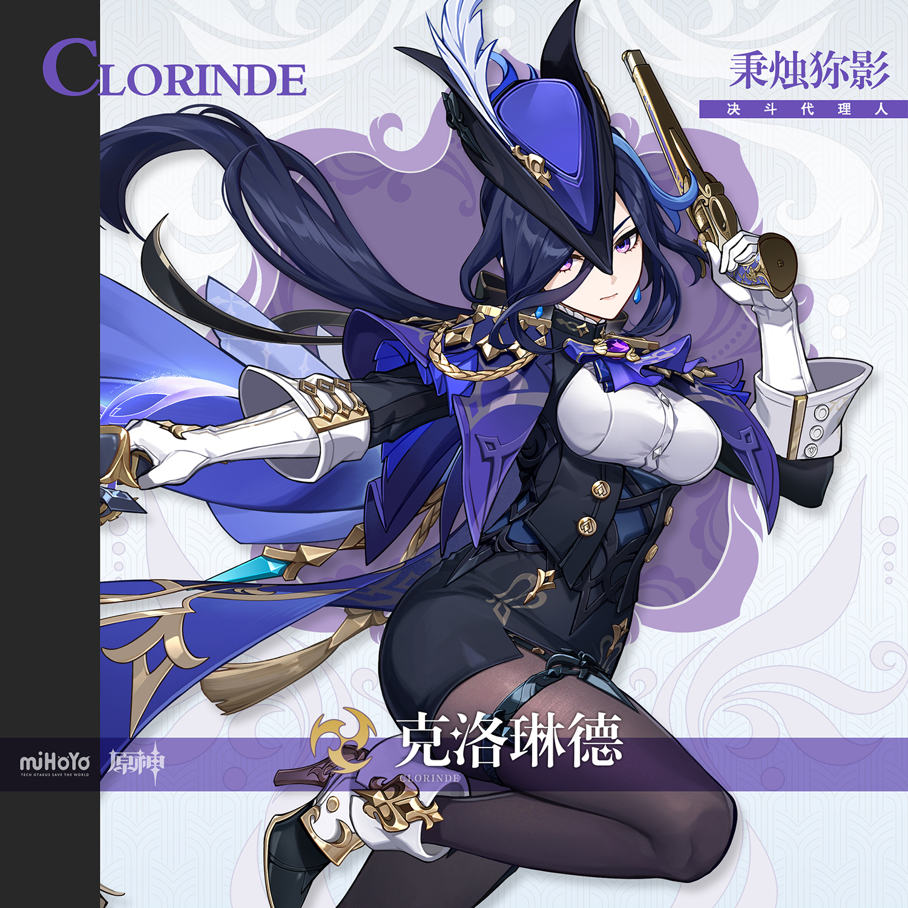
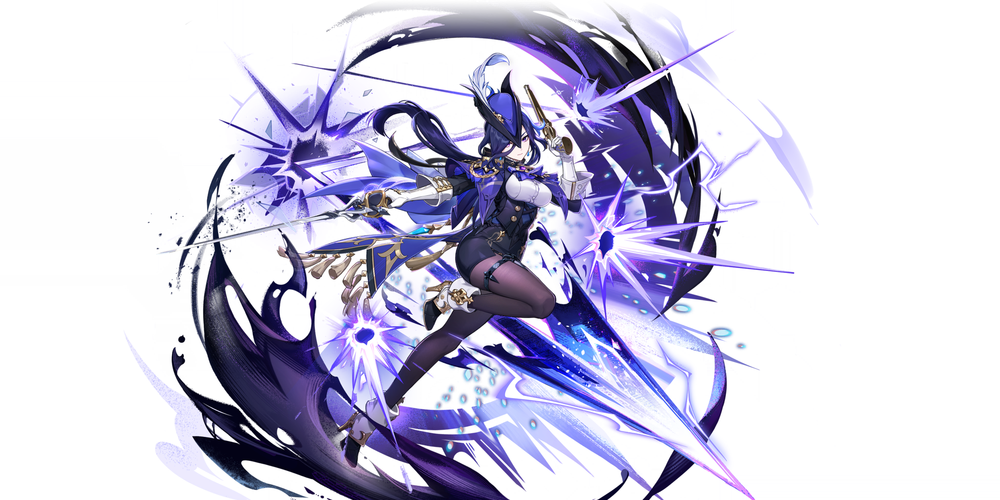
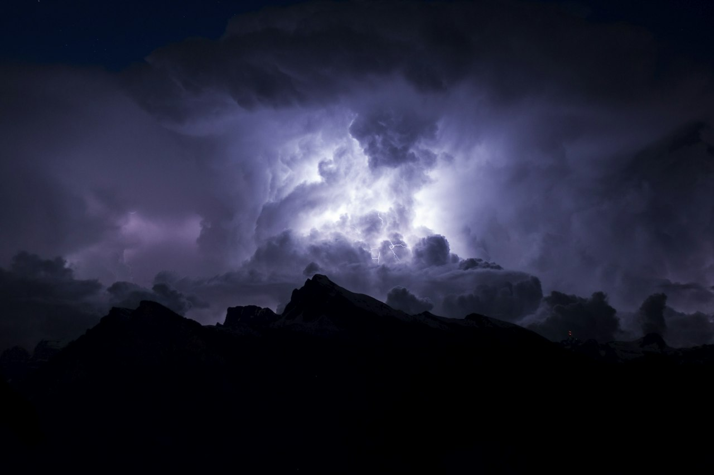

# 克洛琳德 Clorinde — 2026.09.24
> 视频类型：A · 角色单人壁纸合集
> 角色来源：原神 4.7 实装 · 五星雷属性单手剑（刺剑「赦罪」+ 铳枪双武器）
> 身份：枫丹审判庭「决斗代理人」，代理决斗生涯零败绩；「逐影猎人」衣钵继承者（师父佩特洛妮拉）
> 称号：秉烛狝影 ｜ 命之座：迅捷剑座 ｜ 生日：9月20日（本周刚过生日）｜ CV：赵涵雨 / 石川由依
> 设计参考：19世纪法国海军制服 × 欧洲司法决斗（Trial by combat）× 侠客佐罗（普攻三段划 Z 致敬）× 塔索史诗《耶路撒冷的解放》女战士克洛琳达
> 热点背景：原神 7.1「往冥府的安魂歌」9/23 上线 + 六周年庆，限定五星自选池（白术/瓦雷莎/千织/妮露/达达利亚/克洛琳德）为当前社区头号热议话题，「自选选谁」攻略与二创刷屏；米游社发疯文学热帖《论为什么自选五星优先克洛琳德0+0：克洛琳德有骆驼》病毒式传播；克洛琳德 9/20 生日余热未散。
> 选定类型与角色理由：类型 A。维度评分——官方热点 40%（周年庆自选池六位候选之一，正在风口）＋社区热度 25%（骆驼发疯文学、强度排序争议「瓦雷莎>克洛琳德」引战流量）＋时事契合 20%（9/20 生日当周）＋素材覆盖 15%（工作区 22 位原神角色中未覆盖，自选池六人中瓦雷莎/千织/妮露/达达利亚已做过，白术为男性候选）。性别系数：女性角色 ×1.0，未触发调整。
> 参考图校对：splash-art.png（战斗立绘）、gacha-art.png（抽卡立绘）已经视觉工具逐张确认——深蓝近黑长发（浅蓝挑染、黑色蝴蝶结低马尾、长刘海）、紫罗兰瞳、左耳蓝色水滴耳坠、藏蓝三角侧边帽（白色羽毛+金饰）、白色立领蓬袖衬衫、紫蓝领巾配金色绶带、颈挂雷元素神之眼、藏蓝金扣束腰马甲、深蓝金边披风、白色长手套（金色护甲袖口）、黑色紧身短裤、黑色连裤袜（左腿蓝色腿环）、黑白金翻边金属高跟靴；武器为银色刺剑 + 金色燧发铳枪，双武器立绘完整入镜。
> 伴生元素：无伴生生物；标志性武器（刺剑+铳枪）已在官方立绘完整确认，无需单独找图。

# 必需1 — 涂鸦墙街头风

Positive Prompt:
Refer to the attached reference image (Figure 1). Generate a similar style image of Clorinde from Genshin Impact sitting casually in front of a bold graffiti wall. Clorinde is seated in a relaxed but confident posture, leaning back against the graffiti wall with one knee raised, her other leg stretched out casually, one arm resting on her raised knee, with her body language calm, controlled, and slightly provocative. Her expression should show cold, disdainful eyes, aloof, sharp, and superior, as if she is silently judging the viewer — the undefeated duelist appraising an unworthy challenger.

Keep Clorinde's recognizable features: long dark navy-blue hair with a light-blue streak, tied in a low ponytail with a black ribbon, long bangs framing her face, violet eyes, a blue teardrop earring on her left ear, and her slender feminine figure. Blend her canonical design with a modern edgy streetwear aesthetic: a sleeveless navy crop top under an open cropped dark-blue biker jacket with gold zippers half-slipped off her shoulders, high-waisted black denim shorts showing most of her legs, sheer black thigh-high stockings with a blue garter strap echoing her canonical thigh ring, chunky black platform sneakers, a gold chain necklace with a small rapier-shaped pendant, and stud earrings. Preserve her identity while giving her a fresh urban street-style look.

The graffiti wall behind her should be vivid and layered, full of expressive abstract shapes and energetic street-art textures in deep navy blue and violet-purple tones, with graffiti elements including "CLORINDE" in sharp blade-like lettering, stylized lightning bolt tags, a rapier-and-flintlock crossed silhouette, and the Fontaine court scales motif, creating a rebellious urban backdrop that resonates with her champion duelist theme. Add subtle violet electro energy crackling along her fingertips, floating purple sparks, and a couple of spray paint cans placed at the corner of the frame as props.

Use a wide cinematic framing suitable for a 16:9 2K wallpaper, with Clorinde as the main focal point while still showing enough of the graffiti wall and surrounding environment for atmosphere. The mood should feel cool, stylish, intimidating, and mysterious. Highly detailed background, rich shadows, violet-blue glowing highlights, sharp focus on Clorinde, and a refined high-end anime illustration look.

Negative Prompt: low quality, worst quality, blurry, pixelated, bad anatomy, extra limbs, bad hands, extra fingers, fewer fingers, missing fingers, fused fingers, webbed fingers, merged fingers, overlapping fingers, deformed fingers, mutated fingers, six fingers, four fingers, three fingers, more than five fingers, less than five fingers, disfigured hands, poorly drawn hands, bad hand anatomy, asymmetrical hands, broken fingers, claw hands, blurry hands, indistinct fingers, smeared hands, twisted legs, rotated hips, dislocated hip, extra legs, third leg, fused legs, malformed knees, elongated calves, deformed feet, chibi, photorealistic, wrong hair color, wrong eye color, incorrect character, text, watermark, logo, signature, standing, standing pose, upright posture, singing, open mouth singing, warm smile, gentle smile, cheerful expression, cute expression, adorable, sweet, innocent, game canonical outfit, official costume, fantasy dress, medieval clothing, armor, full gown, formal dress, beach background, ocean background, nature background, indoor background, plain background, minimal background, missing graffiti wall, low detail graffiti, generic graffiti, wrong graffiti colors, wrong streetwear, missing crop top, missing jacket, missing shorts, missing skirt, long dress, full pants, business suit, school uniform

# 必需2 — 角色特写肖像

## 2 — 特写肖像 16:9 横版（决斗挑战书半遮面）

Positive Prompt:
Refer to the attached reference image (Figure 2). Generate a cinematic close-up portrait of Clorinde from Genshin Impact. She holds a half-unfurled duel summons letter sealed with deep-red wax close to the left side of her face, the curled parchment edge crossing her cheek, partially obscuring her left eye. Through the gap between parchment and cheek, the violet iris of her covered eye is faintly visible. Her visible right eye gazes directly at the viewer — simultaneously inviting and threatening, the look of someone deciding whether to kiss you or kill you. Expression: the poised chin of a duelist who has never lost, with the barest hint of a curve at the corner of her lips that never reaches a smile, as if the sealed letter amuses her and condemns its sender at the same time. Dramatic single-source lighting from the upper left casts deep chiaroscuro across her features, the parchment edge glowing warm amber where the light passes through, a faint violet electro shimmer tracing the wax seal. Her pale skin contrasts sharply against a pure black background. Her signature long dark navy-blue hair with its light-blue streak falls along the shadowed side of her face, only the black ribbon of her low ponytail catching the light; her white high collar and purple-blue cravat with the electro vision are only barely visible at the collar. A sword that never doubts — justice is simple for her, even when her heart is not. 16:9 2K wallpaper. Perfect hands, five fingers on each hand, anatomically correct hands, well-defined fingers, natural hand pose, detailed hands, clean finger separation.

Negative Prompt: low quality, worst quality, blurry, pixelated, bad anatomy, extra limbs, bad hands, extra fingers, fewer fingers, missing fingers, fused fingers, webbed fingers, merged fingers, overlapping fingers, deformed fingers, mutated fingers, six fingers, four fingers, three fingers, more than five fingers, less than five fingers, disfigured hands, poorly drawn hands, bad hand anatomy, asymmetrical hands, broken fingers, claw hands, blurry hands, indistinct fingers, smeared hands, twisted legs, rotated hips, dislocated hip, extra legs, third leg, fused legs, malformed knees, elongated calves, deformed feet, chibi, photorealistic, wrong hair color, wrong eye color, incorrect character, text, watermark, logo, signature, full body shot, wide shot, landscape, multiple subjects, busy background, bright cheerful lighting, outdoor scene, action pose, weapon drawn

## 3 — 特写肖像 9:20 手机竖屏版（同一设定，胸像构图）

Positive Prompt:
Refer to the attached reference image (Figure 2). Generate a cinematic close-up portrait of Clorinde from Genshin Impact, framed chest-up for a vertical phone wallpaper. She holds a half-unfurled duel summons letter sealed with deep-red wax close to the left side of her face, the curled parchment edge crossing her cheek, partially obscuring her left eye. Through the gap between parchment and cheek, the violet iris of her covered eye is faintly visible. Her visible right eye gazes directly at the viewer — simultaneously inviting and threatening, the look of someone deciding whether to kiss you or kill you. Expression: the poised chin of a duelist who has never lost, with the barest hint of a curve at the corner of her lips that never reaches a smile, as if the sealed letter amuses her and condemns its sender at the same time. Dramatic single-source lighting from the upper left casts deep chiaroscuro across her features, the parchment edge glowing warm amber where the light passes through, a faint violet electro shimmer tracing the wax seal. Her pale skin contrasts sharply against a pure black background. Her signature long dark navy-blue hair with its light-blue streak falls along the shadowed side of her face; her white high collar and purple-blue cravat with the electro vision are visible only at the bottom edge of the frame. A sword that never doubts — justice is simple for her, even when her heart is not. 9:20 vertical mobile wallpaper. Perfect hands, five fingers on each hand, anatomically correct hands, well-defined fingers, natural hand pose, detailed hands, clean finger separation.

Negative Prompt: low quality, worst quality, blurry, pixelated, bad anatomy, extra limbs, bad hands, extra fingers, fewer fingers, missing fingers, fused fingers, webbed fingers, merged fingers, overlapping fingers, deformed fingers, mutated fingers, six fingers, four fingers, three fingers, more than five fingers, less than five fingers, disfigured hands, poorly drawn hands, bad hand anatomy, asymmetrical hands, broken fingers, claw hands, blurry hands, indistinct fingers, smeared hands, twisted legs, rotated hips, dislocated hip, extra legs, third leg, fused legs, malformed knees, elongated calves, deformed feet, chibi, photorealistic, wrong hair color, wrong eye color, incorrect character, text, watermark, logo, signature, full body shot, wide shot, lower body, legs, feet, landscape, multiple subjects, busy background, bright cheerful lighting, outdoor scene, action pose, weapon drawn

# 人物设定

## 4 — 枫丹审判庭 · 代理决斗瞬间（角色设定场景①）

Positive Prompt:
16:9 2K wallpaper, highly detailed anime-style illustration of Clorinde from Genshin Impact inside the grand opera-house courtroom of Fontaine. She stands at the center of the dueling floor, captured at the exact moment of drawing her slender silver rapier, the blade halfway out and catching a blade of cold light, her golden flintlock pistol holstered at her hip. Long dark navy-blue hair with a light-blue streak, tied in a low ponytail with a black ribbon, violet eyes calm and absolute, blue teardrop earring, navy bicorne side hat with a white feather plume, white high-collared blouse with puffed shoulders, purple-blue cravat with a gold rope aiguillette and her purple electro vision at the neck, dark navy corset-vest with gold buttons, deep blue cape with gold trim flowing behind her, white long gloves with gold armored cuffs, black tight shorts, black pantyhose with a blue garter strap on her left thigh, black-white-gold high-heel boots with metal heels. Around her, towering gilded balconies packed with shadowed spectators, a massive mechanical orrery chandelier overhead, dramatic god-rays cutting through tall arched windows, dust motes suspended in the light. The crowd leans forward in silence; her unseen challenger has already lost. Cool blue-violet color scheme with warm gold accents, cinematic rim lighting outlining her silhouette, sharp focus on Clorinde, epic judicial-theater atmosphere. Perfect hands, five fingers on each hand, anatomically correct hands, well-defined fingers, natural hand pose, detailed hands, clean finger separation, fingers elegantly curled around the rapier hilt.

Negative Prompt: low quality, worst quality, blurry, pixelated, bad anatomy, extra limbs, bad hands, extra fingers, fewer fingers, missing fingers, fused fingers, webbed fingers, merged fingers, overlapping fingers, deformed fingers, mutated fingers, six fingers, four fingers, three fingers, more than five fingers, less than five fingers, disfigured hands, poorly drawn hands, bad hand anatomy, asymmetrical hands, broken fingers, claw hands, blurry hands, indistinct fingers, smeared hands, twisted legs, rotated hips, dislocated hip, extra legs, third leg, fused legs, malformed knees, elongated calves, deformed feet, chibi, photorealistic, wrong hair color, wrong eye color, incorrect character, text, watermark, logo, signature, modern clothing, streetwear, casual clothes, beach, warm smile, cheerful

## 5 — 秉烛狝影 · 逐影猎人夜猎（角色设定场景②）

Positive Prompt:
16:9 2K wallpaper, highly detailed anime-style illustration of Clorinde from Genshin Impact on a midnight hunt as the successor of the Marechaussee Hunters. She walks alone along a rain-slick cobblestone quay outside Fontaine's city walls, lantern light from a single iron streetlamp carving her out of the fog. Her deep blue cape is turned inside-out to reveal the embroidered hunter's crest on its lining, glowing faintly in the lamplight. Long dark navy-blue hair with a light-blue streak, low ponytail tied with a black ribbon, violet eyes scanning the darkness with a hunter's patience, navy bicorne hat with white feather, white high-collared blouse, purple-blue cravat with electro vision, dark navy corset-vest with gold buttons, white long gloves, black tight shorts and black pantyhose with a blue garter strap, high-heel boots striking wet stone. Her silver rapier rests loose in her right hand, tip lowered but ready; her left hand holds a brass hunter's lantern, its candle flame bending in the wind. In the mist behind her, the glowing eyes of a lurking monster reflect the lantern light — the hunted does not yet know it is being hunted. Wet reflections on cobblestones, drifting fog, cold blue night palette pierced by the warm candle glow and faint violet electro sparks along her blade, noir-fantasy atmosphere, cinematic composition with Clorinde on the left third of the frame. Perfect hands, five fingers on each hand, anatomically correct hands, well-defined fingers, natural hand pose, detailed hands, clean finger separation.

Negative Prompt: low quality, worst quality, blurry, pixelated, bad anatomy, extra limbs, bad hands, extra fingers, fewer fingers, missing fingers, fused fingers, webbed fingers, merged fingers, overlapping fingers, deformed fingers, mutated fingers, six fingers, four fingers, three fingers, more than five fingers, less than five fingers, disfigured hands, poorly drawn hands, bad hand anatomy, asymmetrical hands, broken fingers, claw hands, blurry hands, indistinct fingers, smeared hands, twisted legs, rotated hips, dislocated hip, extra legs, third leg, fused legs, malformed knees, elongated calves, deformed feet, chibi, photorealistic, wrong hair color, wrong eye color, incorrect character, text, watermark, logo, signature, modern city, cars, daylight, sunny, crowd, warm smile

## 6 — 现代风改造 · 击剑俱乐部女教练

Positive Prompt:
16:9 2K wallpaper, highly detailed anime-style illustration of Clorinde from Genshin Impact reimagined as an elegant fencing coach in a modern Parisian fencing salle. She stands beside a piste strip in a high-ceilinged training hall with tall arched windows and evening light, her white fencing jacket worn open and half-slipped off one shoulder over a fitted navy athletic top, navy fencing breeches and white socks, fencing shoes, her fencing mask tucked casually under her left arm, a modern epee held loosely in her right hand with the tip resting on the floor. Long dark navy-blue hair with a light-blue streak, low ponytail with a black ribbon, violet eyes, blue teardrop earring, no hat — a thin navy headband instead. Her expression is cool and appraising, one eyebrow slightly raised as if wordlessly telling a student their footwork is wrong. Other blurred students practice in the soft-focus background. Polished wooden floor reflections, cool blue evening tones with warm window light, sporty-elegant atmosphere, sharp focus on Clorinde. Perfect hands, five fingers on each hand, anatomically correct hands, well-defined fingers, natural hand pose, detailed hands, clean finger separation, relaxed grip on the epee.

Negative Prompt: low quality, worst quality, blurry, pixelated, bad anatomy, extra limbs, bad hands, extra fingers, fewer fingers, missing fingers, fused fingers, webbed fingers, merged fingers, overlapping fingers, deformed fingers, mutated fingers, six fingers, four fingers, three fingers, more than five fingers, less than five fingers, disfigured hands, poorly drawn hands, bad hand anatomy, asymmetrical hands, broken fingers, claw hands, blurry hands, indistinct fingers, smeared hands, twisted legs, rotated hips, dislocated hip, extra legs, third leg, fused legs, malformed knees, elongated calves, deformed feet, chibi, photorealistic, wrong hair color, wrong eye color, incorrect character, text, watermark, logo, signature, game canonical outfit, armor, fantasy background, mask on face, helmet covering face

## 7 — 情感反差 · 德波大饭店的一人食（「猎获」）

Positive Prompt:
16:9 2K wallpaper, highly detailed anime-style illustration of Clorinde from Genshin Impact off duty at a quiet corner table of a warm Fontaine brasserie late at night. Work is work, life is life — the courtroom's blade now sits with her navy bicorne hat and gold-trimmed cape set neatly aside on the adjacent chair, her white high-collared blouse slightly loosened at the collar, purple-blue cravat still in place. Long dark navy-blue hair with a light-blue streak, low ponytail with black ribbon, violet eyes softened by candlelight, blue teardrop earring. Before her, a beautifully plated orange-glazed duck breast — her signature dish — steam rising gently, a fork and knife held with the same precise elegance she gives her rapier. Her expression is quietly content, the faintest private smile she would never allow in court, eyes lowered to the meal. Warm amber candlelight, dark wood interior, rain streaking the window beside her, blurred waiters in the background, cozy intimate bistro atmosphere contrasting her usual cold lethality, warm gold and soft brown palette with her navy-blue accents. Perfect hands, five fingers on each hand, anatomically correct hands, well-defined fingers, natural hand pose, detailed hands, clean finger separation, correct cutlery grip.

Negative Prompt: low quality, worst quality, blurry, pixelated, bad anatomy, extra limbs, bad hands, extra fingers, fewer fingers, missing fingers, fused fingers, webbed fingers, merged fingers, overlapping fingers, deformed fingers, mutated fingers, six fingers, four fingers, three fingers, more than five fingers, less than five fingers, disfigured hands, poorly drawn hands, bad hand anatomy, asymmetrical hands, broken fingers, claw hands, blurry hands, indistinct fingers, smeared hands, twisted legs, rotated hips, dislocated hip, extra legs, third leg, fused legs, malformed knees, elongated calves, deformed feet, chibi, photorealistic, wrong hair color, wrong eye color, incorrect character, text, watermark, logo, signature, weapon, battlefield, crowd, fish dish

## 8 — 热点特别版 · 「克洛琳德有骆驼」（周年庆自选梗致敬）

Positive Prompt:
16:9 2K wallpaper, highly detailed anime-style illustration of Clorinde from Genshin Impact in a tongue-in-cheek anniversary scene honoring the viral community meme "Clorinde has a camel". On a sunlit Fontaine street during the anniversary festival, Clorinde stands in her full canonical outfit — navy bicorne hat with white feather, white high-collared blouse, purple-blue cravat with electro vision, dark navy corset-vest with gold buttons, deep blue gold-trimmed cape, white long gloves, black shorts, black pantyhose with blue garter strap, high-heel boots — holding a velvet rope lead attached to a single dignified dromedary camel standing beside her. The camel wears a tiny matching navy bicorne hat with a white feather. Clorinde's expression is perfectly deadpan, the icy stare of an undefeated duelist who cannot believe this is her life now, one white-gloved hand on her hip, the other holding the rope with aristocratic resignation. Confetti and anniversary banners overhead, blurred celebrating crowd and festival stalls in the background, warm golden daylight. The contrast between her lethal elegance and the utterly serious camel creates quiet comedy. Perfect hands, five fingers on each hand, anatomically correct hands, well-defined fingers, natural hand pose, detailed hands, clean finger separation.

Negative Prompt: low quality, worst quality, blurry, pixelated, bad anatomy, extra limbs, bad hands, extra fingers, fewer fingers, missing fingers, fused fingers, webbed fingers, merged fingers, overlapping fingers, deformed fingers, mutated fingers, six fingers, four fingers, three fingers, more than five fingers, less than five fingers, disfigured hands, poorly drawn hands, bad hand anatomy, asymmetrical hands, broken fingers, claw hands, blurry hands, indistinct fingers, smeared hands, twisted legs, rotated hips, dislocated hip, extra legs, third leg, fused legs, malformed knees, elongated calves, deformed feet, chibi, photorealistic, wrong hair color, wrong eye color, incorrect character, text, watermark, logo, signature, two humps camel, riding the camel, desert background, slapstick, exaggerated cartoon style

# 动漫性感风 — 2D 日漫简约背景系列（四比例 · 泳装系）

> 统一设定：同一套泳装系服装 + 同一场景（月夜静谧海湾）+ 同一动态焦点（紫雷微光粒子），四条仅变化构图与姿势。

## 9 — 手机壁纸 9:20（月下海风 · 半身居中）

Positive Prompt:
9:20 vertical mobile wallpaper, 2D Japanese anime style, flat cel shading, clean thin lineart, soft anime coloring, Japanese anime aesthetic. Clorinde from Genshin Impact in a tasteful swimwear look: a deep navy bandeau-style bikini one-piece swimsuit with delicate gold trim echoing her canonical gold accents, a sheer semi-transparent navy chiffon sarong knotted loosely at her hip, a thin gold anklet, and her signature blue teardrop earring; long dark navy-blue hair with a light-blue streak tied in a low ponytail with a black ribbon, violet eyes, fair skin. She stands centered in a waist-up composition with her weight on one hip in a natural, elegant stance, one hand gently brushing her hair aside, the other relaxed at her side, gazing at the viewer with a composed, quietly confident expression. Tasteful and elegant throughout, no explicit content. Simple anime scenery background, clean minimal scene composition, Ghibli-inspired soft background: a flat tranquil moonlit bay under a soft gradient indigo night sky with one low moon and its thin reflection path on the calm water, flat background with simple shapes and soft colors in muted blue-violet tones echoing her palette; a few luminous violet electro sparks drifting slowly upward as the single dynamic focal element. Soft even lighting, gentle rim light in violet. Perfect hands, five fingers on each hand, anatomically correct hands, well-defined fingers, natural hand pose, detailed hands, clean finger separation.

Negative Prompt: low quality, worst quality, blurry, pixelated, bad anatomy, extra limbs, bad hands, extra fingers, fewer fingers, missing fingers, fused fingers, webbed fingers, merged fingers, overlapping fingers, deformed fingers, mutated fingers, six fingers, four fingers, three fingers, more than five fingers, less than five fingers, disfigured hands, poorly drawn hands, bad hand anatomy, asymmetrical hands, broken fingers, claw hands, blurry hands, indistinct fingers, smeared hands, twisted legs, rotated hips, dislocated hip, extra legs, third leg, fused legs, malformed knees, elongated calves, deformed feet, wrong hair color, wrong eye color, incorrect character, text, watermark, logo, signature, 3D render, semi-realistic, realistic, painterly, thick oil paint, game 3D model, complex background, cluttered background, multiple overlapping scenes, busy props, heavy details, photorealistic background, weapon combat, fighting, blood, gore, nude, topless, nipples, areola, explicit, childlike, loli, underage

## 10 — 电脑壁纸 16:9（海岸回眸 · 侧位留白）

Positive Prompt:
16:9 desktop wallpaper, 2D Japanese anime style, flat cel shading, clean thin lineart, soft anime coloring, Japanese anime aesthetic. Clorinde from Genshin Impact in a tasteful swimwear look: a deep navy bandeau-style bikini one-piece swimsuit with delicate gold trim, a sheer semi-transparent navy chiffon sarong knotted loosely at her hip, a thin gold anklet, and her signature blue teardrop earring; long dark navy-blue hair with a light-blue streak tied in a low ponytail with a black ribbon, violet eyes, fair skin. She stands on the right side of the frame in a full-body composition with generous negative space on the left, looking back over her shoulder toward the viewer with a composed, quietly confident expression, her ponytail and sarong hem caught in a gentle sea breeze, arms relaxed at her sides. Tasteful and elegant throughout, no explicit content. Simple anime scenery background, clean minimal scene composition, Ghibli-inspired soft background: a flat tranquil moonlit bay under a soft gradient indigo night sky with one low moon and its thin reflection path on the calm water, flat background with simple shapes and soft colors in muted blue-violet tones echoing her palette; a few luminous violet electro sparks drifting slowly upward as the single dynamic focal element. Soft even lighting, gentle rim light in violet. Perfect hands, five fingers on each hand, anatomically correct hands, well-defined fingers, natural hand pose, detailed hands, clean finger separation, hands relaxed at sides.

Negative Prompt: low quality, worst quality, blurry, pixelated, bad anatomy, extra limbs, bad hands, extra fingers, fewer fingers, missing fingers, fused fingers, webbed fingers, merged fingers, overlapping fingers, deformed fingers, mutated fingers, six fingers, four fingers, three fingers, more than five fingers, less than five fingers, disfigured hands, poorly drawn hands, bad hand anatomy, asymmetrical hands, broken fingers, claw hands, blurry hands, indistinct fingers, smeared hands, twisted legs, rotated hips, dislocated hip, extra legs, third leg, fused legs, malformed knees, elongated calves, deformed feet, wrong hair color, wrong eye color, incorrect character, text, watermark, logo, signature, 3D render, semi-realistic, realistic, painterly, thick oil paint, game 3D model, complex background, cluttered background, multiple overlapping scenes, busy props, heavy details, photorealistic background, weapon combat, fighting, blood, gore, nude, topless, nipples, areola, explicit, childlike, loli, underage

## 11 — iPad 壁纸 4:3（月浴闲息 · 居中半身）

Positive Prompt:
4:3 tablet wallpaper, 2D Japanese anime style, flat cel shading, clean thin lineart, soft anime coloring, Japanese anime aesthetic. Clorinde from Genshin Impact in a tasteful swimwear look: a deep navy bandeau-style bikini one-piece swimsuit with delicate gold trim, a sheer semi-transparent navy chiffon sarong knotted loosely at her hip, a thin gold anklet, and her signature blue teardrop earring; long dark navy-blue hair with a light-blue streak tied in a low ponytail with a black ribbon, fair skin. Centered waist-up composition: her eyes are closed with a faint, content half-smile, head slightly tilted as if savoring the night sea breeze, both hands resting loosely at her sides. Tasteful and elegant throughout, no explicit content. Simple anime scenery background, clean minimal scene composition, Ghibli-inspired soft background: a flat tranquil moonlit bay under a soft gradient indigo night sky with one low moon and its thin reflection path on the calm water, flat background with simple shapes and soft colors in muted blue-violet tones echoing her palette; a few luminous violet electro sparks drifting slowly upward as the single dynamic focal element. Soft even lighting, gentle rim light in violet. Perfect hands, five fingers on each hand, anatomically correct hands, well-defined fingers, natural hand pose, detailed hands, clean finger separation, hands relaxed at sides.

Negative Prompt: low quality, worst quality, blurry, pixelated, bad anatomy, extra limbs, bad hands, extra fingers, fewer fingers, missing fingers, fused fingers, webbed fingers, merged fingers, overlapping fingers, deformed fingers, mutated fingers, six fingers, four fingers, three fingers, more than five fingers, less than five fingers, disfigured hands, poorly drawn hands, bad hand anatomy, asymmetrical hands, broken fingers, claw hands, blurry hands, indistinct fingers, smeared hands, twisted legs, rotated hips, dislocated hip, extra legs, third leg, fused legs, malformed knees, elongated calves, deformed feet, wrong hair color, wrong eye color, incorrect character, text, watermark, logo, signature, 3D render, semi-realistic, realistic, painterly, thick oil paint, game 3D model, complex background, cluttered background, multiple overlapping scenes, busy props, heavy details, photorealistic background, weapon combat, fighting, blood, gore, nude, topless, nipples, areola, explicit, childlike, loli, underage

## 12 — 阔折叠壁纸 √2:1（月海新岸 · 横向极简留白）

Positive Prompt:
√2:1 (1.414:1) foldable phone unfolded wallpaper, 2D Japanese anime style, flat cel shading, clean thin lineart, soft anime coloring, Japanese anime aesthetic. Clorinde from Genshin Impact in a tasteful swimwear look: a deep navy bandeau-style bikini one-piece swimsuit with delicate gold trim, a sheer semi-transparent navy chiffon sarong knotted loosely at her hip, a thin gold anklet, and her signature blue teardrop earring; long dark navy-blue hair with a light-blue streak tied in a low ponytail with a black ribbon, violet eyes, fair skin. Ultra-minimal horizontal composition: she stands small on the far left of the frame at the edge of a quiet shore, seen from behind at a three-quarter angle, ponytail and sarong hem lifted by the sea wind, gazing out over the moonlit water; the rest of the frame is calm open space. Tasteful and elegant throughout, no explicit content. Simple anime scenery background, clean minimal scene composition, Ghibli-inspired soft background: a flat tranquil moonlit bay under a soft gradient indigo night sky with one low moon and its thin reflection path on the calm water, flat background with simple shapes and soft colors in muted blue-violet tones echoing her palette; a few luminous violet electro sparks drifting slowly upward as the single dynamic focal element. Soft even lighting, gentle rim light in violet. Perfect hands, five fingers on each hand, anatomically correct hands, well-defined fingers, natural hand pose, detailed hands, clean finger separation, hands relaxed at sides.

Negative Prompt: low quality, worst quality, blurry, pixelated, bad anatomy, extra limbs, bad hands, extra fingers, fewer fingers, missing fingers, fused fingers, webbed fingers, merged fingers, overlapping fingers, deformed fingers, mutated fingers, six fingers, four fingers, three fingers, more than five fingers, less than five fingers, disfigured hands, poorly drawn hands, bad hand anatomy, asymmetrical hands, broken fingers, claw hands, blurry hands, indistinct fingers, smeared hands, twisted legs, rotated hips, dislocated hip, extra legs, third leg, fused legs, malformed knees, elongated calves, deformed feet, wrong hair color, wrong eye color, incorrect character, text, watermark, logo, signature, 3D render, semi-realistic, realistic, painterly, thick oil paint, game 3D model, complex background, cluttered background, multiple overlapping scenes, busy props, heavy details, photorealistic background, weapon combat, fighting, blood, gore, nude, topless, nipples, areola, explicit, childlike, loli, underage

# 跨领域参考图

## 13（参考雷暴夜空摄影 · 雷元素氛围融合）

Positive Prompt:
Refer to the attached reference photograph — a real-world night storm: a massive cumulonimbus cloud torn open by violet-white lightning above the black silhouette of a mountain ridge. Generate a highly detailed anime-style illustration of Clorinde from Genshin Impact standing on that same ridge at night, borrowing the photograph's composition, lighting, and atmosphere. Clorinde is seen from a low rear three-quarter angle in her full canonical outfit — navy bicorne hat with white feather, long dark navy-blue hair with a light-blue streak and black-ribbon low ponytail, white high-collared blouse, purple-blue cravat with electro vision, dark navy corset-vest with gold buttons, deep blue gold-trimmed cape billowing in the storm wind, white long gloves, black shorts and black pantyhose with blue garter strap, high-heel boots planted on wet rock. Her silver rapier is raised toward the storm, and the lightning answers her: a violet bolt splits the cloud exactly above her blade, electro energy crawling down the steel and across her silhouette. Keep her face, hair, and signature accessories crisp and clearly the game character, while the sky, storm light, and mood fuse with the photograph's raw natural grandeur. Deep indigo and violet color scheme, blinding white lightning core, rain threads backlit by the flash, epic lone-figure-against-the-storm composition, 16:9 2K wallpaper. Perfect hands, five fingers on each hand, anatomically correct hands, well-defined fingers, natural hand pose, detailed hands, clean finger separation, firm sword grip.

Negative Prompt: low quality, worst quality, blurry, pixelated, bad anatomy, extra limbs, bad hands, extra fingers, fewer fingers, missing fingers, fused fingers, webbed fingers, merged fingers, overlapping fingers, deformed fingers, mutated fingers, six fingers, four fingers, three fingers, more than five fingers, less than five fingers, disfigured hands, poorly drawn hands, bad hand anatomy, asymmetrical hands, broken fingers, claw hands, blurry hands, indistinct fingers, smeared hands, twisted legs, rotated hips, dislocated hip, extra legs, third leg, fused legs, malformed knees, elongated calves, deformed feet, chibi, photorealistic, wrong hair color, wrong eye color, incorrect character, text, watermark, logo, signature, daylight, calm sky, city background, crowd

## 14（参考古典油画《贺拉斯兄弟之誓》· 司法决斗主题融合 · 未附图源文件）

> 注：本条参考雅克-路易·大卫新古典主义名画《贺拉斯兄弟之誓》（Oath of the Horatii）的构图理念——三把剑交汇于画面中心的宣誓瞬间。Wikimedia/WikiArt 图源本网络不可达，未附图，纯文字描述。

Positive Prompt:
16:9 2K wallpaper, highly detailed anime-style illustration of Clorinde from Genshin Impact composed after Jacques-Louis David's neoclassical painting "Oath of the Horatii" — the solemn moment of sworn duty before combat. In a grand Fontaine hall of three stone arches with dramatic side lighting, Clorinde stands at the compositional center where the swords meet in David's original: her silver rapier raised vertically before her face in a duelist's salute, blade splitting the light, her free hand pressed flat over her heart. Full canonical outfit — navy bicorne hat with white feather, long dark navy-blue hair with a light-blue streak and black-ribbon low ponytail, violet eyes closed in oath-like stillness, white high-collared blouse, purple-blue cravat with electro vision, dark navy corset-vest with gold buttons, deep blue gold-trimmed cape hanging in heavy sculptural folds like classical drapery, white long gloves, black shorts and black pantyhose with blue garter strap, high-heel boots. Behind her, the hall dissolves into warm shadow with muted crimson and ochre tones recalling the painting's palette, her silhouette carved by a single cold shaft of light from the left, faint violet electro veins tracing the floor stones at her feet — the only fantasy element in an otherwise museum-still scene. Neoclassical composition discipline, triangular stability, solemn judicial grandeur, sharp focus on Clorinde. Perfect hands, five fingers on each hand, anatomically correct hands, well-defined fingers, natural hand pose, detailed hands, clean finger separation, fingers elegantly aligned along the salute.

Negative Prompt: low quality, worst quality, blurry, pixelated, bad anatomy, extra limbs, bad hands, extra fingers, fewer fingers, missing fingers, fused fingers, webbed fingers, merged fingers, overlapping fingers, deformed fingers, mutated fingers, six fingers, four fingers, three fingers, more than five fingers, less than five fingers, disfigured hands, poorly drawn hands, bad hand anatomy, asymmetrical hands, broken fingers, claw hands, blurry hands, indistinct fingers, smeared hands, twisted legs, rotated hips, dislocated hip, extra legs, third leg, fused legs, malformed knees, elongated calves, deformed feet, chibi, photorealistic, wrong hair color, wrong eye color, incorrect character, text, watermark, logo, signature, thick oil paint texture, photorealistic painting, multiple swordsmen, crowd, modern clothing, action pose, battle scene

# 注

- 热点依据：7.1 周年庆「限定五星自选」六候选中，瓦雷莎/千织/妮露/达达利亚工作区已覆盖，白术为男性（类型 A 性别系数 0.5 且无非凡例外），克洛琳德为最优未覆盖女性候选；强度社区「瓦雷莎>克洛琳德 vs 有杜林 2 命克洛琳德>1 命瓦雷莎」的争议本身就是流量。
- 玩梗埋点：prompt 8 致敬米游社发疯文学《克洛琳德有骆驼》（塔索史诗考据体，骆驼为梗核心，已通过「戴同款三角帽的骆驼」优雅化处理，不破坏角色气质）。
- 道具考据：特写肖像选用「红蜡封缄决斗挑战书」——对应其职业核心（心怀鬼胎者听闻决斗代理人是克洛琳德小姐即退缩）。
- 动漫性感风：按技能规范选用泳装系（藏青金边连体泳装+透纱围纱），统一场景为月夜静谧海湾，统一动态焦点为紫雷微光粒子；尺度红线已写入 positive（tasteful and elegant throughout, no explicit content）与 negative（nude/topless/nipples/areola/explicit/childlike/loli/underage）。
- 跨领域维度：元素（雷暴摄影，已附图）× 职业/身份（司法决斗 → 大卫《贺拉斯兄弟之誓》，图源不可达纯文字）。
