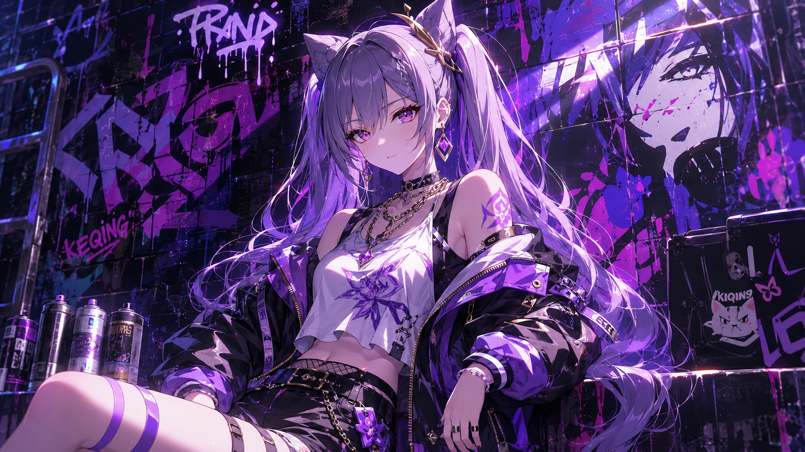
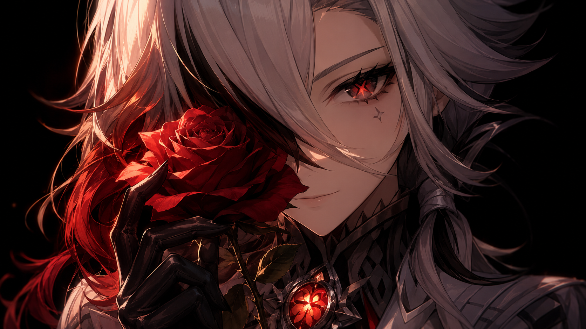

# 刻晴 Keqing — 2026.09.27
> 视频类型：A · 角色单人壁纸合集
> 角色来源：原神 · 五星雷属性单手剑 · 璃月七星之「玉衡星」· 称号「霆霓快雨」· 生日 11月20日
> 热点背景：原神 6 周年庆典正日 9/28（明日），周年福利含自选常驻五星活动「巡历雪境，凝铸锋锐」（刻晴为候选之一）；7.1 版本逐月节主题活动「银翎溯月，玄鸟结璘」进行中（9/24-10/12），璃月主题当下热度最高；崩铁 4.6 今日停服维护、明日上线，但其可做角色（真珠/绯英/风堇）均已覆盖，热度让位原神周年+逐月节
> 选定类型理由：A 类自 9/24 后空缺 3 天（B 类 9/22、C 类 9/25、D 类 9/26 刚做），今日回归 A 类主力节奏；周年庆典+逐月节双热点适合角色深度呈现
> 选定角色理由：女性角色（性别系数 1.0，无需调整）；工作区从未覆盖刻晴单人集（甘雨 9/25 刚以玉兔形象出现在 C 类中秋批次，新鲜度受损，故刻晴胜出）；周年自选常驻候选+逐月节璃月主题双重官方热点契合；社区热度长期 TOP 级（cos/二创常青树，"阿晴""刻师傅"等爱称体系成熟）；雷元素紫色主题色与涂鸦墙参考图（needful1-woman.png 本身即刻晴形象）视觉天然统一
> 参考图说明：✅ 已下载 B站WIKI 官方立绘并视觉校对（splash-art.png 2250px / gacha-art.png 2048px）。发色（深紫渐变银白紫长发、双马尾、头顶翘起发束形似猫耳）、瞳色（品红紫）、服饰（白色露肩上衣+深紫蓝渐变连衣裙+白裙撑、左臂浅蓝纱袖、右手单只黑长手套、黑色连裤袜其中一腿带金色藤蔓纹样、黑色高跟短靴金饰）、配饰（额前金色角状发冠嵌红水晶、白色晶蝶花饰、金蓝耳坠、紫色编绳项链蓝玉坠、肩部深紫羽形饰物）均以参考图为准
> 伴生元素说明：①单手剑（金色剑柄礼剑式单手剑，剑身蓝白，雷元素附魔时呈紫电辉光）已从抽卡立绘确认；②雷楔（元素战技投掷的紫雷印记）为瞬发光效，按能量特效弱化处理；③神之眼（雷，紫色）位于腰后。均为光效/小型道具，无需单独参考图
> 跨领域参考图说明：⚠️ Wikimedia 在本网络环境不可达（连续两次返回 HTML 错误页），跨领域 prompt 采用纯文本描述歌川广重《大桥骤雨》（名画特征明确：木桥、斜线骤雨、斗笠伞影、靛蓝调），未附参考图文件

---

# 必需

## 1 — 涂鸦墙街头风（Graffiti Wall Street Style · 女版公式）

Refer to the attached reference image (Figure 1). Generate a similar style image of Keqing from Genshin Impact sitting casually in front of a bold graffiti wall. Keqing is seated in a relaxed but confident posture, leaning back against the graffiti wall with one knee raised, her other leg bent with her foot planted flat on the ground, one hand resting on the hilt of her sheathed jian propped against her raised knee, her body language calm, controlled, and slightly provocative. Her expression should show cold, disdainful eyes, aloof, sharp, and superior, as if she is silently judging the viewer — the Yuheng of the Liyue Qixing deciding whether your proposal is even worth her review time.

Keep Keqing's recognizable features: long dark-purple hair fading to pale silvery-lavender at the ends, styled in two long flowing twin-tails, two upward tufts of hair on top of her head resembling cat ears, straight-cut bangs, a golden horn-shaped hairpin with a red crystal on her forehead, a white crystal-flower hair ornament, vivid magenta-violet eyes, fair skin, slender feminine figure. Blend her canonical design with a modern edgy streetwear aesthetic: a violet sleeveless crop top under an open cropped black moto jacket with purple lining, dark denim shorts with a studded belt, sheer purple thigh-high stockings, chunky black lace-up platform ankle boots with gold zipper accents, a silver chain necklace with a tiny lightning-bolt pendant echoing her Electro Vision, gold ear cuffs, and a crystal-flower choker. Preserve her identity while giving her a fresh urban street-style look.

The graffiti wall behind her should be vivid and layered, full of expressive abstract shapes and energetic street-art textures in violet, magenta, and gold tones, with graffiti elements including "KEQING" in sharp lightning-cut lettering, purple electro-bolt tags and jagged lightning stencils, silhouettes of her jian sword and the wing-like shoulder ornament of her canonical dress, and dripping spray-paint clouds, creating a rebellious urban backdrop that resonates with her character theme. Add subtle electro energy effects, crackling purple lightning arcs, and faint floating light-purple sword afterimages around her to reinforce her identity.

Use a wide cinematic framing suitable for a 16:9 wallpaper, with Keqing as the main focal point while still showing enough of the graffiti wall and surrounding environment for atmosphere. The mood should feel cool, stylish, intimidating, and mysterious. Highly detailed background, rich shadows, violet glowing highlights, sharp focus on Keqing, and a refined high-end anime illustration look.

perfect hands, five fingers on each hand, anatomically correct hands, well-defined fingers, natural hand pose, one hand resting on the sword hilt propped against her raised knee.

Negative Prompt:
low quality, worst quality, blurry, pixelated, bad anatomy, extra limbs, bad hands, extra fingers, fewer fingers, missing fingers, fused fingers, webbed fingers, merged fingers, overlapping fingers, deformed fingers, mutated fingers, six fingers, four fingers, three fingers, more than five fingers, less than five fingers, disfigured hands, poorly drawn hands, bad hand anatomy, asymmetrical hands, broken fingers, claw hands, blurry hands, indistinct fingers, smeared hands, missing legs, missing feet, cropped legs, legs out of frame, twisted legs, rotated hips, dislocated hip, extra legs, third leg, fused legs, malformed knees, elongated calves, deformed feet, standing, standing pose, upright posture, singing, open mouth singing, warm smile, gentle smile, cheerful expression, cute expression, adorable, sweet, innocent, game canonical outfit, official costume, fantasy dress, medieval clothing, armor, full gown, formal dress, beach background, ocean background, nature background, indoor background, plain background, minimal background, missing graffiti wall, low detail graffiti, generic graffiti, wrong graffiti colors, wrong streetwear, missing crop top, missing jacket, missing shorts, missing skirt, long dress, full pants, business suit, school uniform, male, wrong gender, wrong hair color, wrong eye color, text, watermark, logo, signature.

---

## 2 — 玉衡的硬币（角色特写肖像 / Close-up Portrait · 16:9）

Refer to the attached reference image (Figure 2). Generate a cinematic close-up portrait of Keqing from Genshin Impact. She holds a golden Mora coin embossed with the geometric sigil of Rex Lapis close to the right side of her face, the coin tilted between her gloved fingers, partially obscuring her right eye. Her visible left eye gazes directly at the viewer — defiant and questioning, yet with a flicker of reluctant reverence, the look of the Yuheng who once asked "does he really understand everything?" and now runs a nation in the god's absence. Expression: a proud, skeptical half-smile that never fully hides the faint ache beneath it, as if the coin reminds her of the silence that answered all her questions. Dramatic single-source lighting from the upper left casts deep chiaroscuro across her features, the golden coin glowing warm amber where the light catches its embossed sigil, a faint violet electro shimmer crawling along its edge. Her fair skin contrasts sharply against a pure black background. Her signature dark-purple twin-tails with silvery-lavender ends spill softly across the left side of the frame, the golden horn-shaped hairpin with its red crystal catching a sharp highlight; her white blouse collar and the purple braided cord of her necklace are only barely visible at the bottom edge. A nonbeliever who guards a god's land better than any worshipper. 16:9 2K wallpaper.

perfect hands, five fingers on each hand, anatomically correct hands, well-defined fingers, fingers elegantly tilting the coin between them, gloved hand.

Negative Prompt:
low quality, worst quality, blurry, pixelated, bad anatomy, extra limbs, bad hands, extra fingers, fewer fingers, missing fingers, fused fingers, webbed fingers, merged fingers, overlapping fingers, deformed fingers, mutated fingers, six fingers, four fingers, three fingers, more than five fingers, less than five fingers, disfigured hands, poorly drawn hands, bad hand anatomy, asymmetrical hands, broken fingers, claw hands, blurry hands, indistinct fingers, smeared hands, missing legs, missing feet, cropped legs, legs out of frame, twisted legs, rotated hips, dislocated hip, extra legs, third leg, fused legs, malformed knees, elongated calves, deformed feet, full body shot, wide shot, landscape, multiple subjects, busy background, bright cheerful lighting, outdoor scene, action pose, weapon drawn, standing, chibi, male, wrong gender, wrong hair color, wrong eye color, text, watermark, logo, signature.

---

## 2b — 玉衡的硬币·手机竖屏版（9:20 · 胸部及以上取景）

Positive Prompt:
9:20 vertical mobile wallpaper, cinematic close-up portrait of Keqing from Genshin Impact. Chest-up framing, her face as the focal point of the tall composition, no full body. She holds a golden Mora coin embossed with the geometric sigil of Rex Lapis close to the right side of her face, the coin tilted between her gloved fingers, partially obscuring her right eye. Her visible left eye gazes directly at the viewer — defiant and questioning, yet with a flicker of reluctant reverence, the look of the Yuheng who once asked "does he really understand everything?" and now runs a nation in the god's absence. Expression: a proud, skeptical half-smile that never fully hides the faint ache beneath it, as if the coin reminds her of the silence that answered all her questions. Dramatic single-source lighting from the upper left casts deep chiaroscuro across her features, the golden coin glowing warm amber where the light catches its embossed sigil, a faint violet electro shimmer crawling along its edge. Her fair skin contrasts sharply against a pure black background. Her signature dark-purple twin-tails with silvery-lavender ends frame her face, the golden horn-shaped hairpin with its red crystal catching a sharp highlight; her white blouse collar and the purple braided cord of her necklace are only barely visible at the bottom edge. A nonbeliever who guards a god's land better than any worshipper. perfect hands, five fingers on each hand, anatomically correct hands, well-defined fingers, fingers elegantly tilting the coin between them, gloved hand.

Negative Prompt:
low quality, worst quality, blurry, pixelated, bad anatomy, extra limbs, bad hands, extra fingers, fewer fingers, missing fingers, fused fingers, webbed fingers, merged fingers, overlapping fingers, deformed fingers, mutated fingers, six fingers, four fingers, three fingers, more than five fingers, less than five fingers, disfigured hands, poorly drawn hands, bad hand anatomy, asymmetrical hands, broken fingers, claw hands, blurry hands, indistinct fingers, smeared hands, missing legs, missing feet, cropped legs, legs out of frame, twisted legs, rotated hips, dislocated hip, extra legs, third leg, fused legs, malformed knees, elongated calves, deformed feet, full body shot, wide shot, lower body, legs, feet, landscape, multiple subjects, busy background, bright cheerful lighting, outdoor scene, action pose, weapon drawn, standing, chibi, male, wrong gender, wrong hair color, wrong eye color, text, watermark, logo, signature.

---

# 人物设定

## 3 — 雷楔惊鸿·月下琉璃亭飞檐（标志性场景 / 剧情名场面）

Positive Prompt:
16:9 2K wallpaper, Keqing from Genshin Impact, highly detailed anime-style illustration, polished game-art quality, moonlit Liyue Harbor rooftops at night, dynamic cinematic atmosphere.

Depict Keqing mid-blink-step across the tiled rooftops of Liyue Harbor under a vast full moon, caught in the instant after her Electro Blink — her body dissolving at the trailing edge into a swirl of violet lightning while her leading hand extends forward, fingers spread, a crackling purple Electro sigil (Thunderclap) hovering where she will land. Her unmistakable features: long dark-purple hair fading to silvery-lavender at the ends, twin-tails streaming behind her in the wind, the two cat-ear tufts atop her head, golden horn-shaped hairpin with a red crystal, white crystal-flower ornament, vivid magenta-violet eyes sharp with focus, fair skin. She wears her canonical outfit: white cold-shoulder blouse, dark indigo-violet corset dress with a blue-gradient overskirt and white ruffled petticoat, peacock-feather-shaped dark shoulder ornament, gold cloud-motif chest plate with a red gem, sheer light-blue sleeve on her left arm, a single long black glove on her right hand, black tights with gold vine patterns, black high-heel ankle boots, and her purple Electro Vision at her lower back.

In her right hand she draws her ornate jian with a gold hilt, its blade wreathed in violet electro light as it carves a glowing arc through the night air. perfect hands, five fingers on each hand, anatomically correct hands, well-defined fingers, right hand gripping the sword hilt in a clean downward cut, left hand extended back for balance with fingers naturally spread.

Below her, Liyue Harbor glitters with warm lantern light along the pier and terraced streets, red-corniced buildings and glowing shopfronts receding into misty jade mountains; a few glowing lanterns drift upward. The mood is swift, elegant, and resolute — the Yuheng on her nightly patrol, faster than thunder, quieter than rain. Color palette: deep violet, midnight blue, lantern amber, moon silver.

Negative Prompt:
low quality, worst quality, blurry, pixelated, bad anatomy, extra limbs, bad hands, extra fingers, fewer fingers, missing fingers, fused fingers, webbed fingers, merged fingers, overlapping fingers, deformed fingers, mutated fingers, six fingers, four fingers, three fingers, more than five fingers, less than five fingers, disfigured hands, poorly drawn hands, bad hand anatomy, asymmetrical hands, broken fingers, claw hands, blurry hands, indistinct fingers, smeared hands, missing legs, missing feet, cropped legs, legs out of frame, twisted legs, rotated hips, dislocated hip, extra legs, third leg, fused legs, malformed knees, elongated calves, deformed feet, wrong hair color, wrong eye color, male, wrong gender, modern city, casual modern clothing, chibi, photorealistic, daytime, text, watermark, logo, signature.

## 4 — 玉衡厅加班夜·猫与公文（反差日常场景）

Positive Prompt:
16:9 2K wallpaper, Keqing from Genshin Impact, highly detailed anime-style illustration, polished game-art quality, cozy nighttime office interior, warm intimate atmosphere.

Depict Keqing working late alone in the Yuehai Pavilion's administrative hall, her canonical outfit intact: white cold-shoulder blouse, dark indigo-violet corset dress with blue-gradient overskirt and white ruffled petticoat, peacock-feather shoulder ornament, gold chest plate with red gem, sheer light-blue sleeve on her left arm, single long black glove on her right hand, black tights with gold vine patterns, black high-heel ankle boots. Her unmistakable features: long dark-purple hair fading to silvery-lavender twin-tails draped over one shoulder, cat-ear hair tufts, golden horn-shaped hairpin with red crystal, white crystal-flower ornament, vivid magenta-violet eyes softened by exhaustion, fair skin.

She sits upright at a large rosewood desk stacked with neat towers of documents, one gloved hand pausing a brush stroke above a page while her other hand reaches down to scratch the chin of a plump gray-and-white stray cat curled on a stack of unfiled papers beside an oil lamp. perfect hands, five fingers on each hand, anatomically correct hands, well-defined fingers, right hand holding the brush above the document, left hand gently scratching the cat's chin.

The cat squints in bliss, its tail curled around a fallen purple hair ribbon. Around them: an unlit candle chandelier, a window open to the lantern-lit harbor night, a teacup gone cold beside a small plate of untouched almond tofu, her ornate jian leaning against the desk within arm's reach. Warm lamplight pools across the wood grain. The mood is quiet, tender, and endearing — the most tireless worker in Liyue, defeated for one minute by a cat who wandered in from the rain. Color palette: rosewood brown, lamp amber, violet, moonlit blue.

Negative Prompt:
low quality, worst quality, blurry, pixelated, bad anatomy, extra limbs, bad hands, extra fingers, fewer fingers, missing fingers, fused fingers, webbed fingers, merged fingers, overlapping fingers, deformed fingers, mutated fingers, six fingers, four fingers, three fingers, more than five fingers, less than five fingers, disfigured hands, poorly drawn hands, bad hand anatomy, asymmetrical hands, broken fingers, claw hands, blurry hands, indistinct fingers, smeared hands, missing legs, missing feet, cropped legs, legs out of frame, twisted legs, rotated hips, dislocated hip, extra legs, third leg, fused legs, malformed knees, elongated calves, deformed feet, wrong hair color, wrong eye color, male, wrong gender, combat pose, lightning storm, dark gritty atmosphere, chibi, photorealistic, text, watermark, logo, signature.

---

## 5 — 周年庆特别版·霓虹天台的玉衡女王（现代风改造）

Positive Prompt:
16:9 2K wallpaper, Keqing from Genshin Impact, highly detailed anime-style illustration, polished game-art quality, modern city skyscraper rooftop at night with distant fireworks, glamorous urban celebration atmosphere.

Reimagine Keqing as a powerful modern executive celebrating on a rooftop terrace high above the city on an anniversary night. Her iconic features remain: long dark-purple hair fading to silvery-lavender twin-tails swaying in the night breeze, cat-ear hair tufts, golden horn-shaped hairpin with red crystal, white crystal-flower ornament, vivid magenta-violet eyes, fair skin, gold-and-blue teardrop earrings. Her modernized outfit: a tailored deep-violet velvet blazer over a white silk camisole, a pleated satin midi skirt in gradient indigo with a gold chain belt, sheer black tights, elegant black stiletto heels with gold ankle straps, a delicate lightning-bolt pendant necklace, and a slim gold watch.

She stands at the glass railing of the rooftop, weight on one leg in a natural stance, one hand holding a glass of sparkling grape juice, the other resting on the railing, looking back over her shoulder toward the viewer with a confident, quietly radiant smile as golden fireworks bloom across the sky behind her. perfect hands, five fingers on each hand, anatomically correct hands, well-defined fingers, right hand holding the glass stem elegantly, left hand relaxed on the railing.

Below and beyond her, a glittering city skyline stretches to the horizon, fireworks in violet and gold reflecting in the glass, a banner of celebration lights trailing along the rooftop garden. The mood is triumphant, sophisticated, and festive — six years of watchful guardianship, and the Yuheng allows herself one toast. Color palette: deep violet, champagne gold, night blue, firework silver.

Negative Prompt:
low quality, worst quality, blurry, pixelated, bad anatomy, extra limbs, bad hands, extra fingers, fewer fingers, missing fingers, fused fingers, webbed fingers, merged fingers, overlapping fingers, deformed fingers, mutated fingers, six fingers, four fingers, three fingers, more than five fingers, less than five fingers, disfigured hands, poorly drawn hands, bad hand anatomy, asymmetrical hands, broken fingers, claw hands, blurry hands, indistinct fingers, smeared hands, missing legs, missing feet, cropped legs, legs out of frame, twisted legs, rotated hips, dislocated hip, extra legs, third leg, fused legs, malformed knees, elongated calves, deformed feet, wrong hair color, wrong eye color, male, wrong gender, game canonical outfit, fantasy medieval clothing, armor, chibi, photorealistic, daytime, text, watermark, logo, signature.

## 6 — 雨过天晴·布丁与好天气（情感/日常/私人时刻）

Positive Prompt:
16:9 2K wallpaper, Keqing from Genshin Impact, highly detailed anime-style illustration, polished game-art quality, sunlit Liyue street corner after rain, warm slice-of-life atmosphere.

Depict a rare private moment: the rain has just stopped, puddles mirror the clearing sky, and Keqing — officially "taking a walk because the weather is nice," as her voice line promises — sits at a small outdoor table of a street dessert stall enjoying caramel pudding. Her canonical outfit softly brightened by sunlight: white cold-shoulder blouse, dark indigo-violet corset dress with blue-gradient overskirt and white ruffled petticoat, peacock-feather shoulder ornament, gold chest plate with red gem, sheer light-blue sleeve on her left arm, single long black glove on her right hand, black tights with gold vine patterns, black high-heel ankle boots. Her unmistakable features: dark-purple twin-tails with silvery-lavender ends slightly damp at the tips, cat-ear tufts, golden horn-shaped hairpin with red crystal, white crystal-flower ornament, vivid magenta-violet eyes curved with unguarded contentment, fair skin.

She leans forward slightly over the small table, spoon in her gloved right hand lifting a perfectly trembling spoonful of caramel pudding, her cheeks faintly pink with the simple happiness she would never admit to in a report; beside her on the table, her sword rests against the chair and a folded black umbrella drips its last drops. perfect hands, five fingers on each hand, anatomically correct hands, well-defined fingers, right hand holding the dessert spoon delicately, left hand resting on the table edge.

Around her: glistening wet cobblestones reflecting lilac sky, a half-furled paper umbrella leaning on the stall, steam rising from a teapot, the shopkeeper smiling in the background, a tiny electro spark of joy popping above her head like a sparkle. The mood is gentle, cozy, and secretly sweet — the girl who never rests, caught resting. Color palette: caramel amber, lilac, soft blue, warm white.

Negative Prompt:
low quality, worst quality, blurry, pixelated, bad anatomy, extra limbs, bad hands, extra fingers, fewer fingers, missing fingers, fused fingers, webbed fingers, merged fingers, overlapping fingers, deformed fingers, mutated fingers, six fingers, four fingers, three fingers, more than five fingers, less than five fingers, disfigured hands, poorly drawn hands, bad hand anatomy, asymmetrical hands, broken fingers, claw hands, blurry hands, indistinct fingers, smeared hands, missing legs, missing feet, cropped legs, legs out of frame, twisted legs, rotated hips, dislocated hip, extra legs, third leg, fused legs, malformed knees, elongated calves, deformed feet, wrong hair color, wrong eye color, male, wrong gender, combat pose, storm clouds, dark gritty atmosphere, chibi, photorealistic, text, watermark, logo, signature.

## 7 — 逐月节·六周年灯海特别版（热点主题特别版）

Positive Prompt:
16:9 2K wallpaper, Keqing from Genshin Impact, highly detailed anime-style illustration, polished game-art quality, Moonchase Festival night in Liyue Harbor with thousands of floating lanterns, grand festive atmosphere.

Depict Keqing at the Moonchase Festival celebration during Genshin Impact's sixth anniversary, standing on the stone wharf of Liyue Harbor as thousands of Xiao lanterns rise into the night sky like an inverted galaxy, a colossal golden full moon crowning the jade mountain silhouette. Her canonical outfit: white cold-shoulder blouse, dark indigo-violet corset dress with blue-gradient overskirt and white ruffled petticoat, peacock-feather shoulder ornament, gold chest plate with red gem, sheer light-blue sleeve on her left arm, single long black glove on her right hand, black tights with gold vine patterns, black high-heel ankle boots. Her unmistakable features: dark-purple twin-tails with silvery-lavender ends lifted by the festival breeze, cat-ear tufts, golden horn-shaped hairpin with red crystal, white crystal-flower ornament, vivid magenta-violet eyes reflecting the lantern glow with a rare, unguarded warmth, fair skin.

She holds a small paper lantern with both hands at chest height, just releasing it into the stream of rising lights; its warm glow illuminates her face from below as she watches it ascend. perfect hands, five fingers on each hand, anatomically correct hands, well-defined fingers, both hands cupped gently around the paper lantern.

Around her: festival stalls with steaming dim sum and mooncakes, red-corniced buildings hung with golden streamers, children chasing each other with pinwheels, faint violet electro fireflies of her Vision drifting near her shoulder, and the word "VI" formed subtly by six ascending lanterns as an anniversary tribute. The mood is festive, nostalgic, and luminous — the workaholic who scheduled the festival herself, finally watching the lights she ordered. Color palette: lantern gold, deep violet, indigo night, moon white.

Negative Prompt:
low quality, worst quality, blurry, pixelated, bad anatomy, extra limbs, bad hands, extra fingers, fewer fingers, missing fingers, fused fingers, webbed fingers, merged fingers, overlapping fingers, deformed fingers, mutated fingers, six fingers, four fingers, three fingers, more than five fingers, less than five fingers, disfigured hands, poorly drawn hands, bad hand anatomy, asymmetrical hands, broken fingers, claw hands, blurry hands, indistinct fingers, smeared hands, missing legs, missing feet, cropped legs, legs out of frame, twisted legs, rotated hips, dislocated hip, extra legs, third leg, fused legs, malformed knees, elongated calves, deformed feet, wrong hair color, wrong eye color, male, wrong gender, combat pose, modern city skyline, casual modern clothing, chibi, photorealistic, text, watermark, logo, signature.

---

# 动漫性感风 — 2D 日漫简约背景系列（泳装系 · 四比例）

**系列说明**：四条共用同一套人物设定与背景场景（夏日晴空海岸），泳装为白紫配色的连体比基尼式泳衣 + 透纱罩衫，仅调整构图与姿势。

## 8 — 夏日晴空·手机竖屏版（9:20）

Positive Prompt:
9:20 vertical mobile wallpaper, 2D Japanese anime style, flat cel shading, clean thin lineart, soft anime coloring, Japanese anime aesthetic, Keqing from Genshin Impact, full-body centered composition, simple anime scenery background, clean minimal scene composition, Ghibli-inspired soft background, flat background with simple shapes and soft colors — a pale summer sky with two or three soft clouds and a calm turquoise sea horizon in flat pastel bands.

Keqing wears a white and violet one-piece swimsuit with delicate gold trim, a sheer lavender beach cover-up slipping off one shoulder, and a straw sun hat with a violet ribbon hanging at her back; her signature features unchanged: long dark-purple hair fading to silvery-lavender in twin-tails, cat-ear tufts, golden horn-shaped hairpin with red crystal, white crystal-flower ornament, vivid magenta-violet eyes, fair skin, slender feminine figure.

She stands with her weight on one hip in a natural stance, one hand holding the brim of her straw hat against the sea breeze, the other relaxed at her side holding her sandals by their straps, head slightly tilted with a calm, confident half-smile, eyes gazing toward the viewer. tasteful and elegant throughout, no explicit content. soft even lighting, gentle rim light in violet. perfect hands, five fingers on each hand, anatomically correct hands, well-defined fingers, natural hand pose, correct hip-to-thigh-to-knee anatomy, natural leg proportions, both legs in natural alignment.

Negative Prompt:
low quality, worst quality, blurry, pixelated, bad anatomy, extra limbs, bad hands, extra fingers, fewer fingers, missing fingers, fused fingers, webbed fingers, merged fingers, overlapping fingers, deformed fingers, mutated fingers, six fingers, four fingers, three fingers, more than five fingers, less than five fingers, disfigured hands, poorly drawn hands, bad hand anatomy, asymmetrical hands, broken fingers, claw hands, blurry hands, indistinct fingers, smeared hands, missing legs, missing feet, cropped legs, legs out of frame, twisted legs, rotated hips, dislocated hip, extra legs, third leg, fused legs, malformed knees, elongated calves, deformed feet, 3D render, semi-realistic, realistic, painterly, thick oil paint, game 3D model, complex background, cluttered background, multiple overlapping scenes, busy props, heavy details, photorealistic background, weapon combat, fighting, blood, gore, nude, topless, nipples, areola, explicit, childlike, loli, underage, wrong hair color, wrong eye color, male, text, watermark, logo, signature.

## 9 — 夏日晴空·电脑横屏版（16:9）

Positive Prompt:
16:9 desktop wallpaper, 2D Japanese anime style, flat cel shading, clean thin lineart, soft anime coloring, Japanese anime aesthetic, Keqing from Genshin Impact, she stands on the right side of the frame leaving open breathing space of sky and sea on the left, simple anime scenery background, clean minimal scene composition, Ghibli-inspired soft background, flat background with simple shapes and soft colors — a pale summer sky with a few soft clouds, a calm turquoise sea horizon in flat pastel bands, and a single distant sail.

Keqing wears a white and violet one-piece swimsuit with delicate gold trim, a sheer lavender beach cover-up slipping off one shoulder, and a straw sun hat with a violet ribbon hanging at her back; her signature features unchanged: long dark-purple hair fading to silvery-lavender in twin-tails streaming gently in the breeze, cat-ear tufts, golden horn-shaped hairpin with red crystal, white crystal-flower ornament, vivid magenta-violet eyes, fair skin, slender feminine figure.

She stands with her weight on one hip in a natural stance, one hand holding the brim of her straw hat against the sea breeze, the other relaxed at her side, chin lifted with a calm, confident half-smile, eyes gazing toward the distant sea. tasteful and elegant throughout, no explicit content. soft even lighting, gentle rim light in violet. perfect hands, five fingers on each hand, anatomically correct hands, well-defined fingers, natural hand pose, correct hip-to-thigh-to-knee anatomy, natural leg proportions, both legs in natural alignment.

Negative Prompt:
low quality, worst quality, blurry, pixelated, bad anatomy, extra limbs, bad hands, extra fingers, fewer fingers, missing fingers, fused fingers, webbed fingers, merged fingers, overlapping fingers, deformed fingers, mutated fingers, six fingers, four fingers, three fingers, more than five fingers, less than five fingers, disfigured hands, poorly drawn hands, bad hand anatomy, asymmetrical hands, broken fingers, claw hands, blurry hands, indistinct fingers, smeared hands, missing legs, missing feet, cropped legs, legs out of frame, twisted legs, rotated hips, dislocated hip, extra legs, third leg, fused legs, malformed knees, elongated calves, deformed feet, 3D render, semi-realistic, realistic, painterly, thick oil paint, game 3D model, complex background, cluttered background, multiple overlapping scenes, busy props, heavy details, photorealistic background, weapon combat, fighting, blood, gore, nude, topless, nipples, areola, explicit, childlike, loli, underage, wrong hair color, wrong eye color, male, text, watermark, logo, signature.

## 10 — 夏日晴空·iPad 版（4:3）

Positive Prompt:
4:3 tablet wallpaper, 2D Japanese anime style, flat cel shading, clean thin lineart, soft anime coloring, Japanese anime aesthetic, Keqing from Genshin Impact, centered waist-up composition with the sea horizon behind her shoulders, simple anime scenery background, clean minimal scene composition, Ghibli-inspired soft background, flat background with simple shapes and soft colors — pale summer sky and calm turquoise sea in flat pastel bands.

Keqing wears a white and violet one-piece swimsuit with delicate gold trim, a sheer lavender beach cover-up slipping off one shoulder, straw sun hat with a violet ribbon; her signature features unchanged: long dark-purple hair fading to silvery-lavender in twin-tails, cat-ear tufts, golden horn-shaped hairpin with red crystal, white crystal-flower ornament, vivid magenta-violet eyes, fair skin, slender feminine figure.

She sits upright on a simple wooden beach chair with knees together and feet flat on the sand, one hand resting on her lap holding a chilled glass of violet soda, the other shading her eyes as she smiles gently toward the viewer, a faint playful tilt of her head. tasteful and elegant throughout, no explicit content. soft even lighting, gentle rim light in violet. perfect hands, five fingers on each hand, anatomically correct hands, well-defined fingers, natural hand pose, natural seated posture, correct hip-to-thigh-to-knee anatomy, knees together pointing in the same direction.

Negative Prompt:
low quality, worst quality, blurry, pixelated, bad anatomy, extra limbs, bad hands, extra fingers, fewer fingers, missing fingers, fused fingers, webbed fingers, merged fingers, overlapping fingers, deformed fingers, mutated fingers, six fingers, four fingers, three fingers, more than five fingers, less than five fingers, disfigured hands, poorly drawn hands, bad hand anatomy, asymmetrical hands, broken fingers, claw hands, blurry hands, indistinct fingers, smeared hands, missing legs, missing feet, cropped legs, legs out of frame, twisted legs, rotated hips, dislocated hip, extra legs, third leg, fused legs, malformed knees, elongated calves, deformed feet, 3D render, semi-realistic, realistic, painterly, thick oil paint, game 3D model, complex background, cluttered background, multiple overlapping scenes, busy props, heavy details, photorealistic background, weapon combat, fighting, blood, gore, nude, topless, nipples, areola, explicit, childlike, loli, underage, wrong hair color, wrong eye color, male, text, watermark, logo, signature.

## 11 — 夏日晴空·阔折叠展开版（√2:1）

Positive Prompt:
√2:1 (1.414:1) foldable phone unfolded wallpaper, 2D Japanese anime style, flat cel shading, clean thin lineart, soft anime coloring, Japanese anime aesthetic, Keqing from Genshin Impact, horizontal minimalist composition with generous negative space, figure placed on the left third of the frame, simple anime scenery background, clean minimal scene composition, Ghibli-inspired soft background, flat background with simple shapes and soft colors — a wide pale summer sky, two soft clouds, and a calm turquoise sea horizon in flat pastel bands.

Keqing wears a white and violet one-piece swimsuit with delicate gold trim, a sheer lavender beach cover-up slipping off one shoulder, straw sun hat with a violet ribbon hanging at her back; her signature features unchanged: long dark-purple hair fading to silvery-lavender in twin-tails, cat-ear tufts, golden horn-shaped hairpin with red crystal, white crystal-flower ornament, vivid magenta-violet eyes, fair skin, slender feminine figure.

She walks barefoot along the water's edge in profile, mid-step with a natural gait, one hand lifting the brim of her hat, the other trailing loosely at her side, glancing back toward the viewer with a soft, unhurried smile, small ripples of foam around her ankles. tasteful and elegant throughout, no explicit content. soft even lighting, gentle rim light in violet. perfect hands, five fingers on each hand, anatomically correct hands, well-defined fingers, natural hand pose, correct hip-to-thigh-to-knee anatomy, natural leg proportions, both legs in natural walking alignment.

Negative Prompt:
low quality, worst quality, blurry, pixelated, bad anatomy, extra limbs, bad hands, extra fingers, fewer fingers, missing fingers, fused fingers, webbed fingers, merged fingers, overlapping fingers, deformed fingers, mutated fingers, six fingers, four fingers, three fingers, more than five fingers, less than five fingers, disfigured hands, poorly drawn hands, bad hand anatomy, asymmetrical hands, broken fingers, claw hands, blurry hands, indistinct fingers, smeared hands, missing legs, missing feet, cropped legs, legs out of frame, twisted legs, rotated hips, dislocated hip, extra legs, third leg, fused legs, malformed knees, elongated calves, deformed feet, 3D render, semi-realistic, realistic, painterly, thick oil paint, game 3D model, complex background, cluttered background, multiple overlapping scenes, busy props, heavy details, photorealistic background, weapon combat, fighting, blood, gore, nude, topless, nipples, areola, explicit, childlike, loli, underage, wrong hair color, wrong eye color, male, text, watermark, logo, signature.

---

# 跨领域参考图

## 12 — 霆霓快雨·大桥骤雨（歌川广重《大桥骤雨》浮世绘融合）

Positive Prompt:
16:9 2K wallpaper, Keqing from Genshin Impact, highly detailed anime-style illustration fused with Utagawa Hiroshige's ukiyo-e woodblock print aesthetics (reference: the famous 1857 print "Sudden Shower over Shin-Ōhashi Bridge and Atake" — a long wooden bridge crossing diagonally through the frame, figures hurrying with bamboo hats and umbrellas, dense diagonal rain lines slanting across the whole composition, deep indigo and prussian-blue palette with muted green water and misty grey riverbank). Recreate that exact composition and atmosphere: a great arched wooden bridge spans the frame diagonally through a sudden downpour, thick slanted rain streaks rendered as rhythmic ukiyo-e line carving, misty buildings dissolving on the far bank.

Keqing stands at the near end of the bridge where the print's foreground would be, rendered in clean anime style against the woodblock world — a striking deliberate style contrast. Her unmistakable features: long dark-purple hair fading to silvery-lavender twin-tails whipping in the storm wind, cat-ear tufts, golden horn-shaped hairpin with red crystal, white crystal-flower ornament, vivid magenta-violet eyes gleaming under the rain, fair skin. She wears her canonical outfit: white cold-shoulder blouse, dark indigo-violet corset dress with blue-gradient overskirt and white ruffled petticoat, peacock-feather shoulder ornament, gold chest plate with red gem, sheer light-blue sleeve on her left arm, single long black glove on her right hand, black tights with gold vine patterns, black high-heel ankle boots.

She is the only figure on the bridge who does not run from the rain: she walks calmly against the fleeing crowd's direction, holding no umbrella, her drawn jian trailing violet electro light that hisses where raindrops touch the blade, a few lightning sigils stepping-stoning ahead of her along the wet planks. Her title in the game is "Driving Thunder" — the sudden storm itself. perfect hands, five fingers on each hand, anatomically correct hands, well-defined fingers, right hand holding the jian low and relaxed, left hand raised loosely toward the falling rain.

The mood is cinematic, poetic, and thrilling — a living lightning bolt strolling through a woodblock print of rain. Color palette: Hiroshige indigo and prussian blue, woodblock paper cream, with her violet electro as the single saturated accent.

Negative Prompt:
low quality, worst quality, blurry, pixelated, bad anatomy, extra limbs, bad hands, extra fingers, fewer fingers, missing fingers, fused fingers, webbed fingers, merged fingers, overlapping fingers, deformed fingers, mutated fingers, six fingers, four fingers, three fingers, more than five fingers, less than five fingers, disfigured hands, poorly drawn hands, bad hand anatomy, asymmetrical hands, broken fingers, claw hands, blurry hands, indistinct fingers, smeared hands, missing legs, missing feet, cropped legs, legs out of frame, twisted legs, rotated hips, dislocated hip, extra legs, third leg, fused legs, malformed knees, elongated calves, deformed feet, wrong hair color, wrong eye color, male, wrong gender, sunny weather, clear sky, bright cheerful lighting, chibi, 3D render, photorealistic, text, watermark, logo, signature.
