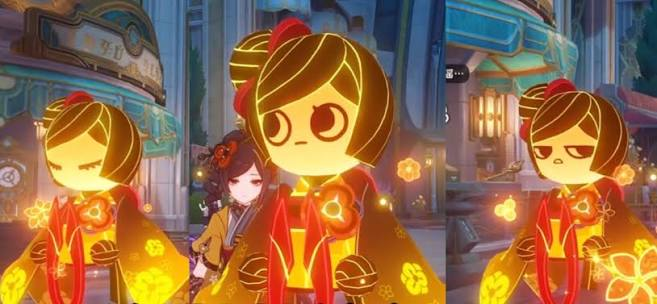

# 必需

Refer to the attached pic1, generate a pic of Chiori. She is wearing modern fashion clothing, with an orange short jacket on her upper body, a black cropped short sleeved lining, and tight fitting denim black shorts on her lower body. There is a graffiti wall behind her, which matches her main color very well

# 人物设定
## 1
Scene idea: Chiori stands in front of the french window on the second floor of Qianwowu, and behind him is the bustling street scene in Lionel, Fontaine. The sky outside the window was gloomy, and lightning flickered faintly in the clouds - echoing her setting of "having a style as ruthless as thunder". She held tailor scissors in her hand, with the blade reflecting the electric light from outside the window, while her other hand gently caressed a brocade being cut. The red eyes depict the upper eyeliner, the dark red eye shadow around the eyes, and the expression is cold and focused.
Composition suggestion: Diagonal composition, the blade of the scissors echoes the thunder light outside the window, and the brocade hangs down from one side of the picture to guide the line of sight.
Color scheme: Deep gray blue thunderstorm sky x Chiori clothing's brown yellow and red x brocade's golden luster

## 2
Scene concept: Inside Chioriya Boutique, Chiori sits on a high chair behind the workbench, looking down like a king. There are various exquisite clothes hanging in the store - on the left is Inazumi style, in the middle is men's clothing, and on the right is women's clothing. Behind is a metal glass composite building structure with distinctive Fengdan characteristics. She was holding a needle and thread in her hand, but her gaze was sharp as she looked out of the frame, as if examining a 'guest who had entered the kingdom'.

Composition suggestion: Symmetrical composition. In Chioriya Boutique, the clothing on both sides resembles her "subjects" and "spoils of war". The fabrics, scissors, and needles on the workbench form rich layers of detail.

Color scheme: Warm yellow light x Cold blue of metallic glass x Red and Brown of Chiori clothing

## 3
Scene concept: Chiori stands at the entrance of Chioriya Boutique, pushing open the door with one hand. Outside the door is the street of Fengdan, but the glass of the door vaguely reflects the scenery of Inazuma - thunder, cherry blossoms, and torii. She turned around and looked back, her expression complicated. This scene echoes the background of her "leaving Inazuma and moving to Fengdan to live before the lockdown order", as well as her design of retaining Inazuma's dressing style even though she is in Fengdan.
Composition suggestion: Use door or window frames as the composition for the picture in picture. Chiori is located in the center left of the picture, and on the right side is the Fengdan street view outside the door/window. The rice wife element can be faintly seen in the glass reflection.
Color scheme: Warm color (golden sunshine of maple) compared to cool color (purple thunder light of Inazuma)

# 参考图
## 4（将她的召唤物加入画面）

She supported her face with her hands and looked at the summoner on the table (as shown in the picture), which she had also created