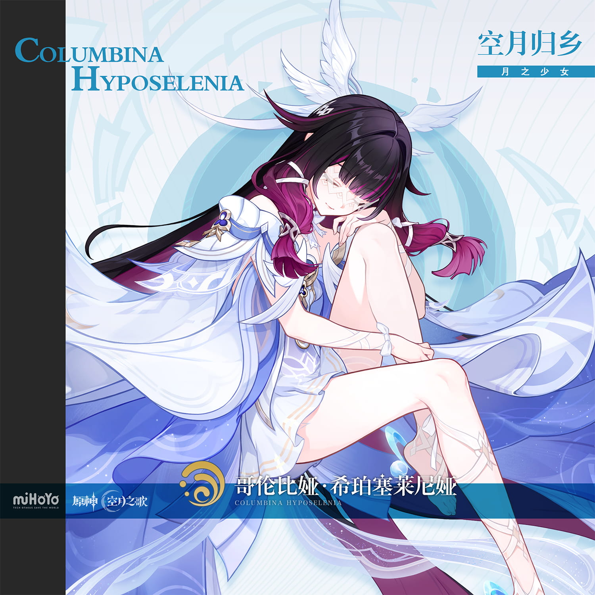

# 哥伦比娅·希珀塞莱尼娅 Columbina Hyposelenia — 2026.09.01
> 视频类型：A · 角色单人壁纸合集
> 角色来源：原神 7.0至冬版本 / 6.3「空月之歌」· 五星水元素法器角色
> 身份：挪德卡莱「霜月」女神 / 愚人众十一执行官第三席「少女」（前）
> 称号：空月归乡 · 月之少女
> 设计参考：闭眼神性少女、月神信仰、 doll-like ethereal aesthetic、头后天使羽翼
> 热点背景：2026年9月1日原神7.0至冬版本「幻想真境剧诗」（水雷草）当日更新，哥伦比娅为开幕/试用角色；7.1六周年前瞻（预计9月中旬）将至，至冬主线剧情持续升温；角色2026年1月首次UP、7月与雷电将军「双神复刻」，社区人气极高
> 今日特殊：幻想真境剧诗更新日，哥伦比娅作为水元素开幕角色登场
> 选定角色理由：工作区首次类型A深度呈现；官方热点（版本更新+开幕角色）权重高；角色外貌极具辨识度（闭眼、月纹、头后羽翼、紫瞳银月瞳孔），壁纸表现力极强；社区梗「闭眼少女」「月神大人」「霜月在唤她回家」传播度广

---

# 必需

## 1 — 涂鸦墙街头风（Graffiti Wall Street Style）

Refer to the attached reference image (Figure 1). Generate a similar style image of Columbina from Genshin Impact sitting casually in front of a bold graffiti wall. Columbina is seated in a relaxed but confident posture, leaning back against the graffiti wall with one knee raised and her other leg stretched out casually, barefoot, her body language calm, controlled, and slightly provocative. Her expression should show cold, disdainful eyes, aloof, sharp, and superior, as if she is silently judging the viewer. Her eyes are half-open here, revealing her distinctive purple irises with silvery-white full-moon pupils.

Keep Columbina's recognizable features: long black hair with vivid magenta-purple inner color and gradient tips, the white wing-like head ornament floating behind her head, pale porcelain skin, delicate white geometric moon markings beneath her eyes. Blend her canonical design with a modern edgy streetwear aesthetic: a white cropped tube top with sheer moon-pattern overlay under an oversized cropped silver-gray varsity jacket worn off one shoulder, paired with a short pleated white skater skirt with iridescent blue-purple panel inserts, sheer white thigh-high stockings with silver moon-phase patterns, and chunky white platform sneakers with holographic soles. Silver chain anklets and a crescent moon choker complete the look. Preserve her identity while giving her a fresh urban street-style look.

The graffiti wall behind her should be vivid and layered, full of expressive abstract shapes and energetic street-art textures in silver, pale blue, and deep violet tones, with graffiti elements including "COLUMBINA" in stylized script, crescent moon and full moon symbols, feather and wing motifs, and Frostmoon Scion emblems, creating a rebellious urban backdrop that resonates with her character theme. Add subtle Hydro water ripple effects and pale moonlight glow around her to reinforce her identity.

Use a wide cinematic framing suitable for a 16:9 wallpaper, with Columbina as the main focal point while still showing enough of the graffiti wall and surrounding environment for atmosphere. The mood should feel cool, stylish, intimidating, and mysterious. Highly detailed background, rich shadows, silver and violet glowing highlights, sharp focus on Columbina, and a refined high-end anime illustration look.

perfect hands, five fingers on each hand, anatomically correct hands, well-defined fingers, natural relaxed hand pose.

Negative Prompt:
low quality, worst quality, blurry, pixelated, bad anatomy, extra limbs, bad hands, extra fingers, fewer fingers, missing fingers, fused fingers, webbed fingers, merged fingers, overlapping fingers, deformed fingers, mutated fingers, six fingers, four fingers, three fingers, more than five fingers, less than five fingers, disfigured hands, poorly drawn hands, bad hand anatomy, asymmetrical hands, broken fingers, claw hands, blurry hands, indistinct fingers, smeared hands, standing, standing pose, upright posture, singing, open mouth singing, warm smile, gentle smile, cheerful expression, cute expression, adorable, sweet, innocent, game canonical outfit, official costume, fantasy dress, medieval clothing, armor, full gown, formal dress, beach background, ocean background, nature background, indoor background, plain background, minimal background, missing graffiti wall, low detail graffiti, generic graffiti, wrong graffiti colors, wrong streetwear, missing crop top, missing jacket, missing shorts, missing skirt, long dress, full pants, business suit, school uniform, text, watermark, logo, signature.

---

# 人物设定

## 2 — 月纱遮眼·霜月女神的凝视（角色特写肖像 / Close-up Portrait）

Refer to the attached reference image (Figure 2). Generate a cinematic close-up portrait of Columbina from Genshin Impact. She holds a delicate piece of white gauze woven from moonlight close to the left side of her face, the translucent fabric draped between her fingers, partially obscuring her left eye. Her visible right eye gazes directly at the viewer — simultaneously serene and sorrowful, the look of a goddess who has seen too many lies to trust the world, yet still hopes someone might prove her wrong. Expression: a faint melancholic calm that never reaches a smile, as if she is forever listening to a lullaby only she can hear. Dramatic single-source lighting from the upper left casts deep chiaroscuro across her features, the white gauze glowing pale silver where the light passes through. Her pale porcelain skin contrasts sharply against a pure black background. Her signature long black hair with magenta-purple inner color falls like a waterfall across the right side of the frame; her white wing-like head ornament is only barely visible at the top edge. A tiny crescent moon pendant rests at her collarbone. A villain who closed her eyes to see the truth, and opened them only to find she was still alone. 16:9 2K wallpaper.

perfect hands, five fingers on each hand, anatomically correct hands, well-defined fingers, fingers elegantly holding the gauze.

Negative Prompt:
low quality, worst quality, blurry, pixelated, bad anatomy, extra limbs, bad hands, extra fingers, fewer fingers, missing fingers, fused fingers, webbed fingers, merged fingers, overlapping fingers, deformed fingers, mutated fingers, six fingers, four fingers, three fingers, more than five fingers, less than five fingers, disfigured hands, poorly drawn hands, bad hand anatomy, asymmetrical hands, broken fingers, claw hands, blurry hands, indistinct fingers, smeared hands, full body shot, wide shot, landscape, multiple subjects, busy background, bright cheerful lighting, outdoor scene, action pose, weapon drawn, standing, chibi, text, watermark, logo, signature.

---

## 3 — 银月之庭·闭目冥想（角色经典设定场景）

Positive Prompt:
16:9 2K wallpaper, Columbina from Genshin Impact, highly detailed anime-style illustration, polished game-art quality, ethereal moonlit interior, tranquil sacred atmosphere.

Depict Columbina seated in a meditative pose within the Silvermoon Hall, the grand sanctuary of the Frostmoon Scions. Her unmistakable features are fully rendered: long black hair with vivid magenta-purple inner color and tips cascading around her like a dark waterfall touched by violet flame, eyes gently closed in serene contemplation, delicate white geometric moon markings beneath her eyes catching the soft glow, the white wing-like head ornament floating behind her head like a halo of feathers, and her pale porcelain skin luminous in the dim light. She wears her canonical white flowing ethereal gown with light blue translucent veil layers, backless design revealing her delicate shoulder blades, white ribbon armlets on both upper arms, a thin gold chain across her collar, and a silver thigh strap on her left leg. She is barefoot, ankles adorned with delicate silver anklets.

The Silvermoon Hall is magnificent: towering columns of pale moonstone, a domed ceiling painted with constellations and a massive glowing full moon at its center, bioluminescent blue-white flowers lining the circular floor — some petals tinged with violet, reflecting her current mood. Soft moonbeams stream through stained-glass windows depicting the phases of the moon. Faint Hydro water ripples shimmer across the polished marble floor around her. A few white feathers drift lazily in the still air.

She sits cross-legged on a circular dais, hands resting palms-up on her knees in a gesture of receptive calm, perfect hands, five fingers on each hand, well-defined fingers, natural graceful hand pose. The mood is transcendent, melancholic, and deeply peaceful — a moon goddess communing with the only truth she trusts: the silence of closed eyes.

Negative Prompt:
low quality, worst quality, blurry, pixelated, bad anatomy, extra limbs, bad hands, extra fingers, fewer fingers, missing fingers, fused fingers, webbed fingers, merged fingers, overlapping fingers, deformed fingers, mutated fingers, six fingers, four fingers, three fingers, more than five fingers, less than five fingers, disfigured hands, poorly drawn hands, bad hand anatomy, asymmetrical hands, broken fingers, claw hands, blurry hands, indistinct fingers, smeared hands, open eyes, wrong hair color, blonde hair, missing wing head ornament, missing moon markings, combat pose, weapon drawn, bright daylight, outdoor scene, chibi, photorealistic, text, watermark, logo, signature.

---

## 4 — 冬夜愚戏·执行官的会议桌（身份/阵营场景）

Positive Prompt:
16:9 2K wallpaper, Columbina from Genshin Impact, highly detailed anime-style illustration, polished game-art quality, dramatic chiaroscuro interior, tense political atmosphere.

Depict Columbina seated at the far end of the Fatui Harbingers' grand conference table in Zapolyarny Palace, Snezhnaya. Her iconic features are unmistakable even in this dim setting: long black hair with magenta-purple inner color, eyes gently closed as always, delicate white geometric moon markings beneath her eyes, the white wing-like head ornament faintly visible against the dark background, and her pale skin almost glowing in the low light. She wears her canonical white flowing gown with light blue translucent layers, the backless design revealing her pale shoulders, white ribbon armlets, gold chain collar, and silver thigh strap. She sits with perfect posture, hands folded neatly on the table before her, perfect hands, five fingers on each hand, well-defined fingers, natural composed hand pose.

The conference room is imposing: a massive obsidian table stretching across the frame, high-backed chairs occupied by shadowy silhouettes of other Harbingers (partially visible, out of focus), towering windows showing a blizzard-ravaged Snezhnaya night outside, heavy crimson curtains, flickering candlelight casting long dancing shadows, the Fatui insignia emblazoned on the wall behind her. At her end of the table, a single shaft of pale moonlight cuts through the storm clouds and falls directly on her, as if the moon itself spotlights her presence.

Despite her closed eyes and small stature, her presence dominates the room — a quiet, terrifying authority that needs no glare to command respect. Faint Hydro water droplets float in the moonbeam around her like suspended tears. The mood is ominous, majestic, and laden with unspoken threats.

Negative Prompt:
low quality, worst quality, blurry, pixelated, bad anatomy, extra limbs, bad hands, extra fingers, fewer fingers, missing fingers, fused fingers, webbed fingers, merged fingers, overlapping fingers, deformed fingers, mutated fingers, six fingers, four fingers, three fingers, more than five fingers, less than five fingers, disfigured hands, poorly drawn hands, bad hand anatomy, asymmetrical hands, broken fingers, claw hands, blurry hands, indistinct fingers, smeared hands, open eyes, wrong hair color, blonde hair, missing wing head ornament, missing moon markings, cheerful expression, bright lighting, outdoor scene, summer setting, chibi, text, watermark, logo, signature.

---

## 5 — 水月共舞·霜月之潮（动态/战斗场景）

Positive Prompt:
16:9 2K wallpaper, Columbina from Genshin Impact, highly detailed anime-style illustration, dynamic action composition, dramatic Hydro elemental effects and moonlight magic, polished game-art quality, epic battle atmosphere.

Depict Columbina in the midst of casting her elemental burst, suspended in mid-air within a vast frozen cathedral-like space in Nod-Krai. Her eyes are now open — a rare sight — revealing her enchanting purple irises with silvery-white full-moon pupils glowing with intense lunar energy. Her long black hair with magenta-purple inner color whips wildly around her, the white wing-like head ornament fully expanded and radiant. Her pale skin is illuminated by the cascading light from above. She wears her canonical white flowing gown, the translucent blue layers billowing like water in zero gravity, white ribbon armlets glowing with Hydro energy, gold chain collar shimmering, silver thigh strap visible.

She holds her catalyst — a floating crystalline orb of condensed moonlight and water — before her in both hands, arms extended gracefully as if conducting an orchestra of the tides. From the orb, massive arcs of Hydro water and silver moonlight spiral outward in a grand helical pattern, freezing into delicate ice-lace mid-flight before shattering into luminous particles. The frozen cathedral around her is fracturing under the force of her magic: stained-glass windows shattering outward, ice columns cracking, the floor covered in a thin layer of reflective water that mirrors the chaos above.

Dynamic upward-looking composition with Columbina as the luminous center, her catalyst orb blazing like a secondary moon, water and light spiraling outward in Fibonacci-like curves. The color palette contrasts deep midnight blues and frozen violets with blinding silver-white lunar highlights and her signature magenta accents.

perfect hands, five fingers on each hand, anatomically correct hands, well-defined fingers, both hands cupping the catalyst orb with elegant grip.

Negative Prompt:
low quality, worst quality, blurry, pixelated, bad anatomy, extra limbs, bad hands, extra fingers, fewer fingers, missing fingers, fused fingers, webbed fingers, merged fingers, overlapping fingers, deformed fingers, mutated fingers, six fingers, four fingers, three fingers, more than five fingers, less than five fingers, disfigured hands, poorly drawn hands, bad hand anatomy, asymmetrical hands, broken fingers, claw hands, blurry hands, indistinct fingers, smeared hands, closed eyes, wrong hair color, missing wing head ornament, missing moon markings, weak effects, flat lighting, bright cheerful daylight, cute peaceful expression, fire effects, electro effects, chibi, text, watermark, logo, signature.

---

## 6 — 空月归乡·雪原上的足迹（角色经典场景 / 剧情向）

Positive Prompt:
16:9 2K wallpaper, Columbina from Genshin Impact, highly detailed anime-style illustration, polished game-art quality, vast snowy landscape, melancholic winter twilight atmosphere.

Depict Columbina walking barefoot through an endless snowfield in Nod-Krai at twilight, her small figure dwarfed by the immense frozen landscape. Her unmistakable features: long black hair with magenta-purple inner color flowing behind her in the cold wind, eyes gently closed as she trusts the moon to guide her steps, delicate white geometric moon markings faintly glowing on her cheeks, the white wing-like head ornament catching snowflakes like a crown of feathers, and her pale bare feet leaving no trace in the snow — or perhaps the snow melts slightly where she steps, revealing dark earth beneath, as if the world itself yields to her passage. She wears her canonical white flowing gown, the translucent blue layers trailing behind her like a comet's tail, white ribbon armlets, gold chain collar, silver thigh strap, and delicate silver anklets that chime softly with each step.

Above her, an impossibly large full moon dominates the twilight sky, its surface detailed with craters and maria, casting a silver-blue light across the snow that makes the entire landscape glow with an otherworldly luminescence. The horizon is a gradient of deep violet fading to pale ice-blue. Sparse frosted trees stand like silent sentinels in the distance. A single trail of luminous Hydro water droplets floats in the air behind her, marking the path she has walked — a river of liquid moonlight suspended in the freezing air.

Wide landscape composition with Columbina as a small but luminous focal point in the lower third, the vast moon and sky occupying the upper two-thirds. The mood is lonely, majestic, and quietly hopeful — a goddess walking home, one step at a time, guided by the only voice she has ever trusted.

perfect hands, five fingers on each hand, anatomically correct hands, well-defined fingers, one hand slightly raised as if reaching toward the moon, natural graceful hand pose.

Negative Prompt:
low quality, worst quality, blurry, pixelated, bad anatomy, extra limbs, bad hands, extra fingers, fewer fingers, missing fingers, fused fingers, webbed fingers, merged fingers, overlapping fingers, deformed fingers, mutated fingers, six fingers, four fingers, three fingers, more than five fingers, less than five fingers, disfigured hands, poorly drawn hands, bad hand anatomy, asymmetrical hands, broken fingers, claw hands, blurry hands, indistinct fingers, smeared hands, open eyes, wrong hair color, blonde hair, missing wing head ornament, missing moon markings, shoes, boots, warm clothing, modern outfit, bright sunny day, summer scene, cityscape, combat pose, weapon drawn, chibi, text, watermark, logo, signature.

---

## 7 — 织月裁光·月光编织的华服（角色皮肤/现代风改造）

Positive Prompt:
16:9 2K wallpaper, Columbina from Genshin Impact, highly detailed anime-style illustration, polished game-art quality, celestial atelier atmosphere, elegant haute-couture reinterpretation.

Reimagine Columbina in a modern haute-couture version of her canonical outfit "织月裁光" (Moonweave Radiance). She stands in a moonlit fashion atelier, surrounded by floating translucent fabric panels that seem to be woven from actual moonbeams. Her iconic features remain: long black hair with magenta-purple inner color styled in an elegant half-updo with loose violet-touched strands framing her face, eyes gently closed, delicate white geometric moon markings glowing softly, the white wing-like head ornament reimagined as a sculptural silver headpiece with embedded fiber-optic strands pulsing like veins of moonlight, and her pale porcelain skin luminous under studio lighting.

Her modernized outfit is a breathtaking white avant-garde evening gown: a structured strapless bodice with architectural origami folds in pearl-white silk, a dramatic asymmetrical skirt with cascading layers of iridescent organza that shift from white to pale blue to soft violet depending on the angle, embedded LED-thread piping along the seams that glows with a gentle silver luminescence mimicking moon phases. A sheer cape-like train extends from her shoulders, embroidered with constellations in silver thread, floating behind her as if weightless. White satin arm gloves reach past her elbows, a single crescent moon brooch at her waist, and crystal-beaded anklets on her bare feet. She holds a silver clutch shaped like a miniature full moon.

The atelier setting is minimalist and futuristic: polished white marble floors reflecting her figure, floor-to-ceiling windows showing a starry night sky, mannequins draped in half-finished garments, soft diffused spotlighting from above creating a halo effect around her. She stands in a three-quarter pose, one hand resting lightly on a dress form, the other holding the moon-clutch at her side, perfect hands, five fingers on each hand, well-defined fingers, natural elegant hand pose. The mood is sophisticated, ethereal, and impossibly glamorous — a moon goddess who stepped off a Paris runway.

Negative Prompt:
low quality, worst quality, blurry, pixelated, bad anatomy, extra limbs, bad hands, extra fingers, fewer fingers, missing fingers, fused fingers, webbed fingers, merged fingers, overlapping fingers, deformed fingers, mutated fingers, six fingers, four fingers, three fingers, more than five fingers, less than five fingers, disfigured hands, poorly drawn hands, bad hand anatomy, asymmetrical hands, broken fingers, claw hands, blurry hands, indistinct fingers, smeared hands, open eyes, wrong hair color, blonde hair, missing wing head ornament, missing moon markings, casual clothing, streetwear, daytime scene, bright sunlight, cheerful expression, chibi, text, watermark, logo, signature.

---

## 8 — 镜中真假·她看见了吗？（情感/日常/反差场景）

Positive Prompt:
16:9 2K wallpaper, Columbina from Genshin Impact, highly detailed anime-style illustration, polished game-art quality, surreal psychological atmosphere, soft diffused lighting.

Depict Columbina standing before an ornate antique mirror in a dimly lit chamber within Silvermoon Hall. The mirror's frame is carved with moon phases and Frostmoon Scion symbols. In the reflection, we see a striking duality: the real Columbina stands with her eyes gently closed as always, her expression serene and unreadable; but her reflection in the mirror has its eyes wide open, revealing her haunting purple irises with silvery-white full-moon pupils, and the reflection's expression is one of quiet sorrow — as if the mirror holds the part of her that still wants to see the world. Both versions wear her canonical white flowing gown with light blue translucent layers, white ribbon armlets, gold chain collar, silver thigh strap, and the white wing-like head ornament.

The chamber is intimate and mysterious: dark velvet drapes, a single candelabra with blue-white candles casting flickering light, scattered petals of the bioluminescent flowers on the floor, and the mirror's surface rippling slightly like water. Real Columbina's right hand is raised, fingertips just touching the cold glass surface, while her reflection's left hand mirrors the gesture from the other side, creating a poignant sense of connection and separation. Her pale skin and the white gown provide luminous contrast against the deep indigo shadows of the room.

Medium close-up composition emphasizing the mirror and the two faces — one closed and peaceful, one open and yearning. The mood is deeply introspective, gently tragic, and beautifully surreal — a goddess who closed her eyes to escape lies, confronting the part of herself that still remembers what truth looked like.

perfect hands, five fingers on each hand, anatomically correct hands, well-defined fingers, fingers gently touching the mirror surface.

Negative Prompt:
low quality, worst quality, blurry, pixelated, bad anatomy, extra limbs, bad hands, extra fingers, fewer fingers, missing fingers, fused fingers, webbed fingers, merged fingers, overlapping fingers, deformed fingers, mutated fingers, six fingers, four fingers, three fingers, more than five fingers, less than five fingers, disfigured hands, poorly drawn hands, bad hand anatomy, asymmetrical hands, broken fingers, claw hands, blurry hands, indistinct fingers, smeared hands, wrong hair color, blonde hair, missing wing head ornament, missing moon markings, broken mirror, cracked glass, distorted reflection, combat pose, weapon drawn, bright lighting, outdoor scene, cheerful expression, chibi, text, watermark, logo, signature.

---

# 参考图

## 9（基于官方立绘 splash-art 的宽屏壁纸重绘）

Referring to the attached official splash art (Figure 3), generate a cinematic 16:9 2K wallpaper adaptation of Columbina from Genshin Impact. Preserve all canonical design details from the reference: long black hair with vivid magenta-purple inner color and tips, eyes gently closed with a serene expression, delicate white geometric moon markings beneath her eyes, the white wing-like head ornament floating behind her head, very pale porcelain skin, and her white flowing ethereal gown with light blue translucent veil layers, backless design, white ribbon armlets, gold chain collar, silver thigh strap on left leg, and delicate silver anklets on her bare feet.

Recompose the pose for a 16:9 horizontal format: Columbina is seated in a floating, knees-drawn posture against a vast celestial background of swirling silver-blue moonlight, concentric lunar halos, and soft white feather motifs. The color palette is dominated by pale blues, silvers, soft violets, and white. Massive translucent fabric ribbons spiral around her like orbital rings. Faint Hydro water ripple effects shimmer at the base of the composition. The mood is divine, tranquil, and impossibly ethereal — a moon goddess suspended between earth and sky. Highly detailed anime-style illustration, polished game-art quality, soft volumetric lighting, sharp focus on character.

Negative Prompt:
low quality, worst quality, blurry, pixelated, bad anatomy, extra limbs, bad hands, extra fingers, fewer fingers, missing fingers, fused fingers, webbed fingers, merged fingers, overlapping fingers, deformed fingers, mutated fingers, six fingers, four fingers, three fingers, more than five fingers, less than five fingers, disfigured hands, poorly drawn hands, bad hand anatomy, asymmetrical hands, broken fingers, claw hands, blurry hands, indistinct fingers, smeared hands, open eyes, wrong hair color, blonde hair, missing wing head ornament, missing moon markings, dark atmosphere, chibi, photorealistic, text, watermark, logo, signature.

---

## 10（基于抽卡立绘 gacha-art 的手机竖屏壁纸）

Referring to the attached official gacha art (Figure 4), generate a 9:16 mobile wallpaper adaptation of Columbina from Genshin Impact. Preserve all canonical design details from the reference: long black hair with vivid magenta-purple inner color and tips flowing dynamically, eyes gently closed, delicate white geometric moon markings beneath her eyes, the white wing-like head ornament expanded and radiant, very pale porcelain skin, and her white flowing ethereal gown with light blue translucent veil layers billowing like water, white ribbon armlets, gold chain collar, silver thigh strap, and bare feet with silver anklets.

Recompose for 9:16 vertical mobile format: Columbina floats gracefully in the center of a deep celestial ocean, surrounded by massive glowing blue flowers, drifting white feathers, and spiraling ribbons of moonlight. Above her, a radiant full moon casts divine silver light downward. Below her, the water surface reflects the moon and her figure in perfect symmetry. Concentric golden geometric halo patterns expand behind her like a sacred mandala. Tiny Hydro water bubbles and luminous petals float around her. The color palette is deep midnight blues, luminous silvers, soft magentas, and pale golds. The mood is transcendent, majestic, and deeply moving — as if the viewer is looking up at a goddess from the bottom of a moonlit sea.

9:16 2K mobile wallpaper, highly detailed anime-style illustration, polished game-art quality, dramatic top-down lighting, sharp focus on character, rich environmental details.

Negative Prompt:
low quality, worst quality, blurry, pixelated, bad anatomy, extra limbs, bad hands, extra fingers, fewer fingers, missing fingers, fused fingers, webbed fingers, merged fingers, overlapping fingers, deformed fingers, mutated fingers, six fingers, four fingers, three fingers, more than five fingers, less than five fingers, disfigured hands, poorly drawn hands, bad hand anatomy, asymmetrical hands, broken fingers, claw hands, blurry hands, indistinct fingers, smeared hands, open eyes, wrong hair color, blonde hair, missing wing head ornament, missing moon markings, dark gritty atmosphere, chibi, photorealistic, text, watermark, logo, signature.

---

## 11 — 月光芭蕾·跨领域融合（参考德加芭蕾画 × 月神独舞）

Positive Prompt:
16:9 2K wallpaper, Columbina from Genshin Impact, highly detailed anime-style illustration with impressionistic pastel brushwork inspired by Edgar Degas ballet paintings, polished game-art quality, ethereal stage atmosphere.

Depict Columbina performing a solitary dance on a stage of frozen moonlight, her pose referencing the iconic arabesque of a Degas ballerina but reimagined through the lens of a moon goddess. Her canonical features are preserved: long black hair with magenta-purple inner color swept up in an elegant ballet bun with loose violet strands, eyes gently closed in rapturous concentration, delicate white geometric moon markings glowing under the stage lights, the white wing-like head ornament like a tiara of feathers, and her pale skin luminous against the cool backdrop. She wears a reinterpretation of her white gown as a romantic ballet tutu: multiple layers of iridescent white and pale blue tulle, a fitted bodice with silver embroidery, long sheer sleeves, and ribbons wrapping up her calves. She is en pointe, barefoot on a surface of solidified moonbeam that reflects her figure like a mirror.

The stage environment merges Degas's soft pastel aesthetic with celestial grandeur: soft diffused footlights casting warm-amber glow from below while cool silver moonlight pours from above, creating the famous "ballet studio" lighting but with lunar luminescence. The background is deliberately impressionistic — blurred strokes of deep violet and midnight blue suggesting an audience of shadows, with a massive full moon visible through a stylized proscenium arch. Faint Hydro water mist drifts across the stage floor, catching the light like Degas's famous powder effects.

The composition is a mid-shot capturing her full arabesque: one leg extended behind her en l'air, arms raised in a soft oval above her head, back arched with elegant tension. The mood is fragile, transcendent, and achingly beautiful — a goddess dancing for an audience of one: the moon itself.

perfect hands, five fingers on each hand, anatomically correct hands, well-defined fingers, fingers gracefully extended in ballet port de bras.

Negative Prompt:
low quality, worst quality, blurry, pixelated, bad anatomy, extra limbs, bad hands, extra fingers, fewer fingers, missing fingers, fused fingers, webbed fingers, merged fingers, overlapping fingers, deformed fingers, mutated fingers, six fingers, four fingers, three fingers, more than five fingers, less than five fingers, disfigured hands, poorly drawn hands, bad hand anatomy, asymmetrical hands, broken fingers, claw hands, blurry hands, indistinct fingers, smeared hands, open eyes, wrong hair color, blonde hair, missing wing head ornament, missing moon markings, modern street clothes, casual outfit, dark gritty atmosphere, photorealistic, oil painting texture overwhelming anime style, text, watermark, logo, signature.

---

## 注

**角色外观确认清单（基于 splash-art.png & gacha-art.png 视觉校对）**：
- 发色：外层纯黑，内侧/发尾为鲜艳的品红-紫色渐变
- 瞳色：紫色虹膜，瞳孔为银白色满月，底部有新月纹样（官方设定中常闭眼）
- 面部特征：眼下有白色几何/月相纹路；肌肤极苍白
- 头饰：头后悬浮一对白色羽翼状头饰（非发饰，类似天使光环/头翼）
- 服装：白色飘逸长裙，带淡蓝色透明薄纱层，露背设计，白色丝带臂环，金色细链项圈，左腿银色腿环，脚踝银链
- 元素：水（Hydro），但角色主题为「霜月」/ Moon
- 标志性道具：无实体常驻武器，使用法器（catalyst），技能表现为水+月光效果
- 伴生元素：无独立伴生生物/宠物；环境伴生为「银月之庭的发光花朵」和「空月奇域」

**参考图下载来源**：
- splash-art.png：B站WIKI MediaWiki API — `File:哥伦比娅立绘.png`
- gacha-art.png：B站WIKI MediaWiki API — `File:哥伦比娅抽卡立绘.png`

**跨领域参考图说明**：
- 本次未下载实体跨领域参考图（Pixabay/Unsplash 均遇访问限制），第11条prompt采用「德加芭蕾画」作为风格描述融合，直接在文本中指定参考来源与融合方式。
