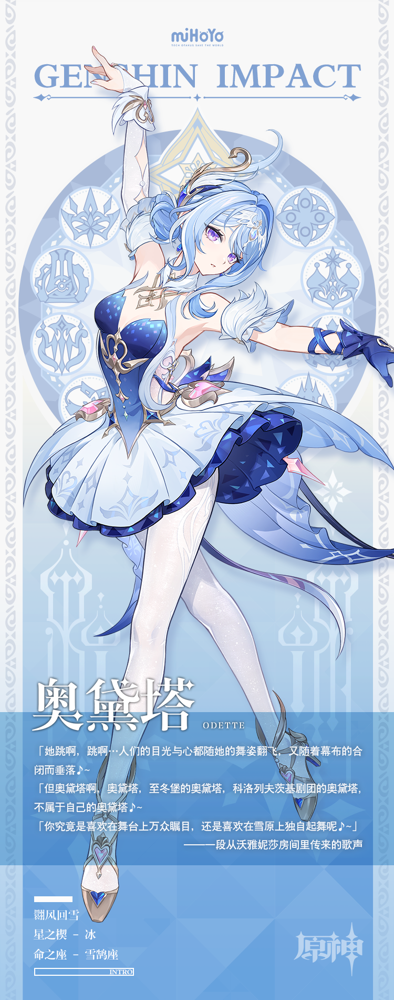
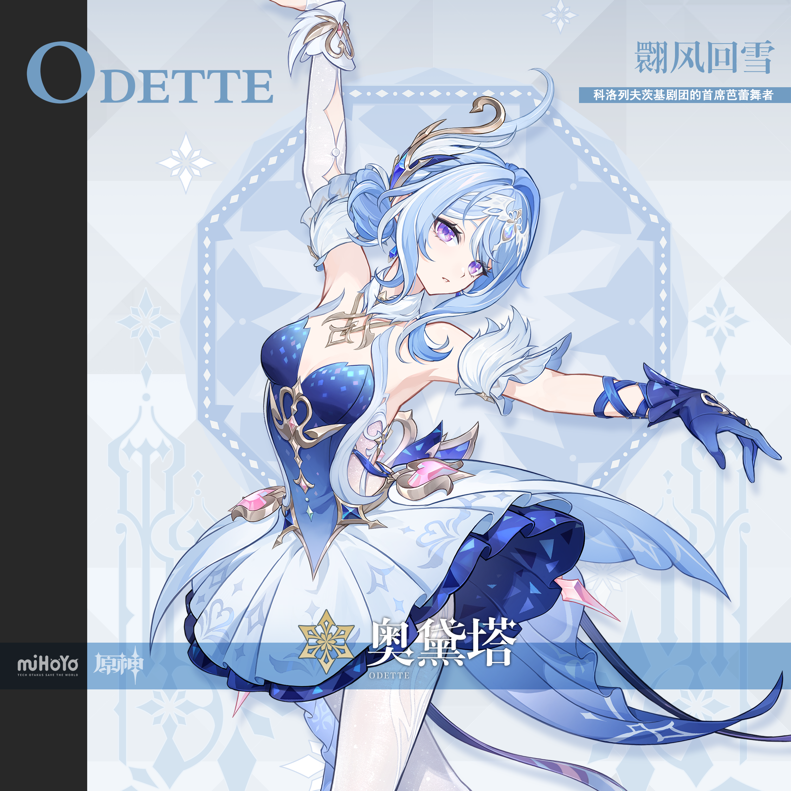
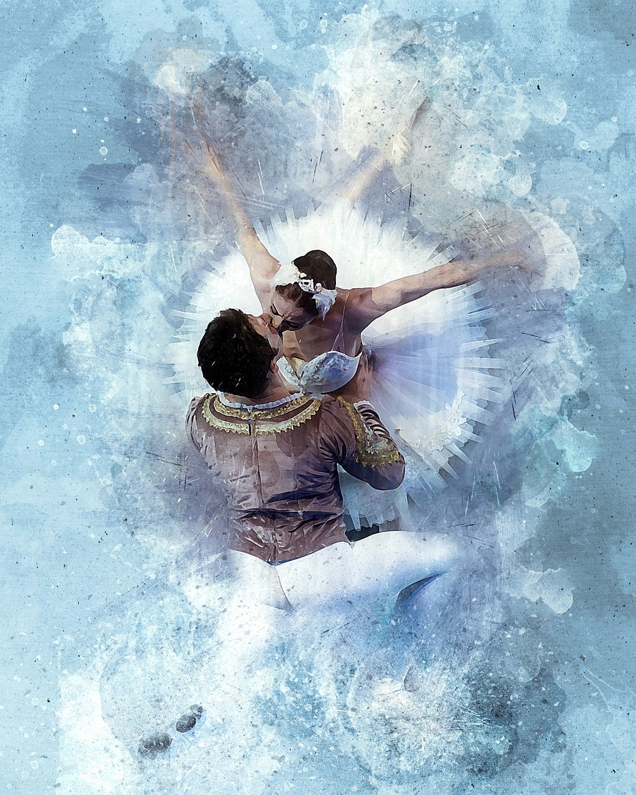
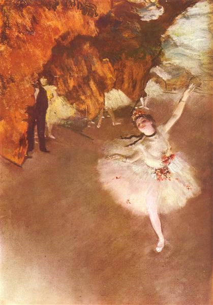

# 奥黛塔 Odette — 2026.08.01
> 角色来源：原神 7.0 至冬国 · 五星冰元素单手剑
> 身份：科洛列夫茨基剧团首席芭蕾舞者 / 愚人众成员
> 设计参考：天鹅湖白天鹅奥杰塔
> 热点背景：7.0前瞻直播（7月31日）刚结束，至冬国8月12日上线，社区讨论热度极高
> 今日特殊：八一建军节（11号特别版见绝区零/11号目录）

# 必需

Refer to the attached reference image (Figure 1). Generate a similar style image of Odette from Genshin Impact sitting in front of a bold graffiti wall with an icy, disdainful expression, looking at the camera with cold superiority. She is wearing modern street-fashion: a white cropped tank top under an oversized ice-blue and navy graffiti-print jacket worn off one shoulder, paired with dark blue denim shorts and white sneakers. Keep her recognizable features: long ice-blue hair styled in an elegant updo with flowing loose strands, purple eyes, silver swan-wing hair ornament, pale skin. The graffiti wall behind her should feature blue, white, and silver ice-crystal motifs, snowflake tags, and ballet silhouettes. 16:9 2K wallpaper format.

Negative Prompt: low quality, worst quality, blurry, pixelated, bad anatomy, bad hands, extra fingers, missing fingers, deformed hands, extra limbs, chibi, childish, wrong hair color, wrong eye color, missing hair ornament, cheerful expression, warm colors, fire effects, text, watermark, logo, signature.

# 人物设定

## 1 — 至冬剧院舞台（芭蕾经典场景）

Positive Prompt:
16:9 wallpaper, Odette from Genshin Impact, highly detailed anime-style illustration, polished game-art quality, cinematic composition, majestic theatrical atmosphere, dramatic stage lighting.

Depict Odette performing a grand ballet solo on the stage of the Kolorevtsky Theater in Snezhnaya. She is captured mid-pirouette, standing en pointe on one foot with the other leg extended behind her in a perfect arabesque. Her right arm extends gracefully upward, fingers delicate and precise, while her left arm sweeps to the side. Her long ice-blue hair flows outward with the spin, creating elegant trailing motion lines. Her expression is cold, focused, and absolutely commanding — the face of someone who makes even Snezhnaya's howling blizzards fall silent.

Keep her canonical design: long ice-blue hair with silver swan-wing hair ornament, purple eyes with sharp elegant gaze, pale porcelain skin, white-and-blue gradient ballet costume with intricate ice-crystal embroidery, layered tutu skirt transitioning from white at the waist to deep sapphire blue at the hem, white elbow-length gloves with silver filigree details, blue pointe ballet shoes with silver ribbons, Cryo Stellar Linchpin glowing faintly at her chest.

The theater stage should be grand and ornate — dark wood floors reflecting stage lights, heavy crimson and gold curtains on both sides, a massive crystal chandelier above casting prismatic light, snowflake-shaped spotlights illuminating her from above and behind. Faint Cryo ice crystals form in the air around her spinning form, catching the light like diamonds. The atmosphere should feel regal, breathtaking, and otherworldly.

Use wide cinematic framing with Odette as the clear focal point at center-stage, showing enough of the grand theater architecture to convey scale and magnificence. Emphasize the contrast between the warmth of the theater's red-and-gold interior and the cold blue-white Cryo energy emanating from her dance.

Negative Prompt:
low quality, worst quality, blurry, bad anatomy, extra fingers, deformed hands, incorrect character, wrong hair color, missing hair ornament, missing ballet shoes, chibi style, flat lighting, plain background, modern clothing, casual pose, cheerful smile, warm expression, fire effects, Pyro elements, text, watermark, logo.

## 2 — 雪原独舞（孤独与自由）

Positive Prompt:
16:9 wallpaper, Odette from Genshin Impact, highly detailed anime-style illustration, polished game-art quality, melancholic beauty, vast landscape, atmospheric perspective, emotional storytelling.

Depict Odette dancing alone on a vast, untouched snowfield in Snezhnaya under a twilight sky. She performs a slow, contemplative dance — not a performance for any audience, but a private moment of freedom. Her body is in a gentle développé, one leg raised slowly, arms floating at her sides as if embracing the wind. Her long ice-blue hair flows freely, unbound from her usual stage styling, cascading down her back and swaying in the cold breeze. Her expression is serene, eyes half-closed, with a rare softness replacing her usual cold composure — this is the Odette who dances not for others, but for herself.

Keep her canonical outfit with slight wind-blown movement in the fabrics. Her white-and-blue ballet costume's skirt ripples in the arctic wind. Cryo energy manifests subtly: delicate ice flowers bloom where her pointe shoes touch the snow, forming a trail of crystalline blossoms behind her.

The background is a sweeping Snezhnayan landscape: endless white snowfields stretching to the horizon, distant snow-capped mountains under a gradient sky of deep indigo to pale lavender to soft pink at the horizon where the sun is setting. Northern lights (aurora borealis) shimmer faintly in green and blue above. Snowflakes drift gently. The scene should evoke the lyrical line: "Do you prefer the stage where all eyes are on you, or dancing alone on the snowfield?"

Wide panoramic composition with Odette small but luminous at the center, emphasizing the vastness of the landscape around her and her solitary beauty within it.

Negative Prompt:
low quality, blurry, bad anatomy, extra limbs, deformed, crowded scene, multiple characters, audience, theater interior, city background, cheerful expression, bright warm lighting, summer scenery, green grass, flowers, fire, text, watermark.

## 3 — 愚人众暗杀任务（双重身份的黑暗面）

Positive Prompt:
16:9 wallpaper, Odette from Genshin Impact, highly detailed anime-style illustration, polished game-art quality, dark thriller atmosphere, cinematic noir lighting, tension and danger.

Depict Odette in her Fatui operative mode during a covert assassination mission at night. She stands in a narrow, dark stone alley in Snezhnaya's capital, pressing her back against a frost-covered wall. She holds a short Cryo-infused blade in a reverse grip close to her chest, the blade emitting a faint icy blue glow. Her expression is cold, calculating, and lethally focused — completely different from her stage persona. Her purple eyes gleam dangerously in the shadows, reflecting the blue light of her weapon.

She wears a modified version of her outfit: a dark navy hooded cloak over her ballet costume, the hood pulled back to reveal her face. Her ice-blue hair is tightly braided for stealth. The Fatui insignia is subtly visible on a clasp at her collar. Her white gloves now appear tactical, with reinforced fingertips.

The alley is dark and atmospheric: wet cobblestones reflecting lamplight, frost patterns creeping up the stone walls, a distant Fatui guard post with warm torchlight visible at the end of the alley. Snow falls lightly. The contrast between her elegant dancer's build and the lethal weapon in her hand should be striking and unsettling.

Composition: medium shot from a low angle, looking slightly up at Odette, creating an imposing and dangerous feeling. Deep shadows with selective blue-white lighting on her face and blade.

Negative Prompt:
low quality, blurry, bad anatomy, extra fingers, deformed, bright cheerful scene, daytime, theater stage, dancing pose, smiling, cute expression, warm colors, fire effects, bulky armor, modern city, text, watermark.

## 4 — 冰上天鹅湖（战斗美学）

Positive Prompt:
16:9 wallpaper, Odette from Genshin Impact, highly detailed anime-style illustration, dynamic action composition, dramatic elemental effects, polished game-art quality, epic battle scene.

Depict Odette in combat, seamlessly blending ballet and swordsmanship. She leaps high above a frozen lake surface, performing a grand jeté with her sword extended in a sweeping arc. Her body forms a perfect split in mid-air, one arm holding her Cryo-infused sword trailing a brilliant arc of ice energy, the other arm extended gracefully behind her in classical ballet form. Her ice-blue hair streams behind her like a comet tail, frozen particles crystallizing along its length.

Massive Cryo effects surround her: the frozen lake below cracks and reforms into intricate snowflake patterns from the sheer force of her Stellar Linchpin energy. Ice swans — elegant, translucent constructs of pure Cryo power — spiral upward around her in a helix formation, their wings spread wide. The sky above is dark and stormy, with lightning flickering in the clouds, but the area immediately around Odette glows with serene ice-blue light.

Her expression is intensely focused yet graceful — a warrior-dancer in her element, every lethal strike an extension of choreography. Her white-and-blue costume flows dynamically with the motion, the skirt fanning out in a perfect circle.

Diagonal dynamic composition with strong upward motion, Odette positioned at the upper-center of the frame, ice swans spiraling below and around her, the fractured frozen lake visible at the bottom third.

Negative Prompt:
low quality, blurry, bad anatomy, extra limbs, stiff pose, weak motion, flat effects, static composition, incorrect outfit, missing sword, poorly drawn weapon, dull lighting, indoor scene, peaceful mood, chibi style, text, watermark.

## 5 — 赛博朋克至冬（现代风·御姐）

Positive Prompt:
16:9 wallpaper, Odette from Genshin Impact, highly detailed anime-style illustration, cyberpunk aesthetic, neon-lit urban atmosphere, polished character art, stylish and mature.

Reimagine Odette in a cyberpunk Snezhnaya setting. She stands on a rain-slicked elevated walkway in a futuristic industrial city at night, leaning against a metal railing with one hand, the other hand holding a holographic data tablet. She wears a sleek, form-fitting white turtleneck bodysuit with blue luminescent circuit-line patterns running along the seams, a long dark navy trench coat with a high collar and Fatui holographic insignia on the shoulder, thigh-high black boots with blue LED heel accents, and her signature silver swan hair ornament now redesigned as a sleek metallic cybernetic headpiece.

Her ice-blue hair is styled in a high ponytail that falls to her waist, with two framing strands at the front. Her purple eyes glow faintly with cybernetic enhancement. Her expression is cold, analytical, and commanding — a high-ranking operative surveying her territory.

The background features a dense cyberpunk cityscape: towering dark buildings with glowing blue and white neon signs in Cyrillic script, holographic billboards advertising the Kolorevtsky Theater's next performance, steam rising from vents, snow mixing with neon-lit rain. Distant Fatui drones patrol the sky. The atmosphere is sleek, cold, and authoritative.

Cinematic wide composition with Odette on the right third of the frame, the sprawling cyberpunk city visible behind and below her. Blue-white color palette with accent neons.

Negative Prompt:
low quality, blurry, bad anatomy, extra fingers, deformed, warm tropical setting, bright sunshine, cheerful expression, casual cute outfit, ballet costume, stage setting, fire effects, Japanese aesthetic, text, watermark.

## 6 — 可爱休闲风（反差萌·日常）

Positive Prompt:
16:9 wallpaper, Odette from Genshin Impact, highly detailed anime-style illustration, soft pastel lighting, cozy indoor atmosphere, adorable slice-of-life mood, polished character art.

Depict Odette in a rare casual and adorable moment at home on her day off. She sits curled up on a plush white sofa in a cozy apartment in Snezhnaya, wearing an oversized ice-blue knitted sweater that slips off one shoulder, white thigh-high socks, and her hair down in a loose, slightly messy style — a stark contrast to her usual immaculate stage appearance. She holds a large white mug of hot cocoa with both hands, blowing gently on the steam, her cheeks slightly flushed pink from the warmth.

A small ice-crystal swan figurine (her Cryo construct miniature) sits on the coffee table beside a stack of ballet technique books and sheet music. Through the frost-patterned window behind her, a heavy snowstorm rages outside, but inside everything is warm and soft. A knitted blanket in pale blue and white drapes over the sofa arm.

Her expression is unguarded and subtly content — not smiling broadly, but with softened eyes and the faintest hint of warmth in her usually cold gaze. This is the private Odette no audience ever sees.

Composition: medium-close shot, slightly elevated angle looking down at her on the sofa, creating an intimate and cozy framing. Warm indoor lighting contrasts with the cold blue tones visible through the window.

Negative Prompt:
low quality, blurry, bad anatomy, extra fingers, deformed, combat scene, weapon, armor, aggressive expression, harsh lighting, dark atmosphere, revealing outfit, theater stage, multiple characters, text, watermark.

## 7 — 前瞻直播纪念（至冬群像卡面风）

Positive Prompt:
16:9 wallpaper, Odette from Genshin Impact, highly detailed anime-style illustration, official character portrait quality, elegant key-visual composition, premium promotional art feel.

Create a solo character key visual of Odette in the style of an official Genshin Impact promotional splash art. She stands in a three-quarter pose, facing slightly left with her body angled toward the viewer. Her right hand is raised gracefully beside her face, fingers in an elegant ballet hand position (port de bras). Her left hand rests at her side, lightly touching the hilt of her sheathed sword. She looks directly at the viewer with her signature cold, regal gaze and a subtle mysterious half-smile.

Full canonical design with maximum detail: long ice-blue hair in her signature elegant updo with loose flowing tendrils, silver swan-wing hair ornament with dangling crystal chains, purple eyes with defined upper eyeliner, pale luminous skin, white-and-blue gradient ballet costume with ice-crystal embroidery on the bodice, layered tutu skirt from white to sapphire blue, white elbow-length gloves with silver accents, blue ballet pointe shoes, Cryo Stellar Linchpin gem glowing softly at her chest.

The background should be an abstract artistic composition: large ornate snowflake mandala pattern in pale blue and silver behind her, radiating outward, with the seven nation emblems of Teyvat arranged in a circle (referencing her gacha splash art). Floating ice crystals and delicate snowflakes scattered throughout. Soft blue-white gradient background transitioning from light at center to darker blue at edges.

Centered symmetrical composition with Odette as the absolute focal point, full body visible, sharp detailed rendering on her face and costume, slightly softer background. The overall feel should be regal, pristine, and breathtaking.

Negative Prompt:
low quality, blurry, bad anatomy, extra fingers, deformed, wrong character, incorrect hair color, missing ornaments, modern clothing, casual outfit, action pose, battle scene, multiple characters, cluttered background, dark gritty atmosphere, text, watermark, signature.

## 8 — 八一建军节特别版（军装×芭蕾）

Positive Prompt:
16:9 wallpaper, Odette from Genshin Impact, highly detailed anime-style illustration, military parade atmosphere blended with ballet elegance, cinematic dramatic lighting, polished game-art quality.

Create a special tribute artwork blending Odette's ballet identity with a military honor guard aesthetic, celebrating her dual identity as both an artist and a soldier (Fatui operative). She stands at attention in a modified ceremonial military uniform: a crisp white double-breasted officer's coat with ice-blue and silver trim, gold epaulettes, a dark navy sash across her chest bearing a snowflake emblem medal, fitted white trousers, and polished white boots. However, she holds a ballet pose — one arm raised in fifth position above her head, the other extended to the side — creating a striking fusion of military discipline and dance grace. Her sword hangs at her hip in an ornate scabbard.

Her ice-blue hair is neatly styled in a military-appropriate bun with her swan ornament pinned as a cap badge on a white officer's beret worn at a slight angle. Her expression is proud, dignified, and unwavering — a soldier who serves with the precision of a dancer.

Background: a grand military parade ground in Snezhnaya at dawn, snow-covered with crisp morning light. Rows of Fatui flags with snowflake emblems flutter in formation behind her. A pale golden sunrise backlights the scene, casting long shadows across the snow. Faint Cryo energy shimmers in the air around her like diamond dust.

Centered composition with Odette standing tall at the focal point, flags and dawn sky framing her symmetrically. The mood is solemn, powerful, and beautiful.

Negative Prompt:
low quality, blurry, bad anatomy, extra fingers, deformed, casual clothing, messy hair, cheerful smiling, modern city, tropical setting, warm colors, fire effects, revealing outfit, action combat, chibi style, text, watermark.

# 参考图
## 9（参考立绘生成战斗场景）

Refer to the attached gacha art of Odette. Generate a dynamic 16:9 2K wallpaper of her in battle. She leaps from a frozen cliff edge, sword drawn and Cryo energy swirling around the blade. Below her stretches the vast icy landscape of Snezhnaya with a frozen river and distant snow-covered fortress. Her ballet training is evident in her mid-air pose — legs in a perfect grand jeté split, free arm extended in classical form. Ice swans made of pure Cryo energy fly in formation around her. Dramatic backlit composition with the pale Snezhnaya sun behind her creating a halo effect. Her expression is cold and lethal. Cinematic, epic scale.

Negative Prompt: low quality, blurry, bad anatomy, extra limbs, stiff pose, flat background, indoor scene, peaceful mood, chibi, wrong outfit, missing sword, text, watermark.

## 10（参考立绘·手机竖屏壁纸）

Refer to the attached splash art of Odette. Resize and adapt this image composition into a 9:16 2K resolution mobile wallpaper format. Expand the background upward and downward as needed — extend the ornate snowflake mandala pattern and nation emblems above her head, and show her full ballet pointe shoes and the decorative floor pattern below. Maintain the same elegant pose, art style, color palette, and level of detail. The character should be centered with comfortable spacing on all sides for mobile screen use.

Negative Prompt: low quality, blurry, cropped, bad anatomy, wrong character, different art style, different color palette, different pose, text, watermark.

# 跨领域参考图

## 11（参考天鹅湖芭蕾舞者照片·真实舞姿转化）

Positive Prompt:
16:9 wallpaper, Odette from Genshin Impact, highly detailed anime-style illustration, polished game-art quality, dramatic stage lighting, classical ballet atmosphere.

Refer to the attached photograph of a real ballet dancer performing Swan Lake. Recreate this exact pose and composition with Odette as the dancer: she stands en pointe on one foot in a graceful arabesque penchée, her torso leaning forward with one arm reaching ahead and the other swept behind, her back leg raised high. Her white-and-blue tutu spreads outward with the motion. Translate the photographic lighting into anime art — the single dramatic spotlight from above, the dark theatrical background, and the way light catches the tutu fabric and creates a luminous halo around her silhouette.

Keep Odette's recognizable features: long ice-blue hair flowing freely with the motion, purple eyes, silver swan-wing hair ornament, pale skin, Cryo Stellar Linchpin glowing at her chest. Add subtle Cryo effects: frost crystallizing on the stage floor where her pointe shoe touches, tiny ice particles drifting in the spotlight beam like snowflakes. The background should be a dark stage with faint silhouettes of other dancers or set pieces barely visible in shadow, just as in the reference photo.

The key is to preserve the photographic composition's authenticity and emotional weight — the loneliness and beauty of a solo dancer under a single spotlight — while translating it into Genshin Impact's anime art style.

Negative Prompt:
low quality, blurry, bad anatomy, extra limbs, stiff pose, incorrect ballet form, flat lighting, bright colorful background, outdoor scene, modern clothing, combat pose, weapon, chibi style, photorealistic, 3D render, wrong hair color, missing hair ornament, text, watermark.

## 12（参考德加名画《舞台上的明星》·印象派风格融合）

Positive Prompt:
16:9 wallpaper, Odette from Genshin Impact, highly detailed illustration blending anime character design with Impressionist painting style, warm pastel palette, soft brushstroke textures, dreamy atmospheric quality.

Refer to the attached painting — Edgar Degas's "The Star (Dancer on Stage)" (c.1878). Recreate this masterpiece's composition and mood with Odette replacing the original dancer. She performs under the warm golden-orange stage lights, captured from a high angle (as Degas painted from the opera box above), her body tilted forward in the final bow of a grand performance, one arm extended behind her and the other pressed to her chest. Her white-and-blue tutu is rendered with Degas-like soft brushstroke textures, the fabric catching warm amber and cool blue-white light simultaneously.

Crucially, blend two art styles: Odette herself should retain her anime character design clarity (clean face, distinctive ice-blue hair, purple eyes, silver ornament), but the surrounding environment — the stage, the lighting, the shadowy figures of other dancers in the background wings — should be painted in Degas's Impressionist style with visible brushstrokes, soft color blending, and that characteristic warm-cool light contrast. Add Odette's unique twist: where Degas's dancer catches golden stage light, Odette's Cryo energy subtly tints the light with ice-blue, creating an ethereal hybrid of warm Impressionist glow and cold elemental power.

The bouquets of flowers on the stage floor (as in Degas's original) should be replaced by bouquets of ice-crystal flowers that Odette's Cryo energy has crystallized. The overall mood should feel timeless, painterly, and hauntingly beautiful.

Negative Prompt:
low quality, blurry, bad anatomy, extra limbs, fully photorealistic, fully 3D rendered, flat digital art with no painterly texture, modern background, outdoor scene, combat pose, weapon drawn, harsh lighting, neon colors, chibi style, wrong character, wrong hair color, text, watermark.
