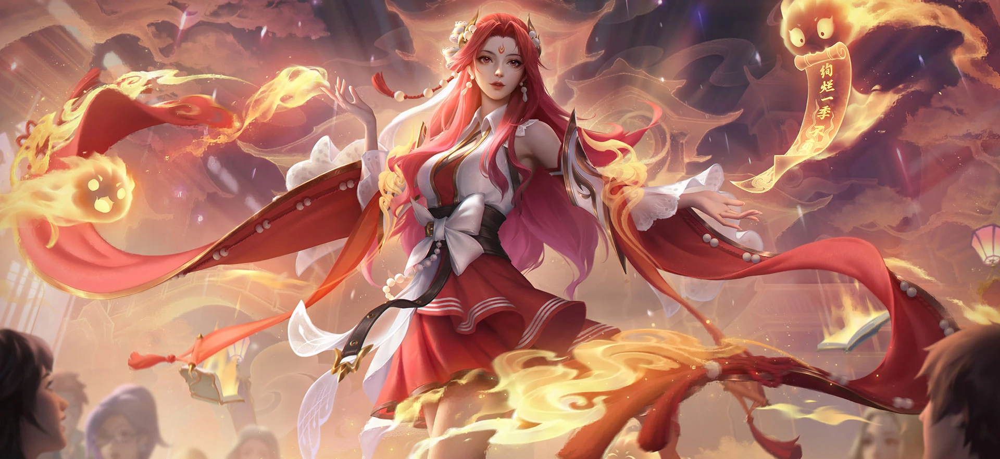

# 必需

Referring to Figure 1, generate an image of Nilou. She is dressed in modern fashion, wearing a light blue short jacket over a red short-sleeved crop top, and dark blue shorts. Behind her is a graffiti wall, which matches her main color scheme perfectly.

# 人物设定
## 1
A white stand-up collar blouse, a black bow belt, and a red pleated skirt, all adorned with flowing red ribbons decorated with white pearls. Golden water droplets and floating blue ancient scrolls surround her. Her demeanor is elegant and confident, bathed in warm light, creating a fantastical and magical atmosphere. Don't forget her headdress and veil.

## 2
@Create image 
Nilou comes from Genshin Impact. 
Scene concept: Nilou lies in the oasis of the Sumeru Desert, just like the impressive scene in the character demonstration PV. The blue lake reflects the sky, and the Patisha orchid blooms on the shore. She leaned slightly, her red hair scattered by the water's edge, her eyes pure and peaceful. The divine eye of water element shone slightly around her waist. This scene showcases Nilou's profound connection with "water" and "water lilies" - she blooms like a water lily in a desert oasis.  Composition suggestion: Horizontal composition, with Nilou located in the lower third of the picture, and a large sky and distant desert outline above. The reflection on the water surface enhances the symmetrical beauty and tranquility of the image.  Color scheme: Blue lake water x Golden desert x Pure contrast between Nilou's red hair and white clothing

## 3
16:9 2K wallpaper format
Scene concept: Nilou holds a one handed sword and displays a dance like posture in battle. Her every combat move is an extension of dance, including the "Moon Dance Step" for general attacks, the "Seven Domain Dance Step" for elemental combat techniques, and the "Floating Lotus Dance Step · Distant Dream Listening Spring" for elemental bursts. The scene captures the moment when she spins and swings her sword, and the water element draws a beautiful arc at the tip of the sword, like a blooming water lily in the water. The red lotus tattoo on her back is faintly visible as she dances.

Composition suggestion: Diagonal dynamic composition, Nilou's body is in a rotating or stretching posture, and the water element trajectory drawn by the one handed sword forms an arc that runs through the picture. You can add elements such as water rings or rich nuclei as background decorations.

Color scheme: Water blue (water element special effect) x Dark background background contrast x Nilou red hair jumping embellishment

# 参考图
## 4 （参考其他游戏类似形象的角色）

Prompt

Masterpiece, best quality, ultra-detailed, 4K anime fantasy wallpaper, 16:9 cinematic composition, Nilou from Genshin Impact performing an enchanting ceremonial dance at the center of the Zubayr Theater during the Sabzeruz Festival. Nilou has long flowing scarlet-red hair, bright turquoise eyes, her iconic black-and-gold horned headdress, white veil, and elegant white, pale-blue, navy, and gold dancer costume with intricate jewelry, tassels, translucent fabric, and lotus ornaments. Preserve her recognizable facial features and canonical character design.

She floats gracefully above the stage with one hand raised beside her face and the other extended toward the audience, fingers elegant and anatomically correct. Her body forms a poised, flowing dance silhouette. Large translucent fabric ribbons and luminous Hydro streams spiral around her like dancing silk, forming water lotuses, crescent-shaped waves, sparkling droplets, bubbles, and soft blue aquatic spirits. A brilliant lotus-shaped Hydro bloom unfolds beneath her feet.

The background shows a magnificent open-air Sumeru theater with ornate arches, hanging lanterns, colorful festival decorations, flowing curtains, lotus pools, and distant palace architecture. Silhouetted spectators watch from the foreground, creating depth and emphasizing her position as the star performer. Scattered flower petals and glowing water particles drift through the air.

Dreamlike dusk sky, warm golden sunset rays mixed with cool cyan and sapphire Hydro light, dramatic volumetric lighting, rim lighting around her hair and costume, cinematic perspective, dynamic flowing cloth, strong visual depth, elegant fantasy atmosphere, harmonious red-blue-gold color palette, highly detailed face, expressive eyes, polished anime rendering, intricate costume textures, sharp foreground subject, atmospheric background, wallpaper composition, no text.

Negative prompt

low quality, worst quality, low resolution, blurry, pixelated, noisy, oversaturated, washed out, flat lighting, dull colors, bad composition, cropped head, cropped feet, character too small, duplicate character, multiple Nilous, inaccurate character design, wrong hair color, wrong eye color, missing horned headdress, incorrect costume, modern clothing, fire powers, flames, Pyro effects, weapon, sword, shield, wings, animal ears, tail, mature-looking face, photorealistic face, distorted face, asymmetrical eyes, cross-eyed, malformed hands, bad hands, extra fingers, missing fingers, fused fingers, broken fingers, oversized hands, twisted wrists, extra arms, missing limbs, deformed anatomy, unnatural pose, dislocated joints, duplicated accessories, tangled fabric, floating jewelry, messy water effects, opaque water, cluttered background, illegible text, letters, subtitles, logo, watermark, signature, border, frame.