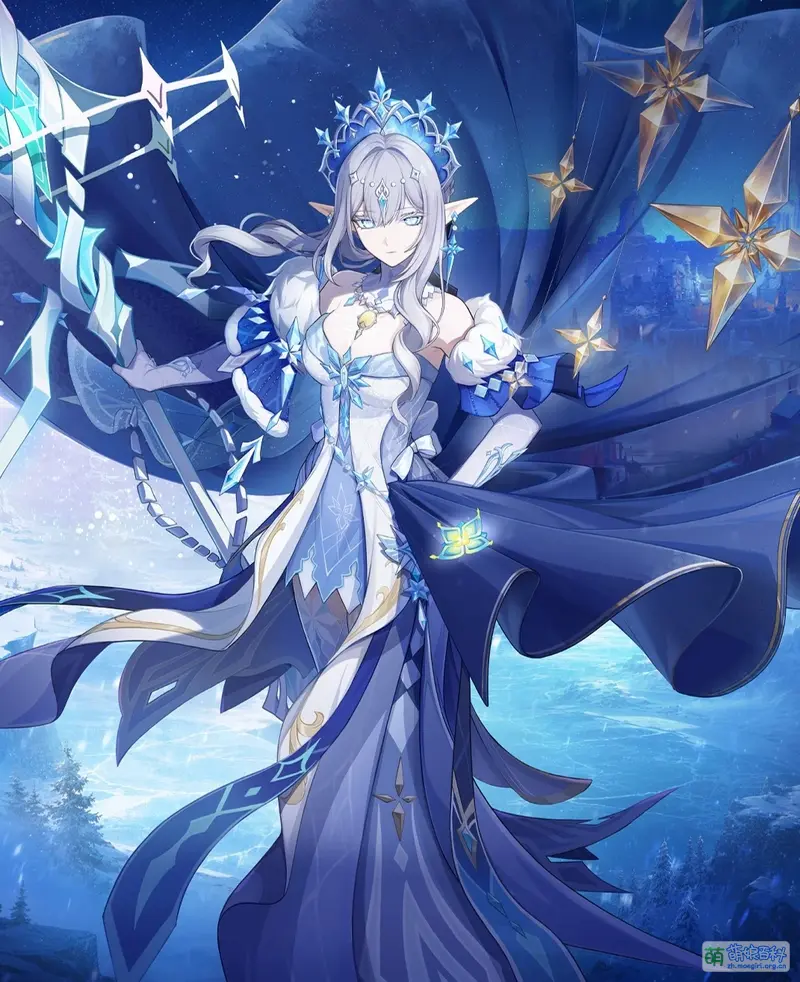
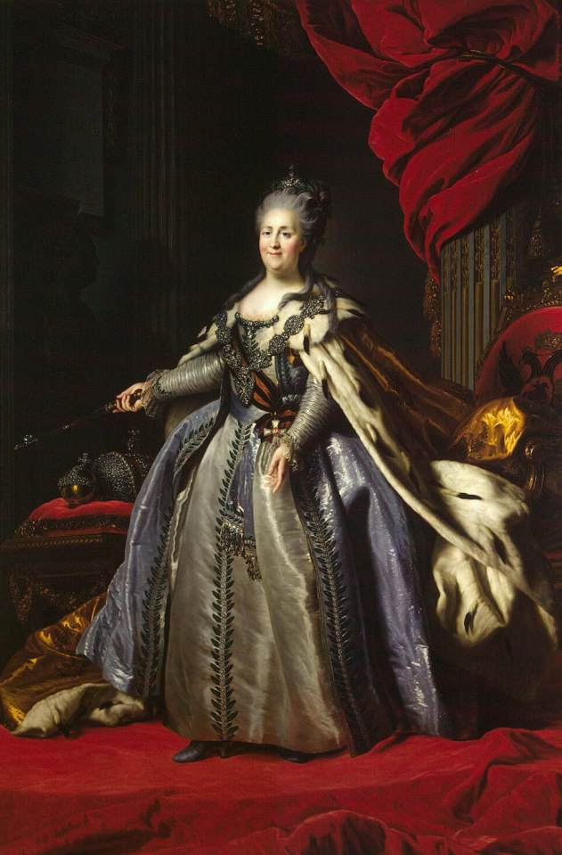

# 安娜丝塔夏 Anastasya (The Tsaritsa) — 2026.08.03

> 视频类型：A · 角色单人壁纸合集
> 角色来源：原神 7.0「无神怜爱的雪国」· 尘世七执政·冰之神·至冬国女皇
> 身份：至冬国女皇「冰之女皇」/ 全名安娜丝塔夏·费奥多罗夫娜·雪奈茨娜娅 / 愚人众唯一效忠对象 / 妖精一族
> 设计参考：银白长发 + 蓝色瞳孔 + 精灵尖耳 + 露肩黑色主调宫廷礼服 + 白色丝袜 + 权杖/长柄武器，俄式沙皇美学融合蒸汽朋克
> 热点背景：原神7.0至冬版本前瞻特别节目于7月31日晚8点首播，冰之女皇完整形象时隔6年首次曝光，全网热度爆发式增长，B站/微博/米游社/小红书均为头部话题，7.0版本将于8月12日正式上线
> 今日特殊：前瞻直播刚结束的第一个工作日，话题热度处于顶峰期，8.12版本上线倒计时进行中

# 必需

Refer to the attached reference image (Figure 1). Generate a similar style image of Anastasya (the Tsaritsa) from Genshin Impact sitting in front of a bold graffiti wall with a regal, faintly amused smirk, looking at the camera with quiet imperial confidence. She is wearing modern street-fashion: an oversized black bomber jacket with icy-blue and silver frost-pattern embroidery worn open over a fitted dark crop top, paired with a pleated black mini skirt, sheer white thigh-high stockings, and chunky black-and-white platform sneakers. Keep her recognizable features: long flowing silver-white hair, pale icy-blue eyes with a regal gaze, pointed elf ears, delicate frost-motif hair ornaments. The graffiti wall behind her should feature pale blue, white, and silver snowflake motifs, frost cracks, and abstract crown-and-scepter tags echoing her Cryo Archon iconography. Hands resting naturally at her sides, perfect hands, five fingers on each hand, well-defined fingers, natural hand pose. 16:9 2K wallpaper format.

Negative Prompt: low quality, worst quality, blurry, pixelated, bad anatomy, bad hands, extra fingers, fewer fingers, missing fingers, fused fingers, webbed fingers, merged fingers, overlapping fingers, deformed fingers, mutated fingers, six fingers, four fingers, three fingers, more than five fingers, less than five fingers, disfigured hands, poorly drawn hands, bad hand anatomy, asymmetrical hands, broken fingers, claw hands, blurry hands, indistinct fingers, smeared hands, extra limbs, chibi, childish, wrong hair color, wrong eye color, round ears, warm tropical colors, fire effects, text, watermark, logo, signature.

# 人物设定

## 1 — 至冬宫御座（女皇威仪·初次降临）

Positive Prompt:
16:9 wallpaper, Anastasya the Tsaritsa from Genshin Impact, highly detailed anime-style illustration, polished game-art quality, cinematic composition, grand imperial atmosphere, cold majestic lighting.

Depict Anastasya enthroned in the Palace of Snezhnaya, seated upon an ornate ice-carved throne inlaid with silver filigree and frost crystal motifs. Her long silver-white hair cascades over one shoulder, catching pale blue light. Her icy-blue eyes gaze down at the viewer with serene, unreadable authority — the expression of a ruler who has carried the weight of centuries in tender silence. She wears an elegant black off-shoulder gown with deep navy-blue underlayers, trimmed in silver frost embroidery that resembles snowflake lace, sheer white stockings visible beneath the gown's slit, and long black opera gloves. Delicate icy hair ornaments crown her head like a diadem of frozen light.

One hand rests along the armrest of the throne, the other holds a slender ceremonial scepter tipped with a glowing Cryo crystal, perfect hands, five fingers on each hand, well-defined fingers, natural hand pose, elegant grip.

The background is the vast frost-marbled throne hall of Snezhnaya: towering ice pillars, aurora-like light filtering through stained glass depicting snowflakes and steam-punk gears, Fatui guards in silhouette flanking the distant doorway. Cold blue-white lighting dominates, with subtle warm gold accents from candlelight, evoking both severity and hidden tenderness. Wide symmetrical composition centering Anastasya on the throne, camera at a slightly low angle to emphasize her regal stature.

Negative Prompt:
low quality, worst quality, blurry, bad anatomy, bad hands, extra fingers, fewer fingers, missing fingers, fused fingers, webbed fingers, merged fingers, overlapping fingers, deformed fingers, mutated fingers, six fingers, four fingers, three fingers, more than five fingers, less than five fingers, disfigured hands, poorly drawn hands, bad hand anatomy, asymmetrical hands, broken fingers, claw hands, blurry hands, indistinct fingers, smeared hands, extra limbs, chibi style, warm tropical setting, bright sunshine, cheerful innocent expression, casual outfit, fire effects, wrong hair color, wrong eye color, round ears, modern city background, text, watermark.

## 2 — 骤雪独白（童谣与暴风雪·孤独的慈爱）

Positive Prompt:
16:9 wallpaper, Anastasya the Tsaritsa from Genshin Impact, highly detailed anime-style illustration, polished game-art quality, melancholic and haunting atmosphere, cinematic storytelling.

Depict the moment from the "Sudden Snow" trailer where Anastasya stands alone at a frost-covered balcony overlooking a blizzard-swept Snezhnayan city below. Her silver-white hair and the hem of her dark cloak whip gently in the freezing wind. Her expression is quietly sorrowful yet tender — lips slightly parted as if mid-lullaby, icy-blue eyes distant, reflecting centuries of restrained love for a world that cannot know her kindness. One hand rests over her chest, the other lightly touches the frosted balcony railing, perfect hands, five fingers on each hand, well-defined fingers, natural hand pose.

She wears a heavier version of her royal attire for the cold: a floor-length black coat lined with pale fur, silver frost embroidery along the collar and cuffs, the same elegant off-shoulder gown glimpsed beneath. Snowflakes settle on her hair and shoulders without melting — a subtle nod to her Cryo divinity.

The background shows the steampunk-Gothic skyline of Snezhnaya through the blizzard: dark spired towers, glowing amber windows, distant smokestacks, and search-light beams cutting through the snowstorm. The mood should evoke the lyric "Sleep now, child of this world... for the god has promised you shall be loved unconditionally" — beautiful, aching, and quietly powerful.

Cinematic vertical-leaning composition with Anastasya at the right third, the storm-lit city sprawling below and behind her.

Negative Prompt:
low quality, blurry, bad anatomy, bad hands, extra fingers, fewer fingers, missing fingers, fused fingers, webbed fingers, merged fingers, overlapping fingers, deformed fingers, mutated fingers, six fingers, four fingers, three fingers, more than five fingers, less than five fingers, disfigured hands, poorly drawn hands, bad hand anatomy, asymmetrical hands, broken fingers, claw hands, blurry hands, indistinct fingers, smeared hands, deformed, cheerful bright expression, warm sunny setting, tropical colors, fire effects, chibi style, round ears, wrong hair color, wrong eye color, text, watermark.

## 3 — 对峙死之执政（若娜瓦·冷冽交锋）

Positive Prompt:
16:9 wallpaper, Anastasya the Tsaritsa from Genshin Impact, highly detailed anime-style illustration, polished game-art quality, dramatic confrontation atmosphere, epic cinematic tension.

Depict Anastasya standing at the center of a frozen battlefield in Snezhnaya, facing an unseen rival power to her right, her posture rigid with restrained fury and absolute authority. Her long silver hair billows sharply from a sudden gust of Cryo energy erupting around her feet, crystallizing the ground into jagged ice spires. Her expression is severe and commanding — brows drawn, eyes blazing pale blue with divine power, the face of a goddess who has decided to defy the Heavenly Principles themselves.

She wields a slender rapier-like sword crackling with frost, held forward in a poised battle stance, perfect hands, five fingers on each hand, well-defined fingers, anatomically correct grip on the hilt. Her gown's long skirt is torn at the front for combat mobility, revealing armored greaves beneath; her cloak whips violently behind her, edges fraying into shimmering ice particles.

The background is a shattered icy wasteland beneath a churning stormy sky split by aurora light, with distant silhouettes of Fatui legions standing in formation behind her. Snow and ice shards hang suspended mid-air, frozen in the moment of her power's release. Dynamic low-angle composition emphasizing her towering, divine presence, dramatic backlighting from the aurora.

Negative Prompt:
low quality, blurry, bad anatomy, bad hands, extra fingers, fewer fingers, missing fingers, fused fingers, webbed fingers, merged fingers, overlapping fingers, deformed fingers, mutated fingers, six fingers, four fingers, three fingers, more than five fingers, less than five fingers, disfigured hands, poorly drawn hands, bad hand anatomy, asymmetrical hands, broken fingers, claw hands, blurry hands, indistinct fingers, smeared hands, deformed, extra limbs, stiff pose, weak motion, static composition, cheerful expression, warm colors, fire effects, chibi style, round ears, wrong hair color, text, watermark.

## 4 — 至冬蒸汽朋克都市（工业极寒·女皇巡视）

Positive Prompt:
16:9 wallpaper, Anastasya the Tsaritsa from Genshin Impact, highly detailed anime-style illustration, polished game-art quality, steampunk industrial atmosphere, cold cinematic lighting.

Depict Anastasya walking through the industrial heart of Snezhnaya — a vast steampunk cityscape of iron rail bridges, steam vents, and gear-driven aurora generators. She strides across an elevated iron walkway overlooking the city, her long black coat trailing behind her, silver frost-pattern embroidery catching the glow of passing steam-train lights below. Her hands are clasped calmly behind her back, perfect hands, five fingers on each hand, well-defined fingers, natural hand pose, elegant composed posture.

Her expression is contemplative, gazing out over the city she rules with an unreadable mixture of pride and quiet grief. Snowflakes drift past enormous gear-mechanisms embedded in the architecture; steam-powered trains glide along elevated rails in the distance, their windows glowing warm amber against the cold blue industrial haze.

Keep her canonical features: long silver-white hair loosely tied with a frost-motif ribbon, pale blue eyes, pointed ears, elegant dark royal attire adapted with a slightly more practical high collar for the cold industrial air.

Wide cinematic composition with Anastasya on the left third, the sprawling steampunk skyline stretching into the aurora-lit horizon on the right. Cool blue-silver color palette with warm amber accent lights.

Negative Prompt:
low quality, blurry, bad anatomy, bad hands, extra fingers, fewer fingers, missing fingers, fused fingers, webbed fingers, merged fingers, overlapping fingers, deformed fingers, mutated fingers, six fingers, four fingers, three fingers, more than five fingers, less than five fingers, disfigured hands, poorly drawn hands, bad hand anatomy, asymmetrical hands, broken fingers, claw hands, blurry hands, indistinct fingers, smeared hands, deformed, tropical setting, bright sunshine, cheerful expression, casual clothing, fire effects, chibi style, round ears, wrong hair color, text, watermark.

## 5 — 现代都市御姐改造（时尚大衣·私人时刻）

Positive Prompt:
16:9 wallpaper, Anastasya the Tsaritsa from Genshin Impact, highly detailed anime-style illustration, modern high-fashion aesthetic, elegant urban winter atmosphere, polished character art.

Reimagine Anastasya in a modern high-society setting — stepping out of a black luxury car onto a snow-dusted city street at dusk. She wears an elegant floor-length white fur-trimmed wool coat over a fitted black turtleneck dress, sheer black tights, and pointed black stiletto heels. Her long silver hair is styled in soft waves beneath a small fur-accented beret. A delicate snowflake-shaped brooch pins her coat collar.

One hand holds the coat closed at her chest, the other lightly grips a black leather clutch, perfect hands, five fingers on each hand, well-defined fingers, natural hand pose. Her expression carries the same quiet regal composure — a faint, knowing smile as if she owns the very winter around her.

The background is an upscale city street at blue-hour dusk: warm-lit boutique windows, falling snow illuminated by streetlamps, distant holiday lights reflecting off wet pavement. The mood is sophisticated, cool, and quietly powerful — royalty walking unnoticed among mortals.

Medium-close cinematic composition, slight low angle, shallow depth of field blurring the bokeh city lights behind her.

Negative Prompt:
low quality, blurry, bad anatomy, bad hands, extra fingers, fewer fingers, missing fingers, fused fingers, webbed fingers, merged fingers, overlapping fingers, deformed fingers, mutated fingers, six fingers, four fingers, three fingers, more than five fingers, less than five fingers, disfigured hands, poorly drawn hands, bad hand anatomy, asymmetrical hands, broken fingers, claw hands, blurry hands, indistinct fingers, smeared hands, deformed, combat outfit, weapon, medieval fantasy setting, chibi, wrong hair color, round ears, fire effects, text, watermark.

## 6 — 冰神领域·全愚人众加护（战斗美学·元素爆发）

Positive Prompt:
16:9 wallpaper, Anastasya the Tsaritsa from Genshin Impact, highly detailed anime-style illustration, dynamic action composition, dramatic elemental effects, polished game-art quality, epic battle scene.

Depict Anastasya unleashing her domain — a massive frost-crystalline field expanding outward from her position, summoning ghostly translucent silhouettes of Fatui legions rising from the frozen ground. She stands at the center, both arms raised, fingers elegantly spread, perfect hands, five fingers on each hand, well-defined fingers, anatomically correct hands, channeling swirling Cryo energy that crystallizes into massive floating ice-shard formations spiraling around her. Her hair and cloak lift dramatically in the elemental updraft, frost patterns crawling up her arms and across her gown like living lace.

Her expression is coldly resolute, eyes glowing with intense pale-blue light — the absolute focus of a divine ruler enacting judgment on those who break the Fatui contract. Frost seals mark the ground beneath enemies in the distance, glowing runic patterns pulsing with each heartbeat of her power.

The background is a hollow battlefield transforming into a crystalline frost dominion, jagged ice spires bursting from the earth, aurora-colored energy fracturing the sky above into geometric light patterns.

Dynamic composition with Anastasya at the lower-center, ice formations and ghostly legion silhouettes radiating outward to fill the frame. Epic scale, strong upward energy flow.

Negative Prompt:
low quality, blurry, bad anatomy, bad hands, extra fingers, fewer fingers, missing fingers, fused fingers, webbed fingers, merged fingers, overlapping fingers, deformed fingers, mutated fingers, six fingers, four fingers, three fingers, more than five fingers, less than five fingers, disfigured hands, poorly drawn hands, bad hand anatomy, asymmetrical hands, broken fingers, claw hands, blurry hands, indistinct fingers, smeared hands, extra limbs, stiff pose, weak motion, flat effects, static composition, indoor scene, peaceful mood, chibi, cheerful expression, fire effects, warm colors, round ears, wrong hair color, text, watermark.

## 7 — 千年前的旅人（日常反差·善良少女的记忆）

Positive Prompt:
16:9 wallpaper, Anastasya the Tsaritsa from Genshin Impact, highly detailed anime-style illustration, soft warm lighting, nostalgic slice-of-life atmosphere, tender emotional mood, polished character art.

Depict a flashback memory of young Anastasya — before she bore the weight of the crown — traveling humbly among mortals in a quiet snow-dusted village centuries ago. She kneels gently beside a small campfire, offering a warm blanket to a shivering child seated beside her (child rendered softly out of focus, not the main subject), her expression full of unguarded warmth and gentle affection — a stark contrast to her later regal composure. Her hands carefully tuck the blanket around unseen shoulders, perfect hands, five fingers on each hand, well-defined fingers, natural gentle gesture.

She wears simple traveler's clothing: a plain hooded grey-white cloak over a modest dress, no crown or royal ornaments, her long silver hair loosely braided and slightly windswept, a few strands escaping. Snow falls softly around the campfire, its warm orange glow contrasting beautifully with the cool blue twilight of the surrounding village rooftops.

The background shows a humble snow-covered village square, wooden houses with smoke rising from chimneys, warm lantern light glowing in windows, distant mountains under a twilight sky streaked with the first hints of aurora. The mood should feel achingly tender — this is the girl who once believed love and gentleness were the world's true colors.

Composition: intimate low-angle medium shot centered on the campfire's warm glow, soft bokeh background.

Negative Prompt:
low quality, blurry, bad anatomy, bad hands, extra fingers, fewer fingers, missing fingers, fused fingers, webbed fingers, merged fingers, overlapping fingers, deformed fingers, mutated fingers, six fingers, four fingers, three fingers, more than five fingers, less than five fingers, disfigured hands, poorly drawn hands, bad hand anatomy, asymmetrical hands, broken fingers, claw hands, blurry hands, indistinct fingers, smeared hands, deformed, royal gown, crown, throne room, combat scene, weapon, harsh cold lighting, aggressive expression, multiple fully-rendered characters, text, watermark.

## 8 — 至冬7.0版本特别纪念（前瞻首曝·6年等待终章）

Positive Prompt:
16:9 wallpaper, Anastasya the Tsaritsa from Genshin Impact, highly detailed anime-style illustration, polished game-art quality, majestic celebratory atmosphere, cinematic reveal lighting, commemorative poster composition.

Create a special tribute artwork celebrating Anastasya's long-awaited full reveal, styled like an official version-key-art poster. She stands centered before the grand gates of the Winter Palace, framed by two colossal ice statues of past Cryo Archons. Her full royal regalia is on display: the black off-shoulder gown with silver frost embroidery, sheer white stockings, delicate frost diadem, and a long ceremonial scepter held upright at her side, perfect hands, five fingers on each hand, well-defined fingers, natural elegant grip. Her expression is serene and knowing, a faint smile suggesting centuries of patience finally rewarded — as if she is greeting the Traveler she has waited six years to meet.

Behind her, the aurora borealis blazes across the night sky in ribbons of pale blue, green, and violet, reflecting off the palace's frost-covered domes and spires. Snow falls in slow, cinematic motion, catching the aurora's glow like scattered diamonds. Fatui banners bearing the delusion emblem hang from the palace towers.

Symmetrical, poster-like composition with Anastasya as the sole focal point, the Winter Palace and aurora sky forming a breathtaking backdrop. The overall feel should be triumphant, historic, and quietly emotional — the culmination of years of anticipation.

Negative Prompt:
low quality, blurry, bad anatomy, bad hands, extra fingers, fewer fingers, missing fingers, fused fingers, webbed fingers, merged fingers, overlapping fingers, deformed fingers, mutated fingers, six fingers, four fingers, three fingers, more than five fingers, less than five fingers, disfigured hands, poorly drawn hands, bad hand anatomy, asymmetrical hands, broken fingers, claw hands, blurry hands, indistinct fingers, smeared hands, deformed, casual clothing, combat pose, aggressive expression, warm tropical colors, fire effects, chibi style, round ears, wrong hair color, daytime bright scene, text, watermark.

# 跨领域参考图

## 9（参考罗科托夫《叶卡捷琳娜二世加冕肖像》·俄式女皇美学融合）

Positive Prompt:
16:9 wallpaper, Anastasya the Tsaritsa from Genshin Impact, highly detailed illustration blending anime character design with 18th-century Russian Imperial court painting style, opulent regal lighting, majestic ceremonial atmosphere.

Refer to the attached painting — Fyodor Rokotov's "Coronation Portrait of Catherine II" (1763). Recreate the masterpiece's composition, pose, and grandeur with Anastasya replacing the central imperial figure. She stands in a three-quarter turn, one hand resting on a scepter, the other extended gracefully at her side, perfect hands, five fingers on each hand, well-defined fingers, anatomically correct hands, echoing Catherine's iconic coronation stance. She wears an opulent gown redesigned in her own icy palette — pale silver-blue silk with white ermine-like fur trim (rendered as frost-crystal texture instead of fur), a flowing dark blue mantle lined with pale fur draped from her shoulders, and a delicate frost diadem in place of a traditional crown.

Crucially, blend two art styles: Anastasya herself should retain her anime character design clarity (clean face, long silver-white hair, pale blue eyes, pointed ears, refined regal expression), but the surrounding environment — the heavy velvet drapery, gilded throne, ornate architectural columns — should be rendered in Rokotov's 18th-century Academic court-painting style with rich oil-paint texture, deep red velvet tones contrasted against her cool icy palette, and dramatic Baroque lighting. Add Anastasya's unique twist: where the original portrait's velvet drapery is crimson red, here it is deep midnight blue trimmed with silver frost patterns, and faint Cryo particles drift through the air like glittering snow within the grand hall.

The overall mood should feel timeless, imperial, and hauntingly beautiful — as if a Baroque master had been granted a vision of a goddess-queen from a frozen future.

Negative Prompt:
low quality, blurry, bad anatomy, bad hands, extra fingers, fewer fingers, missing fingers, fused fingers, webbed fingers, merged fingers, overlapping fingers, deformed fingers, mutated fingers, six fingers, four fingers, three fingers, more than five fingers, less than five fingers, disfigured hands, poorly drawn hands, bad hand anatomy, asymmetrical hands, broken fingers, claw hands, blurry hands, indistinct fingers, smeared hands, extra limbs, stiff pose, fully photorealistic, fully 3D rendered, flat digital art with no painterly texture, modern background, combat scene, weapon drawn as sword, harsh neon lighting, chibi style, wrong character, wrong hair color, round ears, warm red-orange color scheme replacing icy palette entirely, text, watermark.

## 10（参考极光摄影·手机竖屏壁纸）

Positive Prompt:
9:16 2K mobile wallpaper, Anastasya the Tsaritsa from Genshin Impact, highly detailed anime-style illustration, breathtaking aurora borealis photography aesthetic fused with anime character art, serene majestic night atmosphere.

Depict Anastasya standing alone atop a snow-covered cliff overlooking the frozen tundra of Snezhnaya, gazing up at a spectacular real-world-style aurora borealis display filling the sky in ribbons of teal, violet, and pale green, rendered with photographic realism for the sky and lighting while she remains in clean anime illustration style. Her long silver-white hair and dark cloak drift gently in the cold wind. Her hands are clasped loosely in front of her, perfect hands, five fingers on each hand, well-defined fingers, natural hand pose, her expression peaceful and contemplative, eyes reflecting the aurora's colors.

She wears her elegant dark royal gown with fur-lined cloak, frost diadem catching starlight. Below her, the vast tundra stretches into darkness, dotted with the distant glow of Snezhnaya's industrial city lights. Snow-capped mountains silhouette against the aurora on the horizon.

Vertical composition optimized for mobile screens: Anastasya positioned in the lower third, the towering aurora-filled sky occupying the upper two-thirds of the frame, generous negative space at the very top for phone status bar accommodation.

Negative Prompt:
low quality, blurry, cropped, bad anatomy, bad hands, extra fingers, fewer fingers, missing fingers, fused fingers, webbed fingers, merged fingers, overlapping fingers, deformed fingers, mutated fingers, six fingers, four fingers, three fingers, more than five fingers, less than five fingers, disfigured hands, poorly drawn hands, bad hand anatomy, asymmetrical hands, broken fingers, claw hands, blurry hands, indistinct fingers, smeared hands, wrong character, cheerful bright expression, warm daytime lighting, tropical setting, chibi style, wrong hair color, round ears, text, watermark.
