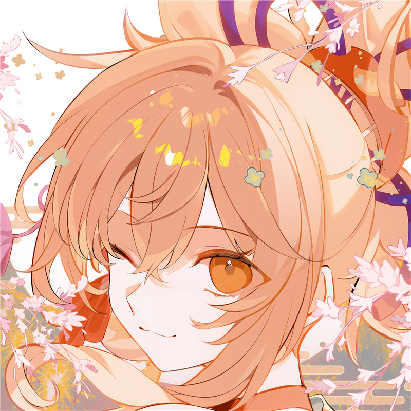
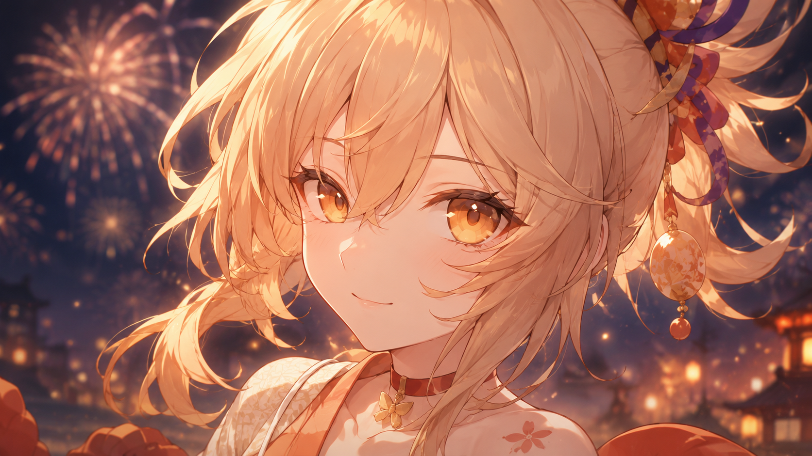

# 必需

Referring to Figure 1, generate an image of Yoimiya in a similar style: she is sitting in front of a graffiti-covered wall (featuring fireworks patterns and a predominantly orange-yellow color scheme) with a cool, disdainful expression. She is wearing a modern outfit consisting of an orange cropped vest over a white crop top, paired with denim shorts.

# 人物设定
## 1
Positive Prompt（16:9）：

Yoimiya (Genshin Impact), Queen of the Summer Festival, standing on a high vantage point at the right side of the frame, turning head back with a brilliant smile, holding a fuse in her hand, magnificent fireworks blooming across the night sky on the left, fireworks forming the shape of an inverted Inazuma City and Raiden's emblem, warm golden and crimson glow illuminating her face, dramatic wideshot, 16:9 aspect ratio, horizontal composition, expansive sky and cityscape, cinematic lighting, 4K, masterpiece, anime style.

Negative Prompt：

lowres, bad anatomy, bad hands, text, error, missing fingers, extra digit, fewer digits, cropped, worst quality, low quality, normal quality, jpeg artifacts, signature, watermark, username, blurry, deformed, ugly, bad proportions, extra limbs, cloned face, disfigured, gross proportions, malformed limbs, missing arms, missing legs, extra arms, extra legs, fused fingers, too many fingers, long neck, boring, mundane, dull lighting, flat colors, overexposed.

## 2
Positive Prompt（16:9）：

Yoimiya (Genshin Impact) in combat, drawing her bow at the left, flames accumulating on the arrow arcing toward the right, Niwabi Fire-Dance activated, fireworks aura surrounding her, Ryuukin Saxifrage ultimate ready, dynamic action pose, leaping and turning mid-air, intense battle atmosphere, Inazuma wilderness background extending horizontally, night scene with firelight, epic and powerful, vibrant flames, action shot, 16:9 aspect ratio, widescreen dynamic composition, 4K, masterpiece.

Negative Prompt：

lowres, bad anatomy, bad hands, text, error, missing fingers, extra digit, fewer digits, cropped, worst quality, low quality, normal quality, jpeg artifacts, signature, watermark, username, blurry, deformed, ugly, bad proportions, extra limbs, cloned face, disfigured, gross proportions, malformed limbs, missing arms, missing legs, extra arms, extra legs, fused fingers, too many fingers, long neck, boring, mundane, dull lighting, flat colors, overexposed.

## 3
@Create image 
Positive Prompt（16:9）：
Yoimiya (Genshin Impact) crouching by the water at the lower center, watching golden fish fireworks swimming on the water surface spanning left to right, colorful lights reflecting on the wide river, fireworks glowing in rainbow colors and bubbling, night scene with gentle moonlight, Yoimiya's eyes sparkling with childlike joy, peaceful and magical atmosphere, water reflection extending horizontally, traditional Japanese summer festival vibe, 16:9 aspect ratio, widescreen dreamy view, 4K, highly detailed, whimsical.
Negative Prompt：
lowres, bad anatomy, bad hands, text, error, missing fingers, extra digit, fewer digits, cropped, worst quality, low quality, normal quality, jpeg artifacts, signature, watermark, username, blurry, deformed, ugly, bad proportions, extra limbs, cloned face, disfigured, gross proportions, malformed limbs, missing arms, missing legs, extra arms, extra legs, fused fingers, too many fingers, long neck, boring, mundane, dull lighting, flat colors, overexposed.

# 参考图
## 4
### 4.1

Refer to the attached image and generate a close-up wallpaper image for her to showcase her beauty. There are fireworks in the background (only a small part), and most of the pictures should show the expressions of the characters. It should be a bust

### 4.2

Resize this image to 9:16, 2K resolution, for mobile wallpaper. Expand the body parts of the characters in the image as needed.