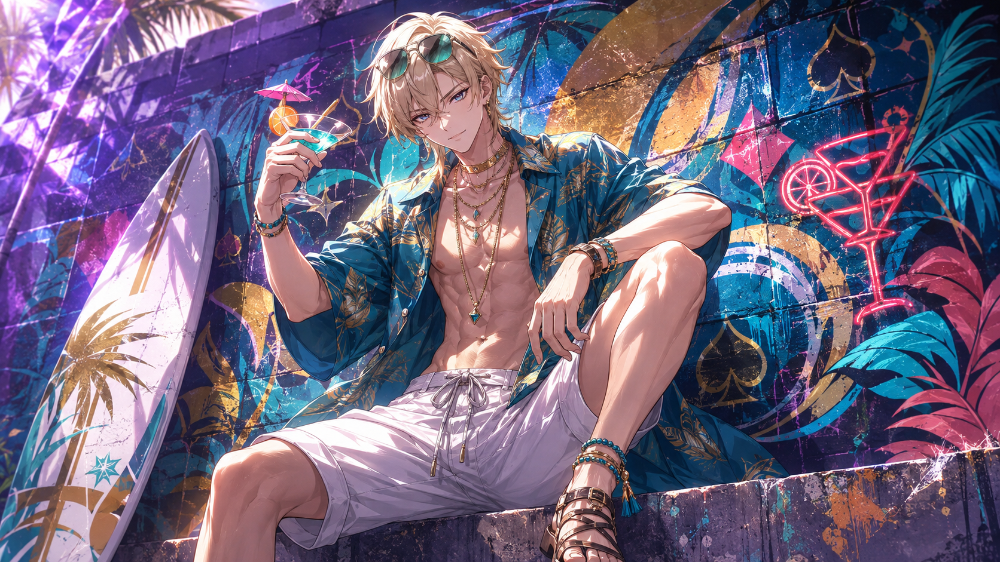

# 戴因斯雷布 Dainsleif — 2026.09.16
> 视频类型：A · 角色单人壁纸合集
> 角色来源：原神 至冬篇关键人物 · 坎瑞亚遗民 / 「拾枝者」（未入池 NPC，无元素神之眼，命之座·蛇环座）
> 身份：坎瑞亚「白夜国」黄昏军队长，五百年的守望者；魔神任务主线中反复登场的引路人
> 热点背景：9 月 12 日 7.1「往冥府的安魂歌」前瞻海报「巅峰赛」阵容（若娜瓦、莱茵多特、冰之女皇、皮耶罗、戴因斯雷布）引爆讨论，7.1 版本 PV（9/13 发布）中戴因实机亮相；9/23 版本上线后至冬篇与坎瑞亚线剧情将迎来关键节点；派蒙缺席海报引发的猜想也集中在戴因与旅行者的立场悬念上
> 今日特殊：无节日；7.1 上线前一周空窗期 + 六周年（9.28）预热，选至冬篇剧情核心的未入池高人气角色卡位
> 选定类型理由：重大剧情热点（7.1 前瞻海报+PV 实机）→ 类型 A 深度呈现
> 选定角色理由：官方热点权重高（前瞻海报「巅峰赛」阵容 + PV 实机亮相）；工作区 20 个原神角色目录首次覆盖该角色；社区热度长期稳定（「五百年守望」「卡池幽灵」等经典梗持续活跃）；外观辨识度极强（金发、星形瞳、星空内衬披风、半面具），与星空/黄昏/废墟主题壁纸表现力极强
> 参考图说明：已获取 B站WIKI 官方立绘两张（splash-art.png 官方宣传画 2250px、splash-art-2.png 官方角色介绍图），经视觉校对：金色层次短发斜刘海遮右额、冰蓝色眼瞳（设定为星形瞳）、黑色高领紧身制服、金色胸甲嵌淡水晶与蓝宝石、单臂黑色铠装护臂、深蓝灰高领披风内衬如星空缀星点、破损下摆饰金色结纹、褪色半面具挂腰侧。神之眼栏为空白（无元素属性），能力表现为蓝色星芒/深渊能量
> 跨领域参考图说明：⚠️ Wikimedia/Unsplash 图片源在本网络环境超时不可达，两张跨领域 prompts 采用纯文本描述（彼得·尼古拉·阿博《奥丁的狂猎》与北欧峡湾极光摄影均为公知素材，特征明确），未附参考图文件

---

# 必需

## 1 — 涂鸦墙街头风（Graffiti Wall Street Style · 男版公式）

Refer to the attached reference image (Figure 1) for composition, graffiti-wall style, and overall atmosphere only. Generate an image of Dainsleif, a tall young man from Genshin Impact, sitting casually in front of a bold graffiti wall. Dainsleif is male — do not render him with feminine features or attire. Dainsleif is seated in a relaxed but dominant posture, perched on a low concrete ledge with one knee raised and his forearm resting on it, his other leg stretched out casually, one hand loosely holding his pale half-mask against the raised knee, his body language calm, controlled, and quietly provocative. His expression should show cold, disdainful eyes, aloof, sharp, and superior, as if he is silently judging the viewer — the courteous wanderer completely absent, replaced by a prince of a fallen kingdom who has watched your kind for five hundred years and remains unimpressed.

Keep Dainsleif's recognizable features: short layered golden-blond hair with tousled bangs swept across his forehead partially covering the right side, piercing ice-blue eyes with faint star-shaped pupils, fair skin, handsome refined features. He has a masculine athletic build with broad shoulders. Blend his canonical design with a modern edgy streetwear aesthetic: a fitted black long-sleeve mock-neck top under an open dark navy bomber jacket with subtle gold knot-pattern embroidery along the sleeves, black relaxed-fit cargo pants with utility straps, a single ornate black armored gauntlet worn on one forearm as a statement piece, a silver chain necklace with a four-pointed star pendant, a pale half-mask keychain hanging from his belt, and black-and-gold high-top sneakers with constellation stitching. Preserve his identity while giving him a fresh urban street-style look.

The graffiti wall behind him should be vivid and layered, full of expressive abstract shapes and energetic street-art textures in deep navy blue, starlight gold, and ice-blue tones, with graffiti elements including "DAINSLEIF" in stylized runic lettering, four-pointed star glyphs and constellation lines, a black-sun eclipse emblem with golden ring, a twilight sword silhouette, and celtic knot swirls, creating a rebellious urban backdrop that resonates with his character theme. Add subtle abyssal blue energy effects, floating pale star sparks, and faint glowing constellation lines around him to reinforce his identity.

Use a wide cinematic framing suitable for a 16:9 wallpaper, with Dainsleif as the main focal point while still showing enough of the graffiti wall and surrounding environment for atmosphere. The mood should feel cool, stylish, intimidating, and mysterious. Highly detailed background, rich shadows, ice-blue and gold glowing highlights, sharp focus on Dainsleif, and a refined high-end anime illustration look.

perfect hands, five fingers on each hand, anatomically correct hands, well-defined fingers, natural relaxed hand pose, one hand loosely holding the pale half-mask against his raised knee.

Negative Prompt:
low quality, worst quality, blurry, pixelated, bad anatomy, extra limbs, bad hands, extra fingers, fewer fingers, missing fingers, fused fingers, webbed fingers, merged fingers, overlapping fingers, deformed fingers, mutated fingers, six fingers, four fingers, three fingers, more than five fingers, less than five fingers, disfigured hands, poorly drawn hands, bad hand anatomy, asymmetrical hands, broken fingers, claw hands, blurry hands, indistinct fingers, smeared hands, standing, standing pose, upright posture, singing, open mouth singing, warm smile, gentle smile, cheerful expression, cute expression, adorable, sweet, innocent, game canonical outfit, official costume, fantasy dress, medieval clothing, armor, full gown, formal dress, beach background, ocean background, nature background, indoor background, plain background, minimal background, missing graffiti wall, low detail graffiti, generic graffiti, wrong graffiti colors, wrong streetwear, missing jacket, long dress, business suit, school uniform, feminine, androgynous, female body, curvy figure, skirt, crop top, tube top, fishnet, thigh strap, makeup, lipstick, slender feminine figure, wrong gender, text, watermark, logo, signature.

---

## 2 — 褪色半面具·五百年的守夜（角色特写肖像 / Close-up Portrait）

Refer to the attached reference image (Figure 2). Generate a cinematic close-up portrait of Dainsleif from Genshin Impact. He holds his signature pale half-mask — a cracked ivory-white mask with a thin gold rim and a single blue gem at its brow — close to the left side of his face, tilted at eye height, partially obscuring his left eye through the mask's empty eye hole. His visible right eye gazes directly at the viewer — simultaneously composed and grieving, the look of someone who greets every new century with the same courtesy because stopping to mourn would mean drowning. Expression: a faint courteous calm that never reaches relief, as if the mask in his hand weighs exactly as much as the kingdom it belongs to. Dramatic single-source lighting from the upper right casts deep chiaroscuro across his features, the ivory mask glowing faint cold blue where the light grazes its cracked surface, its blue gem catching a single sharp highlight. His fair skin contrasts sharply against a pure black background. His signature golden-blond layered hair with bangs swept across his forehead falls softly across the right side of the frame; the high navy collar of his black uniform and a hint of his gold chest plate are only barely visible at the bottom edge. A prince who refused a crown, keeping vigil over a kingdom of ghosts for five hundred years. 16:9 2K wallpaper.

perfect hands, five fingers on each hand, anatomically correct hands, well-defined fingers, fingers elegantly holding the mask rim.

Negative Prompt:
low quality, worst quality, blurry, pixelated, bad anatomy, extra limbs, bad hands, extra fingers, fewer fingers, missing fingers, fused fingers, webbed fingers, merged fingers, overlapping fingers, deformed fingers, mutated fingers, six fingers, four fingers, three fingers, more than five fingers, less than five fingers, disfigured hands, poorly drawn hands, bad hand anatomy, asymmetrical hands, broken fingers, claw hands, blurry hands, indistinct fingers, smeared hands, full body shot, wide shot, landscape, multiple subjects, busy background, bright cheerful lighting, outdoor scene, action pose, weapon drawn, standing, chibi, female, wrong gender, wrong hair color, wrong eye color, text, watermark, logo, signature.

---

## 2b — 特写肖像·手机竖屏版（9:16 · 胸部及以上取景）

Positive Prompt:
9:16 vertical mobile wallpaper, cinematic close-up portrait of Dainsleif from Genshin Impact. Chest-up framing, his face as the focal point of the tall composition, no full body. He holds his signature pale half-mask — a cracked ivory-white mask with a thin gold rim and a single blue gem at its brow — close to the left side of his face, tilted at eye height, partially obscuring his left eye through the mask's empty eye hole. His visible right eye gazes directly at the viewer — simultaneously composed and grieving, the look of someone who greets every new century with the same courtesy because stopping to mourn would mean drowning. Expression: a faint courteous calm that never reaches relief. Dramatic single-source lighting from the upper right casts deep chiaroscuro across his features, the ivory mask glowing faint cold blue where the light grazes its cracked surface, its blue gem catching a single sharp highlight. His fair skin contrasts sharply against a pure black background. His signature golden-blond layered hair with bangs swept across his forehead falls softly across the right side of the frame; the high navy collar of his black uniform and a hint of his gold chest plate are only barely visible at the bottom edge. A prince who refused a crown, keeping vigil over a kingdom of ghosts for five hundred years. perfect hands, five fingers on each hand, anatomically correct hands, well-defined fingers, fingers elegantly holding the mask rim.

Negative Prompt:
low quality, worst quality, blurry, pixelated, bad anatomy, extra limbs, bad hands, extra fingers, fewer fingers, missing fingers, fused fingers, webbed fingers, merged fingers, overlapping fingers, deformed fingers, mutated fingers, six fingers, four fingers, three fingers, more than five fingers, less than five fingers, disfigured hands, poorly drawn hands, bad hand anatomy, asymmetrical hands, broken fingers, claw hands, blurry hands, indistinct fingers, smeared hands, full body shot, wide shot, lower body, legs, feet, landscape, multiple subjects, busy background, bright cheerful lighting, outdoor scene, action pose, weapon drawn, standing, chibi, female, wrong gender, wrong hair color, wrong eye color, text, watermark, logo, signature.

---

# 人物设定

## 3 — 坎瑞亚地底星空·白夜国的遗恨（身份/阵营场景）

Positive Prompt:
16:9 2K wallpaper, Dainsleif from Genshin Impact, highly detailed anime-style illustration, polished game-art quality, majestic subterranean ruins atmosphere, solemn and mythic mood.

Depict Dainsleif standing amid the buried ruins of fallen Khaenri'ah deep underground. His unmistakable features: short layered golden-blond hair with tousled bangs swept across his forehead partially covering the right side, piercing ice-blue eyes with faint star-shaped pupils, fair skin, tall elegant masculine figure with broad shoulders. He wears his canonical outfit: a form-fitting black uniform with a dark navy high collar, an ornate gold chest plate set with a pale cut crystal and glowing blue gems, one forearm sheathed in an ornate black armored gauntlet, and a dark blue-grey high-collared cape whose inner lining glitters like a starry night sky, its tattered asymmetric hem edged with golden knot patterns; his pale half-mask hangs at his hip.

Above him stretches the impossible subterranean sky of Khaenri'ah — a vast cavern ceiling scattered with cold glowing star motes and a black-sun eclipse emblem faintly burning in gold at its zenith. Broken white-stone columns and collapsed archways recede into darkness, thin ribbons of pale blue light drifting between them like memories refusing to settle. He stands with one hand raised loosely at his side, and where his gloved fingers open, a tiny swirl of blue starlight gathers — a star plucked from the underground sky, held in the palm of the man who remembers every name it once lit. perfect hands, five fingers on each hand, anatomically correct hands, well-defined fingers, one hand raised palm-up beneath the drifting starlight, the other relaxed at his side.

The mood is majestic, mournful, and quietly defiant — a survivor giving a tour of his own kingdom's grave. Color palette: deep navy, starlight gold, ice blue, pale stone grey.

Negative Prompt:
low quality, worst quality, blurry, pixelated, bad anatomy, extra limbs, bad hands, extra fingers, fewer fingers, missing fingers, fused fingers, webbed fingers, merged fingers, overlapping fingers, deformed fingers, mutated fingers, six fingers, four fingers, three fingers, more than five fingers, less than five fingers, disfigured hands, poorly drawn hands, bad hand anatomy, asymmetrical hands, broken fingers, claw hands, blurry hands, indistinct fingers, smeared hands, wrong hair color, wrong eye color, female, wrong gender, daylight, sunny sky, casual modern clothing, chibi, photorealistic, text, watermark, logo, signature.

---

## 4 — 蒙德酒馆夜话·拾枝者的故事会（剧情经典场景）

Positive Prompt:
16:9 2K wallpaper, Dainsleif from Genshin Impact, highly detailed anime-style illustration, polished game-art quality, warm tavern interior, intimate storytelling night atmosphere.

Depict Dainsleif seated at a corner wooden table in a cozy Mondstadt tavern at night, faithfully capturing his recurring role as the mysterious storyteller of the Traveler's journey. His features: short layered golden-blond hair with tousled bangs swept across his forehead, piercing ice-blue eyes with faint star-shaped pupils gleaming softly in the lamplight, fair skin, tall masculine figure. He wears his canonical outfit: black uniform with dark navy high collar, ornate gold chest plate with a pale crystal and blue gems, black armored gauntlet on one forearm, and the dark blue-grey cape with starry inner lining draped over the chair back behind him, its golden knot patterns catching the warm light; the pale half-mask rests on the table beside an untouched glass of apple cider.

He leans forward slightly, one gloved hand gesturing mid-story above the table, his expression a rare gentle wry amusement — the face of a man five hundred years old telling a five-hundred-year-old joke to an audience of one. perfect hands, five fingers on each hand, anatomically correct hands, well-defined fingers, right hand gesturing naturally above the table, left hand resting on the table edge.

The tavern glows around him: honey-warm lantern light, oak beams, a stone hearth crackling in the background, windwheel aster flowers in a small vase on the windowsill, and through the frost-edged window the night rooftops of Mondstadt under the moon. The mood is warm, intimate, and bittersweet — the loneliest man in Teyvat, at his most at home in someone else's tavern.

Negative Prompt:
low quality, worst quality, blurry, pixelated, bad anatomy, extra limbs, bad hands, extra fingers, fewer fingers, missing fingers, fused fingers, webbed fingers, merged fingers, overlapping fingers, deformed fingers, mutated fingers, six fingers, four fingers, three fingers, more than five fingers, less than five fingers, disfigured hands, poorly drawn hands, bad hand anatomy, asymmetrical hands, broken fingers, claw hands, blurry hands, indistinct fingers, smeared hands, wrong hair color, wrong eye color, female, wrong gender, dark gritty atmosphere, combat pose, serious battle expression, outdoor daylight, chibi, photorealistic, text, watermark, logo, signature.

---

## 5 — 午夜天文图书馆·暗黑学院风（现代风改造）

Positive Prompt:
16:9 2K wallpaper, Dainsleif from Genshin Impact, highly detailed anime-style illustration, polished game-art quality, dark academia aesthetic, grand old library at midnight, moody scholarly atmosphere.

Reimagine Dainsleif as a timeless scholar in a grand midnight library. His iconic features remain: short layered golden-blond hair with tousled bangs swept across his forehead, piercing ice-blue eyes with faint star-shaped pupils, fair skin, tall elegant masculine figure with broad shoulders. His modernized outfit: a black turtleneck under a tailored charcoal waistcoat with a silver pocket watch chain, a long black wool coat draped over his shoulders like a cape, slim black trousers, and a silver four-pointed star lapel pin. One forearm retains his signature ornate black armored gauntlet as a mysterious accent bridging his canonical design.

He stands beside a towering brass armillary sphere and a celestial globe, an open leather-bound chronicle on the reading stand before him, one hand resting flat on the page as if holding five centuries still. His expression is calm, penetrating, and faintly melancholic, lamplight pooling gold over his hair. perfect hands, five fingers on each hand, anatomically correct hands, well-defined fingers, right hand resting flat on the open chronicle, left hand tucked into his coat pocket.

Around him, impossibly tall bookshelves vanish into shadow, dust motes drift through a single cone of lamplight, and through the tall arched window behind him a cold blue night sky scatters faint stars — the same stars printed on the globe at his side. The mood is dark academia romance — a man who has read every book about the end of the world, still checking his own footnotes.

Negative Prompt:
low quality, worst quality, blurry, pixelated, bad anatomy, extra limbs, bad hands, extra fingers, fewer fingers, missing fingers, fused fingers, webbed fingers, merged fingers, overlapping fingers, deformed fingers, mutated fingers, six fingers, four fingers, three fingers, more than five fingers, less than five fingers, disfigured hands, poorly drawn hands, bad hand anatomy, asymmetrical hands, broken fingers, claw hands, blurry hands, indistinct fingers, smeared hands, wrong hair color, wrong eye color, female, wrong gender, fantasy medieval gown, game canonical cape outfit, daylight, outdoor scene, chibi, photorealistic, text, watermark, logo, signature.

---

## 6 — 黄昏之剑·星芒审判（动态/战斗场景）

Positive Prompt:
16:9 2K wallpaper, Dainsleif from Genshin Impact, highly detailed anime-style illustration, dynamic action composition, dramatic blue starlight energy effects and abyssal power, polished game-art quality, epic battle atmosphere.

Depict Dainsleif at the climax of battle on a shattered night battlefield of floating stone debris, drawing his legendary twilight sword — a blade of condensed blue starlight crackling with pale constellation sparks. His short layered golden-blond hair whips upward in the energy wind, tousled bangs swept aside, ice-blue eyes with faint star-shaped pupils blazing with cold fury, his black armored gauntlet forearm wrapped in coiling tendrils of abyssal dark-blue energy. He wears his canonical outfit: black uniform with dark navy high collar, ornate gold chest plate with pale crystal and blue gems, and the dark blue-grey cape flaring wide behind him, its starry inner lining fully revealed like a night sky unfolding in battle, tattered hem streaming with golden knot patterns trailing light.

His right arm sweeps the starlight blade across the frame, carving a crescent arc of glowing constellation lines that shatters incoming shadows into drifting pale embers; star motes orbit the blade in a slow helix. perfect hands, five fingers on each hand, anatomically correct hands, well-defined fingers, right arm mid-swing gripping the light blade, left hand extended back for balance.

The composition is a dynamic low-angle shot with Dainsleif silhouetted against his own galaxy — the blade arc dominating the upper frame, cold blue light raining down in controlled ribbons. The mood is awe-inspiring and tragic — the sword of a kingdom that no longer exists, still cutting exactly as it was forged to. Color palette: deep navy, starlight blue, ice cyan, gold accents, abyss black.

Negative Prompt:
low quality, worst quality, blurry, pixelated, bad anatomy, extra limbs, bad hands, extra fingers, fewer fingers, missing fingers, fused fingers, webbed fingers, merged fingers, overlapping fingers, deformed fingers, mutated fingers, six fingers, four fingers, three fingers, more than five fingers, less than five fingers, disfigured hands, poorly drawn hands, bad hand anatomy, asymmetrical hands, broken fingers, claw hands, blurry hands, indistinct fingers, smeared hands, wrong hair color, wrong eye color, female, wrong gender, peaceful scene, daylight, casual outfit, chibi, photorealistic, text, watermark, logo, signature.

---

## 7 — 果酒湖的黎明·五百年里偷来的一刻（情感/私人时刻场景）

Positive Prompt:
16:9 2K wallpaper, Dainsleif from Genshin Impact, highly detailed anime-style illustration, polished game-art quality, serene dawn atmosphere, soft golden-hour lighting, bittersweet gentle mood.

Depict Dainsleif standing alone on a grassy cliff above Lake Cider in Mondstadt at first light. His features: short layered golden-blond hair stirred gently by the dawn breeze, tousled bangs across his forehead, ice-blue eyes with faint star-shaped pupils closed in a rare moment of peace, his expression softened into quiet contentment — the first genuine rest visible on his face in a long story. He wears his canonical outfit: black uniform with dark navy high collar, ornate gold chest plate with pale crystal and blue gems, black armored gauntlet on one forearm, the dark blue-grey cape with starry inner lining flowing gently behind him in the wind, pale half-mask hanging at his hip.

He stands with his back half-turned to the viewer, face tilted up toward the rising sun, shoulders finally lowered from their eternal guard. Wild windwheel asters sway around his boots in pale blue and white. perfect hands, five fingers on each hand, anatomically correct hands, well-defined fingers, arms relaxed at his sides with hands loosely open.

Below the cliff, the lake mirrors the peach-and-gold dawn sky; far across the water, the windmills of Mondstadt turn slowly in the morning light. Dew catches the first sunbeams like scattered glass. The mood is gentle, restorative, and quietly heart-affecting — a man who keeps watch over the world's wounds, allowing the world to heal him for exactly one sunrise.

Negative Prompt:
low quality, worst quality, blurry, pixelated, bad anatomy, extra limbs, bad hands, extra fingers, fewer fingers, missing fingers, fused fingers, webbed fingers, merged fingers, overlapping fingers, deformed fingers, mutated fingers, six fingers, four fingers, three fingers, more than five fingers, less than five fingers, disfigured hands, poorly drawn hands, bad hand anatomy, asymmetrical hands, broken fingers, claw hands, blurry hands, indistinct fingers, smeared hands, wrong hair color, wrong eye color, female, wrong gender, night scene, dark gritty atmosphere, action pose, combat, multiple people, crowd, chibi, photorealistic, text, watermark, logo, signature.

---

## 8 — 往冥府的安魂歌·安魂弥撒特别版（7.1 版本热点主题）

Positive Prompt:
16:9 2K wallpaper, Dainsleif from Genshin Impact, highly detailed anime-style illustration, polished game-art quality, solemn requiem atmosphere, sacred dark cathedral, ceremonial candlelight.

Depict Dainsleif in a ruined abyssal cathedral for a requiem themed on the 7.1 version "A Rekviem for the Underworld". His features: short layered golden-blond hair with tousled bangs, piercing ice-blue eyes with faint star-shaped pupils downcast in solemn mourning, fair skin, tall masculine figure. He wears his canonical outfit: black uniform with dark navy high collar, ornate gold chest plate with pale crystal and blue gems, black armored gauntlet on one forearm, and the dark blue-grey cape with starry inner lining pooled around him like folded night; the pale half-mask is held formally in both hands before his chest, as if an offering.

Around him the cathedral breathes: hundreds of small white candles flickering along broken pews and stone steps, pale silver-white flowers drifting down like snow through a single beam of cold moonlight from the shattered rose window above, faint golden particles of hymn-light floating in the air. The broken star-shaped rose window frames a deep navy night sky. perfect hands, five fingers on each hand, anatomically correct hands, well-defined fingers, both hands holding the half-mask gently before his chest.

The mood is sacred, mournful, and majestically still — a funeral hymn sung for a kingdom the world was never allowed to remember. Color palette: deep navy, candle gold, moonlight silver, ivory white. Sharp focus on Dainsleif at the center of the aisle, symmetrical composition.

Negative Prompt:
low quality, worst quality, blurry, pixelated, bad anatomy, extra limbs, bad hands, extra fingers, fewer fingers, missing fingers, fused fingers, webbed fingers, merged fingers, overlapping fingers, deformed fingers, mutated fingers, six fingers, four fingers, three fingers, more than five fingers, less than five fingers, disfigured hands, poorly drawn hands, bad hand anatomy, asymmetrical hands, broken fingers, claw hands, blurry hands, indistinct fingers, smeared hands, wrong hair color, wrong eye color, female, wrong gender, bright cheerful lighting, action pose, combat, smiling, chibi, photorealistic, text, watermark, logo, signature.

---

# 动漫风格 — 2D 日漫简约场景背景系列

## 9 — 手机竖屏壁纸（9:16）

Positive Prompt:
9:16 vertical mobile wallpaper, 2D Japanese anime style, flat cel shading, clean thin lineart, soft anime coloring, Japanese anime aesthetic, Dainsleif from Genshin Impact.

Full-body centered composition of Dainsleif standing serenely, facing the viewer with a calm penetrating gaze, his signature short layered golden-blond hair with tousled bangs swept across his forehead partially covering the right side, piercing ice-blue eyes with faint star-shaped pupils, fair skin, tall elegant masculine figure with broad shoulders. He wears his canonical outfit: black uniform with dark navy high collar, ornate gold chest plate set with a pale crystal and blue gems, black armored gauntlet on one forearm, dark blue-grey high-collared cape with starry inner lining and tattered gold-edged hem, pale half-mask hanging at his hip. His arms are relaxed at his sides. perfect hands, five fingers on each hand, anatomically correct hands, well-defined fingers, natural hand pose.

Simple anime scenery background, clean minimal scene composition, Ghibli-inspired soft background, flat background with simple shapes and soft colors: a quiet night hilltop scene — a gentle grassy horizon line drawn with a few simple strokes in the lower quarter of the frame, a vast soft deep-navy night sky above with two or three thin pale clouds and sparse tiny golden stars, a few blue starlight particles drifting near his shoulders. Soft atmospheric light, gentle even lighting with a gentle blue rim light on the figure. Clean, quiet, elegant.

Negative Prompt:
low quality, worst quality, blurry, pixelated, bad anatomy, extra limbs, bad hands, extra fingers, fewer fingers, missing fingers, fused fingers, webbed fingers, merged fingers, overlapping fingers, deformed fingers, mutated fingers, six fingers, four fingers, three fingers, more than five fingers, less than five fingers, disfigured hands, poorly drawn hands, bad hand anatomy, asymmetrical hands, broken fingers, claw hands, blurry hands, indistinct fingers, smeared hands, 3D render, semi-realistic, realistic, painterly, thick oil paint, game 3D model, complex background, cluttered background, multiple overlapping scenes, busy props, heavy details, photorealistic background, wrong hair color, wrong eye color, female, wrong gender, text, watermark, logo, signature.

## 10 — 电脑桌面壁纸（16:9）

Positive Prompt:
16:9 desktop wallpaper, 2D Japanese anime style, flat cel shading, clean thin lineart, soft anime coloring, Japanese anime aesthetic, Dainsleif from Genshin Impact.

Dainsleif standing on the right third of the frame in three-quarter view, looking back over his shoulder toward the viewer with a faint solemn smile, leaving generous negative space on the left filled only by drifting golden star particles. His signature short layered golden-blond hair with tousled bangs swept across his forehead, piercing ice-blue eyes with faint star-shaped pupils, fair skin, tall masculine figure. Same canonical outfit: black uniform with dark navy high collar, ornate gold chest plate with pale crystal and blue gems, black armored gauntlet on one forearm, dark blue-grey cape with starry inner lining and tattered gold-edged hem, pale half-mask at his hip. One hand raised to his collar, fingertips lightly touching the gold chest plate. perfect hands, five fingers on each hand, anatomically correct hands, well-defined fingers, natural hand pose.

Simple anime scenery background, clean minimal scene composition, Ghibli-inspired soft background, flat background with simple shapes and soft colors: a soft twilight sky in deep abyss-blue slightly deeper than the series' mobile version, two thin elongated clouds drifting across the upper frame, the faint silhouette line of low distant hills along the bottom edge, a thin horizontal arc of golden constellation line crossing the empty space on the left. Soft atmospheric light, gentle even lighting with a gentle blue rim light. Series-consistent with the 9:16 version.

Negative Prompt:
low quality, worst quality, blurry, pixelated, bad anatomy, extra limbs, bad hands, extra fingers, fewer fingers, missing fingers, fused fingers, webbed fingers, merged fingers, overlapping fingers, deformed fingers, mutated fingers, six fingers, four fingers, three fingers, more than five fingers, less than five fingers, disfigured hands, poorly drawn hands, bad hand anatomy, asymmetrical hands, broken fingers, claw hands, blurry hands, indistinct fingers, smeared hands, 3D render, semi-realistic, realistic, painterly, thick oil paint, game 3D model, complex background, cluttered background, multiple overlapping scenes, busy props, heavy details, photorealistic background, wrong hair color, wrong eye color, female, wrong gender, text, watermark, logo, signature.

## 11 — iPad 平板壁纸（4:3）

Positive Prompt:
4:3 tablet wallpaper, 2D Japanese anime style, flat cel shading, clean thin lineart, soft anime coloring, Japanese anime aesthetic, Dainsleif from Genshin Impact.

Upper-body centered composition of Dainsleif, head and chest in frame, facing the viewer with calm ice-blue eyes with faint star-shaped pupils and a composed gentle expression, chin slightly tilted. His signature short layered golden-blond hair with tousled bangs swept across his forehead partially covering the right side, fair skin. Same canonical outfit details visible at the collar and shoulders: black uniform with dark navy high collar, ornate gold chest plate with pale crystal and blue gems, the high collar of the dark blue-grey cape rising behind his neck. Arms not visible in the tight framing.

Simple anime scenery background, clean minimal scene composition, Ghibli-inspired soft background, flat background with simple shapes and soft colors: a calm evening sky in soft navy-grey behind him, one or two small rounded clouds with softly lit edges, a few golden star particles scattered sparsely. Soft atmospheric light, gentle even lighting with a faint blue rim light along his hair. Series-consistent coloring and simplicity with the rest of the set.

Negative Prompt:
low quality, worst quality, blurry, pixelated, bad anatomy, extra limbs, bad hands, extra fingers, fewer fingers, missing fingers, fused fingers, webbed fingers, merged fingers, overlapping fingers, deformed fingers, mutated fingers, six fingers, four fingers, three fingers, more than five fingers, less than five fingers, disfigured hands, poorly drawn hands, bad hand anatomy, asymmetrical hands, broken fingers, claw hands, blurry hands, indistinct fingers, smeared hands, 3D render, semi-realistic, realistic, painterly, thick oil paint, game 3D model, complex background, cluttered background, multiple overlapping scenes, busy props, heavy details, photorealistic background, wrong hair color, wrong eye color, female, wrong gender, text, watermark, logo, signature.

## 12 — 阔折叠屏壁纸（√2:1 展开态）

Positive Prompt:
√2:1 (1.414:1) foldable phone unfolded wallpaper, 2D Japanese anime style, flat cel shading, clean thin lineart, soft anime coloring, Japanese anime aesthetic, Dainsleif from Genshin Impact.

Horizontal minimalist composition: Dainsleif standing at the far right of the wide frame in full-body side profile, walking forward with a calm unhurried posture, one hand loosely holding his pale half-mask at his side, his golden-blond layered hair catching a soft light edge, ice-blue eyes gazing ahead, canonical black uniform with dark navy high collar, ornate gold chest plate, black armored gauntlet, dark blue-grey cape with starry inner lining and tattered gold-edged hem flowing gently behind him. perfect hands, five fingers on each hand, anatomically correct hands, well-defined fingers, natural hand pose.

The remaining four-fifths of the frame is a wide simple scene: a flat pale dawn meadow horizon line running low across the frame — soft ice-blue sky deepening to navy at the right edge, one or two thin horizontal clouds with softly lit edges, sparse short grass strokes suggested with a few simple lines along the horizon, a single delicate golden constellation arc sweeping across the emptiness with two or three tiny glowing star nodes, subtle drifting star particles. Soft atmospheric light, gentle even lighting, gentle blue rim light. Series-consistent with the other three proportions.

Negative Prompt:
low quality, worst quality, blurry, pixelated, bad anatomy, extra limbs, bad hands, extra fingers, fewer fingers, missing fingers, fused fingers, webbed fingers, merged fingers, overlapping fingers, deformed fingers, mutated fingers, six fingers, four fingers, three fingers, more than five fingers, less than five fingers, disfigured hands, poorly drawn hands, bad hand anatomy, asymmetrical hands, broken fingers, claw hands, blurry hands, indistinct fingers, smeared hands, 3D render, semi-realistic, realistic, painterly, thick oil paint, game 3D model, complex background, cluttered background, multiple overlapping scenes, busy props, heavy details, photorealistic background, wrong hair color, wrong eye color, female, wrong gender, text, watermark, logo, signature.

---

# 跨领域参考图

> ⚠️ Wikimedia/Unsplash 图片源在本环境不可达，以下两张采用纯文本名画/摄影描述（未附参考图文件）。

## 13（参考彼得·尼古拉·阿博《奥丁的狂猎》· 幽灵军团黄昏重构）

Positive Prompt:
16:9 2K wallpaper, Dainsleif from Genshin Impact, highly detailed anime-style illustration fused with the turbulent romantic brushwork of Peter Nicolai Arbo's 1872 painting "The Wild Hunt of Odin" (Åsgårdsreien): a storm-rent twilight sky painted in swirling blacks, ember oranges, and cold blues, a horde of ghostly riders on spectral steeds charging across the clouds through wind-torn night.

Depict Dainsleif standing apart from the ghostly hunt, on a rocky outcrop in the lower foreground where the storm cannot reach him. His canonical design is kept perfectly clear and sharp against the painterly tempest: short layered golden-blond hair with tousled bangs swept across his forehead, piercing ice-blue eyes with faint star-shaped pupils, black uniform with dark navy high collar, ornate gold chest plate with pale crystal and blue gems, black armored gauntlet on one forearm, dark blue-grey cape with starry inner lining billowing against the storm, pale half-mask hanging at his hip. His right hand is raised in a calm halting gesture, and where his palm meets the storm, the wild hunt of phantom riders slows and stills — the cursed army recognizing the last officer of the kingdom they once marched for. perfect hands, five fingers on each hand, anatomically correct hands, well-defined fingers, right arm raised with palm open toward the storm, left hand relaxed at his side.

The ghost riders and their steeds are rendered in Arbo's flowing dark romantic style — elongated, smoky, urgent — while Dainsleif alone is painted in clean polished anime style, a still point of light and composure inside the chaos. The mood is mythic, tragic, and commanding.

Negative Prompt:
low quality, worst quality, blurry, pixelated, bad anatomy, extra limbs, bad hands, extra fingers, fewer fingers, missing fingers, fused fingers, webbed fingers, merged fingers, overlapping fingers, deformed fingers, mutated fingers, six fingers, four fingers, three fingers, more than five fingers, less than five fingers, disfigured hands, poorly drawn hands, bad hand anatomy, asymmetrical hands, broken fingers, claw hands, blurry hands, indistinct fingers, smeared hands, wrong hair color, wrong eye color, female, wrong gender, character painted in oil style losing anime clarity, daylight, cheerful mood, chibi, photorealistic photo, text, watermark, logo, signature.

---

## 14（参考北欧峡湾极光摄影 · 极光废墟守望）

Positive Prompt:
16:9 2K wallpaper, Dainsleif from Genshin Impact, highly detailed anime-style illustration, cinematic photographic fusion, majestic arctic night landscape.

Depict Dainsleif standing on a black rocky shore before a Nordic fjord at night: sheer snow-dusted cliffs fall into still dark water, and the shattered columns and arches of an ancient drowned kingdom rise from the fjord's surface like a sunken memory. Overhead, a brilliant aurora borealis unfurls in ribbons of ice-blue, teal, and pale green, stars piercing the gaps between the light bands. His canonical design is rendered with crisp clarity against the photographic landscape: short layered golden-blond hair with tousled bangs, piercing ice-blue eyes with faint star-shaped pupils reflecting the aurora, black uniform with dark navy high collar, ornate gold chest plate with pale crystal and blue gems, black armored gauntlet on one forearm, dark blue-grey cape with starry inner lining stirring in the polar wind — its glittering lining echoing the aurora above, pale half-mask hanging at his hip.

He stands in profile at the water's edge, head tilted slightly up toward the aurora, one hand resting over his chest plate as if pressed against an old wound that aches in beautiful weather. perfect hands, five fingers on each hand, anatomically correct hands, well-defined fingers, right hand resting flat over his chest, left arm relaxed at his side.

The aurora light paints cold blue-green reflections across the water, the ruins, and the silver edge of his hair. The mood is sublime, lonely, and quietly hopeful — the same sky above Khaenri'ah's grave as above the living world. Color palette: deep navy, ice blue, aurora teal, starlight white, gold accents.

Negative Prompt:
low quality, worst quality, blurry, pixelated, bad anatomy, extra limbs, bad hands, extra fingers, fewer fingers, missing fingers, fused fingers, webbed fingers, merged fingers, overlapping fingers, deformed fingers, mutated fingers, six fingers, four fingers, three fingers, more than five fingers, less than five fingers, disfigured hands, poorly drawn hands, bad hand anatomy, asymmetrical hands, broken fingers, claw hands, blurry hands, indistinct fingers, smeared hands, wrong hair color, wrong eye color, female, wrong gender, daylight, sunny sky, tropical scene, cheerful beach mood, chibi, full photorealistic rendering of the character, text, watermark, logo, signature.

---

# 注

- 角色为未入池 NPC（官方角色介绍图神之眼栏空白），无元素属性；能力表现为蓝色星芒能量与「黄昏之剑」，战斗 prompt 以星芒剑气呈现，未描写具体元素反应。
- 外观锚点基于 B站WIKI 官方立绘两张（splash-art.png、splash-art-2.png），经视觉校对：金色层次短发斜刘海、冰蓝色瞳、黑色高领紧身制服、金色胸甲嵌淡水晶与蓝宝石、单臂黑色铠装护臂、深蓝灰高领披风内衬星空缀星点、破损下摆金色结纹、褪色半面具挂腰侧。星形瞳为社区与官方资料公认特征，prompt 中以 faint star-shaped pupils 弱化表述以稳定出图。
- 社区梗素材（用于 titles.md）：「五百年守望」「卡池幽灵/什么时候进卡池」「拾枝者」「每次讲完故事就转身离开」「星形瞳孔」「白夜国」「黄昏军队长」。
- 涂鸦墙 prompt 按 SKILL 男版公式编写：引用 needful1-man.png 并锁定其作用域（仅构图/涂鸦墙风格/氛围），黑色高领长袖+敞开夹克+工装裤、broad shoulders 体型锚定，负向词追加女性化排除项；四约束（坐姿/涂鸦墙/冷漠表情/街头风）严格遵守。
- 跨领域参考图两张（阿博《奥丁的狂猎》名画融合、北欧峡湾极光摄影融合）均采用纯文本描述，实装时建议先在 Wikimedia 搜索 "Åsgårdsreien" 与 "Aurora borealis fjord" 补充参考图。
