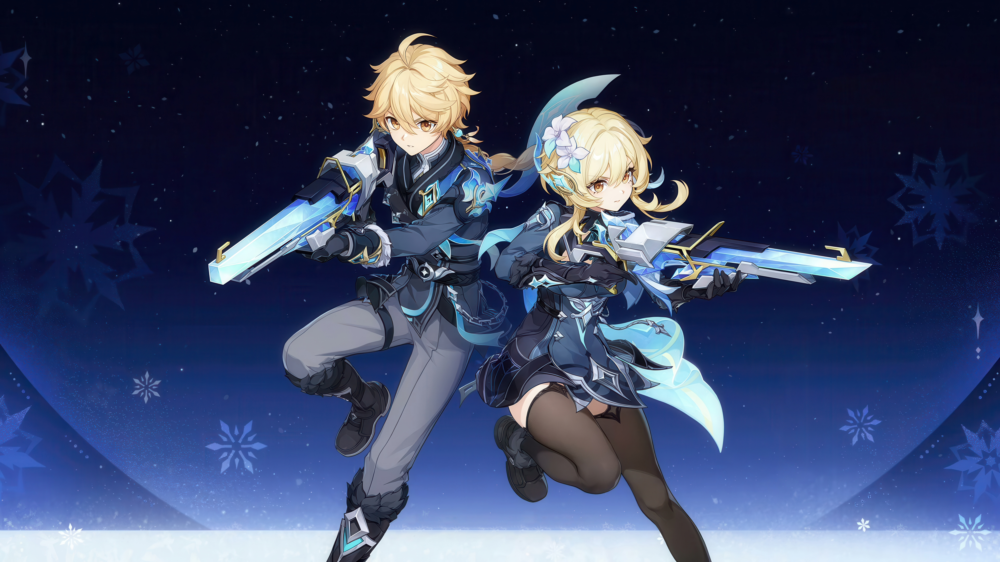
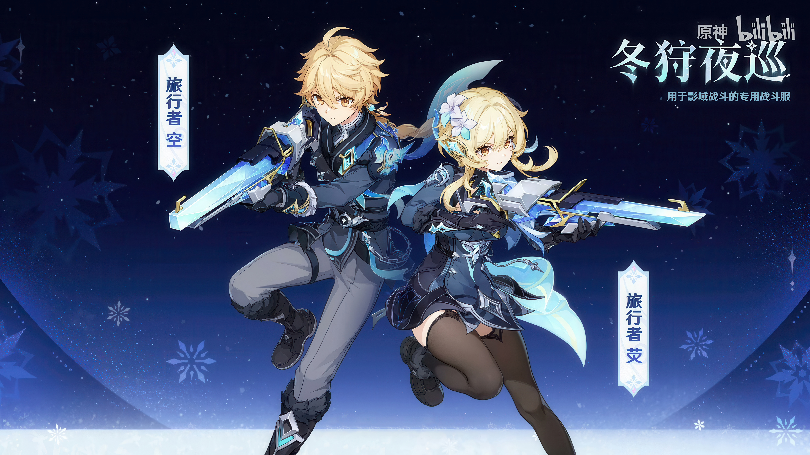
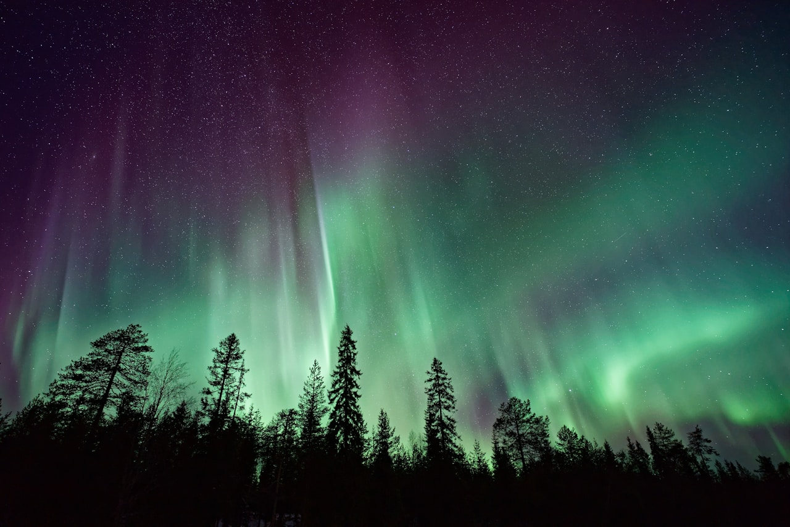
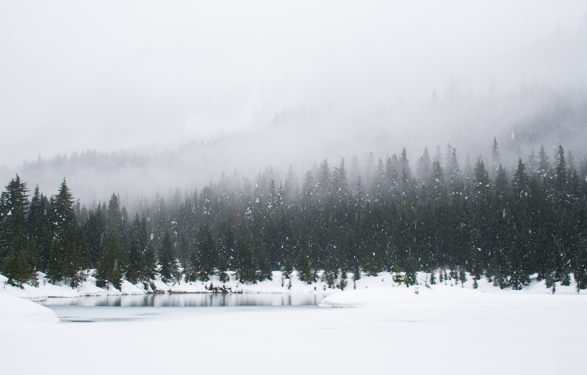

# 旅行者·冰（荧）Traveler · Cryo (Lumine) — 2026.08.12

> 视频类型：A · 角色单人壁纸合集
> 角色来源：原神 7.0「无神怜爱的雪国」版本 · 免费主角角色 · 冰元素单手剑
> 身份：来自异世的旅行者（荧/Lumine），与至冬七天神像共鸣后获得冰元素力
> 称号：所念皆梦
> 战斗服：「冬狩夜巡」—— 为影域战斗设计的专用战斗服
> 武器：星锋剑（Star-Blade Sword）—— 半透明冰蓝水晶长剑，剑身有星形几何雕刻纹路
> 核心机制：冰元素主C/副C，「星烁反应」新元素反应体系
> 设计参考：俄罗斯宫廷军装、冰雪猎人、北欧极光元素
> 热点背景：原神 7.0「无神怜爱的雪国」2026年8月12日今日正式上线！至冬（Snezhnaya）大地图全面开放，旅行者首次获得冰元素共鸣。冬狩夜巡为全新战斗外观，社区热度爆炸——抖音相关视频最高604.8万点赞，"冰主王潮""摄像头终于站起来了"等梗刷屏。旅行者作为六年来首次获得高强度定位的角色，话题性极强
> 今日特殊：7.0 至冬版本上线日，全年最大热度峰值
> 外观校对：本文所有外观描述均已对照 ref-winter-hunt-outfit-1.jpg、ref-winter-hunt-outfit-2.jpg、cryo-icon.png、gacha-art.png 逐项核对

# 必需

Refer to the attached reference image (Figure 1). Generate a similar style image of Lumine (Traveler) from Genshin Impact wearing the "Winter Hunt Night Patrol" (冬狩夜巡) combat outfit, standing in front of a bold graffiti-covered concrete wall in a dim urban alleyway, looking at the camera with a cool, slightly bored expression — the detached gaze of a dimension-hopping traveler who has seen too many worlds to be impressed. She wears modernized streetwear reinterpreting her combat outfit: an oversized dark navy bomber jacket with ice-blue luminous trim lines along the seams, worn open over a fitted light grey cropped top, high-waisted dark navy cargo shorts with frosted silver buckle straps, and chunky white-and-ice-blue sneakers. Keep her recognizable features exactly: long golden-blonde hair reaching past her waist with ice-blue gradient tips at the ends, a distinctive white flower ornament (four-petal blossom) tucked above her right ear, amber-golden eyes with a calm distant look, fair skin, a petite athletic build. She holds her translucent ice-blue crystal sword — the Star-Blade Sword (星锋剑) with geometric star engravings visible through the blade — resting casually over one shoulder. The graffiti wall behind her features ice-blue, silver-white, and deep navy abstract patterns with snowflake motifs, geometric crystal shapes, and scattered Cryo element symbols. Cool blue-violet neon light from an unseen sign casts crisp shadows across the scene. Faint frost crystallization creeps along the wall edges near her, as if her Cryo aura is unconsciously freezing her surroundings. 16:9 2K wallpaper format. perfect hands, five fingers on each hand, anatomically correct hands, well-defined fingers, one hand gripping sword handle over shoulder, other hand in jacket pocket.

Negative Prompt: low quality, worst quality, blurry, pixelated, bad anatomy, bad hands, extra fingers, fewer fingers, missing fingers, fused fingers, webbed fingers, merged fingers, overlapping fingers, deformed fingers, mutated fingers, six fingers, four fingers, three fingers, more than five fingers, less than five fingers, disfigured hands, poorly drawn hands, bad hand anatomy, asymmetrical hands, broken fingers, claw hands, blurry hands, indistinct fingers, smeared hands, extra limbs, chibi, childish, wrong hair color, pink hair, dark hair, black hair, red hair, wrong eye color, red eyes, blue eyes, green eyes, missing flower ornament, short hair, male character, Aether, warm sunny daylight, cheerful wide smile, text, watermark, logo, signature, multiple characters.

# 人物设定

## 1 — 至冬初雪·冬狩夜巡觉醒（标志性场景）

Positive Prompt:
16:9 2K wallpaper, Lumine (Traveler) from Genshin Impact wearing the Winter Hunt Night Patrol (冬狩夜巡) combat outfit, highly detailed anime-style illustration, polished game-art quality, dramatic Snezhnaya winter night atmosphere.

Depict Lumine standing atop a snow-covered stone balcony overlooking the vast cityscape of Snezhnaya at the exact moment of her Cryo awakening. Her amber-golden eyes glow with a new inner ice-blue light as Cryo energy courses through her for the first time. Delicate geometric frost patterns spiral outward from her feet across the stone railing. Her Star-Blade Sword (星锋剑) — a translucent ice-blue crystal longsword with visible geometric star engravings etched into the blade — is drawn and held in her right hand at her side, its blade radiating a soft glacial aura, ice-blue light pulsing along the star-shaped etchings.

Full canonical Winter Hunt Night Patrol outfit with maximum detail: long golden-blonde hair flowing past her waist, the lower third transitioning to an ice-blue gradient at the tips, lifted gently by the cold wind. A distinctive white four-petal flower ornament is tucked above her right ear. The combat outfit consists of a dark navy-blue fitted military-style coat with standing collar, ice-blue luminous accent lines running along the seams and edges like frozen circuit traces, the coat's hem reaching mid-thigh with a layered combat skirt underneath featuring ice-blue inner lining visible in the wind. Silver-white fur trim adorns the collar and cuffs. A decorative silver chest plate with geometric ice-crystal engravings sits over the coat's chest area. Her waist is cinched by a dark leather belt with a glowing ice-blue Cryo gemstone buckle. Black thigh-high stockings with subtle ice-blue geometric patterns. Fur-trimmed dark boots with silver buckles and ice-blue sole accents. Her outfit has faint luminous ice-blue veins throughout, as if infused with Cryo energy.

Behind her, the Snezhnaya cityscape stretches into the distance: Gothic spires topped with snow, warm amber windows glowing in distant buildings, heavy snow falling in large soft flakes against a deep navy night sky. The aurora borealis shimmers faintly in blue-green ribbons across the upper sky. The mood is epic, transformative, and quietly awe-inspiring — the beginning of a new chapter.

Medium-wide composition with Lumine at center-right, the balcony railing providing a horizontal anchor, the city depth extending behind and below her, the aurora sky filling the upper portion. Cool ice-blue and deep navy dominate, with warm amber accents from distant windows and her golden hair providing contrast.

perfect hands, five fingers on each hand, anatomically correct hands, well-defined fingers, right hand gripping sword handle naturally, left hand resting on the stone railing.

Negative Prompt:
low quality, worst quality, blurry, pixelated, bad anatomy, bad hands, extra fingers, fewer fingers, missing fingers, fused fingers, webbed fingers, merged fingers, overlapping fingers, deformed fingers, mutated fingers, six fingers, four fingers, three fingers, disfigured hands, poorly drawn hands, bad hand anatomy, asymmetrical hands, broken fingers, claw hands, blurry hands, indistinct fingers, smeared hands, extra limbs, wrong hair color, short hair, wrong eye color, male character, Aether, standard white traveler outfit, missing flower ornament, bright warm daylight, summer scene, tropical setting, no snow, cheerful excited expression, chibi, text, watermark, logo, signature, multiple characters.

## 2 — 星烁反应·元素爆发全开（战斗形态）

Positive Prompt:
16:9 2K wallpaper, Lumine (Traveler) from Genshin Impact in Winter Hunt Night Patrol outfit, highly detailed anime-style illustration, explosive dynamic action composition, spectacular Cryo elemental effects, polished game-art quality, intense battle atmosphere.

Depict Lumine at the peak of her Elemental Burst, executing a devastating overhead slash with the Star-Blade Sword (星锋剑). The translucent ice-blue crystal blade blazes with concentrated Cryo energy, trailing a massive arc of crystalline ice shards and snowflake fractals in its wake. The "Star Sparkle Reaction" (星烁反应) is in full effect: dozens of geometrically perfect ice crystals — hexagonal prisms, stellate dendrites, and needle-shaped formations — orbit her body in concentric rings, each crystal glowing from within with pale blue-white light.

Her long golden-blonde hair with ice-blue gradient tips whips violently upward in the energy vortex, forming a dramatic flowing shape against the dark sky. Her amber-golden eyes blaze with intensified ice-blue Cryo light, pupils sharp and focused. Her expression is one of absolute determination — not rage, but the quiet intensity of someone who has waited six years for this power. The white flower ornament in her hair catches the Cryo light, appearing to crystallize with frost.

Full Winter Hunt Night Patrol combat outfit in dynamic motion: the dark navy coat with ice-blue luminous trim lines now blazing at full brightness, the layered combat skirt flaring outward with the spin, ice-blue inner lining fully visible. The fur trim at her collar and cuffs is coated in fresh frost crystals. The Cryo gemstone belt buckle pulses with concentrated blue light. Every luminous vein in her outfit is at maximum glow, transforming her silhouette into a constellation of ice-blue light against the dark.

The ground beneath her has flash-frozen in a radial pattern: stone tiles shattered and erupting upward in the shockwave, each fragment coated in razor-sharp ice crystal growth. A blizzard of ice particles and snow fills the air around her. Massive ice pillars erupt from the ground in a semicircle behind her. The sky above churns with a Cryo storm — dense clouds swirling in a vortex centered above her head, with the faint shape of a giant geometric star pattern visible in the eye of the storm.

Dynamic low-angle composition looking up at Lumine as the central force, the ice crystal ring creating a natural frame, the storm vortex drawing the eye upward. Deep navy-black background makes the ice-blue energy effects explode off the canvas.

perfect hands, five fingers on each hand, anatomically correct hands, well-defined fingers, both hands gripping the crystal sword handle in overhead slash position.

Negative Prompt:
low quality, worst quality, blurry, pixelated, bad anatomy, bad hands, extra fingers, fewer fingers, missing fingers, fused fingers, webbed fingers, merged fingers, overlapping fingers, deformed fingers, mutated fingers, six fingers, four fingers, three fingers, disfigured hands, poorly drawn hands, bad hand anatomy, asymmetrical hands, broken fingers, claw hands, blurry hands, indistinct fingers, smeared hands, extra limbs, stiff pose, static stance, weak effects, flat lighting, bright cheerful daylight, peaceful calm expression, no weapon, Pyro fire effects, Electro purple lightning, Anemo green wind, wrong element color, wrong hair color, short hair, wrong eye color, male character, Aether, standard white traveler outfit, chibi, text, watermark, logo, signature, multiple characters.

## 3 — 冬猎黎明·雪原行军（风景融合）

Positive Prompt:
16:9 2K wallpaper, Lumine (Traveler) from Genshin Impact in Winter Hunt Night Patrol outfit, highly detailed anime-style illustration, expansive landscape composition, atmospheric perspective, polished game-art quality, serene yet formidable winter atmosphere.

Depict Lumine walking alone across a vast, untouched Snezhnaya snowfield at the blue hour just before dawn. She is positioned in the lower-right third of the frame, her figure relatively small against the immense landscape, walking forward with quiet purpose. Her Star-Blade Sword (星锋剑) is sheathed at her left hip, its translucent ice-blue crystal blade faintly glowing even in its scabbard. Her long golden-blonde hair with ice-blue tips streams behind her in the frigid wind like a banner.

Full Winter Hunt Night Patrol outfit rendered with atmospheric distance: dark navy coat with ice-blue trim visible as subtle luminous lines in the pre-dawn darkness, fur-trimmed collar turned up against the cold, the layered combat skirt swaying with her stride. The white flower ornament in her hair is a small bright point against the dark navy of her outfit. Her footprints in the deep snow behind her are faintly luminous with residual Cryo energy, each footprint crystallized into perfect geometric patterns rather than simple compression marks.

The landscape dominates: endless rolling snowfields stretching to a distant mountain range with jagged peaks silhouetted against a sky that transitions from deep indigo at the top through bands of violet and pink to a thin line of gold-amber at the eastern horizon. The snow surface catches the first pre-dawn light, creating a vast field of blue-silver sparkle. A frozen river cuts through the middle distance, its ice surface mirror-smooth and reflecting the sky colors. Sparse clusters of snow-laden pine trees dot the landscape. The atmosphere is thick with fine ice crystals catching the light — diamond dust — creating a subtle prismatic shimmer throughout the air.

Wide cinematic composition, aspect ratio emphasizing horizontal expanse. Lumine's small figure provides human scale against the overwhelming vastness. The mood is solitary, contemplative, and epic — a lone traveler facing a new world.

perfect hands, five fingers on each hand, anatomically correct hands, well-defined fingers, arms relaxed at sides in walking posture, one hand near sword scabbard.

Negative Prompt:
low quality, worst quality, blurry, pixelated, bad anatomy, bad hands, extra fingers, fewer fingers, missing fingers, fused fingers, webbed fingers, merged fingers, overlapping fingers, deformed fingers, mutated fingers, six fingers, four fingers, three fingers, disfigured hands, poorly drawn hands, bad hand anatomy, asymmetrical hands, broken fingers, claw hands, blurry hands, indistinct fingers, smeared hands, extra limbs, close-up portrait, character too large in frame, flat featureless background, no landscape, spring flowers, green grass, warm sunny weather, wrong hair color, short hair, wrong eye color, male character, Aether, standard white traveler outfit, battle effects, combat pose, action scene, chibi, text, watermark, logo, signature, multiple characters.

## 4 — 所念皆梦·命之座觉醒（星空叙事场景）

Positive Prompt:
16:9 2K wallpaper, Lumine (Traveler) from Genshin Impact, highly detailed anime-style illustration, surreal celestial atmosphere, ethereal narrative composition, polished game-art quality.

Depict Lumine floating weightlessly in a vast cosmic void — the interior space of her own Constellation (命之座) "All Dreams Are Wishes" (所念皆梦). She hovers in a meditation pose with legs crossed, the Star-Blade Sword (星锋剑) resting across her lap, its translucent ice-blue crystal blade glowing softly. Her long golden-blonde hair with ice-blue gradient tips drifts upward and outward in zero gravity, forming an ethereal halo of flowing strands around her. Her amber-golden eyes are half-closed in serene focus, with a calm transcendent expression — not sleeping, but dreaming while awake.

She wears the Winter Hunt Night Patrol outfit but etherealized: the dark navy coat floats weightlessly, its ice-blue luminous trim lines pulsing gently like a slow heartbeat. The white flower ornament in her hair has crystallized into a perfect ice sculpture, each petal rendered in translucent frost.

Surrounding her in the void: her complete constellation pattern rendered as a massive geometric star map. Six constellation nodes blaze as ice-blue stars connected by delicate lines of frozen light, forming the shape of her constellation pattern. Between the nodes, translucent ice crystal formations grow outward like cosmic coral — each formation containing within it a miniature frozen scene: a memory of each element she has previously mastered (a tiny Anemo tornado, a Geo crystal, an Electro bolt, a Dendro vine, a Hydro wave, and now at the brightest node, a Cryo snowflake larger and more intricate than the others). Countless smaller stars and ice-particle nebulae fill the surrounding void in deep navy and violet.

The palette is dominated by deep space navy-black, cool silver-white, and ice-blue, with her golden hair and amber eyes as the only warm accent — a single flame of warmth at the center of an infinite frozen cosmos. Volumetric god-rays of pale blue light filter from above, catching the floating ice particles.

Centered symmetrical composition with Lumine as the focal point, the constellation radiating outward from her in all directions. The scale is cosmic — she is small against the infinite pattern that is nevertheless hers.

perfect hands, five fingers on each hand, anatomically correct hands, well-defined fingers, both hands resting gently on the crystal sword laid across her lap, fingers relaxed and slightly curved.

Negative Prompt:
low quality, worst quality, blurry, pixelated, bad anatomy, bad hands, extra fingers, fewer fingers, missing fingers, fused fingers, webbed fingers, merged fingers, overlapping fingers, deformed fingers, mutated fingers, six fingers, four fingers, three fingers, disfigured hands, poorly drawn hands, bad hand anatomy, asymmetrical hands, broken fingers, claw hands, blurry hands, indistinct fingers, smeared hands, extra limbs, standing on solid ground, ordinary room interior, daytime sky, combat pose, weapon drawn aggressively, angry expression, wrong hair color, short hair, wrong eye color, male character, Aether, standard white traveler outfit, chibi, text, watermark, logo, signature, multiple characters, busy cluttered background.

## 5 — 影域深处·冰晶兵刃（暗黑战斗场景）

Positive Prompt:
16:9 2K wallpaper, Lumine (Traveler) from Genshin Impact in Winter Hunt Night Patrol outfit, highly detailed anime-style illustration, dark cinematic composition, ominous combat atmosphere, high contrast lighting, polished game-art quality.

Depict Lumine deep within the Shadow Realm (影域) — the dark dimension that the Winter Hunt Night Patrol outfit was designed for. She stands in a combat-ready stance, Star-Blade Sword held in a low guard position, blade angled forward and down, her body coiled and ready to strike. Her expression is sharp and focused — narrowed amber-golden eyes with ice-blue Cryo light reflected in them, a slight frown of concentration, jaw set. This is the Traveler as a weapon, not as an adventurer.

Her Winter Hunt Night Patrol outfit is in full combat mode: all ice-blue luminous lines at maximum intensity, cutting through the surrounding darkness like frozen circuitry. The Cryo gemstone at her belt buckle blazes. Frost armor has formed over her shoulders and forearms — thin crystalline ice plates growing organically over the navy fabric, adding an extra layer of frozen protection. Her golden-blonde hair with ice-blue tips is pulled back slightly by the wind of her Cryo aura, revealing the angular line of her jaw.

The Shadow Realm environment is deeply unsettling: the ground is a cracked obsidian-black mirror surface reflecting distorted versions of Lumine's ice-blue glow. Twisted dark structures rise in the background — organic-mechanical shapes that could be corrupted architecture or frozen creatures. The "sky" is a void of churning dark purple-black clouds with faint red-orange cracks like a shattered ceiling showing fire beyond. The air is thick with floating black particles — shadow corruption — that freeze and shatter into ice fragments wherever they contact Lumine's Cryo aura, creating a constantly expanding sphere of purified frozen air around her.

The Star-Blade Sword's translucent blade reflects the surrounding corruption and transforms it: dark shadows enter one side and emerge from the blade's star-engravings as purified ice-blue crystalline light. The blade is literally transforming darkness into ice.

High contrast composition: Lumine as a figure of ice-blue light against overwhelming darkness. Her Cryo glow is the only source of illumination. The mood is tense, powerful, and slightly frightening — this is the reason the combat outfit exists.

perfect hands, five fingers on each hand, anatomically correct hands, well-defined fingers, right hand gripping sword handle in low guard, left hand open at her side with fingers slightly spread, frost forming at her fingertips.

Negative Prompt:
low quality, worst quality, blurry, pixelated, bad anatomy, bad hands, extra fingers, fewer fingers, missing fingers, fused fingers, webbed fingers, merged fingers, overlapping fingers, deformed fingers, mutated fingers, six fingers, four fingers, three fingers, disfigured hands, poorly drawn hands, bad hand anatomy, asymmetrical hands, broken fingers, claw hands, blurry hands, indistinct fingers, smeared hands, extra limbs, bright sunny environment, cheerful smile, peaceful scene, no weapon, relaxed casual pose, wrong hair color, short hair, wrong eye color, male character, Aether, standard white traveler outfit, flat lighting, no shadows, colorful rainbow palette, chibi, text, watermark, logo, signature, multiple characters.

## 6 — 壁炉暖光·至冬日常（反差萌·日常场景）

Positive Prompt:
16:9 2K wallpaper, Lumine (Traveler) from Genshin Impact, highly detailed anime-style illustration, warm cozy interior atmosphere, soft golden lighting, slice-of-life mood, polished game-art quality.

Depict Lumine in a relaxed domestic scene inside a Snezhnaya inn — a contrast to her combat persona. She sits curled up in a large wingback armchair beside a roaring stone fireplace, wearing a modified casual version of her outfit: the dark navy Winter Hunt Night Patrol coat draped over the back of the chair, leaving her in the lighter inner layer — a fitted dark navy long-sleeved top with subtle ice-blue trim at the cuffs, paired with her black thigh-high stockings. The white flower ornament remains in her hair. She holds a large ceramic mug of hot cocoa in both hands, steam rising in lazy curls. Her amber-golden eyes are soft and drowsy, half-lidded with contentment, a rare gentle smile on her lips — the private, unguarded expression she only shows when she thinks nobody is watching.

Her long golden-blonde hair (without the ice-blue tips showing in warm light — the gradient is subtle and only catches blue in cold light) is loose and slightly mussed, cascading over one shoulder and pooling on the armrest. A thick knitted blanket in cream and pale blue is draped over her drawn-up knees. The Star-Blade Sword (星锋剑) leans against the wall behind the chair, its ice-blue glow dimmed to almost nothing in the warmth.

The inn interior is richly detailed: dark wood paneling, a stone fireplace with dancing orange-amber flames, shelves with leather-bound books and small curios, frost patterns visible on the window panes beyond which heavy snow falls against a dark night. A small table beside the chair holds a plate of traditional Snezhnaya pastries. Warm amber-gold firelight illuminates her face from the left, casting soft shadows, making her golden hair glow. The overall palette is warm ambers, honey golds, dark wood browns — with her ice-blue accents as the only cool note.

The mood is intimate, warm, and quietly happy — a reminder that beneath the combat outfit and Cryo powers, she is still just a traveler who appreciates a warm fire on a cold night.

Comfortable three-quarter composition with Lumine filling the center-left, the fireplace providing warm light from the right, the snowy window visible behind her chair.

perfect hands, five fingers on each hand, anatomically correct hands, well-defined fingers, both hands wrapped around a ceramic mug, fingers interlaced and overlapping naturally around the cup's curve.

Negative Prompt:
low quality, worst quality, blurry, pixelated, bad anatomy, bad hands, extra fingers, fewer fingers, missing fingers, fused fingers, webbed fingers, merged fingers, overlapping fingers, deformed fingers, mutated fingers, six fingers, four fingers, three fingers, disfigured hands, poorly drawn hands, bad hand anatomy, asymmetrical hands, broken fingers, claw hands, blurry hands, indistinct fingers, smeared hands, extra limbs, battle scene, combat pose, weapon drawn, ice effects, Cryo energy, aggressive expression, outdoor scene, cold blue lighting only, wrong hair color, short hair, wrong eye color, male character, Aether, armor, full combat outfit, chibi, text, watermark, logo, signature, multiple characters, lewd, revealing clothing.

## 7 — 冰原女皇·宫廷礼服（风格改造·高定时装）

Positive Prompt:
16:9 2K wallpaper, Lumine (Traveler) from Genshin Impact, highly detailed anime-style illustration, high fashion editorial composition, regal ice palace atmosphere, polished game-art quality.

Depict Lumine reimagined as the Ice Empress of Snezhnaya in a haute couture reinterpretation of her Winter Hunt Night Patrol design. She stands tall at the top of a grand ice staircase inside the Zapolyarny Palace (冬宫), one hand resting on a crystalline ice balustrade, the other holding the Star-Blade Sword vertically before her like a scepter, its point resting on the floor.

Her outfit is transformed into Snezhnaya court regalia: the dark navy military coat extended into a full-length imperial gown — structured military bodice with the same ice-blue luminous trim lines, but below the waist it flows into a sweeping cathedral-length train of layered dark navy and midnight-blue fabric, each layer edged with ice-blue crystalline embroidery depicting snowflake fractals. The fur trim is expanded into a dramatic snow-white arctic fox fur stole draped across her shoulders and trailing down the gown's back. Her chest plate's geometric ice-crystal design is reimagined as an elaborate diamond-and-sapphire necklace cascading down her décolletage. A delicate tiara of interlocking ice crystals sits atop her head, complementing the white flower ornament which remains unchanged.

Her long golden-blonde hair with ice-blue tips is styled in an elegant half-updo: the upper portion gathered in an elaborate braided crown woven with tiny ice crystals, while the lower half flows freely down her back, the ice-blue gradient tips brushing the train of her gown. Her amber-golden eyes are proud, regal, and slightly imperious — the bearing of someone who commands winter itself. A knowing half-smile suggests she finds the whole empress act privately amusing.

The Zapolyarny Palace interior: floors of polished black marble reflecting her figure perfectly, walls of translucent blue-white ice carved into Gothic arches, enormous crystal chandeliers overhead casting prismatic rainbows through the ice architecture. Through grand arched windows, the aurora borealis is visible in the night sky.

Centered composition with strong vertical lines from the architecture framing Lumine. The palette is ice-blue, navy, silver-white, and black marble, with her golden hair and amber eyes as the warm focal point. The mood is commanding, beautiful, and subtly playful.

perfect hands, five fingers on each hand, anatomically correct hands, well-defined fingers, left hand resting elegantly on ice balustrade with fingers draped over the edge, right hand holding sword vertically like a scepter with fingers wrapped around the grip.

Negative Prompt:
low quality, worst quality, blurry, pixelated, bad anatomy, bad hands, extra fingers, fewer fingers, missing fingers, fused fingers, webbed fingers, merged fingers, overlapping fingers, deformed fingers, mutated fingers, six fingers, four fingers, three fingers, disfigured hands, poorly drawn hands, bad hand anatomy, asymmetrical hands, broken fingers, claw hands, blurry hands, indistinct fingers, smeared hands, extra limbs, casual modern clothing, streetwear, combat stance, battle effects, outdoor wilderness, modest small room, wrong hair color, short hair, wrong eye color, male character, Aether, standard white traveler outfit, aggressive angry expression, chibi, text, watermark, logo, signature, multiple characters, lewd, revealing, bikini.

## 8 — 星锋出鞘·拔剑一瞬（特写动态）

Positive Prompt:
16:9 2K wallpaper, Lumine (Traveler) from Genshin Impact in Winter Hunt Night Patrol outfit, highly detailed anime-style illustration, extreme dynamic close-up, speed-frame composition, polished game-art quality.

Depict the exact frozen instant of Lumine's sword-draw — a single frame of explosive motion. The composition is a dramatic close-up from mid-thigh to just above her head, slightly tilted at a 15-degree dutch angle for dynamism. The Star-Blade Sword (星锋剑) is captured mid-draw: the translucent ice-blue crystal blade halfway out of its dark scabbard, the exposed portion blazing with activated Cryo energy, ice particles erupting from the scabbard's mouth like a pressure release. The geometric star engravings on the blade pulse with concentrated white-blue light.

Her face in profile-three-quarters view: amber-golden eyes wide and intensely focused, pupils contracted to sharp points, ice-blue Cryo energy reflected in the iris. Her expression is the split-second of decision — lips slightly parted, jaw sharp, eyebrows drawn together in fierce focus. The white flower ornament in her golden-blonde hair catches the sword's Cryo glow and appears momentarily crystallized. Her hair erupts backward in the shockwave of the draw, individual strands clearly defined, the ice-blue gradient tips catching more light than the golden roots.

Winter Hunt Night Patrol outfit details visible at close range: the texture of the dark navy fabric with its subtle weave pattern, the ice-blue luminous trim lines at full glow along the standing collar and chest seam, frost crystals forming in real-time along the fur trim at her collar, the silver chest plate's geometric engravings, the Cryo gemstone belt buckle mid-pulse. The ice-blue luminous veins in the outfit are brightest near her drawing arm, as if Cryo energy is flowing from her body through the outfit to the sword.

Background is motion-blurred: streaks of dark navy and grey suggesting a Snezhnaya street or corridor, completely defocused. Speed lines of ice-blue energy radiate from the sword. Frozen air crystallizes in her Cryo wake.

Tight dynamic composition — the sword-draw line creates a powerful diagonal from lower-left to upper-right. The energy and intensity are concentrated in a small frame. The mood is pure kinetic energy — a weapon being unleashed.

perfect hands, five fingers on each hand, anatomically correct hands, well-defined fingers, right hand gripping sword handle in drawing motion with firm clear grip, left hand on scabbard steadying it.

Negative Prompt:
low quality, worst quality, blurry, pixelated, bad anatomy, bad hands, extra fingers, fewer fingers, missing fingers, fused fingers, webbed fingers, merged fingers, overlapping fingers, deformed fingers, mutated fingers, six fingers, four fingers, three fingers, disfigured hands, poorly drawn hands, bad hand anatomy, asymmetrical hands, broken fingers, claw hands, blurry hands, indistinct fingers, smeared hands, extra limbs, static pose, sword fully sheathed, sword not visible, calm relaxed expression, full body wide shot, detailed background in focus, wrong hair color, short hair, wrong eye color, male character, Aether, standard white traveler outfit, chibi, text, watermark, logo, signature, multiple characters.

# 参考图

## 9（冬狩夜巡官方立绘全身展示·高清细节参考）

Refer to the attached reference image (Figure 9), the official full-body illustration of Lumine's "Winter Hunt Night Patrol" (冬狩夜巡) combat outfit at 7680x4320 resolution. Generate a 16:9 2K wallpaper featuring Lumine in this exact outfit design, posed in a confident three-quarter standing position on a frozen lake surface at night. She faces slightly left with her weight on one leg, the Star-Blade Sword held loosely in her right hand with the blade tip resting on the ice surface, creating a small starburst crack pattern where blade meets frozen water. Her left hand is raised to brush a strand of golden-blonde hair behind her ear, the ice-blue tips catching the moonlight.

Replicate the outfit exactly as shown in the reference: dark navy military-style coat with ice-blue luminous trim, standing collar with white fur trim, silver geometric chest plate, ice-blue luminous veins running throughout the fabric, layered combat skirt with ice-blue lining, Cryo gemstone belt buckle, black thigh-high stockings with ice-blue geometric patterns, fur-trimmed dark boots with silver buckles. The white four-petal flower ornament in her hair. Every detail must match the reference image precisely.

The frozen lake stretches endlessly around her, its surface a dark mirror reflecting the night sky. A full moon hangs low on the horizon behind her, massive and ice-white, surrounded by a luminous halo. The moonlight creates a long reflection path on the ice leading to her feet. Stars fill the clear sky above. The distant shore is a dark silhouette of snow-covered pines.

The mood is solitary, elegant, and powerful — a lone hunter resting between battles on an endless frozen sea.

perfect hands, five fingers on each hand, anatomically correct hands, well-defined fingers, right hand holding sword handle loosely, left hand raised near her ear with fingers elegantly positioned.

Negative Prompt:
low quality, worst quality, blurry, pixelated, bad anatomy, bad hands, extra fingers, fewer fingers, missing fingers, fused fingers, webbed fingers, merged fingers, overlapping fingers, deformed fingers, mutated fingers, six fingers, four fingers, three fingers, disfigured hands, poorly drawn hands, bad hand anatomy, asymmetrical hands, broken fingers, claw hands, blurry hands, indistinct fingers, smeared hands, extra limbs, wrong outfit, standard white traveler outfit, incorrect outfit colors, bright daylight, indoor scene, warm colors dominating, wrong hair color, short hair, wrong eye color, male character, Aether, chibi, text, watermark, logo, signature, multiple characters.

## 10（手机竖屏壁纸·9:16 2K）

Refer to the attached reference image (Figure 10), the detailed annotated illustration of Lumine's Winter Hunt Night Patrol outfit. Generate a 9:16 2K vertical phone wallpaper optimized for mobile lock screens.

Depict Lumine in a vertical full-body composition, standing with elegant poise against a vertical backdrop of falling snow and soft blue-violet bokeh lights. She is positioned slightly off-center to the left, allowing the right side to be a gradient of deep navy fading into soft blue bokeh circles — suitable for phone clock/widget overlay without obscuring her face.

She stands in a graceful contrapposto pose, the Star-Blade Sword held across her body diagonally — blade up past her right shoulder, handle at her left hip — creating a strong diagonal that complements the vertical format. Her head is slightly tilted, amber-golden eyes looking directly at the viewer with a soft confident smile, as if acknowledging someone she trusts. Her long golden-blonde hair with ice-blue gradient tips flows downward past her waist, some strands drifting gently to the right in a light breeze.

Full Winter Hunt Night Patrol outfit exactly as shown in the reference: every detail of the dark navy coat, ice-blue luminous lines, fur trim, silver chest plate, combat skirt, stockings, and boots rendered with precision. The white flower ornament is prominent and clearly visible.

The background is intentionally simple for phone wallpaper use: a gradient from deep navy-blue at top to slightly lighter navy at bottom, filled with large soft snowflakes falling at various depths (some in sharp focus, others as soft white bokeh), and scattered blue-purple lens flare bokeh circles of varying sizes. Subtle Cryo energy particles drift upward from her feet. The overall feel is clean, beautiful, and phone-wallpaper-functional.

perfect hands, five fingers on each hand, anatomically correct hands, well-defined fingers, right hand gripping sword handle at shoulder level, left hand holding scabbard at hip level.

Negative Prompt:
low quality, worst quality, blurry, pixelated, bad anatomy, bad hands, extra fingers, fewer fingers, missing fingers, fused fingers, webbed fingers, merged fingers, overlapping fingers, deformed fingers, mutated fingers, six fingers, four fingers, three fingers, disfigured hands, poorly drawn hands, bad hand anatomy, asymmetrical hands, broken fingers, claw hands, blurry hands, indistinct fingers, smeared hands, extra limbs, horizontal landscape orientation, busy detailed background, text-heavy background, character too small, character cropped at edges, wrong outfit, standard white traveler outfit, wrong hair color, short hair, wrong eye color, male character, Aether, chibi, text, watermark, logo, signature, multiple characters.

# 跨领域参考图

## 11（参考极光风暴摄影·冰原女神融合）

Positive Prompt:
Refer to the attached reference image (Figure 11), a stunning aurora borealis photograph — note the sweeping curtains of luminous green-teal and purple-violet light cascading across the night sky in vertical streaming ribbons, the way the aurora fades from intense brilliant green at the horizon through teal-cyan to deep purple at the zenith, the silhouetted pine treeline creating a dark anchoring base, the thousands of stars visible through the aurora's translucent veils, and the overall sense of cosmic beauty — nature's own light show painted across the entire sky.

Generate a 16:9 2K wallpaper of Lumine from Genshin Impact standing on a snow-covered ridge at the exact center of this aurora phenomenon, as if she is the axis around which the northern lights rotate. She stands with arms slightly spread at her sides, palms upward, head tilted back to face the sky with an expression of quiet wonder and connection — as if she is the one calling the aurora into existence through her Cryo resonance with the sky.

Preserve her canonical Winter Hunt Night Patrol design in clear detail against the spectacular sky: long golden-blonde hair with ice-blue gradient tips lifting and flowing upward as if drawn toward the aurora above, the white flower ornament glowing faintly. Dark navy coat with ice-blue luminous trim lines that now pulse in rhythm with the aurora's shimmer — as if her outfit is synchronized with the sky. Fur trim at collar catching aurora-green reflections. The Star-Blade Sword is planted point-down in the snow beside her, its translucent blade acting as a prism that splits the aurora light into intensified ice-blue beams radiating outward at ground level.

Fuse the photograph's aurora language directly into the composition: reproduce the exact curtain-like streaming ribbons of green-teal light but make them converge toward Lumine as their focal point. Add Cryo-specific modifications: transform the aurora's green into a more ice-blue and teal-cyan palette while keeping the purple-violet upper portions, add geometric hexagonal Cryo symbols faintly visible within the aurora ribbons, and create ice crystal formations growing upward from the ground around her that catch and refract the aurora light into prismatic displays. The silhouetted treeline from the reference photo remains as the base of the composition, but the trees are now coated in thick frost that glows faintly green-teal from the aurora illumination.

The emotional register should combine the reference photograph's sense of cosmic awe with the character's personal power — she is not merely witnessing the aurora; she IS the aurora given human form. The sky dances because she wills it.

perfect hands, five fingers on each hand, anatomically correct hands, well-defined fingers, both hands open with palms facing upward, fingers naturally spread.

Negative Prompt:
low quality, worst quality, blurry, pixelated, bad anatomy, bad hands, extra fingers, fewer fingers, missing fingers, fused fingers, webbed fingers, merged fingers, overlapping fingers, deformed fingers, mutated fingers, six fingers, four fingers, three fingers, disfigured hands, poorly drawn hands, bad hand anatomy, asymmetrical hands, broken fingers, claw hands, blurry hands, indistinct fingers, smeared hands, extra limbs, daytime blue sky, no aurora, weak dim sky, indoor scene, urban city background, orange warm aurora, red aurora, wrong hair color, short hair, wrong eye color, male character, Aether, standard white traveler outfit, combat pose, aggressive expression, chibi, text, watermark, logo, signature, multiple characters.

## 12（参考冬日雪原迷雾风景摄影·荒原行者融合）

Positive Prompt:
Refer to the attached reference image (Figure 12), a atmospheric winter landscape photograph — note the vast white snow-covered ground in the foreground, the partially frozen lake with its dark reflective water surface, the dense wall of snow-laden evergreen pine forest rising behind the water, the thick low-hanging fog and mist that swallows the upper portions of the trees creating a sense of infinite depth, individual snowflakes falling visibly through the grey-white air, and the overall monochromatic palette of white, grey, dark green, and the dark water — a scene of absolute stillness, cold, and natural silence.

Generate a 16:9 2K wallpaper of Lumine from Genshin Impact placed within this exact winter atmosphere, walking across the frozen lake surface in the middle distance. She is small in the frame — perhaps occupying only 20% of the vertical height — emphasizing the overwhelming scale of the frozen wilderness around her. She walks from right to left, her dark navy Winter Hunt Night Patrol silhouette creating a stark contrast against the white-grey environment. The only colors in the entire image besides the monochromatic landscape are: the ice-blue glow of her outfit's luminous trim lines visible even at distance, the warm golden point of her hair, and the faint blue-white trail she leaves on the ice behind her — frozen Cryo energy patterns spreading outward from each footstep across the lake surface like frost ferns growing in accelerated time.

Reproduce the reference's atmospheric conditions exactly: the thick fog consuming the background, the snow-laden pines as a dark wall, the visible snowflakes falling. Add subtle Cryo-influenced modifications: wherever Lumine has walked, the fog is slightly thinner, as if her presence crystallizes the moisture and clears the air; the ice surface where she steps is smoother and more mirror-like than the rough natural ice around it; and a few impossibly perfect geometric ice formations — tall, sharp, angular — grow from the lake surface behind her like monuments marking her path.

The emotional register combines the reference photograph's profound silence and solitude with a narrative element — a lone figure passing through an indifferent wilderness, leaving behind only beauty. The landscape does not acknowledge her. She does not need it to. There is strength in the solitude.

perfect hands — character is at medium distance, hands should be simple clean shapes at sides in walking posture, no complex finger detail needed at this scale.

Negative Prompt:
low quality, worst quality, blurry, pixelated, bad anatomy, extra limbs, character too large in frame, character dominating the composition, close-up, detailed face visible, summer greenery, flowers, sunshine, clear blue sky, no fog, no snow, warm color palette, orange sunset, wrong hair color, male character, Aether, standard white traveler outfit, battle effects, dramatic action pose, multiple characters, fantasy castle in background, chibi, text, watermark, logo, signature.

# 注

**外观校对说明**：荧（Lumine）的冬狩夜巡战斗服外观描述来自以下已核对参考图：
- `ref-winter-hunt-outfit-1.jpg`（7680×4320）：无标注全身展示图，确认整体剪影、配色和比例
- `ref-winter-hunt-outfit-2.jpg`（7680×4320）：标注版，确认各部位名称和细节
- `cryo-icon.png`（417×417）：确认冰元素形态标准面部特征（金发、金瞳、白花发饰）
- `gacha-art.png`（1920×1280）：确认7.0宣传图中的整体角色比例和动态

**角色选择说明**：本期选择荧（Lumine）而非空（Aether）作为壁纸主角，因为：①荧是壁纸/二创社区中更受欢迎的旅行者选择；②金发+白花+冰蓝渐变的配色方案在视觉上更具辨识度和壁纸美感；③冬狩夜巡的深色军装与荧的金发形成更强烈的明暗对比。

**跨领域参考图共两张**，对应旅行者·冰的三个维度标签交叉（身份：跨世界旅者 / 元素：冰 / 场景：至冬荒原）：

其一为极光风暴摄影 `ref-aurora-borealis.jpg`（Unsplash 免费授权），绿青色与紫罗兰色光带在夜空中流淌的画面，与旅行者·冰「星烁反应」冰元素爆发的流光视觉语言高度同构——极光本身就是高纬度的天空结晶。

其二为冬日雪原迷雾风景摄影 `ref-ice-crystal-macro.jpg`（Unsplash 免费授权），白雪覆盖的大地、半冻湖面、针叶林墙、吞噬一切的浓雾，以极简单色调呈现至冬荒原的孤寂与肃杀。将角色缩小至画面20%，强调「旅行者」这一身份的本质——一个在广阔世界中行走的渺小而坚定的存在。

**本期结构**：必需涂鸦墙 1 条 + 人物设定 7 条（至冬觉醒标志场景 / 星烁反应元素爆发 / 雪原行军风景融合 / 命之座星空叙事 / 影域暗黑战斗 / 壁炉日常反差萌 / 冰原女皇宫廷风格改造 / 拔剑特写动态）+ 参考图变体 2 条（冻湖月夜全身展示、9:16手机竖屏）+ 跨领域融合 2 条 = 共 12 条 prompts。

**社区梗备注**（供 titles.md 使用）：冰主 / 荧妹 / 所念皆梦（命之座名） / "摄像头终于站起来了"（六年来旅行者首次T0强度） / "冰主王潮" / 星烁反应 / 冬狩夜巡
