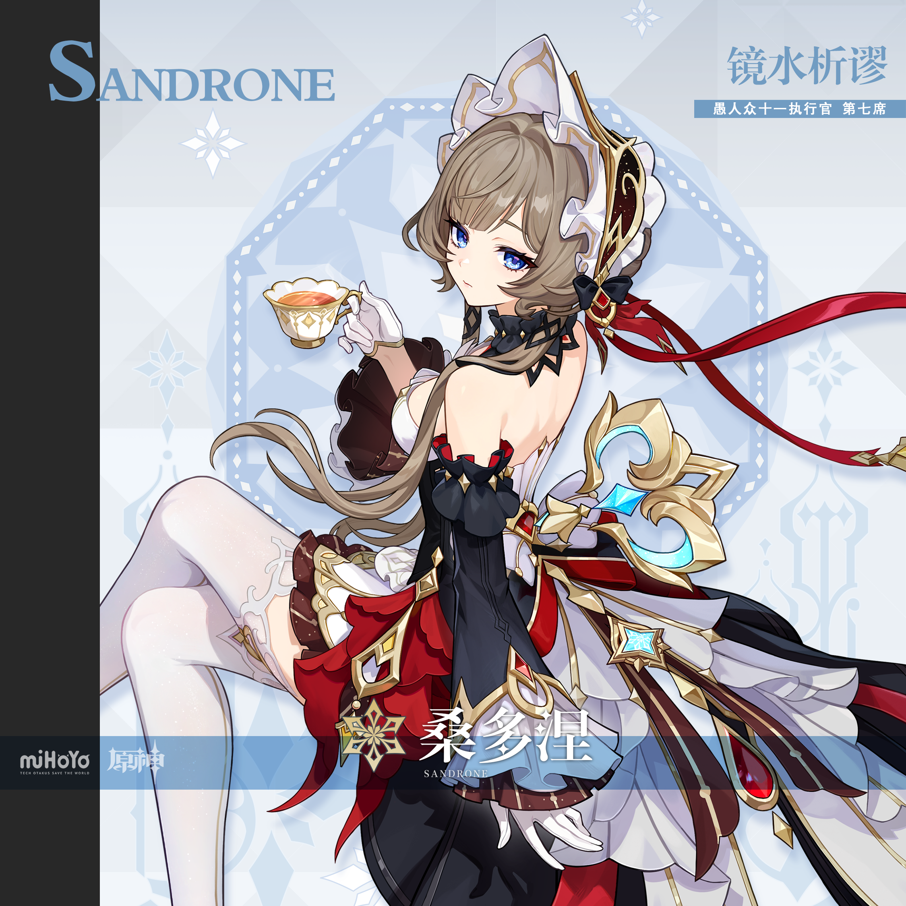
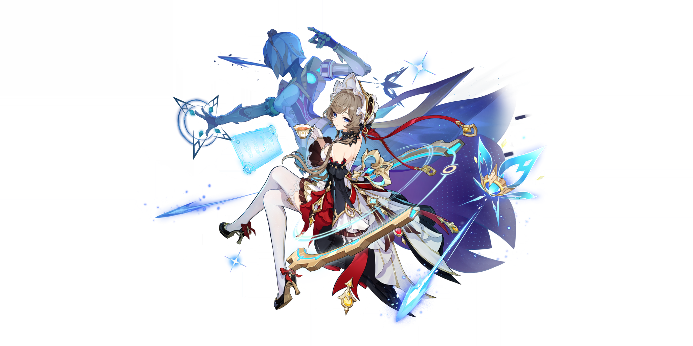
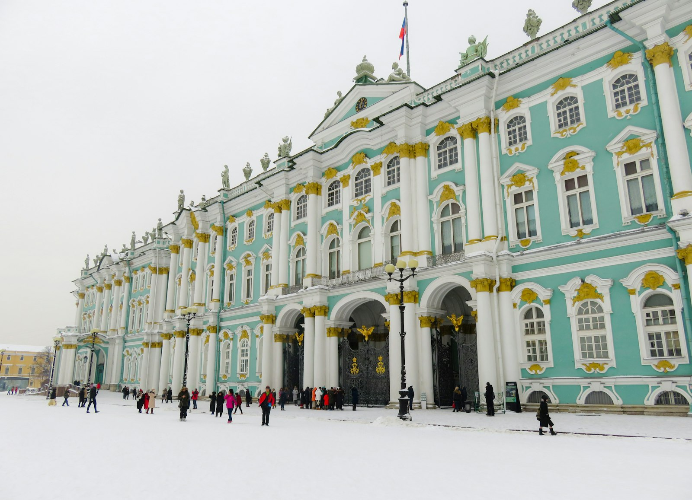

# 桑多涅 Sandrone — 2026.08.18
> 视频类型：A · 角色单人壁纸合集
> 角色来源：原神 6.7/7.0 · 五星冰属性大剑
> 身份：愚人众十一执行官第七席「木偶」/ 机巧大师 / 原名"小玛丽安"
> 称号：镜水析谬·桑多涅
> 设计参考：发条公主、维多利亚淑女、机械人偶、俄式宫廷贵族
> 热点背景：原神7.0至冬国版本8月12日上线（距今6天），桑多涅作为6.7版本新五星角色刚上线一个月，至冬国开放后其愚人众执行官身份热度再次飙升；桑多涅在枫丹主线中为掩护哥伦比娅牺牲的剧情让无数玩家泪崩，新生后重新登场引爆社区；至冬交响乐登B站全站第一
> 今日特殊：7.0至冬国上线第6天，玩家正在深度体验至冬主线，桑多涅作为至冬本土角色讨论度持续走高
> 伴生元素：法洁欧（Fajio）— 全功能通用型自动机关，蓝色半透明人形机甲骑士，体型比桑多涅大1.5倍，持大剑，冰蓝色发光关节与几何线条，骑士/战士造型

# 必需

Refer to the attached reference image (Figure 1). Generate a similar style image of Sandrone (桑多涅) from Genshin Impact leaning against a weathered concrete block in front of a bold graffiti wall with a cold, dismissive expression — the look of someone who considers everyone around her beneath her intellectual capacity. She is wearing modern street fashion reimagined from her clockwork aesthetic: a fitted black cropped corset-top with gold gear-shaped buttons and red plaid trim at the bust, an oversized dark burgundy bomber jacket with gold clockwork embroidery on the back (a stylized gear-and-butterfly motif), black high-waisted shorts with gold chain belt featuring tiny gear pendants, white thigh-high stockings with subtle gold thread patterns, black platform Mary Jane shoes with red ribbon ankle straps. Keep her recognizable design features: short wavy ash-brown/sandy-blonde hair with a small white lace bonnet-style hair accessory pinned at the crown (simplified from her full bonnet, now a decorative clip with gold prongs), blue-violet/purple eyes with an analytical cold gaze, black jagged choker necklace at her throat, and a long red ribbon trailing from her hair accessory. She holds a takeaway coffee cup in one white-gloved hand (replacing her signature teacup), the other hand resting on her hip. The graffiti wall behind her features ice-blue and crimson mechanical motifs — gears, clockwork butterflies, circuit patterns, a stylized blueprint of a mecha silhouette, and geometric snowflake designs hidden among the street art. A small blue holographic butterfly (referencing her Cryo element) floats near her shoulder. 16:9 2K wallpaper format. perfect hands, five fingers on each hand, anatomically correct hands, well-defined fingers, natural hand pose, one hand holding coffee cup elegantly with gloved fingers.

Negative Prompt: low quality, worst quality, blurry, pixelated, bad anatomy, bad hands, extra fingers, fewer fingers, missing fingers, fused fingers, webbed fingers, merged fingers, overlapping fingers, deformed fingers, mutated fingers, six fingers, four fingers, three fingers, more than five fingers, less than five fingers, disfigured hands, poorly drawn hands, bad hand anatomy, asymmetrical hands, broken fingers, claw hands, blurry hands, indistinct fingers, smeared hands, extra limbs, chibi, childish, wrong hair color, blonde hair, pink hair, green eyes, red eyes, casual smile, friendly expression, male character, mecha visible, large robot, text, watermark, logo, signature.

# 必需2 — 角色特写肖像

Refer to the attached reference image (Figure 2). Generate a cinematic close-up portrait of Sandrone from Genshin Impact. She holds a single brass clockwork gear — intricate, with tiny teeth and a central ruby jewel — close to the right side of her face, the gear's circular edge partially obscuring her right eye. Through the gear's hollow center, her right blue-violet iris is visible, staring through the mechanism with cold analytical precision. Her visible left eye gazes directly at the viewer — simultaneously tender and terrifying, the expression of a creator who loves her creations more than she will ever love a living person. Expression: a faint, barely-there smile that never reaches her eyes, lips slightly parted as if about to whisper a formula, brows relaxed but gaze intense — detached maternal warmth wrapped in mechanical coldness, as if she is deciding whether you are worth disassembling to understand. Dramatic single-source lighting from the upper left casts deep chiaroscuro across her porcelain-pale features, the brass gear glowing warm amber-gold where the light catches its polished surface, tiny ruby at center refracting a single point of crimson light onto her cheek. Her signature ash-brown wavy hair frames her face softly, a few strands caught in the gear's teeth; her black jagged choker and the white lace edge of her bonnet are barely visible at the collar and crown. A creation who outlived her creator, now building children of her own to fill the silence he left behind. 16:9 2K wallpaper.

Negative Prompt: low quality, worst quality, blurry, pixelated, bad anatomy, bad hands, extra fingers, fewer fingers, missing fingers, fused fingers, webbed fingers, merged fingers, overlapping fingers, deformed fingers, mutated fingers, six fingers, four fingers, three fingers, more than five fingers, less than five fingers, disfigured hands, poorly drawn hands, bad hand anatomy, asymmetrical hands, broken fingers, claw hands, blurry hands, indistinct fingers, smeared hands, extra limbs, full body shot, wide shot, landscape, multiple subjects, busy background, bright cheerful lighting, outdoor scene, action pose, weapon drawn, mecha, robot, Fajio visible, happy smile, laughing, chibi, text, watermark, logo, signature.

# 人物设定

## 3 — 至冬茶会·发条公主的午后（角色标志性场景）

Positive Prompt:
16:9 2K wallpaper, Sandrone from Genshin Impact, highly detailed anime-style illustration, polished game-art quality, elegant Victorian tea party atmosphere, warm amber interior lighting contrasted with cold blue winter outside.

Depict Sandrone seated at an ornate round tea table in her private workshop-parlor within a Snezhnayan manor. She sits with perfect posture in a high-backed velvet armchair, legs crossed elegantly, one gloved hand raising her signature gold-rimmed teacup to her lips, the other hand resting on an open blueprint spread across the table showing mechanical schematics. Her expression is one of quiet intellectual satisfaction — blue-violet eyes half-lidded, a barely perceptible smirk suggesting she has just solved a problem no one else could.

Keep her canonical design precisely: short wavy ash-brown hair with lighter sandy highlights at the tips, white lace bonnet with gold decorative prongs pinned at the crown of her head, blue-violet/purple eyes, porcelain-pale skin, black jagged choker necklace, black corset-style bodice with gold trim and red accents at the bust, layered skirt with red ruffled underskirt visible beneath black and white outer layers, gold mechanical ornamental pieces at the waist and hips, white thigh-high stockings, black heeled shoes with red ribbon bows, long red ribbon trailing from her bonnet, white gloves.

The workshop-parlor is a fusion of aristocratic elegance and mechanical genius: tall arched windows show a blizzard raging outside (blue-white snow against dark sky), but inside is warm amber candlelight from a crystal chandelier. Bookshelves line one wall filled with leather-bound tomes and mechanical models. On the table beside her teacup: scattered gears, a half-assembled clockwork butterfly with ice-blue crystal wings, precision tools in a velvet roll. Behind her chair, partially visible in shadow, looms the massive silhouette of Fajio — her blue mecha knight — standing dormant like a loyal guardian, its joints glowing faint ice-blue in standby mode.

Centered composition with Sandrone as the focal point at the table, the warm interior framing her, the cold blizzard visible through windows creating temperature contrast. The mood is refined intelligence, quiet power, and aristocratic solitude.

perfect hands, five fingers on each hand, anatomically correct hands, well-defined fingers, one hand holding teacup by handle naturally, other hand resting flat on paper.

Negative Prompt:
low quality, worst quality, blurry, bad anatomy, bad hands, extra fingers, fewer fingers, missing fingers, fused fingers, webbed fingers, merged fingers, overlapping fingers, deformed fingers, mutated fingers, six fingers, four fingers, disfigured hands, poorly drawn hands, bad hand anatomy, broken fingers, blurry hands, indistinct fingers, smeared hands, extra limbs, wrong hair color, blonde hair, long straight hair, green eyes, red eyes, cheerful expression, laughing, casual clothing, modern outfit, outdoor scene, summer, warm weather, combat pose, action scene, chibi, male character, text, watermark, logo.

## 4 — 星超导·冰晶解算（元素技能释放·战斗场景）

Positive Prompt:
16:9 2K wallpaper, Sandrone from Genshin Impact, highly detailed anime-style illustration, dynamic elemental power activation, dramatic Cryo element effects with Stellar Superconduct reaction, polished game-art quality, mechanical warfare aesthetic, midnight snowfield battlefield.

Depict Sandrone commanding her mecha Fajio in full combat on a frozen Snezhnayan battlefield at night. She stands in the foreground with one arm extended forward in a commanding gesture, fingers spread in a precise conductor-like motion, her expression shifted from elegant lady to cold battlefield commander — blue-violet eyes blazing with ice-blue Cryo energy, lips set in a thin determined line, all pretense of gentility stripped away to reveal the war machine beneath the bonnet.

Behind and above her, Fajio is fully activated and enormous — the blue translucent humanoid mecha knight towers over her, its body now solid and crackling with Cryo energy, wielding a massive ice-crystal greatsword mid-swing. Fajio's joints and geometric line patterns glow brilliant ice-blue, and from its chest core radiates a beam of concentrated cold that freezes the ground in expanding hexagonal crystal patterns. Ice shards and snowflakes orbit both figures in a controlled vortex.

Sandrone's outfit whips in the supernatural wind generated by the Stellar Superconduct reaction — her red ribbons snap like flags, her layered skirt billows revealing the red underskirt, her bonnet's lace edges flutter. Cyan-white energy threads connect her extended fingertips to Fajio like puppet strings made of light, visualizing her control over the mecha. The ground beneath her feet crystallizes into geometric ice patterns spreading outward.

The battlefield environment: a vast frozen plain under a dark aurora-lit sky, distant Snezhnayan fortress silhouettes on the horizon, the snow around them transformed into jagged ice crystal formations by the battle's energy. Other enemies (shadowed, indistinct) are frozen mid-motion in the background.

Dynamic diagonal composition with Sandrone in the lower-left foreground (three-quarter view, arm extended), Fajio dominating the upper-right background mid-attack, energy threads connecting them across the frame. High contrast between the dark night sky and brilliant ice-blue combat effects.

perfect hands, five fingers on each hand, anatomically correct hands, well-defined fingers, one hand extended with fingers spread in commanding gesture, other arm at side.

Negative Prompt:
low quality, blurry, bad anatomy, bad hands, extra fingers, fewer fingers, missing fingers, fused fingers, webbed fingers, merged fingers, overlapping fingers, deformed fingers, mutated fingers, six fingers, four fingers, disfigured hands, poorly drawn hands, bad hand anatomy, broken fingers, blurry hands, indistinct fingers, smeared hands, extra limbs, stiff pose, weak effects, flat lighting, daytime sunny field, indoor scene, peaceful calm expression, smiling, no mecha, Fajio absent, wrong element color, fire effects, red energy, green energy, chibi, male character, text, watermark.

## 5 — 挪德卡莱的牺牲·最后的茶会（剧情高潮·情感场景）

Positive Prompt:
16:9 2K wallpaper, Sandrone from Genshin Impact, highly detailed anime-style illustration, emotional cinematic storytelling, dramatic farewell atmosphere, bittersweet beauty, polished character art with narrative depth.

Depict the emotional climax of Sandrone's sacrifice scene from the Fontaine/Nod-Karley storyline. Sandrone stands alone in a crumbling mechanical chamber, her back partially turned to the viewer at a three-quarter angle, looking over her shoulder with an expression that breaks the heart — a genuine, soft smile she has never shown anyone before, blue-violet eyes glistening with unshed tears she would never admit to, the mask of cold intellect finally cracked to reveal the frightened, loving girl beneath. One hand is raised in a small wave goodbye, the other clutches a cracked gear — a piece of her own core mechanism — against her chest.

Her outfit shows battle damage: the white lace of her bonnet is torn on one side, her red ribbon is frayed and trailing, gold ornamental pieces are dented, one sleeve of her black bodice is ripped revealing pale skin beneath, but she stands with the dignity of someone who chose this ending. Behind her, Fajio's massive form is visible but damaged — one arm missing, chest core flickering weakly, kneeling in a protective posture over her as if trying to shield her even in its broken state.

The environment tells the story: the chamber is collapsing, golden mechanical debris and gears rain down like snow, cracks of blinding white light split the walls where reality is fracturing. But in the immediate space around Sandrone, there is a strange calm — as if time has slowed for this one moment. A single intact clockwork butterfly, glowing ice-blue, rests on her raised hand, the last beautiful thing she made.

The lighting is dramatic and emotional: warm golden light from the fracturing walls behind her creates a halo effect around her silhouette, while cool blue from Fajio's fading core illuminates her face. The overall mood should make the viewer feel the weight of a character choosing to die so others can live.

Cinematic composition with Sandrone positioned in the right third of the frame looking back toward the viewer, the collapsing chamber and damaged Fajio filling the left and background, golden debris creating a frame of falling light.

perfect hands, five fingers on each hand, anatomically correct hands, well-defined fingers, one hand raised in small wave with fingers together naturally, other hand pressing gear against chest.

Negative Prompt:
low quality, blurry, bad anatomy, bad hands, extra fingers, fewer fingers, missing fingers, fused fingers, webbed fingers, merged fingers, overlapping fingers, deformed fingers, mutated fingers, six fingers, four fingers, disfigured hands, poorly drawn hands, bad hand anatomy, broken fingers, blurry hands, indistinct fingers, smeared hands, extra limbs, happy cheerful mood, laughing, combat action pose, undamaged pristine outfit, peaceful setting, outdoor nature, summer, bright colors, no emotion, blank expression, chibi, male character, multiple characters clearly visible, text, watermark.

## 6 — 新生·发条与淑女与圆舞曲（新衣装·重生后）

Positive Prompt:
16:9 2K wallpaper, Sandrone from Genshin Impact, highly detailed anime-style illustration, celebratory rebirth atmosphere, elegant ballroom aesthetic, polished character art, golden hour warmth, fashion illustration quality.

Depict Sandrone in her new post-resurrection outfit "发条与淑女与圆舞曲" (Clockwork, Lady, and Waltz), celebrating her rebirth with quiet grace. She stands in the center of an empty grand ballroom in a Snezhnayan palace, caught mid-twirl in a solo waltz — one arm extended as if dancing with an invisible partner, the other hand lifting the edge of her new skirt slightly. Her expression is unprecedented for her character: genuine, unguarded happiness — blue-violet eyes bright with wonder, a real smile (not a smirk) gracing her lips, as if experiencing joy for the first time in her new life.

Her new outfit retains her core aesthetic but feels lighter, more alive: the same black-and-red-and-white-and-gold color scheme but with more flowing fabric, less rigid armor-like structure. The bonnet is refreshed with new lace, the red ribbons are longer and more dynamic, the skirt has more layers that fan out beautifully in the twirl. Gold clockwork ornaments catch the light as she spins. White gloves remain pristine.

The grand ballroom is opulent Snezhnayan baroque: polished marble floors reflecting her figure like a mirror, tall gilded columns, enormous crystal chandeliers casting warm prismatic light, floor-to-ceiling windows showing a gentle snowfall outside (peaceful this time, not a blizzard). The room is empty except for her — this is a private moment of rediscovery. Fajio stands at the far end of the ballroom, fully repaired and gleaming, watching her dance with what might be interpreted as pride — its chest core glowing a steady, healthy ice-blue.

Golden hour sunlight streams through the tall windows, creating long warm light beams across the marble floor, catching the snowflakes outside in a glittering curtain. The overall mood is hope, renewal, and the quiet beauty of a second chance.

Centered composition with Sandrone mid-twirl, her skirt and ribbons creating dynamic circular motion lines, the grand ballroom stretching symmetrically around her, Fajio a distant but present guardian figure.

perfect hands, five fingers on each hand, anatomically correct hands, well-defined fingers, one hand extended gracefully for dance, other hand lifting skirt edge with natural finger placement.

Negative Prompt:
low quality, blurry, bad anatomy, bad hands, extra fingers, fewer fingers, missing fingers, fused fingers, webbed fingers, merged fingers, overlapping fingers, deformed fingers, mutated fingers, six fingers, four fingers, disfigured hands, poorly drawn hands, bad hand anatomy, broken fingers, blurry hands, indistinct fingers, smeared hands, extra limbs, damaged outfit, battle damage, dark gloomy atmosphere, combat scene, crying, sad expression, cold emotionless face, small cramped room, outdoor, modern setting, chibi, male character, text, watermark.

## 7 — 至冬雪原·机甲骑士与公主（至冬国开放纪念·标志性场景）

Positive Prompt:
16:9 2K wallpaper, Sandrone from Genshin Impact, highly detailed anime-style illustration, epic Snezhnayan landscape, dramatic scale contrast between small elegant girl and towering mecha, polished game-art quality, winter fantasy aesthetic.

Depict Sandrone and Fajio traversing the vast frozen wilderness of Snezhnaya together — a visual that captures their iconic partnership. Sandrone walks calmly through knee-deep snow, her layered skirt trailing behind her leaving a path, one hand holding her bonnet against the wind, the other hand extended slightly to the side where ice-blue energy threads trail from her fingertips up to Fajio. Her expression is serene confidence — she walks through a blizzard as casually as through her parlor, because she has a giant mecha knight clearing the path ahead.

Fajio strides ahead of her and to the right, its massive blue form cutting through the snowstorm like a ship through waves, one arm raised to shield against the wind, the other holding its enormous ice-crystal greatsword planted in the ground as a walking staff. Snow accumulates on Fajio's broad shoulders and head. Despite being a machine, its posture reads as protective — angled slightly back toward Sandrone, always aware of where she is.

The Snezhnayan landscape is breathtaking and harsh: endless white snow plains stretching to distant mountains, a dark grey sky heavy with storm clouds, but a break in the clouds directly above them lets through a single shaft of pale winter sunlight that illuminates the pair like a spotlight. In the far distance, the silhouette of a Snezhnayan city — onion domes and fortress walls — is barely visible through the snow haze, their destination.

Epic wide-angle composition emphasizing the vast scale: Sandrone small but central in the lower portion of the frame, Fajio towering beside her, the enormous Snezhnayan landscape dwarfing them both yet they move through it with absolute confidence. The contrast between her delicate elegance and the brutal environment tells the story of who she is.

perfect hands, five fingers on each hand, anatomically correct hands, well-defined fingers, one hand holding bonnet naturally, other hand with fingers slightly spread trailing energy threads.

Negative Prompt:
low quality, blurry, bad anatomy, bad hands, extra fingers, fewer fingers, missing fingers, fused fingers, webbed fingers, merged fingers, overlapping fingers, deformed fingers, mutated fingers, six fingers, four fingers, disfigured hands, poorly drawn hands, bad hand anatomy, broken fingers, blurry hands, indistinct fingers, smeared hands, extra limbs, summer setting, green grass, warm weather, indoor scene, Fajio absent, no mecha, small mecha (must be large), Sandrone alone without Fajio, combat pose, battle scene, cheerful sunny day, chibi, male character, text, watermark.

## 8 — 赛博发条·机械淑女的数据世界（现代风·赛博朋克变体）

Positive Prompt:
16:9 2K wallpaper, Sandrone from Genshin Impact, highly detailed anime-style illustration, cyberpunk mechanical aesthetic, neon-lit laboratory, polished character art, futuristic clockwork fusion, dark tech atmosphere with warm accent lighting.

Reimagine Sandrone in a cyberpunk-mechanical fusion setting: a futuristic version of her workshop where clockwork meets quantum computing. She sits in a high-tech command chair surrounded by floating holographic displays showing mecha schematics, one leg crossed over the other, chin resting on her interlocked fingers (classic thinking pose), blue-violet eyes reflecting the cyan holographic data scrolling before her. Her expression is intense intellectual focus — she is debugging Fajio's combat algorithms in real-time.

Her outfit is reimagined as cyberpunk-Victorian: the same black corset silhouette but with fiber-optic trim that pulses ice-blue along the seams, her bonnet replaced by a sleek black headpiece with a holographic lace projection (the lace pattern floats as light rather than fabric), her red ribbons are now LED-strip ribbons that glow crimson, her white stockings have circuit-line patterns glowing faint blue, her gloves have haptic feedback pads at the fingertips for manipulating holograms. A monocle-style AR display hovers over her right eye showing Fajio's system diagnostics.

The environment is a cylindrical command center: curved walls of dark metal and glass, dozens of holographic screens floating at various heights showing mechanical blueprints, combat data, and Fajio's real-time status. In the center of the room behind her chair, a vertical glass tube contains Fajio in maintenance mode — suspended in blue diagnostic fluid, panels open revealing its internal mechanisms, repair drones working on its joints. Cables and conduits run along the ceiling like mechanical veins. The dominant colors are deep black, ice-blue holographics, and warm amber from accent lighting.

Centered composition with Sandrone in her command chair as the focal point, holographic displays creating a frame of light around her, Fajio's maintenance tube visible behind creating depth.

perfect hands, five fingers on each hand, anatomically correct hands, well-defined fingers, fingers interlocked under chin naturally in thinking pose.

Negative Prompt:
low quality, blurry, bad anatomy, bad hands, extra fingers, fewer fingers, missing fingers, fused fingers, webbed fingers, merged fingers, overlapping fingers, deformed fingers, mutated fingers, six fingers, four fingers, disfigured hands, poorly drawn hands, bad hand anatomy, broken fingers, blurry hands, indistinct fingers, smeared hands, extra limbs, bright sunny outdoor, natural setting, medieval fantasy without tech, no holographics, flat non-cyberpunk, casual relaxed pose, happy smiling, combat action, chibi, male character, text, watermark.

## 9 — 阿兰的遗愿·工坊中的回忆（情感日常·反差萌）

Positive Prompt:
16:9 2K wallpaper, Sandrone from Genshin Impact, highly detailed anime-style illustration, soft warm interior lighting, intimate emotional moment, polished character art, gentle nostalgic atmosphere, quiet storytelling.

Depict Sandrone in a rare vulnerable moment in her private workshop late at night. She has fallen asleep at her workbench, head resting on her folded arms atop scattered blueprints and half-assembled clockwork pieces. Her bonnet has slipped slightly askew, her usually perfect hair is slightly mussed, one glove removed revealing a delicate bare hand resting near a small framed photograph (showing a blurred figure of an elderly man — her creator Alain). Her sleeping expression is peaceful and unguarded — all the cold analytical armor dissolved in sleep, revealing the face of someone who is, despite everything, still very young.

The workshop around her tells her story: shelves of completed clockwork creations (butterflies, birds, small automata) all in various states of completion, walls covered in pinned blueprints and mathematical formulas, a cold cup of tea (her signature gold-rimmed cup) sitting forgotten beside her elbow, precision tools scattered with unusual carelessness. A single desk lamp provides warm golden light focused on her sleeping form, leaving the rest of the workshop in soft shadow.

The emotional detail: Fajio has silently draped a blanket over her shoulders — a heavy wool blanket in deep red (matching her color scheme). The mecha stands behind her in the shadows, barely visible except for the soft glow of its chest core and the outline of its massive form, one hand still extended from having just placed the blanket. It watches over her sleep with mechanical devotion — a guardian that never rests protecting a creator who forgot to.

Intimate close-medium composition focused on Sandrone's sleeping form at the workbench, warm lamp light creating a cozy pool of illumination, Fajio's protective silhouette barely visible in the background shadows. The mood should feel like accidentally witnessing something private and precious.

perfect hands, five fingers on each hand, anatomically correct hands, well-defined fingers, hands folded naturally as pillow for sleeping head, one bare hand visible with relaxed fingers.

Negative Prompt:
low quality, blurry, bad anatomy, bad hands, extra fingers, fewer fingers, missing fingers, fused fingers, webbed fingers, merged fingers, overlapping fingers, deformed fingers, mutated fingers, six fingers, four fingers, disfigured hands, poorly drawn hands, bad hand anatomy, broken fingers, blurry hands, indistinct fingers, smeared hands, extra limbs, awake alert expression, cold emotionless, combat pose, outdoor scene, bright daylight, messy dirty room, sad crying, nightmare expression, chibi, male character, multiple characters clearly visible, text, watermark.

# 参考图

## 10（参考立绘·至冬宫廷全景扩展）

Refer to the attached splash art of Sandrone showing her in her elegant black-red-white-gold outfit holding a teacup, with her white bonnet and analytical expression. Generate a dramatic 16:9 2K wallpaper expanding this intimate portrait into a full Snezhnayan palace throne room scene. Push the camera back to reveal Sandrone seated on an ornate mechanical throne — a chair made of interlocking gold gears, brass pipes, and velvet cushions in deep red. She maintains her teacup-holding pose from the splash art but is now revealed as the center of a grand mechanical court. The throne room is Snezhnayan imperial baroque fused with clockwork: enormous gear mechanisms visible in the walls turning slowly, crystal chandeliers hanging from vaulted ceilings painted with mechanical angel frescoes, a red carpet leading to her throne flanked by rows of dormant automaton soldiers (smaller versions of Fajio, standing at attention like an honor guard). Fajio itself stands directly behind her throne like a royal guard, fully active, its ice-blue glow providing backlighting for her silhouette. Tall stained-glass windows depict the Fatui emblem in ice-blue and gold. The floor is polished black marble reflecting the chandelier light. Snow drifts in through a partially open window. The atmosphere says: this is not just an executive — this is a queen of machines in her mechanical kingdom. Cinematic ultrawide composition with Sandrone on her throne as the absolute center of power, the grand hall stretching symmetrically around her.

perfect hands, five fingers on each hand, anatomically correct hands, hand holding teacup naturally with visible distinct fingers.

Negative Prompt: low quality, blurry, bad anatomy, bad hands, extra fingers, fewer fingers, missing fingers, fused fingers, webbed fingers, merged fingers, overlapping fingers, deformed fingers, mutated fingers, six fingers, four fingers, disfigured hands, poorly drawn hands, bad hand anatomy, broken fingers, blurry hands, indistinct fingers, smeared hands, extra limbs, outdoor scene, modern setting, small room, casual clothing, wrong hair color, combat pose, action scene, chibi, male character, text, watermark.

## 11（参考抽卡立绘·9:16手机竖屏壁纸）

Refer to the attached gacha art showing Sandrone with Fajio behind her, surrounded by ice-crystal effects and her mechanical butterfly. Generate a 9:16 2K mobile wallpaper adapting this dynamic composition for vertical phone screens. Sandrone is positioned in the lower two-thirds of the frame in a confident standing pose — one hand on her hip, the other raised with a clockwork butterfly perched on her extended index finger, her head tilted slightly with a knowing smirk. Her full outfit is visible from head to toe: white bonnet with gold prongs, ash-brown wavy hair, black choker, black corset bodice with gold and red accents, layered skirt (black outer, red ruffled inner, white trim), gold mechanical hip ornaments, white thigh-highs, black heeled shoes with red bows. Fajio looms in the upper portion of the frame behind her, only its upper body and head visible, leaning forward protectively with its ice-crystal greatsword held vertically behind Sandrone like a backdrop. Ice-blue energy radiates from Fajio's core downward, creating a gradient of cold light that frames Sandrone from above. Clockwork butterflies with ice-crystal wings float around both figures. The background is a deep navy-to-black gradient with geometric snowflake patterns and faint gear outlines, keeping the focus on the characters. Vertical composition optimized for phone lock screens with the main visual interest in the center-to-lower area where thumbs won't cover.

perfect hands, five fingers on each hand, anatomically correct hands, well-defined fingers, one hand on hip naturally, other hand with index finger extended for butterfly to perch.

Negative Prompt: low quality, blurry, bad anatomy, bad hands, extra fingers, fewer fingers, missing fingers, fused fingers, webbed fingers, merged fingers, overlapping fingers, deformed fingers, mutated fingers, six fingers, four fingers, disfigured hands, poorly drawn hands, bad hand anatomy, broken fingers, blurry hands, indistinct fingers, smeared hands, extra limbs, horizontal/landscape format, wrong hair color, wrong eye color, casual modern clothing, no mecha, Fajio absent, bright cheerful background, summer setting, chibi, male character, text, watermark.

# 跨领域参考图

## 12（参考精密钟表齿轮机芯·发条机械美学融合）

Positive Prompt:
16:9 2K wallpaper, Sandrone from Genshin Impact, highly detailed illustration blending anime character design with macro photography of precision clockwork mechanisms, warm brass-gold color palette with cool ice-blue accent lighting, dramatic shallow depth of field, mechanical beauty aesthetic.

Imagine a professional macro photograph of an antique clockwork mechanism: brass gears interlocking with mathematical precision, ruby jewel bearings catching light, springs coiled with potential energy, every surface polished to mirror-finish — the kind of image that makes engineering feel like art. Now place Sandrone within this mechanical universe at a surreal scale, as if she exists inside a giant clockwork mechanism.

Sandrone sits perched on the edge of an enormous brass gear (the gear is as large as a room), her legs dangling over the side, one hand tracing the gear's teeth with her bare fingertip (glove removed for this intimate moment with machinery). She is small relative to the surrounding mechanism — surrounded by towering gear columns, pendulum arms swinging in slow arcs above her, escapement wheels clicking past. Her expression is one of pure contentment — the only place she truly feels at home is inside a machine.

Crucially blend two styles: Sandrone herself retains her anime character design clarity (her exact outfit, face, hair, bonnet), but the surrounding clockwork environment is rendered with photographic macro realism — the grain of polished brass, the rainbow refraction in ruby bearings, the oil-sheen on gear surfaces, the way light creates caustic patterns through crystal components, real depth-of-field blur on distant mechanisms. The lighting matches macro photography: focused warm spotlight on Sandrone and the gear she sits on, the surrounding mechanism falling into beautiful bokeh of golden light points.

Add her supernatural element: where her bare finger touches the gear, ice crystals form along the brass surface in delicate fractal patterns — her Cryo element unconsciously manifesting, making the warm brass mechanism frost over with beautiful ice filigree. A single clockwork butterfly, half-brass half-ice-crystal, sits on her shoulder.

Cinematic composition with Sandrone small but central, surrounded by the vast beautiful clockwork mechanism, the macro-photography depth of field creating layers of golden bokeh. The mood should feel like discovering a fairy living inside a grandfather clock.

perfect hands, five fingers on each hand, anatomically correct hands, well-defined fingers, one bare hand touching gear surface with natural finger placement, other gloved hand resting on gear edge.

Negative Prompt:
low quality, blurry, bad anatomy, bad hands, extra fingers, fewer fingers, missing fingers, fused fingers, webbed fingers, merged fingers, overlapping fingers, deformed fingers, mutated fingers, six fingers, four fingers, disfigured hands, poorly drawn hands, bad hand anatomy, broken fingers, blurry hands, indistinct fingers, smeared hands, extra limbs, fully flat cartoon, no photographic texture, outdoor nature scene, modern technology, digital screens, combat pose, action scene, dark gloomy, wrong hair color, wrong outfit, chibi, male character, Fajio visible, text, watermark.

## 13（参考冬宫雪景·至冬帝国美学融合）

Positive Prompt:
16:9 2K wallpaper, Sandrone from Genshin Impact, highly detailed illustration blending anime character design with architectural photography of Russian imperial palaces in winter, cold blue-white-gold color scheme, dramatic overcast winter lighting, imperial grandeur meets mechanical precision.

Imagine a professional architectural photograph of the Winter Palace in Saint Petersburg during heavy snowfall: the baroque facade stretching endlessly in mint-green and white, golden ornaments catching what little light breaks through the grey clouds, fresh snow blanketing the Palace Square, the Alexander Column rising in the distance — imperial Russia at its most breathtakingly cold and beautiful. Now place Sandrone walking through this real-world winter palace setting, creating a bridge between Teyvat's Snezhnaya and its real-world inspiration.

Sandrone walks alone across a vast snow-covered palace square, her small figure dwarfed by the enormous baroque palace facade behind her. She walks with purpose, her layered skirt leaving a trail in the fresh snow, red ribbons streaming behind her in the winter wind, one hand holding her bonnet against a gust. The palace architecture towers behind her — three stories of arched windows, columns, and golden statuary, all dusted with snow. The square is empty except for her footprints — it is early morning, the city still sleeping.

Blend the styles: Sandrone retains her anime character clarity (exact outfit, face, proportions), but the palace environment is rendered with architectural photography realism — the texture of snow on stone, the way overcast light creates soft shadows on baroque relief sculptures, the photographic depth where distant palace wings fade into snow haze, real snow particles caught mid-fall. The lighting is authentic winter overcast: diffused, cold, blue-grey, with the palace's gold ornaments providing the only warm accents.

Add her element: in her wake, the snow she has walked through has crystallized into perfect geometric ice patterns — not melted, but transformed into something more ordered, more beautiful. The footprints she leaves are not ordinary — each one is a tiny mandala of ice crystals. And far behind her, barely visible through the snowfall, Fajio's massive silhouette follows at a respectful distance, its blue glow the only color in the grey-white world.

Epic wide composition with Sandrone small but central in the lower third, the enormous palace facade filling the upper two-thirds, creating a sense of imperial scale. The mood: a mechanical princess returning to her frozen kingdom.

perfect hands, five fingers on each hand, anatomically correct hands, well-defined fingers, one hand holding bonnet against wind naturally, other arm at side with natural swing.

Negative Prompt:
low quality, blurry, bad anatomy, bad hands, extra fingers, fewer fingers, missing fingers, fused fingers, webbed fingers, merged fingers, overlapping fingers, deformed fingers, mutated fingers, six fingers, four fingers, disfigured hands, poorly drawn hands, bad hand anatomy, broken fingers, blurry hands, indistinct fingers, smeared hands, extra limbs, fully flat cartoon, no photographic texture, summer setting, green trees, warm weather, modern buildings, indoor scene, combat pose, action effects, bright cheerful colors, wrong outfit, casual clothing, chibi, male character, crowded scene with people, text, watermark.
