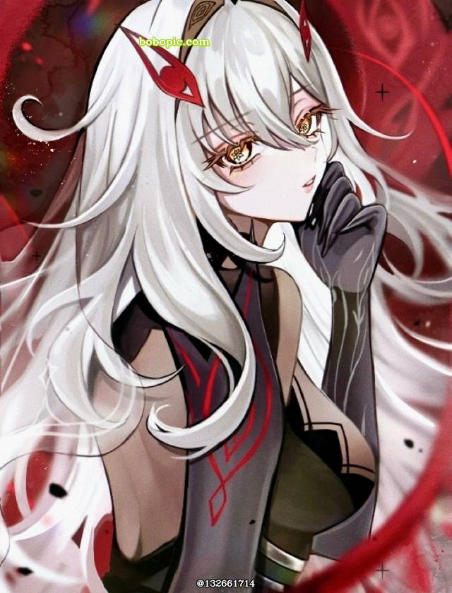

# 死之执政 · 若娜瓦 Ronova — 2026.08.24
> 视频类型：A · 角色单人壁纸合集
> 角色名称：若娜瓦（Ronova）
> 所属游戏：原神（Genshin Impact）
> 热点背景：原神7.0「无神怜爱的雪国」至冬版本进行中（8月12日上线），死之执政若娜瓦于8月22日全新过场动画「『死亡』已在身边」中以人形正式亮相，社区热度飙升。若娜瓦为天理四影之一，司掌死亡，被尊称为「冥府之母·图奥内塔尔」，是提瓦特世界观中位格最高的存在之一。
> 角色外观（经同人参考图视觉确认）：银白色及腰长发，金黄色带红晕的瞳孔，娃娃脸却一脸严肃，红色眼形/羽形发饰点缀于发间，身穿紫黑色长袍缀血纹，黑色长手套，腰间饰有凯尔特三角结，背后展开死之羽般的双翼（红色眼形翅膀），身材高挑成熟，气质庄严神秘而略带病娇感。
> 统一画风：highly detailed anime-style illustration, polished game-art quality, cinematic dramatic lighting, dark ethereal atmosphere with crimson accents

---

## 1（死之执政神座 · 风格定义图）

Positive Prompt:
16:9 2K wallpaper, Ronova the Death Archon from Genshin Impact, highly detailed anime-style illustration, polished game-art quality, cinematic dramatic lighting, dark ethereal atmosphere with crimson and violet accents.

Depict Ronova seated upon a throne of obsidian and bone in the center of a vast celestial void. Her six defining features command the scene: flowing silver-white hair cascading past her waist like a frozen waterfall, catching an otherworldly crimson glow; large golden-amber eyes with subtle red halos around the pupils, gazing downward with an expression of serene, terrible authority — doll-like face frozen in solemn seriousness; intricate crimson eye-shaped hair ornaments pinned among her bangs, glowing faintly with inner fire; a dark violet-black robe adorned with blood-red geometric patterns and Celtic knot embroidery at the waist, the fabric seeming to absorb light; Her long black gloves reach past her elbows. Her left hand rests authoritatively on the throne arm. Her right hand holds a crystalline sphere containing a swirling galaxy of souls. Each hand has exactly five perfectly defined fingers.; behind her, massive wings of shadow and crimson flame unfurl — each feather terminating in a watchful red eye that blinks slowly in the darkness.

The throne room is the threshold of the afterlife: a floor of polished black mirror-stone reflecting the infinite starry void above, crystalline pillars of frozen time rising like cathedral spires, and countless paper-thin soul-lanterns drifting upward like fireflies toward a distant crimson sun. The color palette is dominated by deep violet, obsidian black, blood crimson, and cold silver, with golden accents from her eyes. Epic symmetrical composition with Ronova as the unmistakable focal point, dramatic rim lighting from below casting her features in shadow while her hair and wings glow with inner crimson fire.

Negative Prompt:
low quality, worst quality, blurry, pixelated, bad anatomy, bad hands, extra fingers, fewer fingers, missing fingers, fused fingers, webbed fingers, merged fingers, overlapping fingers, deformed fingers, mutated fingers, six fingers, four fingers, three fingers, more than five fingers, less than five fingers, disfigured hands, poorly drawn hands, bad hand anatomy, asymmetrical hands, broken fingers, claw hands, blurry hands, indistinct fingers, smeared hands, extra limbs, chibi, bright cheerful atmosphere, sunny day, pastel colors, pink theme, missing wings, missing hair ornaments, wrong hair color, wrong eye color, blonde hair, brown eyes, casual modern clothing, sneakers, extra arms, extra hands, multiple hands, three hands, four hands, text, watermark.

---

## 2（冥府之母半身特写肖像）

Referring to the attached image (Figure 1), generate a similar style portrait of Ronova from Genshin Impact.

Create an extreme close-up portrait of Ronova's face and upper torso, filling the frame with her haunting beauty. Her silver-white hair frames her doll-like face in soft waves, the crimson eye-shaped hair ornaments glowing like tiny rubies in her bangs. Her golden-amber eyes with red halos dominate the composition — large, luminous, and impossibly ancient, staring directly at the viewer with an expression that is simultaneously innocent and terrifying. Her small lips are curved in the faintest of knowing smiles, the "yandere beauty" smile that captivated the community. Her right black-gloved hand is raised to her chin in a thoughtful pose. Perfect hand with exactly five well-defined fingers.

She wears her dark violet-black robe with blood-red geometric trim visible at the high collar and shoulder. The Celtic knot belt buckle gleams silver at her waist. Behind her, out of focus, swirl red and black ethereal mists with faint eye-shaped patterns. The lighting is dramatic chiaroscuro — a single crimson light source from below illuminates her face against a pitch-black background, creating haunting shadows. Keep the same anime illustration style, dark ethereal palette, and intimate portrait composition as the reference image.

Negative Prompt:
low quality, worst quality, blurry, pixelated, bad anatomy, bad hands, extra fingers, fewer fingers, missing fingers, fused fingers, webbed fingers, merged fingers, overlapping fingers, deformed fingers, mutated fingers, six fingers, four fingers, three fingers, more than five fingers, less than five fingers, disfigured hands, poorly drawn hands, bad hand anatomy, asymmetrical hands, broken fingers, claw hands, blurry hands, indistinct fingers, smeared hands, extra limbs, chibi, full body, wide shot, bright lighting, sunny atmosphere, missing hair ornaments, wrong hair color, wrong eye color, extra arms, extra hands, multiple hands, three hands, four hands, text, watermark.

---

## 3（夜神之国引渡亡魂）

Referring to the attached image (Figure 1), generate a similar style image for Ronova from Genshin Impact in the Night Kingdom setting.

Depict Ronova standing at the edge of a luminous river of souls in the Night Kingdom of Natlan, her role as guide of the dead made manifest. She wears her full canonical design: the dark violet-black robe with blood-red patterns flows around her in the ethereal wind of the underworld, the Celtic knot at her waist catching the blue-green glow of spirit-light. Her silver-white hair lifts and swirls as if underwater. Her golden-amber eyes with red halos reflect the countless soul-lanterns floating past. Her expression is tender yet absolute — the "Mother of the Underworld" who greets every soul with equal compassion. Her right black-gloved hand is extended over the river, palm up, as a single luminous soul-butterfly alights upon her fingers. Perfect hand with exactly five well-defined fingers.

The Night Kingdom stretches around her: a vast underground cavern with bioluminescent crystal formations in blue and green, the river of souls flowing with milky-white light, ancient Natlan stone arches carved with death-symbols, and in the distance, the faint silhouette of a pyramid-shaped palace. Her shadow-wings are partially visible, red eyes blinking in the darkness behind her. Floating soul-lanterns cast soft blue light upward, creating an underwater cathedral atmosphere. Keep the same anime illustration style, mystical underworld palette, and solemn mood as the reference image. Color palette: silver, violet-black, crimson accents, bioluminescent blue-green.

Negative Prompt:
low quality, worst quality, blurry, pixelated, bad anatomy, bad hands, extra fingers, fewer fingers, missing fingers, fused fingers, webbed fingers, merged fingers, overlapping fingers, deformed fingers, mutated fingers, six fingers, four fingers, three fingers, more than five fingers, less than five fingers, disfigured hands, poorly drawn hands, bad hand anatomy, asymmetrical hands, broken fingers, claw hands, blurry hands, indistinct fingers, smeared hands, extra limbs, chibi, bright daylight, sunny surface world, modern city, missing wings, missing hair ornaments, wrong hair color, wrong eye color, extra arms, extra hands, multiple hands, three hands, four hands, text, watermark.

---

## 4（至冬雪原死亡宣告）

Referring to the attached image (Figure 1), generate a similar style image for Ronova from Genshin Impact in the Snezhnaya setting.

Depict Ronova walking through a blizzard in the frozen wastelands of Snezhnaya, the snow itself seeming to part before her presence. Her dark violet-black robe with blood-red geometric patterns stands in stark contrast against the endless white, the heavy fabric billowing dramatically in the polar wind. Her silver-white hair streams behind her like a battle flag. Her golden-amber eyes glow with inner fire, the red halos visible even against the gray sky. Her expression is unreadable — neither cruel nor kind, simply inevitable. Her right black-gloved hand is raised slightly, palm outward, as if declaring the death of winter itself. Perfect hand with exactly five well-defined fingers.

The Snezhnaya landscape is desolate and beautiful: jagged black mountains piercing through glaciers, the ruins of ancient civilizations half-buried in snow, and overhead, a sky of perpetual twilight where aurora-like curtains of crimson and violet light dance. Her shadow-wings are fully spread, the red eyes upon each feather glowing like warning beacons in the storm. Snowflakes turn to ash where they touch her robe. In the distance, the silhouette of the Tsaritsa's palace gleams like a frozen crown. Keep the same anime illustration style, dramatic winter atmosphere, and forbidding palette as the reference image. Color palette: white, black, crimson, violet, cold silver.

Negative Prompt:
low quality, worst quality, blurry, pixelated, bad anatomy, bad hands, extra fingers, fewer fingers, missing fingers, fused fingers, webbed fingers, merged fingers, overlapping fingers, deformed fingers, mutated fingers, six fingers, four fingers, three fingers, more than five fingers, less than five fingers, disfigured hands, poorly drawn hands, bad hand anatomy, asymmetrical hands, broken fingers, claw hands, blurry hands, indistinct fingers, smeared hands, extra limbs, chibi, warm sunny weather, tropical beach, green forest, cheerful atmosphere, missing wings, missing hair ornaments, wrong hair color, wrong eye color, extra arms, extra hands, multiple hands, three hands, four hands, text, watermark.

---

## 5（不死诅咒降临坎瑞亚）

Referring to the attached image (Figure 1), generate a similar style image for Ronova from Genshin Impact in the Khaenri'ah setting.

Depict Ronova descending from a tear in reality above the burning ruins of Khaenri'ah, in the moment she delivers the curse of immortality. She is suspended in mid-air, her dark violet-black robe spreading around her like the wings of a predatory bird, the blood-red patterns glowing with active magic. Her silver-white hair floats upward in the anti-gravity of divine manifestation. Her golden-amber eyes are wide and terrible, the red halos expanded to fill her sclera with crimson light — the "great red eye" form referenced in the lore. Her doll-like face is expressionless, the most terrifying aspect of her divinity. Both black-gloved hands are extended downward toward the screaming masses below, fingers spread in the gesture of judgment. Each hand has exactly five perfectly defined fingers.

The scene is apocalyptic: the sky is torn open with jagged wounds of void-black and blood-red, the advanced architecture of Khaenri'ah crumbles in magical fire, and below, the silhouettes of panicked citizens reach upward toward their judge. Crimson chains of curse-magic spiral from her fingertips toward the ground. Her shadow-wings have become enormous, blotting out the sun, every red eye upon them weeping tears of dark flame. The color palette is apocalyptic: fire orange, blood red, void black, ash gray, with Ronova's silver hair as the only cold light. Keep the same anime illustration style, catastrophic composition, and divine horror atmosphere as the reference image.

Negative Prompt:
low quality, worst quality, blurry, pixelated, bad anatomy, bad hands, extra fingers, fewer fingers, missing fingers, fused fingers, webbed fingers, merged fingers, overlapping fingers, deformed fingers, mutated fingers, six fingers, four fingers, three fingers, more than five fingers, less than five fingers, disfigured hands, poorly drawn hands, bad hand anatomy, asymmetrical hands, broken fingers, claw hands, blurry hands, indistinct fingers, smeared hands, extra limbs, chibi, peaceful scene, happy atmosphere, bright daylight, missing wings, missing hair ornaments, wrong hair color, wrong eye color, extra arms, extra hands, multiple hands, three hands, four hands, text, watermark.

---

## 6（与希巴拉克的古老契约）

Referring to the attached image (Figure 1), generate a similar style image for Ronova from Genshin Impact in the ancient Natlan setting.

Depict Ronova standing before the first Pyro Archon Murata in the ancient city of Ochkanatlan, at the moment of their legendary pact. She is slightly elevated on a stepped pyramid platform, her dark violet-black robe with blood-red patterns catching the golden light of the setting sun over Natlan's volcanic landscape. Her silver-white hair is adorned with additional ceremonial gold bands alongside her crimson eye-shaped ornaments. Her golden-amber eyes with red halos are narrowed in calculation — the expression of a god negotiating with a mortal who dares to bargain with death itself. Her right black-gloved hand is extended to receive Murata's offered flame. Her left hand rests at her side. Each hand has exactly five perfectly defined fingers.

The ancient Natlan setting is magnificent: stepped pyramids of black volcanic stone covered in gold leaf, towering flame-altars burning with sacred fire, jungle canopy stretching to the horizon, and in the sky above, the first sunset of the new divine order. Murata's flame reflects in her eyes as she considers the price of immortality. Her shadow-wings are folded demurely behind her, but the red eyes upon them watch Murata with predatory interest. Keep the same anime illustration style, ancient mythological atmosphere, and golden-hour volcanic palette as the reference image. Color palette: gold, volcanic orange, dark violet, crimson, silver.

Negative Prompt:
low quality, worst quality, blurry, pixelated, bad anatomy, bad hands, extra fingers, fewer fingers, missing fingers, fused fingers, webbed fingers, merged fingers, overlapping fingers, deformed fingers, mutated fingers, six fingers, four fingers, three fingers, more than five fingers, less than five fingers, disfigured hands, poorly drawn hands, bad hand anatomy, asymmetrical hands, broken fingers, claw hands, blurry hands, indistinct fingers, smeared hands, extra limbs, chibi, modern city, futuristic setting, missing wings, missing hair ornaments, wrong hair color, wrong eye color, extra arms, extra hands, multiple hands, three hands, four hands, text, watermark.

---

## 7（月谕圣牌·死神的休憩）

Referring to the attached image (Figure 1), generate a similar style image for Ronova from Genshin Impact in a contemplative setting.

Depict Ronova in a rare moment of repose, sitting on the edge of a shattered moon that floats in the void between worlds. She has removed her formal outer robe, revealing an elegant black under-dress with crimson embroidery and the Celtic knot pattern at her waist. Her silver-white hair is loose and wild, flowing in the non-existent wind of the astral plane. Her golden-amber eyes with red halos are half-closed, gazing at a single soul-lantern she cradles in both black-gloved hands — a particularly bright one that seems to amuse her. Her doll-like face is softened into an expression of genuine, if distant, affection — the "clumsy but well-meaning" side of her personality that the community adores. Each hand has exactly five perfectly defined fingers.

The shattered moon is her private sanctuary: fragments of silver rock floating in slow orbit, gardens of crystallized memories blooming with bioluminescent flowers in violet and blue, and a view of the mortal world below as a tapestry of countless tiny lights — each one a life she watches over. Her shadow-wings are wrapped around her like a comforting blanket, the red eyes upon them dimmed to a sleepy glow. The mood is melancholic, intimate, and unexpectedly tender — a death goddess remembering why she cares. Keep the same anime illustration style, dreamlike cosmic atmosphere, and soft intimate lighting as the reference image. Color palette: soft silver, deep violet, gentle crimson, bioluminescent blue, starlight white.

Negative Prompt:
low quality, worst quality, blurry, pixelated, bad anatomy, bad hands, extra fingers, fewer fingers, missing fingers, fused fingers, webbed fingers, merged fingers, overlapping fingers, deformed fingers, mutated fingers, six fingers, four fingers, three fingers, more than five fingers, less than five fingers, disfigured hands, poorly drawn hands, bad hand anatomy, asymmetrical hands, broken fingers, claw hands, blurry hands, indistinct fingers, smeared hands, extra limbs, chibi, combat pose, angry expression, bright daylight, missing wings, missing hair ornaments, wrong hair color, wrong eye color, extra arms, extra hands, multiple hands, three hands, four hands, text, watermark.

---

## 8（涂鸦墙街头风 · 死神都市降临）

Positive Prompt:
16:9 2K wallpaper, Ronova the Death Archon from Genshin Impact, highly detailed anime-style illustration, vibrant graffiti art style, urban street art aesthetic, spray paint texture, bold outlines, neon color accents.

Depict Ronova as a larger-than-life graffiti mural on the side of a ruined skyscraper in a post-apocalyptic modern city. The mural is painted in explosive street-art style: her silver-white hair rendered in sweeping spray-paint strokes of white and silver, her golden-amber eyes with red halos painted as massive glowing orbs that seem to follow the viewer, her crimson eye-shaped hair ornaments stylized as dripping paint splatters. She wears a modern-streetwear reinterpretation of her robe — an oversized black hoodie with blood-red geometric patterns and a Celtic knot drawstring, paired with black thigh-high boots. Her shadow-wings spread across the entire building facade, each feather painted in wildDay-Glo colors with spray-paint drips. One hand extends toward the street below in a "come here" gesture. Perfect hand with exactly five well-defined fingers.

The urban setting is cyberpunk-dystopian: neon signs in a dead language flicker in violet and crimson, abandoned vehicles rust in the streets, and real graffiti tags cover every surface. A single working streetlamp casts an orange glow on the mural's lower half. The contrast between the divine subject and the gritty urban medium creates an unsettling juxtaposition. Style elements: heavy black outlines, halftone dot patterns, spray-paint texture overlay, paint splatter effects, sticker-bomb details.

Negative Prompt:
low quality, worst quality, blurry, pixelated, bad anatomy, bad hands, extra fingers, fewer fingers, missing fingers, fused fingers, webbed fingers, merged fingers, overlapping fingers, deformed fingers, mutated fingers, six fingers, four fingers, three fingers, more than five fingers, less than five fingers, disfigured hands, poorly drawn hands, bad hand anatomy, asymmetrical hands, broken fingers, claw hands, blurry hands, indistinct fingers, smeared hands, extra limbs, realistic style, photorealistic, 3D render, missing hair ornaments, wrong hair color, wrong eye color, extra arms, extra hands, multiple hands, three hands, four hands, text, watermark.

---

## 9（竖屏壁纸 · 冥府之门）

Positive Prompt:
9:16 2K vertical wallpaper, Ronova the Death Archon from Genshin Impact, highly detailed anime-style illustration, polished game-art quality, dramatic vertical composition, cinematic low-angle shot.

Depict Ronova standing before the Gates of the Underworld, shot from a dramatically low angle that emphasizes her divine stature. The towering obsidian gates, carved with countless eyes and Celtic knot patterns, frame her perfectly. She is backlit by the crimson light of the underworld streaming through the partially open gates, creating a powerful silhouette effect — her silver-white hair glowing like a halo around her dark outline, her shadow-wings spread to their full magnificent span. Her golden-amber eyes with red halos are the only clearly visible facial features, glowing like lanterns in the darkness. She holds a massive ceremonial key — the Key of Death — in her right black-gloved hand. Her left hand pushes the gate open. Each hand has exactly five perfectly defined fingers.

The vertical composition draws the eye upward from the viewer's perspective at ground level, past the skull-paved path, up her flowing robe, to her terrible beautiful face, and finally to the infinite darkness beyond the gates where stars are being born and dying. Soul-lanterns line the path like streetlights. The scale is epic and humbling — a mortal's view of approaching divinity. Color palette: obsidian black, deep crimson, cold silver, ghostly blue, divine gold.

Negative Prompt:
low quality, worst quality, blurry, pixelated, bad anatomy, bad hands, extra fingers, fewer fingers, missing fingers, fused fingers, webbed fingers, merged fingers, overlapping fingers, deformed fingers, mutated fingers, six fingers, four fingers, three fingers, more than five fingers, less than five fingers, disfigured hands, poorly drawn hands, bad hand anatomy, asymmetrical hands, broken fingers, claw hands, blurry hands, indistinct fingers, smeared hands, extra limbs, chibi, horizontal composition, wide shot, bright cheerful colors, missing wings, missing hair ornaments, wrong hair color, wrong eye color, extra arms, extra hands, multiple hands, three hands, four hands, text, watermark.

---

## 10（巴洛克油画融合 · 死亡的胜利）

Positive Prompt:
16:9 2K wallpaper, Ronova the Death Archon from Genshin Impact, highly detailed anime-style illustration merged with Baroque oil painting aesthetics, polished game-art quality, dramatic chiaroscuro lighting, rich dark palette with gold leaf accents.

Depict Ronova in a composition directly inspired by Baroque apotheosis paintings, but rendered in polished anime illustration style. She floats in the center of a swirling vortex of clouds and divine light, her dark violet-black robe with blood-red patterns billowing in spirals reminiscent of Rubens' dynamic drapery. Her silver-white hair spreads in a perfect halo around her head, individual strands painted with oil-paint thickness and visible brushstroke texture. Her golden-amber eyes with red halos are the emotional center — wide, luminous, and filled with the terrible compassion of a goddess who loves every soul she must claim. Her black-gloved hands are raised in the classic orans prayer posture, but instead of receiving blessing, she is releasing a flock of soul-butterflies into the light. Each hand has exactly five perfectly defined fingers.

The background is pure Baroque theatricality: putti-like spirit-forms of deceased children play among the clouds, angels of death blow trumpets made of bone, and a golden mandorla of divine light frames her entire figure. Heavy gold leaf frames the composition in ornate scrollwork. Oil paint texture is visible in the clouds and fabric, while her face and hands remain in smooth anime rendering — a deliberate fusion of Eastern and Western artistic traditions. The mood is transcendent, terrifying, and achingly beautiful. Color palette: deep crimson, gold leaf, obsidian black, silver-white, divine ivory.

Negative Prompt:
low quality, worst quality, blurry, pixelated, bad anatomy, bad hands, extra fingers, fewer fingers, missing fingers, fused fingers, webbed fingers, merged fingers, overlapping fingers, deformed fingers, mutated fingers, six fingers, four fingers, three fingers, more than five fingers, less than five fingers, disfigured hands, poorly drawn hands, bad hand anatomy, asymmetrical hands, broken fingers, claw hands, blurry hands, indistinct fingers, smeared hands, extra limbs, chibi, flat lighting, modern clothing, missing wings, missing hair ornaments, wrong hair color, wrong eye color, extra arms, extra hands, multiple hands, three hands, four hands, text, watermark.

---

## 注

**角色准确外观要点**（基于同人参考图视觉确认）：
- 发色：银白色长发，及腰或更长，波浪状
- 瞳色：金黄色/琥珀色，瞳孔周围有红色晕染/红晕
- 面部：娃娃脸，大眼睛，表情通常为严肃/神秘/冷漠
- 头饰：红色眼形/羽形发饰，点缀于刘海间
- 服装：紫黑色长袍，缀血纹/红色几何纹路，黑色长手套过肘
- 腰部：凯尔特三角结图案腰带扣
- 翅膀：死之羽般的双翼，红色眼形翅膀，每根羽毛末端有红色眼睛
- 体型：高挑成熟女性，身材曲线明显
- 气质：庄严、神秘、病娇、威严、死亡女神

**参考图说明**：
- `ref-fanart-1.jpg`：白发金红瞳，红色眼形发饰，黑色露背服装带红色纹路
- `ref-fanart-3.jpg`：白发金瞳，红色眼形翅膀/装饰，深色服装，黑色手套

**社区热梗素材**（供titles.md使用）：
- 「娃娃脸却一脸严肃」——反差萌
- 「身材爆好」——玩家热议
- 「病娇美人！一边微笑一边降下诅咒太带感了」
- 「弱气但强撑的既视感」「容易闯祸的笨蛋，稳拿吃瘪位」「反差萌：强大力量但笨蛋吃鳖」
- 「时不时用不死诅咒向我表达娇羞的若娜瓦同学」
- 「大眼珠子女士」——米游社玩家戏称
- 「冥府之母·图奥内塔尔」——祷歌名号
- 「千手百眼神像原型」——稻妻神像酷似她
- 「你家狗打碎了盘子，心虚的看着你」
- 8月22日过场动画「『死亡』已在身边」正式人形亮相
