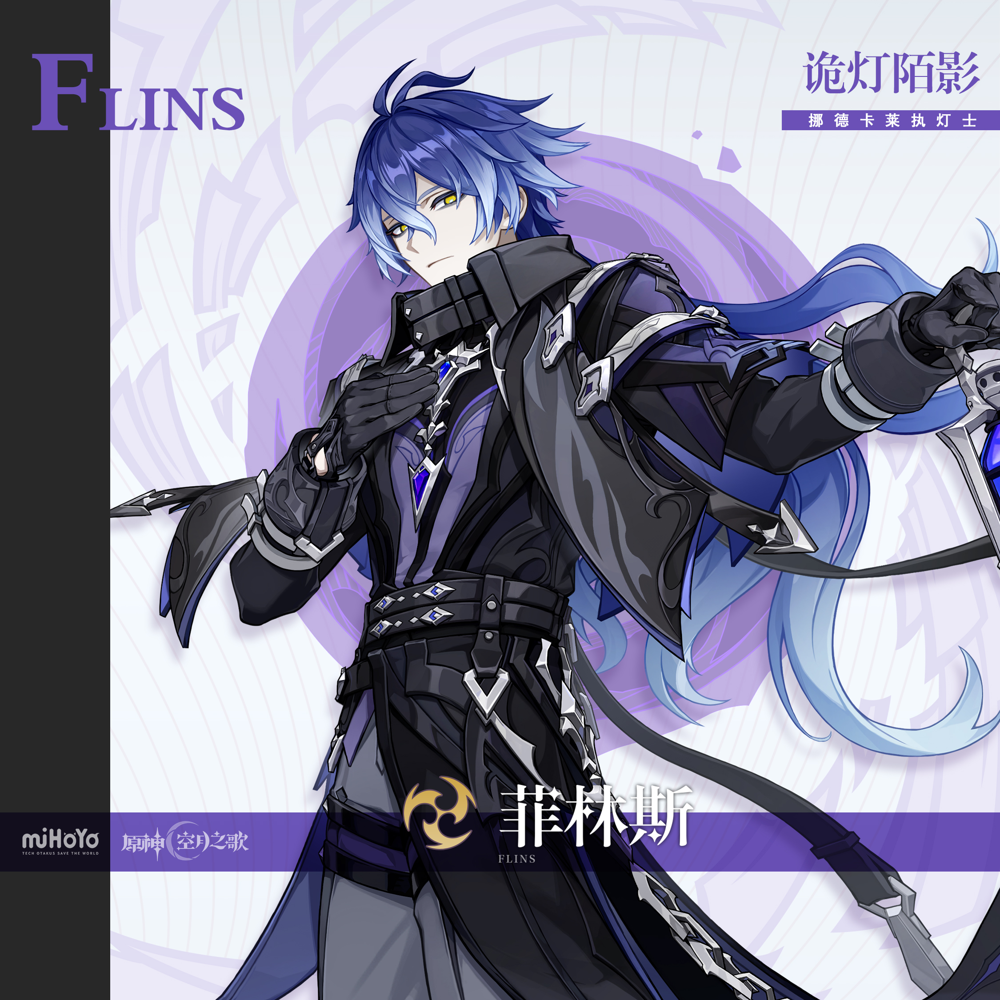
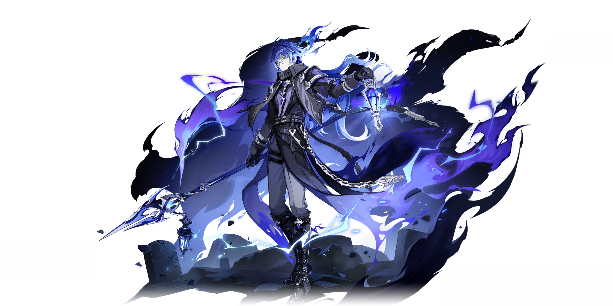
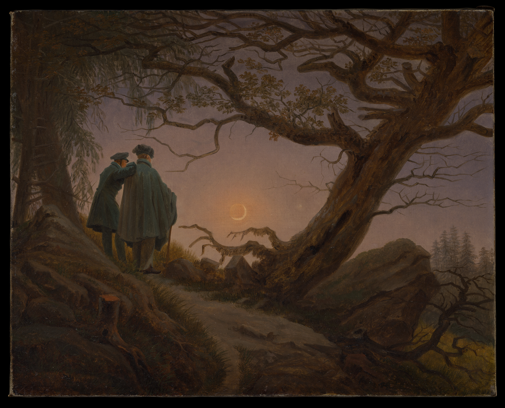
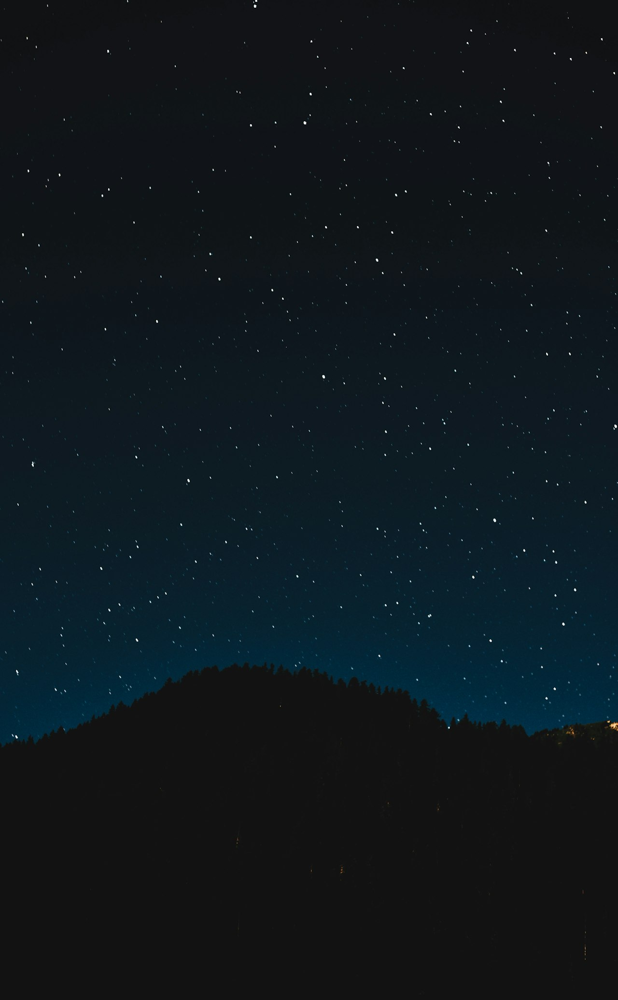

# 菲林斯 Flins — 2026.08.10
> 视频类型：A · 角色单人壁纸合集
> 角色来源：原神 7.0「无神怜爱的雪国」· 五星雷元素长柄武器
> 身份：至冬妖精贵族 / 挪德卡莱「执灯人」战士 / 北方灯塔与墓地守望者
> 全名：克里洛·楚德米洛维奇·菲林斯
> 称号：诡灯陌影
> 配音：中文CV 马正阳
> 设计参考：至冬妖精族裔（白沙皇时期宫廷贵族）、灯塔守望者、东欧/北欧暗色绅士、蓝紫渐变发色（被称为"七神与龙王级渐变配色"）
> 热点背景：原神7.0「无神怜爱的雪国」8月12日上线（距今仅2天），菲林斯为7.0下半卡池五星角色，至冬国开篇带来的「执灯人」叙事线高度聚焦于他；7.0前瞻直播播放量超161万，弹幕近5万条，版本预约网页活动「至冬将至」进行中（截至8月11日）；作为首个拥有渐变色发色的非限定角色，社区讨论热度极高
> 今日特殊：7.0至冬版本倒计时2天，版本热度冲刺期

# 必需

Refer to the attached reference image (Figure 1). Generate a similar style image of Flins from Genshin Impact leaning against a graffiti-covered concrete wall in a dimly lit alleyway, arms crossed over his chest with a composed, slightly amused expression — the look of a gentleman who finds the modern world mildly entertaining. He wears modernized streetwear: a long black leather trench coat with muted blue-purple inner lining visible at the lapels, over a fitted dark grey turtleneck, slim black trousers with silver chain details at the hip, and black military-style lace-up boots with silver buckle accents. A single silver pocket watch chain hangs from his coat pocket. Keep his recognizable features: medium-length hair with a distinctive blue-to-purple-to-pale-ice-blue gradient color (darker blue-violet at roots, transitioning to pale icy blue at the tips), styled with side-swept bangs partially covering his left eye and longer strands flowing past his shoulders, bright golden-amber eyes with a calm analytical gaze, pale skin, sharp refined features. The graffiti wall behind him features dark indigo, violet, and electric blue abstract patterns with subtle lightning bolt motifs and faint crescent moon shapes. Cool blue-violet neon light from an unseen sign casts dramatic shadows across the scene. 16:9 2K wallpaper format. perfect hands, five fingers on each hand, anatomically correct hands, well-defined fingers, arms crossed with hands tucked.

Negative Prompt: low quality, worst quality, blurry, pixelated, bad anatomy, bad hands, extra fingers, fewer fingers, missing fingers, fused fingers, webbed fingers, merged fingers, overlapping fingers, deformed fingers, mutated fingers, six fingers, four fingers, three fingers, more than five fingers, less than five fingers, disfigured hands, poorly drawn hands, bad hand anatomy, asymmetrical hands, broken fingers, claw hands, blurry hands, indistinct fingers, smeared hands, extra limbs, chibi, childish, wrong hair color, red hair, blonde hair, wrong eye color, red eyes, blue eyes, cheerful sunny setting, warm daylight, female character, text, watermark, logo, signature.

# 人物设定

## 1 — 灯塔守望者·终夜长茔（标志性场景）

Positive Prompt:
16:9 2K wallpaper, Flins from Genshin Impact, highly detailed anime-style illustration, polished game-art quality, atmospheric night scene with haunting beauty, moonlit coastal isolation.

Depict Flins standing at the base of an ancient, weathered stone lighthouse on a rocky island off the coast of Nod-Karley (挪德卡莱), the cold sea wind whipping his long gradient hair — blue-violet roots fading to pale icy blue tips — dramatically to one side. He holds a glowing blue-purple lantern in his left hand, its ethereal flame casting a spectral light that illuminates his face and the nearest gravestones of the cemetery he guards. His right hand rests casually in his coat pocket. His expression is serene but tinged with ancient melancholy — the face of someone who has outlived everyone he once fought beside, and has made peace with that solitude.

Full canonical design with maximum detail: medium-length hair with the signature blue-to-purple-to-pale-ice-blue gradient, side-swept bangs partially covering his left eye, longer strands flowing past his shoulders with some caught by the wind. Bright golden-amber eyes with a reflective, knowing quality. He wears his signature dark outfit: a long black coat with layered construction — high collar, silver decorative clasps and cross-shaped metal accents down the front, a dark grey-blue inner vest visible beneath, multiple black leather belts crossing at the waist with silver buckles and chain links, dark fitted trousers with reinforced knee panels, and tall black boots with silver hardware. Black fingerless combat gloves with silver studs.

The lighthouse behind him is tall, cylindrical, built of weathered grey stone, its beacon long extinguished — a relic of a bygone era. Scattered around the base are weathered gravestones of fallen Lightbearers (执灯人), some bearing faded inscriptions, a few with offerings of wildflowers. The rocky shore extends to a dark, churning sea under a vast night sky with a crescent moon and scattered stars. Northern aurora (green-purple) shimmers faintly on the horizon above distant ice-capped mountains of Snezhnaya.

Wide atmospheric composition with Flins at the right third, the lighthouse towering behind him at center-left, the sea and aurora-lit horizon stretching across the background. Cool blue-violet moonlight dominates with warm amber from his lantern providing intimate contrast. The mood is hauntingly beautiful, solitary, and deeply contemplative.

perfect hands, five fingers on each hand, anatomically correct hands, well-defined fingers, left hand holding lantern handle, right hand in pocket.

Negative Prompt:
low quality, blurry, bad anatomy, bad hands, extra fingers, fewer fingers, missing fingers, fused fingers, webbed fingers, merged fingers, overlapping fingers, deformed fingers, mutated fingers, six fingers, four fingers, disfigured hands, poorly drawn hands, bad hand anatomy, broken fingers, blurry hands, indistinct fingers, extra limbs, daytime scene, bright sunlight, cheerful atmosphere, modern buildings, combat pose, weapon drawn, multiple characters, female character, chibi, text, watermark, logo.

## 2 — 幽焰显迹·月感电觉醒（元素爆发战斗形态）

Positive Prompt:
16:9 2K wallpaper, Flins from Genshin Impact, highly detailed anime-style illustration, dynamic action composition, dramatic Electro elemental effects with unique blue-purple flame aesthetic, polished game-art quality, epic battle atmosphere.

Depict Flins at the climax of his Elemental Burst — the "Ghostfire Manifestation" (幽焰显迹) mode fully activated. He stands in a powerful forward-thrusting stance, his ornate silver-and-black spear extended forward, its blade wreathed in crackling blue-violet lightning that spirals outward in arcs. His body is surrounded by a vortex of his signature blue-purple ghostfire (幽焰) — not normal Electro purple but a unique spectral blue-violet flame that dances between states of fire and lightning, trailing upward like phantom wings from his shoulders. His eyes blaze with intensified golden light, pupils contracted to sharp points of determination.

His gradient hair whips violently upward in the energy vortex, the blue-purple roots now glowing with internal Electro luminescence, the pale ice-blue tips trailing sparks like comet tails. His dark coat billows dramatically, its interior lining now visibly crackling with lightning patterns. The silver metal accents on his outfit — clasps, chains, buckles — all glow with conducted Electro energy. Around his feet, the ground fractures in a spiderweb pattern of glowing blue-violet fissures, the "Moon-Galvanize" (月感电) reaction spreading outward.

The battlefield is a ruined section of the Nod-Karley coastline during a supernatural storm — Abyssal corruption (深渊) has twisted the rocks into unnatural shapes, dark purple miasma hangs in the air, and the sea behind him churns with unnatural waves. Shadowy silhouettes of Wildfire (狂猎) creatures lurk at the edges of the frame, about to be obliterated by his attack.

Dynamic diagonal composition with Flins as the central force, spear thrust creating a strong directional line from lower-left to upper-right, blue-violet ghostfire and lightning radiating outward. Deep navy-black shadows contrast with blazing blue-violet-white energy highlights and his golden eyes.

perfect hands, five fingers on each hand, anatomically correct hands, well-defined fingers, both hands gripping spear shaft firmly.

Negative Prompt:
low quality, blurry, bad anatomy, bad hands, extra fingers, fewer fingers, missing fingers, fused fingers, webbed fingers, merged fingers, overlapping fingers, deformed fingers, mutated fingers, six fingers, four fingers, disfigured hands, poorly drawn hands, bad hand anatomy, broken fingers, blurry hands, indistinct fingers, smeared hands, extra limbs, stiff pose, weak effects, flat lighting, bright cheerful daylight, cute peaceful expression, missing weapon, fire/Pyro effects, Cryo ice effects, orange flames, chibi, text, watermark.

## 3 — 白沙皇宫廷·妖精贵族的旧日（暗黑过去回忆）

Positive Prompt:
16:9 2K wallpaper, Flins from Genshin Impact, highly detailed anime-style illustration, opulent dark fantasy court atmosphere, golden candlelight against cold stone, narrative storytelling composition, polished game-art quality.

Depict a younger Flins (appearing as he would have during the era of the White Czar / 白沙皇) standing in the grand throne hall of the ancient Snezhnayan fairy court. He wears an aristocratic ceremonial version of his outfit — a longer, more ornate dark blue-black coat with elaborate silver embroidery depicting crescent moons and stylized fairy wings, a high mandarin collar edged in platinum thread, a silver circlet resting on his blue-gradient hair, and a formal cape of deep midnight blue clasped at one shoulder with a moonstone brooch. His expression is guarded and contemplative, golden eyes watching the court proceedings with the detached observation of someone who already senses the coming fall of his people.

The fairy court around him is magnificent but carries an undertone of decay: towering pillars of pale blue ice-stone carved with ancient Snezhnayan runes, a massive throne of crystallized moonlight at the far end of the hall (empty — the White Czar has already passed), tall arched windows showing an eternal winter landscape outside, chandeliers of frozen silver droplets casting prismatic light. Other fairy nobles (silhouetted, faces not detailed) stand in small groups, some arguing, some staring at the empty throne. The floor is polished black marble reflecting the chandelier light like a dark mirror.

The composition places young Flins slightly off-center in the foreground, the empty throne visible in the distant background through the crowd — a visual metaphor for the power vacuum that will destroy the fairy aristocracy. Warm gold candlelight from above, cold blue moonlight from the windows, creating dramatic split lighting on his face. The mood is regal, melancholic, and ominous — the last days of an age.

perfect hands, five fingers on each hand, anatomically correct hands, well-defined fingers, hands at sides with fingers naturally relaxed.

Negative Prompt:
low quality, blurry, bad anatomy, bad hands, extra fingers, fewer fingers, missing fingers, fused fingers, webbed fingers, merged fingers, overlapping fingers, deformed fingers, mutated fingers, six fingers, four fingers, disfigured hands, poorly drawn hands, bad hand anatomy, broken fingers, blurry hands, indistinct fingers, extra limbs, modern setting, outdoor battle scene, summer scenery, cheerful expression, combat gear with weapon drawn, female fairy court, chibi, text, watermark.

## 4 — 绅士的午后·挪德卡莱市集采买（温暖日常反差）

Positive Prompt:
16:9 2K wallpaper, Flins from Genshin Impact, highly detailed anime-style illustration, warm slice-of-life atmosphere, cozy winter town scene, charming character moment, polished game-art quality.

Depict Flins walking through the bustling harvest-season market of Nod-Karley (挪德卡莱) during one of his rare monthly supply runs. He carries a cloth shopping bag in one hand, from which peek fresh bread, a bottle of something amber, and a bundle of dried herbs. His other hand is adjusting his high collar against the cold wind. His expression is one of mild, quiet contentment — not quite a smile, but the closest thing to relaxation this solitary man allows himself. A few curious townsfolk watch him from nearby stalls, half in awe, half wanting to approach.

His canonical design is rendered in softer, warmer lighting than usual: the blue-purple gradient hair catches golden afternoon sunlight, making the ice-blue tips almost glow. His dark outfit looks less military in this context — the silver chains and buckles catching warm light, the long coat swaying with his stride, his posture more relaxed than battle-ready. Golden-amber eyes have a rare warmth in them as he examines a stall's wares.

The market is a charming Snezhnayan winter scene: wooden stalls with colorful awnings selling furs, preserves, smoked fish, and carved wooden crafts. Snow dusts the rooftops of half-timbered buildings. Warm amber light spills from shop windows. A light snowfall drifts through the air, individual flakes catching the sunlight. In the background, snow-capped mountains and the distant silhouette of a lighthouse on an island in the harbor are visible — a reminder of where he'll return to when the shopping is done.

Medium-wide composition with Flins walking toward the viewer through the market, stalls framing both sides, the mountain-and-lighthouse backdrop visible behind him. Warm amber-gold afternoon light with cool blue shadows, snowflakes providing sparkle. The mood is unexpectedly warm and human — the legendary fairy warrior reduced to an endearing figure buying groceries.

perfect hands, five fingers on each hand, anatomically correct hands, well-defined fingers, one hand carrying bag handle, other hand adjusting collar naturally.

Negative Prompt:
low quality, blurry, bad anatomy, bad hands, extra fingers, fewer fingers, missing fingers, fused fingers, webbed fingers, merged fingers, overlapping fingers, deformed fingers, mutated fingers, six fingers, four fingers, disfigured hands, poorly drawn hands, bad hand anatomy, broken fingers, blurry hands, indistinct fingers, extra limbs, dark nighttime scene, combat pose, weapon drawn, aggressive expression, summer setting, modern city, chibi, text, watermark.

## 5 — 赛博至冬·幽影数据猎人（赛博朋克变体）

Positive Prompt:
16:9 2K wallpaper, Flins from Genshin Impact, highly detailed anime-style illustration, cyberpunk aesthetic, neon-noir atmosphere, polished character art, futuristic dark elegance.

Reimagine Flins in a cyberpunk Snezhnaya setting. He walks through a rain-soaked alleyway in a neon-lit district, his reflection mirrored in the wet asphalt below. He wears a modernized cyber-gothic version of his outfit: a long black synthetic-leather coat with embedded indigo LED strips running along the seams and collar, a dark armored vest beneath with a holographic Lightbearer insignia that flickers faintly on the chest, fitted black tactical pants with reinforced joints, and magnetic-sole boots leaving faint blue light-trails with each step.

His gradient hair now features subtle fiber-optic strands woven into the blue-to-ice transition, pulsing with soft Electro light like bioluminescence. His golden-amber eyes have a cybernetic HUD overlay — targeting reticles, atmospheric data readouts, and a faint crescent moon icon in the corner of his vision (his Lightbearer identification). His black gloves are upgraded with thin blue circuit-line patterns across the knuckles, fingertips equipped with data-interface nodes.

Instead of a lantern, he holds a compact holographic projector in one hand that casts a ghostly blue-white 3D map of the city's underground tunnel network. His spear is reimagined as a collapsible electromagnetic lance mag-locked to his back, its blade segment glowing with contained Electro charge.

The cyberpunk alley is dense with atmosphere: towering dark buildings with massive holographic advertisements in Cyrillic script for "Fatuus Corp" and "Tsaritsa Industries," steam rising from subway grates, neon signs in indigo, violet, and electric blue reflecting in puddles, surveillance drones with red sensor lights hovering between buildings. A distant lighthouse-shaped communications tower blinks with blue light on the horizon.

Frontal walking composition with Flins approaching the viewer, his reflection creating vertical symmetry in the wet street. Indigo, violet, and ice-blue neon dominate against deep black shadows.

perfect hands, five fingers on each hand, anatomically correct hands, well-defined fingers, one hand holding holographic projector, other hand relaxed at side.

Negative Prompt:
low quality, blurry, bad anatomy, bad hands, extra fingers, fewer fingers, missing fingers, fused fingers, webbed fingers, merged fingers, overlapping fingers, deformed fingers, mutated fingers, six fingers, four fingers, disfigured hands, poorly drawn hands, bad hand anatomy, broken fingers, blurry hands, indistinct fingers, smeared hands, extra limbs, medieval fantasy setting, bright sunshine, cheerful expression, cute outfit, green grass, flowers, historical clothing, female character, chibi, text, watermark.

## 6 — 执灯人誓言·深渊边界巡夜（职责/身份场景）

Positive Prompt:
16:9 2K wallpaper, Flins from Genshin Impact, highly detailed anime-style illustration, dramatic patrol scene, tension between duty and danger, atmospheric horror-tinged fantasy, polished game-art quality.

Depict Flins on night patrol along the boundary where Nod-Karley's protected territory meets the Abyssal corruption zone. He stands on a rocky ridge overlooking a vast, corrupted landscape — on one side, the warm amber lights of a distant Snezhnayan fishing village; on the other, a twisted wasteland where the ground is cracked and oozing dark purple miasma, dead trees bent into unnatural shapes, and faint red eyes of Wildfire (狂猎) creatures glow in the darkness.

He holds his spear in a relaxed but ready grip, the blade pointed downward with its tip resting on the rock, one hand wrapped around the shaft while the other hangs at his side. His posture communicates quiet vigilance — not tense, but alert, the body language of someone who has done this watch a thousand times. His blue-violet ghostfire lantern hangs from a hook on his belt, casting a protective circle of spectral blue light around him. His golden eyes scan the corruption zone with analytical calm.

His gradient hair — blue-violet to ice-blue — catches both the warm village light and the cold moonlight, creating a split-tone effect. His dark outfit is rendered in full patrol detail: every silver clasp, chain, and buckle catching dim light, the coat slightly weathered from years of service, boots scuffed from rocky terrain.

Behind and above him, the night sky is split dramatically: clear starry sky on the village side, roiling dark storm clouds tinged with purple corruption on the Abyssal side. The crescent moon sits exactly at the boundary line. Faint blue Electro sparks dance along his spear blade — passive energy, ready to ignite at the first sign of threat.

Panoramic wide composition with Flins at center on the ridge, the safe village to viewer's left, the corrupted wasteland to viewer's right. The visual dichotomy between warm amber safety and cold purple danger is the compositional thesis. The mood is solemn, dutiful, and quietly heroic.

perfect hands, five fingers on each hand, anatomically correct hands, well-defined fingers, one hand gripping spear shaft mid-height, other hand relaxed at side.

Negative Prompt:
low quality, blurry, bad anatomy, bad hands, extra fingers, fewer fingers, missing fingers, fused fingers, webbed fingers, merged fingers, overlapping fingers, deformed fingers, mutated fingers, six fingers, four fingers, disfigured hands, poorly drawn hands, bad hand anatomy, broken fingers, blurry hands, indistinct fingers, smeared hands, extra limbs, indoor scene, daytime, cheerful expression, modern city, combat mid-swing, multiple characters, female character, chibi, text, watermark.

## 7 — 一枚古币·一双眼睛（PV金句肖像）

Positive Prompt:
16:9 2K wallpaper, Flins from Genshin Impact, highly detailed anime-style illustration, intimate character portrait, dramatic chiaroscuro lighting, artistic symbolism, polished gallery-quality character art.

A close-up artistic portrait of Flins from shoulders up, rendered with exceptional detail. He holds an ancient golden coin between the thumb and index finger of his right hand, positioned at eye level so that the coin partially overlaps with his left eye — creating a visual metaphor from his PV title "一枚古币，一双眼睛" (One Coin, Two Eyes). The coin is old, tarnished, bearing a faded crest of the White Czar era. His visible right eye — bright golden-amber — gazes directly at the viewer with piercing intelligence and a hint of sardonic amusement, as if he knows something about you that you don't know yourself.

His blue-to-purple-to-ice-blue gradient hair frames his face in layered waves, the side-swept bangs adding asymmetry, longer strands falling past his jawline. A few individual hairs catch the light, glowing like filaments. The cross-shaped silver clasp at his high collar is visible at the bottom edge of the frame, gleaming. His skin is pale with cool undertones, rendered with the clarity of a Renaissance portrait.

The lighting is pure chiaroscuro: a single cold blue-white light source from the upper right (moonlight, implied), illuminating the left side of his face and the coin in sharp relief, while the right side falls into deep shadow. His Electro Vision, if visible at the edge of the frame, glows with a faint violet pulse. The background is a gradient from deep indigo to black — abstract, emphasizing the face and the coin as the only subjects.

Tight close-up composition, face filling roughly 65% of the frame, the coin held at center. Shallow depth of field: his visible eye and the coin razor-sharp, hair and background softly blurred. The mood is mysterious, intellectual, and magnetically compelling — a man who has seen centuries and still finds the world interesting enough to stay.

perfect hands, five fingers on each hand, anatomically correct hands, well-defined fingers, thumb and index finger holding coin precisely.

Negative Prompt:
low quality, blurry, bad anatomy, bad hands, extra fingers, fewer fingers, missing fingers, fused fingers, webbed fingers, merged fingers, overlapping fingers, deformed fingers, mutated fingers, six fingers, four fingers, disfigured hands, poorly drawn hands, bad hand anatomy, broken fingers, blurry hands, indistinct fingers, smeared hands, extra limbs, full body shot, action scene, weapon drawn, battle effects, bright flat lighting, outdoor daylight, multiple characters, female character, wrong eye color, red eyes, blue eyes, chibi, text, watermark.

# 参考图

## 8（基于官方立绘·雪国暴风中的枪阵特写）

Referring to the attached splash art of Flins (Figure 8) showing him in a dramatic combat stance surrounded by swirling blue-violet ghostfire and lightning arcs, with his ornate spear extended. Generate a 16:9 2K wallpaper expanding this composition into a full Snezhnayan battlefield panorama. Flins stands at the center of a frozen coastal battlefield during a supernatural blizzard, his spear thrust forward releasing a massive wave of blue-violet "Moon-Galvanize" (月感电) energy that spreads across the ice in branching lightning patterns. Preserve his exact canonical design: blue-to-purple-to-ice-blue gradient hair whipping in the storm, golden-amber eyes blazing with Electro intensity, the full dark outfit with every silver clasp and chain detail, black gloves gripping the spear. The blizzard around him carries both natural snowflakes and spectral blue-violet energy particles. Cracked ice underfoot reveals dark churning water beneath. On the horizon, the silhouette of his lighthouse stands against the storm-lit sky, its beacon re-ignited with his ghostfire — a single point of blue light in the white chaos. The palette contrasts white blizzard, deep navy-black shadows, and blazing blue-violet Electro highlights.

perfect hands, five fingers on each hand, anatomically correct hands, hands gripping spear shaft firmly in combat stance.

Negative Prompt: low quality, worst quality, blurry, bad anatomy, bad hands, extra fingers, missing fingers, fused fingers, deformed fingers, mutated fingers, six fingers, four fingers, disfigured hands, poorly drawn hands, extra limbs, stiff pose, weak effects, flat lighting, sunny day, wrong hair color, wrong eye color, incorrect character, female character, chibi, text, watermark, logo.

## 9（手机竖屏壁纸·9:16适配）

Referring to the attached gacha promotional art of Flins (Figure 9) showing his full character design. Resize and adapt this image composition into a 9:16 2K resolution mobile wallpaper format. Expand the background upward to show a vast starry night sky with aurora borealis in green-purple hues, and downward to show the rocky ground of his lighthouse island with scattered gravestones. Maintain the same elegant three-quarter pose, art style, and color palette (dark blue-black, silver, blue-violet gradient). The character should be centered with comfortable spacing on all sides for mobile screen use. Add subtle blue-violet ghostfire particles and drifting snowflakes to fill the expanded vertical space. His Electro Vision and the silver chain details should glow softly. A crescent moon sits in the upper portion of the sky.

Negative Prompt: low quality, blurry, cropped, bad anatomy, bad hands, extra fingers, fewer fingers, missing fingers, fused fingers, deformed fingers, poorly drawn hands, wrong character, different art style, different color palette, different pose, female character, bright warm colors, text, watermark.

# 跨领域参考图

## 10（参考弗里德里希《两人望月》·浪漫主义孤独美学融合）

Positive Prompt:
Refer to the attached reference image (Figure 10), Caspar David Friedrich's 1825 Romantic painting "Two Men Contemplating the Moon" — note the two dark silhouetted figures standing on a rocky, root-tangled path gazing at a crescent moon through twisted oak branches, the deep earth-tone palette of browns and dark greens, the luminous golden-white moonlight creating a mystical glow in the clouded sky, and the overwhelming sense of sublime solitude before nature's vastness.

Generate a 16:9 2K wallpaper of Flins from Genshin Impact reimagined into this Romantic painting's composition and atmosphere. Replace the two figures with Flins standing alone on a similar rocky, root-tangled promontory, gazing at a crescent moon through the gnarled branches of ancient frozen trees. Preserve his exact canonical design and color palette — blue-to-purple-to-ice-blue gradient hair, golden-amber eyes reflecting the moonlight, dark outfit with silver accents — but render his figure with the same dark silhouette treatment as the original painting, details visible only where moonlight catches them (hair tips, silver clasps, the edge of his coat, the glint of his eyes).

Fuse Friedrich's Romantic landscape palette with Snezhnayan winter elements: the earth-tone browns become frost-dusted dark blues and slate greys, the oak branches become ice-encrusted birch trees, snow covers the rocks where moss would be. Keep the painting's golden-white moonlight and luminous sky, but add faint aurora shimmer in the upper sky and subtle blue-violet ghostfire sparks near Flins's lantern (hung at his belt) as unique elemental touches absent from the original. The emotional core must be identical to Friedrich's work: the profound, aching beauty of a solitary figure contemplating something infinitely larger than himself — except Flins has been doing this for centuries, not merely an evening.

Negative Prompt:
low quality, worst quality, blurry, bad anatomy, bad hands, extra fingers, fewer fingers, missing fingers, fused fingers, webbed fingers, merged fingers, overlapping fingers, deformed fingers, mutated fingers, six fingers, four fingers, disfigured hands, poorly drawn hands, bad hand anatomy, broken fingers, blurry hands, indistinct fingers, extra limbs, fully anime flat-shading, bright colorful palette, daytime sunshine, multiple characters clearly visible, modern buildings, combat pose, weapon drawn, female character, chibi, text, watermark, logo.

## 11（参考灯塔风暴夜景摄影·执灯人的风暴职责融合）

Positive Prompt:
Refer to the attached reference image (Figure 11), a dramatic photograph of a lighthouse standing against a stormy night sky — note the lighthouse's warm beacon cutting through swirling dark clouds, the turbulent sea spray crashing against rocks at its base, the contrast between the lighthouse's steady warm light and the chaotic darkness surrounding it, and the sense of isolated defiance against overwhelming natural forces.

Generate a 16:9 2K wallpaper of Flins from Genshin Impact standing at the very top of his lighthouse during a supernatural storm, reimagining this photographic drama into his world. He stands on the narrow observation platform at the lighthouse's crown, one hand gripping the iron railing, his coat and hair streaming violently in the gale. The lighthouse is his Nod-Karley watchtower — ancient stone construction, taller and more Gothic than the reference photo, with his blue-violet ghostfire replacing the normal beacon, casting an ethereal spectral beam that cuts through the storm instead of warm light.

Preserve his exact canonical design battered by the storm: gradient hair soaked and whipping horizontally, golden eyes narrowed against the wind but unwavering, dark outfit drenched and clinging, silver clasps and chains glinting with each lightning flash. Fuse the photograph's dramatic storm energy — crashing waves, howling wind made visible through rain streaks and cloud movement — with fantasy elements: the storm clouds are tinged with Abyssal purple corruption, the waves carry faint dark miasma, and Flins's ghostfire beacon is the only thing holding the corruption at bay. Blue-violet Electro lightning arcs from the beacon outward like a protective barrier.

The composition mirrors the reference photo's vertical drama: lighthouse filling the right third, storm clouds and sea filling the rest, but adds Flins as the human element at the summit. The palette combines the reference's dark storm greys with blue-violet Electro highlights and the single warm point of his golden eyes. The mood is one of absolute, quiet defiance — one man and one light against the darkness.

Negative Prompt:
low quality, worst quality, blurry, bad anatomy, bad hands, extra fingers, fewer fingers, missing fingers, fused fingers, webbed fingers, merged fingers, overlapping fingers, deformed fingers, mutated fingers, six fingers, four fingers, disfigured hands, poorly drawn hands, bad hand anatomy, broken fingers, blurry hands, indistinct fingers, extra limbs, photorealistic face, calm weather, bright daylight, modern lighthouse, wrong hair color, wrong eye color, incorrect character, female character, indoor scene, chibi, text, watermark, logo.

# 注
本期参考图来源：立绘 splash-art.png 和 gacha-art.png 均来自B站WIKI原神资料站（wiki.biligame.com/ys）MediaWiki API 直接获取。菲林斯原为至冬妖精贵族，现任挪德卡莱「执灯人」组织战士，独自守望北方小岛上的灯塔与墓地。其渐变发色（蓝紫→冰蓝）被社区称为"七神与龙王级渐变配色"，为原神首个拥有此类渐变色的非限定角色。

跨领域参考图共两张：其一为德国浪漫主义画家卡斯帕·大卫·弗里德里希（Caspar David Friedrich）创作于约1825-30年的油画《两人望月》（Two Men Contemplating the Moon），藏于纽约大都会艺术博物馆（公共领域），画中两个暗色人影在月光下的岩石小路上凝望新月的构图，与菲林斯"灯塔孤独守望者"的人设定位高度契合——同样是人在自然/命运的浩瀚面前的渺小与崇高；其二为Unsplash免费风暴灯塔夜景摄影，灯塔在暴风雨中孤独矗立的戏剧性画面，与菲林斯"执灯人于深渊边界巡夜"的核心身份职责完美呼应。
