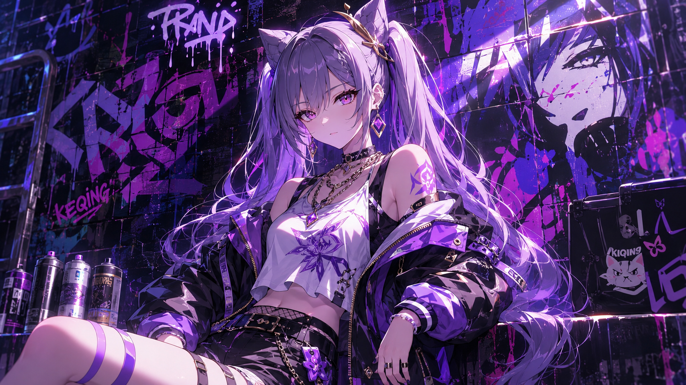
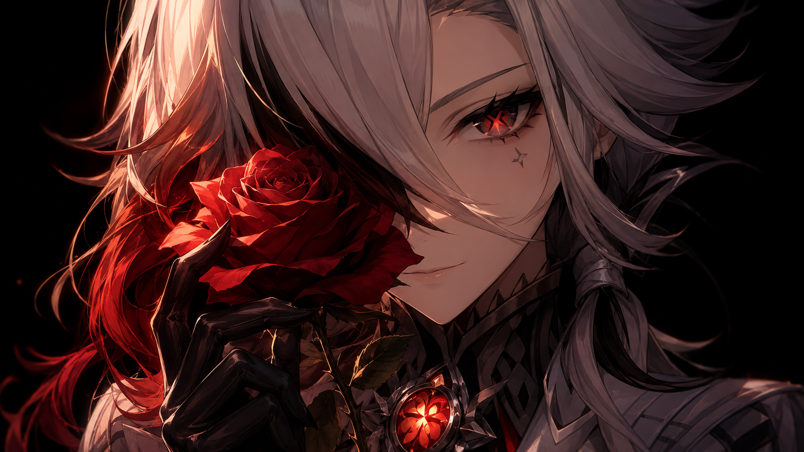
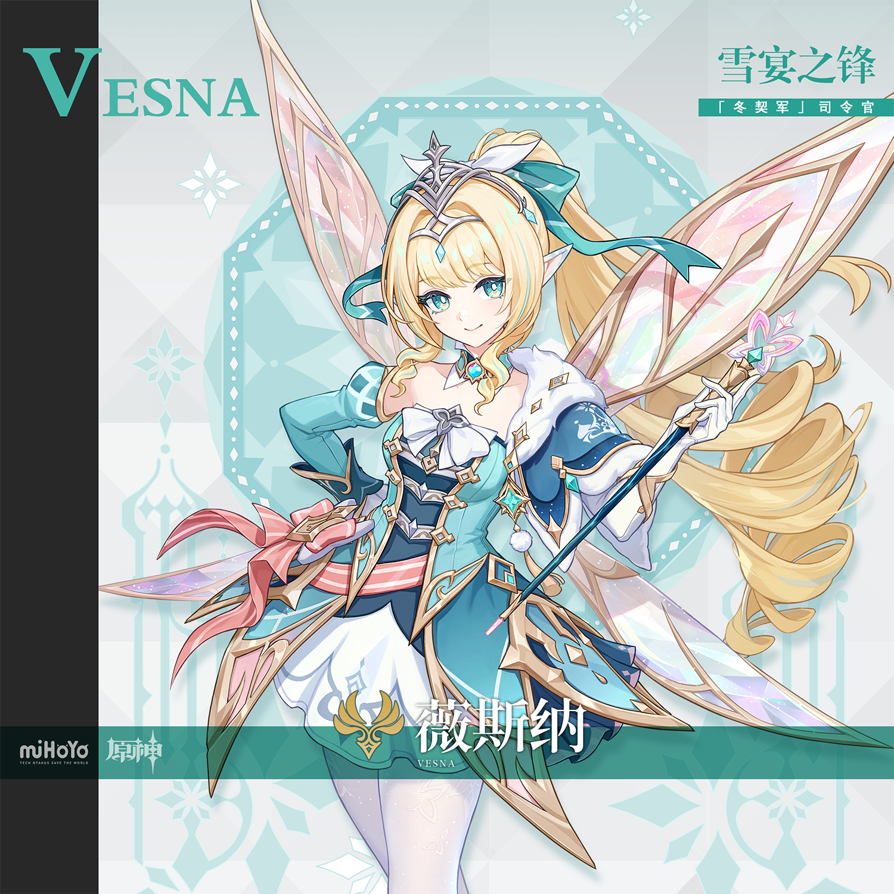

# 薇斯纳·丝翠维莎 Vesna Stravissa — 2026.09.02
> 视频类型：A · 角色单人壁纸合集
> 角色来源：原神 7.1至冬周年庆版本 · 五星风元素单手剑角色
> 身份：至冬「冬契军」司令官 / 古老风仙血脉「丝翠维莎」家后裔
> 称号：雪宴之锋 · 花序座
> 设计参考：斯拉夫风仙（Vila）神话、冬季军事礼装、蝶翼妖精美学
> 热点背景：2026年8月17-18日官方连续发布薇斯纳与沃雅妮莎角色预告；7.1前瞻直播定于9月11日，周年庆版本预计9月23日上线；社区热度极高（抖音立绘视频295万赞、TapTap「薇斯娜真的好可爱」热评登顶），「柠檬恶作剧」「吕布」「散兵同款悬浮」等梗广泛传播
> 今日特殊：无特殊节日；7.1前瞻预热期，角色未实装但立绘已引爆社区
> 选定类型理由：重大热点（7.1前瞻+周年庆预热）→ 类型A深度呈现新角色
> 选定角色理由：工作区首次覆盖；官方热点（预告发布+前瞻倒计时）权重最高；角色外观辨识度极强（金色罗马卷、青色挑染、尖耳、两对大型粉彩蝶翼、白丝军装），壁纸表现力极强；社区梗「柠檬片」「恶作剧」「薇斯纳宝宝」「吕布」传播度广

---

# 必需

## 1 — 涂鸦墙街头风（Graffiti Wall Street Style）

Refer to the attached reference image (Figure 1). Generate a similar style image of Vesna from Genshin Impact sitting casually in front of a bold graffiti wall. Vesna is seated in a relaxed but confident posture, leaning back against the graffiti wall with one knee raised and her other leg stretched out casually, one hand resting on her raised knee while the other holds a half-peeled lemon with frost crystals forming on its rind, her body language calm, controlled, and slightly provocative. Her expression should show cold, disdainful eyes, aloof, sharp, and superior, as if she is silently judging the viewer — the playful prankster completely absent, replaced by the commanding aura of the Winter Contract Army's youngest general.

Keep Vesna's recognizable features: long golden-blonde hair styled in elaborate Roman curls tied in a high ponytail with a teal ribbon and teal streaks, her distinctive pointed fairy ears, large translucent iridescent pink-and-peach butterfly wings floating behind her back, cyan eyes with white pupils, and her silver crown-like tiara with a small blue gem at the center. Blend her canonical design with a modern edgy streetwear aesthetic: a white cropped tube top under an oversized cropped teal varsity jacket with white fur trim and gold geometric embroidery worn off one shoulder, paired with a short white pleated skater skirt with iridescent pink panel inserts, sheer white thigh-high stockings with subtle snowflake patterns, and chunky white platform sneakers with teal toe caps and holographic soles. A pink ribbon choker, silver chain belt, and a miniature star-wedge badge as a belt charm complete the look. Preserve her identity while giving her a fresh urban street-style look.

The graffiti wall behind her should be vivid and layered, full of expressive abstract shapes and energetic street-art textures in teal, emerald green, gold, and pale pink tones, with graffiti elements including "VESNA" in stylized Cyrillic-inspired script, Anemo wind spiral and snowflake symbols, butterfly wing motifs, Winter Contract Army emblems, and lemon-slice doodles, creating a rebellious urban backdrop that resonates with her character theme. Add subtle Anemo wind ripple effects and pale frost glow around her to reinforce her identity.

Use a wide cinematic framing suitable for a 16:9 wallpaper, with Vesna as the main focal point while still showing enough of the graffiti wall and surrounding environment for atmosphere. The mood should feel cool, stylish, intimidating, and mysterious. Highly detailed background, rich shadows, teal and gold glowing highlights, sharp focus on Vesna, and a refined high-end anime illustration look.

perfect hands, five fingers on each hand, anatomically correct hands, well-defined fingers, natural relaxed hand pose, one hand gracefully holding the frost-covered lemon.

Negative Prompt:
low quality, worst quality, blurry, pixelated, bad anatomy, extra limbs, bad hands, extra fingers, fewer fingers, missing fingers, fused fingers, webbed fingers, merged fingers, overlapping fingers, deformed fingers, mutated fingers, six fingers, four fingers, three fingers, more than five fingers, less than five fingers, disfigured hands, poorly drawn hands, bad hand anatomy, asymmetrical hands, broken fingers, claw hands, blurry hands, indistinct fingers, smeared hands, standing, standing pose, upright posture, singing, open mouth singing, warm smile, gentle smile, cheerful expression, cute expression, adorable, sweet, innocent, game canonical outfit, official costume, fantasy dress, medieval clothing, armor, full gown, formal dress, beach background, ocean background, nature background, indoor background, plain background, minimal background, missing graffiti wall, low detail graffiti, generic graffiti, wrong graffiti colors, wrong streetwear, missing crop top, missing jacket, missing shorts, missing skirt, long dress, full pants, business suit, school uniform, text, watermark, logo, signature.

---

## 2 — 霜晶柠檬·风仙的双面（角色特写肖像 / Close-up Portrait）

Refer to the attached reference image (Figure 2). Generate a cinematic close-up portrait of Vesna from Genshin Impact. She holds a thin slice of lemon encased in delicate frost crystals close to the left side of her face, the translucent ice and yellow citrus held between her gloved fingers, partially obscuring her left eye. Her visible right eye gazes directly at the viewer — simultaneously inviting and threatening, the look of someone who just slipped a lemon into your tea and is waiting for you to sip, yet carries the authority to command ten thousand winter blades. Expression: a faint playful malice that never reaches innocence, as if she finds the world's seriousness amusing and has decided to remind it that even war can be pranked. Dramatic single-source lighting from the upper right casts deep chiaroscuro across her features, the frost-covered lemon slice glowing pale gold and icy blue where the light passes through the crystals. Her pale luminous skin contrasts sharply against a pure black background. Her signature golden Roman curls with teal ribbon fall like a cascade across the right side of the frame; her silver crown tiara catches a single sharp highlight. Her white fur-trimmed teal cape collar is only barely visible at the edge. A commander who wages wars with snowflakes and pranks with equal precision. 16:9 2K wallpaper.

perfect hands, five fingers on each hand, anatomically correct hands, well-defined fingers, fingers elegantly pinching the frost lemon slice.

Negative Prompt:
low quality, worst quality, blurry, pixelated, bad anatomy, extra limbs, bad hands, extra fingers, fewer fingers, missing fingers, fused fingers, webbed fingers, merged fingers, overlapping fingers, deformed fingers, mutated fingers, six fingers, four fingers, three fingers, more than five fingers, less than five fingers, disfigured hands, poorly drawn hands, bad hand anatomy, asymmetrical hands, broken fingers, claw hands, blurry hands, indistinct fingers, smeared hands, full body shot, wide shot, landscape, multiple subjects, busy background, bright cheerful lighting, outdoor scene, action pose, weapon drawn, standing, chibi, text, watermark, logo, signature.

---

# 人物设定

## 3 — 冬契军司令部·雪宴之锋（身份/阵营场景）

Positive Prompt:
16:9 2K wallpaper, Vesna from Genshin Impact, highly detailed anime-style illustration, polished game-art quality, dramatic chiaroscuro interior, regal military atmosphere.

Depict Vesna standing at the head of the Winter Contract Army's grand strategy room in Zapolyarny Palace, Snezhnaya. Her unmistakable features command the scene: long golden-blonde hair in elaborate Roman curls tied in a high ponytail with a flowing teal ribbon and matching teal streaks, her pointed fairy ears proudly visible, two pairs of large translucent iridescent pink-and-peach butterfly wings fully spread behind her like a living banner, cyan eyes with white pupils gleaming with quiet authority, and her silver crown-like tiara with a central blue gem catching the chandelier light. She wears her canonical teal-and-white armored bodice with intricate gold geometric trim, a large white bow at her chest, a pink ribbon belt with elaborate gold ornamental垂片 at her left hip, a layered white skirt with teal underskirt, white tights, and white heeled mid-calf boots with teal toe caps and gold accents. A white fur-trimmed dark teal cape drapes over her left shoulder, bearing the Anemo star-wedge insignia. Her left arm is covered by a long white glove, while her right arm features a teal Juliet sleeve with white fur cuff.

She holds her signature ceremonial sword — a slender blade topped with a pink-and-white butterfly-wing ornament and a teal gem — upright before her in both hands, the blade's tip resting lightly on the polished obsidian floor. perfect hands, five fingers on each hand, well-defined fingers, both hands gripping the sword hilt with composed military grace.

The war room is imposing: a massive circular table etched with glowing wind-current tactical maps, towering windows showing a blizzard-ravaged Snezhnaya night, heavy crimson-and-gold banners bearing the Winter Contract Army emblem, ice-crystal chandeliers casting cold blue-white light, and rows of empty high-backed chairs awaiting her officers. A single shaft of pale moonlight cuts through the storm and falls directly on her wings, making them glow like stained glass. The mood is majestic, quietly terrifying, and impossibly regal — a fairy who traded her forest for a throne of swords.

Negative Prompt:
low quality, worst quality, blurry, pixelated, bad anatomy, extra limbs, bad hands, extra fingers, fewer fingers, missing fingers, fused fingers, webbed fingers, merged fingers, overlapping fingers, deformed fingers, mutated fingers, six fingers, four fingers, three fingers, more than five fingers, less than five fingers, disfigured hands, poorly drawn hands, bad hand anatomy, asymmetrical hands, broken fingers, claw hands, blurry hands, indistinct fingers, smeared hands, wrong hair color, wrong eye color, missing wings, missing pointed ears, missing tiara, cheerful expression, casual outfit, modern clothing, summer setting, warm lighting, chibi, photorealistic, text, watermark, logo, signature.

---

## 4 — 恶作剧时间·至冬宫的午后（情感/日常/反差场景）

Positive Prompt:
16:9 2K wallpaper, Vesna from Genshin Impact, highly detailed anime-style illustration, polished game-art quality, opulent palace interior, warm diffused afternoon light, playful aristocratic atmosphere.

Depict Vesna leaning casually against a marble pillar in a grand corridor of the Snezhnaya palace, her canonical outfit fully rendered: long golden-blonde Roman curls with teal ribbon and streaks, pointed ears, two pairs of iridescent pink butterfly wings folded loosely behind her, cyan eyes with white pupils narrowed in delighted mischief, and her silver crown tiara slightly askew as if she dashed through a doorway. She wears her teal-and-white armored bodice with gold trim, large white chest bow, pink ribbon belt with gold ornaments, white layered skirt, white tights, and white boots with teal toes. Her white fur-trimmed teal cape billows gently behind her.

In her right hand, she holds a porcelain teacup upside down, revealing a crude but cheerful doodle of a wind spiral drawn on the bottom in blue ink. In her left hand, she flicks a lemon slice into the air with a graceful snap of her fingers, the yellow disc catching a beam of sunlight. perfect hands, five fingers on each hand, well-defined fingers, right hand holding the teacup delicately by its rim, left hand flicking the lemon with playful precision. In the softly blurred background, the imposing figure of Head Maid Danica stands with her arms crossed, wearing a classic black-and-white maid uniform, her expression a perfect blend of exasperation and reluctant tolerance — she has clearly seen this a hundred times. A silver tea cart sits slightly overturned nearby, lemon slices scattered like yellow coins across the polished marble floor.

The corridor is magnificent: tall arched windows with snow falling outside, teal and gold wall moldings, a long crimson carpet, and afternoon light streaming in to create a warm glow. The mood is light, comedic, and endearingly rebellious — the most dangerous commander in Snezhnaya acting like a schoolgirl who just pulled off the perfect prank.

Negative Prompt:
low quality, worst quality, blurry, pixelated, bad anatomy, extra limbs, bad hands, extra fingers, fewer fingers, missing fingers, fused fingers, webbed fingers, merged fingers, overlapping fingers, deformed fingers, mutated fingers, six fingers, four fingers, three fingers, more than five fingers, less than five fingers, disfigured hands, poorly drawn hands, bad hand anatomy, asymmetrical hands, broken fingers, claw hands, blurry hands, indistinct fingers, smeared hands, wrong hair color, wrong eye color, missing wings, missing pointed ears, missing tiara, serious expression, combat pose, weapon drawn, dark gritty atmosphere, chibi, photorealistic, text, watermark, logo, signature.

---

## 5 — 风仙翔空·雪原独舞（角色经典设定场景）

Positive Prompt:
16:9 2K wallpaper, Vesna from Genshin Impact, highly detailed anime-style illustration, polished game-art quality, vast snowy landscape, exhilarating winter sky atmosphere.

Depict Vesna floating high above an endless snowfield in Snezhnaya at twilight, her four iridescent butterfly wings fully spread and glowing with soft Anemo energy, each wing membrane catching the last light of day in shades of pink, peach, and pale gold. Her canonical features are unmistakable even at a distance: long golden-blonde Roman curls with teal ribbon whipping in the wind, pointed ears, cyan eyes with white pupils now glowing with wind energy, and her silver crown tiara like a tiny star against the sky. She wears her full canonical teal-and-white armored bodice with gold trim, white chest bow, pink ribbon belt, white layered skirt billowing like a flower, white tights, and white boots with teal toe caps. Her white fur-trimmed teal cape streams behind her like a comet tail.

She holds her signature butterfly-topped sword extended forward like a conductor's baton, and from its tip massive spiraling ribbons of Anemo wind and starlight spiral outward in grand helical curves, parting the clouds below and creating a vast vortex of swirling snowflakes that catch the aurora light. The frozen landscape beneath her is pristine white, with sparse black birch trees standing like ink strokes on a scroll. Above, the sky is a gradient of deep violet to ice-blue, the aurora borealis dancing in teal and pink ribbons that mirror the colors of her wings. Snowflakes spiral upward in the wind current around her, as if the winter itself is answering her command.

Wide landscape composition with Vesna as a luminous focal point in the upper third, the vast sky and snowfield occupying the rest of the frame. The mood is majestic, exhilarating, and impossibly free — a wind fairy who chose to be a general but never forgot how to fly.

perfect hands, five fingers on each hand, anatomically correct hands, well-defined fingers, right hand extending the sword forward with elegant authority, left arm relaxed at her side.

Negative Prompt:
low quality, worst quality, blurry, pixelated, bad anatomy, extra limbs, bad hands, extra fingers, fewer fingers, missing fingers, fused fingers, webbed fingers, merged fingers, overlapping fingers, deformed fingers, mutated fingers, six fingers, four fingers, three fingers, more than five fingers, less than five fingers, disfigured hands, poorly drawn hands, bad hand anatomy, asymmetrical hands, broken fingers, claw hands, blurry hands, indistinct fingers, smeared hands, wrong hair color, wrong eye color, missing wings, missing pointed ears, missing tiara, closed eyes, ground-bound, walking, running, modern outfit, cityscape, chibi, photorealistic, text, watermark, logo, signature.

---

## 6 — 现代都市·雪夜锋刃（现代风改造）

Positive Prompt:
16:9 2K wallpaper, Vesna from Genshin Impact, highly detailed anime-style illustration, polished game-art quality, futuristic urban winter night, cinematic cyber-military atmosphere.

Reimagine Vesna in a modern winter military-chic aesthetic. She stands atop a skyscraper rooftop in a snowy futuristic city at night, wind and snow swirling around her. Her iconic features remain: long golden-blonde Roman curls with teal ribbon and streaks, pointed ears, two pairs of large translucent iridescent butterfly wings now rendered as holographic light projections with digital frost patterns, cyan eyes with white pupils, and her silver crown tiara reimagined as a sleek AR headset pushed up onto her forehead like a headband.

Her modernized outfit is a striking fusion of military and fairy aesthetics: a cropped teal bomber jacket with white shearling collar and gold geometric embroidery over a white ribbed turtleneck crop top, a short white pleated skirt with LED-thread piping that glows soft teal along the hem, sheer white thigh-high stockings, and chunky white combat boots with teal accents and ice-grip soles. A pink ribbon belt bag hangs at her hip, containing what looks suspiciously like lemon slices. White fingerless tactical gloves cover her hands. She holds a modern rapier with a butterfly-shaped energy hilt, the blade humming with visible wind current.

The city behind her is a neon-lit Snezhnaya of the future: towering glass spires with Cyrillic signage, hovering traffic lanes, holographic billboards advertising "Winter Contract Security," and falling snow catching the neon reflections in shades of teal, pink, and gold. She stands near the edge of the rooftop, one foot on the raised ledge, looking down at the city with a confident, slightly smug smile — the general surveying her domain, or perhaps deciding which rooftop to doodle on next.

perfect hands, five fingers on each hand, anatomically correct hands, well-defined fingers, one hand resting on the rapier hilt at her hip, the other hand casually tucking a stray golden curl behind her pointed ear.

Negative Prompt:
low quality, worst quality, blurry, pixelated, bad anatomy, extra limbs, bad hands, extra fingers, fewer fingers, missing fingers, fused fingers, webbed fingers, merged fingers, overlapping fingers, deformed fingers, mutated fingers, six fingers, four fingers, three fingers, more than five fingers, less than five fingers, disfigured hands, poorly drawn hands, bad hand anatomy, asymmetrical hands, broken fingers, claw hands, blurry hands, indistinct fingers, smeared hands, wrong hair color, wrong eye color, missing wings, missing pointed ears, missing tiara, full medieval gown, fantasy dress, casual street clothes without military elements, summer scene, beach background, chibi, photorealistic, text, watermark, logo, signature.

---

## 7 — 星扩散·灵剑翔风（动态/战斗场景）

Positive Prompt:
16:9 2K wallpaper, Vesna from Genshin Impact, highly detailed anime-style illustration, dynamic action composition, dramatic Anemo elemental effects and star diffusion magic, polished game-art quality, epic battle atmosphere.

Depict Vesna in the midst of casting her elemental burst, suspended in mid-air above a shattered ice battlefield in Snezhnaya. Her eyes blaze with intense cyan-white energy, pupils glowing like stars. Her long golden-blonde hair with teal streaks whips violently around her, and her four iridescent butterfly wings are fully expanded to their maximum span, each wing edge trailing streams of glowing Anemo wind and stardust. She wears her canonical teal-and-white armored bodice with gold trim, white chest bow, pink ribbon belt, white layered skirt billowing in zero gravity, white tights, and white boots. Her white fur-trimmed teal cape is torn slightly at the edge from battle, adding grit.

She grips her signature butterfly-topped sword with both hands raised above her head in a powerful downward slash pose, the blade blazing with concentrated Anemo energy and star-shaped light particles. From the sword, massive arcs of cyan wind and silver starlight spiral outward in explosive Fibonacci curves, slicing through the frozen ground below and sending pillars of ice and snow erupting upward. Enemy silhouettes are visible in the background being thrown back by the shockwave. The stormy sky above is split by her power, revealing a shaft of divine moonlight that illuminates her like a spotlight on a stage.

Dynamic diagonal composition with Vesna as the luminous center, wind and debris spiraling around her in a perfect vortex. The color palette contrasts deep midnight blues and frozen teals with blinding gold-white stellar highlights and her signature pink accents from her wings and belt. The mood is exhilarating, devastating, and breathtakingly beautiful — a fairy general who dances through war like it's a snowball fight.

perfect hands, five fingers on each hand, anatomically correct hands, well-defined fingers, both hands gripping the sword hilt above her head with fierce precision, fingers wrapped tightly around the hilt.

Negative Prompt:
low quality, worst quality, blurry, pixelated, bad anatomy, extra limbs, bad hands, extra fingers, fewer fingers, missing fingers, fused fingers, webbed fingers, merged fingers, overlapping fingers, deformed fingers, mutated fingers, six fingers, four fingers, three fingers, more than five fingers, less than five fingers, disfigured hands, poorly drawn hands, bad hand anatomy, asymmetrical hands, broken fingers, claw hands, blurry hands, indistinct fingers, smeared hands, wrong hair color, wrong eye color, missing wings, missing pointed ears, missing tiara, weak effects, flat lighting, bright cheerful daylight, cute peaceful expression, fire effects, electro effects, chibi, text, watermark, logo, signature.

---

## 8 — 达妮卡的对峙·暗流与柠檬（情感/日常/反差场景）

Positive Prompt:
16:9 2K wallpaper, Vesna from Genshin Impact, highly detailed anime-style illustration, polished game-art quality, opulent palace corridor, soft dramatic lighting, comedic tension.

Depict a medium shot of Vesna face-to-face with Head Maid Danica in a grand palace hallway. Vesna stands in the foreground, tiny compared to the imposing tall woman before her, looking up with an expression of exaggerated innocence — wide cyan eyes with white pupils, slightly parted lips in a "who, me?" gesture, her pointed ears twitching slightly. Yet the corner of her mouth betrays the tiniest smirk, and her eyes hold unmistakable mischief. She wears her canonical teal-and-white armored bodice, white chest bow, pink ribbon belt, white layered skirt, white tights, and white boots, her silver crown tiara perfectly straight this time — almost too perfect.

In both hands, she presents a small silver tray on which sits a single pristine lemon slice, as if offering a formal apology. perfect hands, five fingers on each hand, anatomically correct hands, well-defined fingers, both hands holding the tray with delicate grace, thumbs aligned symmetrically. Behind her, the out-of-focus silhouette of Danica stands with arms crossed, dressed in a severe black-and-white Victorian maid uniform, her expression unreadable but her posture radiating long-suffering patience. In the softly blurred background, a tea cart is slightly tipped, lemon slices scattered across the marble like yellow petals, and a gust of wind from an open window sends a few blue-ink doodles fluttering through the air like confetti.

The corridor is magnificent: tall arched windows with snow falling outside, teal and gold moldings, afternoon light casting long dramatic shadows. The mood is comedic, endearing, and subtly charged — the most powerful military commander in Snezhnaya pretending to be a naughty child, and the only woman in the palace who isn't fooled for a second.

Negative Prompt:
low quality, worst quality, blurry, pixelated, bad anatomy, extra limbs, bad hands, extra fingers, fewer fingers, missing fingers, fused fingers, webbed fingers, merged fingers, overlapping fingers, deformed fingers, mutated fingers, six fingers, four fingers, three fingers, more than five fingers, less than five fingers, disfigured hands, poorly drawn hands, bad hand anatomy, asymmetrical hands, broken fingers, claw hands, blurry hands, indistinct fingers, smeared hands, wrong hair color, wrong eye color, missing wings, missing pointed ears, missing tiara, combat pose, weapon drawn, dark gritty atmosphere, chibi, photorealistic, text, watermark, logo, signature.

---

# 参考图

## 9（基于官方立绘 splash-art 的宽屏壁纸重绘）

Referring to the attached official splash art (Figure 3), generate a cinematic 16:9 2K wallpaper adaptation of Vesna from Genshin Impact. Preserve all canonical design details from the reference: long golden-blonde hair in elaborate Roman curls tied in a high ponytail with a flowing teal ribbon and teal streaks, her pointed fairy ears, two pairs of large translucent iridescent pink-and-peach butterfly wings floating behind her, cyan eyes with white pupils and a confident gentle smile, her silver crown-like tiara with a central blue gem, and her teal-and-white armored bodice with intricate gold geometric trim, large white bow at the chest, pink ribbon belt with elaborate gold ornamental垂片, white layered skirt, white tights, and white heeled mid-calf boots with teal toe caps and gold accents. She holds her signature ceremonial sword with butterfly-wing top in her right hand.

Recompose the pose for a 16:9 horizontal format: Vesna stands in a three-quarter heroic pose against a vast grand winter palace background, her wings spread wide to fill the upper frame, wind currents and snowflakes spiraling around her sword. The background shows the sweeping architecture of Zapolyarny Palace with towering spires, blizzard skies, and glowing teal Anemo energy streams. The color palette is dominated by teal, white, gold, and soft pink. Massive translucent fabric ribbons and wind spirals orbit around her like magical rings. The mood is regal, divine, and commanding — a wind fairy general who holds winter itself at swordpoint. Highly detailed anime-style illustration, polished game-art quality, soft volumetric lighting, sharp focus on character.

perfect hands, five fingers on each hand, anatomically correct hands, well-defined fingers, right hand gripping the sword hilt with elegant authority.

Negative Prompt:
low quality, worst quality, blurry, pixelated, bad anatomy, extra limbs, bad hands, extra fingers, fewer fingers, missing fingers, fused fingers, webbed fingers, merged fingers, overlapping fingers, deformed fingers, mutated fingers, six fingers, four fingers, three fingers, more than five fingers, less than five fingers, disfigured hands, poorly drawn hands, bad hand anatomy, asymmetrical hands, broken fingers, claw hands, blurry hands, indistinct fingers, smeared hands, wrong hair color, wrong eye color, missing wings, missing pointed ears, missing tiara, dark atmosphere, chibi, photorealistic, text, watermark, logo, signature.

---

## 10（基于官方全身立绘 splash-art-2 的手机竖屏壁纸）

Referring to the attached official full-body illustration (Figure 4), generate a 9:16 mobile wallpaper adaptation of Vesna from Genshin Impact. Preserve all canonical design details from the reference: long golden-blonde Roman curls with teal ribbon and streaks flowing dynamically, pointed fairy ears, two pairs of iridescent pink-and-peach butterfly wings expanded and radiant, cyan eyes with white pupils, silver crown tiara with blue gem, teal-and-white armored bodice with gold trim, large white chest bow, pink ribbon belt with gold ornaments, white layered skirt, white tights, and white heeled boots with teal toe caps and gold accents. She holds her signature butterfly-topped ceremonial sword gracefully at her side.

Recompose for 9:16 vertical mobile format: Vesna floats gracefully in the center of a deep celestial winter sky, surrounded by massive glowing snowflakes, drifting pink petals, and spiraling ribbons of Anemo wind light. Above her, a radiant aurora in teal and pink casts divine light downward. Below her, the cloud layer reflects her figure and the aurora in perfect symmetry. Concentric golden geometric halo patterns expand behind her like a sacred mandala, with star-wedge Anemo symbols at each cardinal point. Tiny wind spirals and luminous snowflakes float around her. The color palette is deep midnight blues, luminous teals, soft pinks, and pale golds. The mood is transcendent, majestic, and deeply moving — as if the viewer is looking up at a wind goddess from the bottom of a moonlit sky.

9:16 2K mobile wallpaper, highly detailed anime-style illustration, polished game-art quality, dramatic top-down lighting, sharp focus on character, rich environmental details.

perfect hands, five fingers on each hand, anatomically correct hands, well-defined fingers, right hand resting lightly on the sword hilt at her side.

Negative Prompt:
low quality, worst quality, blurry, pixelated, bad anatomy, extra limbs, bad hands, extra fingers, fewer fingers, missing fingers, fused fingers, webbed fingers, merged fingers, overlapping fingers, deformed fingers, mutated fingers, six fingers, four fingers, three fingers, more than five fingers, less than five fingers, disfigured hands, poorly drawn hands, bad hand anatomy, asymmetrical hands, broken fingers, claw hands, blurry hands, indistinct fingers, smeared hands, wrong hair color, wrong eye color, missing wings, missing pointed ears, missing tiara, dark gritty atmosphere, chibi, photorealistic, text, watermark, logo, signature.

---

# 跨领域参考图

## 11 — 斯拉夫风仙 × 冬之军仪（参考斯拉夫Vila神话插画 × 帝国冬季军事摄影）

Positive Prompt:
16:9 2K wallpaper, Vesna from Genshin Impact, highly detailed anime-style illustration infused with the ethereal aesthetic of Slavic Vila mythology illustrations and the ceremonial grandeur of Imperial Russian winter military photography, polished game-art quality, mythic forest atmosphere.

Depict Vesna as a mythological Vila fairy in a vast ancient birch forest deep in Snezhnaya, the trees white with frost and the ground blanketed in untouched snow. Her canonical features are preserved: long golden-blonde Roman curls with teal ribbon and streaks, pointed ears, two pairs of large translucent iridescent butterfly wings now reimagined with frost-crystal patterns along the wing veins like stained glass made of ice, cyan eyes with white pupils glowing softly in the twilight, and her silver crown tiara like a star frozen in time. She wears a fusion of her canonical outfit with imperial ceremonial aesthetics: her teal-and-white armored bodice now features gold epaulettes and military braid across the chest, her white fur-trimmed cape is longer and more dramatic, sweeping behind her like a general's greatcoat, and her pink ribbon belt is replaced by a ceremonial gold sash with the Winter Contract Army star emblem.

She stands in the center of a frozen clearing, holding her butterfly-topped sword in one hand with the blade pointing downward into the snow, as if taking a ceremonial oath. Around her, the birch trees bow slightly inward, their frost-covered branches creating a natural cathedral. Soft teal and pink bioluminescent moss glows at the base of the trees. A single shaft of pale moonlight breaks through the canopy and illuminates her wings, making them shimmer like opals. In the far background, the silhouette of a grand winter palace is visible through the trees, its spires barely visible above the white canopy.

The composition is a mid-shot emphasizing her proud posture and the fusion of fairy grace with military dignity. The mood is ancient, majestic, and quietly sorrowful — a fairy who chose duty over freedom, but still remembers the language of the wind.

perfect hands, five fingers on each hand, anatomically correct hands, well-defined fingers, right hand gripping the sword hilt with blade touching the snow, left hand resting gracefully over her heart.

Negative Prompt:
low quality, worst quality, blurry, pixelated, bad anatomy, extra limbs, bad hands, extra fingers, fewer fingers, missing fingers, fused fingers, webbed fingers, merged fingers, overlapping fingers, deformed fingers, mutated fingers, six fingers, four fingers, three fingers, more than five fingers, less than five fingers, disfigured hands, poorly drawn hands, bad hand anatomy, asymmetrical hands, broken fingers, claw hands, blurry hands, indistinct fingers, smeared hands, wrong hair color, wrong eye color, missing wings, missing pointed ears, missing tiara, modern cityscape, casual clothing, summer forest, green leaves, warm sunlight, chibi, photorealistic, text, watermark, logo, signature.

---

## 注

**角色外观确认清单（基于 splash-art.png & splash-art-2.png 视觉校对）**：
- 发色：金色罗马卷长发，扎高马尾，配青绿色丝带蝴蝶结，有青色挑染
- 瞳色：青色虹膜，瞳孔为白色
- 面部特征：尖耳朵（风仙/Vila特征）；肌肤极苍白透亮
- 头饰：银色星冠额饰，中央嵌有蓝色宝石；额头有菱形青色装饰
- 翅膀：头后两对大型半透明粉彩蝶翼（核心辨识度，粉白+淡金色调，带虹彩）
- 服装：青绿色异型铠甲/礼裙，白色抹胸内搭，胸前大型白色蝴蝶结；左肩白色毛领墨绿披肩，风属性星之楔挂于其上；左臂白色长手套，右臂青绿色朱丽叶袖；腰间粉色大蝴蝶结腰带，配金色几何装饰垂片；下身白色多层短裙+白色连裤袜；白色高跟中筒靴，鞋尖墨绿色，鞋跟金属质感
- 武器：细长剑/仪杖，顶端有粉白蝶翼形装饰与青色宝石（官方设定为单手剑「翔风剑」/星之楔）
- 元素：风（Anemo），星之楔（星扩散体系核心输出）
- 伴生元素：无独立伴生宠物/生物；翅膀与武器为角色本体组成部分

**参考图下载来源**：
- splash-art.png：B站WIKI MediaWiki API — `File:薇斯纳立绘.png`
- splash-art-2.png：B站WIKI MediaWiki API — `File:薇斯纳立绘2.png`
- avatar.png：B站WIKI MediaWiki API — `File:薇斯纳未实装头像.png`

**跨领域参考图说明**：
- 本次未下载实体跨领域参考图（Pixabay/Unsplash/WikiArt均遇访问限制），第11条prompt采用「斯拉夫Vila神话插画 × 帝国冬季军事摄影」作为风格描述融合，直接在文本中指定参考来源与融合方式。
