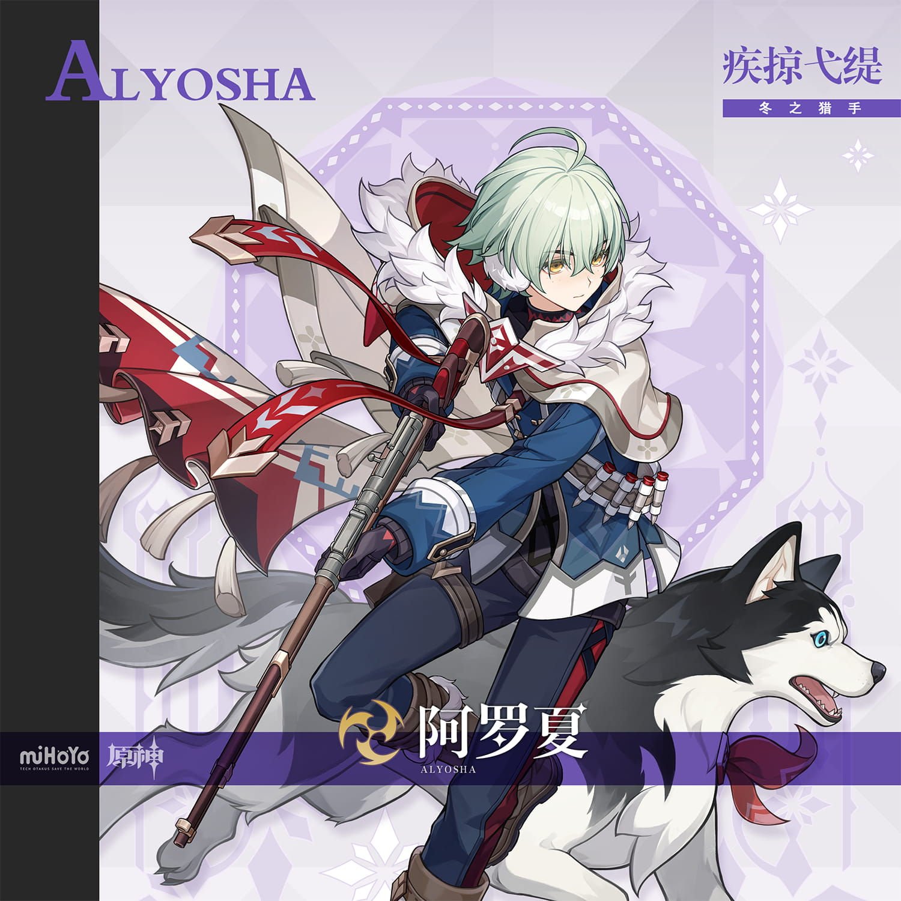
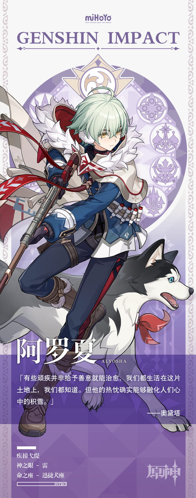

# 阿罗夏 Alyosha — 2026.08.07
> 视频类型：A · 角色单人壁纸合集
> 角色来源：原神 7.0 至冬国 · 四星雷元素长柄武器
> 身份：凝露镇职业猎手 / 至冬雪原向导
> 称号：疾掠弋缇 · 冬之猎手
> 命之座：迅捷犬座
> 设计参考：俄罗斯西伯利亚猎人、哈士奇雪橇犬文化
> 热点背景：7.0「无神怜爱的雪国」版本8月12日上线（距今5天），阿罗夏为至冬首批登场四星角色，8月5日官方刚发布角色介绍及技能演示PV，社区讨论热度极高；阿罗夏可通过推进魔神任务免费获取，玩家关注度持续攀升
> 今日特殊：至冬版本倒计时5天，预热期最后冲刺

# 必需

Refer to the attached reference image (Figure 1). Generate a similar style image of Alyosha from Genshin Impact sitting on a concrete block in front of a bold graffiti wall with a calm, quietly confident expression, looking at the camera with steady amber eyes. His black-and-white husky companion lies at his feet, tongue out, looking alert. Alyosha is wearing modern street-fashion: a dark navy oversized bomber jacket with white faux-fur collar and red geometric-pattern patches on the sleeves, paired with charcoal cargo pants, brown leather combat boots, and white fingerless gloves with red accent straps. Keep his recognizable features: short fluffy mint-green hair with a small green ahoge on top, golden-amber eyes, youthful face with a calm determined expression. The graffiti wall behind him should feature purple, navy, and silver lightning-bolt motifs, snowflake tags, and stylized wolf/husky silhouettes. His hunting rifle rests against the wall beside him. 16:9 2K wallpaper format. perfect hands, five fingers on each hand, anatomically correct hands, well-defined fingers, natural hand pose, hands resting on knees casually.

Negative Prompt: low quality, worst quality, blurry, pixelated, bad anatomy, bad hands, extra fingers, fewer fingers, missing fingers, fused fingers, webbed fingers, merged fingers, overlapping fingers, deformed fingers, mutated fingers, six fingers, four fingers, three fingers, more than five fingers, less than five fingers, disfigured hands, poorly drawn hands, bad hand anatomy, asymmetrical hands, broken fingers, claw hands, blurry hands, indistinct fingers, smeared hands, extra limbs, chibi, childish, wrong hair color, wrong eye color, female character, long hair, cheerful smile, warm tropical setting, fire effects, text, watermark, logo, signature.

# 人物设定

## 1 — 凝露镇晨雪狩猎（至冬日常）

Positive Prompt:
16:9 2K wallpaper, Alyosha from Genshin Impact, highly detailed anime-style illustration, polished game-art quality, cinematic composition, atmospheric winter landscape, early morning golden light through snowfall.

Depict Alyosha crouched low in a hunter's stalking position in the snowy wilderness outside Condensed Dew Town (凝露镇) in Snezhnaya, early morning. He holds his long hunting rifle — a wooden-stocked polearm-gun with red ribbon streamers — angled forward, one eye closed as he aims at unseen prey in the distance. His black-and-white husky companion crouches beside him, ears pricked forward, body tense and ready to spring. Alyosha's expression is intensely focused, calm, and professional — the face of a seasoned young hunter who has done this a thousand times.

Keep his canonical design: short fluffy mint-green hair with a small green ahoge on top, golden-amber eyes with sharp focused gaze, youthful face with slight stubble of cold-reddened cheeks, white fur-collared cape over dark navy military-style hunting jacket with red geometric trim and red ribbon streamers flowing from the weapon, white fingerless combat gloves with red strap accents and ammunition bands on the right wrist, white waist armor apron over dark navy pants, brown leather hunting boots. The Electro Vision glows faintly purple at his waist.

The background is a vast Snezhnayan snow-covered pine forest at dawn: towering dark evergreen trees heavy with fresh snow, a pale golden sun just cresting the horizon casting long blue shadows across untouched snowfields, mist rising from a frozen stream in the middle distance. Animal tracks (deer or elk) lead across the snow in front of Alyosha, telling the story of the hunt. Light snow falls gently. The atmosphere should feel crisp, silent, and primal.

Low-angle composition from ground level, looking slightly up at Alyosha and his husky in the foreground, with the vast snowy forest stretching behind them. Emphasis on the bond between hunter and hound.

perfect hands, five fingers on each hand, anatomically correct hands, well-defined fingers, hands gripping rifle stock naturally.

Negative Prompt:
low quality, worst quality, blurry, bad anatomy, bad hands, extra fingers, fewer fingers, missing fingers, fused fingers, webbed fingers, merged fingers, overlapping fingers, deformed fingers, mutated fingers, six fingers, four fingers, three fingers, more than five fingers, less than five fingers, disfigured hands, poorly drawn hands, bad hand anatomy, asymmetrical hands, broken fingers, claw hands, blurry hands, indistinct fingers, smeared hands, extra limbs, incorrect character, wrong hair color, wrong eye color, female character, long hair, missing rifle, missing dog, summer scenery, green grass, flowers, chibi style, bright cheerful mood, text, watermark, logo.

## 2 — 暴风雪中的归途（极端天气）

Positive Prompt:
16:9 2K wallpaper, Alyosha from Genshin Impact, highly detailed anime-style illustration, polished game-art quality, dramatic survival atmosphere, blizzard conditions, harsh cold environment, emotional storytelling.

Depict Alyosha trudging through a violent Snezhnayan blizzard, carrying a large game animal (elk) slung across his shoulders. His husky walks steadily beside him, head lowered against the driving snow, a leather harness connecting it to a small supply sled behind them. Alyosha leans forward into the wind, his white fur cape whipping violently behind him, red ribbon streamers from his weapon snapping like flags in the gale. His hunting rifle is strapped across his back. His expression is grim, determined, and unwavering — eyes narrowed against the stinging snow, jaw set. This is a man whose true enemy is the cold itself.

His hair and fur collar are frosted with ice crystals. His cheeks and nose are flushed red from the bitter cold. His gloves are caked with snow. Despite the hellish conditions, there is a quiet warmth in his eyes — he is bringing food home to his town. The elk on his shoulders represents hope for the people of Condensed Dew Town.

The background is pure white chaos: a howling blizzard with near-zero visibility, only the faintest outlines of distant pine trees visible through the wall of snow. The sky is a uniform dark grey-white. Wind-driven snow creates horizontal streaks across the frame. The only warmth in the entire image is the faint purple glow of Alyosha's Electro Vision cutting through the whiteout.

Frontal composition with Alyosha walking directly toward the viewer, slightly off-center to the left, his husky at the right. The blizzard fills the entire background. The mood is heroic, solitary, and deeply human.

perfect hands, five fingers on each hand, anatomically correct hands, hands gripping elk legs over shoulders naturally.

Negative Prompt:
low quality, blurry, bad anatomy, bad hands, extra fingers, fewer fingers, missing fingers, fused fingers, webbed fingers, merged fingers, overlapping fingers, deformed fingers, mutated fingers, six fingers, four fingers, disfigured hands, poorly drawn hands, bad hand anatomy, broken fingers, blurry hands, indistinct fingers, smeared hands, extra limbs, calm weather, sunshine, clear sky, warm colors, indoor scene, multiple characters besides dog, cheerful expression, summer clothing, text, watermark.

## 3 — 雷电猎场（元素技能释放）

Positive Prompt:
16:9 2K wallpaper, Alyosha from Genshin Impact, highly detailed anime-style illustration, dynamic action composition, dramatic Electro elemental effects, polished game-art quality, epic battle scene, night combat.

Depict Alyosha in the heat of battle at night, unleashing his Electro elemental skill. He thrusts his hunting rifle forward like a spear, the weapon tip crackling with intense purple-white Electro energy. From beside him, his husky leaps forward aggressively, its body surrounded by a crackling Electro aura — this is the taunt-summoning skill where the hound draws enemy attention. Purple lightning bolts arc between Alyosha's weapon and the dog, creating a devastating electric field that surrounds them.

Alyosha's expression is fierce and battle-ready, a sharp contrast to his usually calm demeanor — teeth slightly bared, amber eyes blazing with intensity. His mint-green hair stands on end slightly from the static charge. His red ribbon streamers glow with absorbed Electro energy, floating upward defying gravity. The white fur of his cape crackles with purple static sparks.

The environment is a dark rocky canyon in Snezhnaya at night, with snow-covered cliff walls on both sides. Multiple Fatui enemies or monsters are visible in the background, recoiling from the Electro shockwave. The ground around Alyosha is a web of branching purple lightning spreading outward in all directions, melting the snow in fractal patterns. The sky above is dark with aurora borealis providing eerie green backlighting.

Dynamic diagonal composition with Alyosha lunging forward from left to right, weapon extended, Electro energy radiating outward from the point of impact. High contrast between the dark environment and the brilliant purple-white Electro effects.

perfect hands, five fingers on each hand, anatomically correct hands, hands gripping polearm shaft firmly.

Negative Prompt:
low quality, blurry, bad anatomy, bad hands, extra fingers, fewer fingers, missing fingers, fused fingers, webbed fingers, merged fingers, overlapping fingers, deformed fingers, mutated fingers, six fingers, four fingers, disfigured hands, poorly drawn hands, bad hand anatomy, broken fingers, blurry hands, indistinct fingers, smeared hands, extra limbs, stiff pose, weak effects, flat lighting, daytime, indoor scene, peaceful mood, missing weapon, wrong element color, fire effects, Pyro, chibi, text, watermark.

## 4 — 篝火营地（温暖日常·反差萌）

Positive Prompt:
16:9 2K wallpaper, Alyosha from Genshin Impact, highly detailed anime-style illustration, soft warm firelight, cozy camping atmosphere, tender slice-of-life mood, polished character art, emotional contrast.

Depict Alyosha in a rare moment of rest at a campfire in the Snezhnayan wilderness at night. He sits on a fallen log beside a crackling campfire, his hunting rifle laid across the log behind him. His white fur cape is draped over the log as a makeshift blanket. He holds a steaming bowl of stew with both hands, blowing gently on it, his usually focused eyes now soft and content. His husky is curled up at his feet, sleeping peacefully with its nose tucked under its tail, the firelight dancing on its black-and-white fur.

Alyosha has removed his gloves, revealing calloused but gentle hands. His mint-green hair is slightly disheveled from a long day of hunting. His cheeks are flushed from the fire's warmth after hours in the cold. A faint, rare smile — almost imperceptible — tugs at the corner of his mouth. This is the Alyosha that only the dog ever sees.

Several cleaned game birds hang from a makeshift rack near the fire. His ammunition belt and weapon harness are hung on a nearby branch. Behind the campfire, a small tent made of animal hide is pitched between two snow-heavy pine trees. The stars above are brilliant and countless through a break in the clouds, with the Milky Way visible. The firelight creates a warm orange bubble in the vast cold blue-white darkness of the snowy forest beyond.

Medium shot composition with Alyosha and the campfire as the warm center, the cold blue snowy wilderness forming a contrasting frame around the edges. Warm-cool color contrast is key.

perfect hands, five fingers on each hand, anatomically correct hands, well-defined fingers, hands cupping bowl naturally.

Negative Prompt:
low quality, blurry, bad anatomy, bad hands, extra fingers, fewer fingers, missing fingers, fused fingers, webbed fingers, merged fingers, overlapping fingers, deformed fingers, mutated fingers, six fingers, four fingers, disfigured hands, poorly drawn hands, bad hand anatomy, broken fingers, blurry hands, indistinct fingers, smeared hands, extra limbs, combat scene, weapon drawn, aggressive expression, harsh lighting, daytime, indoor room, modern building, multiple characters, revealing clothing, text, watermark.

## 5 — 赛博至冬·猎人改造（现代风·赛博朋克）

Positive Prompt:
16:9 2K wallpaper, Alyosha from Genshin Impact, highly detailed anime-style illustration, cyberpunk aesthetic, neon-lit urban atmosphere, polished character art, stylish and edgy.

Reimagine Alyosha in a cyberpunk Snezhnaya setting. He stands on a rain-slicked rooftop overlooking a neon-lit industrial district at night, one boot propped on a ventilation unit, his cybernetically-modified hunting rifle resting on his raised knee. His husky companion sits beside him, now fitted with a sleek matte-black cybernetic harness with glowing purple LED strips along its spine and a holographic HUD visor over one eye.

Alyosha wears a modernized version of his outfit: a dark navy tactical jacket with integrated heating coils glowing faint orange along the seams, his signature white fur collar now a synthetic fiber that shifts between white and holographic purple, charcoal-black cargo pants with armored knee pads, heavy-duty combat boots with mag-lock soles. His fingerless gloves are upgraded with cybernetic augmentations — thin purple circuitry lines running across the back of each hand. His Electro Vision is reimagined as a glowing purple implant at his temple. His mint-green hair has a subtle neon purple underlighting effect.

His expression is cool, watchful, and dangerous — a bounty hunter surveying his next target. His amber eyes have a faint cybernetic glow.

The background features a dense cyberpunk cityscape: massive dark buildings with glowing purple and white neon signs in Cyrillic script, holographic wanted-posters flickering on building walls, steam rising from industrial vents, snow mixing with neon-tinted rain. Distant lightning crackles between the buildings — natural Electro energy bleeding into the urban environment.

Cinematic wide composition with Alyosha on the right third of the frame, the sprawling cyberpunk city visible behind and below him. Purple-navy color palette with warm orange accent neons.

perfect hands, five fingers on each hand, anatomically correct hands, well-defined fingers, hand resting on rifle stock naturally.

Negative Prompt:
low quality, blurry, bad anatomy, bad hands, extra fingers, fewer fingers, missing fingers, fused fingers, webbed fingers, merged fingers, overlapping fingers, deformed fingers, mutated fingers, six fingers, four fingers, disfigured hands, poorly drawn hands, bad hand anatomy, broken fingers, blurry hands, indistinct fingers, smeared hands, extra limbs, warm tropical setting, bright sunshine, cheerful expression, cute outfit, fantasy medieval, fire effects, Japanese aesthetic, female character, text, watermark.

## 6 — 至冬漫游手册·雪原冒险（版本预热活动联动）

Positive Prompt:
16:9 2K wallpaper, Alyosha from Genshin Impact, highly detailed anime-style illustration, adventure discovery atmosphere, vast scenic landscape, golden hour lighting, polished game-art quality, exploratory wonder.

Depict Alyosha standing at the edge of a dramatic cliff overlooking the vast landscape of Snezhnaya, acting as the Traveler's guide into this new nation. He stands with one hand shading his eyes against the low golden sun, looking out over the breathtaking vista before them. His husky sits at the cliff edge beside him, ears up, tail wagging gently. Alyosha's rifle is slung casually across his back. His red ribbon streamers flutter gently in the mountain breeze.

His expression shows quiet pride mixed with a hint of warmth — he is showing the Traveler his homeland for the first time, and despite its harshness, he loves this land. His amber eyes reflect the golden sunlight.

The landscape below is magnificent: a sweeping valley of snow-covered terrain with a frozen river winding through it, clusters of Snezhnayan villages with warm lights glowing in windows (Condensed Dew Town visible in the middle distance), dark pine forests carpeting the mountainsides, and in the far distance, the massive silhouette of the Zapolyarny Palace (the Tsaritsa's fortress) rising against a dramatic sunset sky of deep orange, pink, and purple. Northern lights begin to appear in the darkening eastern sky. Mountain peaks with eternal snow frame the vista on both sides.

Wide panoramic composition with Alyosha as a relatively small but sharp figure on the left third of the frame, emphasizing the epic scale of the Snezhnayan landscape. The image should make viewers excited to explore this new nation.

perfect hands, five fingers on each hand, anatomically correct hands, hand raised to shade eyes naturally.

Negative Prompt:
low quality, blurry, bad anatomy, bad hands, extra fingers, fewer fingers, missing fingers, fused fingers, webbed fingers, merged fingers, overlapping fingers, deformed fingers, mutated fingers, six fingers, four fingers, disfigured hands, poorly drawn hands, bad hand anatomy, broken fingers, blurry hands, indistinct fingers, smeared hands, extra limbs, indoor scene, flat terrain, tropical landscape, desert, ocean beach, night scene without sunset, multiple named characters, combat pose, text, watermark.

## 7 — 人与犬的默契（情感核心·友谊）

Positive Prompt:
16:9 2K wallpaper, Alyosha from Genshin Impact, highly detailed anime-style illustration, heartwarming emotional atmosphere, soft natural lighting, polished character art, touching bond between human and animal.

Depict a tender close-up moment between Alyosha and his husky companion. They are in a sunlit snow-covered clearing in a pine forest, with dappled golden light filtering through the branches. Alyosha kneels on one knee in the snow, both arms wrapped around his husky's neck in a gentle embrace. The dog's front paws are on Alyosha's shoulders, its tail wagging energetically, its blue eyes bright with joy, tongue out in a happy pant. Alyosha buries his face partly in the dog's thick fur, eyes closed, with the most genuine, unguarded smile he ever shows — warm, boyish, and full of love.

His mint-green hair is mussed from the dog's enthusiastic greeting. His white fur cape is dusted with snow — he just came home from a hunt. His gloves are tucked into his belt, bare hands visible in the dog's fur, showing calloused but gentle fingers. His weapon is absent, leaned against a tree out of frame. The Electro Vision at his waist glows softly.

The background is dreamy and soft: a sun-dappled winter forest clearing with golden light creating bokeh effects through falling snowflakes. A small wooden cabin (his home) is partially visible behind the trees, smoke rising from its chimney. Snow-laden branches frame the top of the image. The overall mood should evoke warmth, loyalty, and the simple happiness of coming home.

Close-to-medium composition, slightly elevated angle looking down at Alyosha kneeling with the dog, emphasizing intimacy and warmth. Soft focus on the background, sharp detail on their faces and the embrace.

perfect hands, five fingers on each hand, anatomically correct hands, well-defined fingers, hands buried in dog's fur naturally.

Negative Prompt:
low quality, blurry, bad anatomy, bad hands, extra fingers, fewer fingers, missing fingers, fused fingers, webbed fingers, merged fingers, overlapping fingers, deformed fingers, mutated fingers, six fingers, four fingers, disfigured hands, poorly drawn hands, bad hand anatomy, broken fingers, blurry hands, indistinct fingers, smeared hands, extra limbs, cold expression, aggressive pose, combat scene, weapon in hand, dark atmosphere, night, indoor, multiple human characters, romantic scene, text, watermark.

## 8 — 至冬版本倒计时纪念海报风

Positive Prompt:
16:9 2K wallpaper, Alyosha from Genshin Impact, highly detailed anime-style illustration, official character portrait quality, elegant key-visual composition, premium promotional art feel, version countdown celebration.

Create a solo character key visual of Alyosha in the style of an official Genshin Impact promotional splash art. He stands in a dynamic three-quarter pose, body angled slightly to the right with his hunting rifle held diagonally across his chest — the weapon's red ribbon streamers flowing upward dramatically. His left hand grips the rifle shaft firmly while his right hand is raised with index and middle fingers extended in a casual two-finger salute near his temple. His husky sits at his feet in an alert pose, looking directly at the viewer with its striking blue eyes. Alyosha looks at the viewer with a confident, slightly cocky half-smile — the charming young hunter about to embark on a great adventure with the Traveler.

Full canonical design with maximum detail: short fluffy mint-green hair with green ahoge, golden-amber eyes with warm confident gaze, youthful face, white fur-collared cape with red geometric trim, dark navy military-style hunting jacket, red geometric-patterned belt with flowing red ribbon streamers, white fingerless combat gloves with red strap accents and ammunition bands, white waist armor apron, dark navy pants with red accent lines, brown leather hunting boots. Electro Vision glowing vivid purple at his waist.

The background should be an artistic composition: a large ornate snowflake mandala pattern in purple and silver behind him, with the seven nation emblems of Teyvat arranged in a circle (the Snezhnaya emblem highlighted and largest). Electro lightning arcs between the emblems. Stylized pine trees and mountain silhouettes frame the lower portion. A gradient background transitioning from dark navy at edges to lighter purple-silver at center. Floating Electro particles and snowflakes scattered throughout.

Centered symmetrical composition with Alyosha as the absolute focal point, full body visible including the husky, sharp detailed rendering. The overall feel should be adventurous, inviting, and heroic.

perfect hands, five fingers on each hand, anatomically correct hands, well-defined fingers, fingers in two-finger salute pose clearly defined.

Negative Prompt:
low quality, blurry, bad anatomy, bad hands, extra fingers, fewer fingers, missing fingers, fused fingers, webbed fingers, merged fingers, overlapping fingers, deformed fingers, mutated fingers, six fingers, four fingers, disfigured hands, poorly drawn hands, bad hand anatomy, broken fingers, blurry hands, indistinct fingers, smeared hands, extra limbs, wrong character, incorrect hair color, missing dog, modern clothing, casual outfit, action battle scene, multiple human characters, cluttered background, dark gritty atmosphere, female character, text, watermark, signature.

# 参考图

## 9（参考立绘·动态战斗场景）

Refer to the attached splash art of Alyosha showing him in a dynamic forward-leaning action pose with his hunting rifle and husky companion. Generate a dramatic 16:9 2K wallpaper expanding this composition into a full battle scene. Alyosha charges across a frozen lake surface, his husky running alongside him. The ice beneath their feet cracks with each step, purple Electro energy arcing through the fracture lines. His hunting rifle is thrust forward, its tip trailing a brilliant bolt of purple lightning that strikes toward a massive Cryo Regisvine emerging from the frozen lake ahead. His white fur cape and red ribbon streamers trail behind him in the motion blur of his sprint. The frozen lake reflects the purple Electro lightning and the dark stormy sky above. Wind-driven snow creates motion streaks across the frame. His expression is fiercely determined, amber eyes locked on the target. The husky's blue eyes blaze with battle excitement. Dynamic diagonal composition with strong left-to-right motion, Alyosha at the center-left charging toward the monster at the right. Epic, cinematic, high-energy action shot.

perfect hands, five fingers on each hand, anatomically correct hands, hands gripping rifle naturally in combat stance.

Negative Prompt: low quality, blurry, bad anatomy, bad hands, extra fingers, fewer fingers, missing fingers, fused fingers, webbed fingers, merged fingers, overlapping fingers, deformed fingers, mutated fingers, six fingers, four fingers, disfigured hands, poorly drawn hands, bad hand anatomy, broken fingers, blurry hands, indistinct fingers, smeared hands, extra limbs, stiff pose, flat background, indoor scene, peaceful mood, chibi, wrong outfit, missing weapon, missing dog, text, watermark.

## 10（参考立绘·手机竖屏壁纸）

Refer to the attached gacha art of Alyosha showing him in his full character design with his husky companion. Resize and adapt this image composition into a 9:16 2K resolution mobile wallpaper format. Expand the background upward and downward as needed — extend the ornate snowflake mandala pattern and nation emblems above his head, and show his full hunting boots and the husky's full body including tail below. Maintain the same dynamic pose, art style, color palette (purple, navy, silver, mint-green), and level of detail. The character and his husky should be centered with comfortable spacing on all sides for mobile screen use. Add subtle Electro particle effects and floating snowflakes to fill the expanded vertical space.

Negative Prompt: low quality, blurry, cropped, bad anatomy, bad hands, extra fingers, fewer fingers, missing fingers, fused fingers, deformed fingers, poorly drawn hands, wrong character, different art style, different color palette, different pose, missing dog, female character, text, watermark.

# 跨领域参考图

## 11（参考西伯利亚猎人摄影·真实冬季狩猎氛围融合）

Positive Prompt:
16:9 2K wallpaper, Alyosha from Genshin Impact, highly detailed illustration blending anime character design with documentary photography atmosphere, cold blue-white color palette with warm amber accent lighting, cinematic photographic depth of field, raw survival mood.

Imagine a professional wildlife photography scene of a real Siberian hunter and his husky in the Russian taiga. Now replace the hunter with Alyosha while keeping the documentary realism of the photograph's lighting, composition, and atmosphere. Alyosha crouches behind a snow-covered fallen tree trunk, peering through the scope of his hunting rifle at distant prey. His husky lies flat beside him in a trained hunting position, completely still, ears forward. Both are dusted with fresh snow, having been waiting motionless for hours.

Crucially, blend two styles: Alyosha himself should retain his anime character design clarity (clean face, distinctive mint-green hair, amber eyes, his exact outfit), but the surrounding environment should be rendered with photographic realism — the texture of bark, the crystalline structure of individual snowflakes on his fur collar, the way cold breath fogs in the freezing air, the natural variation of light filtering through dense pine canopy. The lighting should match real winter forest photography: flat overcast illumination with occasional shafts of low-angle golden light breaking through the trees.

Add Alyosha's unique element: faint purple Electro energy seeps from his Vision into the snow around him, creating tiny geometric frost patterns that are visually fascinating but functionally irrelevant to the hunt — a small magical detail in an otherwise grounded, realistic scene.

Wide composition with shallow depth of field: Alyosha and his husky are razor-sharp in the foreground, while the snowy forest melts into a soft, atmospheric blur behind them. The mood should feel authentic, patient, and deeply connected to nature.

perfect hands, five fingers on each hand, anatomically correct hands, well-defined fingers, hand on rifle stock and trigger guard naturally.

Negative Prompt:
low quality, blurry, bad anatomy, bad hands, extra fingers, fewer fingers, missing fingers, fused fingers, webbed fingers, merged fingers, overlapping fingers, deformed fingers, mutated fingers, six fingers, four fingers, disfigured hands, poorly drawn hands, bad hand anatomy, broken fingers, blurry hands, indistinct fingers, smeared hands, extra limbs, fully cartoon, fully flat anime, no photographic texture, indoor scene, summer setting, tropical, bright colors, neon, cyberpunk, combat pose, monsters, flashy effects, female character, text, watermark.

## 12（参考闪电风暴摄影·雷元素自然力量融合）

Positive Prompt:
16:9 2K wallpaper, Alyosha from Genshin Impact, highly detailed illustration blending anime character design with dramatic nature photography, deep blue-purple color scheme, epic natural phenomenon atmosphere, awe-inspiring scale.

Imagine a world-class nature photograph of a lightning superstorm over a frozen tundra landscape. Now place Alyosha at the center of this natural spectacle, standing atop a rocky outcrop with his arms slightly spread and his hunting rifle planted vertically in the snow beside him like a lightning rod. His husky howls at the sky beside him. The storm above is magnificent: dozens of purple-white lightning bolts fracture the dark sky in branching patterns, each bolt reflected perfectly in the mirror-smooth frozen lake below them. The lightning is not threatening him — it is responding to him, to his Electro Vision, which blazes with intense purple light. His hair floats upward with static electricity. His red ribbon streamers rise and crackle with absorbed atmospheric energy.

Blend two elements: the raw, awe-inspiring power of real thunderstorm photography (the way lightning illuminates cloud layers, the scale of bolts against landscape, the mirror reflections on water) with Alyosha's anime character design. He should be the human focal point connecting earth and sky — a conduit between the natural Electro energy of the storm and the frozen earth below. His outfit remains his canonical design, but every surface crackles with purple static — his fur collar stands on end, his metal ammunition bands glow, his boot buckles spark.

The landscape matches real Arctic tundra photography: low scrubby vegetation poking through snow, flat terrain stretching to distant mountains, a vast frozen lake in the foreground acting as a mirror for the sky's violence. The only artificial light is the purple glow of Alyosha's Vision and the electric arcs connecting him to the storm.

Dramatic centered composition with Alyosha standing small but luminous at the center, the massive storm above and its reflection below creating a vertical symmetry of chaos with him as the calm axis.

perfect hands, five fingers on each hand, anatomically correct hands, fingers slightly spread, palms open and facing upward, natural hand pose.

Negative Prompt:
low quality, blurry, bad anatomy, bad hands, extra fingers, fewer fingers, missing fingers, fused fingers, webbed fingers, merged fingers, overlapping fingers, deformed fingers, mutated fingers, six fingers, four fingers, disfigured hands, poorly drawn hands, bad hand anatomy, broken fingers, blurry hands, indistinct fingers, smeared hands, extra limbs, fully photorealistic face, fully 3D rendered, flat digital art, sunny clear sky, indoor, warm colors, fire effects, tropical, chibi, multiple characters, wrong element, Cryo effects, Pyro effects, female character, text, watermark.
