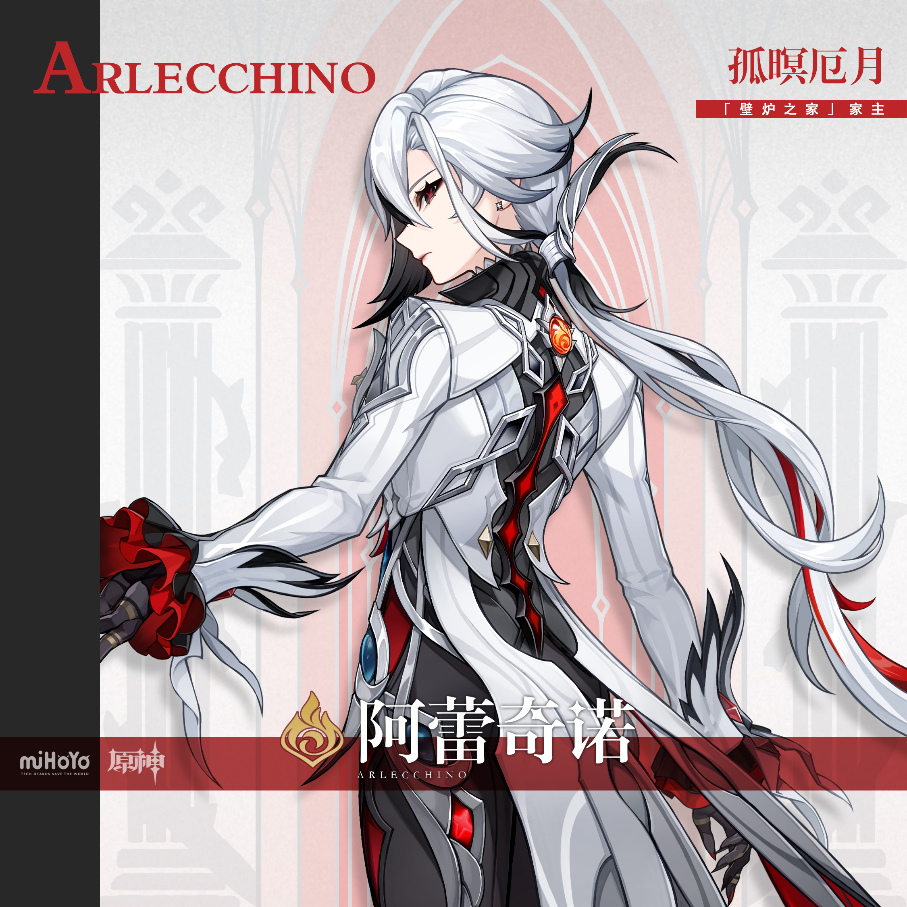
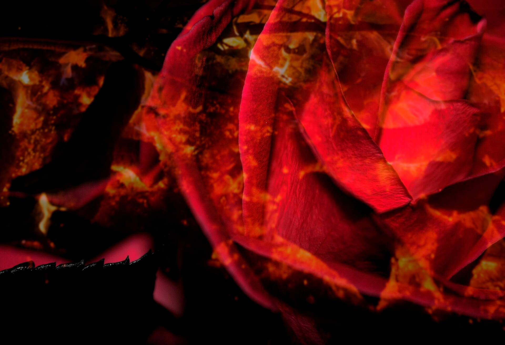
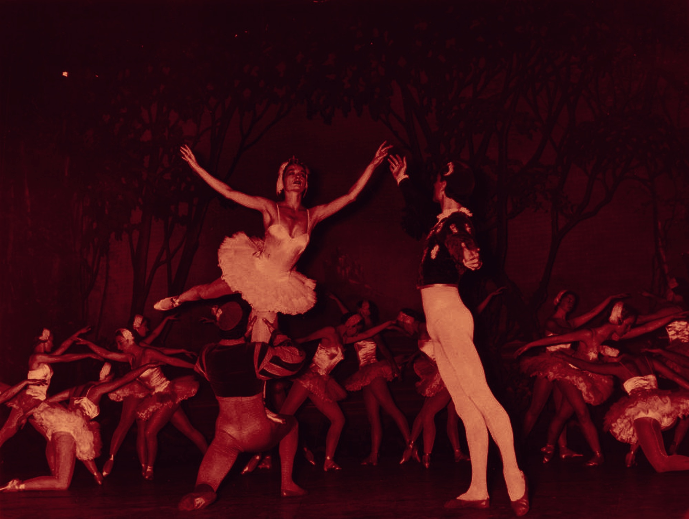

# 阿蕾奇诺 Arlecchino — 2026.08.08
> 视频类型：A · 角色单人壁纸合集
> 角色来源：原神 7.0 至冬国 · 五星火元素长柄武器
> 身份：愚人众执行官第四席「仆人」/ 壁炉之家家主「父亲」
> 本名：佩露薇利·雪奈茨芙娜
> 称号：孤嗫厄月 · 壁炉之家家主
> 命之座：赤月之形
> 设计参考：意大利即兴喜剧（Commedia dell'arte）中的丑角 Arlecchino、坎瑞亚赤月王朝遗族、东欧/俄罗斯贵族
> 热点背景：7.0「无神怜爱的雪国」版本8月12日上线（距今4天），阿蕾奇诺作为7.0上半卡池复刻角色重磅回归，同时在至冬版本剧情中担任旅行者向导角色；作为曾经的T0火C，7.0复刻引发社区大量"值不值得抽"讨论；六周年庆版本预热冲刺期，角色热度极高
> 今日特殊：至冬版本倒计时4天，7.0上半卡池复刻角色

# 必需

Refer to the attached reference image (Figure 1). Generate a similar style image of Arlecchino from Genshin Impact leaning against a graffiti-covered concrete wall in a dark alleyway, one hand raised to her face in a "shh" gesture with her index finger over her lips, the other hand casually holding a long black umbrella resting on her shoulder. Her pose is confident, languid, and subtly threatening — a predator at rest. She wears modernized streetwear: a long white double-breasted trench coat with black lapels and red inner lining, unbuttoned to reveal a fitted charcoal vest over a black turtleneck, slim black tailored trousers, and pointed black leather boots with silver buckle accents. A single red rose is tucked into her breast pocket. Keep her recognizable features: long straight ash-white hair with black tips at the bangs and red-gradient streaks at the ends, tied in a loose low ponytail with a feather-shaped silver hairpin, distinctive X-shaped red pupils set in dark irises, a small cross-shaped beauty mark beneath her left eye, sharp aristocratic features with an unsettling half-smile. The graffiti wall behind her features crimson and black abstract patterns reminiscent of flames and theatrical masks, with faint Commedia dell'arte harlequin diamond motifs. Dim red neon light from an unseen sign casts dramatic shadows. 16:9 2K wallpaper format. perfect hands, five fingers on each hand, anatomically correct hands, well-defined fingers, natural hand pose, index finger pressed to lips elegantly.

Negative Prompt: low quality, worst quality, blurry, pixelated, bad anatomy, bad hands, extra fingers, fewer fingers, missing fingers, fused fingers, webbed fingers, merged fingers, overlapping fingers, deformed fingers, mutated fingers, six fingers, four fingers, three fingers, more than five fingers, less than five fingers, disfigured hands, poorly drawn hands, bad hand anatomy, asymmetrical hands, broken fingers, claw hands, blurry hands, indistinct fingers, smeared hands, extra limbs, chibi, childish, wrong hair color, bright green hair, male character, cheerful sunny setting, ice effects, Cryo element, text, watermark, logo, signature.

# 人物设定

## 1 — 壁炉之家的父亲（温暖与威压）

Positive Prompt:
16:9 2K wallpaper, Arlecchino from Genshin Impact, highly detailed anime-style illustration, polished game-art quality, warm interior lighting with cold exterior contrast, emotional storytelling with hidden tenderness.

Depict Arlecchino standing in the grand hall of the Hearth (壁炉之家), her orphanage in Snezhnaya. She stands before a massive ornate stone fireplace with roaring flames, her back to the viewer, one hand resting on the carved mantelpiece. She has turned her head to look over her shoulder at the viewer — at one of her "children" who has just entered the room. Her expression is complex: outwardly stern and composed, but with a barely perceptible softening around her distinctive X-shaped red pupils, the tiniest warmth visible only to those who know her well.

Full canonical design with maximum detail: long ash-white hair flowing past her waist, the front bangs jet black with pointed tips framing her face, the lower lengths transitioning from black to deep red gradient at the ends, bound in a loose ponytail with a silver feather-shaped hairpin. Her iconic X-shaped crimson pupils sit within dark irises, a small cross-shaped mark beneath her left eye. She wears her signature grey-white tailcoat with charcoal-grey inner vest, red tie accent running down the center, a flame-shaped orange-red Pyro Vision brooch at her collar, a blue gem buckle at her waist. Black fitted trousers, dark gloves — her left hand naturally at her side, fingers relaxed. Her white tailcoat drapes like a cape, revealing its dark inner lining and red trim along the edges.

The fireplace behind her is enormous, carved with Snezhnayan motifs — bears, snowflakes, and subtle Fatui insignias. The fire casts warm orange light across the dark stone hall, creating long dramatic shadows. On the mantelpiece sit framed photographs of children (faces obscured), a vase of red roses, and a worn children's storybook. Through tall arched windows on either side, a Snezhnayan blizzard rages outside — white snow against blue-black night. The contrast between the warm hearth and the cold world beyond is the heart of this image.

Medium-wide composition with Arlecchino at the center, the massive fireplace framing her figure. The warm-cool color contrast should be dramatic: orange firelight on her face and hair, cold blue moonlight from the windows on the floor behind her.

perfect hands, five fingers on each hand, anatomically correct hands, well-defined fingers, hand resting on mantelpiece naturally.

Negative Prompt:
low quality, worst quality, blurry, bad anatomy, bad hands, extra fingers, fewer fingers, missing fingers, fused fingers, webbed fingers, merged fingers, overlapping fingers, deformed fingers, mutated fingers, six fingers, four fingers, three fingers, more than five fingers, less than five fingers, disfigured hands, poorly drawn hands, bad hand anatomy, asymmetrical hands, broken fingers, claw hands, blurry hands, indistinct fingers, smeared hands, extra limbs, incorrect character, wrong hair color, green hair, male character, happy smiling, teeth showing, outdoor battle scene, summer scenery, chibi style, text, watermark, logo.

## 2 — 厄月血火觉醒（元素爆发形态）

Positive Prompt:
16:9 2K wallpaper, Arlecchino from Genshin Impact, highly detailed anime-style illustration, dynamic action composition, dramatic Pyro elemental burst effects, polished game-art quality, epic dark fantasy atmosphere, boss fight visual intensity.

Depict Arlecchino at the peak of her Elemental Burst power — the moment she unleashes her full "Balemoon Bloodfire" (厄月血火). She stands with her body slightly arched backward, arms spread wide, her twin crimson-black scythe-like arm blades extended from both hands — organic weapons that seem to grow from dark energy wrapping around her forearms. Her eyes blaze with intense crimson light, the X-shaped pupils now radiating visible red energy beams. Her hair whips violently upward, the black-to-red gradient tips now fully ignited with dark crimson flames that trail upward like wings of fire.

Behind and around her, massive wing-shaped formations of dark red-black fire erupt outward — not normal orange flames but the cursed Balemoon fire of the Khaenri'ah Royal lineage: deep crimson at the core, fading to black at the edges, with fractal thorn-like patterns within the flame structure. The ground beneath her feet cracks in an X-pattern (her signature "Blood-Debt Directive" mark), glowing molten red through the fractures. Red thorny vines of fire energy crawl outward from the cracks.

Her tailcoat billows dramatically in the updraft of her own fire, revealing the dark red inner lining. The flame-shaped Pyro Vision at her collar blazes white-hot. Her expression is terrifyingly calm — the face of someone who has killed before and will again without hesitation, beautiful and lethal in equal measure.

The environment is a dark Gothic cathedral interior (reminiscent of Fontaine architecture where she was first encountered as a boss), stone pillars cracking from the heat, stained glass windows shattering outward from the shockwave, fragments catching the red firelight mid-air. The ceiling is lost in shadow and smoke.

Dynamic centered composition with Arlecchino as an ascending figure, dark fire wings spreading the full width of the frame, creating a cruciform silhouette. The mood is awe-inspiring, terrifying, and magnificently beautiful.

perfect hands, five fingers on each hand, anatomically correct hands, well-defined fingers, hands gripping scythe-blades with visible tension.

Negative Prompt:
low quality, blurry, bad anatomy, bad hands, extra fingers, fewer fingers, missing fingers, fused fingers, webbed fingers, merged fingers, overlapping fingers, deformed fingers, mutated fingers, six fingers, four fingers, disfigured hands, poorly drawn hands, bad hand anatomy, broken fingers, blurry hands, indistinct fingers, smeared hands, extra limbs, stiff pose, weak effects, flat lighting, bright cheerful colors, outdoor sunny scene, normal orange fire, cute expression, peaceful mood, missing weapons, Cryo ice effects, Electro lightning, chibi, text, watermark.

## 3 — 枫丹之夜·外交暗影（间谍/暗杀者）

Positive Prompt:
16:9 2K wallpaper, Arlecchino from Genshin Impact, highly detailed anime-style illustration, film noir atmosphere, elegant espionage mood, moonlit urban night scene, polished character art with cinematic lighting.

Depict Arlecchino on a moonlit rooftop overlooking the city of Fontaine at night, in her role as a Fatui diplomatic operative and covert intelligence master. She sits on the ornate stone balustrade of a Fontainian palace, one leg crossed elegantly over the other, leaning back on one hand with aristocratic nonchalance. In her other hand she holds a single red rose, twirling it slowly between her black-gloved fingers. Her expression is one of cool amusement — watching the city below like a chess player observing pieces move.

Her ash-white hair flows loosely in the night breeze, the black bangs and red-tipped ends catching the moonlight. Her X-shaped red pupils glow faintly in the darkness — the only truly unsettling detail in an otherwise elegant scene. She wears her full canonical outfit, but it takes on a more sinister quality in this context: the grey-white tailcoat resembles an aristocrat's evening wear, the dark vest and red tie suggest old-money refinement, the gloves imply hands that must never leave fingerprints.

Below her stretches the Fontaine cityscape at night: Art Nouveau buildings with warm golden lights in windows, the grand opera house dome in the middle distance, the Hydro Archon's palace gleaming white under moonlight, canals reflecting starlight. A masquerade ball is visible through the lit windows of a nearby mansion — Arlecchino's next target. Faint mist rises from the canals, giving the city an ethereal quality.

The composition is cinematic: Arlecchino in the right third of the frame, elevated above the city, the vast Fontaine nightscape stretching behind and below her. Cool blue-silver moonlight dominates, with warm amber from the city windows and the faint red glow of her rose and Pyro Vision providing accent colors. The mood is seductive, dangerous, and impossibly stylish.

perfect hands, five fingers on each hand, anatomically correct hands, well-defined fingers, fingers twirling rose stem elegantly.

Negative Prompt:
low quality, blurry, bad anatomy, bad hands, extra fingers, fewer fingers, missing fingers, fused fingers, webbed fingers, merged fingers, overlapping fingers, deformed fingers, mutated fingers, six fingers, four fingers, disfigured hands, poorly drawn hands, bad hand anatomy, broken fingers, blurry hands, indistinct fingers, smeared hands, extra limbs, daytime scene, bright sunlight, combat pose, weapon drawn, aggressive expression, Snezhnayan snow setting, multiple characters, revealing clothing, happy cheerful mood, chibi, text, watermark.

## 4 — 弑母之夜·赤月觉醒（暗黑过去回忆）

Positive Prompt:
16:9 2K wallpaper, Arlecchino from Genshin Impact, highly detailed anime-style illustration, dark Gothic horror atmosphere, blood-red moonlight, emotional trauma narrative, polished game-art quality, haunting and tragic beauty.

Depict a younger Arlecchino (approximately 16-17 years old, slightly shorter, same distinctive features but with a rawer, more vulnerable quality) standing over the fallen figure of the previous "Knave" — Crucabena (face obscured in shadow, only her distinctive ornate mask visible on the floor). The scene is the interior of the Hearth's underground ritual chamber on the night of the full moon. Young Arlecchino holds a single crimson scythe-blade that has just manifested for the first time, dark red fire still dripping from its edge like blood. Her expression is devastated yet resolute — tears streak down her face but her jaw is set with iron determination. Her X-shaped pupils blaze with newly awakened crimson power.

Her appearance at this younger age: ash-white hair shorter than present, reaching mid-back, the black-to-red gradient less pronounced — more raw and unstable. She wears the simple dark uniform of a Hearth child (not yet the aristocratic tailcoat), torn and scorched from the fight. Her hands are bare — no gloves yet — revealing the first dark flame patterns crawling up her forearms from the awakening Balemoon bloodline power. Blood (her own and Crucabena's) stains her clothes and hands.

Above them, visible through a shattered skylight, a massive crimson moon (the Balemoon/厄月) dominates the sky, casting everything in deep red light. The chamber around them is in ruins: broken stone pillars, scattered children's possessions (toys, books, drawings), overturned furniture, scorch marks on the walls. In the doorway behind young Arlecchino, the silhouettes of other Hearth children peek in — witnesses to the end of one era and the beginning of another.

Dramatic vertical composition with the red moon at the top, young Arlecchino standing tall at center, the fallen Crucabena at the bottom. Red moonlight pours down like a spotlight. The mood is tragic, powerful, and pivotal — the birth of the "Father."

perfect hands, five fingers on each hand, anatomically correct hands, well-defined fingers, one hand gripping scythe blade, other hand clenched at side.

Negative Prompt:
low quality, blurry, bad anatomy, bad hands, extra fingers, fewer fingers, missing fingers, fused fingers, webbed fingers, merged fingers, overlapping fingers, deformed fingers, mutated fingers, six fingers, four fingers, disfigured hands, poorly drawn hands, bad hand anatomy, broken fingers, blurry hands, indistinct fingers, smeared hands, extra limbs, adult Arlecchino full outfit, cheerful expression, smiling, bright sunny day, peaceful scene, modern setting, multiple named characters clearly visible, gore excess, chibi, text, watermark.

## 5 — 赛博至冬·暗影外交官（赛博朋克变体）

Positive Prompt:
16:9 2K wallpaper, Arlecchino from Genshin Impact, highly detailed anime-style illustration, cyberpunk aesthetic, neon-noir atmosphere, polished character art, dark futuristic elegance.

Reimagine Arlecchino in a cyberpunk Snezhnaya setting. She walks down a rain-slicked neon-lit street, her reflection mirrored perfectly in the wet asphalt below. She wears a modernized version of her outfit: a long white synthetic-leather trench coat with integrated LED strips that pulse faint red along the seams, a charcoal armored vest with holographic Fatui insignia that flickers in and out, fitted black combat pants with reinforced knee joints, stiletto-heeled boots with magnetic soles. Her signature red tie is replaced by a thin red LED strip running down her chest.

Her gloves are upgraded with cybernetic augmentations — thin crimson circuit lines running across each finger, her fingertips tipped with retractable nano-blades that glint in the neon light. Her Pyro Vision is reimagined as a glowing red implant embedded in her left collarbone, pulsing like a heartbeat. Her ash-white hair has subtle red holographic highlights that shift as she moves. Her X-shaped pupils now feature a visible cybernetic HUD overlay — targeting reticles, data streams, facial recognition readouts of the people she passes.

She holds a black umbrella (her concealed weapon) over one shoulder, rain cascading off its surface. A red digital rose hologram floats above her open palm. Her expression is the same cold, aristocratic calm — technology changes, but she does not.

The cyberpunk street around her is dense with atmosphere: towering dark buildings with massive holographic advertisements in Cyrillic script, steam rising from subway grates, neon signs in red, white, and black reflecting in puddles, distant Fatui surveillance drones with red sensor lights hovering between buildings. The Zapolyarny Palace is reimagined as a massive corporate tower in the far background, its spire piercing the smog layer.

Frontal composition with Arlecchino walking directly toward the viewer, her reflection creating a vertical symmetry in the wet street below. Red and white neon dominate the color palette against deep black shadows.

perfect hands, five fingers on each hand, anatomically correct hands, well-defined fingers, one hand holding umbrella handle, other palm open with hologram above.

Negative Prompt:
low quality, blurry, bad anatomy, bad hands, extra fingers, fewer fingers, missing fingers, fused fingers, webbed fingers, merged fingers, overlapping fingers, deformed fingers, mutated fingers, six fingers, four fingers, disfigured hands, poorly drawn hands, bad hand anatomy, broken fingers, blurry hands, indistinct fingers, smeared hands, extra limbs, medieval fantasy setting, bright sunshine, cheerful expression, cute outfit, green grass, flowers, historical clothing, male character, chibi, text, watermark.

## 6 — 至冬向导·雪国启程（7.0版本角色定位）

Positive Prompt:
16:9 2K wallpaper, Arlecchino from Genshin Impact, highly detailed anime-style illustration, epic landscape panorama, dramatic sky composition, version promotional poster quality, adventure invitation atmosphere.

Depict Arlecchino standing at the entrance gate of Snezhnaya's border fortress, welcoming the Traveler (unseen, from the viewer's perspective) into the nation of the Tsaritsa. She stands with one arm extended in a sweeping gesture toward the vast Snezhnayan landscape beyond the gate, her tailcoat caught by a gust of icy wind, red-tipped hair streaming dramatically to one side. Her expression is that of a gracious but calculating host — a polite smile that never quite reaches her X-shaped eyes, which gleam with hidden agenda.

Full canonical outfit rendered with maximum detail in the golden hour light: the grey-white tailcoat billowing like a theatrical cape, charcoal vest, red tie accent, flame-shaped Pyro Vision brooch catching the sunlight with a warm orange flash, blue waist gem, black trousers, polished boots. Her left hand holds a red rose — her signature — offered toward the viewer as both greeting and challenge.

Beyond the gate stretches the magnificent Snezhnayan landscape: a sweeping vista of snow-covered tundra descending into a valley where the city of Snezhnaya sprawls — a mix of Imperial Russian architecture and Fatui industrial infrastructure, with onion-domed cathedrals alongside smokestacked factories. The Zapolyarny Palace dominates the distant skyline, a massive ice-white fortress wreathed in perpetual snow clouds. A frozen river winds through the valley like a silver ribbon. The sky is dramatic: late afternoon sun breaking through heavy snow clouds, casting god-rays across the landscape, while northern aurora begins to shimmer in the deepening blue of the eastern sky.

Wide panoramic composition with the fortress gate creating a dark frame on both sides, Arlecchino positioned at the right third as the guide figure, and the vast Snezhnayan landscape opening up behind her. The image should evoke both wonder and unease — this beautiful land is also the stronghold of the Fatui.

perfect hands, five fingers on each hand, anatomically correct hands, well-defined fingers, one hand in sweeping gesture, other hand holding rose stem elegantly.

Negative Prompt:
low quality, blurry, bad anatomy, bad hands, extra fingers, fewer fingers, missing fingers, fused fingers, webbed fingers, merged fingers, overlapping fingers, deformed fingers, mutated fingers, six fingers, four fingers, disfigured hands, poorly drawn hands, bad hand anatomy, broken fingers, blurry hands, indistinct fingers, smeared hands, extra limbs, indoor scene, flat terrain, tropical landscape, desert, summer, night scene without sunset, multiple named characters, chibi, combat pose, text, watermark.

## 7 — 红玫瑰与黑手套（角色象征物特写）

Positive Prompt:
16:9 2K wallpaper, Arlecchino from Genshin Impact, highly detailed anime-style illustration, intimate character portrait, dramatic chiaroscuro lighting, artistic symbolism, polished gallery-quality character art.

A close-up artistic portrait of Arlecchino from shoulders up, rendered with exceptional detail. She holds a single red rose close to her face, the petals brushing against her chin, while gazing directly at the viewer with her mesmerizing X-shaped crimson pupils. One eye is partially obscured by the rose — creating an air of mystery and danger. Her expression is an enigmatic half-smile, neither warm nor cold, simultaneously inviting and threatening. This is the face that has negotiated treaties, ordered executions, and tucked orphans into bed.

Her ash-white hair frames her face in soft waves, the black pointed bangs creating sharp geometric contrast against her pale skin. The red-gradient tips of her hair blend with the rose petals, making it hard to tell where hair ends and flower begins. Her cross-shaped beauty mark beneath her left eye is rendered with perfect clarity. Her black-gloved fingers cradle the rose stem — the thorns pressing into the leather but unable to pierce it, a metaphor for her own emotional armor.

The lighting is pure chiaroscuro: a single warm light source from the upper left (firelight, implied), illuminating the right side of her face and the rose in rich amber-red, while the left side falls into deep shadow. Her Pyro Vision at the collar glows softly, providing a secondary red light source from below. The background is pure darkness — black void — making her face and the rose float in isolation like a Renaissance portrait.

Tight close-up composition, face filling roughly 60% of the frame, rose at center. Shallow depth of field: her visible eye and the rose petals razor-sharp, her hair and the background softly blurred. The mood is intimate, unsettling, and achingly beautiful — a villain who could have been a lover, a mother who chose to be a father.

perfect hands, five fingers on each hand, anatomically correct hands, well-defined fingers, black-gloved fingers holding rose stem delicately.

Negative Prompt:
low quality, blurry, bad anatomy, bad hands, extra fingers, fewer fingers, missing fingers, fused fingers, webbed fingers, merged fingers, overlapping fingers, deformed fingers, mutated fingers, six fingers, four fingers, disfigured hands, poorly drawn hands, bad hand anatomy, broken fingers, blurry hands, indistinct fingers, smeared hands, extra limbs, full body shot, action scene, weapon drawn, battle effects, bright flat lighting, outdoor daylight, multiple characters, green eyes, blue eyes, wrong eye design, no X-shaped pupils, male character, chibi, text, watermark.

# 参考图

## 8（参考立绘·元素爆发战斗全景）

Refer to the attached splash art of Arlecchino showing her in a dramatic standing pose surrounded by erupting crimson-black flame wings and thorn-like fire tendrils. Generate a 16:9 2K wallpaper expanding this composition into a full boss battle arena. Arlecchino stands at the center of a shattered Gothic cathedral (her Fontaine boss arena), her twin arm-blade scythes extended, the massive wing-shaped dark fire formations spreading outward to fill the ruined nave. The cathedral's rose window behind her cracks and bleeds red light. Stone pillars fracture and crumble from the heat. The floor is a web of glowing X-shaped fissures spreading outward from where she stands. Her ash-white hair whips upward in the firestorm, black-to-red tips fully ignited. Her X-shaped eyes blaze like red stars. Fallen Fatui soldiers' masks litter the ground around her — she has destroyed her own subordinates who dared betray the Hearth. The atmosphere is apocalyptic, beautiful, and terrifying. Red-black fire dominates the palette with cold stone grey as contrast. Dynamic centered composition with Arlecchino as the eye of the firestorm.

perfect hands, five fingers on each hand, anatomically correct hands, hands gripping scythe arm-blades in combat stance.

Negative Prompt: low quality, blurry, bad anatomy, bad hands, extra fingers, fewer fingers, missing fingers, fused fingers, webbed fingers, merged fingers, overlapping fingers, deformed fingers, mutated fingers, six fingers, four fingers, disfigured hands, poorly drawn hands, bad hand anatomy, broken fingers, blurry hands, indistinct fingers, smeared hands, extra limbs, stiff pose, weak fire effects, outdoor field, sunny day, peaceful expression, chibi, normal orange fire, ice/Cryo effects, text, watermark.

## 9（参考祈愿宣传图·手机竖屏壁纸）

Refer to the attached gacha promotional art of Arlecchino showing her full character design against a rose-tinted cathedral arch background. Resize and adapt this image composition into a 9:16 2K resolution mobile wallpaper format. Expand the background upward to show the full Gothic arch window with rose motifs and Commedia dell'arte mask reliefs, and downward to show her full pointed boots and the floor pattern — an ornate red-and-black diamond harlequin tile pattern. Maintain the same elegant three-quarter pose, art style, color palette (grey-white, charcoal, red, black), and level of detail. The character should be centered with comfortable spacing on all sides for mobile screen use. Add subtle dark fire particle effects and floating crimson rose petals to fill the expanded vertical space. The Pyro Vision brooch and waist gem should glow softly.

Negative Prompt: low quality, blurry, cropped, bad anatomy, bad hands, extra fingers, fewer fingers, missing fingers, fused fingers, deformed fingers, poorly drawn hands, wrong character, different art style, different color palette, different pose, male character, bright green hair, text, watermark.

# 跨领域参考图

## 10（参考燃烧玫瑰暗黑摄影·厄月血火与玫瑰象征融合）

Positive Prompt:
16:9 2K wallpaper, Arlecchino from Genshin Impact, highly detailed illustration blending anime character design with dark fine-art photography atmosphere, deep crimson-black color scheme, burning rose symbolism, gallery exhibition quality.

Imagine a fine-art dark photography series featuring a single burning rose against absolute darkness. Now place Arlecchino within this conceptual space. She stands in a void of pure black, visible only by the light of a single red rose she holds — but this rose is burning with her signature Balemoon fire: dark crimson flames consuming the petals from the edges inward, each petal curling and glowing like an ember, sparks drifting upward like fireflies. The burning rose is the sole light source, casting flickering warm-red illumination on her face, hands, and the front of her white tailcoat, while everything else dissolves into darkness.

Blend two aesthetics: Arlecchino retains her anime character design clarity (her distinctive X-shaped red pupils, ash-white hair with black-red gradient, grey-white tailcoat, cross-shaped beauty mark), but the rose and the fire and the darkness are rendered with photographic realism — the way real fire illuminates in pitch darkness, the way real rose petals curl when burning, the way sparks drift with convection currents. Her black gloves absorb the light, making her hands seem to disappear except where the rose's glow catches finger shapes.

The deeper symbolism: the rose is her love for the Hearth children — genuine but destructive by nature, beautiful but unsustainable, always burning, always being consumed. Her expression as she watches it burn is one of quiet acceptance — not sadness but understanding. She has always known that everything she touches will eventually catch fire.

Tight composition with Arlecchino filling the right two-thirds of the frame, the burning rose held at center, absolute black everywhere else. The only colors are crimson fire, amber ember-glow, white hair, and the faint red of her Pyro Vision.

perfect hands, five fingers on each hand, anatomically correct hands, well-defined fingers, black-gloved fingers cradling burning rose stem.

Negative Prompt:
low quality, blurry, bad anatomy, bad hands, extra fingers, fewer fingers, missing fingers, fused fingers, webbed fingers, merged fingers, overlapping fingers, deformed fingers, mutated fingers, six fingers, four fingers, disfigured hands, poorly drawn hands, bad hand anatomy, broken fingers, blurry hands, indistinct fingers, smeared hands, extra limbs, fully cartoon flat shading, bright colorful background, outdoor daylight, multiple light sources, cheerful mood, normal orange fire, blue ice effects, multiple characters, full body with legs, chibi, text, watermark.

## 11（参考暗黑芭蕾舞台摄影·Commedia dell'arte 戏剧融合）

Positive Prompt:
16:9 2K wallpaper, Arlecchino from Genshin Impact, highly detailed illustration blending anime character design with dramatic theatrical stage photography, deep crimson-gold-black color scheme, operatic grandeur, Commedia dell'arte meets dark ballet atmosphere.

Imagine a dramatic moment from a dark ballet performance — a pas de deux between a masked harlequin and death herself, captured by a theatrical photographer. Now cast Arlecchino as the lead performer on a grand opera stage. She stands center stage in a theatrical adaptation of her battle stance: instead of wielding her scythe arm-blades directly, she holds two long black fans that extend into blade-like points (evoking her weapons), her body in a dramatic arabesque-inspired pose — one leg extended behind her, arms spread wide with fans opened, creating the silhouette of her dark fire wings through the fan shapes.

Blend theatrical staging with her character: Arlecchino's outfit becomes a theatrical costume version of her canonical design — the grey-white tailcoat is now a dramatic full-length stage coat with exaggerated tails that sweep the floor, the red lining fully visible, the vest and tie replaced by a black-and-red diamond-pattern bodice (direct Commedia dell'arte harlequin reference). A half-mask in silver and black covers the right side of her face — the Arlecchino mask from Italian theatre — while her left eye with the cross-shaped beauty mark and X-shaped pupil is fully visible, breaking the theatrical fourth wall.

The stage around her: a grand opera house with tiered balconies visible in deep shadow, a single brilliant spotlight from above creating a cone of warm golden light around her. Red rose petals rain from the flies (the ceiling rigging area) like theatrical snow. Behind her, a massive painted backdrop depicts a burning hearth surrounded by X-shaped symbols. The floor of the stage is polished black, reflecting her figure and the spotlight.

Wide composition capturing the full stage width, Arlecchino at the center of the spotlight cone, the dark auditorium creating a natural frame. The image should feel like a photograph taken during the climactic moment of a tragically beautiful performance.

perfect hands, five fingers on each hand, anatomically correct hands, well-defined fingers, hands gripping fan-blade handles in theatrical pose.

Negative Prompt:
low quality, blurry, bad anatomy, bad hands, extra fingers, fewer fingers, missing fingers, fused fingers, webbed fingers, merged fingers, overlapping fingers, deformed fingers, mutated fingers, six fingers, four fingers, disfigured hands, poorly drawn hands, bad hand anatomy, broken fingers, blurry hands, indistinct fingers, smeared hands, extra limbs, fully photorealistic face, fully 3D rendered, outdoor natural setting, modern casual clothing, bright cheerful colors, warm sunny day, cute expression, Cryo ice effects, male character, multiple performers on stage, chibi, text, watermark.

## 12 — 7.0至冬复刻纪念·版本倒计时海报风

Positive Prompt:
16:9 2K wallpaper, Arlecchino from Genshin Impact, highly detailed anime-style illustration, official character key visual quality, elegant promotional art composition, version countdown celebration poster, premium splash art feel.

Create a solo character key visual of Arlecchino in the style of an official Genshin Impact version promotional poster for her 7.0 Snezhnaya rerun. She stands in a commanding three-quarter pose facing slightly left, her right hand extended forward with fingers spread — the "Blood-Debt Directive" X-mark glowing red on her palm, as if marking the viewer as her next target. Her left hand holds a red rose behind her back, hidden from the viewer but visible to us through the transparent/x-ray artistic effect on the left edge. Her tailcoat billows dramatically as if caught in a rising wind, dark red inner lining fully visible, creating a sweeping cape-like silhouette.

Full canonical design with maximum detail: ash-white hair with black bangs and red-gradient ends flowing dynamically, X-shaped crimson pupils locked onto the viewer with intensity, cross-shaped beauty mark, grey-white tailcoat with every button and seam rendered, charcoal vest, red tie, flame-shaped Pyro Vision blazing at the collar, blue waist gem, black trousers, pointed boots. Everything rendered at the highest possible quality.

The background is an artistic composition: the Snezhnaya nation emblem (a snowflake-and-crown design) rendered large and ornate in silver behind her, surrounded by subtle motifs from her story — red roses, theatrical masks, fireplace flames, X-shaped marks, and children's silhouettes. A gradient background from deep crimson at the edges to smoky black at center. The Fatui emblem appears faintly in the upper corners. Floating crimson sparks, dark fire particles, and rose petals scattered throughout. At the bottom, a decorative banner with Commedia dell'arte diamond patterns frames the composition.

Centered symmetrical composition with Arlecchino as the absolute focal point, full body from head to boots, sharp detailed rendering against the symbolic background. The overall feel should be regal, menacing, and impossibly stylish — worthy of a Harbinger's return.

perfect hands, five fingers on each hand, anatomically correct hands, well-defined fingers, right hand with spread fingers showing X-mark on palm, left hand holding rose behind back.

Negative Prompt:
low quality, blurry, bad anatomy, bad hands, extra fingers, fewer fingers, missing fingers, fused fingers, webbed fingers, merged fingers, overlapping fingers, deformed fingers, mutated fingers, six fingers, four fingers, disfigured hands, poorly drawn hands, bad hand anatomy, broken fingers, blurry hands, indistinct fingers, smeared hands, extra limbs, wrong character, incorrect hair color, green hair, modern casual clothing, battle action scene, multiple characters, cluttered background, dark gritty atmosphere with no elegance, male character, chibi, text, watermark, signature.
