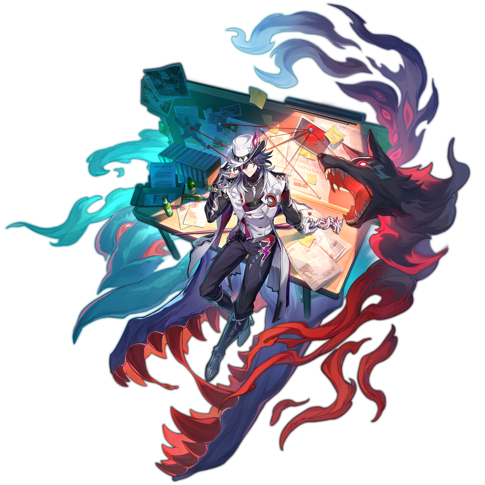

# 不死途 Ashveil — 2026.08.23
> 视频类型：A · 角色单人壁纸合集
> 角色来源：崩坏：星穹铁道 4.5「挥掷千星的筹码」· 五星雷属性巡猎命途
> 身份：不死神探事务所名侦探 / 二相乐园鸽川区侦探
> 称号：随缘营业，硬核推理，全凭直觉却屡破奇案
> 设计参考：黑色电影（Film Noir）侦探、狼人传说、星际怪谈
> 热点背景：崩铁4.5版本将于8月26日（3天后）上线，不死途为下半复刻角色；千星城夏日海滨版本主题预热中，社区讨论热度极高
> 选角理由：官方热点权重最高——4.5版本即将上线，不死途作为下半复刻角色讨论度攀升；角色设定独特——侦探+狼魂+星际 noir 的融合在米哈游角色中极为罕见；覆盖缺口——工作区崩铁角色中完全未覆盖不死途；社区梗丰富——睡冰箱、猴子助手、随缘营业、子安武人配音等话题度高
> 今日特殊：距崩铁4.5版本上线3天，千星城海滨主题预热峰值窗口

# 必需

Refer to the attached reference image (Figure 1). Generate a similar style image of Ashveil from Honkai: Star Rail sitting casually in front of a bold graffiti wall. Ashveil is seated in a relaxed but confident posture, leaning back against the graffiti wall with one knee raised and his other leg stretched out casually, his body language calm, controlled, and slightly provocative. His expression should show cold, disdainful eyes, aloof, sharp, and superior, as if he is silently judging the viewer.

Keep Ashveil's recognizable features: short silver-white hair with a slightly messy, windswept style, sharp dark-grey eyes with a piercing gaze, his signature white detective fedora hat with a dark band and a small red accent pin. Blend his canonical design with a modern edgy streetwear aesthetic: he wears a white cropped sleeveless tank top with a subtle wolf-silhouette print, an open cropped white denim jacket with silver chain details draped loosely off one shoulder, black distressed denim shorts with silver studded belt, and sheer black thigh-high compression stockings with a single silver band at the top. His feet rest in chunky silver platform sneakers with red accent stitching. Layered silver necklaces with a small wolf-tooth pendant, a choker with a tiny detective badge charm, and multiple thin bracelets on one wrist complete the look. Preserve his identity while giving him a fresh urban street-style look.

The graffiti wall behind him should be vivid and layered, full of expressive abstract shapes and energetic street-art textures in silver, black, and deep red tones, with graffiti elements including stylized "ASHVEIL" lettering in sharp angular noir-style script, a large wolf-head silhouette spray-painted beside his head, detective-magnifying-glass motifs, red string-of-clues stencils connecting pinned evidence shapes, and dripping paint effects. A few spray paint cans in silver, black, and crimson sit casually on the ground beside him. The wall surface shows realistic cracked concrete and layered paint texture, with subtle neon light reflections casting a cool silver glow across the scene. Add subtle blue-purple spectral mist drifting lazily in the air and a few red spectral wolf eyes hovering in the shadows, reinforcing his identity without softening the mood.

Use a wide cinematic framing suitable for a 16:9 wallpaper, with Ashveil as the main focal point while still showing enough of the graffiti wall and surrounding urban environment for atmosphere. The mood should feel cool, stylish, intimidating, and mysterious. Highly detailed background, rich shadows, silver and red glowing highlights, sharp focus on Ashveil, and a refined high-end anime illustration look.

Negative Prompt: low quality, worst quality, blurry, pixelated, bad anatomy, bad hands, extra fingers, fewer fingers, missing fingers, fused fingers, webbed fingers, merged fingers, overlapping fingers, deformed fingers, mutated fingers, six fingers, four fingers, three fingers, more than five fingers, less than five fingers, disfigured hands, poorly drawn hands, bad hand anatomy, asymmetrical hands, broken fingers, claw hands, blurry hands, indistinct fingers, smeared hands, extra limbs, chibi, childish, wrong hair color, wrong eye color, missing white fedora, missing detective hat, standing, standing pose, upright posture, singing, open mouth singing, warm smile, gentle smile, cheerful expression, cute expression, adorable, sweet, innocent, game canonical outfit, official costume, long detective coat, fantasy dress, medieval clothing, armor, full gown, formal dress, beach background, ocean background, nature background, indoor background, plain background, minimal background, missing graffiti wall, low detail graffiti, generic graffiti, wrong graffiti colors, wrong streetwear, missing crop top, missing jacket, missing shorts, missing skirt, long dress, full pants, business suit, school uniform, text, watermark, logo, signature.

# 人物设定

## 1 — 不死神探事务所·午夜档案（角色经典场景）

Positive Prompt:
16:9 2K wallpaper, Ashveil from Honkai: Star Rail, highly detailed anime-style illustration, polished game-art quality, cinematic noir atmosphere, dim amber and silver lighting, detective office setting.

Depict Ashveil in his iconic detective office at midnight, sitting behind a massive cluttered wooden desk covered in case files, pinned photographs, scattered newspapers, and a half-empty coffee cup. He leans back in a worn leather office chair, his white-gloved hands clasped behind his head in a relaxed pose, one boot propped casually on the desk corner. His silver-white hair catches the warm amber glow of a single desk lamp. His dark-grey eyes are half-lidded with a lazy, knowing expression — the look of a detective who already knows the answer but is letting the suspect sweat.

Keep his canonical design: short silver-white messy hair, sharp dark-grey eyes, white detective fedora resting on the desk beside him (not worn), white long detective coat draped over the back of his chair, black dress shirt with silver collar pins, black trousers with silver seam details, polished silver boots, white gloves, and his signature silver wolf-head cane leaning against the desk. A red geometric belt buckle gleams at his waist. His expression shows relaxed confidence with a hint of playful menace.

The office is rich with noir atmosphere: floor-to-ceiling bookshelves crammed with case files, a large corkboard behind him covered in red-string-connected photographs and maps (classic detective clue board), a vintage rotary phone, an old refrigerator in the corner (hinting at his habit of sleeping inside), and through the rain-streaked window behind him, the neon lights of the city create bokeh effects. A small monkey figurine wearing a detective hat sits on the desk holding a banana. Blue-purple spectral mist seeps from under the refrigerator door. A massive shadow of a wolf with glowing red eyes is cast on the wall behind him from an unseen light source.

Warm amber desk lamp lighting from the left, deep shadows on the right, silver highlights on his hair and coat. Wide cinematic composition with Ashveil centered, the desk and clue board framing him, the rainy city window providing depth. The mood is mysterious, intellectual, and slightly unsettling.

perfect hands, five fingers on each hand, anatomically correct hands, well-defined fingers, hands clasped behind head naturally.

Negative Prompt:
low quality, blurry, bad anatomy, bad hands, extra fingers, fewer fingers, missing fingers, fused fingers, webbed fingers, merged fingers, overlapping fingers, deformed fingers, mutated fingers, six fingers, four fingers, disfigured hands, poorly drawn hands, bad hand anatomy, broken fingers, blurry hands, indistinct fingers, smeared hands, extra limbs, bright cheerful lighting, outdoor scene, daytime, combat pose, weapon drawn, chibi style, wrong hair color, wrong eye color, female character, long hair, missing white fedora (when worn), missing cane, text, watermark.

## 2 — 千星城海滨·侦探的假期（热点主题特别版·千星城夏日）

Positive Prompt:
16:9 2K wallpaper, Ashveil from Honkai: Star Rail, highly detailed anime-style illustration, polished game-art quality, magnificent summer beach resort atmosphere, cinematic golden-hour lighting, silver and turquoise and coral color palette.

Depict Ashveil taking a rare vacation on the beaches of Astropolis (千星城), the starlit casino-resort city that is the centerpiece of Version 4.5. He stands on a pristine white-sand beach at golden hour, the turquoise ocean stretching behind him under a sky painted in gold, coral, and lavender. His white detective coat flutters open in the sea breeze, revealing a black silk shirt unbuttoned at the collar — a rare sight of the always-formal detective letting his guard down. His silver-white hair lifts in the ocean wind. One hand holds a tropical drink with a tiny paper umbrella, the other is tucked casually in his pocket, perfect hands, five fingers on each hand, well-defined fingers, natural relaxed gesture. His dark-grey eyes gaze toward the distant horizon with an expression that is almost peaceful — the closest Ashveil ever comes to a genuine smile, a faint half-smirk playing at the corner of his mouth.

He wears his canonical outfit adapted for the beach: white detective coat worn open over a black silk shirt, black trousers rolled up to his calves, bare feet in the warm sand, silver boots discarded beside him. His white fedora is tilted at a jaunty angle. His silver wolf-head cane is planted in the sand beside him like a beach umbrella anchor. A red geometric belt buckle catches the sunset light.

The beach behind him is the luxurious Astropolis shoreline: crystal-clear turquoise water, floating crystal platforms carrying string lights, distant casino spires gleaming gold against the sunset, and the famous "Thousand Star" ferris wheel silhouetted against the colorful sky. A small monkey wearing tiny sunglasses sits on a beach towel nearby, holding a banana-flavored drink. Blue-purple spectral mist drifts lazily across the wet sand, leaving faint wolf-paw prints. Golden light reflects off the water and his silver hair.

Wide cinematic composition with Ashveil on the right third, the ocean and sunset filling the left and upper frame. Warm golden-hour lighting, lens flare, vacation atmosphere mixed with the detective's inherent coolness.

Negative Prompt:
low quality, blurry, bad anatomy, bad hands, extra fingers, fewer fingers, missing fingers, fused fingers, webbed fingers, merged fingers, overlapping fingers, deformed fingers, mutated fingers, six fingers, four fingers, disfigured hands, poorly drawn hands, bad hand anatomy, broken fingers, blurry hands, indistinct fingers, smeared hands, extra limbs, combat pose, weapon drawn, dark horror atmosphere, winter scene, heavy coat, formal business attire, indoor scene, wrong hair color, wrong eye color, missing white fedora, missing cane, text, watermark.

## 3 — 幻月下·狼魂猎杀（战斗场景·雷元素释放）

Positive Prompt:
16:9 2K wallpaper, Ashveil from Honkai: Star Rail, highly detailed anime-style illustration, dynamic action composition, dramatic Lightning elemental effects, polished game-art quality, epic battle scene, night combat under a blood moon.

Depict Ashveil in the heat of battle under a massive blood-red moon, unleashing his full power. He stands atop a crumbling gothic clock tower, his white detective coat billowing violently in the supernatural wind. In one hand he grips his silver wolf-head cane, now crackling with intense purple-white Lightning energy that arcs up into the stormy sky. His other hand is extended forward, fingers splayed, perfect hands, five fingers on each hand, well-defined fingers, as he commands his spectral wolf companion. His silver-white hair stands on end from the static charge, and his dark-grey eyes blaze with an otherworldly purple glow.

His expression is fierce and terrifying — teeth slightly bared in a predatory grin, the lazy detective completely gone, replaced by the legendary "Voidhunter" aura. "Aha!" — the battle cry of the reveler who hunts gods.

The spectral wolf — a massive creature of black shadow and red flame with glowing crimson eyes — lunges forward from beside him, its ethereal form trailing purple lightning. The wolf's jaws are open in a silent howl, and where its paws touch the crumbling stone, Lightning cracks spread outward in fractal patterns. Blue-purple spectral mist swirls around both Ashveil and the wolf, forming ghostly shapes of previous cases solved.

The environment is a devastated gothic cityscape under the blood moon: shattered stained-glass windows, crumbling spires, crows scattering from rooftops. Multiple shadowy enemy silhouettes are visible in the background, recoiling from the Lightning shockwave. The sky is a swirling vortex of purple storm clouds with the blood moon at the center, lightning bolts connecting the moon to Ashveil's cane. Rain falls in sheets, each drop reflecting the purple Lightning glow.

Dynamic diagonal composition with Ashveil lunging forward from left to right, the spectral wolf leaping beside him, Lightning energy radiating outward. High contrast between the dark environment and the brilliant purple-white Lightning effects. The mood is epic, terrifying, and awe-inspiring.

Negative Prompt:
low quality, blurry, bad anatomy, bad hands, extra fingers, fewer fingers, missing fingers, fused fingers, webbed fingers, merged fingers, overlapping fingers, deformed fingers, mutated fingers, six fingers, four fingers, disfigured hands, poorly drawn hands, bad hand anatomy, broken fingers, blurry hands, indistinct fingers, smeared hands, extra limbs, stiff pose, weak effects, flat lighting, daytime, peaceful mood, missing cane, missing spectral wolf, wrong element color, fire effects, Cryo effects, chibi, text, watermark.

## 4 — 冰箱里的侦探（日常反差萌·角色经典梗）

Positive Prompt:
16:9 2K wallpaper, Ashveil from Honkai: Star Rail, highly detailed anime-style illustration, soft cool-toned lighting, cozy absurd atmosphere, tender slice-of-life mood, polished character art, emotional contrast, humorous and heartwarming.

Depict the infamous scene: Ashveil curled up inside a vintage refrigerator in his detective office, sleeping peacefully. The refrigerator door is half-open, revealing him nestled among case files that he has apparently used as blankets and pillows. His white detective coat is folded neatly beside him inside the fridge as a makeshift mattress. His silver-white hair is slightly disheveled from sleep. His dark-grey eyes are closed, his expression utterly peaceful — the tension lines of a perpetually tired detective completely smoothed away. One white-gloved hand clutches a half-eaten banana (a gift from his monkey assistants), the other hand is tucked under his cheek, perfect hands, five fingers on each hand, well-defined fingers, natural sleeping pose.

He wears his canonical outfit minus the coat and hat: black dress shirt with silver collar pins, black trousers, silver boots (somehow still on even while sleeping in a fridge). His white fedora rests on top of the refrigerator. His silver wolf-head cane leans against the fridge door.

The office outside the refrigerator is dimly lit by moonlight through the window: the desk lamp is off, the corkboard of clues is barely visible in the shadows. Several small monkeys in detective hats are asleep on the desk, curled up around banana peels and case files. One monkey is draped over the rotary phone, snoring softly. A blue-purple spectral mist drifts harmlessly from under the fridge, and the shadow-wolf on the wall has closed its red eyes, also sleeping.

The refrigerator interior glows with a soft blue-white light, casting cool tones across Ashveil's peaceful face. This is the detective that nobody ever sees — not the legendary solver of impossible cases, not the hunter who pursues star gods, just a tired man who has found the one place where the world can't find him.

Medium shot composition centered on the half-open refrigerator, Ashveil as the warm (cool-toned) center, the dark office forming a frame. Cool blue-white interior light contrasting with the warm moonlight from the window. The mood is absurd, tender, and deeply human.

Negative Prompt:
low quality, blurry, bad anatomy, bad hands, extra fingers, fewer fingers, missing fingers, fused fingers, webbed fingers, merged fingers, overlapping fingers, deformed fingers, mutated fingers, six fingers, four fingers, disfigured hands, poorly drawn hands, bad hand anatomy, broken fingers, blurry hands, indistinct fingers, smeared hands, extra limbs, combat scene, weapon drawn, aggressive expression, harsh lighting, outdoor scene, bright daylight, multiple human characters, text, watermark.

## 5 — 雨夜 Noir·私人委托（现代风·黑色电影风格改造）

Positive Prompt:
16:9 2K wallpaper, Ashveil from Honkai: Star Rail, highly detailed anime-style illustration, classic film noir aesthetic, rain-slicked city streets, dramatic chiaroscuro lighting, polished character art, stylish and atmospheric.

Reimagine Ashveil in a classic 1940s film noir setting. He stands under a flickering street lamp on a rain-soaked city street at midnight, the glow casting sharp shadows across his features. His white detective coat is replaced with a tailored noir trench coat in charcoal grey with silver buttons, collar turned up against the rain. He wears a dark pinstripe suit underneath, a silver tie with a wolf-head tie pin, and polished black Oxford shoes. His white fedora is pulled low over his eyes, water streaming from the brim. In one hand he holds a vintage cigarette case (closed, never opened — the detective doesn't smoke, but the case holds clues), perfect hands, five fingers on each hand, well-defined fingers. His silver wolf-head cane is gripped in the other hand like a weapon.

His expression is pure noir: world-weary, sharp, dangerous. Dark-grey eyes narrowed against the rain, watching something — or someone — across the street. The corner of his mouth has the faintest hint of a predator's smile. This is a man who has seen too much, solved too many cases, and knows that the city never sleeps because the monsters don't either.

The background is classic noir: rain-slicked cobblestone streets reflecting the street lamp's amber glow, steam rising from a manhole cover, the silhouette of a femme fatale in a doorway holding an umbrella, distant neon signs flickering in Chinese and Cyrillic script. Wet brick walls plastered with missing-person posters. A black cat watches from a windowsill. Blue-purple spectral mist drifts along the gutter, and red wolf-eyes glint from a dark alley.

Cinematic composition with Ashveil in the center, the street lamp directly above creating a halo of light with rain visible in the beams. Strong vertical lines from lamp posts and buildings. Black-and-white with selective silver and red color accents. The mood is melancholic, dangerous, and irresistibly stylish.

Negative Prompt:
low quality, blurry, bad anatomy, bad hands, extra fingers, fewer fingers, missing fingers, fused fingers, webbed fingers, merged fingers, overlapping fingers, deformed fingers, mutated fingers, six fingers, four fingers, disfigured hands, poorly drawn hands, bad hand anatomy, broken fingers, blurry hands, indistinct fingers, smeared hands, extra limbs, bright cheerful lighting, daytime, sunny weather, warm tropical setting, modern casual clothing, sneakers, combat pose, chibi style, female character, text, watermark.

## 6 — 星神追猎·巡海游侠（角色设定·史诗叙事）

Positive Prompt:
16:9 2K wallpaper, Ashveil from Honkai: Star Rail, highly detailed anime-style illustration, vast cosmic landscape, epic scale, dramatic starlight illumination, polished game-art quality, space opera atmosphere.

Depict Ashveil standing at the edge of a shattered space station observation deck, overlooking the infinite cosmos. He is not the lazy detective now, but the legendary hunter who pursues gods. His white detective coat billows in the artificial gravity wind, revealing the full silhouette of a man who has walked between stars. One hand grips his wolf-head cane planted firmly on the cracked deck, the other holds a holo-case file projecting a holographic image of a star map, perfect hands, five fingers on each hand, well-defined fingers. His silver-white hair catches the light of a thousand distant suns. His dark-grey eyes reflect the cosmos itself — cold, infinite, and unrelenting.

His expression shows the weight of eternity — a man who cannot die, who has outlived civilizations, who keeps solving cases because it's the only thing that reminds him he's still human. "I take all kinds of commissions — from finding lost cats to tracking down missing gods. What do you need?"

The shattered observation deck floats in deep space: broken glass panels reveal the breathtaking vista of a colorful nebula in purple, blue, and crimson, distant galaxies, and the trail of a comet. Floating debris includes case files, photographs, and a single banana drifting in zero gravity (a monkey assistant's snack, lost to the void). The spectral wolf floats beside him in space, its ethereal form unaffected by vacuum, red eyes glowing brighter against the dark cosmos. Blue-purple spectral energy connects Ashveil to the wolf like a leash of starlight.

Wide panoramic composition with Ashveil as a sharp figure on the left third, the infinite cosmos filling the rest of the frame. The contrast between the grounded detective and the vast universe creates powerful narrative tension. Cool cosmic blues and purples with warm silver highlights on Ashveil. The mood is lonely, epic, and quietly heroic.

Negative Prompt:
low quality, blurry, bad anatomy, bad hands, extra fingers, fewer fingers, missing fingers, fused fingers, webbed fingers, merged fingers, overlapping fingers, deformed fingers, mutated fingers, six fingers, four fingers, disfigured hands, poorly drawn hands, bad hand anatomy, broken fingers, blurry hands, indistinct fingers, smeared hands, extra limbs, indoor enclosed space, earthbound landscape, daytime, green nature, cheerful expression, casual vacation mood, missing cane, missing spectral wolf, wrong hair color, text, watermark.

## 7 — 线索板前的顿悟（角色设定·推理高光）

Positive Prompt:
16:9 2K wallpaper, Ashveil from Honkai: Star Rail, highly detailed anime-style illustration, dramatic single-source lighting, intense intellectual atmosphere, polished character art, cinematic composition.

Depict Ashveil standing before his massive corkboard clue wall, frozen in the moment of revelation. He has just connected the final piece. His right hand presses a red pin into the board, connecting the last two photographs with a red thread, perfect hands, five fingers on each hand, well-defined fingers, precise confident gesture. His left hand holds a magnifying glass that catches the single overhead light, projecting a tiny spectrum across the wall of clues. His silver-white hair is slightly disheveled from hours of intense concentration. His dark-grey eyes blaze with sudden clarity — the "Aha!" moment that has solved a thousand impossible cases.

He wears his full canonical design: white detective fedora tilted back on his head, white long detective coat with silver buttons, black dress shirt with silver collar pins, black trousers, silver boots, white gloves. His silver wolf-head cane leans against the desk behind him. A red geometric belt buckle gleams. His expression shows the electric thrill of pure deduction — eyebrows raised, lips parted in a sharp grin of triumph, the lazy facade completely shattered by the joy of the solve.

The corkboard behind him is a masterpiece of deduction: hundreds of photographs, maps, newspaper clippings, and handwritten notes connected by a web of red threads forming a pattern that only Ashveil can see — a constellation of clues that points to one inescapable conclusion. The red threads glow faintly with his Lightning energy. A desk lamp from below casts dramatic upward shadows, making him look almost monstrous in his brilliance. Blue-purple spectral mist swirls around the board, and the shadow-wolf on the wall seems to nod in approval.

Medium composition with Ashveil centered before the clue wall, the red thread web creating a mesmerizing geometric backdrop. Single overhead spotlight + desk lamp from below creates dramatic cross-lighting. The mood is intellectual, triumphant, and slightly obsessive.

Negative Prompt:
low quality, blurry, bad anatomy, bad hands, extra fingers, fewer fingers, missing fingers, fused fingers, webbed fingers, merged fingers, overlapping fingers, deformed fingers, mutated fingers, six fingers, four fingers, disfigured hands, poorly drawn hands, bad hand anatomy, broken fingers, blurry hands, indistinct fingers, smeared hands, extra limbs, soft diffuse lighting, outdoor scene, combat pose, confused expression, missing white fedora, missing cane, wrong hair color, text, watermark.

## 8 — 特写肖像·名片与狼眼（必需2·Close-up Portrait）

Positive Prompt:

Refer to the attached reference image (Figure 2). Generate a cinematic close-up portrait of Ashveil from Honkai: Star Rail. He holds a weathered detective business card close to the right side of his face, the card's edge partially obscuring his right eye. His visible left eye gazes directly at the viewer — simultaneously lazy and lethal, the look of a man who solves cases he never wanted to take. The card reads "不死神探事务所" in elegant script, the ink slightly faded, a corner bent from years of being handed out to clients who ranged from desperate housewives to interstellar deities.

Expression: a faint, weary smirk that never reaches his eyes — the barest trace of amusement, as if the card reminds him of a case he solved centuries ago and no longer cares to remember. His dark-grey eye is sharp as a blade beneath half-lowered lids, betraying the predator's vigilance that never sleeps, not even when the detective pretends to. His silver-white hair falls across his forehead in messy strands, catching the light. His white detective coat collar is just visible at the edge of the frame, a sliver of immaculate white against the void.

Dramatic single-source lighting from the upper left casts deep chiaroscuro across his features, the aged paper of the business card glowing warm ivory where the light passes through its thin edge. His pale skin contrasts sharply against a pure black background. The only other light source is the faintest purple glow of Lightning energy at the card's edge — a small magical detail in an otherwise intimate, minimalist portrait. A barely perceptible red gleam — the wolf's eye watching from the darkness behind him — is the only hint that he is never truly alone.

A detective who pretends not to care, because caring is the one case he has never learned to solve. 16:9 2K wallpaper.

Negative Prompt:
low quality, blurry, bad anatomy, bad hands, extra fingers, fewer fingers, missing fingers, fused fingers, webbed fingers, merged fingers, overlapping fingers, deformed fingers, mutated fingers, six fingers, four fingers, disfigured hands, poorly drawn hands, bad hand anatomy, broken fingers, blurry hands, indistinct fingers, smeared hands, extra limbs, full body shot, wide shot, landscape, multiple subjects, busy background, bright cheerful lighting, outdoor scene, action pose, weapon drawn, standing, upright posture, text, watermark.

# 参考图

## 9（参考立绘·动态战斗场景）

Refer to the attached splash art of Ashveil showing him in a dynamic pose with his wolf-head cane, white detective coat flowing, spectral wolf energy swirling around him, and the detective office background with clue board and desk. Generate a dramatic 16:9 2K wallpaper expanding this composition into a full confrontation scene. Ashveil stands in the center of a devastated cathedral-like hall, his white detective coat billowing as he raises his wolf-head cane high, the spectral wolf materializing fully beside him in a burst of purple Lightning. The wolf — a massive creature of black shadow, red flame, and crackling purple electricity — towers over him, jaws open in a thunderous howl that shatters stained-glass windows. Ashveil's expression is fierce determination mixed with his characteristic lazy confidence — "Aha! Found you." His silver-white hair lifts with static electricity, dark-grey eyes blazing with purple Lightning glow. Around them, the cathedral crumbles: stone pillars crack with Lightning, the floor is a web of branching purple energy, and shadowy enemy figures recoil from the shockwave. Dynamic radial composition with Ashveil and the wolf at the center, energy flowing outward in all directions. Epic, cinematic, high-energy action shot.

perfect hands, five fingers on each hand, anatomically correct hands, hands gripping cane firmly in raised combat stance.

Negative Prompt: low quality, blurry, bad anatomy, bad hands, extra fingers, fewer fingers, missing fingers, fused fingers, webbed fingers, merged fingers, overlapping fingers, deformed fingers, mutated fingers, six fingers, four fingers, disfigured hands, poorly drawn hands, bad hand anatomy, broken fingers, blurry hands, indistinct fingers, smeared hands, extra limbs, stiff pose, flat background, indoor calm office, peaceful mood, chibi, wrong outfit, missing cane, missing spectral wolf, text, watermark.

## 10（参考立绘·手机竖屏壁纸）

Refer to the attached portrait of Ashveil showing him in his iconic detective design with white fedora, white coat, and confident smirk. Resize and adapt this image composition into a 9:16 2K resolution mobile wallpaper format. Expand the background upward and downward as needed — extend the detective office ceiling with hanging case files and a vintage ceiling fan above his head, and show his full silver boots and the office floor with scattered case files and a sleeping monkey below. His white detective fedora, silver-white hair, dark-grey eyes, white coat with silver buttons, black shirt, black trousers, silver wolf-head cane, and white gloves must all be clearly visible. He stands at a slight three-quarter angle, one hand adjusting his fedora brim with a knowing smirk, the other hand resting on his cane, perfect hands, five fingers on each hand, well-defined fingers. Maintain the same art style, silver-black-white-red color palette, and level of detail. The character should be centered with comfortable spacing on all sides for mobile screen use, with a single desk lamp creating dramatic side-lighting that casts his shadow-wolf silhouette on the wall behind him.

Negative Prompt: low quality, blurry, cropped, bad anatomy, bad hands, extra fingers, fewer fingers, missing fingers, fused fingers, webbed fingers, merged fingers, overlapping fingers, deformed fingers, mutated fingers, six fingers, four fingers, disfigured hands, poorly drawn hands, bad hand anatomy, broken fingers, blurry hands, indistinct fingers, smeared hands, wrong character, different art style, different color palette, different pose, missing white fedora, missing cane, text, watermark.

# 跨领域参考图

## 11（参考经典黑色电影海报·Noir光影美学融合）

Positive Prompt:
16:9 2K wallpaper, Ashveil from Honkai: Star Rail, highly detailed illustration blending anime character design with classic film noir poster aesthetic, dramatic chiaroscuro lighting, rain-soaked urban atmosphere, silver and black and crimson color palette.

Refer to the aesthetic of classic noir film posters (like "The Maltese Falcon" or "The Third Man"). Recreate their dramatic high-contrast lighting and rain-soaked atmosphere with Ashveil as the central detective figure. He stands in a dark alley doorway, half his face illuminated by a harsh overhead light, the other half swallowed by shadow. His white detective coat is reinterpreted in noir style: a heavy charcoal trench coat with a high collar, water streaming from every surface. His white fedora casts a sharp shadow across his eyes. He holds his silver wolf-head cane like a weapon, the wolf head catching a sliver of light so that its eyes seem to glow red.

Crucially, blend two styles: Ashveil's face, hair, and eyes should retain anime character design clarity (clean features, distinctive silver-white hair, sharp dark-grey eyes, white fedora), but the environment, lighting, and atmosphere should be rendered with noir film aesthetics — harsh single-source lighting, deep impenetrable shadows, rain visible as silver streaks in the light beams, wet surfaces reflecting the limited light, and an atmosphere of moral ambiguity and danger. The alley behind him should show noir details: a flickering neon sign in an alien script, a discarded newspaper with a headline about a missing god, a stray cat with glowing eyes, and the faint outline of a femme fatale's silhouette in a distant doorway. Blue-purple spectral mist drifts along the wet ground, and red wolf-eyes watch from the darkest corner.

The fusion should feel like a lost noir film poster from an alternate 1940s where anime detectives hunted cosmic mysteries in rain-soaked alien cities. Dramatic vertical composition with Ashveil as the dark central figure, light and shadow battling across his form.

Negative Prompt:
low quality, blurry, bad anatomy, bad hands, extra fingers, fewer fingers, missing fingers, fused fingers, webbed fingers, merged fingers, overlapping fingers, deformed fingers, mutated fingers, six fingers, four fingers, disfigured hands, poorly drawn hands, bad hand anatomy, broken fingers, blurry hands, indistinct fingers, smeared hands, extra limbs, bright cheerful lighting, daytime, sunny weather, colorful palette, modern casual clothing, combat pose, chibi style, wrong hair color, wrong eye color, missing white fedora, missing cane, text, watermark.

## 12（参考闪电风暴摄影·雷元素自然力量融合）

Positive Prompt:
16:9 2K wallpaper, Ashveil from Honkai: Star Rail, highly detailed illustration blending anime character design with dramatic nature photography, deep purple and silver color scheme, epic natural phenomenon atmosphere, awe-inspiring scale.

Imagine a world-class nature photograph of a lightning superstorm over a dark gothic cityscape at night. Now place Ashveil at the center of this natural spectacle, standing atop the highest spire of a cathedral with his arms slightly spread, his silver wolf-head cane planted vertically beside him like a lightning rod. The spectral wolf howls at the sky beside him, its ethereal form made of the same lightning that fractures the heavens. The storm above is magnificent: dozens of purple-white lightning bolts fracture the dark sky in branching patterns, each bolt reflected in the wet slate rooftops below. The lightning is not threatening him — it is responding to him, to his presence, to the wolf spirit within him. His silver-white hair floats upward with static electricity. His dark-grey eyes have become pools of reflected lightning.

Blend two elements: the raw, awe-inspiring power of real thunderstorm photography (the way lightning illuminates cloud layers, the scale of bolts against architecture, the reflections on wet stone) with Ashveil's anime character design. He should be the human focal point connecting earth and sky — a conduit between the natural Lightning energy of the storm and the gothic city below. His white detective coat crackles with purple static at the edges, his silver cane glows white-hot where lightning strikes it, and the red geometric belt buckle pulses with absorbed energy.

The cityscape matches real gothic architecture photography: pointed spires, gargoyles, flying buttresses, all rendered in dark wet stone with rain streaming down every surface. The only artificial light is the purple glow of the lightning and the red eyes of the spectral wolf. The sky transitions from deep cosmic indigo at the edges to brilliant electric purple-white at the center where the storm's eye seems to focus on Ashveil.

Dramatic centered composition with Ashveil standing small but luminous at the center of the spire, the massive storm above creating a vortex of chaos with him as the calm axis. Epic, transcendent, the detective who commands the storm.

Negative Prompt:
low quality, blurry, bad anatomy, bad hands, extra fingers, fewer fingers, missing fingers, fused fingers, webbed fingers, merged fingers, overlapping fingers, deformed fingers, mutated fingers, six fingers, four fingers, disfigured hands, poorly drawn hands, bad hand anatomy, broken fingers, blurry hands, indistinct fingers, smeared hands, extra limbs, fully photorealistic face, fully 3D rendered, flat digital art, sunny clear sky, daytime, warm colors, indoor scene, casual scene, chibi, missing white fedora, missing cane, missing spectral wolf, wrong hair color, text, watermark.

## 13（参考油画·侦探与狼的寓言融合）

Positive Prompt:
16:9 2K wallpaper, Ashveil from Honkai: Star Rail, highly detailed illustration blending anime character design with classical oil painting aesthetics, dramatic Baroque composition, rich chiaroscuro, silver and midnight-blue and crimson palette, gallery-quality fine art.

Refer to the dramatic composition and lighting of Baroque oil paintings (like Caravaggio or Rembrandt). Recreate their rich texture, dramatic lighting, and emotional depth with Ashveil as the subject in a masterful portrait. He sits in a carved mahogany armchair in a candlelit study, his white detective coat draped over the chair like a royal cloak, one leg crossed over the other in a pose of absolute authority. His silver-white hair catches the warm golden candlelight, creating a halo effect. His dark-grey eyes gaze directly at the viewer with an expression that is simultaneously world-weary and dangerous — the look of a man who knows every secret.

In his right hand he holds a single red rose (the only color in the otherwise monochrome palette besides the candle flames), the stem resting across his palm, perfect hands, five fingers on each hand, well-defined fingers, elegant relaxed grip. At his feet sits the spectral wolf in a pose of submission — head lowered, red eyes glowing softly in the candlelight, its ethereal form rendered with the soft brushstrokes of oil paint. The wolf's shadow merges with Ashveil's on the wall behind them, creating a single unified silhouette.

Crucially, blend two art styles: Ashveil's face, hair, eyes, and clothing should retain anime character design clarity (clean features, distinctive silver-white hair, sharp dark-grey eyes, white fedora resting on the armrest, white coat, silver cane leaning against the chair), but the entire rendering should be in oil painting style — visible brushstrokes, rich impasto texture on the candle flames, subtle glazing on the skin, deep velvety blacks in the shadows, and the warm golden glow of candlelight. The study behind him should show Baroque details: leather-bound books, a globe, a skull on the desk (memento mori), heavy draped curtains, and a window showing a starry night sky.

The fusion should feel like a lost Baroque masterwork discovered in an abandoned space station — a portrait of a detective painted by an artist who understood that the man and the wolf were never separate. Warm golden candlelight from the left, deep shadows on the right, silver highlights catching the edges of his form.

Negative Prompt:
low quality, blurry, bad anatomy, bad hands, extra fingers, fewer fingers, missing fingers, fused fingers, webbed fingers, merged fingers, overlapping fingers, deformed fingers, mutated fingers, six fingers, four fingers, disfigured hands, poorly drawn hands, bad hand anatomy, broken fingers, blurry hands, indistinct fingers, smeared hands, extra limbs, fully flat anime rendering, modern digital art with no painterly texture, bright fluorescent lighting, outdoor scene, combat pose, casual modern clothing, chibi style, missing white fedora, missing cane, missing spectral wolf, wrong hair color, text, watermark.
