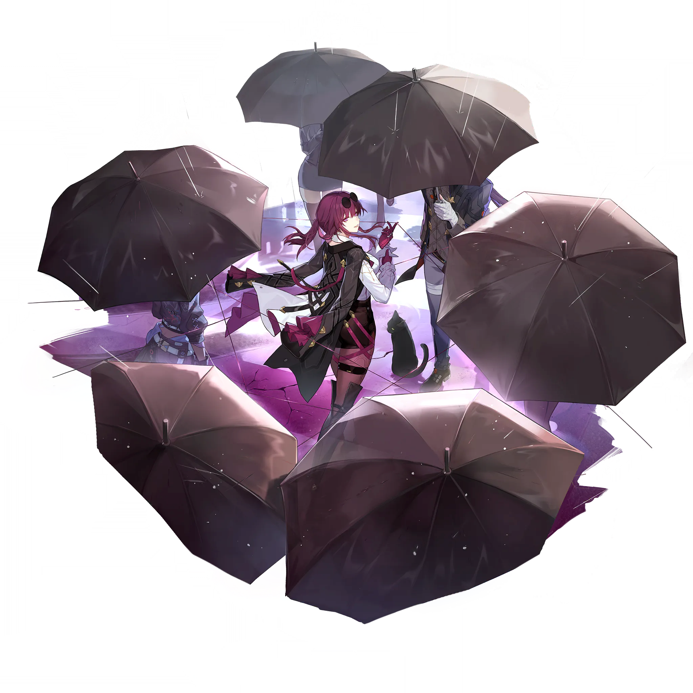

# 卡芙卡 Kafka — 2026.08.20
> 视频类型：A · 角色单人壁纸合集
> 角色来源：崩坏星穹铁道 · 五星雷属性虚无命途
> 身份：星核猎手核心成员 / 「命运的奴隶」艾利欧的副手
> 称号：只需等待·卡芙卡
> 设计参考：蜘蛛与猎物、黑色电影女间谍、优雅的危险
> 热点背景：崩坏星穹铁道 4.5 版本「挥掷千星的筹码」将于 8 月 26 日上线（距今 6 天），千星城/阿斯特罗波利斯夏日度假主题正热，社区讨论度持续攀升；卡芙卡作为崩铁人气 TOP3 角色、社区「妈」梗核心，从未制作过单人壁纸专题
> 今日特殊：无
> 伴生元素：小黑猫（splash art 中腰侧装饰元素，非独立战斗伙伴）

# 必需

Refer to the attached reference image (Figure 1). Generate a similar style image of Kafka from Honkai: Star Rail sitting casually on a weathered concrete block in front of a bold graffiti wall. Kafka is seated in a relaxed but commanding posture, one knee raised with her arm resting on it, her other leg stretched out casually, with her body language calm, controlled, and slightly provocative. Her expression should show cold, disdainful eyes, aloof, sharp, and superior, as if she is silently judging the viewer — the look of someone who considers everyone around her beneath her intellectual capacity.

Keep Kafka's recognizable features: dark magenta-purple hair tied in a messy high ponytail with two loose bangs framing her face, magenta-pink eyes with an analytical cold gaze, sunglasses pushed up on top of her head, fair porcelain skin, and elegant mature beauty. Blend her canonical design with a modern edgy streetwear aesthetic: a fitted black cropped tube top with purple spider-web lace trim at the neckline, an oversized dark purple bomber jacket with silver spider-web embroidery on the back draped over her shoulders, black high-waisted denim shorts with multiple silver chain belts and purple gem pendants, one thigh-high black boot on her right leg and a shorter black ankle boot on her left (asymmetrical footwear referencing her canonical design), purple fingerless gloves on both hands. Preserve her identity while giving her a fresh urban street-style look.

The graffiti wall behind her should be vivid and layered, full of expressive abstract shapes and energetic street-art textures in deep purple and magenta tones, with graffiti elements including "KAFKA" in stylized graffiti font, spider-web symbols, a stylized silhouette of her gunblade weapon, and abstract lightning bolt patterns, creating a rebellious urban backdrop that resonates with her character theme. Add subtle purple lightning energy effects and spider-silk thread wisps floating around her to reinforce her identity. A small black cat sits near her feet, watching the viewer with equally disdainful eyes.

Use a wide cinematic framing suitable for a 16:9 wallpaper, with Kafka as the main focal point while still showing enough of the graffiti wall and surrounding environment for atmosphere. The mood should feel cool, stylish, intimidating, and mysterious. Highly detailed background, rich shadows, purple and magenta glowing highlights, sharp focus on Kafka, and a refined high-end anime illustration look. perfect hands, five fingers on each hand, anatomically correct hands, well-defined fingers, natural hand pose, one hand resting casually on her raised knee, the other hand supporting her weight behind her on the concrete block.

Negative Prompt: low quality, worst quality, blurry, pixelated, bad anatomy, bad hands, extra fingers, fewer fingers, missing fingers, fused fingers, webbed fingers, merged fingers, overlapping fingers, deformed fingers, mutated fingers, six fingers, four fingers, three fingers, more than five fingers, less than five fingers, disfigured hands, poorly drawn hands, bad hand anatomy, asymmetrical hands, broken fingers, claw hands, blurry hands, indistinct fingers, smeared hands, extra limbs, chibi, childish, wrong hair color, blonde hair, green eyes, blue eyes, casual smile, friendly expression, warm smile, gentle smile, cheerful expression, cute expression, adorable, sweet, innocent, standing, standing pose, upright posture, singing, open mouth singing, game canonical outfit, official costume, fantasy dress, medieval clothing, armor, full gown, formal dress, beach background, ocean background, nature background, indoor background, plain background, minimal background, missing graffiti wall, low detail graffiti, generic graffiti, wrong graffiti colors, wrong streetwear, missing crop top, missing jacket, missing shorts, missing skirt, long dress, full pants, business suit, school uniform, text, watermark, logo, signature.

# 必需2 — 角色特写肖像

Refer to the attached reference image (Figure 2). Generate a cinematic close-up portrait of Kafka from Honkai: Star Rail. She holds her signature black sunglasses — sleek, with thin silver spider-web engraved frames — close to the right side of her face, the dark lens partially obscuring her right eye. Through the edge of the lens, her right magenta-pink iris is visible, staring through the dark glass with cold analytical precision. Her visible left eye gazes directly at the viewer — simultaneously inviting and terrifying, the expression of a predator who has decided whether you are prey or merely entertainment. Expression: a faint, barely-there smile that never reaches her eyes, lips slightly parted as if about to whisper a command, brows relaxed but gaze intense — detached elegance wrapped in deadly certainty, as if she is deciding which thread of fate to pull next.

Dramatic single-source lighting from the upper left casts deep chiaroscuro across her porcelain-pale features, the black sunglasses frame glowing warm silver where the light catches its polished surface, tiny spider-web engravings refracting delicate patterns of light onto her cheek. Her signature dark magenta-purple hair frames her face softly, a few loose strands caught in the sunglasses' frame; her black jagged choker necklace and the white collar of her shirt are barely visible at her neck. The purple glove on her hand holding the sunglasses catches the light, revealing fine stitching details. perfect hands, five fingers on each hand, anatomically correct hands, well-defined fingers, one hand elegantly holding sunglasses by the temple arm, fingers relaxed and graceful. A spider who weaves fate rather than waiting for it. 16:9 2K wallpaper.

Negative Prompt: low quality, worst quality, blurry, pixelated, bad anatomy, bad hands, extra fingers, fewer fingers, missing fingers, fused fingers, webbed fingers, merged fingers, overlapping fingers, deformed fingers, mutated fingers, six fingers, four fingers, three fingers, more than five fingers, less than five fingers, disfigured hands, poorly drawn hands, bad hand anatomy, asymmetrical hands, broken fingers, claw hands, blurry hands, indistinct fingers, smeared hands, extra limbs, full body shot, wide shot, landscape, multiple subjects, busy background, bright cheerful lighting, outdoor scene, action pose, weapon drawn, happy smile, laughing, chibi, text, watermark, logo, signature.

# 人物设定

## 3 — 雨夜·黑伞迷宫（角色标志性场景）

Positive Prompt:
16:9 2K wallpaper, Kafka from Honkai: Star Rail, highly detailed anime-style illustration, polished official game-art quality, dark noir rainy night atmosphere, cinematic purple-tinted street lighting, mysterious and elegant composition.

Depict Kafka standing at the center of a circle of open black umbrellas arranged around her like the petals of a dark flower, rain falling steadily through the night. She wears her canonical outfit precisely: black jacket draped over her shoulders like a cape, white long-sleeved collared shirt, black vest with chest harness and multiple straps, high-waist black shorts, purple pantyhose, asymmetrical black boots (one thigh-high, one shorter), purple long gloves, sunglasses pushed up on her dark magenta-purple hair tied in a high ponytail with loose bangs framing her face. Her magenta-pink eyes glow faintly with purple energy in the darkness.

She holds her gunblade hybrid weapon casually in one purple-gloved hand, the blade gleaming with residual purple lightning. From her extended fingertips, thin strands of purple spider-silk energy thread extend outward, connecting to each umbrella and creating an intricate web pattern in the rain. The raindrops catch the purple light, making the entire scene shimmer with violet sparks. A small black cat sits calmly at her feet, unbothered by the rain, its eyes reflecting the same magenta glow as hers.

The background is a blurred noir cityscape — tall buildings with scattered lit windows, neon signs reflecting on wet pavement, the vague silhouettes of passersby holding their own umbrellas, all rendered out of focus to keep attention on Kafka. The overall mood is dangerous elegance, controlled power, and the quiet before a hunt. Deep purple and black color palette with silver rain highlights.

perfect hands, five fingers on each hand, anatomically correct hands, well-defined fingers, one hand holding gunblade naturally at her side, other hand extended with fingers slightly spread trailing purple energy threads, natural elegant pose.

Negative Prompt:
low quality, worst quality, blurry, pixelated, bad anatomy, bad hands, extra fingers, fewer fingers, missing fingers, fused fingers, webbed fingers, merged fingers, overlapping fingers, deformed fingers, mutated fingers, six fingers, four fingers, disfigured hands, poorly drawn hands, bad hand anatomy, broken fingers, blurry hands, indistinct fingers, smeared hands, extra limbs, wrong hair color, blonde hair, green eyes, blue eyes, cheerful expression, laughing, casual clothing, modern streetwear, daytime, sunny, bright colors, chibi, male character, text, watermark, logo.

## 4 — 天衣五·故乡的旧钟楼（角色起源场景）

Positive Prompt:
16:9 2K wallpaper, Kafka from Honkai: Star Rail, highly detailed anime-style illustration, polished game-art quality, sci-fi meets ancient Babylon aesthetic, nostalgic yet ominous atmosphere, twilight purple sky.

Depict Kafka standing alone at the edge of a crumbling observation deck on her home world Pteruges-V: New Babylon. Behind her rises an enormous ancient clock tower fused with futuristic technology — Babylonian ziggurat architecture blended with glowing circuit patterns and holographic time displays. The tower's massive clock face glows with soft purple light, its hands frozen at a meaningful time. Kafka stands with her back partially turned to the viewer at a three-quarter angle, looking up at the tower with an expression of quiet melancholy — her magenta eyes soft with memory, her lips set in a thin line, the mask of the Stellaron Hunter momentarily lowered to reveal the girl who once called this place home.

She wears her canonical outfit: black jacket draped over shoulders, white shirt, black harness vest, high-waist shorts, purple pantyhose, asymmetrical boots, purple gloves, sunglasses on her head, dark magenta ponytail with loose bangs. Her gunblade is sheathed at her hip. In one hand, she holds a single pressed flower from her home world — a delicate purple bloom preserved between two glass slides.

The environment tells the story of a ruined paradise: overgrown gardens with alien flora in purple and silver tones, broken holographic billboards flickering with ancient New Babylonian script, distant futuristic city spires half-collapsed into purple mist. The sky is a gradient of deep violet to burnt orange at the horizon — the unique twilight of Pteruges-V. Purple lightning occasionally forks between the clouds, echoing her elemental affinity.

Cinematic wide composition with Kafka in the lower right third, the massive clock tower dominating the left and center, the ruined landscape stretching to the horizon. The mood is bittersweet nostalgia, the weight of a past that can never be returned to, and the quiet acceptance of a hunter who chose her path.

perfect hands, five fingers on each hand, anatomically correct hands, well-defined fingers, one hand holding the pressed flower delicately between thumb and forefinger, other hand resting loosely at her side.

Negative Prompt:
low quality, worst quality, blurry, pixelated, bad anatomy, bad hands, extra fingers, fewer fingers, missing fingers, fused fingers, webbed fingers, merged fingers, overlapping fingers, deformed fingers, mutated fingers, six fingers, four fingers, disfigured hands, poorly drawn hands, bad hand anatomy, broken fingers, blurry hands, indistinct fingers, smeared hands, extra limbs, cheerful expression, laughing, combat pose, action scene, bright daylight, modern cityscape, chibi, male character, text, watermark, logo.

## 5 — 精神操控·蛛网领域（元素技能释放·战斗场景）

Positive Prompt:
16:9 2K wallpaper, Kafka from Honkai: Star Rail, highly detailed anime-style illustration, dynamic elemental power activation, dramatic Lightning element effects with Spirit Whisper ability, polished game-art quality, dark battlefield aesthetic, ruined cathedral interior.

Depict Kafka unleashing her full power in combat. She stands in the center of a vast ruined cathedral, one arm extended forward in a commanding gesture, fingers spread as if conducting an invisible orchestra, her expression shifted from elegant lady to cold battlefield dominator — magenta eyes blazing with purple lightning energy, lips curved in a faint cruel smile, all pretense of gentility stripped away to reveal the web-weaver beneath. Her dark magenta hair whips around her face in the supernatural wind generated by her power.

From her extended fingertips, dozens of thick purple spider-silk energy threads extend outward in all directions, ensnaring shadowy enemy figures in the background and pinning them to the cathedral walls like insects in a web. The threads pulse with purple lightning, and where they touch the stone walls, cracks of violet energy spread like fractures in reality. Her gunblade hovers beside her, wrapped in crackling purple lightning arcs, ready to strike at her command.

Kafka's canonical outfit whips in the supernatural wind — her black jacket flares like a cape, her loose bangs fly across her face, the straps of her harness snap like whips. Purple lightning orbits her body in controlled spirals, and her purple gloves glow with concentrated energy. The cathedral floor beneath her feet is covered in a spreading pattern of purple spider-web cracks, pulsing with light.

The environment: a vast gothic cathedral with shattered stained-glass windows, moonlight streaming through in colored beams, shadowy enemy figures frozen mid-motion and suspended in her web. The atmosphere is one of absolute control — she is not fighting, she is simply deciding the terms of her enemies' defeat.

Dynamic diagonal composition with Kafka in the center foreground (three-quarter view, arm extended), energy threads radiating outward in all directions like a spider's web, purple lightning illuminating the dark cathedral. High contrast between the dark interior and brilliant purple combat effects.

perfect hands, five fingers on each hand, anatomically correct hands, well-defined fingers, one hand extended forward with fingers spread in commanding gesture, other arm at her side with gunblade floating beside it.

Negative Prompt:
low quality, worst quality, blurry, pixelated, bad anatomy, bad hands, extra fingers, fewer fingers, missing fingers, fused fingers, webbed fingers, merged fingers, overlapping fingers, deformed fingers, mutated fingers, six fingers, four fingers, disfigured hands, poorly drawn hands, bad hand anatomy, broken fingers, blurry hands, indistinct fingers, smeared hands, extra limbs, stiff pose, weak effects, flat lighting, peaceful calm expression, smiling gently, no energy effects, no lightning, wrong element color, fire effects, red energy, green energy, chibi, male character, text, watermark.

## 6 — 都市风衣收藏家（现代风改造）

Positive Prompt:
16:9 2K wallpaper, Kafka from Honkai: Star Rail, highly detailed anime-style illustration, premium fashion editorial quality, modern urban luxury street, rainy evening in a high-end fashion district, cinematic bokeh lighting.

Depict Kafka walking confidently through a rain-slicked street lined with elegant coat boutiques and fashion houses in a futuristic city. She has been reimagined in modern luxury fashion that honors her canonical design: a sleek black tailored coat with exaggerated shoulders draped open over a white silk blouse, high-waist black leather shorts, sheer purple stockings, one thigh-high black stiletto boot and one ankle boot (maintaining her asymmetrical footwear signature), purple leather gloves, her signature sunglasses now perched on her nose rather than her head. Her dark magenta-purple hair is styled in a slightly more polished ponytail, with the same loose bangs framing her elegant face. Her magenta eyes survey the shop windows with the discerning gaze of a true connoisseur.

She carries multiple shopping bags from exclusive designer boutiques in one hand — each bag decorated with subtle spider-web patterns as a nod to her identity — while her other hand holds a sleek black umbrella. The shop windows display elegant coats in every style, and Kafka pauses before one particularly exquisite purple velvet overcoat, her expression showing genuine appreciation rather than her usual coldness. A small black cat walks beside her on a thin silver leash, wearing a tiny purple collar.

The street is wet with rain, reflecting the warm golden light from shop windows and the cool blue of street lamps. Other pedestrians are blurred into elegant silhouettes in the background. The overall mood is sophisticated luxury, quiet power expressed through fashion, and the unexpected hobby of a deadly assassin. Deep purple, black, and gold color palette with warm shop lighting accents.

perfect hands, five fingers on each hand, anatomically correct hands, well-defined fingers, one hand holding multiple shopping bag handles, other hand holding umbrella handle naturally.

Negative Prompt:
low quality, worst quality, blurry, pixelated, bad anatomy, bad hands, extra fingers, fewer fingers, missing fingers, fused fingers, webbed fingers, merged fingers, overlapping fingers, deformed fingers, mutated fingers, six fingers, four fingers, disfigured hands, poorly drawn hands, bad hand anatomy, broken fingers, blurry hands, indistinct fingers, smeared hands, extra limbs, wrong hair color, green eyes, casual streetwear, sporty outfit, combat pose, weapon visible, aggressive face, daytime sunny, crowded market, chibi, male character, text, watermark, logo.

## 7 — 千星城夏日度假（4.5 版本热点特别版）

Positive Prompt:
16:9 2K wallpaper, Kafka from Honkai: Star Rail, highly detailed anime-style illustration, premium resort vacation visual, Astropolis summer beach aesthetic, futuristic luxury resort blended with casino glamour, polished official promotional art quality.

Depict Kafka enjoying a rare moment of relaxation at the Astropolis (千星城) beach resort — the setting of the upcoming Honkai: Star Rail 4.5 version. She reclines on an elegant white lounge chair on a private balcony overlooking the glittering resort beach and the cosmic ocean beyond. She has been reimagined in a sophisticated summer vacation outfit that honors her canonical design: an elegant black one-piece swimsuit with purple spider-web lace trim and a high neckline, a sheer black sarong tied loosely at her waist with purple ribbon accents, her signature purple gloves shortened to wrist-length, sunglasses pushed up on her head, dark magenta-purple hair in a loose high ponytail with wet strands clinging to her neck.

She reclines with her long bare legs extended naturally along the length of the white lounge chair in a relaxed three-quarter pose visible to the viewer — her left leg stretches out fully along the chair cushion with the knee slightly soft, the calf gently tapered, and the foot resting naturally at the chair's edge; her right leg is slightly bent at the knee with the lower leg angled outward, the ankle slim and the foot relaxed. Both legs are smooth and evenly proportioned with correct anatomical structure: the thighs flow naturally from the hip, the knee joints are properly positioned and not hyperextended, the calves taper gracefully to slim ankles, and the overall leg perspective follows the reclining angle of her body. She wears a pair of matching black strappy flat sandals on both feet — thin leather straps wrapping around her ankles and across the tops of her feet, leaving her toes and heels exposed. The sheer sarong drapes loosely over her upper thighs and hip but is parted to reveal her lower legs and sandaled feet, showing smooth bare skin from above the knee down. correct leg anatomy, proper leg proportions, natural leg pose, anatomically correct knees and ankles, realistic leg perspective, correct human leg structure, legs in correct reclining perspective.

In one hand, she holds an elegant cocktail glass with a purple-tinted drink and a tiny black spider-shaped garnish. Her expression is relaxed but still dangerous — a faint knowing smile, magenta eyes half-lidded as if she's already calculated every possible outcome of the evening. Behind her, the Astropolis resort stretches out in all its glory: futuristic beachfront hotels with holographic displays, a massive casino complex with spinning roulette wheels visible through glass walls, a beach crowded with silhouetted vacationers, and above it all, a stunning cosmic sky with twin moons and a brilliant nebula in purple and gold hues.

A small black cat lounges on the chair beside her, wearing a tiny pair of sunglasses. The balcony railing is decorated with purple flowering vines. The overall mood is luxury, relaxation with an undercurrent of danger, and the rare sight of a spider at rest. Warm golden resort lighting mixed with cool cosmic twilight.

perfect hands, five fingers on each hand, anatomically correct hands, well-defined fingers, one hand holding cocktail glass elegantly by the stem, other hand resting on the armrest of the lounge chair.

Negative Prompt:
low quality, worst quality, blurry, pixelated, bad anatomy, bad hands, extra fingers, fewer fingers, missing fingers, fused fingers, webbed fingers, merged fingers, overlapping fingers, deformed fingers, mutated fingers, six fingers, four fingers, disfigured hands, poorly drawn hands, bad hand anatomy, broken fingers, blurry hands, indistinct fingers, smeared hands, extra limbs, bad legs, deformed legs, extra legs, missing legs, fused legs, wrong leg anatomy, twisted legs, bent legs unnaturally, broken legs, extra knees, missing knees, bad knees, deformed knees, bad feet, extra feet, missing feet, fused feet, deformed feet, wrong foot anatomy, twisted ankles, extra toes, missing toes, asymmetrical legs, uneven leg length, crossed legs confusion, leg perspective error, wrong leg proportions, malformed legs, shoes, boots, sneakers, heels, wrong hair color, game canonical outfit, jacket, shorts, combat pose, weapon drawn, aggressive expression, winter scene, snow, chibi, male character, text, watermark, logo.

## 8 — 雷光刃舞（动态/战斗场景）

Positive Prompt:
16:9 2K wallpaper, Kafka from Honkai: Star Rail, highly detailed anime-style illustration, dynamic combat action, dramatic Lightning element gunfire burst, polished game-art quality, dark stormy battlefield, cinematic motion blur.

Depict Kafka unleashing a devastating twin-gun barrage in the heat of combat. She is captured in a low sliding combat stance — body angled in a dynamic three-quarter profile facing left, torso upright and aligned over her hips with no twisting at the waist, spine straight and natural.

Her legs are arranged in a stable combat crouch that shows full leg structure clearly: her right leg is forward and bent, the foot planted firmly on the cracked ground for stability, the thigh angled downward and forward, the knee positioned naturally between thigh and calf, the lower leg descending vertically to the boot, the entire leg visible from hip to ankle without any clothing obstruction. Her left leg extends backward and downward in a powerful push-off stance, the thigh stretching back from the hip at a downward diagonal, the knee clearly visible and naturally bent, the calf extending fully from knee to ankle in a clean tapered line, the ankle slim and the foot braced against the ground for leverage. Both legs show complete anatomical structure with the knee joint clearly defined between thigh and calf, calves tapering naturally to ankles, and the full length of both lower legs visible and unobstructed. correct leg anatomy, visible calves on both legs, natural knee joints, proper leg proportions, full leg structure visible, anatomically correct crouching pose.

In her left hand she holds a compact black submachine gun in the style of MAC-10 — sleek rectangular black metal body, short barrel, vertical front grip, purple glowing energy lines etched along the receiver — the arm extended forward and slightly left, gun barrel pointing toward the left foreground, erupting with a brilliant purple muzzle flash and a stream of lightning-charged tracer rounds. In her right hand she holds an identical MAC-10, but this arm is extended backward and to the right — the elbow naturally bent, the upper arm close to her torso, the forearm angling backward so the gun barrel points toward the right background behind her, her right shoulder slightly opened to allow the arm to reach backward naturally. The right hand grips the MAC-10 with palm facing inward toward her body, the wrist neutral and aligned with the forearm, creating a clean backward-pointing line from shoulder through elbow, wrist, and gun barrel. Both MAC-10s erupt simultaneously — the left gun firing forward, the right gun firing backward — creating a deadly crossfire arc of purple lightning energy that surrounds her like a crackling halo. correct arm anatomy, natural shoulder rotation, proper elbow bend, wrist aligned with forearm.

Her canonical outfit is rendered with dynamic motion: her black jacket flares dramatically behind her like dark wings, the straps of her harness snap like whips in the air, her purple pantyhose show the full length of both legs from hip to ankle, her asymmetrical boots — one tall black boot on her right leg and one shorter black boot on her left — grip the shattered ground. Her dark magenta hair whips in a wild arc around her head. Her expression is one of focused exhilaration — magenta eyes narrowed with predatory intensity, lips curved in a genuine battle-smile, the joy of a hunter who has found worthy prey.

Multiple shadowy enemy figures are caught in various stages of being struck — one frozen in a backward arc on the left as forward fire courses through it, another on the right caught by the backward stream, a third suspended in her spider-web energy threads mid-air. The battlefield is a storm-swept ruin: broken columns, shattered architecture, a dark sky torn by constant lightning strikes.

The lighting is dramatic and high-contrast: each lightning strike illuminates the scene in brilliant violet-white, followed by deep shadows. Kafka herself is rim-lit by the energy of her own attack, creating a purple halo effect around her silhouette.

Dynamic composition with Kafka as the explosive center — forward gunfire streaking left, backward gunfire streaking right, purple lightning connecting both streams in an arc above her head.

perfect hands, five fingers on each hand, anatomically correct hands, well-defined fingers, left hand gripping left MAC-10 forward grip with palm down, right hand gripping right MAC-10 backward with palm inward, both wrists straight and aligned with forearms, natural dual-gun stance.

Negative Prompt:
low quality, worst quality, blurry, pixelated, bad anatomy, bad hands, extra fingers, fewer fingers, missing fingers, fused fingers, webbed fingers, merged fingers, overlapping fingers, deformed fingers, mutated fingers, six fingers, four fingers, disfigured hands, poorly drawn hands, bad hand anatomy, broken fingers, blurry hands, indistinct fingers, smeared hands, extra limbs, torso twist, twisted torso, broken spine, wrong torso alignment, disconnected torso and legs, bad body anatomy, deformed body, extra hips, missing hips, wrong hip position, torso bent unnaturally, spine bent wrong, bad posture, wrong body proportions, body out of alignment, sword, blade, katana, gunblade, melee weapon, single gun, no weapon, stiff pose, static pose, weak effects, flat lighting, peaceful calm expression, no lightning, wrong element color, fire effects, red energy, green energy, daytime sunny, chibi, male character, text, watermark.

## 9 — 大衣橱前的温柔（情感/日常/反差）

Positive Prompt:
16:9 2K wallpaper, Kafka from Honkai: Star Rail, highly detailed anime-style illustration, intimate domestic atmosphere, warm and soft lighting, unexpected tenderness, polished character art with emotional depth.

Depict Kafka in her private quarters — a walk-in closet that would make any fashion enthusiast weep with envy. Floor-to-ceiling racks line every wall, displaying hundreds of coats in every style, color, and fabric: elegant trench coats, dramatic capes, sleek leather jackets, fluffy fur wraps, military greatcoats, and avant-garde designer pieces. The closet is organized with obsessive precision — coats arranged by color gradient, season, and occasion — a stark contrast to the chaotic life of a Stellaron Hunter.

Kafka stands in the center of the closet, wearing a simple black silk camisole and matching shorts — her "off-duty" look, devoid of her usual harness and combat gear. Her dark magenta hair is down for once, flowing loosely past her shoulders, sunglasses set aside on a nearby shelf. She holds a magnificent deep purple velvet coat against her chest, her cheek pressed softly against the fabric, her eyes closed in genuine contentment. Her expression is utterly unguarded — no cold calculation, no predatory sharpness, just the quiet happiness of someone surrounded by things she loves.

The lighting is warm and intimate: soft amber recessed lighting in the ceiling, a single vintage crystal lamp on a small wooden table, and through a partially open door, the cool blue of a spaceship corridor visible in contrast. On the table beside the lamp: a half-empty cup of tea, a book of fashion plates, and a small framed photo showing a younger Kafka with Silver Wolf — a rare glimpse of genuine friendship.

The small black cat sleeps curled up in a nest of silk scarves on a lower shelf, completely at peace. The overall mood is warmth, vulnerability, and the beautiful contradiction of a woman who can destroy worlds but finds her greatest joy in a well-tailored coat.

Medium-wide composition with Kafka centered in the closet, the coat racks creating leading lines that draw the eye to her, the warm interior enveloping her in amber light. Soft focus on the background racks to keep attention on her expression.

perfect hands, five fingers on each hand, anatomically correct hands, well-defined fingers, both hands gently holding the purple coat against her chest, fingers relaxed and natural.

Negative Prompt:
low quality, worst quality, blurry, pixelated, bad anatomy, bad hands, extra fingers, fewer fingers, missing fingers, fused fingers, webbed fingers, merged fingers, overlapping fingers, deformed fingers, mutated fingers, six fingers, four fingers, disfigured hands, poorly drawn hands, bad hand anatomy, broken fingers, blurry hands, indistinct fingers, smeared hands, extra limbs, cold emotionless face, combat pose, weapon visible, harsh lighting, dark gloomy atmosphere, outdoor scene, canonical outfit, harness, jacket, chibi, male character, text, watermark.

# 参考图

## 10（手机竖屏壁纸）

Refer to the attached reference image. Generate a similar composition adapted for a 9:16 vertical mobile wallpaper format. Depict Kafka from Honkai: Star Rail standing at the center of a circle of open black umbrellas, rain falling around her. She wears her canonical outfit: black jacket draped over shoulders, white shirt, black harness vest, high-waist shorts, purple pantyhose, asymmetrical boots, purple gloves, sunglasses on her head, dark magenta-purple hair in a high ponytail with loose bangs. Her magenta-pink eyes glow softly in the rainy darkness.

The vertical composition should focus on her upper body and face, with the umbrellas framing her from all sides like a protective barrier. Purple energy threads connect the umbrellas in a web pattern. Raindrops catch purple light as they fall. A small black cat sits at her feet. The background is a blurred noir cityscape with scattered lights.

Adapt the original 2048x2048 splash art composition for 9:16 vertical mobile wallpaper format while maintaining the mysterious noir atmosphere, purple energy effects, and elegant character presentation. Keep the rain, umbrellas, and purple lighting as core visual elements. The mood should be dark, elegant, and alluring.

perfect hands, five fingers on each hand, anatomically correct hands, well-defined fingers, one hand holding her gunblade casually at her side, other hand relaxed.

Negative Prompt:
low quality, worst quality, blurry, pixelated, bad anatomy, bad hands, extra fingers, fewer fingers, missing fingers, fused fingers, webbed fingers, merged fingers, overlapping fingers, deformed fingers, mutated fingers, six fingers, four fingers, disfigured hands, poorly drawn hands, bad hand anatomy, broken fingers, blurry hands, indistinct fingers, smeared hands, extra limbs, wrong hair color, blonde hair, green eyes, cheerful expression, laughing, combat pose, action scene, bright daylight, sunny, chibi, male character, text, watermark, logo.

# 跨领域参考图

本次未获取跨领域参考图。角色外观描述基于 B站WIKI 官方 splash art 视觉校对，伴生元素（小黑猫）基于 splash art 观察确认。如后续需补充跨领域参考，建议方向：黑色电影海报（间谍/刺客气质）× 雷暴摄影（雷元素视觉）。
