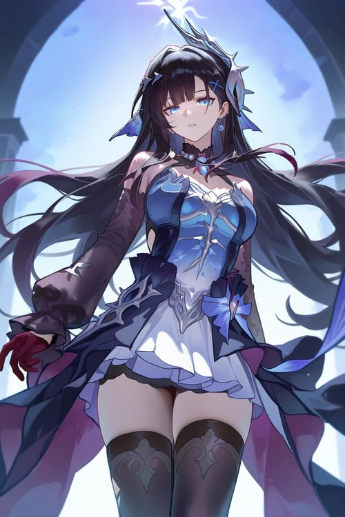

# 海瑟音 Hysilens — 2026.08.04

> 视频类型：A · 角色单人壁纸合集
> 角色来源：崩坏：星穹铁道 3.5「英雄未死之前」· 物理属性·虚无命途
> 身份：海列屈拉 / 「海洋」火种的黄金裔 / 斯缇科西亚海滨之城的骑士统领 / 海妖一族的幸存者
> 设计参考：深蓝长发、海洋意象、优雅的骑士与歌者气质、海妖传说、酒杯与深海波纹元素
> 热点背景：3.5版本前瞻特别节目于8月2日播出，海瑟音与刻律德菈成为版本核心新角色；版本「英雄未死之前」将于8月13日上线，前瞻后两日仍处于新角色讨论与二创预热窗口。
> 选角理由：工作区尚未覆盖崩坏：星穹铁道角色；昨天已产出原神安娜丝塔夏、前天已产出绝区零蕾米埃尔，本次以海洋神话氛围强烈的海瑟音补足题材与游戏覆盖。

# 必需

Refer to the attached reference image (Figure 1). Generate a similar style image of Hysilens from Honkai: Star Rail sitting in front of a bold ocean-blue graffiti wall, wearing sophisticated modern street fashion with a poised, slightly teasing expression while looking at the camera. Preserve her recognizable deep navy-blue wavy hair, luminous aqua eyes, refined sea-siren elegance, and subtle ocean-inspired jewelry. She wears a cropped midnight-blue leather jacket with pearl-white wave embroidery over a fitted black top, a layered indigo skirt, sheer dark tights, and white platform sneakers with cobalt accents. The graffiti wall behind her features stylized waves, seafoam, shell motifs, cocktail-glass line art, and glowing cyan ripples. Hands resting naturally at her sides, perfect hands, five fingers on each hand, well-defined fingers, natural hand pose. 16:9 2K wallpaper format.

Negative Prompt: low quality, worst quality, blurry, pixelated, bad anatomy, bad hands, extra fingers, fewer fingers, missing fingers, fused fingers, webbed fingers, merged fingers, overlapping fingers, deformed fingers, mutated fingers, six fingers, four fingers, three fingers, more than five fingers, less than five fingers, disfigured hands, poorly drawn hands, bad hand anatomy, asymmetrical hands, broken fingers, claw hands, blurry hands, indistinct fingers, smeared hands, extra limbs, chibi, childish, wrong hair color, wrong eye color, generic mermaid costume, fish tail, text, watermark, logo, signature.

# 人物设定

## 1 — 斯缇科西亚的潮汐舞台（海滨城歌者）

Positive Prompt:

16:9 wallpaper, Hysilens from Honkai: Star Rail, highly detailed anime-style illustration, polished game-art quality, elegant oceanic fantasy, cinematic concert atmosphere, deep blue and pearl-white color palette.

Depict Hysilens standing alone on an open-air marble stage above the moonlit sea in the coastal city of Styxia. Her long deep navy-blue wavy hair streams softly in the salt wind, and her luminous aqua eyes meet the viewer with a confident, knowing smile. She wears an elegant dark navy performance gown with layered translucent fabric shaped like ocean waves, pearl ornaments at the neckline, silver armor-like details on the shoulders, and a high slit revealing dark stockings and delicate heeled boots. One hand lightly holds a vintage silver microphone stand shaped like a curling wave, the other is extended in a graceful singing gesture, perfect hands, five fingers on each hand, well-defined fingers, natural hand pose.

Behind her, an amphitheater of white stone arches opens to a vast indigo sea. Floating lanterns and glowing seafoam drift through the air like notes from an unheard melody. Distant audience silhouettes remain subtle and out of focus, keeping Hysilens as the unmistakable focal point. Moonlight draws a luminous path over the water and creates a halo around her hair. Centered, elegant composition with ample negative space for a desktop wallpaper.

Negative Prompt:

low quality, blurry, bad anatomy, bad hands, extra fingers, fewer fingers, missing fingers, fused fingers, webbed fingers, deformed fingers, six fingers, four fingers, disfigured hands, poorly drawn hands, extra limbs, chibi style, fish tail, generic mermaid costume, crowded stage, modern pop concert LEDs, sunny daytime, wrong hair color, wrong eye color, text, watermark.

## 2 — 深海欢宴（不醉不归的酒杯）

Positive Prompt:

16:9 wallpaper, Hysilens from Honkai: Star Rail, highly detailed anime-style illustration, luxurious underwater banquet, dreamy and mysterious mood, polished character art, cinematic lighting.

Depict Hysilens seated at the head of an opulent abandoned banquet table on the seafloor, a scene inspired by an eternal deep-sea feast. Her navy-blue hair floats weightlessly around her shoulders, and she gazes directly at the viewer with calm, slightly melancholic composure. She wears a sophisticated black-and-blue evening dress with iridescent scale-like embroidery, pearl chains, sheer sleeves, and silver sea-wave accessories. In one hand she holds a crystal goblet filled with glowing sapphire liquid; her other hand rests naturally on the table beside scattered pearls, perfect hands, five fingers on each hand, well-defined fingers, elegant natural pose.

The table is covered in rich dark-blue velvet, antique silver plates, pale shells, and luminous coral arrangements. Above, broken palace windows filter shafts of moonlight through the water; tiny bubbles and glowing plankton drift around her. A distant silhouette of ruined arches and a grand sunken ballroom dissolve into blue darkness. Use a medium-wide composition with Hysilens on the right third and the banquet extending into the left side of the frame.

Negative Prompt:

low quality, blurry, bad anatomy, bad hands, extra fingers, fewer fingers, missing fingers, fused fingers, webbed fingers, deformed fingers, six fingers, four fingers, disfigured hands, poorly drawn hands, extra limbs, chibi, fish tail, bikini, cheerful party crowd, dirty murky water, gore, horror monster, wrong hair color, text, watermark.

## 3 — 骑士统领的黎明巡航（海城守望）

Positive Prompt:

16:9 wallpaper, Hysilens from Honkai: Star Rail, highly detailed anime-style illustration, heroic coastal fantasy, polished game-art quality, dawn light, noble and resolute atmosphere.

Depict Hysilens as the knight commander of a seaside city, standing on the bow of a sleek white-and-navy patrol ship cutting through quiet dawn waves. Her deep blue wavy hair is tied back with a pearl ribbon, with loose strands catching the wind. Her aqua eyes look toward the horizon with a composed, vigilant expression. She wears an elegant navy officer coat with silver wave embroidery, fitted black gloves, a white high-collar blouse, a layered skirt over dark stockings, and polished boots. One hand rests on the ship's rail, while the other gently grips a slender ceremonial saber in its sheath, perfect hands, five fingers on each hand, well-defined fingers, anatomically correct grip.

The city of Styxia rises behind her: pale stone terraces, blue domes, harbor towers, and distant sails illuminated by warm sunrise. Sea birds cross a sky transitioning from lavender to gold, while translucent wave-like energy trails along the ship's wake. Wide cinematic composition, Hysilens placed on the left third with a broad sunrise horizon to the right.

Negative Prompt:

low quality, blurry, bad anatomy, bad hands, extra fingers, fewer fingers, missing fingers, fused fingers, webbed fingers, deformed fingers, six fingers, four fingers, disfigured hands, poorly drawn hands, extra limbs, chibi, pirate costume, generic medieval armor, stormy night, fish tail, modern warship, wrong hair color, text, watermark.

## 4 — 满月下的海妖低语（神话肖像）

Positive Prompt:

16:9 wallpaper, Hysilens from Honkai: Star Rail, highly detailed anime-style illustration, mythic sea-siren portrait, moonlit fantasy, ethereal and intimate mood, polished character art.

Depict a close cinematic portrait of Hysilens standing ankle-deep in a mirror-still midnight sea beneath an enormous full moon. Her long navy-blue hair falls in glossy waves over one shoulder, reflecting shades of cobalt and silver. Her luminous aqua eyes carry a secretive, tender expression, as if she is about to begin an ancient song. She wears a refined midnight-blue off-shoulder dress with flowing translucent sleeves, pearl earrings, a silver shell-shaped hair ornament, and a subtle armored corset inspired by a knight's ceremonial attire. One hand is raised near her lips in a delicate singing gesture, and the other trails fingertips over the water, creating concentric glowing ripples, perfect hands, five fingers on each hand, well-defined fingers, natural hand pose.

The horizon is minimal: a black-blue sea, drifting silver mist, scattered bioluminescent flowers, and faint ruins of a temple emerging from the water. Keep the frame uncluttered and elegant, with Hysilens on the center-right and generous dark-blue negative space.

Negative Prompt:

low quality, blurry, bad anatomy, bad hands, extra fingers, fewer fingers, missing fingers, fused fingers, webbed fingers, deformed fingers, six fingers, four fingers, disfigured hands, poorly drawn hands, extra limbs, chibi, fish tail, exposed bikini, overly sexualized pose, daylight, tropical beach, exaggerated smile, wrong hair color, text, watermark.

## 5 — 新艾利都式海港夜行（现代高定改造）

Positive Prompt:

16:9 wallpaper, Hysilens from Honkai: Star Rail, highly detailed anime-style illustration, modern high-fashion aesthetic, neon harbor at night, stylish and mysterious, polished character art.

Reimagine Hysilens walking through a rain-slicked modern harbor district at blue hour. She wears a tailored midnight-blue trench coat with glossy wave-pattern lining over a black fitted dress, sheer dark tights, ankle boots with pearl-white heels, and slim silver jewelry shaped like shells. Her deep navy hair is loose and softly windswept; her aqua eyes look back over her shoulder at the viewer with a poised, teasing confidence. One hand holds a transparent umbrella edged with cyan light, the other carries a small dark clutch, perfect hands, five fingers on each hand, well-defined fingers, natural hand pose.

The background features container cranes, sleek waterfront architecture, neon reflections on wet pavement, distant ferries, and softly glowing signs rendered as abstract shapes without readable text. Cyan, indigo, and warm amber reflections create a sophisticated urban palette. Medium-full body composition, Hysilens on the right third, shallow depth of field and rain bokeh.

Negative Prompt:

low quality, blurry, bad anatomy, bad hands, extra fingers, fewer fingers, missing fingers, fused fingers, webbed fingers, deformed fingers, six fingers, four fingers, disfigured hands, poorly drawn hands, extra limbs, chibi, fish tail, cybernetic body parts, streetwear hoodie, sunny day, readable text, watermark, logo, wrong hair color.

## 6 — 潮声结界（持续伤害战斗美学）

Positive Prompt:

16:9 wallpaper, Hysilens from Honkai: Star Rail, highly detailed anime-style illustration, dynamic action composition, epic oceanic energy effects, polished game-art quality, cinematic battle scene.

Depict Hysilens releasing a vast oceanic field across a dark battlefield. She stands at the center of a circular wave-pattern sigil etched into reflective ground, her navy hair and layered dress lifted by spiraling currents. Her expression is focused and serene rather than furious, her aqua eyes glowing with controlled authority. Both arms are extended in an elegant conductor-like motion, fingers precisely splayed, perfect hands, five fingers on each hand, well-defined fingers, anatomically correct hands. Around her, translucent ribbons of water, floating pearl-like lights, and luminous blue sound waves coil outward, marking enemies in the distance with rippling symbols.

Her outfit combines formal knightly navy fabric with silver armor accents and fluttering translucent panels. The battlefield transforms into a surreal sea under a shattered moonlit sky: water rises in suspended arcs, dark debris is eroded into glowing motes, and the horizon is lined with ruined white columns. Use strong diagonal energy flow and a low camera angle, Hysilens centered slightly below frame center.

Negative Prompt:

low quality, blurry, bad anatomy, bad hands, extra fingers, fewer fingers, missing fingers, fused fingers, webbed fingers, deformed fingers, six fingers, four fingers, disfigured hands, poorly drawn hands, extra limbs, static pose, weak effects, chibi, fish tail, fire magic, lightning-only effects, blood, gore, wrong hair color, text, watermark.

## 7 — 海风与唱片机（温柔日常反差）

Positive Prompt:

16:9 wallpaper, Hysilens from Honkai: Star Rail, highly detailed anime-style illustration, cozy seaside apartment, soft morning light, refined slice-of-life atmosphere, polished character art.

Depict Hysilens in a quiet private moment inside a sunlit apartment overlooking the sea. She sits sideways on a pale linen window seat beside a vintage record player, gently placing a vinyl record onto the turntable. Her long navy-blue hair is relaxed and slightly tousled, and her expression is soft and peaceful as she glances toward the viewer. She wears an oversized cream knit cardigan over a silky navy slip dress, dark thigh-high socks, and a small pearl hairpin. One hand carefully holds the edge of the record, while the other adjusts the tonearm, perfect hands, five fingers on each hand, well-defined fingers, natural hand pose.

The room contains blue-and-white ceramics, a vase of pale flowers, neatly stacked records with unreadable abstract covers, and sheer curtains billowing in the sea breeze. Outside the window, a calm aquamarine harbor and distant white buildings are softly blurred. Warm sunbeams and cool reflected ocean light create a tranquil contrast. Wide interior composition with room for desktop icons on the left.

Negative Prompt:

low quality, blurry, bad anatomy, bad hands, extra fingers, fewer fingers, missing fingers, fused fingers, webbed fingers, deformed fingers, six fingers, four fingers, disfigured hands, poorly drawn hands, extra limbs, chibi, fish tail, messy room, food clutter, childish pajamas, crowded people, wrong hair color, text, watermark.

## 8 — 沉没神殿的回响（遗迹探索）

Positive Prompt:

16:9 wallpaper, Hysilens from Honkai: Star Rail, highly detailed anime-style illustration, ancient underwater temple, mysterious archaeological fantasy, cinematic depth, polished game-art quality.

Depict Hysilens descending the grand staircase of an ancient sunken temple, holding a softly glowing pearl lantern. Her navy-blue hair floats in a slow halo around her, while her aqua eyes examine the ruins with calm curiosity. She wears a practical yet elegant dark blue explorer coat over a silver-trimmed dress, fitted gloves, dark stockings, and high boots. One hand lifts the lantern by its ornate handle and the other brushes against a carved stone wall covered in wave motifs, perfect hands, five fingers on each hand, well-defined fingers, natural hand pose.

The temple is built from pale marble and black stone, with cracked columns, giant shell reliefs, drifting sand, coral growing along the floor, and sunbeams descending from a broken ceiling far above. Faint ghostly blue musical notation-like light trails wind through the architecture, suggesting forgotten songs without using readable text. Deep perspective composition: Hysilens in the lower-right foreground, monumental stairs and the temple's glowing inner chamber beyond.

Negative Prompt:

low quality, blurry, bad anatomy, bad hands, extra fingers, fewer fingers, missing fingers, fused fingers, webbed fingers, deformed fingers, six fingers, four fingers, disfigured hands, poorly drawn hands, extra limbs, chibi, fish tail, scuba gear, muddy ruins, horror creature, skulls, gore, wrong hair color, readable inscriptions, text, watermark.

## 9 — 3.5版本纪念海报（潮汐与英雄）

Positive Prompt:

16:9 wallpaper, Hysilens from Honkai: Star Rail, premium official game-poster aesthetic, highly detailed anime-style illustration, grand oceanic fantasy, elegant heroic composition, blue and silver palette.

Create a celebratory character poster for Hysilens with a single clear focal point. She stands on a circular marble platform rising from a luminous sea, framed by a sweeping crescent of water and silver wave ornaments. Her long navy hair flows dramatically behind her; her aqua eyes face forward with composed authority. She wears her refined navy-and-silver canonical-inspired outfit, combining a knight commander's tailored silhouette with soft sea-siren fabric layers. One hand rests over her heart and the other extends toward a floating glowing pearl, perfect hands, five fingers on each hand, well-defined fingers, natural elegant gesture.

The background transitions from a deep indigo sky filled with stars to a radiant turquoise horizon, with silhouettes of coastal towers and ancient sea arches below. Pearl fragments, tiny bubbles, and glowing petal-like seafoam orbit her in a clean, symmetrical design. Leave the upper-left region visually quiet for optional title placement, but do not render any letters or logos.

Negative Prompt:

low quality, blurry, bad anatomy, bad hands, extra fingers, fewer fingers, missing fingers, fused fingers, webbed fingers, deformed fingers, six fingers, four fingers, disfigured hands, poorly drawn hands, extra limbs, chibi, fish tail, cluttered composition, multiple characters, incorrect hair color, generic fantasy princess, text, logo, watermark.

## 10 — 雨夜港湾的最后一曲（电影感竖屏兼容）

Positive Prompt:

16:9 wallpaper, Hysilens from Honkai: Star Rail, highly detailed anime-style illustration, cinematic rainy-night harbor, emotional storytelling, sophisticated neo-noir atmosphere, polished game-art quality.

Depict Hysilens standing alone beneath a stone archway at a rain-soaked harbor after midnight. Her navy-blue hair clings slightly to her shoulders from the mist, and her aqua eyes reflect distant ship lights with a wistful, unwavering gaze. She wears a long black-and-indigo cloak with silver wave embroidery over her elegant dress, and a pearl pendant resting at her collarbone. One hand is held near her chest around the pendant; her other hand lightly touches the wet archway, perfect hands, five fingers on each hand, well-defined fingers, natural expressive gesture.

Beyond the arch, dark water reflects indigo lantern light from moored boats and far-off coastal buildings. Rain becomes shimmering vertical threads, and faint cyan ripple rings spread from each raindrop on the harbor surface. The composition should place Hysilens on the left third, with a long luminous harbor perspective receding into the right side. Emotional but restrained, fitting a final song before dawn.

Negative Prompt:

low quality, blurry, bad anatomy, bad hands, extra fingers, fewer fingers, missing fingers, fused fingers, webbed fingers, deformed fingers, six fingers, four fingers, disfigured hands, poorly drawn hands, extra limbs, chibi, fish tail, umbrella, bright daylight, crowded street, horror mood, blood, gore, wrong hair color, text, watermark.
