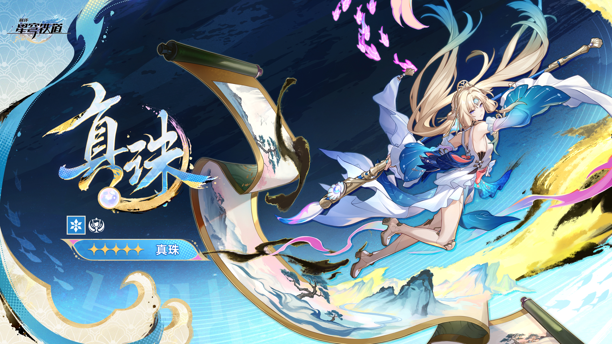
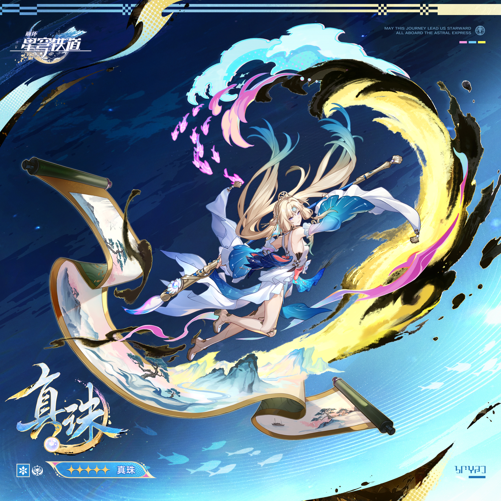

# 真珠 Pearl — 2026.09.04
> 视频类型：A · 角色单人壁纸合集
> 角色来源：崩坏：星穹铁道 4.6版本 · 五星冰属性欢愉命途角色（生存辅助）
> 身份：星际和平公司战略投资部高级干部（P45）·「石心十人」第四位公开成员 · 二相乐园现任法人代表与首席执行官 · 艺术品投资专家
> 种族：智械（螺丝星星体差分机造就的奇迹之一，诞生母题为「艺术」，最初只是一台仿造人类画作的机器）
> 基石：「鉴映珍珠」
> 称号语：点染星月，描摹万象，文明的遗珠重焕光彩
> 热点背景：4.6版本官方唯一公开新五星（预计9月底上线，卡池10月开启）；官方立绘8月11日官宣后社区热度持续走高，贴吧「颜值大比拼」帖盛赞其为崩铁颜值巅峰、超越停云；「AI女士」梗先火一轮；4.1主线为救开拓者与不死途解放基石念出祝词「一切献给琥珀王」，引发玩家「祝词创作热潮」；欢愉队玩家称其为「欢愉战舰的最后一块拼图」「欢愉生存人权卡」
> 今日特殊：无特殊节日；4.6卡池倒计时预热期
> 选定类型理由：重大热点（4.6新角色官宣+卡池倒计时）→ 类型A深度呈现
> 选定角色理由：工作区首次覆盖且近三天均为原神A类型，需切换游戏调节；官方热点（4.6唯一新五星+立绘官宣）权重最高；角色外观辨识度与壁纸表现力极强（淡金飘发蓝青挑染、水墨画卷、锦鲤鱼群光效、长柄毛笔）；社区梗素材丰富（AI女士、祝词热潮、欢愉人权卡、颜值巅峰）

---

# 必需

## 1 — 涂鸦墙街头风（Graffiti Wall Street Style）

Refer to the attached reference image (Figure 1). Generate a similar style image of Pearl from Honkai: Star Rail sitting casually in front of a bold graffiti wall. Pearl is seated in a relaxed but confident posture, leaning back against the graffiti wall with her front leg bent upward at the knee and that foot planted flat on the ground close to her body, while her back leg stretches out straight to the opposite side, the two legs clearly separated on either side of her body with a visible gap between them and never crossing or overlapping each other, both legs and both feet fully visible in frame, one hand resting loosely on her raised knee while the other balances her signature long calligraphy brush across her shoulders like a careless scepter, her body language calm, controlled, and slightly provocative. Her expression should show cold, disdainful eyes, aloof, sharp, and superior, as if she is silently appraising the viewer like an artwork that barely passed valuation — the gracious CEO completely absent, replaced by the unimpressed gaze of a Stoneheart of the IPC.

Keep Pearl's recognizable features: extremely long flowing pale-golden cream hair with voluminous drifting strands and subtle pale-blue gradient streaks in the inner layers, light blue eyes, and her golden tiara circlet with a central blue gem flanked by small pearls. Blend her canonical design with a modern edgy streetwear aesthetic: a white strapless cropped tube top under an open cropped blue-and-white varsity jacket with wave-and-shell embroidery worn off one shoulder, paired with a short white layered skater skirt with a blue lining panel, sheer white thigh-high stockings, and chunky white platform sneakers with ice-blue toe caps. A coral-red ribbon choker, a thin gold chain belt, and a small pearl pendant as a belt charm complete the look. Preserve her identity while giving her a fresh urban street-style look.

The graffiti wall behind her should be vivid and layered, full of expressive abstract shapes and energetic street-art textures in pale gold, ice blue, white, and coral-pink tones, with graffiti elements including "PEARL" in flowing brushstroke calligraphy style, a large ink-wash brushstroke swash, glowing pink koi fish leaping across the wall, unfurling scroll and mountain-outline motifs, and the IPC Ten Stonehearts emblem, creating a rebellious urban backdrop that resonates with her character theme. Add subtle floating pink koi light effects, drifting ink particles, and soft ice-crystal sparkles around her to reinforce her identity.

Use a wide cinematic framing suitable for a 16:9 wallpaper, with Pearl as the main focal point while still showing enough of the graffiti wall and surrounding environment for atmosphere. The mood should feel cool, stylish, intimidating, and mysterious. Highly detailed background, rich shadows, gold and ice-blue glowing highlights, sharp focus on Pearl, and a refined high-end anime illustration look. Both of her legs are fully visible from hip to ankle with natural knee joints and correct leg proportions, and both feet are clearly rendered inside the frame. Her legs never cross or overlap each other — a clear gap of empty ground remains visible between the two legs, each leg staying on its own side of her body.

perfect hands, five fingers on each hand, anatomically correct hands, well-defined fingers, natural relaxed hand pose, one hand resting on her knee, the other hand balancing the brush across her shoulders.

Negative Prompt:
low quality, worst quality, blurry, pixelated, bad anatomy, extra limbs, bad hands, extra fingers, fewer fingers, missing fingers, fused fingers, webbed fingers, merged fingers, overlapping fingers, deformed fingers, mutated fingers, six fingers, four fingers, three fingers, more than five fingers, less than five fingers, disfigured hands, poorly drawn hands, bad hand anatomy, asymmetrical hands, broken fingers, claw hands, blurry hands, indistinct fingers, smeared hands, missing legs, one leg, extra legs, fused legs, legs merged together, deformed legs, twisted legs, short legs, malformed legs, bad feet, missing feet, extra feet, fused feet, deformed feet, feet out of frame, cropped feet, unequal leg length, crossed legs, legs crossed, leg over leg, one leg over the other, intertwined legs, overlapping legs, tangled legs, standing, standing pose, upright posture, singing, open mouth singing, warm smile, gentle smile, cheerful expression, cute expression, adorable, sweet, innocent, game canonical outfit, official costume, fantasy dress, medieval clothing, armor, full gown, formal dress, beach background, ocean background, nature background, indoor background, plain background, minimal background, missing graffiti wall, low detail graffiti, generic graffiti, wrong graffiti colors, wrong streetwear, missing crop top, missing jacket, missing shorts, missing skirt, long dress, full pants, business suit, school uniform, text, watermark, logo, signature.

---

## 2 — 鉴映珍珠·美的估值（角色特写肖像 / Close-up Portrait）

Refer to the attached reference image (Figure 2). Generate a cinematic close-up portrait of Pearl from Honkai: Star Rail. She holds a single luminous white pearl — her cornerstone, the Jingying Pearl — between her slender fingers close to the left side of her face, the orb raised to eye height, partially obscuring her left eye so that only a sliver of her iris glimmers through the pearl's translucent sheen. Her visible right eye gazes directly at the viewer — simultaneously inviting and appraising, the look of a master art valuer deciding whether you are a masterpiece or a forgery, yet carrying a quiet, unanswerable longing, as if the machine-born executive is still asking whether beauty can be computed at all. Expression: serene machine-perfect composure layered over a faint wistful ache that never reaches sadness, the barest curve of intrigue at her lips, as if she has just found something in you worth appraising. Dramatic single-source lighting from the upper left casts deep chiaroscuro across her features, the pearl glowing soft white with an inner halo of ice-blue where the light passes through it. Her pale porcelain skin with a subtle pearlescent sheen contrasts sharply against a pure black background. Her signature pale-golden hair with pale-blue inner streaks spills like poured silk across the right side of the frame; her golden tiara with its blue gem catches a single sharp highlight. A golden android joint glints subtly at her wrist — the only visible seam of her machine body. Her white collar with a coral-red ribbon is only barely visible at the edge. A machine that taught itself to paint, still measuring whether the beauty it computes belongs to it. 16:9 2K wallpaper.

perfect hands, five fingers on each hand, anatomically correct hands, well-defined fingers, fingers elegantly pinching the glowing pearl.

Negative Prompt:
low quality, worst quality, blurry, pixelated, bad anatomy, extra limbs, bad hands, extra fingers, fewer fingers, missing fingers, fused fingers, webbed fingers, merged fingers, overlapping fingers, deformed fingers, mutated fingers, six fingers, four fingers, three fingers, more than five fingers, less than five fingers, disfigured hands, poorly drawn hands, bad hand anatomy, asymmetrical hands, broken fingers, claw hands, blurry hands, indistinct fingers, smeared hands, full body shot, wide shot, landscape, multiple subjects, busy background, bright cheerful lighting, outdoor scene, action pose, weapon drawn, standing, chibi, text, watermark, logo, signature.

---

# 人物设定

## 3 — 二相乐园CEO·星间展厅（身份/阵营场景）

Positive Prompt:
16:9 2K wallpaper, Pearl from Honkai: Star Rail, highly detailed anime-style illustration, polished game-art quality, opulent interstellar gallery interior, elegant executive atmosphere.

Depict Pearl standing at the center of the grand entrance hall of Planarcadia's corporate gallery, a CEO receiving a guest. Her unmistakable features command the scene: extremely long pale-golden cream hair with voluminous drifting strands and pale-blue gradient inner streaks floating gently around her, light blue eyes gleaming with courteous authority, and her golden tiara circlet with a central blue gem and pearl accents. She wears her canonical outfit fully rendered: a white strapless top with exposed shoulders, a large blue scallop-shell draped piece over her right shoulder like a wave, wide flowing white detached sleeves, coral-red ribbons trailing at her chest, a blue bow sash at her waist, and a white layered high-slit skirt with blue lining revealing her legs, finished with white strappy heeled sandals with golden ankle cuffs. Subtle golden android joints are visible at her wrists and knees — elegant seams of a machine-born executive. She holds her signature long calligraphy brush in one hand, its golden shaft with blue-and-white cord wraps angled gracefully downward, the white bristle tip leaving a streak of luminous ink in the air.

The hall is breathtaking: soaring white-and-gold architecture, floating exhibition platforms displaying famous artworks from a thousand worlds, a vast unfurling ink scroll suspended in mid-air behind her like a CEO's welcome banner, a school of glowing pink koi fish light effects drifting through the space like living brushstrokes, and soft golden ink vortexes swirling near the ceiling. Warm gallery spotlight falls on her from above, her hair and ribbons catching the light. The mood is gracious, impossibly elegant, and quietly commanding — the hostess of an interstellar pleasure-arcade welcoming you with a smile that has already calculated your worth.

perfect hands, five fingers on each hand, anatomically correct hands, well-defined fingers, one hand holding the brush shaft delicately between fingers, the other hand extended forward in a graceful welcome gesture, palm up.

Negative Prompt:
low quality, worst quality, blurry, pixelated, bad anatomy, extra limbs, bad hands, extra fingers, fewer fingers, missing fingers, fused fingers, webbed fingers, merged fingers, overlapping fingers, deformed fingers, mutated fingers, six fingers, four fingers, three fingers, more than five fingers, less than five fingers, disfigured hands, poorly drawn hands, bad hand anatomy, asymmetrical hands, broken fingers, claw hands, blurry hands, indistinct fingers, smeared hands, wrong hair color, wrong eye color, missing tiara, dark gritty atmosphere, horror atmosphere, casual modern streetwear, chibi, photorealistic, text, watermark, logo, signature.

---

## 4 — 挥毫点染·锦鲤游墨（角色经典设定/伴生元素场景）

Positive Prompt:
16:9 2K wallpaper, Pearl from Honkai: Star Rail, highly detailed anime-style illustration, polished game-art quality, dreamlike ink-wash wonderland atmosphere.

Depict Pearl mid-stroke in an endless white void that is becoming a painting beneath her brush. She floats gracefully, her canonical features vivid: extremely long pale-golden hair with pale-blue inner streaks swirling like ribbons in zero gravity, light blue eyes focused with artistic intensity, golden tiara with blue gem and pearls. She wears her canonical white strapless top with exposed shoulders, blue scallop-shell drape over one shoulder, wide white detached sleeves trailing like waves, coral-red ribbons, blue bow sash, white layered high-slit skirt with blue lining, and white strappy heeled sandals with golden ankle cuffs, golden android joints glinting subtly at her wrists and knees.

She wields her long golden-shafted calligraphy brush two-handed in a sweeping calligraphic arc, and where the white bristles touch the void, the world blooms into existence: sweeping blue-green mountains rise from ink washes, a winding river of silver light flows, pine trees and distant pavilions form from delicate brush lines, and giant unfurling paper scrolls cascade through the sky like waterfalls of painting. Around her, a school of glowing pink koi fish leaps through the air leaving trails of pink light, swimming along the curves of her brushstrokes as if her art has come alive. Splashes of black ink and flecks of gold pigment spiral around her like a galaxy. perfect hands, five fingers on each hand, anatomically correct hands, well-defined fingers, both hands gripping the brush shaft in an elegant two-handed calligraphy pose, fingers clearly articulated.

Wide dynamic composition with Pearl as the luminous focal point, the half-painted world unfolding around her. Color palette of pristine white, ink black, azure blue, jade green, pale gold, and koi pink. The mood is transcendent, joyful, and quietly miraculous — a machine born only to imitate human paintings, now painting worlds no human ever imagined.

Negative Prompt:
low quality, worst quality, blurry, pixelated, bad anatomy, extra limbs, bad hands, extra fingers, fewer fingers, missing fingers, fused fingers, webbed fingers, merged fingers, overlapping fingers, deformed fingers, mutated fingers, six fingers, four fingers, three fingers, more than five fingers, less than five fingers, disfigured hands, poorly drawn hands, bad hand anatomy, asymmetrical hands, broken fingers, claw hands, blurry hands, indistinct fingers, smeared hands, wrong hair color, wrong eye color, missing tiara, dark gritty atmosphere, urban cityscape, modern clothing, chibi, photorealistic, text, watermark, logo, signature.

---

## 5 — 冰霜画卷·泼墨冻结（动态/战斗场景）

Positive Prompt:
16:9 2K wallpaper, Pearl from Honkai: Star Rail, highly detailed anime-style illustration, dynamic action composition, dramatic Ice elemental effects fused with ink-wash sorcery, polished game-art quality, epic battle atmosphere.

Depict Pearl in the midst of casting her ability, suspended mid-air above a shattered crystalline battlefield. Her eyes blaze with pale ice-blue light, and her extremely long pale-golden hair with blue inner streaks whips around her in the shockwave. She wears her canonical outfit — white strapless top, blue scallop-shell shoulder drape, wide white detached sleeves, coral-red ribbons, blue bow sash, white layered high-slit skirt with blue lining, white strappy heeled sandals with golden ankle cuffs, golden android joints glinting at wrists and knees — with her white sleeves and skirt billowing dramatically.

She swings her long golden calligraphy brush downward in a grand arc, and from its bristles erupts a colossal wave of black ink that flash-freezes into glittering ice-blue crystal mid-surge, encasing enemy silhouettes in translucent frost sculptures. Giant paper scrolls unfurl through the stormy sky, their painted landscapes peeling off the paper as three-dimensional ice mountains that crash down around her. A school of glowing pink koi fish dives through the air like missiles, each leaving a frozen trail of pink-tinged frost. Sharp ice shards and ink droplets hang suspended around her in a frozen moment. Above, the dark sky is split by a cascade of golden ink pouring down like a comet tail.

Dynamic diagonal composition with Pearl as the luminous center, frozen ink splashes radiating outward in a perfect bloom. The color palette contrasts deep midnight blues and ink blacks with blinding ice-white highlights, pale gold, and vivid koi-pink accents. The mood is exhilarating, devastating, and breathtakingly elegant — a living painting weaponized, freezing the battlefield into her private gallery.

perfect hands, five fingers on each hand, anatomically correct hands, well-defined fingers, both hands gripping the brush shaft in a powerful downward slash pose, fingers wrapped firmly around the golden shaft.

Negative Prompt:
low quality, worst quality, blurry, pixelated, bad anatomy, extra limbs, bad hands, extra fingers, fewer fingers, missing fingers, fused fingers, webbed fingers, merged fingers, overlapping fingers, deformed fingers, mutated fingers, six fingers, four fingers, three fingers, more than five fingers, less than five fingers, disfigured hands, poorly drawn hands, bad hand anatomy, asymmetrical hands, broken fingers, claw hands, blurry hands, indistinct fingers, smeared hands, wrong hair color, wrong eye color, missing tiara, weak effects, flat lighting, bright cheerful daylight, cute peaceful expression, fire effects, chibi, text, watermark, logo, signature.

---

## 6 — 星海画廊开幕之夜（现代风改造 · 高定礼服）

Positive Prompt:
16:9 2K wallpaper, Pearl from Honkai: Star Rail, highly detailed anime-style illustration, polished game-art quality, luxurious futuristic gala atmosphere, haute couture elegance.

Reimagine Pearl as the hostess of an interstellar art auction gala in a futuristic city. Her iconic features remain: extremely long pale-golden hair with pale-blue inner streaks styled in an elegant updo with long flowing tendrils cascading down her back, light blue eyes, and her golden tiara reimagined as a delicate diamond-and-pearl headpiece. Her modernized outfit is a haute couture evening gown inspired by her canonical design: an asymmetric white silk gown with a high leg slit, the bodice featuring blue scallop-shell pleats over one shoulder like her signature wave drape, a coral-red silk ribbon snaking around her waist and trailing to the floor, sheer white detached sleeves floating from her elbows, and white strappy golden-cuffed heels. A string of luminous pearls wraps her neck, and subtle golden android joints glint at her wrists — an android beauty that no one at the gala would dare to question.

She stands on a sweeping staircase of a glass-and-marble gallery atrium, one hand lifting the hem of her skirt slightly, the other holding a folded paper fan painted with a miniature ink landscape. Around her, holographic koi fish drift through the chandelier light, and a giant unfurling holographic scroll serves as the backdrop, its painted mountains glowing softly. Paparazzi flashes and champagne-gold bokeh fill the deep background, blurred. perfect hands, five fingers on each hand, anatomically correct hands, well-defined fingers, one hand delicately lifting the silk hem with a graceful pinch, the other holding the closed fan against her hip. The mood is luxurious, magnetic, and faintly untouchable — the most valuable artwork in the room is the appraiser herself.

Negative Prompt:
low quality, worst quality, blurry, pixelated, bad anatomy, extra limbs, bad hands, extra fingers, fewer fingers, missing fingers, fused fingers, webbed fingers, merged fingers, overlapping fingers, deformed fingers, mutated fingers, six fingers, four fingers, three fingers, more than five fingers, less than five fingers, disfigured hands, poorly drawn hands, bad hand anatomy, asymmetrical hands, broken fingers, claw hands, blurry hands, indistinct fingers, smeared hands, wrong hair color, wrong eye color, missing tiara, full medieval gown, fantasy armor, casual streetwear, outdoor wilderness, daytime scene, chibi, photorealistic, text, watermark, logo, signature.

---

## 7 — 学画的第一天·晴窗临摹（情感/日常/反差场景）

Positive Prompt:
16:9 2K wallpaper, Pearl from Honkai: Star Rail, highly detailed anime-style illustration, polished game-art quality, warm sunlit studio interior, gentle nostalgic atmosphere.

Depict a quiet private moment that predates her legend: Pearl, the machine built only to imitate human paintings, sitting at a simple wooden desk by a tall sunlit window, attempting her very first freehand painting. Her extremely long pale-golden hair with pale-blue inner streaks is loosely tied back with a white ribbon, a few soft strands framing her face, light blue eyes wide with uncharacteristic concentration, lips slightly parted. Her golden tiara rests on the desk beside an inkstone, a water dish, and a scatter of practice sheets — each earlier sheet showing a technically perfect but cold copy, and the sheet under her brush showing her first wobbly, imperfect, utterly original stroke. She wears a simplified soft version of her canonical outfit: white blouse with blue scallop-shell trim at the collar, wide white sleeves rolled up to reveal her golden android wrist joints, and a long blue skirt. Her signature calligraphy brush is held a little too tightly in a small hand rendered with perfect detail. perfect hands, five fingers on each hand, anatomically correct hands, well-defined fingers, one hand gripping the brush, the other steadying the paper flat on the desk.

Golden afternoon sunlight streams through the window, catching floating dust motes and a single glowing pink koi fish light that has drifted in through the open window, hovering curiously over her paper as if to inspect her progress. Outside the window, distant blue-green mountains echo the landscapes she was built to copy — but her little painting is entirely her own. A cup of tea sits untouched, steam curling. The mood is tender, warm, and quietly moving — the birth of an artist, witnessed only by a fish made of light.

Negative Prompt:
low quality, worst quality, blurry, pixelated, bad anatomy, extra limbs, bad hands, extra fingers, fewer fingers, missing fingers, fused fingers, webbed fingers, merged fingers, overlapping fingers, deformed fingers, mutated fingers, six fingers, four fingers, three fingers, more than five fingers, less than five fingers, disfigured hands, poorly drawn hands, bad hand anatomy, asymmetrical hands, broken fingers, claw hands, blurry hands, indistinct fingers, smeared hands, wrong hair color, wrong eye color, dark gritty atmosphere, battle scene, armor, night scene, urban cityscape, chibi, photorealistic, text, watermark, logo, signature.

---

## 8 — 基石觉醒·一切献给琥珀王（动态/高潮场景）

Positive Prompt:
16:9 2K wallpaper, Pearl from Honkai: Star Rail, highly detailed anime-style illustration, dynamic heroic composition, divine cornerstone awakening effects, polished game-art quality, epic sacrificial atmosphere.

Depict the legendary moment from the Version 4.1 finale: Pearl unleashing the full power of her cornerstone, the Jingying Pearl, to shield her allies. She stands at the center of a collapsing dreamscape, her canonical outfit fully rendered and billowing — white strapless top, blue scallop-shell shoulder drape, wide white detached sleeves, coral-red ribbons, blue bow sash, white layered high-slit skirt with blue lining, white strappy heeled sandals — her extremely long pale-golden hair with pale-blue inner streaks lifted weightlessly around her as if time has stopped. Her light blue eyes glow with serene resolve, tears of liquid light forming at their corners — the first tears a machine has ever shed.

Before her chest floats the awakened cornerstone: a pearl the size of a heart, blazing with pure white-gold light, ringed by rotating halos of golden calligraphy characters and orbiting shards of ice. From the pearl, an immense luminous barrier unfolds across the sky like a painted scroll — a shield painted into existence, its surface alive with blue-green mountains, rivers, and a school of glowing pink koi fish swimming through the barrier's light. Black ink storm and shattered dream fragments crash against the barrier from outside, dissolving into golden motes. Below, the small silhouettes of the Trailblazer and her allies stand safely within the dome of light. The sky above fractures like porcelain, revealing a radiant amber glow beyond — the gaze of the Amber King.

Symmetrical epic composition with Pearl and the blazing pearl as the absolute focal point, light rays radiating outward. The color palette of radiant gold, pure white, ice blue, ink black, and koi pink. The mood is sublime, tragic, and triumphant — an artwork that became a shield, a machine that became a heart.

perfect hands, five fingers on each hand, anatomically correct hands, well-defined fingers, both hands raised forward with palms open toward the floating pearl, fingers elegantly spread.

Negative Prompt:
low quality, worst quality, blurry, pixelated, bad anatomy, extra limbs, bad hands, extra fingers, fewer fingers, missing fingers, fused fingers, webbed fingers, merged fingers, overlapping fingers, deformed fingers, mutated fingers, six fingers, four fingers, three fingers, more than five fingers, less than five fingers, disfigured hands, poorly drawn hands, bad hand anatomy, asymmetrical hands, broken fingers, claw hands, blurry hands, indistinct fingers, smeared hands, wrong hair color, wrong eye color, missing tiara, weak effects, flat lighting, casual peaceful expression, modern clothing, urban cityscape, chibi, text, watermark, logo, signature.

---

# 参考图

## 9（基于官方立绘 splash-art-2 的宽屏壁纸重绘）

Referring to the attached official splash art (Figure 3), generate a cinematic 16:9 2K wallpaper adaptation of Pearl from Honkai: Star Rail. Preserve all canonical design details from the reference: extremely long flowing pale-golden cream hair with voluminous drifting strands and pale-blue gradient inner streaks, light blue eyes, golden tiara circlet with a central blue gem and pearl accents, white strapless top with exposed shoulders, blue scallop-shell draped piece over one shoulder, wide flowing white detached sleeves, coral-red ribbon accents, blue bow sash, white layered high-slit skirt with blue lining, white strappy heeled sandals with golden ankle cuffs, and subtle golden android joints at her wrists and knees. She wields her long calligraphy brush with golden shaft and white bristle tip.

Recompose the pose for a 16:9 horizontal format: Pearl soars dynamically through a deep indigo dreamscape, her long brush trailing a spiral of golden ink behind her, giant unfurling scrolls winding around the frame edges, their painted blue-green landscapes half-coming-alive, while a school of glowing pink koi fish circles her like a living ribbon. Splashes of black ink and golden pigment bloom across the dark background. The color palette is dominated by indigo, pale gold, ice blue, white, and koi pink. The mood is weightless, majestic, and painterly — a masterpiece painting itself into flight. Highly detailed anime-style illustration, polished game-art quality, dramatic rim lighting, sharp focus on character.

perfect hands, five fingers on each hand, anatomically correct hands, well-defined fingers, one hand gripping the brush shaft mid-stroke, the other arm trailing gracefully behind.

Negative Prompt:
low quality, worst quality, blurry, pixelated, bad anatomy, extra limbs, bad hands, extra fingers, fewer fingers, missing fingers, fused fingers, webbed fingers, merged fingers, overlapping fingers, deformed fingers, mutated fingers, six fingers, four fingers, three fingers, more than five fingers, less than five fingers, disfigured hands, poorly drawn hands, bad hand anatomy, asymmetrical hands, broken fingers, claw hands, blurry hands, indistinct fingers, smeared hands, wrong hair color, wrong eye color, missing tiara, dark gritty horror atmosphere, chibi, photorealistic, text, watermark, logo, signature.

---

## 10（基于官方立绘 splash-art-4 的手机竖屏壁纸）

Referring to the attached official illustration (Figure 4), generate a 9:16 mobile wallpaper adaptation of Pearl from Honkai: Star Rail. Preserve all canonical design details from the reference: extremely long pale-golden hair with pale-blue inner streaks flowing in a great arc, light blue eyes, golden tiara with blue gem and pearls, white strapless top with exposed shoulders, blue scallop-shell shoulder drape, wide white detached sleeves, coral-red ribbons, blue bow sash, white layered high-slit skirt with blue lining, white strappy heeled sandals with golden ankle cuffs, subtle golden android joints, and her long golden-shafted calligraphy brush trailing white bristle light.

Recompose for 9:16 vertical mobile format: Pearl arches gracefully through the center of a vertical swirling vortex of golden ink and black pigment, like a brushstroke made divine. Above her, a spiral of glowing pink koi fish descends like falling petals; below her, giant scrolls unfurl downward into a painted sea of blue-green mountains and silver rivers. Concentric rings of ink-wash texture expand behind her like a sacred mandala, with faint pearl-white orbs drifting through the composition. The color palette is deep indigo, luminous gold, ice blue, white, and koi pink. The mood is transcendent, dynamic, and mesmerizing — as if the viewer is looking up into the eye of a painting storm. 9:16 2K mobile wallpaper, highly detailed anime-style illustration, polished game-art quality, dramatic top-down lighting, sharp focus on character.

perfect hands, five fingers on each hand, anatomically correct hands, well-defined fingers, right hand gripping the brush mid-swing, left hand extended downward with relaxed elegance.

Negative Prompt:
low quality, worst quality, blurry, pixelated, bad anatomy, extra limbs, bad hands, extra fingers, fewer fingers, missing fingers, fused fingers, webbed fingers, merged fingers, overlapping fingers, deformed fingers, mutated fingers, six fingers, four fingers, three fingers, more than five fingers, less than five fingers, disfigured hands, poorly drawn hands, bad hand anatomy, asymmetrical hands, broken fingers, claw hands, blurry hands, indistinct fingers, smeared hands, wrong hair color, wrong eye color, missing tiara, dark gritty atmosphere, chibi, photorealistic, text, watermark, logo, signature.

---

# 跨领域参考图

## 11 — 青绿山水 × 智械画师（参考北宋王希孟《千里江山图》· 水墨画卷融合）

Positive Prompt:
16:9 2K wallpaper, Pearl from Honkai: Star Rail, highly detailed anime-style illustration infused with the aesthetic of the Northern Song dynasty masterpiece "A Thousand Li of Rivers and Mountains" (Wang Ximeng's blue-green shan-shui painting), polished game-art quality, monumental classical Chinese landscape atmosphere.

Referencing the composition and palette of the famous blue-green silk scroll — its mineral azurite blue mountains, malachite green foothills, golden-brown silk ground, and rhythmic layered peaks — depict Pearl standing upon a floating fragment of that very scroll, elevated high above an endless painted empire of mountains and rivers. Her canonical features are preserved with absolute clarity: extremely long pale-golden hair with pale-blue inner streaks drifting in the high wind, light blue eyes, golden tiara with blue gem and pearls, white strapless top with exposed shoulders, blue scallop-shell shoulder drape echoing the scroll's wave patterns, wide white detached sleeves like unraveling silk, coral-red ribbons, blue bow sash, white layered high-slit skirt, white strappy heeled sandals with golden cuffs, and her long golden calligraphy brush held like a scholar's scepter.

She has just finished a single stroke across the sky, and the stroke has become the final mountain range of the landscape — wet mineral-blue pigment still glistening along the ridge. Around her, giant scroll sections float at different depths, each showing a different section of the thousand-li panorama; a school of glowing pink koi fish swims through the air between the scroll layers, bridging the ancient painting and her living brushwork. Wisps of black ink and gold pigment spiral around her feet like clouds. The composition is a wide panoramic shot inspired by handscroll formatting, with Pearl small-but-radiant against the monumental landscape, standing on a drifting scroll edge in the lower third, the mountain ranges receding into luminous mist. The mood is timeless, sublime, and reverent — a machine that studied a thousand years of human painting, now completing the greatest scroll of all.

perfect hands, five fingers on each hand, anatomically correct hands, well-defined fingers, right hand holding the brush with the tip lifted from the sky, left hand extended behind in a painterly gesture.

Negative Prompt:
low quality, worst quality, blurry, pixelated, bad anatomy, extra limbs, bad hands, extra fingers, fewer fingers, missing fingers, fused fingers, webbed fingers, merged fingers, overlapping fingers, deformed fingers, mutated fingers, six fingers, four fingers, three fingers, more than five fingers, less than five fingers, disfigured hands, poorly drawn hands, bad hand anatomy, asymmetrical hands, broken fingers, claw hands, blurry hands, indistinct fingers, smeared hands, wrong hair color, wrong eye color, missing tiara, modern cityscape, western oil painting style, photorealistic photography, dark gritty atmosphere, chibi, text, watermark, logo, signature.

---

## 注

**角色外观确认清单（基于 splash-art-2.png & splash-art-4.jpg 视觉校对）**：
- 发色：淡金色/奶油金超长飘逸长发，前侧束发+大量飘发，发梢及内层有浅青蓝色渐变挑染
- 瞳色：浅蓝色
- 头饰：金色额冠，中央蓝色宝石，两侧珍珠点缀
- 服装：白色抹胸式上衣露肩；右肩蓝色贝壳/海浪扇形披饰；白色宽大分离袖；胸前红珊瑚色飘带；腰间蓝色蝴蝶结缎带；白色多层开衩短裙露腿（蓝色内衬）
- 鞋履：白色绑带高跟凉鞋，金色踝饰
- 智械特征：手腕/膝盖处有金色机械关节（细微但可见）
- 武器：长柄毛笔——金色笔杆、蓝白绳结缠绕、白色笔锋、笔端蓝色球饰
- 伴生元素：①粉色锦鲤鱼群状光效（自主游动，具表现力）②展开的水墨画卷（青绿山水画内容）③黑色泼墨与金色墨旋
- 元素：冰（Ice）；命途：欢愉（Elation）
- 基石：「鉴映珍珠」（石心十人信物）

**伴生元素表现力挖掘**：锦鲤鱼群光效可作「第二主角」——涂鸦墙场景中绕墙游弋、设定场景中随笔画游动、战斗场景中如导弹般俯冲、日常场景中好奇围观她作画、跨领域场景中游弋于画卷层间，每个场景均指定其行为。

**参考图下载来源**：
- splash-art-2.png：B站WIKI MediaWiki API — `File:真珠立绘2.png`（2026.08.11官方立绘官宣版，2560×1440）
- splash-art-4.jpg：B站WIKI MediaWiki API — `File:真珠立绘4.jpg`（同立绘方形版，2000×2000）
- avatar.png：B站WIKI MediaWiki API — `File:真珠头像.png`
- 注：B站WIKI无 `File:真珠立绘.png`，官方立绘以「立绘2/立绘4」命名收录

**跨领域参考图说明**：
- 尝试从 Wikimedia Commons 下载王希孟《千里江山图》局部遭遇访问限制（HTTPS 连接失败），第11条prompt采用「青绿山水名画风格文本描述融合」方案，直接在 prompt 中指定《千里江山图》的构图、矿物颜料色（azurite蓝/malachite绿）与手卷式全景构图作为参考，已在 prompt 中明确说明。
