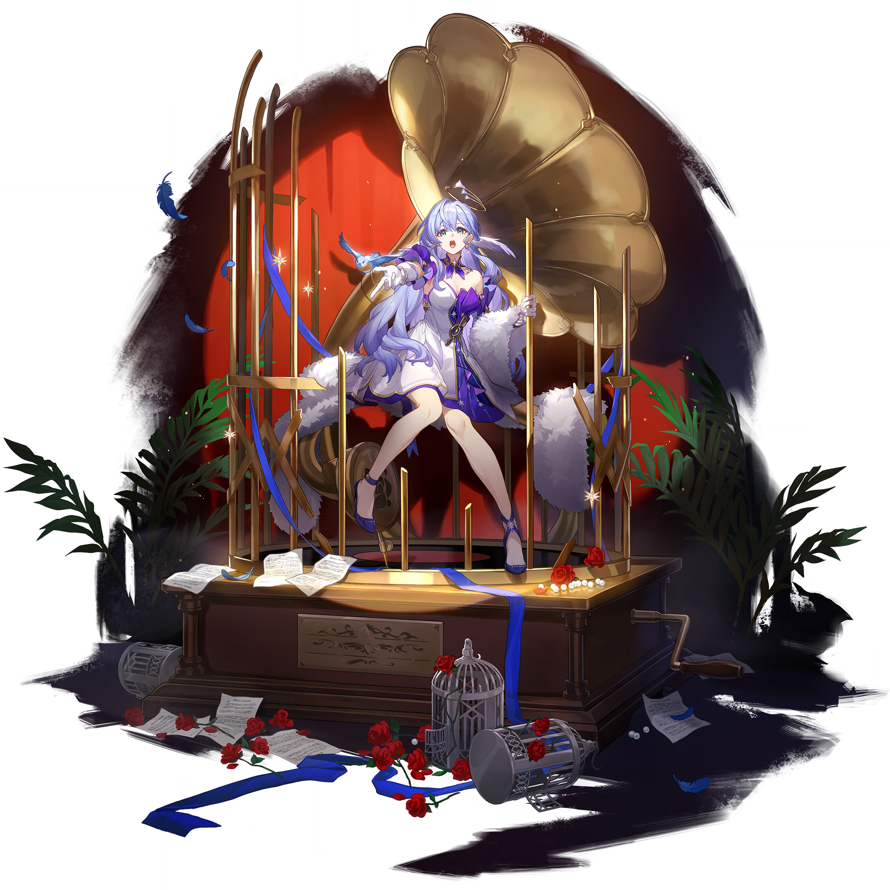
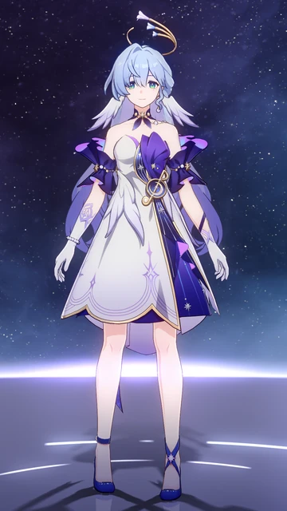
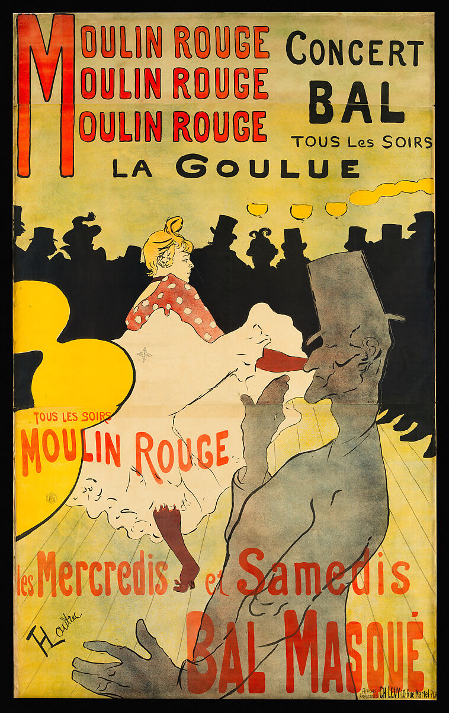
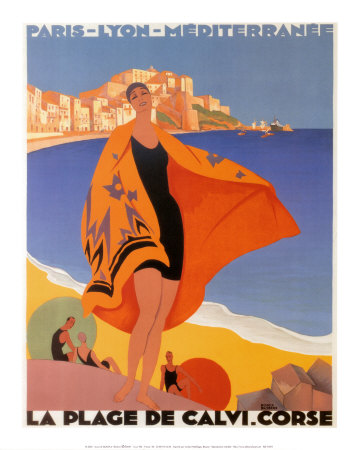

# 知更鸟·晴歌 Robin · Sunny Song — 2026.08.15

> 视频类型：A · 角色单人壁纸合集
> 角色来源：崩坏：星穹铁道 4.5「挥掷千星的筹码」· SP形态新角色
> 身份：匹诺康尼梦境歌姬 / 同谐命途歌者 / 晴歌SP——盛夏海滨音乐节主题新形态
> 设计参考（四大核心人物特征，优先级最高）：①金色天使圆冠——悬浮于头顶的薄金圆环形光环；②海星发饰——点缀于极长浅蓝薰衣草色发间；③左眼角下方泪痣——标志性美人痣；④后脑处一对小翅膀——装饰性小羽翼附着于后脑发际。次要服装参考：白色与淡蓝比基尼上衣（配蓝色水晶宝石）、腰间向日葵装饰、蓝色渐变星纹裙摆、白色绑带凉鞋、手持麦克风、金色音符飘带与蓝色蝴蝶围绕、白色小兔同伴弹奏粉色吉他
> 热点背景：崩铁4.5版本前瞻特别节目于8月14日（昨日）播出，SP角色知更鸟·晴歌首次公开，版本主题以盛夏海滨音乐节为核心舞台；前瞻直播为SKILL.md定义的最高优先级热点，且直播后24-48小时为社区二创与讨论峰值窗口
> 选角理由：官方热点权重最高——前瞻直播昨日播出，4.5版本全新SP角色首曝，讨论窗口正处于峰值；社区热度突出——知更鸟本身为崩铁顶流人气角色（歌手身份、匹诺康尼核心NPC、与流萤姐妹关系、跨媒体虚拟演唱会），SP盛夏海滨音乐节形态引发大量讨论与二创期待；时事节点——今日8月15日距前瞻直播仅1天，距版本上线约2周，为壁纸内容蹭热度黄金窗口；覆盖缺口——工作区崩铁仅有海瑟音与姬子启行两个角色，知更鸟及其SP形态完全未覆盖。

# 必需

Refer to the attached reference image (Figure 1). Generate a similar style image of Robin (Sunny Song SP variant) from Honkai: Star Rail sitting casually in front of a bold graffiti wall. Robin is seated in a relaxed but confident posture, leaning back against the graffiti wall with one knee raised and that foot planted flat on the ground, her other leg stretched out casually but angled slightly to the side rather than pointing directly at the camera so that both legs and both feet remain fully visible in frame, her body language calm, controlled, and slightly provocative. Her expression should show cold, disdainful eyes, aloof, sharp, and superior, as if she is silently judging the viewer.

Keep Robin's recognizable features: her four defining character features — a thin golden circular halo (angel-like ring crown) floating above her head, a starfish hair ornament nestled in her very long light-blue lavender hair that cascades past her waist, a delicate tear mole (beauty mark) under the outer corner of her left eye, and a pair of small decorative wings attached to the back of her head at the hairline. Her eyes are her signature bright gaze but here turned cold and dismissive. Blend her canonical design with a modern edgy streetwear aesthetic: she wears a white cropped tube top with a blue butterfly print, an open cropped denim jacket with gold chain details draped loosely off one shoulder, a high-waisted black pleated mini skirt with a thin gold chain belt, and sheer lavender thigh-high stockings with a single delicate gold band at the top. Her feet rest in chunky white platform sneakers with gold accents. Layered gold necklaces with a small starfish pendant, a choker with a tiny halo charm, and multiple thin bracelets on one wrist complete the look. Preserve her identity while giving her a fresh urban street-style look.

The graffiti wall behind her should be vivid and layered, full of expressive abstract shapes and energetic street-art textures in blue, lavender, and gold tones, with graffiti elements including stylized "ROBIN" lettering in flowing script, a large golden halo symbol spray-painted beside her head, starfish and musical note motifs, blue butterfly stencils, and dripping paint effects. A few spray paint cans in blue, gold, and lavender sit casually on the ground beside her. The wall surface shows realistic cracked concrete and layered paint texture, with subtle neon light reflections casting a cool blue glow across the scene. Add subtle golden music note ribbons drifting lazily in the air and a few luminous blue butterflies hovering near her halo, reinforcing her identity without softening the mood.

Use a wide cinematic framing suitable for a 16:9 wallpaper, with Robin as the main focal point while still showing enough of the graffiti wall and surrounding urban environment for atmosphere. The mood should feel cool, stylish, intimidating, and mysterious. Highly detailed background, rich shadows, blue and gold glowing highlights, sharp focus on Robin, and a refined high-end anime illustration look. Both of her legs are fully visible from hip to ankle with natural knee joints and correct leg proportions, and both feet are clearly rendered inside the frame.

Negative Prompt: low quality, worst quality, blurry, pixelated, bad anatomy, bad hands, extra fingers, fewer fingers, missing fingers, fused fingers, webbed fingers, merged fingers, overlapping fingers, deformed fingers, mutated fingers, six fingers, four fingers, three fingers, more than five fingers, less than five fingers, disfigured hands, poorly drawn hands, bad hand anatomy, asymmetrical hands, broken fingers, claw hands, blurry hands, indistinct fingers, smeared hands, missing legs, one leg, extra legs, fused legs, legs merged together, deformed legs, twisted legs, short legs, malformed legs, bad feet, missing feet, extra feet, fused feet, deformed feet, feet out of frame, cropped feet, unequal leg length, extra limbs, chibi, childish, wrong hair color, wrong eye color, missing golden halo, missing starfish hair ornament, missing tear mole, missing head wings, missing small wings at back of head, standing, standing pose, upright posture, singing, open mouth singing, warm smile, gentle smile, cheerful expression, cute expression, adorable, sweet, innocent, game canonical outfit, official costume, SP summer outfit, bikini, fantasy dress, medieval clothing, armor, full gown, formal dress, beach background, ocean background, nature background, indoor background, plain background, minimal background, missing graffiti wall, low detail graffiti, generic graffiti, wrong graffiti colors, wrong streetwear, missing crop top, missing jacket, missing shorts, missing skirt, long dress, full pants, business suit, school uniform, casino theme, gambling elements, dice, roulette, playing cards, casino chips, text, watermark, logo, signature.

# 人物设定

## 1 — 晴歌初鸣·海滨主舞台（SP形态首秀）

Positive Prompt:

16:9 wallpaper, Robin (Sunny Song SP) from Honkai: Star Rail, highly detailed anime-style illustration, polished game-art quality, magnificent summer beach music festival atmosphere, cinematic golden-hour lighting, azure and gold and lavender color palette.

Depict Robin stepping onto the main stage of a grand summer beach music festival, her SP Sunny Song form revealed for the first time. Her four defining features are unmistakable: a thin golden circular halo — an angel-like ring crown — floats above her head, emitting a soft warm glow; a starfish hair ornament is nestled among the waves of her very long light-blue lavender hair that cascades past her waist; a delicate tear mole sits beneath the outer corner of her left eye, marking her signature beauty; a pair of small decorative wings are attached to the back of her head at the hairline, rendered clearly and visibly. Her bright eyes gaze toward the distant ocean horizon with a singer's stage confidence — poised, magnetic, and luminous. She wears her SP summer outfit and holds a microphone in one hand, the other arm extended in a welcoming gesture toward the audience, perfect hands, five fingers on each hand, well-defined fingers, natural confident gesture. Golden musical note ribbons spiral around her, and blue butterflies flutter in the updraft.

The beach stage behind her is vast and dreamlike: a semicircular platform of white marble and translucent crystal built directly on the golden sand, towering speaker pillars wrapped in blue ribbons, floating dream-bubbles carrying tiny constellations drifting across the venue, a massive audience stretching along the shoreline softly blurred in the background. The sky is a gradient of warm gold, coral, and lavender at sunset, with the ocean shimmering in azure and teal. Blue butterflies and golden music notes float between the stage and the sea. Epic wide composition with Robin as the unmistakable focal point, warm spotlight on her, cool blue ambient ocean glow surrounding.

Negative Prompt:

low quality, blurry, bad anatomy, bad hands, extra fingers, fewer fingers, missing fingers, fused fingers, webbed fingers, merged fingers, overlapping fingers, deformed fingers, mutated fingers, six fingers, four fingers, three fingers, more than five fingers, less than five fingers, disfigured hands, poorly drawn hands, bad hand anatomy, asymmetrical hands, broken fingers, claw hands, blurry hands, indistinct fingers, smeared hands, extra limbs, chibi style, flat lighting, casino interior, gambling elements, dice, roulette wheel, playing cards, casino chips, wrong hair color, wrong eye color, missing golden halo, missing starfish hair ornament, missing tear mole, missing head wings, missing small wings at back of head, winter clothing, full medieval armor, multiple fully rendered characters, text, watermark.

## 2 — 碧波浅滩·知更鸟的午后（海滨日常·反差萌）

Positive Prompt:

16:9 wallpaper, Robin (Sunny Song SP) from Honkai: Star Rail, highly detailed anime-style illustration, crystal-blue shallow beach atmosphere, bright golden afternoon light, playful and relaxing mood, polished character art.

Depict Robin in her SP summer form wading barefoot in the gentle shallows of a turquoise lagoon. Her four defining features are all clearly visible: a thin golden circular halo floats above her head, shimmering in the tropical sun; a starfish hair ornament is pinned among the waves of her very long light-blue lavender hair, which trails partially in the water, the tips floating on the surface; a tear mole sits beneath the outer corner of her left eye; a pair of small decorative wings are attached to the back of her head at the hairline, visible from this three-quarter rear angle. Her expression is a warm unguarded smile — the private Robin that nobody on the express has seen. She wears her SP summer outfit, the skirt hem dripping seawater. She holds a microphone loosely in one hand as if she had been singing to the ocean moments ago, the other hand shades her eyes from the sun, perfect hands, five fingers on each hand, well-defined fingers, natural relaxed gesture. Blue butterflies rest on the water's surface nearby, and golden music notes drift lazily in the air.

The lagoon is dreamlike: smooth white sand visible through crystal-clear shallow water, floating pool loungers shaped like musical notes, translucent bubbles carrying tiny star constellations drifting across the water, distant tropical islands in soft focus. A small table on the beach holds a vintage radio playing soft music and a white towel folded into a rabbit shape. Warm sunlight, cool blue reflections, and a few blue feathers floating on the water surface. Medium-wide composition with Robin on the right third, the lagoon and horizon on the left.

Negative Prompt:

low quality, blurry, bad anatomy, bad hands, extra fingers, fewer fingers, missing fingers, fused fingers, webbed fingers, deformed fingers, six fingers, four fingers, disfigured hands, poorly drawn hands, extra limbs, chibi, combat outfit, weapon, aggressive expression, dark atmosphere, winter scene, heavy clothing, full performance gown, casino interior, gambling elements, dice, roulette, playing cards, casino chips, missing golden halo, missing starfish hair ornament, missing tear mole, missing head wings, missing small wings at back of head, multiple characters, text, watermark, wrong hair color.

## 3 — 落日码栈·海滨木道漫步（黄昏散步·氛围感）

Positive Prompt:

16:9 wallpaper, Robin (Sunny Song SP) from Honkai: Star Rail, highly detailed anime-style illustration, dreamy seaside boardwalk at golden hour, warm amber and lavender sunset light, romantic and serene mood, polished character art.

Depict Robin walking along a wooden seaside boardwalk at golden hour. Her four defining features are all rendered with care: a thin golden circular halo floats above her head, glowing warmly against the sunset sky; a starfish hair ornament is nestled among the flowing waves of her very long light-blue lavender hair, which streams behind her in the ocean breeze; a tear mole is visible beneath the outer corner of her left eye as she turns her head slightly toward the viewer with a soft, knowing smile; a pair of small decorative wings are attached to the back of her head at the hairline, catching the golden light. She wears her SP summer outfit. She holds a microphone in one hand resting against her shoulder, the other hand reaches out to let a blue butterfly land on her fingertip, perfect hands, five fingers on each hand, well-defined fingers, natural graceful gesture. Golden music note ribbons drift on the breeze around her.

The boardwalk stretches along a coastline of golden sand and turquoise water, with string lights and paper lanterns just beginning to glow as dusk approaches. On one side, the ocean stretches to a horizon painted in gold, coral, and deep lavender; on the other, beachside market stalls with white curtains, flowers, and vintage radios playing soft music line the walkway. Blue butterflies drift between the lanterns. A small white rabbit with a pink guitar sits on a bench in the background, watching her pass. Wide cinematic composition with Robin on the left third, the ocean and sunset filling the right and upper frame. Golden hour lighting, lens flare.

Negative Prompt:

low quality, blurry, bad anatomy, bad hands, extra fingers, fewer fingers, missing fingers, fused fingers, webbed fingers, deformed fingers, six fingers, four fingers, disfigured hands, poorly drawn hands, extra limbs, chibi, combat scene, weapon, bright midday daylight, casino interior, gambling elements, dice, roulette, playing cards, casino chips, neon cyberpunk, dark horror atmosphere, multiple fully rendered characters, wrong hair color, missing golden halo, missing starfish hair ornament, missing tear mole, missing head wings, missing small wings at back of head, winter coat, formal gown, text, watermark.

## 4 — 星空海滨露天舞台·夏夜独唱（演唱会场景·星空下）

Positive Prompt:

16:9 wallpaper, Robin (Sunny Song SP) from Honkai: Star Rail, highly detailed anime-style illustration, open-air beach concert stage under a starry summer night sky, dreamy midnight-blue and silver and gold atmosphere, polished game-art quality, cinematic spotlight effects.

Depict Robin performing on a magnificent circular stage of white marble and translucent crystal built directly on the beach sand, the ocean stretching endlessly behind her under a canopy of stars. Her four defining features blaze in the spotlight: a thin golden circular halo floats above her head, radiating a warm ethereal glow that blends with the starlight; a starfish hair ornament shimmers among the waves of her very long light-blue lavender hair, which lifts and flows in the sea breeze; a tear mole is visible beneath the outer corner of her left eye, her eyes closed in passionate song, lips slightly parted; a pair of small decorative wings are attached to the back of her head at the hairline, silhouetted against the starry sky. One hand holds a sleek silver microphone shaped like a curling wave, the other arm is extended in a sweeping conductor's gesture, perfect hands, five fingers on each hand, well-defined fingers, natural expressive hand pose. She wears her SP summer outfit, the skirt billowing in the wind like seafoam. Golden music note ribbons spiral upward around her in the updraft, and blue butterflies dance in the spotlight beams.

The stage is ringed by floating speaker pillars wrapped in blue ribbons and orbiting blue butterfly motes. Below and beyond, a vast moonlit ocean stretches to the horizon, with the reflections of a million stars shimmering on its surface. Distant beachside resort lights twinkle along the coast. Above, the sky is a deep midnight-blue canvas where the stars form the musical notation of her song. A small white rabbit companion sits at the stage edge, strumming a tiny pink guitar in accompaniment. Centered composition with Robin at the focal point, the ocean and sky providing vast negative space, dramatic upward energy from the spotlight beam.

Negative Prompt:

low quality, blurry, bad anatomy, bad hands, extra fingers, fewer fingers, missing fingers, fused fingers, webbed fingers, deformed fingers, six fingers, four fingers, disfigured hands, poorly drawn hands, extra limbs, chibi, daytime, indoor concert hall, modern LED screens, generic pop star, casino theme, gambling elements, dice, roulette, playing cards, casino chips, wrong hair color, missing golden halo, missing starfish hair ornament, missing tear mole, missing head wings, missing small wings at back of head, aggressive expression, combat pose, multiple characters, fire effects, text, watermark.

## 5 — 椰林海滩·日光下的旋律（热带午后·明快色调）

Positive Prompt:

16:9 wallpaper, Robin (Sunny Song SP) from Honkai: Star Rail, highly detailed anime-style illustration, tropical palm-fringed beach at midday, vivid turquoise and white and gold palette, bright cheerful summer atmosphere, polished character art.

Depict Robin sitting on a woven beach mat beneath the shade of palm trees at the edge of a pristine white-sand beach, her legs stretched out before her. Her four defining features are all present and clearly detailed: a thin golden circular halo floats above her head, glowing softly against the bright tropical sky; a starfish hair ornament is pinned among the waves of her very long light-blue lavender hair, which spills across the mat behind her in a shimmering cascade; a tear mole sits beneath the outer corner of her left eye, her expression bright and carefree with a genuine laugh; a pair of small decorative wings are attached to the back of her head at the hairline. She wears her SP summer outfit. One hand holds a microphone resting in her lap, the other hand holds a tropical drink with a sunflower garnish, perfect hands, five fingers on each hand, well-defined fingers, natural relaxed gesture. Blue butterflies rest on nearby palm fronds, and golden music notes shimmer in the warm air.

The beach behind her is paradise: tall coconut palms casting dappled shade, crystal-clear turquoise water lapping at white sand, floating translucent bubbles carrying tiny constellations, and a distant tropical island on the horizon. A small white rabbit companion sits beside her, wearing tiny sunglasses and holding a pink ukulele. Vibrant hibiscus flowers in coral and gold bloom at the palm tree bases. Medium-full body composition with Robin centered, the ocean and palms framing her. Bright natural daylight, vivid saturated colors.

Negative Prompt:

low quality, blurry, bad anatomy, bad hands, extra fingers, fewer fingers, missing fingers, fused fingers, webbed fingers, deformed fingers, six fingers, four fingers, disfigured hands, poorly drawn hands, extra limbs, chibi, casino interior, gambling elements, dice, roulette, playing cards, casino chips, night scene, dark atmosphere, heavy winter coat, formal gown, multiple characters, aggressive expression, combat outfit, weapon, missing golden halo, missing starfish hair ornament, missing tear mole, missing head wings, missing small wings at back of head, wrong hair color, text, watermark.

## 6 — 礁岩灯塔·海风中的回响（海岸礁石·诗意场景）

Positive Prompt:

16:9 wallpaper, Robin (Sunny Song SP) from Honkai: Star Rail, highly detailed anime-style illustration, dramatic coastal cliff and lighthouse at blue hour, deep teal and gold and lavender palette, windswept and poetic atmosphere, polished character art.

Depict Robin standing on a rocky cliff edge beside a white lighthouse at blue hour, the ocean wind whipping around her. Her four defining features are all rendered with meticulous clarity against the dramatic sky: a thin golden circular halo floats above her head, its glow warm against the deepening twilight; a starfish hair ornament is held among the strands of her very long light-blue lavender hair, which blows dramatically behind her in the coastal gust; a tear mole sits beneath the outer corner of her left eye, visible as she turns her face into the wind with a serene, almost melancholic expression — the look of a singer remembering a song she has not yet written; a pair of small decorative wings are attached to the back of her head at the hairline, buffeted by the wind. She wears her SP summer outfit, the skirt snapping and billowing. One hand grips the lighthouse railing, the other holds a microphone to her lips as if singing to the sea, perfect hands, five fingers on each hand, well-defined fingers, natural dramatic gesture. Golden music note ribbons stream horizontally in the gale around her, and blue butterflies struggle against the wind, their wings catching the lighthouse beam.

The cliff drops sheer to a churning teal ocean below, waves crashing against dark rocks and sending spray upward. The white lighthouse beside her casts its rotating golden beam across the water. The sky is a gradient of deep teal, dusty lavender, and the last ribbon of gold at the horizon. Distant lighthouses on other headlands twinkle faintly. Blue butterflies cluster on the lee side of the rocks. A small white rabbit companion huddles in a sheltered nook, clutching a pink guitar. Wide cinematic composition with Robin on the right third, the lighthouse and ocean filling the left frame. Dramatic blue-hour lighting, atmospheric perspective, sea spray.

Negative Prompt:

low quality, blurry, bad anatomy, bad hands, extra fingers, fewer fingers, missing fingers, fused fingers, webbed fingers, deformed fingers, six fingers, four fingers, disfigured hands, poorly drawn hands, extra limbs, chibi, bright cheerful daylight, casino interior, gambling elements, dice, roulette, playing cards, casino chips, neon cyberpunk, indoor scene, peaceful mood, flat lighting, missing golden halo, missing starfish hair ornament, missing tear mole, missing head wings, missing small wings at back of head, wrong hair color, winter coat, formal gown, multiple characters, text, watermark.

## 7 — 白帆游轮·甲板上的海风（日常反差萌·夏日游轮）

Positive Prompt:

16:9 wallpaper, Robin (Sunny Song SP) from Honkai: Star Rail, highly detailed anime-style illustration, bright Mediterranean seascape, summer yacht deck, warm golden sunlight, breezy and carefree atmosphere, polished character art.

Depict Robin on the deck of a white-sailed dream yacht cruising across a turquoise sea, leaning against the railing with her arms crossed, her very long light-blue lavender hair streaming dramatically in the ocean wind. Her four defining features are all visible: a thin golden circular halo floats above her head, catching the golden-hour sunlight; a starfish hair ornament is nestled among her windblown hair, barely holding on against the breeze; a tear mole sits beneath the outer corner of her left eye, visible as her eyes are closed in pure contentment with a serene smile; a pair of small decorative wings are attached to the back of her head at the hairline, wind-ruffled and catching the light. She wears her SP summer outfit, the skirt fluttering in the breeze. One hand loosely holds a straw sunhat against the wind, the other dangles her sandals by their straps, perfect hands, five fingers on each hand, well-defined fingers, natural relaxed gesture. A few blue butterflies escape from her hair and drift away on the breeze, and golden music notes shimmer in the sea spray.

The yacht deck behind her shows polished teak wood, coiled rope, and a small table with a half-eaten tropical fruit plate and a vintage radio playing soft jazz. Beyond the railing, an endless turquoise sea meets a gradient sky of lavender, gold, and pale blue at golden hour. Distant white-sailed ships and a faint outline of a tropical coastline are visible on the horizon. A small white rabbit companion sits on the bow, wearing a tiny captain's hat beside a pink guitar. The mood is of a performer who has finally found a moment where nobody is watching, and she is simply happy. Wide cinematic composition with Robin on the right third, the vast seascape filling the left and upper frame. Golden hour lighting, lens flare.

Negative Prompt:

low quality, blurry, bad anatomy, bad hands, extra fingers, fewer fingers, missing fingers, fused fingers, webbed fingers, deformed fingers, six fingers, four fingers, disfigured hands, poorly drawn hands, extra limbs, chibi, combat outfit, weapon, casino interior, gambling elements, dice, roulette, playing cards, casino chips, night scene, dark atmosphere, heavy winter coat, formal gown, multiple characters, stormy weather, missing golden halo, missing starfish hair ornament, missing tear mole, missing head wings, missing small wings at back of head, wrong hair color, text, watermark.

## 8 — 千星坠落·晴歌觉醒（SP变身·觉醒场景）

Positive Prompt:

16:9 wallpaper, Robin (Sunny Song SP) from Honkai: Star Rail, highly detailed anime-style illustration, dramatic transformation scene, cosmic and ethereal atmosphere, polished game-art quality, cinematic epic scale.

Depict the moment Robin's SP Sunny Song form awakens. She hovers suspended in mid-air at the center of a vast dream-space above the ocean, her body arched slightly backward, arms spread wide, fingers extended, perfect hands, five fingers on each hand, well-defined fingers. Her very long light-blue lavender hair lifts and fans outward in a radial cascade, each strand catching and refracting light like fiber-optic threads. All four of her defining features blaze with awakening power: the thin golden circular halo above her head blazes with radiant golden light, expanding and pulsing with each note of an unseen melody; the starfish hair ornament glows with bioluminescent blue light among her spreading hair; a tear mole sits beneath the outer corner of her left eye, her eyes open but unfocused, gazing into a light only she can see, her expression one of a singer reaching the highest note of her life — transcendence rather than strain; a pair of small decorative wings at the back of her head unfold and spread wide, radiating soft golden light feathers, growing luminous with the transformation energy. Her outfit materializes around her in cascading light particles.

Around her, an enormous cosmic phenomenon unfolds over the ocean: a giant translucent staff of golden light stretches across the sky, musical notes made of stars cascading downward like a meteor shower, dissolving into blue butterfly motes as they approach her body. Thousands of golden music notes cascade downward, transforming into blue butterflies as they fall. Below, the surface of the ocean reflects the entire scene like a mirror. Above, the sky transitions from deep cosmic indigo at the edges to radiant gold and lavender-white at the center where Robin hovers. Dynamic radial composition with Robin at the exact center, all energy flowing inward and outward simultaneously. Epic, transcendent, the birth of a new song.

Negative Prompt:

low quality, blurry, bad anatomy, bad hands, extra fingers, fewer fingers, missing fingers, fused fingers, webbed fingers, merged fingers, overlapping fingers, deformed fingers, mutated fingers, six fingers, four fingers, three fingers, more than five fingers, less than five fingers, disfigured hands, poorly drawn hands, bad hand anatomy, asymmetrical hands, broken fingers, claw hands, blurry hands, indistinct fingers, smeared hands, extra limbs, stiff pose, weak motion, flat effects, static composition, indoor casino, gambling elements, dice, roulette, playing cards, casino chips, casual scene, chibi, cheerful expression, fire effects, horror mood, gore, wrong outfit, missing golden halo, missing starfish hair ornament, missing tear mole, missing head wings, missing small wings at back of head, wrong hair color, text, watermark.

# 参考图

## 9（参考立绘生成演出场景）

Refer to the attached splash art of Robin. Generate a dynamic 16:9 2K wallpaper of her in her SP Sunny Song form performing on a grand beachside concert stage at a summer music festival. She stands atop a grand piano that doubles as a fountain — water cascading from its keys like a waterfall of music, pooling around her bare feet. Her four defining features are all unmistakably present: a thin golden circular halo floats above her head, blazing with stage-light radiance; a starfish hair ornament shimmers among her very long light-blue lavender hair, which whips in a dramatic arc in the sea breeze; a tear mole is visible beneath the outer corner of her left eye, her eyes blazing with stage-light intensity as she sings into a microphone; a pair of small decorative wings are attached to the back of her head at the hairline, catching the spotlight. She wears her SP summer outfit, the skirt billowing in the updraft of golden music notes erupting from the piano-fountain below. One hand grips a microphone stand, the other is flung outward toward the audience, perfect hands, five fingers on each hand, well-defined fingers. Golden music note ribbons and blue butterflies spiral upward around her. The festival audience is a crowd of silhouetted figures on the beach, holding glowing blue light-sticks aloft. The sky above is a golden sunset gradient with the ocean stretching to the horizon. Cinematic, epic scale, dramatic spotlight from directly above, golden and blue and lavender color palette.

Negative Prompt: low quality, blurry, bad anatomy, bad hands, extra fingers, fewer fingers, missing fingers, fused fingers, webbed fingers, merged fingers, overlapping fingers, deformed fingers, mutated fingers, six fingers, four fingers, three fingers, more than five fingers, less than five fingers, disfigured hands, poorly drawn hands, bad hand anatomy, asymmetrical hands, broken fingers, claw hands, blurry hands, indistinct fingers, smeared hands, extra limbs, stiff pose, flat background, indoor scene, casino interior, gambling elements, dice, roulette, playing cards, casino chips, peaceful mood, chibi, wrong outfit, cheerful expression, fire effects, missing golden halo, missing starfish hair ornament, missing tear mole, missing head wings, missing small wings at back of head, wrong hair color, text, watermark.

## 10（参考立绘·手机竖屏壁纸）

Refer to the attached portrait of Robin. Resize and adapt this image composition into a 9:16 2K resolution mobile wallpaper format featuring her SP Sunny Song form. Expand the background upward and downward — extend the light-blue lavender flowing hair upward with golden music notes and blue butterflies drifting into a starry summer-night sky, and show her full SP summer outfit details and the ornate beach-stage floor below. Her four defining features must all be clearly visible: a thin golden circular halo floats above her head, glowing softly; a starfish hair ornament is nestled in her hair; a tear mole sits beneath the outer corner of her left eye; a pair of small decorative wings are attached to the back of her head at the hairline. She stands at a slight three-quarter angle, one hand near her lips in a contemplative singing gesture, the other holding a single blue butterfly, perfect hands, five fingers on each hand, well-defined fingers. She wears her SP summer outfit. Maintain the same art style, lavender-blue-gold color palette, and level of detail as the reference. The character should be centered with comfortable spacing on all sides for mobile screen use, with the stage spotlight creating a warm golden halo around her hair.

Negative Prompt: low quality, blurry, cropped, bad anatomy, bad hands, extra fingers, fewer fingers, missing fingers, fused fingers, webbed fingers, merged fingers, overlapping fingers, deformed fingers, mutated fingers, six fingers, four fingers, three fingers, more than five fingers, less than five fingers, disfigured hands, poorly drawn hands, bad hand anatomy, asymmetrical hands, broken fingers, claw hands, blurry hands, indistinct fingers, smeared hands, wrong character, different art style, different color palette, different pose, missing golden halo, missing starfish hair ornament, missing tear mole, missing head wings, missing small wings at back of head, casino theme, gambling elements, text, watermark.

# 跨领域参考图

## 11（参考Vintage海滨音乐节海报·波西米亚风格融合）

Positive Prompt:

16:9 wallpaper, Robin (Sunny Song SP) from Honkai: Star Rail, highly detailed illustration blending anime character design with vintage bohemian beach-music-festival poster style, bold flat color blocks, dynamic composition, nostalgic summer atmosphere, polished character art.

Refer to the attached vintage bohemian poster style artwork. Recreate its vibrant poster aesthetic with Robin as the central performer figure. She stands on a small beach stage at a summer music festival, captured mid-song in a dynamic, slightly exaggerated pose — one arm thrust upward holding a microphone, the other swept outward, perfect hands, five fingers on each hand, well-defined fingers, dramatic theatrical gesture. Her four defining features are all rendered clearly even in poster style: a thin golden circular halo floats above her head, rendered as a bold flat golden ring; a starfish hair ornament is pinned among her very long light-blue lavender hair, rendered in bold sweeping strokes of flat lavender and blue; a tear mole is rendered as a single bold dark dot beneath the outer corner of her left eye, her eyes simplified into bold glowing shapes with a knowing, joyful glance toward the viewer; a pair of small decorative wings are attached to the back of her head at the hairline, rendered as bold flat wing shapes. Her SP summer outfit is reinterpreted in vintage poster style: bold flat shapes of white, blue, and gold.

Crucially, blend two art styles: Robin's face and hair should retain anime character design clarity (clean features, distinctive light-blue lavender hair, golden halo, starfish ornament, tear mole, small head wings), but her outfit, the stage, and the entire environment should be rendered in a vintage bohemian poster style — bold flat color blocks, visible brush texture, dynamic exaggerated silhouettes, and a warm summer palette of coral, turquoise, mustard yellow, and sandy gold. The beach background: silhouetted festivalgoers in floppy hats and flowing garments, hanging paper lanterns, a draped festival banner, and abstract musical motifs — guitars, microphones, butterflies, and sunflowers — all rendered as flat poster shapes. The overall effect should feel like a vintage summer beach music festival poster from an alternate era where anime songstresses and bohemian shorelines coexist.

Negative Prompt:

low quality, blurry, bad anatomy, bad hands, extra fingers, fewer fingers, missing fingers, fused fingers, webbed fingers, deformed fingers, six fingers, four fingers, disfigured hands, poorly drawn hands, extra limbs, fully photorealistic, fully 3D rendered, flat digital art with no painterly texture, modern background, casino interior, gambling elements, dice, roulette, playing cards, casino chips, combat scene, weapon drawn, harsh neon lighting, chibi style, wrong character, wrong hair color, missing golden halo, missing starfish hair ornament, missing tear mole, missing head wings, missing small wings at back of head, bright cheerful daylight without poster aesthetic, generic anime style with no poster aesthetic, text, watermark.

## 12（参考1920s Art Deco海滨音乐节海报·装饰艺术美学）

Positive Prompt:

16:9 wallpaper, Robin (Sunny Song SP) from Honkai: Star Rail, highly detailed illustration blending anime character design with 1920s Art Deco poster aesthetic, symmetrical geometric composition, luxurious gold and blue and lavender palette, polished character art.

Refer to the attached Art Deco poster style artwork. Recreate its symmetrical geometric grandeur with Robin as the central figure in a summer beach music festival promotional poster. She stands in a perfect symmetrical frontal pose at the center of the composition, her body forming an elegant elongated vertical line typical of Art Deco fashion illustrations. Her four defining features are all rendered as Art Deco motifs: a thin golden circular halo floats above her head, stylized as a bold geometric golden ring — perfectly symmetrical and radiant, doubling as an Art Deco sunburst motif; a starfish hair ornament is rendered as a bold geometric five-pointed star among her very long light-blue lavender hair, which is stylized into sleek geometric waves; a tear mole is rendered as a precise single dark dot beneath the outer corner of her left eye, her eyes rendered as bold almond shapes with Art Deco eyeliner, gazing directly at the viewer with serene confidence; a pair of small decorative wings are attached to the back of her head at the hairline, stylized as symmetrical geometric wing motifs. Her SP summer outfit is reinterpreted as a 1920s flapper-meets-beach design with geometric styling. Her hands rest symmetrically on her hips, perfect hands, five fingers on each hand, well-defined fingers, geometric stylized pose.

The background is a masterpiece of Art Deco beach design: symmetrical golden geometric arches framing Robin, stylized ocean waves as geometric horizontal bands, sunburst patterns radiating behind her head from the halo, starfish and sunflower motifs integrated into the geometric border patterns, and step-pattern borders in gold, blue, and lavender. Everything is rendered in the flat, bold, geometric Art Deco style — but Robin's face retains her anime character design clarity with the golden halo, starfish hair ornament, tear mole, and small head wings all clearly visible. The fusion should feel like a vintage summer beach music festival grand-opening poster from a 1920s that never was, where Art Deco met anime and the ocean. Symmetrical centered composition, luxurious, timeless, and stunningly elegant.

Negative Prompt:

low quality, blurry, bad anatomy, bad hands, extra fingers, fewer fingers, missing fingers, fused fingers, webbed fingers, deformed fingers, six fingers, four fingers, disfigured hands, poorly drawn hands, extra limbs, fully photorealistic, fully 3D rendered, flat digital art with no geometric structure, modern background, casino interior, gambling elements, dice, roulette, playing cards, casino chips, combat scene, weapon drawn, harsh neon lighting, chibi style, wrong character, wrong hair color, missing golden halo, missing starfish hair ornament, missing tear mole, missing head wings, missing small wings at back of head, asymmetrical composition, messy organic shapes, text, watermark, logo.
