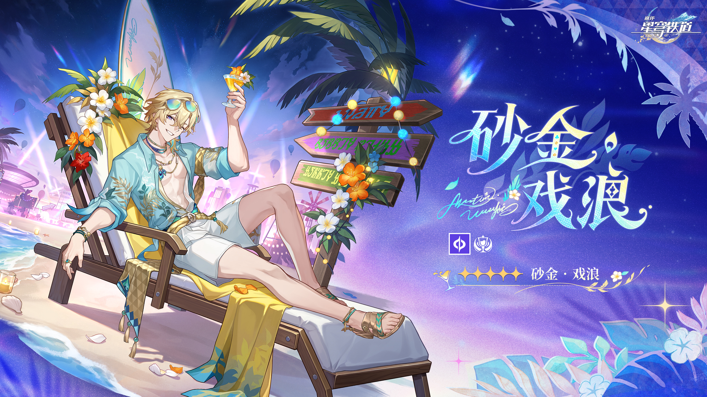
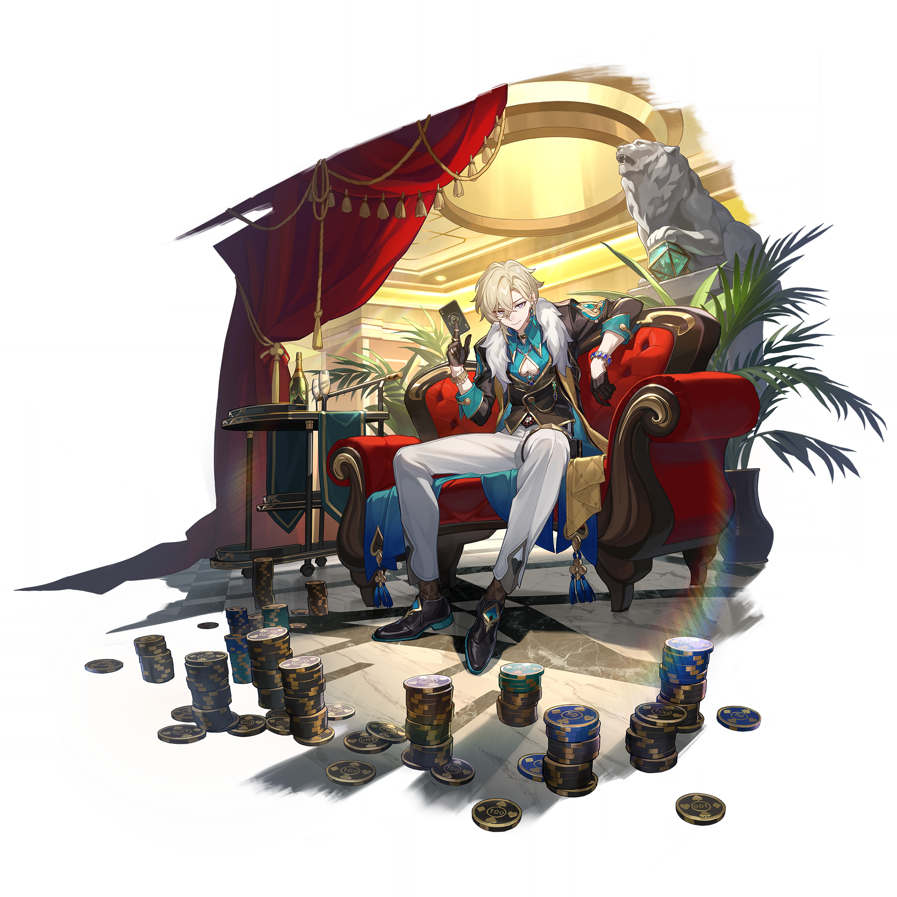

# 砂金·戏浪 Aventurine: Wavechaser — 2026.08.17
> 视频类型：A · 角色单人壁纸合集
> 角色来源：崩坏星穹铁道 4.5 · 五星量子属性欢愉命途（SP限定）
> 身份：星际和平公司战略投资部高级干部 / 石心十人之一 / 原名卡卡瓦夏
> 称号：砂金·戏浪（Aventurine: Wavechaser）
> 设计参考：热带度假海滩风、豪华赌场文化反差（正装→花衬衫度假风）
> 热点背景：4.5版本前瞻直播8月14日刚结束（距今3天），SP砂金·戏浪作为4.5限定五星正式公布，热度极高；砂金本身是崩铁人气TOP3男角色，SP泳装度假造型引爆社区讨论
> 今日特殊：4.5版本即将上线，SP角色首次官方展示后持续发酵期

# 必需

Refer to the attached reference image (Figure 1). Generate a similar style image of Aventurine: Wavechaser (SP砂金·戏浪) from Honkai: Star Rail sitting on a weathered concrete block in front of a bold graffiti wall with a relaxed, effortlessly charming smirk, one hand raised holding a tropical cocktail with a tiny umbrella and orange slice garnish, the other hand resting casually on his knee. He is wearing modern beach-street fashion: an oversized aqua-blue Hawaiian shirt with golden tropical leaf prints left completely open revealing his toned chest, white linen drawstring shorts rolled up above the knee, layered gold chain necklaces (three tiers — choker, mid-length pendant, and long chain), teal-and-gold beaded anklets on both feet, strappy brown leather sandals, and teal-framed sunglasses pushed up into his messy golden-blonde hair. Keep his recognizable SP design features: short tousled golden-blonde hair with sun-kissed highlights swept to the right, bright teal-blue eyes with a mischievous glint, youthful handsome face with a confident playboy smile showing slight teeth. The graffiti wall behind him should feature turquoise, gold, and coral-colored tropical motifs — surfboards, palm trees, stylized wave patterns, poker card suit symbols (spades and diamonds) hidden among the tropical art, and neon cocktail glass illustrations. A white surfboard with golden stripe decals leans against the wall beside him. 16:9 2K wallpaper format. perfect hands, five fingers on each hand, anatomically correct hands, well-defined fingers, natural hand pose, one hand holding cocktail glass elegantly.

Negative Prompt: low quality, worst quality, blurry, pixelated, bad anatomy, bad hands, extra fingers, fewer fingers, missing fingers, fused fingers, webbed fingers, merged fingers, overlapping fingers, deformed fingers, mutated fingers, six fingers, four fingers, three fingers, more than five fingers, less than five fingers, disfigured hands, poorly drawn hands, bad hand anatomy, asymmetrical hands, broken fingers, claw hands, blurry hands, indistinct fingers, smeared hands, extra limbs, chibi, childish, wrong hair color, white hair, long hair, purple eyes, formal suit, dark clothing, winter setting, snow, cold atmosphere, serious expression, female character, text, watermark, logo, signature.

# 人物设定

## 1 — 月下热带海滩派对（夜间度假主场景）

Positive Prompt:
16:9 2K wallpaper, Aventurine Wavechaser from Honkai Star Rail, highly detailed anime-style illustration, polished game-art quality, cinematic composition, tropical night beach party atmosphere, warm golden and cool moonlit dual-lighting.

Depict SP Aventurine (Wavechaser version) as the undisputed center of attention at a luxurious beachside night party on a tropical Penacony resort island. He reclines in a wooden beach lounge chair with one leg crossed over the other, his aqua-blue open Hawaiian shirt with golden tropical leaf patterns billowing gently in the warm ocean breeze, revealing his toned chest adorned with layered gold necklaces. He holds a crystal-clear martini glass in his right hand, the drink glowing faintly with a golden Quantum-element shimmer. His left arm is draped lazily over the back of the lounge chair. His expression is pure confident amusement — a playboy who owns the night, teal-blue eyes half-lidded with effortless charm, lips curved in a knowing smirk.

Keep his SP canonical design: short tousled golden-blonde hair with natural sun-bleached highlights, bright teal-blue eyes (distinct from his original purple), handsome angular face with a beauty mark near his left eye, multiple gold chain necklaces layered at different lengths, teal-and-gold beaded bracelets on both wrists, white linen shorts, strappy sandals with gold buckles, teal sunglasses pushed up on his head. His Quantum element manifests as faint golden dice-shaped light particles floating around him like fireflies.

The background is a lavish beachside party scene at night: string lights in warm gold drape between palm trees creating a canopy of light, a curved tiki bar with glowing blue-green cocktail bottles visible in the middle distance, other party guests (silhouetted and blurred) dancing on a wooden deck, the dark tropical ocean stretching to the horizon where a massive full moon hangs low casting a silver-gold reflection path across the calm water. Tiki torches line the beach edge. Hibiscus flowers and plumeria petals are scattered on the sand. A DJ booth with neon wave-pattern lights pulses in the far background.

Wide cinematic composition with Aventurine on the left third of the frame in his lounge chair, the expansive party beach scene filling the right and background. Warm golden foreground lighting from the string lights, cool blue-silver moonlight from behind. The mood is intoxicating luxury, effortless cool, and summer hedonism.

perfect hands, five fingers on each hand, anatomically correct hands, well-defined fingers, right hand holding martini glass stem between thumb and two fingers naturally.

Negative Prompt:
low quality, worst quality, blurry, bad anatomy, bad hands, extra fingers, fewer fingers, missing fingers, fused fingers, webbed fingers, merged fingers, overlapping fingers, deformed fingers, mutated fingers, six fingers, four fingers, three fingers, more than five fingers, less than five fingers, disfigured hands, poorly drawn hands, bad hand anatomy, asymmetrical hands, broken fingers, claw hands, blurry hands, indistinct fingers, smeared hands, extra limbs, wrong character, white hair, long hair, purple eyes, formal dark suit, serious brooding expression, winter/snow setting, combat pose, weapon, indoor casino, daytime bright sun, chibi style, female character, text, watermark, logo.

## 2 — 冲浪骑浪（动态水上运动）

Positive Prompt:
16:9 2K wallpaper, Aventurine Wavechaser from Honkai Star Rail, highly detailed anime-style illustration, dynamic action composition, dramatic ocean wave, polished game-art quality, extreme sports energy, golden hour ocean lighting.

Depict SP Aventurine (Wavechaser) riding a massive turquoise ocean wave on a white surfboard decorated with gold geometric patterns and subtle poker-suit motifs (spade, diamond). He is captured mid-carve at the peak of the wave, body low in an athletic crouch, one hand trailing fingers through the glassy wave wall beside him creating a spray of golden-lit water droplets, the other arm extended forward for balance. His expression is pure exhilaration — the rare genuine joy of a man who calculates every risk finally surrendering to the chaos of nature. His teal-blue eyes are wide with excitement, mouth open in a thrilled laugh, golden-blonde hair plastered wet against his forehead and whipping back with the motion.

He wears only his white swim shorts (no shirt), revealing his athletic build and the layered gold necklaces bouncing with the motion. Water droplets bead on his skin, catching the golden sunset light. His teal-green beaded anklet is visible on his left ankle above his bare foot gripping the surfboard. Golden Quantum energy trails from his movements like stardust in the water spray, creating ethereal light patterns in the wave behind him.

The wave itself is enormous and perfectly formed — a towering wall of translucent turquoise-green water with the golden setting sun visible through its thinnest parts, white foam curling at the crest above him. The ocean spray catches the light creating thousands of tiny golden sparkles. The sky beyond is a dramatic gradient of deep orange to purple to deep blue, with tropical clouds lit from below in pink and gold.

Dynamic diagonal composition following the angle of the wave, Aventurine positioned center-left riding the curve, the massive wave dominating the frame with its power and beauty. High energy, motion blur on water spray, sharp focus on Aventurine himself.

perfect hands, five fingers on each hand, anatomically correct hands, well-defined fingers, one hand touching water surface naturally with fingers spread, other hand extended for balance.

Negative Prompt:
low quality, blurry, bad anatomy, bad hands, extra fingers, fewer fingers, missing fingers, fused fingers, webbed fingers, merged fingers, overlapping fingers, deformed fingers, mutated fingers, six fingers, four fingers, disfigured hands, poorly drawn hands, bad hand anatomy, broken fingers, blurry hands, indistinct fingers, smeared hands, extra limbs, stiff pose, flat water, small waves, indoor pool, calm ocean, formal clothing, suit jacket, white/silver hair, purple eyes, serious expression, combat, dark atmosphere, night scene without sunset, chibi, text, watermark.

## 3 — VIP赌场之夜（角色本源·赌徒身份保留）

Positive Prompt:
16:9 2K wallpaper, Aventurine Wavechaser from Honkai Star Rail, highly detailed anime-style illustration, luxurious casino interior, dramatic spotlighting, polished game-art quality, high-stakes gambling atmosphere, confident villain energy.

Depict SP Aventurine (Wavechaser) in an unexpected crossover scene: the beach playboy has wandered into the resort's ultra-exclusive high-roller casino still dressed in his vacation attire. He sits at a VIP blackjack table in his open aqua-blue Hawaiian shirt and white shorts — deliberately underdressed among the formal casino atmosphere — yet he absolutely dominates the table. He leans forward with both elbows on the green velvet table surface, chin resting on interlocked fingers, teal-blue eyes gleaming with predatory intelligence behind a disarmingly casual smile. Before him is an obscene mountain of casino chips in gold and teal colors. Two cards are held between the index and middle fingers of his right hand — aces, naturally.

His golden-blonde tousled hair is still slightly damp from the beach, sand still dusting his bare calves beneath the table. His layered gold necklaces catch the overhead crystal chandelier light. His teal sunglasses hang from the open collar of his shirt. Despite the vacation outfit, his posture and gaze are pure Aventurine — the master gambler who never loses because he was never truly gambling at all.

The casino interior is opulent Penacony-style: warm amber lighting from crystal chandeliers, deep red velvet walls with gold trim, other gamblers at adjacent tables shown in shadow looking over nervously, a suited dealer frozen mid-deal with visible unease, stacks of chips scattered across the green felt. The atmosphere tells a story: everyone else is terrified of the man in the Hawaiian shirt.

Medium-close composition centered on Aventurine at the table, shot from slightly below eye level to emphasize his commanding presence despite the casual outfit. Warm amber-gold lighting from above, cool teal accent from his shirt reflecting onto the table surface.

perfect hands, five fingers on each hand, anatomically correct hands, well-defined fingers, fingers interlocked under chin naturally, two cards held between index and middle finger of right hand clearly.

Negative Prompt:
low quality, blurry, bad anatomy, bad hands, extra fingers, fewer fingers, missing fingers, fused fingers, webbed fingers, merged fingers, overlapping fingers, deformed fingers, mutated fingers, six fingers, four fingers, disfigured hands, poorly drawn hands, bad hand anatomy, broken fingers, blurry hands, indistinct fingers, smeared hands, extra limbs, outdoor beach, formal suit, dark formal coat, white/silver long hair, purple eyes, losing expression, worried face, cheap casino, slot machines, bright daylight, combat scene, chibi, female character, text, watermark.

## 4 — 日落泳池吧台（时尚杂志感·现代风）

Positive Prompt:
16:9 2K wallpaper, Aventurine Wavechaser from Honkai Star Rail, highly detailed anime-style illustration, fashion magazine editorial quality, infinity pool golden hour, polished character art, luxury resort aesthetic, male model energy.

Reimagine SP Aventurine (Wavechaser) in a high-fashion editorial photoshoot at a luxury resort infinity pool at golden hour. He stands waist-deep at the edge of the infinity pool, arms folded on the pool's glass edge, chin resting on his forearms, looking directly at the viewer with bedroom eyes — half-lidded teal-blue gaze, slight smile, wet golden-blonde hair pushed back from his forehead revealing his full handsome face. Water droplets trail down his toned shoulders and arms. His gold necklaces rest against his collarbones, catching the warm light.

The infinity pool edge creates a dramatic visual: beyond it, the view drops away to reveal a sweeping vista of tropical ocean at sunset, the sky ablaze in tangerine, magenta, and gold. The pool water around him is perfectly still and reflective, creating a mirror-like surface that reflects both his body and the sunset sky in painterly abstract patterns. Steam rises from the heated pool in the cooling evening air, creating an ethereal haze around him.

On the pool edge beside his arms: a pair of teal-framed sunglasses, an untouched cocktail in a coupe glass with gold rim, and a single playing card (ace of diamonds) placed face-up — his calling card, a subtle reminder that even on vacation, Aventurine is always playing some game. The minimalist luxury speaks volumes.

The background is clean and aspirational: sleek modernist resort architecture in white and glass visible at the edges, tropical plants (bird of paradise, monstera) in designer planters, warm uplighting on minimalist columns. No other people — this is his private villa pool.

Symmetrical centered composition with Aventurine's face and folded arms at the visual center, the dramatic sunset horizon directly behind him at eye level, creating a crown of color around his head. Editorial fashion photography feel with deliberate negative space.

perfect hands, five fingers on each hand, anatomically correct hands, well-defined fingers, arms folded naturally on pool edge, fingers relaxed and visible.

Negative Prompt:
low quality, blurry, bad anatomy, bad hands, extra fingers, fewer fingers, missing fingers, fused fingers, webbed fingers, merged fingers, overlapping fingers, deformed fingers, mutated fingers, six fingers, four fingers, disfigured hands, poorly drawn hands, bad hand anatomy, broken fingers, blurry hands, indistinct fingers, smeared hands, extra limbs, formal suit, dark clothing, white/silver hair, long hair, purple eyes, fully dressed, casino interior, action pose, combat, serious angry expression, cold atmosphere, winter, chibi, female character, crowded scene, text, watermark.

## 5 — 骰子幻境·量子觉醒（元素技能释放）

Positive Prompt:
16:9 2K wallpaper, Aventurine Wavechaser from Honkai Star Rail, highly detailed anime-style illustration, dynamic elemental power activation, dramatic Quantum element effects, polished game-art quality, supernatural gambling aesthetic, midnight beach.

Depict SP Aventurine (Wavechaser) unleashing his Quantum element power on a moonlit beach at midnight. He stands at the water's edge with the dark ocean behind him, one arm thrust forward palm-open toward the viewer, the other hand tossing a cluster of golden dice into the air above him. His expression has shifted from vacation playboy to something ancient and dangerous — teal-blue eyes glowing with brilliant golden-white Quantum energy, smile turned razor-sharp, the mask of the carefree tourist dropped entirely to reveal the predator beneath.

His aqua-blue Hawaiian shirt whips violently in a supernatural wind generated by his power, the fabric snapping like a flag. His golden-blonde hair floats upward defying gravity, each strand outlined in golden Quantum light. His layered necklaces levitate slightly from his chest, pulled by the energy field. The golden dice in the air above him multiply impossibly — dozens of translucent golden dice made of pure Quantum energy materialize in a spiraling galaxy pattern, each face showing different numbers, orbiting around him like satellites.

The beach sand beneath his bare feet transforms where his power touches it — crystallizing into golden glass in fractal hexagonal patterns spreading outward. The ocean water behind him rises in impossible geometric shapes: perfect cubes and pyramids of water suspended mid-air, each reflecting golden light from within. The dark sky above cracks with lines of golden Quantum energy like reality itself is fracturing around him — Penacony's dreamscape bleeding through.

Dramatic frontal composition with Aventurine centered, his extended palm closest to the viewer (slight foreshortening), the spiral galaxy of golden dice above creating a halo effect, the fracturing sky and geometric ocean forming a supernatural frame. High contrast between the dark midnight environment and the brilliant golden Quantum effects.

perfect hands, five fingers on each hand, anatomically correct hands, well-defined fingers, one palm open facing viewer with fingers slightly spread, other hand in dice-tossing gesture with natural finger positions.

Negative Prompt:
low quality, blurry, bad anatomy, bad hands, extra fingers, fewer fingers, missing fingers, fused fingers, webbed fingers, merged fingers, overlapping fingers, deformed fingers, mutated fingers, six fingers, four fingers, disfigured hands, poorly drawn hands, bad hand anatomy, broken fingers, blurry hands, indistinct fingers, smeared hands, extra limbs, stiff pose, weak effects, flat lighting, daytime sunny beach, indoor casino, formal suit, white/silver long hair, purple eyes, peaceful calm expression, no elemental effects, wrong element color, blue energy effects, purple energy effects, chibi, female character, text, watermark.

## 6 — 椰林黄昏漫步（情感日常·度假感悟）

Positive Prompt:
16:9 2K wallpaper, Aventurine Wavechaser from Honkai Star Rail, highly detailed anime-style illustration, soft golden hour atmosphere, peaceful contemplative mood, polished character art, emotional depth, cinematic storytelling.

Depict SP Aventurine (Wavechaser) in a rare quiet moment — walking alone along a deserted tropical beach at sunset, his bare feet leaving prints in the wet sand at the water's edge. He walks away from the viewer at a three-quarter angle, hands in his shorts pockets, head slightly tilted back to look at the sky. His expression is unguarded and contemplative — not the calculated charm he shows the world, but genuine introspection. A barely perceptible melancholy softens his teal-blue eyes, mixed with something like gratitude or wonder. For once, no one is watching, and Aventurine can simply... exist.

His aqua Hawaiian shirt is half-off, slid down to hang from his elbows, revealing his bare back and the scars he usually hides — faint, old marks that tell of Sigonia's destruction and his painful past. His golden-blonde hair is tousled by the gentle evening breeze. His sandals dangle from the fingers of one hand, carried rather than worn. The gold necklaces catch the sunset light. He looks younger like this, vulnerable — a reminder that behind the gambler's mask is a survivor who almost didn't make it.

The environment emphasizes solitude and beauty: an endless stretch of pristine beach curving gently into the distance, palm trees silhouetted dark against the blazing sunset sky, the ocean a sheet of molten gold and copper reflecting the dying sun. The sand is that perfect pink-golden color of tropical dusk. Small waves lap gently at his ankles, the water warm and glowing. In the far distance, the resort lights are beginning to flicker on — the party world he came from, now small and far away. A single seabird glides low over the water.

Long-shot composition with Aventurine relatively small in the frame (lower-left third), emphasizing the vast beauty of the sunset beach around him. The image should feel cinematic, widescreen, and emotionally resonant — a wallpaper that tells a story about finding peace.

perfect hands, five fingers on each hand, anatomically correct hands, well-defined fingers, hands relaxed in pockets naturally, sandals dangling from fingers of visible hand.

Negative Prompt:
low quality, blurry, bad anatomy, bad hands, extra fingers, fewer fingers, missing fingers, fused fingers, webbed fingers, merged fingers, overlapping fingers, deformed fingers, mutated fingers, six fingers, four fingers, disfigured hands, poorly drawn hands, bad hand anatomy, broken fingers, blurry hands, indistinct fingers, smeared hands, extra limbs, formal suit, white hair, purple eyes, cheerful party mood, multiple characters, combat pose, casino, indoor, bright midday sun, rain, storm, cold atmosphere, facing viewer directly, chibi, female character, text, watermark.

## 7 — 赛博度假天堂·霓虹海岸（现代风·赛博朋克变体）

Positive Prompt:
16:9 2K wallpaper, Aventurine Wavechaser from Honkai Star Rail, highly detailed anime-style illustration, cyberpunk beach resort aesthetic, neon-lit tropical night, polished character art, futuristic luxury vacation, vaporwave color palette.

Reimagine SP Aventurine (Wavechaser) in a cyberpunk-tropical fusion setting: a futuristic Penacony beach resort where holographic palm trees pulse with neon light and the ocean glows bioluminescent blue. He leans against the railing of an elevated beachfront bar, one elbow on the neon-lit counter, a holographic cocktail menu floating in the air beside him (which he ignores — he already knows what he wants). His aqua Hawaiian shirt is reimagined with animated fiber-optic patterns that shift between tropical flowers and poker-card suits in slow neon cycles. His white shorts have subtle circuit-line patterns along the seams glowing faint gold.

His golden-blonde hair has teal-neon underlighting at the tips. His layered necklaces include one with a pendant that projects a tiny holographic golden die rotating slowly. His teal sunglasses (now on his face) have AR displays visible from the side — scrolling data, stock prices, bet odds — because even on vacation, Aventurine's mind never stops calculating. His expression is amused and slightly predatory, watching something interesting happening on the dance floor below.

The environment is a multi-level cyberpunk beach club: holographic palm trees with neon-pink fronds line a boardwalk below, the ocean beyond glows electric blue with bioluminescent waves, floating drone-lanterns shaped like jellyfish drift through the air carrying drinks to guests, a massive holographic moon (actually an advertisement for a Penacony dream-casino) hangs in the sky. Neon signs in an alien script glow pink, teal, and gold. Other patrons below are stylized silhouettes dancing under pulsing lights.

Elevated angle composition with Aventurine on the upper-right of the frame looking down and to the left, the sprawling cyberpunk beach club visible below and behind him. Dominant colors: deep blue/purple night sky, electric teal water, warm gold accents, neon pink highlights.

perfect hands, five fingers on each hand, anatomically correct hands, well-defined fingers, one elbow resting on bar counter naturally, other hand casually at side.

Negative Prompt:
low quality, blurry, bad anatomy, bad hands, extra fingers, fewer fingers, missing fingers, fused fingers, webbed fingers, merged fingers, overlapping fingers, deformed fingers, mutated fingers, six fingers, four fingers, disfigured hands, poorly drawn hands, bad hand anatomy, broken fingers, blurry hands, indistinct fingers, smeared hands, extra limbs, daytime, sunny bright, natural non-neon lighting, formal dark suit, white/silver hair, long hair, purple eyes, medieval fantasy, combat, weapons, serious dark mood, industrial cyberpunk without beach, chibi, female character, text, watermark.

## 8 — 4.5前瞻纪念·角色展示海报

Positive Prompt:
16:9 2K wallpaper, Aventurine Wavechaser from Honkai Star Rail, highly detailed anime-style illustration, official character key-visual quality, elegant promotional splash art composition, premium gacha banner feel, version 4.5 celebration.

Create a solo character key visual of SP Aventurine (Wavechaser) in the style of an official Honkai: Star Rail promotional splash art. He is captured mid-motion in a dynamic pose — rising from a beach lounge chair with the fluid grace of a man who turns every movement into theater. His right hand is raised high, tossing a golden coin into the air (it catches the light at its apex, frozen in time). His left hand catches a pair of teal-framed sunglasses being removed from his face, revealing his brilliant teal-blue eyes making direct confident eye contact with the viewer. His smile is dazzling and inviting — the expression of someone who has decided you are interesting enough to play with.

Full SP canonical design rendered at maximum detail: short tousled golden-blonde hair with sun-kissed lighter streaks at the tips, bright teal-blue eyes with golden flecks, handsome face with beauty mark near left eye, aqua-blue Hawaiian shirt with intricate golden tropical botanical print (hibiscus, monstera leaves, subtle dice patterns woven in) completely open and flowing behind him like a cape in the motion, revealing toned torso, layered gold necklaces (thin chain choker, medium-length pendant with turquoise stone, long chain with golden die pendant), white linen shorts with gold drawstring, teal-and-gold beaded bracelets on both wrists, matching anklets, strappy leather sandals with gold accents.

The background is an artistic composition: a radiating sunburst pattern in gold and teal, with stylized ocean wave motifs forming a circular mandala behind him. Floating golden dice and playing cards (all aces and jokers) orbit him in a spiral pattern. Tropical flowers (hibiscus, plumeria) in teal, gold, and coral float at the edges. The Quantum element symbol glows prominently. A gradient background from deep ocean blue at the edges to warm sunset gold at the center. Sparkle effects and light particles scattered throughout like beach sand caught in sunlight.

Centered dynamic composition with full-body Aventurine as the absolute focal point, the artistic background elements framing him symmetrically. The overall feel should be celebratory, alluring, and quintessentially summer.

perfect hands, five fingers on each hand, anatomically correct hands, well-defined fingers, right hand releasing coin with natural finger spread, left hand holding sunglasses frame naturally.

Negative Prompt:
low quality, blurry, bad anatomy, bad hands, extra fingers, fewer fingers, missing fingers, fused fingers, webbed fingers, merged fingers, overlapping fingers, deformed fingers, mutated fingers, six fingers, four fingers, disfigured hands, poorly drawn hands, bad hand anatomy, asymmetrical hands, broken fingers, claw hands, blurry hands, indistinct fingers, smeared hands, extra limbs, wrong character, white/silver long hair, purple eyes, dark formal suit, casino interior only, gloomy dark atmosphere, combat battle scene, multiple characters, cluttered messy background, winter snow, female character, chibi, text, watermark, signature.

# 参考图

## 9（参考SP立绘·海滩躺椅扩展场景）

Refer to the attached splash art of Aventurine: Wavechaser showing him reclining in a beach lounge chair with a cocktail, wearing his open Hawaiian shirt and white shorts, surrounded by tropical flowers and a surfboard in the background. Generate a dramatic 16:9 2K wallpaper expanding this intimate lounge composition into a full panoramic beach sunset scene. Push the camera back to reveal the entire tropical resort setting: Aventurine remains in his lounging pose but is now one element of a grand vista — behind him, the beach stretches in both directions lined with coconut palms strung with golden fairy lights, a wooden pier extends into the calm ocean where a luxury yacht is anchored in the distance, the sky above is an explosion of sunset colors (deep coral, magenta, gold, transitioning to deep blue-violet at the zenith where the first stars appear). In the immediate foreground, the white sand is scattered with tropical details: seashells, a half-buried starfish, his discarded sandals, a beach towel in gold-and-teal stripes. The ocean is calm and reflective, mirroring the sunset. Palm fronds frame the top of the image. Other decorative surfboards lean against a nearby palm. The cocktail in his hand emits a faint golden glow. His expression remains that of supreme relaxation and confidence. Add subtle Quantum energy — golden geometric light patterns visible in the reflection on the water's surface, as if reality itself is slightly dreamlike (this IS Penacony, after all). Cinematic ultrawide composition emphasizing the paradise setting with Aventurine as the cool, confident center of it all.

perfect hands, five fingers on each hand, anatomically correct hands, hand holding cocktail glass naturally with visible distinct fingers.

Negative Prompt: low quality, blurry, bad anatomy, bad hands, extra fingers, fewer fingers, missing fingers, fused fingers, webbed fingers, merged fingers, overlapping fingers, deformed fingers, mutated fingers, six fingers, four fingers, disfigured hands, poorly drawn hands, bad hand anatomy, broken fingers, blurry hands, indistinct fingers, smeared hands, extra limbs, indoor scene, casino, dark atmosphere, formal suit, white/silver hair, purple eyes, stormy weather, rain, crowded beach, combat pose, chibi, text, watermark.

## 10（参考原版立绘·赌场与海滩双面对比）

Refer to the attached original Aventurine splash art showing him in his formal casino attire — dark coat with white fur collar, sitting in a luxurious red velvet armchair surrounded by casino chips, holding playing cards. Generate a dramatic 16:9 2K split-composition wallpaper showing the DUALITY of Aventurine's two identities. The image is divided diagonally from upper-left to lower-right: the LEFT half shows original Aventurine in his dark formal casino setting (deep reds, golds, amber chandelier light, poker chips, playing cards floating around him, his long platinum-white hair, purple eyes, sharp predatory smirk, white fur collar, dark coat) — the RIGHT half shows SP Wavechaser Aventurine in his tropical beach setting (turquoise ocean, golden sunset, palm trees, his short golden-blonde hair, teal-blue eyes, carefree genuine smile, open Hawaiian shirt, cocktail in hand, surfboard behind him). At the diagonal dividing line where both worlds meet, the elements blend: casino chips transform into seashells, playing cards become tropical leaves, the red velvet fades into sunset coral, chandelier crystals become water droplets catching light. Both versions of Aventurine are positioned in complementary poses — original leaning forward aggressively, SP leaning back relaxedly — their eyes meeting at the diagonal line with mutual knowing amusement, as if sharing a private joke about which version is the "real" one. The contrast tells the story: calculated control vs. learned freedom. Dramatic high-contrast composition, each half maintaining its own distinct color palette and atmosphere while the merging center creates visual poetry.

perfect hands, five fingers on each hand, anatomically correct hands, well-defined fingers, both versions showing natural hand poses.

Negative Prompt: low quality, blurry, bad anatomy, bad hands, extra fingers, fewer fingers, missing fingers, fused fingers, webbed fingers, merged fingers, overlapping fingers, deformed fingers, mutated fingers, six fingers, four fingers, disfigured hands, poorly drawn hands, bad hand anatomy, broken fingers, blurry hands, indistinct fingers, smeared hands, extra limbs, same outfit on both sides, same hair color both sides, same eye color both sides, no contrast, bland composition, single setting, female character, chibi, text, watermark.

# 跨领域参考图

## 11（参考热带海滩鸡尾酒摄影·度假奢华氛围融合）

Positive Prompt:
16:9 2K wallpaper, Aventurine Wavechaser from Honkai Star Rail, highly detailed illustration blending anime character design with luxury travel photography atmosphere, warm golden-amber color palette with cool teal ocean accents, cinematic photographic depth of field, aspirational vacation mood.

Imagine a professional luxury travel magazine photograph: a male model at an exclusive tropical resort at golden hour, lounging poolside with a craft cocktail, the Indian Ocean stretching endlessly behind him, every detail curated to sell a dream lifestyle. Now replace the model with Aventurine (Wavechaser) while keeping the photographic realism of the lighting, composition, and environmental detail. He lies on a daybed at the edge of an infinity pool that appears to merge with the ocean horizon, propped up on one elbow, other hand raising a cut-crystal tumbler of amber liquid garnished with a gold leaf. His gaze is directed at the camera with the exact energy of a man who knows he IS the advertisement.

Crucially blend two styles: Aventurine himself retains his anime character design clarity (clean handsome face, distinctive golden-blonde tousled hair, bright teal-blue eyes, his exact SP outfit details), but the surrounding environment is rendered with magazine-photography realism — the condensation droplets on the glass, the texture of the rattan daybed, the way golden hour light creates lens flare through the cocktail liquid, the photographic bokeh of distant palm trees, the wet stone texture of the pool edge, real water caustic patterns dancing on the daybed from the pool surface.

The lighting matches real golden-hour resort photography: warm directional sunlight from the left creating dramatic shadows on his face and body, the sky transitioning from deep amber to soft lavender, real god-rays breaking through distant cumulus clouds. Every element says "this costs more than you earn in a year" — the private infinity pool, the designer daybed, the bespoke cocktail, the isolation from other humans.

Add Aventurine's subtle supernatural element: the surface of the infinity pool shows a faint golden geometric grid pattern just beneath the water — his Quantum energy unconsciously manifesting, making the real world slightly dreamlike. A single golden die sits on the daybed beside him, glowing faintly.

Wide cinematic composition with golden-ratio placement, Aventurine on the left third, the endless ocean-sky horizon on the right. The mood should feel simultaneously real and impossibly aspirational — a photograph from a dream you don't want to wake from.

perfect hands, five fingers on each hand, anatomically correct hands, well-defined fingers, one hand propping body up on daybed naturally, other hand holding cocktail glass with natural grip.

Negative Prompt:
low quality, blurry, bad anatomy, bad hands, extra fingers, fewer fingers, missing fingers, fused fingers, webbed fingers, merged fingers, overlapping fingers, deformed fingers, mutated fingers, six fingers, four fingers, disfigured hands, poorly drawn hands, bad hand anatomy, broken fingers, blurry hands, indistinct fingers, smeared hands, extra limbs, fully cartoon flat anime, no photographic texture, indoor casino, dark formal suit, white/silver long hair, purple eyes, cold winter setting, night without sunset, overcast, crowded resort, budget hotel, combat pose, flashy magical effects, female character, chibi, text, watermark.

## 12（参考高端赌场摄影·奢华赌徒美学融合）

Positive Prompt:
16:9 2K wallpaper, Aventurine Wavechaser from Honkai Star Rail, highly detailed illustration blending anime character design with high-end casino photography aesthetic, deep rich amber-gold color scheme with teal accent lighting, dramatic chiaroscuro, decadent gambling atmosphere.

Imagine a cinematic photograph from a high-end casino lifestyle editorial: a devastatingly handsome high-roller at a private baccarat table in a Macau super-casino penthouse, shot by a fashion photographer with dramatic lighting — the kind of image where every shadow tells a story of wealth, risk, and controlled danger. Now place SP Aventurine (Wavechaser, beach version) into this scene, creating the ultimate visual irony: the most underdressed person in the most expensive room in the building, and yet clearly the most powerful.

Aventurine sits at the head of a private gaming table in a dimly-lit penthouse casino suite, still wearing his open aqua Hawaiian shirt and white shorts from the beach — sand still visible on his bare feet propped up on the million-dollar table. He shuffles a deck of cards with one hand with inhuman dexterity (the cards blur into a perfect arch between his fingers). His other hand reaches toward a tower of gold-and-teal casino chips that practically reaches his shoulder. His expression is photographed in dramatic side-lighting: half his face illuminated in warm amber from a banker's lamp, half in shadow, his teal-blue eye catching the light with supernatural intensity. His smile is the smile of a man who just won everything and is deciding whether to keep playing for entertainment.

Blend the styles: Aventurine retains his anime character clarity, but the casino environment has photographic texture quality — the grain of the mahogany table, the felt texture under the chips, the crystal clarity of a whiskey glass on a silver tray, the way cigar smoke curls in the beam of a spotlight, the photorealistic weight of gold chips stacking. The lighting is pure casino-photography dramatic: overhead spots creating pools of light in otherwise dark space, amber-gold dominant with teal accent from his shirt providing the sole cool-tone contrast.

The environment details: floor-to-ceiling windows behind him show a nighttime cityscape of twinkling lights far below (he's on the top floor), heavy velvet curtains in burgundy frame the window, a marble floor reflects the spotlighting, expensive whiskey bottles on a side cart, other empty chairs around the table (the competition left long ago). An ornate chandelier above is reflected as bokeh points in the dark.

Cinematic medium shot with Aventurine centered at the table, the card-shuffle motion creating a dynamic element, dramatic lighting creating a film-noir meets luxury-lifestyle atmosphere. The message: you can take the gambler out of the casino, but you can't take the casino out of the gambler.

perfect hands, five fingers on each hand, anatomically correct hands, well-defined fingers, one hand performing card shuffle with fingers in natural dealing position, other hand reaching toward chip stack.

Negative Prompt:
low quality, blurry, bad anatomy, bad hands, extra fingers, fewer fingers, missing fingers, fused fingers, webbed fingers, merged fingers, overlapping fingers, deformed fingers, mutated fingers, six fingers, four fingers, disfigured hands, poorly drawn hands, bad hand anatomy, broken fingers, blurry hands, indistinct fingers, smeared hands, extra limbs, fully flat cartoon, no photographic texture, cheap casino, slot machines, bright fluorescent lighting, daytime, outdoor beach only, formal dark suit (his original outfit), white/silver long hair, purple eyes, combat scene, magical effects overwhelming scene, female character, chibi, multiple characters visible, text, watermark.
