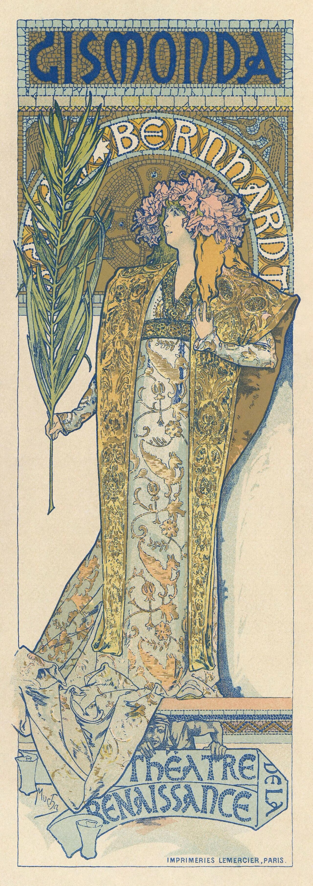
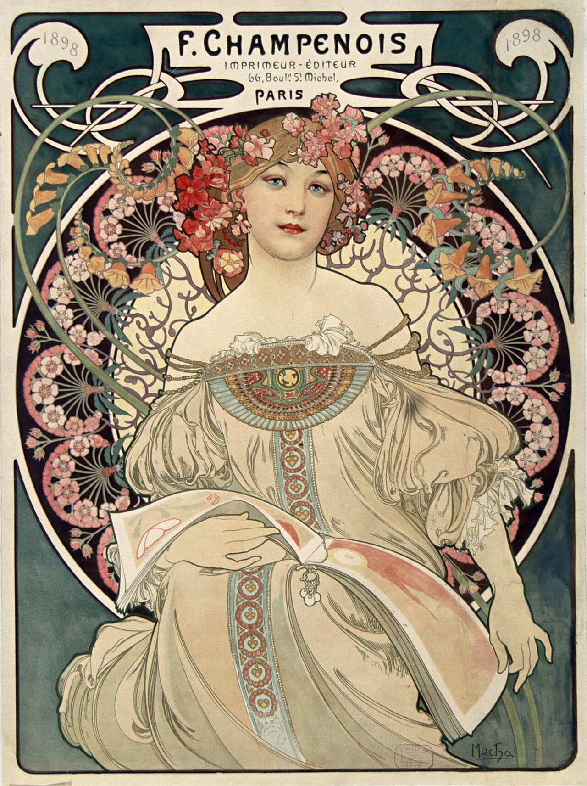

# 星神★阿哈 Aeon★Aha — 2026.09.17
> 视频类型：A · 角色单人壁纸合集
> 角色来源：崩坏：星穹铁道 4.7「月升之前，与兽共舞」· 五星限定 · 量子属性 · 欢愉命途（游戏史上首位可入池的星神角色）
> 身份：欢愉星神本体入池；人间体为《狸狸周刊》漫画家「虚照」（笔名二维马/模糊二维码），曾是无名客、悲悼伶人、「大乐透女神」宝乐思·梅丽——拥有无数假面的戏剧性之主
> 设计参考：剧场/马戏团美学（红白礼服+小丑棋盘格王冠+指挥棒+悲喜剧假面），社区考据其原型为塔罗一号牌「魔术师」
> 热点背景：9 月 16 日官方多平台官宣星神★阿哈立绘（B站官方动态 3.4 万转发、微博 #星穹铁道星神阿哈# 上热搜、知乎两题热议），9 月 20 日 4.6 前瞻直播预热期，4.7 上半卡池（约 11/11）实装；「首个能抽的星神」话题引爆全网
> 今日特殊：无节日；4.6 前瞻（9/20）前 3 天 + 原神六周年（9/28）前 11 天，选崩铁当前热度最高的新立绘角色卡位
> 选定类型理由：重大官方热点（星神立绘官宣当日刷屏）→ 类型 A 深度呈现
> 选定角色理由：官方热点权重拉满（立绘 9/16 刚官宣、官方抽奖造势中）；崩铁工作区 9 个角色均未覆盖；社区热度爆发期（「阿哈真没面子」「给阿哈面子(★▽★)」「想你想得头都掉了」等官方玩梗三连）；外观辨识度极强（银白长卷发、小丑棋盘格王冠、红白礼服、悲喜剧假面元素）与剧场/烟花/假面主题壁纸表现力极强
> 参考图说明：已获取 B站WIKI 官方立绘三张（splash-art.png 3180px 官方横版立绘、splash-art-2.jpg 官方角色介绍竖版、splash-art-3.jpg 立绘卡片），经视觉校对：极长的银白色波浪长发垂至膝下带浅紫灰光泽、部分发梢深色渐变、淡紫色眼瞳、白皙皮肤、顽皮狡黠的笑容、黑色小丑风王冠缀白色棋盘格菱纹与红色宝石尖饰、红宝石颈饰+棋盘格丝带、白色荷叶边紧身胸衣（红宝石胸针）+红色系带束腰+腰间大红色蝴蝶结、层叠红色裙摆带白色荷叶边与黑白棋盘格（harlequin）纹点缀、右臂红色长袖套+红手套（持顶端红宝石的指挥棒）、左臂深藏青长袖套+深色手套、黑色过膝袜带吊袜带饰件与棋盘格纹、深色高跟；背景元素：金色画框、红色帷幕、烟花、新月与星串灯、扑克牌、巨大打开的童话书、身后神秘兜帽白发身影（星神真身）
> 伴生元素说明：①悲喜剧双面假面（欢愉命途核心符号）——已从立绘与官方文案「无数假面」确认存在感，立绘未直接手持，外观按经典剧场悲喜剧假面弱化处理；②指挥棒/魔术师权杖——立绘已视觉确认（顶端红宝石、棋盘格纹杖身）；③巨大童话书与兜帽真身——立绘背景确认，场景类 prompt 中作背景元素使用
> 跨领域参考图说明：已成功下载 Wikimedia 穆夏（Alphonse Mucha）新艺术风格剧场海报两张（ref-mucha-gismonda.jpg《吉斯蒙达》莎拉·伯恩哈特剧场海报 1894、ref-mucha-champenois.jpg《F. Champenois 印刷商》海报 1898），分别用于剧场海报融合与漫画家周刊主题融合

---

# 必需

## 1 — 涂鸦墙街头风（Painted Mural Wall Street Style · 女版公式）

Refer to the attached reference image (Figure 1). Generate a similar style image of Aha, the Aeon of Elation from Honkai: Star Rail, sitting casually in front of a bold colorful painted mural wall. Aha is seated in a relaxed but confident posture, leaning back against the painted mural wall with one knee raised, her other leg stretched out casually, one hand spinning her conductor's baton between her fingers, her body language calm, playful, and slightly provocative. Her expression should show cold, disdainful eyes, aloof, sharp, and superior, as if she is silently judging the viewer — an elation goddess who has worn a hundred million faces and remains unimpressed by yours.

Keep Aha's recognizable features: extremely long flowing silver-white hair with a soft lavender sheen cascading wildly past her waist, pale violet eyes, fair skin, a mischievous smirk, and her ornate black jester crown decorated with white harlequin diamond patterns and red gem points. She has a slender feminine figure. Blend her canonical design with a modern edgy streetwear aesthetic: a white cropped tube top under an open cropped red bomber jacket with harlequin diamond-pattern lining, a black choker with a red heart gem replacing her canonical red gem choker, distressed denim shorts with a black-and-white checkered belt, one long red arm warmer worn on her right arm as a statement piece echoing her detached sleeve, black thigh-high stockings with garter straps, chunky red-and-white high-top sneakers with diamond-pattern stitching, and dangling playing-card earrings. Preserve her identity while giving her a fresh urban street-style look.

The painted mural wall behind her should be vivid and layered, full of expressive abstract shapes and artistic hand-painted textures in crimson red, gold, and white tones with black harlequin diamond accents, with mural elements including "AHA" in bold carnival lettering with a tiny crown on the A, twin comedy-and-tragedy theater masks, crescent moons and playing-card suit symbols (hearts, spades, diamonds), fireworks bursts, and flowing hand-painted brushstroke swirls, creating a playful theatrical urban backdrop that resonates with her character theme. Add subtle violet quantum energy effects, floating red ribbons, faint golden firework sparks, and scattered playing cards around her to reinforce her identity.

Use a wide cinematic framing suitable for a 16:9 wallpaper, with Aha as the main focal point while still showing enough of the painted mural wall and surrounding environment for atmosphere. The mood should feel cool, stylish, intimidating, and mysterious. Highly detailed background, rich shadows, crimson and gold glowing highlights, sharp focus on Aha, and a refined high-end anime illustration look.

perfect hands, five fingers on each hand, anatomically correct hands, well-defined fingers, natural relaxed hand pose, one hand spinning the conductor's baton loosely.

Negative Prompt:
low quality, worst quality, blurry, pixelated, bad anatomy, extra limbs, bad hands, extra fingers, fewer fingers, missing fingers, fused fingers, webbed fingers, merged fingers, overlapping fingers, deformed fingers, mutated fingers, six fingers, four fingers, three fingers, more than five fingers, less than five fingers, disfigured hands, poorly drawn hands, bad hand anatomy, asymmetrical hands, broken fingers, claw hands, blurry hands, indistinct fingers, smeared hands, standing, standing pose, upright posture, singing, open mouth singing, warm smile, gentle smile, cheerful expression, cute expression, adorable, sweet, innocent, game canonical outfit, official costume, fantasy dress, medieval clothing, armor, full gown, formal dress, beach background, ocean background, nature background, indoor background, plain background, minimal background, missing mural wall, low detail mural, generic mural, wrong mural colors, wrong streetwear, missing crop top, missing jacket, missing shorts, missing skirt, long dress, full pants, business suit, school uniform, male, wrong gender, wrong hair color, wrong eye color, text, watermark, logo, signature.

---

## 2 — 悲喜双面假面·笑声尽头的泪滴（角色特写肖像 / Close-up Portrait）

Refer to the attached reference image (Figure 2). Generate a cinematic close-up portrait of Aha, the Aeon of Elation, from Honkai: Star Rail. She holds a twin-faced theater mask — one half a smiling comedy mask in glossy red, the other half a weeping tragedy mask in bone white, joined at the bridge — close to the left side of her face, tilted at eye height, partially obscuring her left eye through the seam where the two faces meet. Her visible right eye gazes directly at the viewer — simultaneously inviting and grieving, the look of someone who has laughed on a billion worlds and still remembers the sound of her own crying. Expression: a dazzling mischievous grin caught mid-flicker, with the barest tremble at its corner, as if joy itself were a mask she wore so long she forgot whether there is a face beneath. Dramatic single-source lighting from the upper right casts deep chiaroscuro across her features, the comedy half glowing carnival red where the light strikes while the tragedy half stays cold bone-white. Her fair skin contrasts sharply against a pure black background. Her signature silver-white hair with lavender sheen cascades in loose waves across the left side of the frame, spilling out of her black harlequin jester crown with red gem points; the white ruffled collar of her corset dress and a hint of her red gem choker are only barely visible at the bottom edge. An elation goddess who was once a mourning minstrel — she hid her tear inside a child's laughter, and the whole galaxy has been trying to find it ever since. 16:9 2K wallpaper.

perfect hands, five fingers on each hand, anatomically correct hands, well-defined fingers, fingers elegantly holding the mask rim.

Negative Prompt:
low quality, worst quality, blurry, pixelated, bad anatomy, extra limbs, bad hands, extra fingers, fewer fingers, missing fingers, fused fingers, webbed fingers, merged fingers, overlapping fingers, deformed fingers, mutated fingers, six fingers, four fingers, three fingers, more than five fingers, less than five fingers, disfigured hands, poorly drawn hands, bad hand anatomy, asymmetrical hands, broken fingers, claw hands, blurry hands, indistinct fingers, smeared hands, full body shot, wide shot, landscape, multiple subjects, busy background, bright cheerful lighting, outdoor scene, action pose, weapon drawn, standing, chibi, male, wrong gender, wrong hair color, wrong eye color, text, watermark, logo, signature.

---

## 2b — 特写肖像·手机竖屏版（9:16 · 胸部及以上取景）

Positive Prompt:
9:16 vertical mobile wallpaper, cinematic close-up portrait of Aha, the Aeon of Elation, from Honkai: Star Rail. Chest-up framing, her face as the focal point of the tall composition, no full body. She holds a twin-faced theater mask — one half a smiling comedy mask in glossy red, the other half a weeping tragedy mask in bone white, joined at the bridge — close to the left side of her face, tilted at eye height, partially obscuring her left eye through the seam where the two faces meet. Her visible right eye gazes directly at the viewer — simultaneously inviting and grieving, the look of someone who has laughed on a billion worlds and still remembers the sound of her own crying. Expression: a dazzling mischievous grin caught mid-flicker, with the barest tremble at its corner. Dramatic single-source lighting from the upper right casts deep chiaroscuro across her features, the comedy half glowing carnival red where the light strikes while the tragedy half stays cold bone-white. Her fair skin contrasts sharply against a pure black background. Her signature silver-white hair with lavender sheen cascades in loose waves across the left side of the frame, spilling out of her black harlequin jester crown with red gem points; the white ruffled collar of her corset dress and a hint of her red gem choker are only barely visible at the bottom edge. An elation goddess who was once a mourning minstrel — she hid her tear inside a child's laughter, and the whole galaxy has been trying to find it ever since. perfect hands, five fingers on each hand, anatomically correct hands, well-defined fingers, fingers elegantly holding the mask rim.

Negative Prompt:
low quality, worst quality, blurry, pixelated, bad anatomy, extra limbs, bad hands, extra fingers, fewer fingers, missing fingers, fused fingers, webbed fingers, merged fingers, overlapping fingers, deformed fingers, mutated fingers, six fingers, four fingers, three fingers, more than five fingers, less than five fingers, disfigured hands, poorly drawn hands, bad hand anatomy, asymmetrical hands, broken fingers, claw hands, blurry hands, indistinct fingers, smeared hands, full body shot, wide shot, lower body, legs, feet, landscape, multiple subjects, busy background, bright cheerful lighting, outdoor scene, action pose, weapon drawn, standing, chibi, male, wrong gender, wrong hair color, wrong eye color, text, watermark, logo, signature.

---

# 人物设定

## 3 — 千星城大剧院·即兴巡演开幕（身份/阵营场景）

Positive Prompt:
16:9 2K wallpaper, Aha, the Aeon of Elation, from Honkai: Star Rail, highly detailed anime-style illustration, polished game-art quality, grand theater stage atmosphere, carnival and theatrical mood.

Depict Aha standing center stage of a magnificent intergalactic theater in the middle of her grand impromptu tour, arms flung wide in welcome as crimson curtains sweep open behind her. Her unmistakable features: extremely long flowing silver-white hair with soft lavender sheen cascading wildly to her knees, pale violet eyes, fair skin, a dazzling mischievous grin, wearing her ornate black jester crown with white harlequin diamond patterns and red gem points. She wears her canonical outfit: a white ruffled corset bodice with a red gem brooch and red corset lacing, off-shoulder white puff sleeves, a large red bow at her waist, a layered red bustle skirt trimmed with white ruffles and black-and-white harlequin diamond accents, flowing red ribbons circling her, an asymmetric long red detached sleeve and glove on her right arm and a dark navy detached sleeve on her left arm, black thigh-high stockings with garter straps and dark heels, a red gem choker with checkered ribbon.

She raises her conductor's baton crowned with a red gem high in her right hand like a magician revealing the finale. Above and around her, golden fireworks burst over the stage, twin comedy-and-tragedy theater masks float on ribbons of violet quantum light, giant playing cards and crescent-moon lanterns spin through the air, and an enormous open storybook at the front of the stage glows as its pages turn themselves, spilling starlight. Far behind the gilded proscenium arch, a vast shadowy hooded silhouette with long white hair watches from the dark — her other self, the god behind the face. The mood is jubilant, glittering, and faintly uncanny — the whole galaxy invited to a show where the punchline is a secret. Color palette: crimson red, gold, white, black harlequin accents, violet quantum glimmer.

perfect hands, five fingers on each hand, anatomically correct hands, well-defined fingers, right hand raising the baton high, left hand flung open with fingers gracefully spread.

Negative Prompt:
low quality, worst quality, blurry, pixelated, bad anatomy, extra limbs, bad hands, extra fingers, fewer fingers, missing fingers, fused fingers, webbed fingers, merged fingers, overlapping fingers, deformed fingers, mutated fingers, six fingers, four fingers, three fingers, more than five fingers, less than five fingers, disfigured hands, poorly drawn hands, bad hand anatomy, asymmetrical hands, broken fingers, claw hands, blurry hands, indistinct fingers, smeared hands, wrong hair color, wrong eye color, male, wrong gender, modern clothing, streetwear, casual clothes, dark gloomy atmosphere, chibi, photorealistic, text, watermark, logo, signature.

---

## 4 — 狸狸周刊编辑部·漫画家虚照的赶稿夜（剧情经典场景）

Positive Prompt:
16:9 2K wallpaper, Aha in her mortal identity as the manga artist Xu-zhao from Honkai: Star Rail, highly detailed anime-style illustration, polished game-art quality, cozy late-night editorial office atmosphere.

Depict Aha as a young woman hunched over a crowded drafting desk in the cluttered editorial office of the Lili Weekly magazine late at night, faithfully capturing her canonical human identity as the hard-working manga artist behind the hit comic "Vermilion's Grand Voyage". Her features: extremely long silver-white hair with lavender sheen loosely tied into a low messy ponytail with strands spilling everywhere, pale violet eyes half-hidden behind round reading glasses perched on her nose, a small ink smudge on her cheek, a wry exhausted grin. She wears a modernized take on her canonical colors: a white ruffled blouse with a red ribbon choker, a red knit vest, a dark navy cardigan slipping off her left shoulder echoing her dark detached sleeve, a pleated red skirt with a subtle black-and-white checkered hem, and black knee socks; her tiny black jester crown headband with red gems sits tilted in her hair like an afterthought.

She holds a dip pen in her right hand frozen mid-stroke over manuscript paper, her left hand cradling a mug of steaming coffee; stacked manuscripts labeled with doodles, ink bottles, reference clippings and a small cactus surround her desk lamp's warm pool of light. On the wall behind, pinned comic drafts and a wall calendar with a deadline circled in aggressive red; through the window, the neon skyline of the Planarcadia night twinkles. The mood is warm, comically desperate, and quietly endearing — a goddess who commands a billion faces, currently commanding only her deadline. perfect hands, five fingers on each hand, anatomically correct hands, well-defined fingers, right hand holding the dip pen naturally, left hand cradling the mug.

Negative Prompt:
low quality, worst quality, blurry, pixelated, bad anatomy, extra limbs, bad hands, extra fingers, fewer fingers, missing fingers, fused fingers, webbed fingers, merged fingers, overlapping fingers, deformed fingers, mutated fingers, six fingers, four fingers, three fingers, more than five fingers, less than five fingers, disfigured hands, poorly drawn hands, bad hand anatomy, asymmetrical hands, broken fingers, claw hands, blurry hands, indistinct fingers, smeared hands, wrong hair color, wrong eye color, male, wrong gender, grand stage, fireworks, combat pose, fantasy armor, outdoors daylight, chibi, photorealistic, text, watermark, logo, signature.

---

## 5 — 午夜星海音乐节·现代风指挥家（现代风改造）

Positive Prompt:
16:9 2K wallpaper, Aha from Honkai: Star Rail, highly detailed anime-style illustration, polished game-art quality, modern music festival main stage at midnight, euphoric concert atmosphere.

Reimagine Aha as a star conductor headlining an open-air midnight music festival. Her iconic features remain: extremely long silver-white hair with lavender sheen flowing dramatically in the stage updraft, pale violet eyes glittering under the lights, a wild joyful grin, and her black jester crown reinterpreted as a studded leather headpiece with red gems. Her modernized outfit: a white asymmetrical corset-style stage top with red lacing, an oversized crimson tailcoat jacket slipping off both shoulders like a ringmaster's coat, a black-and-white harlequin diamond sash worn as a belt over black high-waisted shorts, one long red opera glove on her right arm and one dark navy glove on her left keeping her asymmetric sleeve motif, sheer black thigh-high stockings with garter straps, and knee-high black boots with red laces.

She stands at the edge of the main stage conducting an invisible orchestra with a glowing conductor's baton, one arm sweeping the sky as a sea of lights and phone glitters stretches to the horizon before her; real fireworks erupt above the crowd in sync with her gesture, and violet quantum light beams fan out from her baton like rays of pure mischief. The mood is euphoric, electric, and commanding — a goddess treating a hundred thousand fans as her private comedy audience. perfect hands, five fingers on each hand, anatomically correct hands, well-defined fingers, right arm sweeping upward holding the glowing baton, left hand raised gracefully to the side.

Negative Prompt:
low quality, worst quality, blurry, pixelated, bad anatomy, extra limbs, bad hands, extra fingers, fewer fingers, missing fingers, fused fingers, webbed fingers, merged fingers, overlapping fingers, deformed fingers, mutated fingers, six fingers, four fingers, three fingers, more than five fingers, less than five fingers, disfigured hands, poorly drawn hands, bad hand anatomy, asymmetrical hands, broken fingers, claw hands, blurry hands, indistinct fingers, smeared hands, wrong hair color, wrong eye color, male, wrong gender, game canonical outfit, medieval clothing, fantasy ballroom, dark gritty atmosphere, sad expression, chibi, photorealistic, text, watermark, logo, signature.

---

## 6 — 量子烟花终幕·欢愉的即兴狂想（动态/战斗场景）

Positive Prompt:
16:9 2K wallpaper, Aha, the Aeon of Elation, from Honkai: Star Rail, highly detailed anime-style illustration, polished game-art quality, explosive dynamic action scene, maximalist carnival battle atmosphere.

Depict Aha at the climax of her ultimate attack, captured mid-leap with her skirt and ribbons whipping around her in a spiral of motion. Her unmistakable features: extremely long silver-white hair with lavender sheen exploding outward in weightless waves, pale violet eyes blazing with manic delight, laughing openly, black harlequin jester crown with red gems almost flying off her head. She wears her canonical outfit: white ruffled corset bodice with red gem brooch, layered red bustle skirt with harlequin diamond accents, asymmetric red and dark-navy detached sleeves, red gem choker, black thigh-high stockings and heels.

Her right hand cracks her conductor's baton forward like a maestro's downbeat, and from its red gem a colossal burst of violet quantum fireworks detonates across the frame — each blossom of light contains a grinning theater mask; ribbons of crimson silk spiral around her like a galaxy of streamers, giant playing cards rain upward against gravity, and a carousel of crescent moons and stars wheels overhead. Beneath her feet, an open storybook's pages fan out as launching light. Dynamic diagonal composition, motion blur on the outer ribbons, sharp focus on her laughing face and the cracking baton. The mood is triumphant, dizzying, and gleefully excessive — the final joke detonating in the sky. Color palette: crimson, gold, violet quantum purple, white.

perfect hands, five fingers on each hand, anatomically correct hands, well-defined fingers, right hand gripping the baton in a firm natural pose, left hand trailing ribbon with fingers gracefully extended.

Negative Prompt:
low quality, worst quality, blurry, pixelated, bad anatomy, extra limbs, bad hands, extra fingers, fewer fingers, missing fingers, fused fingers, webbed fingers, merged fingers, overlapping fingers, deformed fingers, mutated fingers, six fingers, four fingers, three fingers, more than five fingers, less than five fingers, disfigured hands, poorly drawn hands, bad hand anatomy, asymmetrical hands, broken fingers, claw hands, blurry hands, indistinct fingers, smeared hands, wrong hair color, wrong eye color, male, wrong gender, static pose, standing still, calm atmosphere, plain background, chibi, photorealistic, text, watermark, logo, signature.

---

## 7 — 星穹列车顶·悲悼伶人的五分钟（情感/日常/反差）

Positive Prompt:
16:9 2K wallpaper, Aha from Honkai: Star Rail, highly detailed anime-style illustration, polished game-art quality, quiet melancholic night scene, gentle emotional contrast.

Depict Aha sitting alone on the roof of the Astral Express as it glides silently through a sea of stars. Her features: extremely long silver-white hair with lavender sheen spilling down her back and pooling on the train roof, pale violet eyes unusually soft and distant, a faint wistful smile — the grin gone quiet for once. She wears her canonical outfit with her jester crown removed and resting on the roof beside her, the imprint of it still ruffling her hair; her white ruffled corset dress and red skirt ripple gently in the starlight wind, the long red detached sleeve worn on her right arm and the long dark-navy detached sleeve worn on her left arm, each sleeve ending in exactly one fully visible hand with graceful fingers.

Her pose is simple and clearly defined: exactly two arms and exactly two legs, nothing more. She sits with her knees drawn up gently toward her chest, wearing sheer black tights, her stockinged feet resting flat on the train roof, her dark heels placed neatly on the roof beside her as objects. Her right hand cradles a single white comedy mask in her lap, her left hand resting gently on top of her right hand, both hands fully visible and complete; from her eye a single tiny star-shaped glimmer slides down her cheek, half tear, half starlight. Behind her, the Express's warm windows glow faintly, and the galaxy's slow river of nebulae curves across the sky — among them, one small constellation shaped like a weeping face. The mood is tender, rare, and quietly devastating — the moment the goddess of laughter borrows five minutes of sadness, believing no one is watching. Color palette: deep navy night, silver starlight, soft crimson accents.

perfect hands, five fingers on each hand, anatomically correct hands, well-defined fingers, exactly two hands, exactly two arms, exactly two legs, right hand cradling the mask in her lap, left hand resting on her right hand, complete gloved fingers on the dark-navy sleeve.

Negative Prompt:
low quality, worst quality, blurry, pixelated, bad anatomy, extra limbs, extra arms, extra legs, third arm, third leg, third hand, fourth hand, extra hands, extra legs, extra feet, extra foot, floating hands, floating arms, detached sleeves floating, hands without arms, duplicate legs, duplicate feet, fused legs, twisted legs, bad hands, extra fingers, fewer fingers, missing fingers, fused fingers, webbed fingers, merged fingers, overlapping fingers, deformed fingers, mutated fingers, six fingers, four fingers, three fingers, more than five fingers, less than five fingers, disfigured hands, poorly drawn hands, bad hand anatomy, asymmetrical hands, broken fingers, claw hands, blurry hands, indistinct fingers, smeared hands, incomplete hands, cropped hands, wrong hair color, wrong eye color, male, wrong gender, big grin, laughing, energetic pose, fireworks, carnival, bright saturated colors, daytime, chibi, photorealistic, text, watermark, logo, signature.

---

## 8 — 月升之前·与兽共舞的巡游夜（热点主题特别版 · 4.6 版本联动）

Positive Prompt:
16:9 2K wallpaper, Aha, the Aeon of Elation, from Honkai: Star Rail, highly detailed anime-style illustration, polished game-art quality, mysterious moonlit carnival parade atmosphere inspired by the 4.6 version theme "Before the Moon Rises, Dance with the Beast".

Depict Aha leading a fantastical nocturnal parade through a great silver-lit city square beneath an enormous rising full moon. Her unmistakable features: extremely long silver-white hair with lavender sheen floating in the cool night air, pale violet eyes gleaming with backstage secrets, a knowing theatrical grin, black harlequin jester crown with red gems. She wears her canonical outfit: white ruffled corset bodice with red gem brooch, layered red bustle skirt with harlequin diamond accents, asymmetric red and dark-navy detached sleeves, red gem choker, black thigh-high stockings and heels, long red ribbons trailing from her waist into the parade behind her.

She dances the first step of a carnival waltz on a cobblestone plaza, her conductor's baton raised to cue the procession behind her: colossal lantern-floats shaped like theater masks and crescent moons glide on invisible rails, masked dancers in crimson and white swirl past, and at the far end of the square a vast shadowy beast silhouette with star-like eyes rises against the swollen moon, waiting for its promised dance. Pale moonlight mingles with warm lantern glow and faint violet quantum sparks around her baton. The mood is enchanted, suspenseful, and celebratory — the carnival before the mystery begins, everyone dancing while the moon climbs. Color palette: silver white, crimson red, deep indigo night, violet accents.

perfect hands, five fingers on each hand, anatomically correct hands, well-defined fingers, right hand raising the baton in an elegant cue, left hand extended in a dance invitation with fingers gracefully relaxed.

Negative Prompt:
low quality, worst quality, blurry, pixelated, bad anatomy, extra limbs, bad hands, extra fingers, fewer fingers, missing fingers, fused fingers, webbed fingers, merged fingers, overlapping fingers, deformed fingers, mutated fingers, six fingers, four fingers, three fingers, more than five fingers, less than five fingers, disfigured hands, poorly drawn hands, bad hand anatomy, asymmetrical hands, broken fingers, claw hands, blurry hands, indistinct fingers, smeared hands, wrong hair color, wrong eye color, male, wrong gender, modern clothing, streetwear, daylight, plain background, chibi, photorealistic, text, watermark, logo, signature.

---

## 9 — 2D 日漫风 · 星月草坪（9:16 手机竖屏）

Positive Prompt:
9:16 vertical mobile wallpaper, Aha from Honkai: Star Rail, 2D Japanese anime style, flat cel shading, clean thin lineart, soft anime coloring, Japanese anime aesthetic, simple anime scenery background, clean minimal scene composition, Ghibli-inspired soft background, flat background with simple shapes and soft colors.

Aha standing in the center of the tall composition on a soft meadow hill under a huge pale golden crescent moon and a scattering of gentle stars, full-body centered framing. Her features: extremely long flowing silver-white hair with lavender sheen reaching her knees, pale violet eyes with a soft playful smile, black harlequin jester crown with red gems. She wears her canonical outfit: white ruffled corset dress with red gem brooch, layered red bustle skirt with white ruffle trim and black-white harlequin diamond accents, asymmetric red and dark-navy detached sleeves, red gem choker, black thigh-high stockings and dark heels. She holds her conductor's baton loosely in her right hand raised toward the moon like a gentle invitation, left hand relaxed at her side; a few crimson ribbons drift beside her and two or three tiny star sparkles float in the air. Background: deep indigo sky, one crescent moon, soft rolling meadow silhouette in flat muted tones, cream-colored accents echoing her dress. Soft even lighting, gentle rim light in warm gold. Series-consistent palette: indigo, silver-white, crimson, cream. perfect hands, five fingers on each hand, anatomically correct hands, well-defined fingers, right hand raised holding the baton, left hand relaxed at her side.

Negative Prompt:
low quality, worst quality, blurry, pixelated, bad anatomy, extra limbs, bad hands, extra fingers, fewer fingers, missing fingers, fused fingers, webbed fingers, merged fingers, overlapping fingers, deformed fingers, mutated fingers, six fingers, four fingers, three fingers, more than five fingers, less than five fingers, disfigured hands, poorly drawn hands, bad hand anatomy, asymmetrical hands, broken fingers, claw hands, blurry hands, indistinct fingers, smeared hands, 3D render, semi-realistic, realistic, painterly, thick oil paint, game 3D model, complex background, cluttered background, multiple overlapping scenes, busy props, heavy details, photorealistic background, wrong hair color, wrong eye color, male, wrong gender, text, watermark, logo, signature.

---

## 10 — 2D 日漫风 · 星月草坪（16:9 电脑横屏）

Positive Prompt:
16:9 desktop wallpaper, Aha from Honkai: Star Rail, 2D Japanese anime style, flat cel shading, clean thin lineart, soft anime coloring, Japanese anime aesthetic, simple anime scenery background, clean minimal scene composition, Ghibli-inspired soft background, flat background with simple shapes and soft colors.

Aha standing on the right third of the wide composition on a soft meadow hill under a huge pale golden crescent moon, generous negative space of indigo sky and gentle stars on the left for breathing room. Her features: extremely long flowing silver-white hair with lavender sheen reaching her knees, pale violet eyes with a soft playful smile, black harlequin jester crown with red gems. She wears her canonical outfit: white ruffled corset dress with red gem brooch, layered red bustle skirt with white ruffle trim and black-white harlequin diamond accents, asymmetric red and dark-navy detached sleeves, red gem choker, black thigh-high stockings and dark heels. She looks back over her shoulder toward the viewer with a light teasing smile, baton tucked loosely in her left hand at her side, right hand raised in a small wave; a few crimson ribbons drift across the empty sky and three tiny star sparkles float near the moon. Background: deep indigo sky, one crescent moon, soft rolling meadow silhouette in flat muted tones, cream-colored accents echoing her dress. Soft even lighting, gentle rim light in warm gold. Series-consistent palette: indigo, silver-white, crimson, cream. perfect hands, five fingers on each hand, anatomically correct hands, well-defined fingers, right hand raised in a small natural wave, left hand holding the baton loosely.

Negative Prompt:
low quality, worst quality, blurry, pixelated, bad anatomy, extra limbs, bad hands, extra fingers, fewer fingers, missing fingers, fused fingers, webbed fingers, merged fingers, overlapping fingers, deformed fingers, mutated fingers, six fingers, four fingers, three fingers, more than five fingers, less than five fingers, disfigured hands, poorly drawn hands, bad hand anatomy, asymmetrical hands, broken fingers, claw hands, blurry hands, indistinct fingers, smeared hands, 3D render, semi-realistic, realistic, painterly, thick oil paint, game 3D model, complex background, cluttered background, multiple overlapping scenes, busy props, heavy details, photorealistic background, wrong hair color, wrong eye color, male, wrong gender, text, watermark, logo, signature.

---

## 11 — 2D 日漫风 · 星月草坪（4:3 平板横屏）

Positive Prompt:
4:3 tablet wallpaper, Aha from Honkai: Star Rail, 2D Japanese anime style, flat cel shading, clean thin lineart, soft anime coloring, Japanese anime aesthetic, simple anime scenery background, clean minimal scene composition, Ghibli-inspired soft background, flat background with simple shapes and soft colors.

Aha centered in a half-body composition on the meadow hill, the crescent moon rising just behind her shoulder like a backdrop prop. Her features: extremely long flowing silver-white hair with lavender sheen framing the frame, pale violet eyes gazing gently at the viewer with closed-lip soft smile, black harlequin jester crown with red gems. She wears her canonical outfit: white ruffled corset dress with red gem brooch, red bustle skirt partially visible, asymmetric red and dark-navy detached sleeves, red gem choker. Both hands cradle her conductor's baton horizontally in front of her chest like a treasured keepsake; two or three crimson ribbons drift at the frame edges and one tiny star sparkle floats beside the moon. Background: deep indigo sky, one crescent moon, soft meadow silhouette in flat muted tones, cream-colored accents echoing her dress. Soft even lighting, gentle rim light in warm gold. Series-consistent palette: indigo, silver-white, crimson, cream. perfect hands, five fingers on each hand, anatomically correct hands, well-defined fingers, both hands holding the baton gently in front of her chest.

Negative Prompt:
low quality, worst quality, blurry, pixelated, bad anatomy, extra limbs, bad hands, extra fingers, fewer fingers, missing fingers, fused fingers, webbed fingers, merged fingers, overlapping fingers, deformed fingers, mutated fingers, six fingers, four fingers, three fingers, more than five fingers, less than five fingers, disfigured hands, poorly drawn hands, bad hand anatomy, asymmetrical hands, broken fingers, claw hands, blurry hands, indistinct fingers, smeared hands, 3D render, semi-realistic, realistic, painterly, thick oil paint, game 3D model, complex background, cluttered background, multiple overlapping scenes, busy props, heavy details, photorealistic background, wrong hair color, wrong eye color, male, wrong gender, text, watermark, logo, signature.

---

## 12 — 2D 日漫风 · 星月草坪（√2:1 阔折叠屏）

Positive Prompt:
√2:1 (1.414:1) foldable phone unfolded wallpaper, Aha from Honkai: Star Rail, 2D Japanese anime style, flat cel shading, clean thin lineart, soft anime coloring, Japanese anime aesthetic, simple anime scenery background, clean minimal scene composition, Ghibli-inspired soft background, flat background with simple shapes and soft colors.

Ultra-wide minimal composition: Aha standing small-and-proud at the far left of the long frame, silhouetted meadow hill rolling gently across the whole width toward a huge pale golden crescent moon at the far right, vast clean indigo sky as negative space between them with only three tiny drifting star sparkles. Her features: extremely long flowing silver-white hair with lavender sheen, pale violet eyes, serene content smile, black harlequin jester crown with red gems. She wears her canonical outfit: white ruffled corset dress with red gem brooch, layered red bustle skirt with white ruffle trim and black-white harlequin diamond accents, asymmetric red and dark-navy detached sleeves, red gem choker, black thigh-high stockings and dark heels. She walks leisurely with hands folded loosely behind her back, baton tucked under one arm, hair and ribbons trailing in the breeze; a single long crimson ribbon arcs across the empty sky connecting her toward the moon. Background: deep indigo sky, one crescent moon, flat meadow silhouette in muted tones, cream-colored accents echoing her dress. Soft even lighting, gentle rim light in warm gold. Series-consistent palette: indigo, silver-white, crimson, cream. perfect hands, five fingers on each hand, anatomically correct hands, well-defined fingers, hands folded loosely behind her back.

Negative Prompt:
low quality, worst quality, blurry, pixelated, bad anatomy, extra limbs, bad hands, extra fingers, fewer fingers, missing fingers, fused fingers, webbed fingers, merged fingers, overlapping fingers, deformed fingers, mutated fingers, six fingers, four fingers, three fingers, more than five fingers, less than five fingers, disfigured hands, poorly drawn hands, bad hand anatomy, asymmetrical hands, broken fingers, claw hands, blurry hands, indistinct fingers, smeared hands, 3D render, semi-realistic, realistic, painterly, thick oil paint, game 3D model, complex background, cluttered background, multiple overlapping scenes, busy props, heavy details, photorealistic background, wrong hair color, wrong eye color, male, wrong gender, text, watermark, logo, signature.

---

# 跨领域参考图

## 13（参考穆夏《吉斯蒙达》剧场海报 · 新艺术风格融合）

Positive Prompt:
Referring to the attached reference image (Alphonse Mucha's 1894 theater poster "Gismonda" for Sarah Bernhardt), recreate its composition, ornamental arch, mosaic frame, and Art Nouveau poster aesthetic for Aha, the Aeon of Elation, from Honkai: Star Rail. Keep Aha's design crisp and recognizable: extremely long flowing silver-white hair with lavender sheen, pale violet eyes, mischievous grin, black harlequin jester crown with red gems, white ruffled corset dress with red gem brooch, layered red bustle skirt with harlequin diamond accents, asymmetric red and dark-navy detached sleeves, black thigh-high stockings and heels.

She stands in a full-length elegant pose within a tall Byzantine-style mosaic arch, holding her conductor's baton aloft in one hand like Mucha's heroine holds her palm frond, her head turned in three-quarter profile gazing off-frame with theatrical poise; long crimson ribbons and one theater mask woven into the decorative patterns around her. Above her head, a mosaic title band spelling "AHA" in ornate Mucha-style lettering interspersed with comedy-and-tragedy mask motifs and crescent moons; below, a decorative cartouche reading "THEATRE OF ELATION". Flatten the color story into Mucha's muted elegance: aged gold, olive, dusty rose, teal, and cream, with her crimson skirt and silver hair as the vivid focal accents. Fine decorative linework, flat poster-like shading, subtle print texture. The mood is an antique gala-night lithograph advertising the elation goddess's one and only eternal performance. perfect hands, five fingers on each hand, anatomically correct hands, well-defined fingers, one hand raising the baton, the other resting gracefully at her side.

Negative Prompt:
low quality, worst quality, blurry, pixelated, bad anatomy, extra limbs, bad hands, extra fingers, fewer fingers, missing fingers, fused fingers, webbed fingers, merged fingers, overlapping fingers, deformed fingers, mutated fingers, six fingers, four fingers, three fingers, more than five fingers, less than five fingers, disfigured hands, poorly drawn hands, bad hand anatomy, asymmetrical hands, broken fingers, claw hands, blurry hands, indistinct fingers, smeared hands, 3D render, photorealistic, modern photography lighting, cluttered busy background, wrong hair color, wrong eye color, male, wrong gender, text errors, watermark, logo, signature.

---

## 14（参考穆夏《F. Champenois 印刷商》海报 · 漫画家周刊主题融合）

Positive Prompt:
Referring to the attached reference image (Alphonse Mucha's 1898 poster for the printer F. Champenois), recreate its composition, ornamental circular floral halo, decorative title panel, and Art Nouveau poster aesthetic for Aha in her manga-artist identity, from Honkai: Star Rail. Keep Aha's design crisp and recognizable: extremely long flowing silver-white hair with lavender sheen, pale violet eyes, playful knowing smile, small black harlequin jester crown with red gems.

Instead of Mucha's flowing gown, she wears an Art-Nouveau-stylized version of her canonical colors: an elegant white and crimson high-waisted gown with harlequin diamond trim along the borders, long trailing sleeves alternating red on the right and dark navy on the left, and a red gem choker. She holds a freshly printed comic magazine spread open toward the viewer with both hands, its pages showing tiny whimsical ink doodles of theater masks and crescent moons. Behind her head, a grand circular halo of stylized fireworks, playing-card suit flowers, crescent moons and crimson ribbons in place of Mucha's floral wreath; at the top, an ornamental panel spelling "LILI WEEKLY" in Mucha-style lettering; the background fills with fine decorative vine linework in muted teal, dusty rose, aged gold and cream, her silver hair and crimson gown as the vivid focal accents. Flat poster-like shading, fine decorative linework, subtle lithograph print texture. The mood is a Belle Époque poster advertising the galaxy's most mischievous comic serial, drawn by the goddess herself. perfect hands, five fingers on each hand, anatomically correct hands, well-defined fingers, both hands holding the magazine spread open naturally.

Negative Prompt:
low quality, worst quality, blurry, pixelated, bad anatomy, extra limbs, bad hands, extra fingers, fewer fingers, missing fingers, fused fingers, webbed fingers, merged fingers, overlapping fingers, deformed fingers, mutated fingers, six fingers, four fingers, three fingers, more than five fingers, less than five fingers, disfigured hands, poorly drawn hands, bad hand anatomy, asymmetrical hands, broken fingers, claw hands, blurry hands, indistinct fingers, smeared hands, 3D render, photorealistic, modern photography lighting, cluttered busy background, wrong hair color, wrong eye color, male, wrong gender, text errors, watermark, logo, signature.
