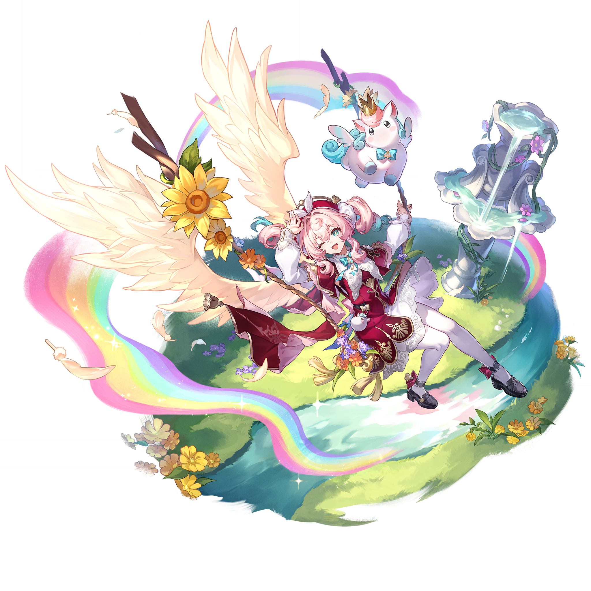

# 风堇 Hyacinthia — 2026.08.21

> 视频类型：A · 角色单人壁纸合集
> 角色来源：崩坏：星穹铁道 3.3「黎明之翼」· 风属性·记忆命途
> 身份：翁法罗斯十二黄金裔之一 / 昏光庭院首席护理师 / 天空之泰坦艾格勒辅祭 / 守望「天空」火种
> 设计参考：粉色双马尾卷发（末梢浅蓝渐变）、青色瞳孔、粉白贝雷帽（带翅膀与小皇冠装饰）、白衬衣+酒红马甲连衣裙（金色刺绣与风信子花饰）、白色连裤袜、黑皮鞋配红蝴蝶结、巨大白色天使羽翼（饰金色向日葵）、手持治愈之杖
> 伴生元素：天马小伊卡——圆滚滚白色小飞马，粉色鬃毛（末梢蓝渐变）、蓝色小翅膀、头戴迷你金皇冠、颈系蓝色蝴蝶结，漂浮于彩虹云朵之上
> 热点背景：崩铁4.5版本「挥掷千星的筹码」8月26日上线（距今5天），风堇作为上半卡池复刻五星角色，伴随知更鸟·晴歌同期UP，正处于版本预热高峰期
> 选角理由：风堇从未制作过壁纸专题；4.5版本复刻UP带来高社区讨论度；角色视觉元素丰富（天使羽翼+彩虹+小伊卡+医师设定），prompt可塑性极强；社区「崩铁芭芭拉」梗广泛传播
> 今日特殊：崩铁4.5前瞻直播余热未散，千星城/阿斯特罗波利斯夏日度假主题正热

# 必需

Refer to the attached reference image (Figure 1). Generate a similar style image of Hyacinthia from Honkai: Star Rail sitting casually in front of a bold graffiti wall. Hyacinthia is seated in a relaxed but confident posture, leaning back against the graffiti wall with one knee raised and her other leg stretched out casually, her body language calm, controlled, and slightly provocative. Her expression should show cold, disdainful eyes, aloof, sharp, and superior, as if she is silently judging the viewer.

Keep Hyacinthia's recognizable features: her pink curly twin tails with light blue gradient tips cascading past her shoulders, her piercing teal-green eyes — here turned cold and dismissive rather than gentle, and the small winged crown ornament from her beret pinned into her hair as a hair accessory. Blend her canonical design with a modern edgy streetwear aesthetic: she wears a white cropped mesh tank top layered under an open cropped pink bomber jacket with silver zipper details, the jacket draped loosely off one shoulder. A high-waisted burgundy denim mini skirt with frayed hem and a silver chain belt. Sheer white thigh-high stockings with a single delicate silver band at the top, and chunky black combat boots with pink laces and silver buckles. Layered silver necklaces with a small hyacinth flower pendant, a choker with a tiny golden wing emblem, and multiple thin bracelets on one wrist complete the look. Her large white angel wings are folded tightly behind her back, partially hidden by the graffiti wall. Preserve her identity while giving her a fresh urban street-style look.

The graffiti wall behind her should be vivid and layered, full of expressive abstract shapes and energetic street-art textures in pink, light blue, white, and gold tones, with graffiti elements including stylized "HYACINTHIA" lettering in flowing script, a large golden wing emblem spray-painted beside her head, hyacinth flower motifs, rainbow stencils, and dripping paint effects. A few spray paint cans in pink, light blue, and white sit casually on the ground beside her. The wall surface shows realistic cracked concrete and layered paint texture, with subtle neon light reflections casting a cool pink-blue glow across the scene.

Use a wide cinematic framing suitable for a 16:9 wallpaper, with Hyacinthia as the main focal point while still showing enough of the graffiti wall and surrounding urban environment for atmosphere. The mood should feel cool, stylish, intimidating, and mysterious. Highly detailed background, rich shadows, pink and blue glowing highlights, sharp focus on Hyacinthia, and a refined high-end anime illustration look.

Negative Prompt: low quality, worst quality, blurry, pixelated, bad anatomy, bad hands, extra fingers, fewer fingers, missing fingers, fused fingers, webbed fingers, merged fingers, overlapping fingers, deformed fingers, mutated fingers, six fingers, four fingers, three fingers, more than five fingers, less than five fingers, disfigured hands, poorly drawn hands, bad hand anatomy, asymmetrical hands, broken fingers, claw hands, blurry hands, indistinct fingers, smeared hands, extra limbs, chibi, childish, wrong hair color, wrong eye color, standing, standing pose, upright posture, singing, open mouth singing, warm smile, gentle smile, cheerful expression, cute expression, adorable, sweet, innocent, game canonical outfit, official costume, fantasy dress, medieval clothing, armor, full gown, formal dress, beach background, ocean background, nature background, indoor background, plain background, minimal background, missing graffiti wall, low detail graffiti, generic graffiti, wrong graffiti colors, wrong streetwear, missing crop top, missing jacket, missing shorts, missing skirt, long dress, full pants, business suit, school uniform, text, watermark, logo, signature.

# 必需2

Refer to the attached reference image (Figure 2). Generate a cinematic close-up portrait of Hyacinthia from Honkai: Star Rail. She holds a single dried hyacinth flower close to the right side of her face, the delicate purple-blue petals and stem partially obscuring her right eye. Her visible left eye gazes directly at the viewer — a gaze that carries the weight of a thousand unwept tears behind a wall of practiced gentleness. Expression: a tender, weary smile that has comforted a thousand dying patients, the curve of her lips suggesting infinite compassion, yet her visible eye betrays a flicker of something desperate and exhausted — the look of someone who heals the world while quietly falling apart, as if she has been holding her breath for centuries and has forgotten how to exhale. Dramatic single-source lighting from the upper left casts deep chiaroscuro across her features, the dried hyacinth petals glowing with a faint purple-blue luminescence where the light passes through. Her fair skin contrasts sharply against a pure black background. Her signature pink curly twin tails with light blue gradient tips frame her face, a few loose strands catching the light like silk threads. Her teal-green eye is luminous and unguarded — for this one moment, the mask of the gentle healer has slipped. The small winged crown ornament from her beret is pinned into her hair above her left ear, barely visible. Her white collar and cyan bow are only barely visible at the edge of the frame. A healer who stitches the dawn back together for others, yet no light ever reaches the cracks in her own soul. 16:9 2K wallpaper.

Negative Prompt: low quality, worst quality, blurry, pixelated, bad anatomy, bad hands, extra fingers, fewer fingers, missing fingers, fused fingers, webbed fingers, merged fingers, overlapping fingers, deformed fingers, mutated fingers, six fingers, four fingers, three fingers, more than five fingers, less than five fingers, disfigured hands, poorly drawn hands, bad hand anatomy, asymmetrical hands, broken fingers, claw hands, blurry hands, indistinct fingers, smeared hands, extra limbs, chibi, childish, wrong hair color, wrong eye color, full body shot, wide shot, landscape, multiple subjects, busy background, bright cheerful lighting, outdoor scene, action pose, weapon drawn, standing, wings spread, large wings visible, text, watermark, logo, signature.

# 人物设定

## 1 — 昏光庭院·晨光诊疗室（角色 canonical 场景还原）

Positive Prompt:

16:9 2K wallpaper, Hyacinthia from Honkai: Star Rail, highly detailed anime-style illustration, polished game-art quality, warm and gentle morning atmosphere, soft diffused sunlight, cozy medical clinic interior, healing and tender mood.

Depict Hyacinthia in her canonical healer outfit inside the Dusklight Courtyard clinic at dawn. She stands beside a wooden examination table covered with linen cloth, gently arranging medicinal herbs and colorful glass vials on a tray. Her pink curly twin tails with light blue gradient tips fall softly over her shoulders, and her teal-green eyes focus with warm concentration on her task. She wears her full canonical outfit: the pink beret with white brim and winged crown ornament, white blouse with puffy sleeves and detachable cuffs showing golden lining, the burgundy vest-dress with intricate gold embroidery and hyacinth flower motifs, white collar with silver edge patterns, the cyan bow at her collar fastened with a golden hyacinth button, and the wine-red split cape draping behind her with white bows and gold details. Her white pantyhose and black shoes with small red bows are visible beneath the desk. Her large white angelic wings are partially folded in a relaxed posture, golden sunflower decorations glinting in the morning light.

Her tiny companion Ika — the round fluffy white pegasus with pink mane tipped in blue, small blue wings, a miniature golden crown, and a blue bow tie — floats nearby on a small rainbow cloud, watching her with adorable curiosity. Soft morning light streams through arched windows with stained glass, casting colored light patterns across the clinic. Shelves of jars, dried herbs, and medical books line the walls. A faint rainbow shimmer floats in the air — residual wind energy from her golden descendant powers.

She holds a small mortar and pestle in one hand, her other hand resting gently on the tray, perfect hands, five fingers on each hand, well-defined fingers, natural hand pose. Centered medium shot with warm color palette of cream, gold, pink, and soft green.

Negative Prompt:
low quality, worst quality, blurry, pixelated, bad anatomy, bad hands, extra fingers, fewer fingers, missing fingers, fused fingers, webbed fingers, merged fingers, overlapping fingers, deformed fingers, mutated fingers, six fingers, four fingers, three fingers, more than five fingers, less than five fingers, disfigured hands, poorly drawn hands, bad hand anatomy, asymmetrical hands, broken fingers, claw hands, blurry hands, indistinct fingers, smeared hands, extra limbs, chibi, childish, wrong hair color, wrong eye color, wrong outfit, missing wings, missing Ika, dark lighting, night scene, outdoor scene, combat pose, angry expression, text, watermark, logo, signature.

## 2 — 天空之翼·黄金裔觉醒（核心设定场景）

Positive Prompt:

16:9 2K wallpaper, Hyacinthia from Honkai: Star Rail, highly detailed anime-style illustration, polished game-art quality, epic and ethereal atmosphere, golden descendant awakening, magnificent angelic transformation, dramatic cinematic lighting.

Depict the moment Hyacinthia awakens her Chryseus powers as the golden descendant of the Sky Titan. She rises gracefully into the air, her large white angelic wings unfurling to their full majestic span — each feather meticulously detailed, edged with soft golden light, the sunflower ornaments at the wing joints glowing with radiant energy. Her pink twin tails with light blue tips lift and swirl in an updraft of wind energy. Her teal-green eyes shine with divine luminescence, pupils dilated with power, her expression serene yet commanding — the face of someone who carries the fate of a world on her shoulders.

She wears her full canonical outfit, but the fabric now glows with subtle golden light, the hyacinth embroidery appearing to move like living vines. The wine-red cape billows dramatically behind her, its gold patterns blazing with inner fire. Her staff is raised high, its tip radiating a beam of rainbow light that pierces the clouds above.

Her companion Ika undergoes a simultaneous transformation — the small round pegasus expands into a more majestic form, its blue wings growing larger, its golden crown blazing with light, a magnificent rainbow trail streaming behind it as it circles protectively around her.

The background is the sky above Amphoreus: an endless expanse of clouds parting to reveal golden sunlight, rainbow arcs forming in concentric circles around her, wind energy swirling as visible currents of light. The composition centers on Hyacinthia with wings spread wide, occupying the upper two-thirds of the frame, the clouds and light creating a divine halo effect. The mood should feel transcendent, holy, and awe-inspiring — the birth of a legend.

Negative Prompt:
low quality, worst quality, blurry, pixelated, bad anatomy, bad hands, extra fingers, fewer fingers, missing fingers, fused fingers, webbed fingers, merged fingers, overlapping fingers, deformed fingers, mutated fingers, six fingers, four fingers, three fingers, more than five fingers, less than five fingers, disfigured hands, poorly drawn hands, bad hand anatomy, asymmetrical hands, broken fingers, claw hands, blurry hands, indistinct fingers, smeared hands, extra limbs, chibi, childish, wrong hair color, wrong eye color, missing wings, folded wings, small wings, wrong outfit, dark evil atmosphere, demonic, indoor scene, grounded pose, text, watermark, logo, signature.

## 3 — 与小伊卡的秘密花园（温馨日常·反差萌）

Positive Prompt:

16:9 2K wallpaper, Hyacinthia from Honkai: Star Rail, highly detailed anime-style illustration, polished game-art quality, secret garden setting, warm afternoon sunlight, slice-of-life sweetness, emotional and tender atmosphere.

Depict Hyacinthia in a rare moment of complete relaxation — lying on her back in a sun-drenched wildflower meadow, her large white wings spread out beneath her like a soft blanket on the grass. Her pink twin tails with light blue tips fan out on either side of her head. One eye is closed in peaceful contentment, the other half-open, her teal gaze soft and dreamy as she watches clouds drift by. A gentle, genuine smile curves her lips — not the practiced smile of a healer comforting patients, but the unguarded smile of a girl who has finally allowed herself to rest.

She wears a simplified version of her outfit: the white blouse and burgundy vest, but without the cape and beret, her hair accessories removed so her twin tails fall freely. Her black shoes are set aside on the grass nearby, her white-pantyhose-clad legs stretched out comfortably.

Her companion Ika — the adorable round white pegasus — has settled on her stomach, curled into a fluffy ball, its tiny blue wings folded, its miniature golden crown slightly askew, sleeping soundly. A small rainbow shimmer surrounds them both. Wildflowers in pink, blue, yellow, and white bloom all around them. Butterflies flutter past. Dappled afternoon light filters through distant trees. The scene feels intimate, quiet, and profoundly peaceful — a healer finally healing herself.

One of her hands rests gently on Ika's back, fingers relaxed, perfect hands, five fingers on each hand, well-defined fingers, natural hand pose. The other hand is thrown over her eyes to shield them from the sun. Wide composition with generous depth of field, Hyacinthia centered in the lower half of the frame, the sky filling the upper half.

Negative Prompt:
low quality, worst quality, blurry, pixelated, bad anatomy, bad hands, extra fingers, fewer fingers, missing fingers, fused fingers, webbed fingers, merged fingers, overlapping fingers, deformed fingers, mutated fingers, six fingers, four fingers, three fingers, more than five fingers, less than five fingers, disfigured hands, poorly drawn hands, bad hand anatomy, asymmetrical hands, broken fingers, claw hands, blurry hands, indistinct fingers, smeared hands, extra limbs, chibi, childish, wrong hair color, wrong eye color, missing Ika, combat pose, serious expression, formal pose, night scene, rain, storm, text, watermark, logo, signature.

## 4 — 赛博朋克医疗天使（现代风改造）

Positive Prompt:

16:9 2K wallpaper, Hyacinthia from Honkai: Star Rail, highly detailed anime-style illustration, polished game-art quality, cyberpunk medical facility, neon-lit futuristic city, high-tech healer aesthetic, cool and sophisticated atmosphere.

Reimagine Hyacinthia as a cyberpunk medical specialist in a futuristic New Eridu-style medical bay. She stands at a holographic patient monitoring station, her posture confident and professional. Her pink twin tails with light blue tips are woven with fiber-optic strands that glow softly in pink and cyan. Her teal eyes are augmented with a subtle holographic HUD display reflected in her irises — medical data and vital signs floating in translucent panels.

Her outfit is reimagined as a futuristic medic uniform: a form-fitting white and burgundy cyber-suit with glowing cyan circuit patterns, a high-tech medical visor pushed up onto her forehead, a translucent holographic cape that shifts between pink and blue tones, mechanical wing augmentations — white metallic wing frames with holographic feather projections that pulse with soft light. White thigh-high tech-stockings with glowing seams, and black combat medic boots with red neon accents. She wears a high-tech medical gauntlet on one hand, the other hand manipulating a holographic interface.

Her companion Ika is reimagined as a small drone — a round white robotic pegasus with blue LED wing lights, a tiny golden crown antenna, and a holographic rainbow trail. It hovers beside her, projecting a small medical scan beam.

The background is a futuristic medical facility: neon pink and cyan lighting, holographic displays, glass walls overlooking a sprawling cyberpunk cityscape at night. The mood is cool, high-tech, and slightly melancholic — a healer in a world where even medicine has become digitized. Medium shot composition, Hyacinthia at the right third, cityscape visible through the windows.

Negative Prompt:
low quality, worst quality, blurry, pixelated, bad anatomy, bad hands, extra fingers, fewer fingers, missing fingers, fused fingers, webbed fingers, merged fingers, overlapping fingers, deformed fingers, mutated fingers, six fingers, four fingers, three fingers, more than five fingers, less than five fingers, disfigured hands, poorly drawn hands, bad hand anatomy, asymmetrical hands, broken fingers, claw hands, blurry hands, indistinct fingers, smeared hands, extra limbs, chibi, childish, wrong hair color, wrong eye color, wrong outfit, missing wings, organic wings, day scene, natural setting, medieval clothing, text, watermark, logo, signature.

## 5 — 翁法罗斯永夜战场（动态战斗场景）

Positive Prompt:

16:9 2K wallpaper, Hyacinthia from Honkai: Star Rail, highly detailed anime-style illustration, polished game-art quality, epic battle scene, Amphoreus eternal night, dynamic action composition, dramatic wind effects.

Depict Hyacinthia in the midst of combat during the eternal night of Amphoreus. She stands on a crumbling stone platform amid a battlefield, her staff raised high, wind energy swirling around her in visible spirals of cyan and white light. Her large white angelic wings are fully deployed in a combat stance — swept wide and angled for balance, feathers ruffled by the intense wind. Her pink twin tails whip dramatically in the energy updraft, the light blue tips glowing with residual power.

Her expression is fierce and determined — the gentle healer transformed into a warrior defending her world. Her teal eyes blaze with golden light, her brow furrowed in concentration. She wears her full canonical battle-ready outfit: the beret pinned firmly in place, the burgundy vest-dress showing signs of battle — a torn sleeve, a smudge of dirt on the white collar, but the golden embroidery still gleaming defiantly. The wine-red cape billows behind her like a battle banner.

She has just summoned Ika in its combat form — the small pegasus has expanded slightly, its blue wings glowing with energy, a rainbow shockwave radiating outward from its tiny crown. Wind blades and healing light radiate from her staff in alternating pulses, showing her dual nature as both warrior and healer.

The background is the devastated landscape of eternal-night Amphoreus: dark storm clouds split by beams of golden light where she has carved paths through the darkness, crumbling ancient architecture, the sky a turbulent mix of black and gold. Dynamic diagonal composition with Hyacinthia at the center, wings spread wide, the storm visible behind her. The mood should feel epic, desperate, and heroic.

Negative Prompt:
low quality, worst quality, blurry, pixelated, bad anatomy, bad hands, extra fingers, fewer fingers, missing fingers, fused fingers, webbed fingers, merged fingers, overlapping fingers, deformed fingers, mutated fingers, six fingers, four fingers, three fingers, more than five fingers, less than five fingers, disfigured hands, poorly drawn hands, bad hand anatomy, asymmetrical hands, broken fingers, claw hands, blurry hands, indistinct fingers, smeared hands, extra limbs, chibi, childish, wrong hair color, wrong eye color, missing wings, folded wings, peaceful mood, daytime, cheerful scene, modern city, text, watermark, logo, signature.

## 6 — 千星城夏日度假·4.5热点特别版（版本热点联动）

Positive Prompt:

16:9 2K wallpaper, Hyacinthia from Honkai: Star Rail, highly detailed anime-style illustration, polished game-art quality, Astropolis summer resort, beach vacation atmosphere, bright and playful mood, casino-city skyline backdrop.

Depict Hyacinthia enjoying a rare vacation in the glamorous summer city of Astropolis (千星城), the star of the upcoming Version 4.5 update. She stands on a golden-sand beach with the dazzling Astropolis skyline behind her — towering crystalline casino resorts, floating holographic billboards, rainbow light bridges connecting the buildings, all bathed in warm sunset light. The sky is painted in gradients of pink, orange, and gold, matching her color scheme perfectly.

She wears a custom summer vacation outfit: a white off-shoulder ruffled crop top with gold trim, a high-waisted burgundy pleated mini skirt with hyacinth flower embroidery, barefoot with delicate gold ankle chains, a wide-brimmed sun hat decorated with a pink ribbon and a tiny wing ornament, and oversized round sunglasses pushed up onto her forehead. Her pink twin tails with light blue tips are styled with small seashell and starfish hair accessories. Her large white angel wings are relaxed and slightly drooped in the heat, golden sunflower decorations catching the sunset.

Her companion Ika floats beside her wearing comically tiny sunglasses and a miniature beach float ring, its rainbow cloud now shaped like a fluffy cumulus cloud. It holds a tiny tropical drink in its mouth. Hyacinthia holds a tropical fruit smoothie in one hand, her other hand shading her eyes as she smiles warmly at the spectacular city view, perfect hands, five fingers on each hand, well-defined fingers, natural hand pose.

Gentle ocean waves lap at the shore. Seashells and tropical flowers dot the sand. The Astropolis Ferris wheel glows in the distance. The mood is joyful, carefree, and sun-drenched — a healer finally taking a well-deserved break. Wide composition showing both the beach foreground and the magnificent city skyline.

Negative Prompt:
low quality, worst quality, blurry, pixelated, bad anatomy, bad hands, extra fingers, fewer fingers, missing fingers, fused fingers, webbed fingers, merged fingers, overlapping fingers, deformed fingers, mutated fingers, six fingers, four fingers, three fingers, more than five fingers, less than five fingers, disfigured hands, poorly drawn hands, bad hand anatomy, asymmetrical hands, broken fingers, claw hands, blurry hands, indistinct fingers, smeared hands, extra limbs, chibi, childish, wrong hair color, wrong eye color, wrong outfit, missing wings, missing Ika, winter scene, snow, rain, dark mood, indoor scene, text, watermark, logo, signature.

## 7 — 虹光祈禱·风信子神殿（角色 lore 深度场景）

Positive Prompt:

16:9 2K wallpaper, Hyacinthia from Honkai: Star Rail, highly detailed anime-style illustration, polished game-art quality, ancient Amphoreus temple, sacred ceremony atmosphere, ethereal and solemn mood, cinematic lighting.

Depict Hyacinthia performing a sacred healing ritual inside an ancient temple dedicated to the Sky Titan Aegle. She kneels gracefully on a circular mosaic floor depicting a giant hyacinth flower and outstretched wings, her hands clasped around her staff which is planted upright before her. Her eyes are closed in deep prayer, her lips moving silently — reciting the oath of the golden descendants. Her pink twin tails with light blue tips drape softly over her shoulders and down her back.

She wears her full canonical ceremonial outfit, every detail immaculate: the pink beret with its winged crown positioned precisely, the white blouse pristine, the burgundy vest-dress with its intricate gold embroidery catching the temple light, the wine-red cape spread around her like a pool of crimson on the mosaic floor. Her white pantyhose and black shoes with red bows are visible beneath the cape's spread. Her large white angelic wings are fully extended in a reverent pose, the golden sunflower ornaments glowing with soft inner light.

Her companion Ika hovers silently above her head in a posture of respect, its tiny blue wings folded, its golden crown gleaming, a single delicate rainbow beam connecting it to Hyacinthia's staff — a visual representation of their bond.

The temple interior is magnificent: towering columns carved with wing motifs and hyacinth flowers, stained glass windows depicting the dawn breaking over clouds, beams of golden light streaming down to illuminate her exactly. Floating particles of light drift in the air like sacred dust. The color palette is dominated by gold, white, soft pink, and burgundy. The mood is profoundly spiritual, serene, and filled with quiet devotion. Centered composition with strong vertical lines from the columns framing her.

Negative Prompt:
low quality, worst quality, blurry, pixelated, bad anatomy, bad hands, extra fingers, fewer fingers, missing fingers, fused fingers, webbed fingers, merged fingers, overlapping fingers, deformed fingers, mutated fingers, six fingers, four fingers, three fingers, more than five fingers, less than five fingers, disfigured hands, poorly drawn hands, bad hand anatomy, asymmetrical hands, broken fingers, claw hands, blurry hands, indistinct fingers, smeared hands, extra limbs, chibi, childish, wrong hair color, wrong eye color, wrong outfit, missing wings, missing Ika, casual pose, smiling expression, modern setting, outdoor scene, text, watermark, logo, signature.

# 参考图

## 8（官方立绘风格还原）

Refer to the attached reference image. Generate a high-quality recreation of Hyacinthia from Honkai: Star Rail in her canonical splash art pose. She floats gracefully in mid-air, one hand raised playfully near her face in a cute gesture, her other hand holding her ornate staff decorated with flowers and golden details. Her pink curly twin tails with light blue gradient tips bounce energetically. Her teal-green eyes sparkle with warmth and gentle mischief, one eye winking playfully at the viewer. She wears her full canonical outfit: pink beret with winged crown, white blouse with puffy sleeves, burgundy vest-dress with gold hyacinth embroidery, cyan bow with golden flower button, wine-red split cape with white bows and gold patterns, white pantyhose, black shoes with red bows. Her massive white angelic wings spread magnificently behind her, golden sunflower ornaments gleaming. A vibrant rainbow trail arcs around her in a sweeping curve from pink to blue to gold. Her companion Ika — the round fluffy white pegasus with pink-and-blue mane, blue wings, tiny golden crown, and blue bow tie — floats above her on its small rainbow cloud, looking adorable. Yellow sunflowers and colorful wildflowers scatter around the scene. A classical stone fountain with flowing water and small flowers stands in the background. 16:9 2K wallpaper, highly detailed anime-style illustration with polished game-art quality, bright and cheerful color palette.

Negative Prompt: low quality, worst quality, blurry, pixelated, bad anatomy, bad hands, extra fingers, fewer fingers, missing fingers, fused fingers, webbed fingers, merged fingers, overlapping fingers, deformed fingers, mutated fingers, six fingers, four fingers, three fingers, more than five fingers, less than five fingers, disfigured hands, poorly drawn hands, bad hand anatomy, asymmetrical hands, broken fingers, claw hands, blurry hands, indistinct fingers, smeared hands, extra limbs, chibi, childish, wrong hair color, wrong eye color, wrong outfit, missing wings, missing Ika, dark atmosphere, serious expression, text, watermark, logo, signature.

## 9（手机竖屏壁纸）

9:16 mobile wallpaper, Hyacinthia from Honkai: Star Rail, highly detailed anime-style illustration, portrait orientation optimized for smartphone lock screen, soft and dreamy atmosphere.

Depict a close-up portrait of Hyacinthia from the chest up, filling the vertical frame beautifully. Her pink curly twin tails with light blue gradient tips frame her face on both sides. Her teal-green eyes gaze directly at the viewer with a warm, inviting smile — the kind of smile that has healed countless patients. Her pink beret with the winged crown ornament sits at a slight angle. The white collar of her blouse and the cyan bow with golden hyacinth button are visible at her neckline. A few loose pink curls fall across her forehead.

Her large white angelic wings curve gently around her from behind, creating a natural frame for her face, the golden sunflower decorations catching soft light. Her companion Ika perches cutely on her right shoulder, its tiny blue wings folded, its miniature golden crown tilted adorably.

The background is a soft-focus sky filled with fluffy clouds, rainbow light halos, and drifting flower petals. Gentle backlighting creates a divine glow around her hair and wings. The color palette is soft pink, white, gold, and sky blue. The mood is intimate, warm, and uplifting — like receiving a healing blessing from a guardian angel. Centered vertical composition with her face in the upper-middle portion of the frame, leaving clean space at the bottom for phone UI elements.

Negative Prompt: low quality, worst quality, blurry, pixelated, bad anatomy, bad hands, extra fingers, fewer fingers, missing fingers, fused fingers, webbed fingers, merged fingers, overlapping fingers, deformed fingers, mutated fingers, six fingers, four fingers, three fingers, more than five fingers, less than five fingers, disfigured hands, poorly drawn hands, bad hand anatomy, asymmetrical hands, broken fingers, claw hands, blurry hands, indistinct fingers, smeared hands, extra limbs, chibi, childish, wrong hair color, wrong eye color, wrong outfit, missing wings, missing Ika, dark atmosphere, angry expression, text, watermark, logo, signature.

# 跨领域参考图

## 10（参考南丁格尔肖像 × 拉斐尔天使画 · 圣光医疗美学融合）

Positive Prompt:

16:9 2K wallpaper, Hyacinthia from Honkai: Star Rail, highly detailed anime-style illustration in the fusion style of Raphael's angel paintings and 19th-century medical portraiture. Referencing Florence Nightingale's iconic lamp-bearing portrait for the solemn healer posture, and Raphael's cherubs for the soft divine lighting.

Depict Hyacinthia walking through a long, dark corridor of wounded soldiers/patients, holding a glowing staff that emits soft golden healing light — her own "lamp of healing" — illuminating the faces of those she tends to. Her pink twin tails with light blue tips are tied back in a practical but elegant style. Her teal eyes show deep compassion and quiet exhaustion — the expression of someone who has not slept in days but refuses to rest while others suffer.

She wears her canonical outfit adapted to the reference style: the white blouse and burgundy vest-dress now resemble a refined Victorian nurse's uniform with golden embroidery suggesting both military honor and medical service. The wine-red cape drapes over one shoulder like a military sash. Her white pantyhose and black shoes are practical for walking. Her large white angelic wings are partially folded behind her, barely visible in the dim corridor — a subtle reminder of her divine nature.

Her companion Ika follows faithfully behind her, its tiny form glowing softly, lighting the path ahead like a faithful lantern-bearer.

The corridor is dark and somber, but wherever Hyacinthia walks, warm golden light spreads — patients' faces turn toward her light with expressions of relief and hope. The composition uses the dramatic chiaroscuro of Baroque religious paintings: deep shadows contrasted with the divine glow of her healing light. The mood is profoundly moving — a depiction of sacred duty and endless compassion. A single hyacinth flower has been placed in her hair behind her ear — a personal touch amidst the gravity of her mission.

Negative Prompt:
low quality, worst quality, blurry, pixelated, bad anatomy, bad hands, extra fingers, fewer fingers, missing fingers, fused fingers, webbed fingers, merged fingers, overlapping fingers, deformed fingers, mutated fingers, six fingers, four fingers, three fingers, more than five fingers, less than five fingers, disfigured hands, poorly drawn hands, bad hand anatomy, asymmetrical hands, broken fingers, claw hands, blurry hands, indistinct fingers, smeared hands, extra limbs, chibi, childish, wrong hair color, wrong eye color, modern clothing, cheerful bright scene, daytime outdoor, combat pose, text, watermark, logo, signature.

## 11（参考希腊神话插画 × 风信子花海摄影 · 黄金裔神话溯源）

Positive Prompt:

16:9 2K wallpaper, Hyacinthia from Honkai: Star Rail, highly detailed anime-style illustration fusing classical Greek mythology aesthetics with impressionist flower-field photography. Referencing the myth of Hyacinthus and Apollo for the tragic-beauty undertone, and Monet's garden paintings for the soft dappled light through flowers.

Depict Hyacinthia standing in an endless field of blooming hyacinth flowers — purple, pink, white, and blue blossoms stretching to the horizon under a golden sunset sky. Her pink twin tails with light blue tips are intertwined with fresh hyacinth flowers, as if the flowers themselves have claimed her as their namesake. Her teal eyes hold a bittersweet, distant gaze — the look of someone who understands the myth she's named after, the story of beauty cut short and transformed into eternal bloom.

She wears her canonical outfit, but the fabrics have taken on the texture of flower petals — the white blouse like layered petals, the burgundy vest like the deepest hyacinth purple, the golden embroidery like pollen dust. Her large white angelic wings are spread slightly, and from their feathers, small hyacinth petals drift down to join the field. The wine-red cape flows behind her like a river of wine through the flowers.

Her companion Ika prances playfully among the flowers, its tiny hooves barely touching the blooms, leaving a trail of rainbow sparkles wherever it steps.

The lighting is pure Impressionism: soft, golden, diffused through countless flower petals, creating a hazy, dreamlike atmosphere. The color palette is dominated by hyacinth purples, sunset golds, and soft pinks. The mood is melancholic yet beautiful — a meditation on transience and eternal renewal, on the healer who knows that every life she saves is borrowed time, and who finds meaning in the saving regardless. Wide composition with Hyacinthia as a small but radiant figure in the vast flower sea.

Negative Prompt:
low quality, worst quality, blurry, pixelated, bad anatomy, bad hands, extra fingers, fewer fingers, missing fingers, fused fingers, webbed fingers, merged fingers, overlapping fingers, deformed fingers, mutated fingers, six fingers, four fingers, three fingers, more than five fingers, less than five fingers, disfigured hands, poorly drawn hands, bad hand anatomy, asymmetrical hands, broken fingers, claw hands, blurry hands, indistinct fingers, smeared hands, extra limbs, chibi, childish, wrong hair color, wrong eye color, modern city, indoor scene, dark night, snow, winter, text, watermark, logo, signature.
