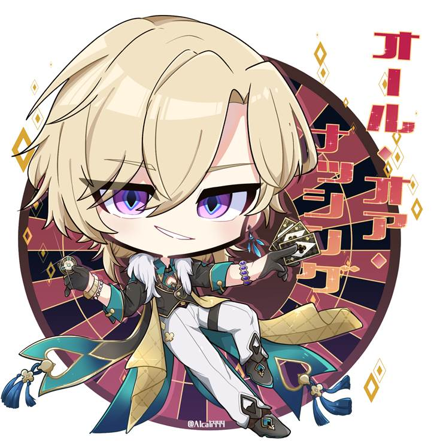
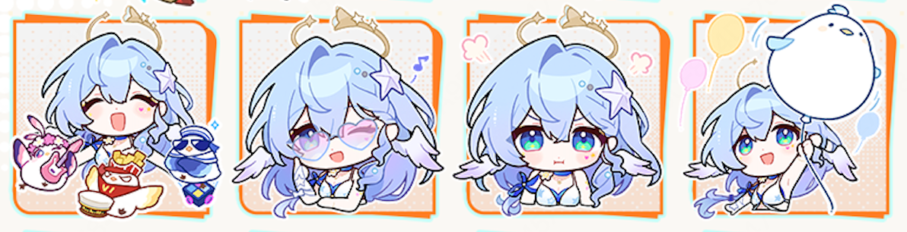
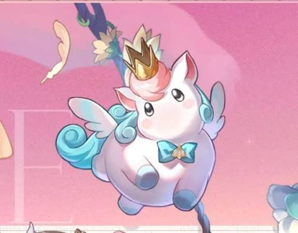
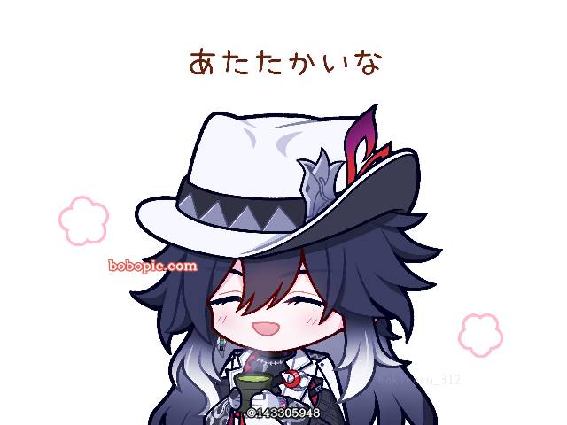
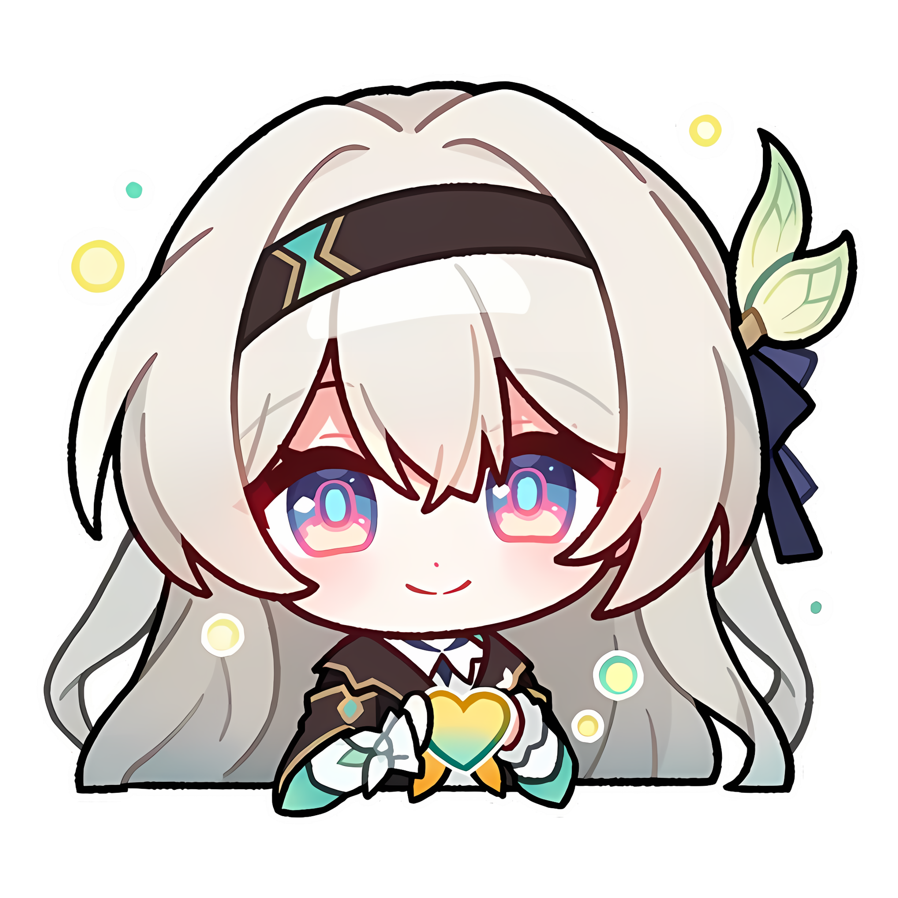

# 败走千星城 — 2026.08.25
> 视频类型：E · 梗图合集（Q版风格）
> 主题说明：崩坏星穹铁道4.5版本「挥掷千星的筹码」上线前社区整活梗图，围绕「败走千星城」「带薪休假」「三小鸡」「胖独角兽」「睡冰箱」「用脚开门」等热门梗
> 热点背景：崩铁4.5将于8月26日（明日）正式上线，千星城度假主题预热峰值，社区二创整活集中爆发
> 涉及角色：砂金·戏浪、知更鸟·晴歌、风堇、不死途、流萤
> 今日特殊：距崩铁4.5版本上线1天，「败走千星城」主线梗+角色专属梗双线爆发
> 画风说明：所有prompt统一采用Q版/超级变形（SD）风格，2.5-3头身比例，大头小身、圆滚滚造型、粗黑轮廓线、简化细节、官方表情包画风，以降低AI生成错误率并增强梗图喜剧效果

## 1（砂金·戏浪 · 「带薪休假的打工人赌徒」）

Positive Prompt:
3:4 vertical chibi meme image, Aventurine·Waveflair from Honkai: Star Rail, super-deformed (SD) style, big head small body, 2.5 to 3 heads proportion, rounded cute features, thick black outlines, simplified details, vibrant flat colors with soft cel-shading, official sticker art style, exaggerated comedy expression, vacation-gone-wrong atmosphere, bright tropical beach resort setting.

Depict chibi Aventurine lounging on a tiny beach chair at Astropolis (千星城) beach. He has a large round head with golden short hair and big sparkly amethyst purple eyes, small simplified body. He wears a simplified cyan Hawaiian shirt with gold accents and white shorts. BUT instead of a cocktail, his tiny hands are holding a corporate time-card punch clock, with a punch card being inserted. A company ID badge on a lanyard hangs around his neck reading "星际和平公司 · 休假中". His chibi expression is a glamorous but dead-inside half-smile — big sparkly eyes with tiny dark-circle lines underneath. Behind him, a wooden beach signpost points in contradictory directions: "度假海滩 ←" and "加班会议室 →". His sunglasses are pushed up to his round forehead. A few losing lottery tickets flutter around his small body. Golden hour beach lighting, palm trees, casino spires in the distance. The comedy comes from the clash between his luxurious vacation outfit and the soul-crushing corporate reality.

simple cute hands, rounded fingers, chibi hand pose.

Negative Prompt:
low quality, worst quality, blurry, pixelated, bad anatomy, bad hands, extra fingers, fewer fingers, missing fingers, fused fingers, webbed fingers, merged fingers, overlapping fingers, deformed fingers, mutated fingers, six fingers, four fingers, three fingers, more than five fingers, less than five fingers, disfigured hands, poorly drawn hands, bad hand anatomy, asymmetrical hands, broken fingers, claw hands, blurry hands, indistinct fingers, smeared hands, extra limbs, photorealistic, realistic proportions, adult body proportions, wrong hair color, wrong eye color, missing golden hair, missing purple eyes, text, watermark, logo, signature, dark horror atmosphere, indoor office background, winter scene, serious dark atmosphere.

## 2（砂金·戏浪 · 「一切献给琥珀王·千星城分王」）

Referring to the attached chibi image style, generate a similar vertical 3:4 chibi meme image for Aventurine·Waveflair.

Meme concept: Chibi Aventurine standing in front of a broken gacha machine at a 千星城 casino, crying exaggerated oversized diamond-shaped tears that scatter like tiny gems. His big round head has golden short hair and huge amethyst eyes wide with theatrical despair. He holds a cardboard sign reading "一切献给琥珀王" in bold brush strokes. His simplified Hawaiian shirt is wrinkled, one sandal is broken, and his tiny body is kneeling dramatically on one knee. Around him, a mountain of losing lottery tickets and empty credit chips forms a small hill taller than his chibi body. The casino background is neon-lit but empty, emphasizing the tragedy. A small speech bubble near his big head says "下次一定出货". The mood is peak tragicomedy — a gambler who has lost everything but still worships the Amber Lord.

Keep his chibi recognizable features: big round head, golden short hair, large sparkly amethyst purple eyes, tiny simplified body, sunglasses on forehead.

Negative Prompt:
low quality, blurry, bad anatomy, bad hands, extra fingers, fewer fingers, missing fingers, fused fingers, webbed fingers, merged fingers, overlapping fingers, deformed fingers, mutated fingers, six fingers, four fingers, disfigured hands, poorly drawn hands, bad hand anatomy, broken fingers, blurry hands, indistinct fingers, smeared hands, extra limbs, photorealistic, realistic proportions, adult body proportions, wrong hair color, wrong eye color, missing golden hair, text, watermark, logo, signature, serious dark atmosphere, bright cheerful winner mood.

## 3（知更鸟·晴歌 · 「三小鸡妈妈·海岛带娃日常」）

Positive Prompt:
3:4 vertical chibi meme image, Robin·Sunny Song (知更鸟·晴歌 SP) from Honkai: Star Rail, super-deformed (SD) style, big head small body, 2.5 to 3 heads proportion, rounded cute features, thick black outlines, simplified details, vibrant flat colors with soft cel-shading, official sticker art style, beach vacation chaos, warm golden-hour lighting, comedy slice-of-life.

Depict chibi Robin sitting on a beach towel at Astropolis beach, her big round head with long light-blue lavender hair and huge sparkly eyes. She wears a simplified SP summer sundress with seashell accents. Her golden halo headpiece is drawn as a cute ring floating above her big head, a tiny starfish hairpin, and small simplified angel wings behind her head — all recognizable features intact. Her beauty mark is a tiny dot near her big eye. She is surrounded by three tiny fluffy yellow chicks wearing mini sunglasses and seashell hats. One chick is perched on top of her golden halo, pulling it slightly crooked. Another chick is pecking at her pearl necklace. The third chick is building a sandcastle on her lap. Chibi Robin holds a giant tilted beach umbrella in one tiny hand while the other tiny hand tries to keep a chick from running toward the ocean. Her chibi expression is the exhausted but loving smile of a mom on vacation — gentle eye twitch, forced serenity. The background shows a peaceful 千星城 beach with turquoise water, but the immediate chaos around chibi Robin tells a different story. Soft warm lighting, floating feathers, scattered beach toys.

Negative Prompt:
low quality, blurry, bad anatomy, bad hands, extra fingers, fewer fingers, missing fingers, fused fingers, webbed fingers, merged fingers, overlapping fingers, deformed fingers, mutated fingers, six fingers, four fingers, disfigured hands, poorly drawn hands, bad hand anatomy, broken fingers, blurry hands, indistinct fingers, smeared hands, extra limbs, photorealistic, realistic proportions, adult body proportions, wrong hair color, wrong eye color, missing light blue hair, missing golden halo, missing starfish hairpin, missing wings, text, watermark, logo, signature, dark atmosphere, winter scene, indoor background, serious dark atmosphere.

## 4（知更鸟·晴歌 · 「晴歌开导·列车组心理热线」）

Referring to the attached chibi image style, generate a similar vertical 3:4 chibi meme image for Robin·Sunny Song.

Meme concept: Chibi Robin as a beachside therapist. She sits in a tiny bamboo beach chair, her big round head wearing small round therapist glasses over her usual summer outfit. She holds a giant retro rotary telephone receiver to her ear with tiny chibi hands. A notepad on her lap reads "心理咨询 5星币/分钟". Her golden halo glows softly like a cute therapy lamp above her big head. Her chibi expression is perfectly professional compassion — big head slightly tilted, gentle knowing smile, one tiny wing-feather pointing as if making a therapeutic insight. In the background, a silhouetted depressed Trailblazer sits on a distant sand dune under a tiny rain cloud, while the rest of the beach is sunny. A speech bubble from chibi Robin says "能说说你的感受吗？" The comedy comes from the juxtaposition of a pop diva giving casual therapy on a beach. Seashells and sheet music scattered around her small body.

Keep chibi recognizable features: big round head, light blue-lavender long hair, golden halo, starfish hairpin, small wings behind head, beauty mark.

Negative Prompt:
low quality, blurry, bad anatomy, bad hands, extra fingers, fewer fingers, missing fingers, fused fingers, webbed fingers, merged fingers, overlapping fingers, deformed fingers, mutated fingers, six fingers, four fingers, disfigured hands, poorly drawn hands, bad hand anatomy, broken fingers, blurry hands, indistinct fingers, smeared hands, extra limbs, photorealistic, realistic proportions, adult body proportions, wrong hair color, wrong eye color, missing halo, missing wings, text, watermark, logo, signature, dark horror, winter scene, serious dark atmosphere.

## 5（风堇 · 「阳光彩虹小伊卡·长椅终结者」）

Positive Prompt:
3:4 vertical chibi meme image, Hyacine (风堇) from Honkai: Star Rail, super-deformed (SD) style, big head small body, 2.5 to 3 heads proportion, rounded cute features, thick black outlines, simplified details, vibrant flat colors with soft cel-shading, official sticker art style, comedy slice-of-life, park boardwalk setting, warm afternoon lighting.

Depict chibi Hyacine standing next to a broken park bench on the Astropolis beach boardwalk. Her big round head has pink twin-drill buns and huge sparkly green eyes, small simplified body. She wears her simplified red-and-white outfit with tiny white feathered wings on her back. Her signature flower staff is simplified into a cute wand in one tiny hand, the other tiny hand on her big forehead in a laughing-sigh gesture. Next to her, her chubby round white unicorn companion 小伊卡 (Ica) — also drawn in chibi style with a big round body, tiny legs, and an even bigger round head — sits triumphantly on the cracked bench. The wooden planks are splintered and sagging under Ica's round bottom. Chibi Ica wears her tiny gold crown (slightly askew) and light-blue bow tie, with crumbs around her big mouth and a smug satisfied expression. Her small wings are fluttering proudly. A rainbow swirl arcs behind them. Beachgoers in the background are staring in shock. A sign on the ground says "承重上限：200kg" with an arrow pointing at chibi Ica. The comedy is physical — the cute but overweight chibi unicorn destroying public furniture.

Negative Prompt:
low quality, blurry, bad anatomy, bad hands, extra fingers, fewer fingers, missing fingers, fused fingers, webbed fingers, merged fingers, overlapping fingers, deformed fingers, mutated fingers, six fingers, four fingers, disfigured hands, poorly drawn hands, bad hand anatomy, broken fingers, blurry hands, indistinct fingers, smeared hands, extra limbs, photorealistic, realistic proportions, adult body proportions, wrong hair color, wrong eye color, missing pink hair, missing twin buns, missing white wings, missing green eyes, text, watermark, logo, signature, dark horror, indoor scene, winter scene, serious dark atmosphere.

## 6（风堇 · 「独角兽十顿饭·千星城自助餐厅黑名单」）

Referring to the attached chibi image style, generate a similar vertical 3:4 chibi meme image for Hyacine and Ica.

Meme concept: Chibi Hyacine standing in front of a fancy all-you-can-eat buffet restaurant at Astropolis, her big round head with pink twin buns and huge green eyes showing a sweat drop on her cheek and an awkward embarrassed smile. She holds an empty wallet upside down with tiny chibi hands. Behind her, chibi Ica — with a big round white body, tiny stubby legs, and an even bigger round head — is sneakily eating from a mountain of plates stacked taller than chibi Hyacine. The pile includes lobster shells, cake slices, and three whole watermelons. Ica's chubby white body is barely visible behind the food mountain, only her crown and big round eyes peeking out. The restaurant manager (a generic chibi NPC silhouette) is pointing at them angrily, holding a "BANNED" stamp. A sign on the door reads "禁止独角兽入内". Rainbow and feathers drift in the air. Hyacine's tiny white wings are drooping in shame. The comedy is the classic "my pet ate everything and now we're banned" scenario.

Keep chibi recognizable features: Hyacine's big round head, pink twin buns, huge green eyes, tiny white wings, simplified red/white outfit; Ica's big round white body, pink mane, gold crown, blue bow tie, small wings.

Negative Prompt:
low quality, blurry, bad anatomy, bad hands, extra fingers, fewer fingers, missing fingers, fused fingers, webbed fingers, merged fingers, overlapping fingers, deformed fingers, mutated fingers, six fingers, four fingers, disfigured hands, poorly drawn hands, bad hand anatomy, broken fingers, blurry hands, indistinct fingers, smeared hands, extra limbs, photorealistic, realistic proportions, adult body proportions, wrong hair color, wrong eye color, missing pink hair, missing white wings, missing green eyes, text, watermark, logo, signature, serious dark atmosphere.

## 7（不死途 · 「睡冰箱·海岛分箱」）

Positive Prompt:
3:4 vertical chibi meme image, Ashveil (不死途) from Honkai: Star Rail, super-deformed (SD) style, big head small body, 2.5 to 3 heads proportion, rounded cute features, thick black outlines, simplified details, vibrant flat colors with soft cel-shading, official sticker art style, absurd beach comedy, warm tropical lighting mixed with cool fridge glow.

Depict chibi Ashveil curled up inside a vintage refrigerator that he has somehow dragged onto the Astropolis beach. His big round head with messy dark hair peeking out from under his oversized white fedora, huge half-closed dark-grey eyes with a content sleepy smile. His tiny simplified body is wrapped in his white detective coat like a blanket. The fridge door is half-open, revealing his chibi form sleeping peacefully. His silver wolf-head cane is stuck in the sand beside the fridge like a tiny beach umbrella. His spectral wolf companion — drawn as a chibi shadowy black wolf with red flame accents and big glowing crimson eyes — floats nearby looking utterly confused, wearing tiny round sunglasses that are far too small for its chibi face. Two small chibi monkeys in detective hats are trying to hand him a banana through the fridge door. Beachgoers in swimsuits are gathered around taking photos with their phones. A surfboard leans against the fridge. The interior of the fridge glows with soft blue-white light, contrasting with the warm golden beach outside. The comedy is pure absurdity — a noir detective chibi who cannot sleep anywhere except a fridge, even on vacation.

Negative Prompt:
low quality, blurry, bad anatomy, bad hands, extra fingers, fewer fingers, missing fingers, fused fingers, webbed fingers, merged fingers, overlapping fingers, deformed fingers, mutated fingers, six fingers, four fingers, disfigured hands, poorly drawn hands, bad hand anatomy, broken fingers, blurry hands, indistinct fingers, smeared hands, extra limbs, photorealistic, realistic proportions, adult body proportions, wrong hair color, wrong eye color, missing dark hair, missing white fedora, missing detective coat, missing wolf-head cane, missing spectral wolf, text, watermark, logo, signature, dark horror atmosphere, winter scene, indoor office, serious dark atmosphere.

## 8（流萤 · 「用脚开门·萨姆版智能锁」）

Positive Prompt:
3:4 vertical chibi meme image, Firefly (流萤) from Honkai: Star Rail, super-deformed (SD) style, big head small body, 2.5 to 3 heads proportion, rounded cute features, thick black outlines, simplified details, vibrant flat colors with soft cel-shading, official sticker art style, deadpan comedy, futuristic resort room setting.

Depict chibi Firefly in a casual white sundress standing in front of a futuristic smart door lock at an Astropolis resort room. Her big round head has long silver hair with blue-green gradient tips and huge blue-purple gradient eyes, a cute headband — all canonical features intact in chibi form. Her tiny simplified body stands in a relaxed pose. Instead of using her tiny hand, she is casually opening the door with her bare foot, one tiny leg raised in a relaxed kick pose, her big round face showing a completely deadpan and unbothered expression as if this is totally normal. The door's holographic display shows "指纹/面部/脚部识别通过 ✓" with a green checkmark. Behind her, the Sam mech armor — drawn as a chibi simplified robot with a big round head and tiny body — is peeking around the corner holding a shopping bag, looking deeply embarrassed — one mechanical hand covering its faceplate. A small sticky note on the door reads "下次试试肘部开门". The room interior visible through the open door is a messy vacation suite with clothes scattered everywhere. The comedy comes from the deadpan absurdity of a chibi character using a foot to open a high-tech biometric door, treating cutting-edge technology with casual disregard.

Negative Prompt:
low quality, blurry, bad anatomy, bad hands, extra fingers, fewer fingers, missing fingers, fused fingers, webbed fingers, merged fingers, overlapping fingers, deformed fingers, mutated fingers, six fingers, four fingers, disfigured hands, poorly drawn hands, bad hand anatomy, broken fingers, blurry hands, indistinct fingers, smeared hands, extra limbs, photorealistic, realistic proportions, adult body proportions, wrong hair color, wrong eye color, missing silver hair, missing blue-green hair tips, missing blue-purple eyes, missing headband, text, watermark, logo, signature, dark horror atmosphere, winter scene, combat pose, serious dark atmosphere.

## 注
- 崩铁4.5「挥掷千星的筹码」将于2026年8月26日（明日）正式上线，千星城度假主题为当前社区最热话题
- 所有角色外观经Q版参考图视觉确认：砂金·戏浪 chibi-ref.jpg（pixiv Q版/金色短发/紫眼/扑克牌）、知更鸟·晴歌 chibi-ref.png（帕姆展览馆第28弹官方Q版表情包/浅蓝长发/光环/翅膀）、风堇 chibi-ref.jpg（帕姆展览馆第22弹官方Q版表情包/粉色双发髻/绿眼/皇冠）、不死途 chibi-ref.jpg（pixiv Q版/白色礼帽/深色长发/大衣）、流萤 chibi-ref.png（Q版/银白长发/发带/大眼睛）
- 画风统一为Q版/超级变形（SD）风格，2.5-3头身比例，大头小身、圆滚滚造型、粗黑轮廓线、简化细节、官方表情包画风，适配AI生成并增强梗图喜剧效果
- 梗来源：败走千星城（主线剧情梗）、带薪休假（砂金公司人设反差）、三小鸡（知更鸟·晴歌实机梗）、阳光彩虹小伊卡/胖独角兽（风堇外网热搜梗）、睡冰箱（不死途经典梗）、用脚开门（流萤社区二创梗）
- 画面比例统一为3:4竖版梗图，适合手机浏览与社交分享
