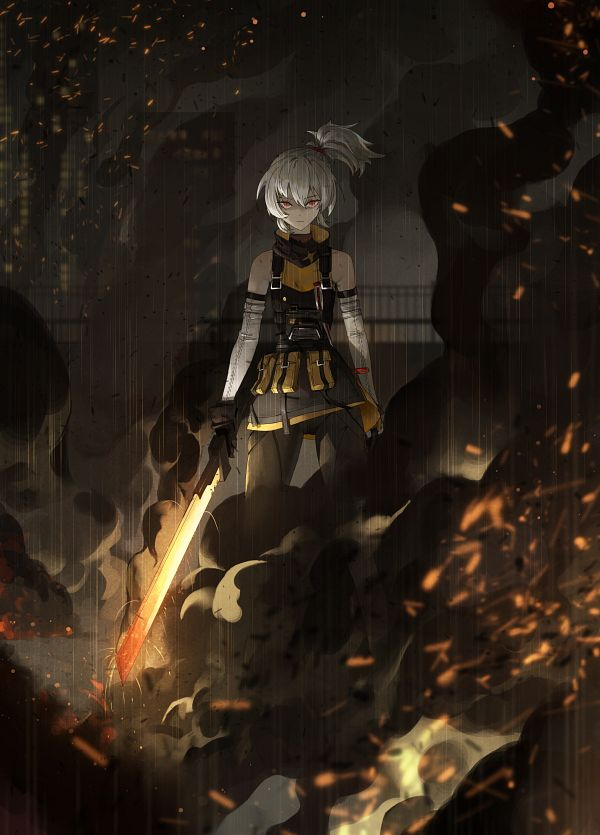
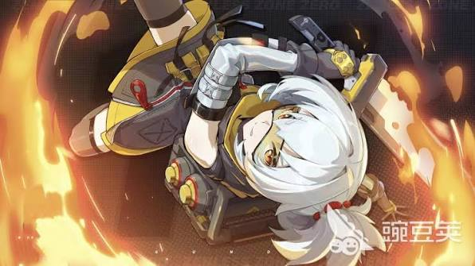

# 必需

Prompt:

Soldier 11 from Zenless Zone Zero, highly detailed anime-style illustration, polished game-art quality, stylish urban atmosphere, clean linework, soft cel shading, vivid color contrast.

Use Figure 1 as the pose reference and Figure 2 as the background/style reference. Depict Soldier 11 standing in front of a colorful graffiti wall, striking a pose similar to Figure 1: a stylish upper-body / half-body pose, turning her body slightly away while looking back toward the viewer over her shoulder, with one arm raised near her head / goggles, creating a confident and cool expression.

She should be wearing a modern sleeveless crop top, showing her midriff, with a fashionable street-style look that still suits her personality. You can pair it with tactical-inspired casualwear, such as fitted bottoms, straps, fingerless gloves, a belt, and subtle military details. Keep her recognizable features: short silver-white hair tied in a messy high ponytail, golden eyes, sharp facial features, goggles, and a calm, cold, slightly rebellious demeanor.

The graffiti wall behind her should be visually striking, inspired by Figure 2, with layered spray-paint textures, bold abstract shapes, vibrant splashes of color, and an energetic street-art aesthetic. The background should feel modern, edgy, and stylish, but Soldier 11 should remain the clear focus of the composition.

The overall mood should be cool, confident, urban, and fashionable, blending Soldier 11’s military identity with a more modern streetwear aesthetic. Emphasize attractive lighting, crisp facial detail, soft highlights on her hair and skin, and a strong composition that feels like a stylish character illustration or promotional art.

Optional Negative Prompt:

low quality, blurry, bad anatomy, extra arms, extra fingers, deformed hands, messy face, wrong hair color, missing goggles, incorrect character, bulky armor, combat battlefield, flames, cluttered background, weak graffiti details, chibi style, childish proportions, text, watermark, logo

# 参考图
## 1（该角色的壁纸）

Prompt:

Soldier 11 from Zenless Zone Zero, highly detailed anime-style illustration, cinematic action atmosphere, polished game-art quality, dramatic lighting, dark industrial mood.

Use the attached image as a composition and mood reference. Depict Soldier 11 standing on a rooftop at night, facing forward with a calm, cold, battle-hardened expression. In front of her is a pile of burning and smoking debris or destroyed objects, sending up thick black smoke and glowing embers.

The camera views her through the drifting smoke, so that parts of her body are partially obscured, creating a layered, atmospheric composition. The smoke should naturally veil parts of her legs, lower torso, and parts of the scene, while still keeping her silhouette and presence clear and striking. Emphasize the feeling that the viewer is looking at her from the other side of the fire and smoke.

Keep her recognizable design: short silver-white hair tied in a messy high ponytail, golden eyes, black tactical combat outfit with yellow-orange accents, sleeveless military-style top, straps, utility pouches, gloves, stockings, and a mechanical combat aesthetic. She holds her weapon downward at her side, the blade glowing with heat or faint fire, reinforcing her fire-based identity.

The rooftop environment should feel bleak, scorched, and tense, with embers floating in the air, smoke rising heavily, and dim orange firelight mixing with dark shadows. The overall mood should be intimidating, solemn, and cinematic, with Soldier 11 appearing unwavering amid destruction. Use strong contrast, subtle backlighting, and smoke depth to create a powerful, moody scene.

16:9 2K wallpaper format, Compared to the original image, it should have a more cinematic feel and be more realistic. The character's sheen, skin, stockings, etc., all need to be improved.

Optional Negative Prompt:

low quality, blurry, bad anatomy, extra limbs, extra fingers, chibi style, cheerful expression, bright colorful background, clean air, no smoke, weak atmosphere, incorrect outfit, missing weapon, badly drawn hands, flat lighting, cluttered composition

## 2（该角色的立绘）

Prompt:

Soldier 11 from Zenless Zone Zero, highly detailed anime-style illustration, dynamic action composition, polished game-art quality, dramatic lighting, intense fiery atmosphere, 16:9 2K wallpaper.

Use the attached image as a pose and composition reference. Depict Soldier 11 spinning in midair while unleashing a powerful slashing technique. Her body should be curled in a dynamic aerial rotation, with a strong sense of motion and momentum, as if she has just launched herself into the air during combat.

Show her wielding her weapon in the middle of the spin, with flames swirling around her blade in a circular arc. The fire should form a vivid, energetic ring around her, emphasizing the power and speed of the attack. Add sparks, fiery trails, and motion effects to make the attack feel explosive and fluid.

Keep her recognizable design: short silver-white hair tied in a messy high ponytail, golden eyes, black tactical combat outfit with yellow-orange accents, armored details, straps, utility gear, and a mechanical military aesthetic. Make sure to include her stockings and goggles clearly, matching the reference image. Her expression should be cold, focused, and battle-hardened, with a disciplined and determined look.

The perspective should feel dynamic and stylish, similar to official action art, with her body diagonally framed in the scene. The background can be a dark combat backdrop, abstract battle atmosphere, or fiery industrial setting, but it should remain secondary to the character and the swirling flames. Emphasize motion, heat, energy, and impact, with crisp linework, vivid flame lighting, and strong contrast.

Optional Negative Prompt:

low quality, blurry, bad anatomy, extra limbs, extra fingers, deformed hands, stiff pose, weak motion, flat flames, incorrect outfit, missing stockings, missing goggles, poorly drawn weapon, messy face, dull lighting, static composition, chibi style

## 3（加入绝区零中的邦布宠物）

Prompt:

Soldier 11 from Zenless Zone Zero, highly detailed anime-style illustration, soft cinematic lighting, warm slice-of-life atmosphere, polished game-art quality, 16:9 2K wallpaper format.

Depict Soldier 11 in a rare peaceful moment, wearing modern casual clothing instead of her combat uniform: a clean white short-sleeved top, a stylish short-sleeved jacket, casual shorts or skirt, subtle tactical-inspired accessories, and relaxed urban fashion. Keep her recognizable features: short silver-white hair tied in a slightly messy high ponytail, golden eyes, cool facial features, and a usually disciplined soldier-like demeanor softened by happiness.

She is holding a cute Bangboo-like mascot plush/companion, based on the attached reference: a small round black-and-white rabbit-eared robot mascot with glowing green eyes, orange scarf/bandana, orange-and-white ear details, and a soft toy-like body. Soldier 11 gently hugs it close with both arms, pressing her cheek against its face. Her expression is quietly content, softened, and deeply satisfied, as if she is trying to hide her happiness but cannot.

The composition should focus on emotional contrast: a normally cold, battle-hardened soldier showing a tender and relaxed side. Use a cozy urban background, soft evening light, warm indoor café lighting, or a calm city street scene. Add gentle highlights on her hair, soft fabric folds on her casual outfit, and cute details on the Bangboo mascot. The mood should feel adorable, peaceful, heartwarming, and slightly comedic, while still keeping Soldier 11 elegant and recognizable.

Negative Prompt:

low quality, blurry, bad anatomy, extra fingers, deformed hands, incorrect character, missing ponytail, wrong hair color, missing Bangboo, scary mascot, aggressive expression, combat armor, weapon, flames, dark battlefield, overly serious mood, chibi-only style, messy composition, text, logo, watermark.

# 八一建军节特别版 — 2026.08.01

## 4（建军节·军人荣耀）

Positive Prompt:
16:9 wallpaper, Soldier 11 from Zenless Zone Zero, highly detailed anime-style illustration, solemn military tribute atmosphere, dramatic dawn lighting, polished game-art quality, patriotic and powerful mood.

Depict Soldier 11 in a formal military tribute scene befitting her identity as a true soldier. She stands at rigid attention in the center of the frame, performing a crisp military salute with her right hand raised to her temple, fingers together and straight. Her left hand holds her greatsword vertically at her side, blade tip touching the ground, like a ceremonial guard's weapon. Her expression is intensely serious, proud, and unwavering — eyes forward, jaw set, embodying absolute discipline and honor.

She wears a modified ceremonial version of her combat uniform: her standard black tactical outfit elevated with formal military details — pressed fabric, polished buckles, a red-and-gold honor sash across her chest, a small medal pinned above her heart, and her goggles pushed up onto her forehead as a mark of respect. Her short silver-white hair is neatly combed back into a tighter ponytail than usual. Her stockings and boots are immaculate.

The background is a grand military ceremony at dawn: she stands on an elevated platform before a massive formation of silhouetted soldiers standing at attention in the misty background. Behind the formation, a colossal flagpole bears a flag rippling in the wind against a dramatic sunrise sky — deep gold, orange, and crimson clouds stretching across the horizon. Embers and sparks drift upward from ceremonial torches flanking the platform. The first rays of sunlight catch Soldier 11's silver hair and create a golden rim light around her silhouette.

Centered symmetrical composition, low camera angle looking up at Soldier 11, emphasizing her stature and authority. The mood is solemn, proud, and deeply moving.

Negative Prompt:
low quality, blurry, bad anatomy, extra fingers, deformed hands, casual clothing, cheerful smile, relaxed pose, messy hair, cute chibi style, urban streetwear, café background, peaceful domestic scene, dark gritty combat, flames on body, incorrect character, text, watermark, logo.

## 5（建军节·硝烟中的守护者）

Positive Prompt:
16:9 wallpaper, Soldier 11 from Zenless Zone Zero, highly detailed anime-style illustration, intense cinematic battlefield atmosphere, dramatic contrast lighting, polished game-art quality, 2K resolution.

Depict Soldier 11 as a guardian standing firm on a scarred battlefield, embodying the spirit of a soldier who protects at any cost. She stands in a wide protective stance in the foreground, her greatsword planted blade-first into the cracked, scorched ground in front of her with both hands gripping the handle. Behind her, she is shielding a group of huddled civilians — shadowy silhouettes of families, children, and elderly — who cower behind her solid frame. Her body language says "nothing gets past me."

Her expression is fierce, determined, and self-sacrificing. Her golden eyes burn with resolve. Her outfit is battle-worn: her tactical black-and-orange uniform is torn in places, with scorch marks and dust, but she stands unbroken. Her goggles are cracked but still on her head. Her silver-white ponytail is windswept and slightly singed at the tips. A thin trickle of blood runs from a cut on her cheek, but she doesn't flinch.

The battlefield around her is devastated: destroyed buildings crumble in the background, thick smoke rises from fires, debris is scattered across the ground. But where she stands, the ground is clear — as if her very presence has created a safe zone. Her fire element manifests as a warm protective aura: gentle flames form a semicircular barrier around her and the civilians behind her, casting warm amber light that contrasts with the cold gray destruction beyond.

Wide cinematic composition with strong foreground-background depth. Soldier 11 occupies the center-left, the protected civilians behind her on the right, and the devastated battlefield stretches into the smoky distance. The contrast between destruction and protection, fire and safety, is the emotional core.

Negative Prompt:
low quality, blurry, bad anatomy, extra limbs, deformed, cheerful scene, bright clean background, peaceful mood, cute style, chibi, no civilians, solo action pose, dancing, modern city, café, casual outfit, text, watermark.