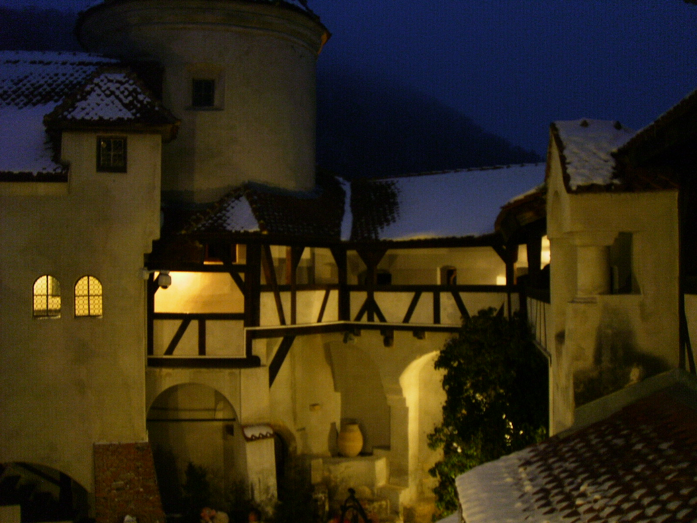
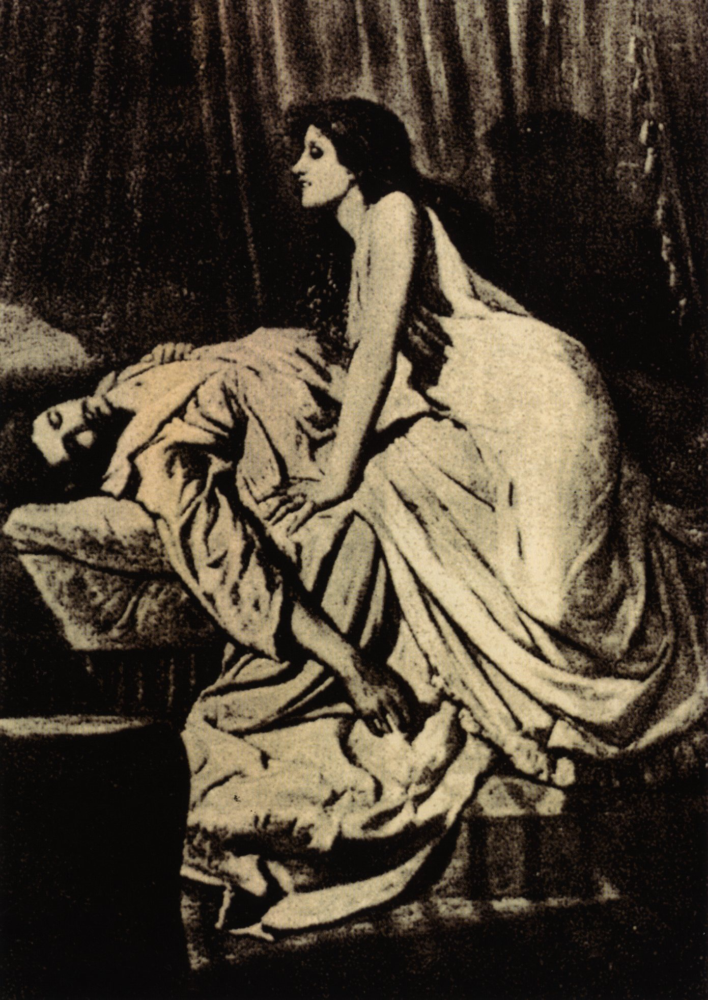

# 克拉蕾·弗林特 Claret Flint — 2026.08.09
> 视频类型：A · 角色单人壁纸合集
> 角色来源：绝区零 3.2版本 · S级电属性锋御代理人
> 身份：罗斯凯利法「弗林特工坊」核心人物 / 总务官
> 阵营：弗林特工坊
> 配音：中文CV 柳知萧 / 日文CV 植田佳奈（远坂凛配音演员）
> 设计参考：哥特吸血鬼贵族、棺材/蝙蝠翼元素、双马尾金发大小姐
> 热点背景：绝区零3.2版本「第三季·角色公开」于8月7-8日刚发布克拉蕾角色档案与立绘，S级新代理人，全新「锋御」职业定位，社区热度正处于最高峰的首发窗口期；同期公布的洛克茜将于3.2下半卡池登场，克拉蕾预计3.2上半上线
> 今日特殊：角色公开仅2天，是社区讨论量与搜索热度的最高点，"为什么建模这么怪""有棺人员"等梗正在发酵中

# 必需

Refer to the attached reference image (Figure 1). Generate a similar style image of Claret Flint from Zenless Zone Zero sitting in front of a bold graffiti wall with a haughty, disdainful expression, chin slightly raised, looking down at the camera with aristocratic superiority. She is wearing modern street-fashion: a black cropped corset top with white lace trim under an oversized dark burgundy varsity jacket worn off one shoulder, paired with a black pleated mini skirt with bat-wing motif hem, black thigh-high socks with red ribbon accents, and black platform lace-up boots. Keep her recognizable features: long blonde twin-tails with dark red gradient tips, bright red eyes, pale skin, a small white ribbon and dark ornament at the crown of her head. The graffiti wall behind her should feature crimson and black abstract patterns, bat silhouettes, and gothic coffin-shaped tags. Dim red neon light casts dramatic shadows across the scene. 16:9 2K wallpaper format. perfect hands, five fingers on each hand, anatomically correct hands, well-defined fingers, natural relaxed hand pose.

Negative Prompt: low quality, worst quality, blurry, pixelated, bad anatomy, bad hands, extra fingers, fewer fingers, missing fingers, fused fingers, webbed fingers, merged fingers, overlapping fingers, deformed fingers, mutated fingers, six fingers, four fingers, three fingers, more than five fingers, less than five fingers, disfigured hands, poorly drawn hands, bad hand anatomy, asymmetrical hands, broken fingers, claw hands, blurry hands, indistinct fingers, smeared hands, extra limbs, chibi, childish, wrong hair color, black hair, wrong eye color, blue eyes, cheerful sunny setting, warm daylight, text, watermark, logo, signature.

# 人物设定

## 1 — 弗林特工坊·总务官的日常（傲娇日常场景）

Positive Prompt:
16:9 2K wallpaper, Claret Flint from Zenless Zone Zero, highly detailed anime-style illustration, polished game-art quality, warm indoor lighting, playful comedic atmosphere with a hint of gothic elegance.

Depict Claret standing in the ornate study of the Flint Workshop in Lumina Square, surrounded by stacks of ledgers, gilded ornaments, and antique furniture befitting workshop nobility. She stands with arms crossed and one eyebrow raised, trying to maintain a composed, dismissive expression, but a small platter of limited-edition desserts sits on the desk beside her — and her eyes keep darting toward it, betraying the tsundere crack in her aristocratic facade. Her cheeks carry a faint blush.

Full canonical design: long blonde twin-tails with dark crimson-to-black gradient at the tips, tied high with dark ribbons and a small white lace bow ornament, bangs framing her face with a few loose strands, bright red eyes with sharp confident gaze, pale porcelain skin. She wears her signature gothic-lolita-inspired outfit: a black-and-white halter-style corset bodice with cross-shaped silver clasps, an asymmetrical black pleated skirt with tattered bat-wing hem edges and crimson underlining, a wide red-and-black belt with ornate buckle at her waist, black elbow-length gloves with white cuffs, black thigh-high stockings with faint bat-pattern lace, and tall black lace-up platform boots with red heel accents. A pair of stylized bat-wing shoulder pauldrons frame her upper arms.

The study around her is richly decorated: dark mahogany bookshelves, red velvet curtains, gold candelabras with flickering candlelight, portraits of past Flint family heads on the walls, and a large ornate mirror. Warm amber candlelight mixes with cool shadows in the corners, giving the room an old-money gothic-manor atmosphere.

Medium-close composition with Claret at center, the dessert platter visible in the foreground bottom-corner as a storytelling detail. The mood is charming, comedic, and endearing — the "ice queen" whose composure cracks for something as small as a sweet treat.

perfect hands, five fingers on each hand, anatomically correct hands, well-defined fingers, arms crossed naturally with fingers visible.

Negative Prompt:
low quality, worst quality, blurry, bad anatomy, bad hands, extra fingers, fewer fingers, missing fingers, fused fingers, webbed fingers, merged fingers, overlapping fingers, deformed fingers, mutated fingers, six fingers, four fingers, three fingers, disfigured hands, poorly drawn hands, bad hand anatomy, asymmetrical hands, broken fingers, blurry hands, indistinct fingers, extra limbs, incorrect character, wrong hair color, black hair, short hair, outdoor scene, combat pose, weapon drawn, chibi style, text, watermark, logo.

## 2 — 电光斧刃·锋御职业觉醒（战斗形态）

Positive Prompt:
16:9 2K wallpaper, Claret Flint from Zenless Zone Zero, highly detailed anime-style illustration, dynamic action composition, dramatic Electric elemental effects, polished game-art quality, epic battle atmosphere.

Depict Claret in the middle of combat, gripping her massive bat-winged battle-axe with both hands, its blade a translucent crimson crescent crackling with violet-white electric arcs along the edge. She is captured mid-swing, body twisted in a powerful diagonal stance, one leg planted and the other extended for balance, twin-tails whipping through the air with the momentum of her strike. Her expression is fierce and focused, red eyes blazing with electric energy reflected in her irises.

Full canonical design rendered with maximum detail: blonde twin-tails with dark red gradient tips crackling with faint electric sparks at the ends, the black-and-white corset outfit now battle-torn at the edges, bat-wing pauldrons glowing with a faint violet electric aura, black gloves gripping the axe handle with visible tension, thigh-high stockings and platform boots planted firmly on cracked ground. Small arcs of purple-white lightning dance across her weapon and along her forearms.

The battlefield environment is a ruined section of a Hollow — twisted metallic debris, fractured concrete pillars with exposed rebar, a sickly violet-tinted sky typical of Hollow spaces, faint particles of corrupted Ether drifting like ash. Electric energy from her attack scorches visible arcs into the ground beneath her.

Dynamic diagonal composition with Claret as the central force, her axe blade slicing across the frame creating a strong visual line, electric sparks radiating outward. The color palette contrasts deep violet-black shadows with crackling white-purple electric highlights and her signature crimson accents.

perfect hands, five fingers on each hand, anatomically correct hands, well-defined fingers, both hands gripping the axe handle firmly.

Negative Prompt:
low quality, blurry, bad anatomy, bad hands, extra fingers, fewer fingers, missing fingers, fused fingers, webbed fingers, merged fingers, overlapping fingers, deformed fingers, mutated fingers, six fingers, four fingers, disfigured hands, poorly drawn hands, bad hand anatomy, broken fingers, blurry hands, indistinct fingers, smeared hands, extra limbs, stiff pose, weak effects, flat lighting, bright cheerful daylight, cute peaceful expression, missing weapon, fire effects, ice effects, chibi, text, watermark.

## 3 — 棺中安眠·哥特贵族肖像（标志性吸血鬼美学）

Positive Prompt:
16:9 2K wallpaper, Claret Flint from Zenless Zone Zero, highly detailed anime-style illustration, gothic horror-romance atmosphere, moody candlelit interior, polished character art with cinematic chiaroscuro lighting.

Depict Claret reclining gracefully inside an ornate open coffin lined with crimson velvet and gold filigree trim, styled more like a luxurious daybed than a grave. One arm rests along the coffin's edge, the other holds a wine glass filled with a deep red liquid, swirled lazily between black-gloved fingers. Her legs are crossed elegantly, one boot dangling just outside the coffin's edge. Her expression is a mixture of boredom and imperious amusement — the picture of aristocratic ennui, as if eternity itself bores her.

Her full design is rendered in rich detail: blonde twin-tails cascading over the coffin's velvet lining, dark red gradient tips pooling like drops of wine, bright red eyes half-lidded with languid confidence, the black-and-white corset dress with silver cross clasps, bat-wing pauldrons folded against her shoulders like resting wings, dark stockings and boots crossed at the ankle. Faint bat-shaped shadows flutter across the wall behind her from unseen candlelight.

The chamber around her is a private chapel-like room within the Flint Workshop manor: tall stained-glass windows depicting bats and roses, dozens of tall black candles burning in ornate candelabras, dark stone walls draped with crimson tapestries bearing the Flint family crest, cobweb details in the high corners for atmosphere without appearing decayed or dirty.

Intimate vertical-leaning composition with the coffin as a dramatic framing device, Claret's pale skin and golden hair providing luminous contrast against the deep crimson and black surroundings. The mood is darkly glamorous, theatrical, and unmistakably vampiric.

perfect hands, five fingers on each hand, anatomically correct hands, well-defined fingers, fingers elegantly wrapped around the wine glass stem.

Negative Prompt:
low quality, blurry, bad anatomy, bad hands, extra fingers, fewer fingers, missing fingers, fused fingers, webbed fingers, merged fingers, overlapping fingers, deformed fingers, mutated fingers, six fingers, four fingers, disfigured hands, poorly drawn hands, bad hand anatomy, broken fingers, blurry hands, indistinct fingers, smeared hands, extra limbs, daytime scene, bright sunlight, cheerful expression, combat pose, weapon drawn, decayed corpse imagery, horror gore, chibi, text, watermark.

## 4 — 甜品攻略战·傲娇破防瞬间（社区梗特别场景）

Positive Prompt:
16:9 2K wallpaper, Claret Flint from Zenless Zone Zero, highly detailed anime-style illustration, bright comedic lighting, lighthearted slice-of-life atmosphere, expressive character art.

Depict Claret at an elegant tea table set within a sunlit workshop garden courtyard, confronted with not one but two servings of a limited-edition dessert — an elaborate crimson-and-gold tiered pastry — placed before her by an unseen attendant. Her carefully composed aristocratic mask has completely shattered: eyes wide with surprise, a full blush across both cheeks, mouth slightly open in a flustered "wha—?!" expression, one hand half-raised as if to protest while the other is already reaching for the closer plate.

Her design remains fully recognizable even in this comedic moment: blonde twin-tails bouncing with her startled motion, dark red gradient tips catching the sunlight, bright red eyes wide and sparkling, the black-and-white corset outfit slightly softened here with a lace-trimmed apron-like overlay suggesting a rare "off-duty" moment, bat-wing pauldrons still present but no longer looking threatening — almost cute in this context.

The courtyard setting is warm and inviting: white wrought-iron furniture, blooming dark red roses climbing a nearby trellis, soft dappled sunlight filtering through workshop rooftop gardens, a hint of gothic architecture in the background reminding viewers this is still Flint territory despite the sweetness of the moment.

Medium close-up composition emphasizing her flustered expression, with the two dessert plates prominent in the foreground. The mood is warm, funny, and utterly endearing — a rare crack in the "ice queen of Rosecalifa" persona.

perfect hands, five fingers on each hand, anatomically correct hands, well-defined fingers, one hand half-raised in protest, fingers naturally spread.

Negative Prompt:
low quality, blurry, bad anatomy, bad hands, extra fingers, fewer fingers, missing fingers, fused fingers, webbed fingers, merged fingers, overlapping fingers, deformed fingers, mutated fingers, six fingers, four fingers, disfigured hands, poorly drawn hands, bad hand anatomy, broken fingers, blurry hands, indistinct fingers, extra limbs, cold expressionless face, dark night scene, combat gear, weapon visible, serious mood, chibi, text, watermark.

## 5 — 赛博罗斯凯利法·霓虹吸血贵族（赛博朋克变体）

Positive Prompt:
16:9 2K wallpaper, Claret Flint from Zenless Zone Zero, highly detailed anime-style illustration, cyberpunk aesthetic, neon-noir atmosphere, polished character art, futuristic gothic elegance.

Reimagine Claret walking through a rain-soaked neon-lit street in New Eridu at night, her figure reflected in the wet pavement below. She wears a modernized cyber-gothic version of her outfit: a black synthetic-leather corset with embedded crimson LED piping along the seams, holographic Flint Workshop insignia flickering faintly on her shoulder pauldron, a layered black skirt with translucent red panel inserts that glow faintly from within, thigh-high boots with illuminated soles leaving faint red light-trails with each step.

Her bat-wing pauldrons are reimagined as sleek mechanical wings with thin glowing red circuit-lines, capable of folding and unfolding like actual bat wings. Her blonde twin-tails now have subtle embedded fiber-optic strands at the red gradient tips, pulsing gently like veins of light. Her red eyes feature a faint HUD-like overlay of scrolling data, and small floating holographic bat-shaped particles drift around her like fireflies.

She holds her battle-axe transformed into a compact folded state resting on one shoulder, its blade dimly glowing violet-red in standby mode. Her expression retains her signature haughty composure, now with a technologically enhanced mystique.

The cyberpunk street is dense with atmosphere: towering skyscrapers with massive holographic advertisements, steam rising from grates, neon signs in red, violet, and black reflecting in puddles, distant hover-vehicles streaking light trails through the smog-tinted sky.

Frontal walking composition with Claret approaching the viewer, her reflection creating vertical symmetry in the wet street. Deep violet-black shadows dominate with crimson and electric-purple neon accents.

perfect hands, five fingers on each hand, anatomically correct hands, well-defined fingers, one hand resting on folded axe, other hand relaxed at her side.

Negative Prompt:
low quality, blurry, bad anatomy, bad hands, extra fingers, fewer fingers, missing fingers, fused fingers, webbed fingers, merged fingers, overlapping fingers, deformed fingers, mutated fingers, six fingers, four fingers, disfigured hands, poorly drawn hands, bad hand anatomy, broken fingers, blurry hands, indistinct fingers, smeared hands, extra limbs, medieval fantasy setting, bright daylight, cheerful expression, cute soft pastel colors, historical clothing, male character, chibi, text, watermark.

## 6 — 辉金账簿·总务官的谈判桌（身份/职权场景）

Positive Prompt:
16:9 2K wallpaper, Claret Flint from Zenless Zone Zero, highly detailed anime-style illustration, sharp business-noir atmosphere, dramatic side lighting, polished game-art quality, commanding presence.

Depict Claret seated behind a grand mahogany desk piled with financial ledgers stamped with the Flint Workshop crest, one hand resting atop a stack of golden Polychrome coins, the other holding a quill mid-signature over a contract. She leans back slightly in an ornate high-backed chair, gazing directly at the viewer (representing a visitor or debtor) with a sharp, calculating half-smile — the look of someone who holds all the financial leverage in Rosecalifa and knows it.

Her design is rendered in full detail: blonde twin-tails styled slightly more severe and business-like for this scene while retaining the dark red gradient tips, sharp red eyes with a shrewd glint, the black-and-white corset outfit paired here with a longer formal black coat draped over her shoulders like a cape, bat-wing pauldron details visible at the coat's shoulder seams, dark gloves holding the quill with precise elegant grip.

The office is lavish and imposing: floor-to-ceiling windows revealing the Rosecalifa skyline at dusk, dark wood panelling, a large safe visible in the background corner, portraits of Flint ancestors, an antique globe, and stacks of gold coins and jewels scattered artfully across the desk to convey overwhelming wealth.

Wide cinematic composition with Claret centered behind the desk, warm dusk light streaming through the windows behind her creating a powerful silhouette effect at the edges while keeping her face and upper body clearly lit. The mood is one of quiet, absolute financial dominance.

perfect hands, five fingers on each hand, anatomically correct hands, well-defined fingers, one hand gripping quill pen precisely, other hand resting on coin stack.

Negative Prompt:
low quality, blurry, bad anatomy, bad hands, extra fingers, fewer fingers, missing fingers, fused fingers, webbed fingers, merged fingers, overlapping fingers, deformed fingers, mutated fingers, six fingers, four fingers, disfigured hands, poorly drawn hands, bad hand anatomy, broken fingers, blurry hands, indistinct fingers, extra limbs, outdoor scene, combat pose, weapon drawn, casual clothing, cheerful bright mood, chibi, text, watermark.

## 7 — 满月低血压·赖床的小小吸血鬼（可爱反差日常）

Positive Prompt:
16:9 2K wallpaper, Claret Flint from Zenless Zone Zero, highly detailed anime-style illustration, soft morning lighting, cozy comedic atmosphere, adorable character art.

Depict Claret still half-asleep in an ornate coffin-shaped bed with black silk sheets and crimson velvet pillows, morning sunlight streaming through a gap in heavy curtains directly onto her face. She is curled up defensively, one arm thrown over her eyes to block the light, hair adorably messy with one twin-tail half-undone, expression scrunched into an irritated, groggy pout — the classic "low blood pressure vampire hates mornings" joke brought to life. A small bat-shaped plush toy is hugged against her chest.

Her design remains recognizable despite the disheveled morning state: blonde hair with dark red gradient tips now loose and tousled across the pillow, one twin-tail ribbon coming undone, bright red eyes barely visible in a squint, wearing a simple black-and-white lace nightgown that hints at her usual gothic aesthetic without the full armored look, bat-wing motif embroidered subtly on the pillow and blanket edge.

The bedroom is opulently gothic yet cozy: dark wood furniture, tall arched window with heavy burgundy curtains only half-drawn, a vanity table cluttered with jewelry and a small mirror, dried rose petals scattered decoratively, warm golden morning light cutting through the otherwise dim, curtained room.

Intimate close-up composition focusing on her sleepy, irritated expression and the messy bedding, morning light creating a soft glow along her hair and skin. The mood is warm, funny, and heart-meltingly cute.

perfect hands, five fingers on each hand, anatomically correct hands, well-defined fingers, one arm draped over her eyes with fingers relaxed, other arm hugging the plush toy.

Negative Prompt:
low quality, blurry, bad anatomy, bad hands, extra fingers, fewer fingers, missing fingers, fused fingers, webbed fingers, merged fingers, overlapping fingers, deformed fingers, mutated fingers, six fingers, four fingers, disfigured hands, poorly drawn hands, bad hand anatomy, broken fingers, blurry hands, indistinct fingers, extra limbs, full formal outfit, combat gear, weapon visible, serious cold expression, nighttime scene, chibi, text, watermark.

# 参考图

## 8（基于官方立绘·雨夜战斧特写）

Referring to the attached official splash art (Figure 8), generate a similar style 16:9 2K wallpaper of Claret Flint from Zenless Zone Zero standing on a rain-slicked rooftop at night, her massive bat-winged crimson battle-axe held low at her side, the blade catching faint red ambient light. Preserve her exact canonical design: blonde twin-tails with dark red gradient tips, bright red eyes, the black-and-white corset dress with cross clasps, bat-wing pauldrons, thigh-high stockings, black platform boots. Rain droplets glisten on her hair and shoulders. A full moon partially obscured by storm clouds glows behind her, and the distant Rosecalifa skyline is visible below the rooftop, lights blurred by the rain. Her expression is calm and watchful, chin slightly lowered, eyes looking up toward the viewer with quiet intensity.

Negative Prompt: low quality, worst quality, blurry, bad anatomy, bad hands, extra fingers, missing fingers, fused fingers, deformed fingers, mutated fingers, six fingers, four fingers, disfigured hands, poorly drawn hands, extra limbs, wrong hair color, wrong eye color, incorrect character, daytime, bright sunlight, cheerful expression, chibi, text, watermark, logo.

## 9（手机竖屏壁纸·9:16适配）

Referring to the attached official splash art (Figure 8) for character accuracy, generate a 9:16 mobile wallpaper of Claret Flint from Zenless Zone Zero standing confidently with her battle-axe planted blade-down on the ground beside her, one hand resting atop the weapon's hilt. Preserve her full canonical design in vertical composition with generous headroom and space near the bottom for a phone's home-screen icons. Background is a simplified dark gothic vignette with soft crimson and black gradient, subtle bat silhouettes floating in the upper portion, and faint sparkling Electric-attribute particles drifting around her figure. Clean, poster-like composition emphasizing her full-body design.

Negative Prompt: low quality, worst quality, blurry, bad anatomy, bad hands, extra fingers, missing fingers, fused fingers, deformed fingers, mutated fingers, six fingers, four fingers, disfigured hands, poorly drawn hands, extra limbs, cluttered background, busy composition, cropped head, wrong hair color, wrong eye color, chibi, text, watermark, logo.

# 跨领域参考图

## 10（参考布朗城堡哥特庄园夜景·吸血鬼贵族宅邸融合）

Positive Prompt:
Refer to the attached reference image (Figure 10) of a real gothic castle courtyard at night — note the warm amber window-light glowing against deep navy-black sky, the half-timbered stone architecture, and the layered rooftop silhouettes. Generate a 16:9 2K wallpaper of Claret Flint from Zenless Zone Zero standing in the inner courtyard of a gothic manor styled after this reference, leaning casually against a stone archway with her battle-axe resting against the wall beside her. Preserve her exact canonical design and color palette: blonde twin-tails with dark red gradient tips, bright red eyes, black-and-white corset dress, bat-wing pauldrons, dark stockings and platform boots.

Fuse the architectural mood of the reference — warm firelit windows, snow-dusted rooftops, deep navy night sky, half-timbered stonework — into the Flint Workshop manor setting, adding subtle Electric-attribute sparks crackling faintly near her fingertips as a unique elemental touch that the reference photo does not have. Her expression is relaxed and faintly amused, as if she owns every stone of this place (which, as workshop nobility, she effectively does).

Negative Prompt:
low quality, worst quality, blurry, bad anatomy, bad hands, extra fingers, fewer fingers, missing fingers, fused fingers, webbed fingers, merged fingers, overlapping fingers, deformed fingers, mutated fingers, six fingers, four fingers, disfigured hands, poorly drawn hands, bad hand anatomy, broken fingers, blurry hands, indistinct fingers, extra limbs, photorealistic face, modern casual clothing, daytime lighting, wrong hair color, wrong eye color, incorrect character, chibi, text, watermark, logo.

## 11（参考经典吸血鬼油画《The Vampire》·哥特掠食者构图融合）

Positive Prompt:
Refer to the attached reference image (Figure 11), Philip Burne-Jones's 1897 classical gothic painting "The Vampire" — note the predatory triangular composition with the vampire woman leaning over her fallen victim, the dramatic chiaroscuro lighting, heavy dark drapery in the background, and the flowing pale gown cascading down like a shroud. Generate a 16:9 2K wallpaper of Claret Flint from Zenless Zone Zero recreating this iconic pose: she leans forward over the back of an ornate velvet chaise longue, one hand resting possessively near an unseen "victim" implied just out of frame at the bottom edge, her upper body twisted toward the viewer with a knowing, faintly predatory smile playing on her lips, eyes half-lidded with dangerous allure.

Preserve her exact canonical design and color palette: blonde twin-tails with dark red gradient tips flowing loosely over one shoulder in place of the painting's dark hair, bright red eyes replacing the original's shadowed gaze, the black-and-white corset dress with cross clasps, bat-wing pauldrons, dark stockings. Fuse the painting's dramatic sepia-toned chiaroscuro lighting and heavy curtain backdrop into a modernized crimson-and-black gothic palette, keeping the same dramatic diagonal composition and predatory atmosphere. Add faint Electric-attribute sparks flickering near her extended hand as a unique elemental touch absent from the original painting.

Negative Prompt:
low quality, worst quality, blurry, bad anatomy, bad hands, extra fingers, fewer fingers, missing fingers, fused fingers, webbed fingers, merged fingers, overlapping fingers, deformed fingers, mutated fingers, six fingers, four fingers, disfigured hands, poorly drawn hands, bad hand anatomy, broken fingers, blurry hands, indistinct fingers, extra limbs, visible victim character, gore, horror injury details, black-and-white monochrome rendering, wrong hair color, wrong eye color, incorrect character, daytime lighting, cheerful expression, chibi, text, watermark, logo.

# 注
本期未能从B站WIKI获取到二次创作分类的立绘资源，因角色档案于8月7-8日刚发布，二次创作维基页面尚未建立（wiki.biligame.com/zzz/克拉蕾 页面为空）。已改用百度百科词条概述图（首发官方立绘，1297x1369，来源 zenless.hoyoverse.com 官方PV截取）作为参考图核心素材，图片准确性和清晰度均有保障。

跨领域参考图共两张，均来自维基共享资源（Wikimedia Commons，公共领域/自由授权素材）：其一为布朗城堡（Bran Castle，"德古拉城堡"原型）夜景照片，用于场景氛围融合；其二为英国画家 Philip Burne-Jones 创作于1897年的经典哥特油画《The Vampire》（吸血鬼），画面中吸血鬼女性俯身猎物的经典构图与阴郁光影，与克拉蕾"哥特吸血鬼贵族"的人设定位高度契合，是本期"人物姿态与氛围融合"类跨领域参考图的核心素材。
