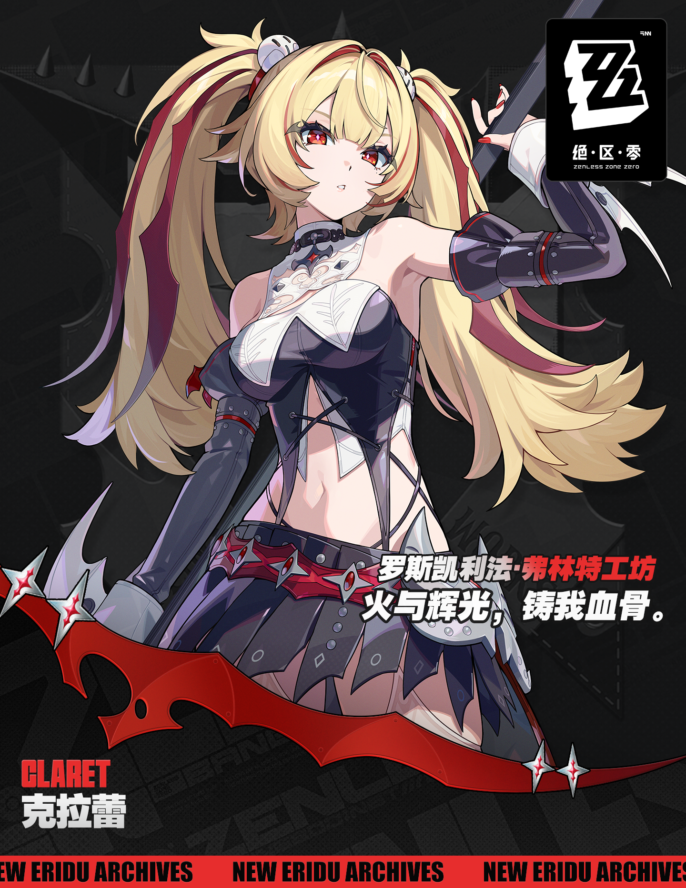

# 克拉蕾·弗林特 Claret Flint — 2026.09.06
> 视频类型：A · 角色单人壁纸合集
> 角色来源：绝区零（Zenless Zone Zero）3.2「她与她的隐秘往事」· S级电属性锋御（防御转化主C）
> 身份：罗斯凯利法·弗林特工坊总务官 / 弗林特家族大小姐 · 掌控新艾利都大半辉金锻造产业 · 空洞猎人武器背后的供应商
> 阵营：罗斯凯利法·弗林特工坊（Flint Works，火与辉光，铸我血骨）
> 配音：中配柳知萧 / 日配植田佳奈
> 热点背景：3.2版本9月9日上线，克拉蕾为上半卡池主推新角色（首位「锋御」职业代理人）；8月7日档案官宣后「傲娇大小姐」「甜品两份破防」「弗林特=全城大债主」梗持续发酵；角色展示《不想培训，但攻略已写好》热度高
> 今日特殊：无特殊节日；3.2上线倒计时3天，卡池预热最后窗口期
> 选定类型理由：版本上线前预热期热点（权重40%）→ 类型A深度呈现
> 选定角色理由：工作区首次覆盖（同版本洛克茜8/28已做过）；官方热点为版本上半卡池主推+新职业首发；外观辨识度极强（金发绯红挑染双马尾+白色骨头形发饰+红瞳小虎牙+黑白哥特战衣+蝙蝠翼纹样），壁纸表现力强；社区梗素材丰富（甜品两份、辉金债务、傲娇退环境讨论）
> 参考图校对：`splash-art.png`（米游社官方立绘 1440×1865）与 `official-wallpaper.png`（官方壁纸 2080×3180）已用视觉工具逐张确认发色/瞳色/服饰/武器细节

---

# 必需

## 1 — 涂鸦墙街头风（Graffiti Wall Street Style）

Refer to the attached reference image (Figure 1). Generate a similar style image of Claret Flint from Zenless Zone Zero sitting casually in front of a bold graffiti wall. Claret is seated in a relaxed but confident posture, leaning back against the graffiti wall with one knee raised and that foot planted flat on the ground, while her other leg stretches out to the side, both legs clearly separated with a visible gap between them and never crossing or overlapping, one hand resting loosely on her raised knee while the other idly balances a gleaming golden gear-cog on her fingertip, her body language calm, controlled, and slightly provocative. Her expression should show cold, disdainful eyes, aloof, sharp, and superior — the pouting princess of the Flint Works silently appraising the viewer like a debtor who has come to beg for an extension, a tiny fang bared in an unimpressed sneer.

Keep Claret's recognizable features: very long golden-blonde twintails with crimson-red gradient streaks in the inner layers, white bone-shaped skull hair ornaments at the base of each twintail, bright crimson-red eyes, a small fang at the corner of her mouth, and a black choker with a red bat-shaped gem. Blend her canonical design with a modern edgy streetwear aesthetic: a white cropped tube top with a black bat-wing print under an open cropped charcoal-purple leather jacket with silver studs and red stitching worn off one shoulder, a high-waisted black pleated mini skirt with a red bat-emblem belt buckle and silver chain, one sheer white thigh-high stocking with grey bat silhouettes and one bare leg, and chunky black platform boots with silver buckles. A gold chain necklace with a tiny anvil pendant completes the look. Preserve her identity while giving her a fresh urban street-style look.

The graffiti wall behind her should be vivid and layered, full of expressive abstract shapes and energetic street-art textures in crimson red, charcoal black, and gold tones, with graffiti elements including "FLINT WORKS" in gothic blackletter lettering, a large spray-painted bat-wing emblem, anvil and hammer motifs, golden gear cogs, lightning-bolt stencils for her electric element, and dripping paint effects, creating a rebellious urban backdrop that resonates with her character theme. Add subtle violet electric sparks and golden forge-ember particles drifting around her to reinforce her identity.

Use a wide cinematic framing suitable for a 16:9 wallpaper, with Claret as the main focal point while still showing enough of the graffiti wall and surrounding environment for atmosphere. The mood should feel cool, stylish, intimidating, and mysterious. Highly detailed background, rich shadows, crimson and gold glowing highlights, sharp focus on Claret, and a refined high-end anime illustration look.

perfect hands, five fingers on each hand, anatomically correct hands, well-defined fingers, natural hand pose, one hand resting on her knee, the other balancing a small golden cog on her fingertip.

Negative Prompt:
low quality, worst quality, blurry, pixelated, bad anatomy, extra limbs, bad hands, extra fingers, fewer fingers, missing fingers, fused fingers, webbed fingers, merged fingers, overlapping fingers, deformed fingers, mutated fingers, six fingers, four fingers, three fingers, more than five fingers, less than five fingers, disfigured hands, poorly drawn hands, bad hand anatomy, asymmetrical hands, broken fingers, claw hands, blurry hands, indistinct fingers, smeared hands, standing, standing pose, upright posture, singing, open mouth singing, warm smile, gentle smile, cheerful expression, adorable, sweet, innocent, game canonical outfit, official costume, fantasy dress, medieval clothing, armor, full gown, formal dress, beach background, ocean background, nature background, indoor background, plain background, minimal background, missing graffiti wall, low detail graffiti, generic graffiti, wrong graffiti colors, wrong streetwear, missing crop top, missing jacket, missing skirt, long dress, full pants, business suit, school uniform, wrong hair color, wrong eye color, text, watermark, logo, signature.

---

## 2 — 辉金徽记·债主的估值（角色特写肖像 / Close-up Portrait）

Refer to the attached reference image (Figure 2). Generate a cinematic close-up portrait of Claret Flint from Zenless Zone Zero. She holds a single gleaming golden coin stamped with the Flint Works bat emblem — freshly forged from huikin gold — between her slender fingers close to the left side of her face, the coin raised to eye height, partially obscuring her left eye so that only a sliver of her crimson iris glimmers past its edge. Her visible right eye gazes directly at the viewer — simultaneously appraising and seduced, the look of a proud heiress deciding whether your commission is worth the Flint name, while the coin in her hand recalls exactly what happened the last time someone offered her a double portion of desserts. Expression: aristocratic composure layered over a faint, treacherous softening that never fully reaches her eyes, the barest pout on her lips with one small fang showing, as if she is caught between quoting a price and surrendering to temptation. Dramatic single-source lighting from the upper left casts deep chiaroscuro across her features, the golden coin glowing rich amber where the light strikes its embossed bat emblem. Her fair skin contrasts sharply against a pure black background. Her signature golden-blonde twintails with crimson inner streaks spill like molten gold down the right side of the frame; her white bone-shaped hair ornaments catch a single sharp highlight; her black choker with its red bat gem glows faintly crimson. A workshop that arms half of New Eridu, run by a girl who can resist any price except two desserts at once. 16:9 2K wallpaper.

perfect hands, five fingers on each hand, anatomically correct hands, well-defined fingers, fingers elegantly pinching the golden coin.

Negative Prompt:
low quality, worst quality, blurry, pixelated, bad anatomy, extra limbs, bad hands, extra fingers, fewer fingers, missing fingers, fused fingers, webbed fingers, merged fingers, overlapping fingers, deformed fingers, mutated fingers, six fingers, four fingers, three fingers, more than five fingers, less than five fingers, disfigured hands, poorly drawn hands, bad hand anatomy, asymmetrical hands, broken fingers, claw hands, blurry hands, indistinct fingers, smeared hands, full body shot, wide shot, landscape, multiple subjects, busy background, bright cheerful lighting, outdoor scene, action pose, weapon drawn, standing, chibi, wrong hair color, wrong eye color, text, watermark, logo, signature.

---

# 人物设定

## 3 — 弗林特工坊·辉金锻造大厅（身份/阵营场景）

Positive Prompt:
16:9 2K wallpaper, Claret Flint from Zenless Zone Zero, highly detailed anime-style illustration, polished 3D-cel-shaded game-art quality, industrial gothic atmosphere with crimson and gold accents.

Depict Claret standing at the elevated overseer's platform of the Flint Works grand forge in Roscalifa, a young mistress inspecting the production line she commands. Her unmistakable features command the scene: very long golden-blonde twintails with crimson-red inner gradient streaks, white bone-shaped skull ornaments at each twintail base, crimson-red eyes gleaming with imperious pride, a small fang showing in her pouting expression, and her black choker with a red bat-shaped gem. She wears her canonical outfit fully rendered: a black-and-white gothic corset bodice with silver lacing and white wing-motif chest detailing, bare shoulders and midriff, detached charcoal-purple sleeves with red arm bands, white claw-shaped gauntlets on her forearms, a black riveted wide waist-cincher belt with a red gem buckle, an asymmetrical jagged black skirt with bat-wing hem and silver studs, white thigh-high stockings patterned with grey bat silhouettes, and black heeled boots. She holds her signature massive polearm over one shoulder — a dark long shaft crowned with a huge crimson bat-wing-shaped blade with serrated edges — resting it with easy familiarity, as if it weighed nothing.

Below her platform, the forge roars: rows of anvils with showers of golden sparks, half-finished greatswords and armor plates glowing orange on assembly lines, heavy crane chains, and huge gears turning in the walls. A giant banner bearing the "FLINT WORKS" bat-wing emblem hangs behind her, and the motto "Fire and Radiance, Forge My Blood and Bone" is emblazoned in gold above the furnace doors. Violet electric arcs crackle faintly along her blade when her fingers tighten on the shaft. Dramatic forge lighting from below illuminates her silhouette. The mood is imperious, industrial, and fiercely proud — the total officer of a workshop that arms half of New Eridu.

perfect hands, five fingers on each hand, anatomically correct hands, well-defined fingers, one hand gripping the polearm shaft resting on her shoulder, the other hand on her hip.

Negative Prompt:
low quality, worst quality, blurry, pixelated, bad anatomy, extra limbs, bad hands, extra fingers, fewer fingers, missing fingers, fused fingers, webbed fingers, merged fingers, overlapping fingers, deformed fingers, mutated fingers, six fingers, four fingers, three fingers, more than five fingers, less than five fingers, disfigured hands, poorly drawn hands, bad hand anatomy, asymmetrical hands, broken fingers, claw hands, blurry hands, indistinct fingers, smeared hands, wrong hair color, wrong eye color, missing choker, missing bone hair ornaments, casual modern streetwear, chibi, photorealistic, dark gritty horror, text, watermark, logo, signature.

---

## 4 — 区区甜品·两份破防（角色梗场景 · 官方台词特别版）

Positive Prompt:
16:9 2K wallpaper, Claret Flint from Zenless Zone Zero, highly detailed anime-style illustration, polished 3D-cel-shaded game-art quality, cozy upscale café interior with warm golden lighting and gothic-dark accents.

Depict Claret seated at an elegant café table in Roscalifa, caught in the exact moment her pride crumbles. In front of her on the table sit TWO luxurious limited-edition dessert sets — elaborate strawberry tarts and pudding parfaits with gold leaf, each on a silver tray with a small "Limited" ribbon. Her crimson-red eyes are wide and sparkling with unmistakable temptation, her golden-blonde twintails with crimson inner streaks framing a flushed face, her small fang biting her lower lip as she tries desperately to maintain her dignity. One gloved hand grips the table edge; the other hovers mid-air, trembling, halfway between refusing and reaching for a spoon. Her canonical outfit fully rendered: black-and-white gothic corset bodice, detached charcoal-purple sleeves, black riveted waist-cincher, jagged bat-wing hem skirt, white bat-patterned thigh-high stockings, and her black choker with the red bat gem. Her expression is a masterpiece of tsundere conflict: brows furrowed in feigned disdain, cheeks blushing, eyes utterly conquered.

The café interior is refined: dark wood and crimson velvet seats, a window showing the forge district of Roscalifa at dusk, steam curling from a teacup, and a small card on the table reading "Payment for huikin: 2 desserts". Warm golden light bathes the scene. The mood is comedic, adorable, and instantly recognizable to every fan — the queen of negotiation undone by two portions of dessert.

perfect hands, five fingers on each hand, anatomically correct hands, well-defined fingers, one hand gripping the table edge, the other hovering hesitantly with relaxed fingers.

Negative Prompt:
low quality, worst quality, blurry, pixelated, bad anatomy, extra limbs, bad hands, extra fingers, fewer fingers, missing fingers, fused fingers, webbed fingers, merged fingers, overlapping fingers, deformed fingers, mutated fingers, six fingers, four fingers, three fingers, more than five fingers, less than five fingers, disfigured hands, poorly drawn hands, bad hand anatomy, asymmetrical hands, broken fingers, claw hands, blurry hands, indistinct fingers, smeared hands, wrong hair color, wrong eye color, missing choker, dark gritty atmosphere, horror atmosphere, battle scene, angry violence, extra characters, chibi, text, watermark, logo, signature.

---

## 5 — 紫电锋御·蝙蝠翼斩（动态/战斗场景）

Positive Prompt:
16:9 2K wallpaper, Claret Flint from Zenless Zone Zero, highly detailed anime-style illustration, dynamic action composition, dramatic Electric elemental effects, polished 3D-cel-shaded game-art quality, epic battle atmosphere.

Depict Claret mid-battle in a ruined industrial sector of New Eridu, swinging her massive bat-wing-bladed polearm in a devastating horizontal arc. Her very long golden-blonde twintails with crimson inner streaks whip through the air behind her, white bone ornaments glinting. Her crimson-red eyes blaze with violet electric light, small fang bared in a fierce battle cry. She wears her full canonical outfit — black-and-white gothic corset bodice with silver lacing, detached charcoal-purple sleeves with red bands, white claw gauntlets, black riveted waist-cincher with red gem buckle, jagged bat-wing hem skirt, white bat-patterned thigh-high stockings, and black heeled boots — her skirt and hair billowing dramatically with the momentum.

The giant crimson bat-wing blade trails a searing arc of violet electricity as it cuts through the air, electric sparks erupting from the impact point, enemy silhouettes blown backward by the shockwave. Her new Vanguard-class defensive aura manifests as overlapping translucent crimson hexagonal armor plates that shatter into golden light fragments around her, reconstructed instantly by crackling purple lightning — defense transformed into offense. Rubble and sparks hang suspended in the frozen moment. In the background, a broken "FLINT WORKS" factory sign flickers with electric discharge.

Dynamic diagonal composition with Claret as the luminous center. The color palette contrasts deep charcoal blacks with blazing violet electricity, crimson blade-glow, and golden ember accents. The mood is exhilarating, fierce, and imperiously elegant — a heiress defending her forge with the very weapons she forged.

perfect hands, five fingers on each hand, anatomically correct hands, well-defined fingers, both hands gripping the polearm shaft in a powerful two-handed slash pose, fingers wrapped firmly around the shaft.

Negative Prompt:
low quality, worst quality, blurry, pixelated, bad anatomy, extra limbs, bad hands, extra fingers, fewer fingers, missing fingers, fused fingers, webbed fingers, merged fingers, overlapping fingers, deformed fingers, mutated fingers, six fingers, four fingers, three fingers, more than five fingers, less than five fingers, disfigured hands, poorly drawn hands, bad hand anatomy, asymmetrical hands, broken fingers, claw hands, blurry hands, indistinct fingers, smeared hands, wrong hair color, wrong eye color, missing choker, weak effects, flat lighting, bright cheerful daylight, cute peaceful expression, fire effects, water effects, chibi, text, watermark, logo, signature.

---

## 6 — 总务官的深夜·账本与五十只邦布（情感/日常场景）

Positive Prompt:
16:9 2K wallpaper, Claret Flint from Zenless Zone Zero, highly detailed anime-style illustration, polished 3D-cel-shaded game-art quality, warm late-night workshop office atmosphere.

Depict Claret alone in her private office above the Flint Works forge at midnight, the total officer drowning in paperwork. She sits at a heavy dark-wood desk piled with ledgers, contracts, and order forms, one small desk lamp casting a warm cone of light over her. Her golden-blonde twintails with crimson inner streaks are slightly disheveled after a long day, one white bone ornament catching the lamplight. Her crimson eyes are narrowed at a budget sheet with an expression of profound, offended disbelief — the face of a proud heiress discovering that someone ordered fifty Bangboo delivery units without authorization. One hand supports her cheek, elbow on the desk; the other holds a fountain pen hovering over an approval stamp. Her canonical outfit fully rendered: black-and-white gothic corset bodice, detached charcoal-purple sleeves pushed up slightly, black riveted waist-cincher, and her black choker with the red bat gem. A half-eaten dessert tart sits hidden under a napkin at the corner of the desk — her secret weakness exposed.

Around her: a wall of framed weapon blueprints, a corkboard with delivery route maps pinned in red string, a window showing the forge fires glowing below, and a stack of small boxes labeled with Bangboo delivery orders. A tiny toy Bangboo figurine sits on her desk lamp. The mood is cozy, intimate, and quietly comedic — the most feared creditor in New Eridu, defeated by logistics.

perfect hands, five fingers on each hand, anatomically correct hands, well-defined fingers, one hand supporting her cheek, the other holding a fountain pen in a natural writing pose.

Negative Prompt:
low quality, worst quality, blurry, pixelated, bad anatomy, extra limbs, bad hands, extra fingers, fewer fingers, missing fingers, fused fingers, webbed fingers, merged fingers, overlapping fingers, deformed fingers, mutated fingers, six fingers, four fingers, three fingers, more than five fingers, less than five fingers, disfigured hands, poorly drawn hands, bad hand anatomy, asymmetrical hands, broken fingers, claw hands, blurry hands, indistinct fingers, smeared hands, wrong hair color, wrong eye color, missing choker, outdoor scene, battle scene, dark horror atmosphere, extra characters, chibi, text, watermark, logo, signature.

---

## 7 — 暗黑名媛·哥特高定晚宴（现代风改造）

Positive Prompt:
16:9 2K wallpaper, Claret Flint from Zenless Zone Zero, highly detailed anime-style illustration, polished game-art quality, luxurious gothic gala atmosphere, haute couture elegance.

Reimagine Claret as the young mistress of the Flint family at an opulent gothic masquerade gala in a grand old-money mansion. Her iconic features remain: very long golden-blonde twintails with crimson inner streaks styled elaborately with her white bone-shaped ornaments replaced by white pearl-and-silver skull hairpins, crimson-red eyes, her small fang, and a black velvet choker with a large crimson bat-shaped diamond. Her modernized outfit is a haute couture gown inspired by her canonical design: a fitted black velvet mermaid gown with silver boning like her workshop's armor plating, the bodice featuring white wing-motif embroidery across the chest echoing her corset, a jagged bat-wing hem flaring at the floor like her signature skirt, detached charcoal-purple silk sleeves floating from her shoulders, and a riveted silver waist-cincher with a red gem buckle. She holds a masquerade mask shaped like a golden bat-wing in one gloved hand.

She stands at the top of a sweeping marble staircase beneath a crimson crystal chandelier, looking down at the viewer with cool, imperious amusement — every jeweler in the room silently aware that their entire stock was forged in her family's workshop. Candles in wrought-iron candelabra line the staircase, and through tall windows the distant glow of the forge district burns like a sunset. The mood is luxurious, magnetic, and faintly dangerous — the debt collector has arrived, and everyone owes her.

perfect hands, five fingers on each hand, anatomically correct hands, well-defined fingers, one hand holding the bat-wing masquerade mask elegantly at her side, the other resting on the banister.

Negative Prompt:
low quality, worst quality, blurry, pixelated, bad anatomy, extra limbs, bad hands, extra fingers, fewer fingers, missing fingers, fused fingers, webbed fingers, merged fingers, overlapping fingers, deformed fingers, mutated fingers, six fingers, four fingers, three fingers, more than five fingers, less than five fingers, disfigured hands, poorly drawn hands, bad hand anatomy, asymmetrical hands, broken fingers, claw hands, blurry hands, indistinct fingers, smeared hands, wrong hair color, wrong eye color, missing choker, casual streetwear, fantasy armor, outdoor wilderness, daytime scene, chibi, photorealistic, text, watermark, logo, signature.

---

# 参考图

## 8 — 立绘重制·辉金女王（官方立绘变体 16:9）

Referring to the attached official character art, generate a similar style image of Claret Flint from Zenless Zone Zero, reimagined as a wide 16:9 wallpaper with richer environmental storytelling.

Depict Claret in her full canonical design exactly as shown in the reference: very long golden-blonde twintails with crimson-red inner gradient streaks, white bone-shaped skull ornaments at each twintail base, crimson-red eyes, a small fang, black choker with red bat gem, black-and-white gothic corset bodice with silver lacing and white wing-motif chest detailing, detached charcoal-purple sleeves with red arm bands, white claw-shaped forearm gauntlets, black riveted wide waist-cincher with red gem buckle, asymmetrical jagged black skirt with bat-wing hem and silver studs, white thigh-high stockings with grey bat silhouettes, and black heeled boots. She carries her massive polearm over one shoulder — a dark shaft crowned with a huge crimson bat-wing-shaped serrated blade — in the same confident pose as the reference art.

Transform the plain dark background into a dramatic wide scene: the gates of the Flint Works manor at twilight, wrought-iron fences shaped like bat wings, crimson banners with the FLINT WORKS emblem, forge-fires glowing on the horizon, and golden embers drifting through the air. Violet electric arcs crackle playfully around her blade. Low-angle heroic composition with Claret as the focal point, her hair and skirts catching the wind. Color palette: golden blonde, crimson red, charcoal black, forge orange, violet electricity. Highly detailed, polished 3D-cel-shaded game-art quality, epic and proud atmosphere.

perfect hands, five fingers on each hand, anatomically correct hands, well-defined fingers, one hand gripping the polearm shaft resting on her shoulder, the other hand extended forward with palm up in a haughty beckoning gesture.

Negative Prompt:
low quality, worst quality, blurry, pixelated, bad anatomy, extra limbs, bad hands, extra fingers, fewer fingers, missing fingers, fused fingers, webbed fingers, merged fingers, overlapping fingers, deformed fingers, mutated fingers, six fingers, four fingers, three fingers, more than five fingers, less than five fingers, disfigured hands, poorly drawn hands, bad hand anatomy, asymmetrical hands, broken fingers, claw hands, blurry hands, indistinct fingers, smeared hands, wrong hair color, wrong eye color, missing choker, missing bone hair ornaments, plain background, flat lighting, chibi, photorealistic, text, watermark, logo, signature.

---

## 9 — 竖屏壁纸·工坊之门（手机竖屏版）

Positive Prompt:
9:16 2K vertical wallpaper, Claret Flint from Zenless Zone Zero, highly detailed anime-style illustration, polished 3D-cel-shaded game-art quality, dramatic vertical composition, cinematic low-angle shot.

Depict Claret standing before the towering gates of the Flint Works manor, shot from a dramatically low angle that emphasizes her commanding presence despite her petite stature. The massive iron gates, decorated with the bat-wing emblem and riveted like her waist-cincher, frame her perfectly. She is backlit by the crimson glow of forge fires streaming through the partially open gates, creating a powerful silhouette effect — her golden-blonde twintails with crimson inner streaks glowing like a halo around her outline, her huge bat-wing blade resting on her shoulder catching the firelight. Her crimson-red eyes are the most clearly visible facial feature, gleaming with imperious confidence, her small fang showing in a smirk. She wears her full canonical outfit exactly as in the reference: gothic corset bodice, detached charcoal-purple sleeves, white claw gauntlets, riveted waist-cincher, jagged bat-wing hem skirt, white bat-patterned thigh-high stockings, and black heeled boots. One hand beckons the viewer inside.

The vertical composition draws the eye upward from the scattered tools and golden embers on the ground, up her imposing silhouette, to her smirking face, and finally to the FLINT WORKS emblem blazing above the gate. The scale is epic and inviting — a customer's-eye view of approaching the workshop that arms half the city, and the girl who owns it. Color palette: forge crimson, iron black, golden-blonde, ember orange, violet accents. Keep the same polished anime style and dramatic industrial-gothic atmosphere.

perfect hands, five fingers on each hand, anatomically correct hands, well-defined fingers, one hand extended forward in a beckoning gesture with fingers elegantly relaxed, the other gripping the polearm shaft.

Negative Prompt:
low quality, worst quality, blurry, pixelated, bad anatomy, extra limbs, bad hands, extra fingers, fewer fingers, missing fingers, fused fingers, webbed fingers, merged fingers, overlapping fingers, deformed fingers, mutated fingers, six fingers, four fingers, three fingers, more than five fingers, less than five fingers, disfigured hands, poorly drawn hands, bad hand anatomy, asymmetrical hands, broken fingers, claw hands, blurry hands, indistinct fingers, smeared hands, wrong hair color, wrong eye color, missing choker, horizontal composition, wide shot, bright cheerful colors, chibi, text, watermark, logo, signature.

---

# 跨领域参考图

## 10 — 哥特名画《The Vampire》× 女武神融合（跨领域融合版）

Positive Prompt:
16:9 2K wallpaper, Claret Flint from Zenless Zone Zero, highly detailed anime-style illustration merged with gothic fin-de-siècle oil painting aesthetics, polished game-art quality, dramatic chiaroscuro lighting, rich crimson and gold palette.

Refer to the attached reference image — Philip Burne-Jones' 1897 painting "The Vampire" — and generate a composition inspired by its dramatic hovering pose and gothic romantic atmosphere, reimagined with Claret Flint as the painting's femme fatale. Claret looms over the viewer from above in a flowing draped pose, one knee resting on a crimson-draped chaise, her very long golden-blonde twintails with crimson inner streaks cascading downward in luminous painted waves, white bone ornaments glinting. Her crimson-red eyes gaze down with the terrible, beautiful composure of a gothic heroine who is both the predator and the masterpiece — a small fang showing in her enigmatic half-smile. Her black choker with the red bat gem catches the candlelight. She wears her canonical outfit: black-and-white gothic corset bodice with white wing embroidery, detached charcoal-purple sleeves, riveted waist-cincher with red gem buckle, jagged bat-wing hem skirt pooling like painted silk, white bat-patterned stockings, and black heeled boots. Her massive bat-wing blade leans against the chaise like a gallery exhibit she has just acquired.

The scene is rendered as a fin-de-siècle oil painting brought to life: heavy crimson velvet drapery swirling in painterly brushstrokes behind her, candlelight from a single wrought-iron candelabra casting deep chiaroscuro across her figure, golden forge-embers drifting through the darkness like fireflies. Oil-paint texture is visible in the drapery and shadows while her face and hands remain in smooth anime rendering — a deliberate fusion of Eastern and Western artistic traditions. Violet electric arcs spiral around her wrist like living brushstrokes. The mood is romantic, imperious, and darkly beautiful — the lady of the forge, merciless as any vampire of legend.

perfect hands, five fingers on each hand, anatomically correct hands, well-defined fingers, one hand braced on the chaise back with fingers elegantly relaxed, the other hand resting on her knee.

Negative Prompt:
low quality, worst quality, blurry, pixelated, bad anatomy, extra limbs, bad hands, extra fingers, fewer fingers, missing fingers, fused fingers, webbed fingers, merged fingers, overlapping fingers, deformed fingers, mutated fingers, six fingers, four fingers, three fingers, more than five fingers, less than five fingers, disfigured hands, poorly drawn hands, bad hand anatomy, asymmetrical hands, broken fingers, claw hands, blurry hands, indistinct fingers, smeared hands, wrong hair color, wrong eye color, missing choker, flat lighting, modern casual clothing, photorealistic face, chibi, text, watermark, logo, signature.

---

## 注

**角色准确外观要点**（经官方立绘与官方壁纸视觉确认）：
- 发色：金色（淡金），超长双马尾，发内侧绯红/酒红渐变挑染，发梢泛红
- 发饰：双马尾根部各一个白色骨头形/骷髅形发饰，红色发绳
- 瞳色：绯红色（红色眼眸）
- 面部：左嘴角小虎牙，傲娇表情基线
- 颈部：黑色颈环choker，中央红色蝙蝠形宝石坠
- 上衣：黑白哥特束身衣——白色翼形/骨架纹样胸饰 + 深炭紫色皮革束身衣交叉系带，露腰露肩
- 手臂：深紫黑色分离式长袖套（上臂红色环带），前臂白色爪形手甲，红色美甲
- 腰部：黑色宽腰封带银色铆钉/孔眼与红色宝石饰扣，白色骨架状镂空装饰
- 下身：黑色不规则锯齿裙摆（蝙蝠翼形骷髅形下缘），银色铆钉与白色圆形甲片，黑色短裤
- 腿部：白色过膝袜带灰色蝙蝠剪影图案，黑色高跟短靴带银色铆钉
- 武器：肩扛巨型长柄武器——深色长杆 + 红色蝙蝠翼锯齿状巨刃（splash-art.png 中可见）
- 元素：电（紫色电弧）；职业：锋御（防御力转化主C，防御装甲板机制）
- 阵营徽记：FLINT WORKS 蝙蝠翼形徽章；口号「火与辉光，铸我血骨」
- 气质：傲娇大小姐、精明总务官、全城大债主、哥特贵族、嘴硬心软

**参考图说明**：
- `splash-art.png`：米游社官方立绘帖（1440×1865），完整展示服装、双马尾、骨头发饰、肩扛武器
- `official-wallpaper.png`：官方壁纸（2080×3180），扁平插画风格全身图，确认袜/靴/手甲细节
- `agent-profile-01.png` / `agent-profile-02.png`：官方档案图（CD封面立绘 + 弗林特工坊台词海报）

**跨领域参考图说明**：`ref-vampire-painting.jpg`（Philip Burne-Jones《The Vampire》，1897）为本目录 8月9日 已下载的历史素材，本次复用并经视觉校对确认与角色哥特气质契合；`ref-gothic-castle-night.jpg`（哥特城堡夜景）可作为备用氛围参考。

**社区热梗素材**（供titles.md使用）：
- 「就让你们长长见识——辉金前面的『弗林特』三个字，可不是白叫的」——官宣金句，家族pride
- 「区区限定甜品就想换辉金…你该不会以为同一招我会中两次吧？」「什、什么？两份？」「哼，我还没那么好打发…」——甜品两份破防梗，核心傲娇名场面
- 「那位克拉蕾小姐？比起总务官，她更像是…整个罗斯凯利法的大债主吧」——大债主梗
- 「这批研究项目的经费数额…是大了点，但你完全不用担心，谁让咱们家主大人耳根子软呢」——败家老板娘梗
- 「克拉蕾！紧急——再借我一点点点辉金就好！负责运输的50只邦布已经在路上了」——50只邦布运货梗
- 「再睡五分钟？好的，这就为您取消议事会议」——洛克茜的忠犬管家服务
- 新艾利都大部分空洞猎人所用武器均出自弗林特工坊——「全城武器的娘家」设定梗
- 「傲娇退环境了？」——B站外网热议话题标题
- 角色展示《不想培训，但攻略已写好》——官方整活标题
- 3.2版本9月9日上线，克拉蕾为上半卡池主推+首位锋御职业代理人
