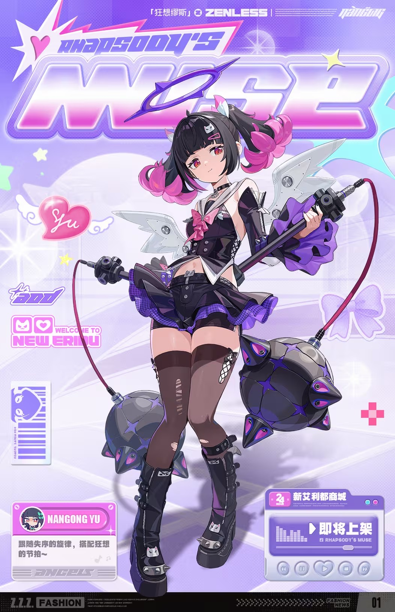
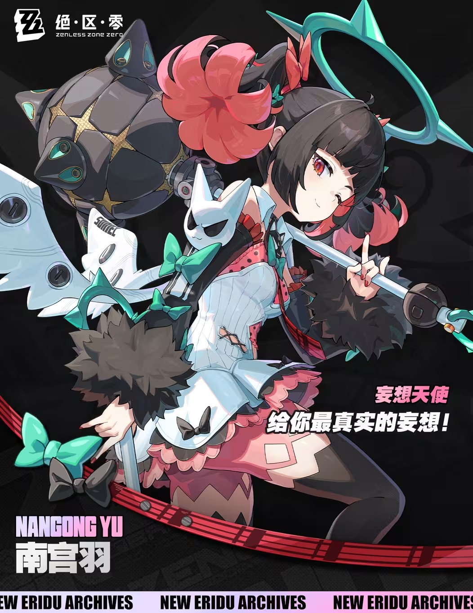
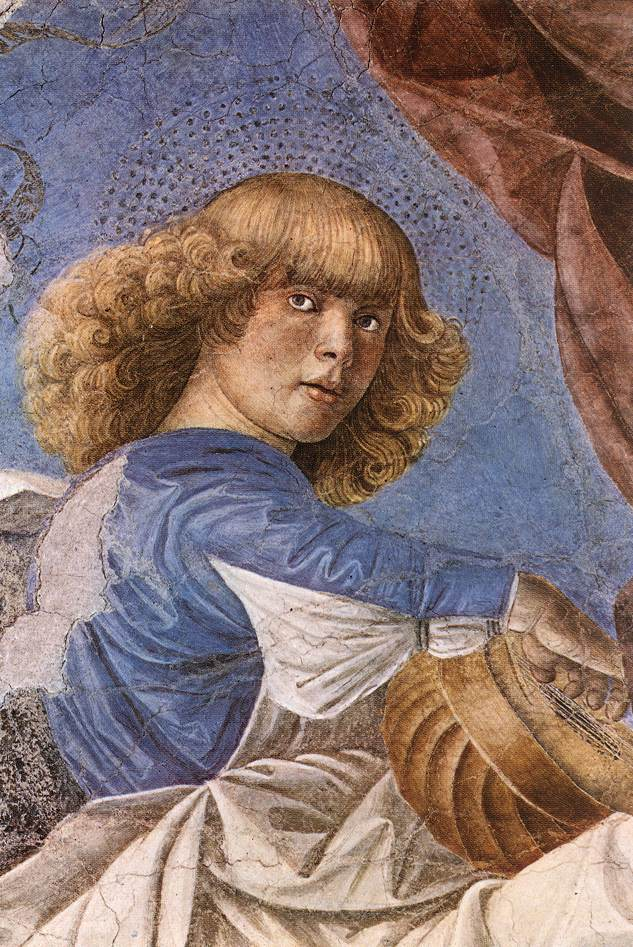

# 南宫羽 Nangong Yu — 2026.08.30
> 视频类型：A · 角色单人壁纸合集
> 角色来源：绝区零 3.2「她与她的隐秘往事」 · S级以太击破
> 身份：「妄想天使」虚拟偶像组合队长
> 设计参考：偶像队长 × 天使光环 × 机械羽翼 × 双头麦克风锤
> 热点背景：3.2版本上半卡池复刻（9月9日上线），8月28日前瞻直播官宣，KFC联动「小背心」免费皮肤余热
> 今日特殊：无

---

**角色外观基准**（经 splash-art.png 视觉确认，所有 prompt 共用）：
- 发色发型：black hair styled into two large round fluffy pink buns (hair orbs) on each side, teal wing-shaped hairpins
- 瞳色：sharp crimson-red eyes
- 头部：teal angel halo with pointed accents floating above her head
- 背部：foldable silver-white mechanical wing accessories with sharp edges
- 默认服装：white off-shoulder knit top with pink lining, black fluffy detached sleeves, white skirt with pink ruffled hem, black thigh-high stockings, black platform boots
- 胸前小配饰：small white ghost-like mask pendant with green bow tie hanging on chest
- 武器：large dual-headed microphone-hammer — black metallic spherical/polyhedral heads with teal triangular accents and golden star patterns, connected by a red cable, central shaft gripped with both hands
- 主题色：black, hot pink, teal, crimson red

---

# 必需

Refer to the attached reference image (Figure 1). Generate a similar style image of Nangong Yu from Zenless Zone Zero sitting casually in front of a bold graffiti wall. Nangong Yu is seated in a relaxed but confident posture, leaning back against the graffiti wall with one knee raised and her other leg stretched out casually, her body language calm, controlled, and slightly provocative. Her expression should show cold, disdainful eyes, aloof, sharp, and superior, as if she is silently judging the viewer.

Keep Nangong Yu's recognizable features: black hair styled into two large round pink buns with teal wing hairpins, sharp crimson-red eyes, teal angel halo floating above her head, and her foldable silver-white mechanical wing accessories folded into a compact V-shape on her back. Blend her canonical design with a modern edgy streetwear aesthetic: a sleeveless black cropped tube top exposing her midriff, a cropped silver-white bomber jacket draped loosely over her shoulders, a high-waisted pink pleated mini skirt, sheer black thigh-high stockings with a single pink stripe at the top, and chunky black platform sneakers with teal laces and star decals. Preserve her identity while giving her a fresh urban street-style look.

The graffiti wall behind her should be vivid and layered, full of expressive abstract shapes and energetic street-art textures in hot pink, teal, and black tones, with graffiti elements including stylized "NANGONG YU" lettering, the Delusion Angels logo, teal ether-energy symbols, and silhouette of her dual-headed microphone-hammer, creating a rebellious urban backdrop that resonates with her character theme. Add subtle pink and teal ether energy effects, glowing musical notes, and scattered star decals around her to reinforce her identity.

Use a wide cinematic framing suitable for a 16:9 wallpaper, with Nangong Yu as the main focal point while still showing enough of the graffiti wall and surrounding environment for atmosphere. The mood should feel cool, stylish, intimidating, and mysterious. Highly detailed background, rich shadows, pink and teal glowing highlights, sharp focus on Nangong Yu, and a refined high-end anime illustration look.

Negative Prompt:
low quality, worst quality, blurry, pixelated, bad anatomy, bad hands, extra fingers, fewer fingers, missing fingers, fused fingers, webbed fingers, merged fingers, overlapping fingers, deformed fingers, mutated fingers, six fingers, four fingers, three fingers, more than five fingers, less than five fingers, disfigured hands, poorly drawn hands, bad hand anatomy, asymmetrical hands, broken fingers, claw hands, blurry hands, indistinct fingers, smeared hands, extra limbs, chibi, photorealistic, wrong hair color, wrong eye color, incorrect character, text, watermark, logo, signature, standing, standing pose, upright posture, singing, open mouth singing, warm smile, gentle smile, cheerful expression, cute expression, adorable, sweet, innocent, game canonical outfit, official costume, fantasy dress, medieval clothing, armor, full gown, formal dress, beach background, ocean background, nature background, indoor background, plain background, minimal background, missing graffiti wall, low detail graffiti, generic graffiti, wrong graffiti colors, wrong streetwear, missing crop top, missing jacket, missing shorts, missing skirt, long dress, full pants, business suit, school uniform

---

# 必需

Refer to the attached reference image (Figure 2). Generate a cinematic close-up portrait of Nangong Yu from Zenless Zone Zero.

Nangong Yu is instantly recognizable: her black hair is styled into two large round fluffy pink buns (hair orbs) on each side, held in place by her signature teal wing-shaped hairpins. A teal angel halo with pointed accents floats above her head, softly glowing against the darkness. Her silver-white mechanical wing accessories are folded into a compact V-shape on her back, their sharp edges catching a sliver of rim light. She wears her canonical white off-shoulder knit top with pink lining, and her small white ghost-like mask pendant with green bow tie hangs on her chest just below the collarbone. Her sharp crimson-red eyes are the focal point of the image.

She holds a delicate pink crystal music-note pendant close to the right side of her face with one hand, the translucent gem partially obscuring her right eye. Her visible left eye gazes directly at the viewer — simultaneously inviting and threatening, the look of an idol who commands a stadium but hides her loneliness in the silence between songs. Expression: a faint warmth in her crimson eyes that never reaches her lips, as if the note reminds her of a melody she composed for someone who never heard it. Dramatic single-source lighting from the upper left casts deep chiaroscuro across her features, the pink crystal glowing softly where the light passes through. Her pale skin contrasts sharply against a pure black background. Her signature pink buns and teal wing hairpins frame the composition on both sides. She leads ten thousand voices in chorus, yet the only harmony she truly owns is the silence in her pocket. 16:9 2K wallpaper.

Negative Prompt:
low quality, worst quality, blurry, pixelated, bad anatomy, bad hands, extra fingers, fewer fingers, missing fingers, fused fingers, webbed fingers, merged fingers, overlapping fingers, deformed fingers, mutated fingers, six fingers, four fingers, three fingers, more than five fingers, less than five fingers, disfigured hands, poorly drawn hands, bad hand anatomy, asymmetrical hands, broken fingers, claw hands, blurry hands, indistinct fingers, smeared hands, extra limbs, chibi, photorealistic, wrong hair color, wrong eye color, incorrect character, text, watermark, logo, signature, full body shot, wide shot, landscape, multiple subjects, busy background, bright cheerful lighting, outdoor scene, action pose, weapon drawn

---

# 人物设定

## 1 — 妄想天使·舞台绝唱

Positive Prompt:
16:9 2K wallpaper, Nangong Yu from Zenless Zone Zero, highly detailed anime-style illustration, polished 3D-cel-shaded game-art quality.

Depict Nangong Yu center stage at a grand Delusion Angels concert, wearing her canonical outfit: a white off-shoulder knit top with pink lining, black fluffy detached sleeves, a white skirt with pink ruffled hem, black thigh-high stockings, and black platform boots. She retains her signature black hair with two large round pink buns and teal wing hairpins, sharp crimson-red eyes, teal angel halo floating above her head, and silver-white mechanical wing accessories fully spread behind her back like a grand display. Her small white ghost-like mask pendant with green bow tie hangs visibly on her chest. She strikes a commanding idol pose: one hand gripping the central shaft of her large dual-headed microphone-hammer (black metallic spherical heads with teal triangular accents and golden star patterns, connected by a red cable), the other hand raised toward the audience with fingers elegantly relaxed in a beckoning gesture. The stage behind her is a spectacular idol concert set: massive LED screens displaying the Delusion Angels logo, cascading pink and teal laser beams, floating heart-shaped holograms, and a sea of glowing fan lightsticks stretching into the darkness. Warm golden spotlights and cool magenta stage lights cross over her figure. Color palette: hot pink, teal, crimson red, stage gold, deep black. Perfect hands, five fingers on each hand, anatomically correct hands, well-defined fingers, natural hand pose, detailed hands, clean finger separation.

Negative Prompt:
low quality, worst quality, blurry, pixelated, bad anatomy, bad hands, extra fingers, fewer fingers, missing fingers, fused fingers, webbed fingers, merged fingers, overlapping fingers, deformed fingers, mutated fingers, six fingers, four fingers, three fingers, more than five fingers, less than five fingers, disfigured hands, poorly drawn hands, bad hand anatomy, asymmetrical hands, broken fingers, claw hands, blurry hands, indistinct fingers, smeared hands, extra limbs, chibi, photorealistic, wrong hair color, wrong eye color, incorrect character, missing angel halo, missing mechanical wings, missing microphone-hammer, text, watermark, logo, signature

---

## 2 — 后台·队长的独处时刻

Positive Prompt:
16:9 2K wallpaper, Nangong Yu from Zenless Zone Zero, highly detailed anime-style illustration, polished 3D-cel-shaded game-art quality.

Depict Nangong Yu backstage after a concert, sitting on a worn velvet makeup chair in front of a large illuminated vanity mirror. She wears her canonical white off-shoulder knit top and white skirt with pink ruffled hem, but her black fluffy detached sleeves are draped over the back of the chair, and her black thigh-high stockings show a small run near the knee — signs of a long night. Her signature black hair with large round pink buns is slightly disheveled, a few loose strands falling across her face. Her crimson-red eyes, usually sharp and commanding, now show a rare softness and fatigue as she quietly adjusts one of her teal wing hairpins in the mirror. Her silver-white mechanical wing accessories are folded and resting against the wall beside her, and her large dual-headed microphone-hammer leans against the vanity with the red cable loosely coiled on the floor. The small white ghost-like mask pendant on her chest catches the warm amber light. The backstage room is intimate and cluttered: costume racks with Delusion Angels outfits, scattered bouquets of pink roses, half-empty energy drinks, and a handwritten setlist taped to the mirror frame. Warm amber and soft pink lighting from the vanity bulbs. Color palette: warm amber, soft pink, deep black shadows, teal accent. Perfect hands, five fingers on each hand, anatomically correct hands, well-defined fingers, natural hand pose, detailed hands, clean finger separation.

Negative Prompt:
low quality, worst quality, blurry, pixelated, bad anatomy, bad hands, extra fingers, fewer fingers, missing fingers, fused fingers, webbed fingers, merged fingers, overlapping fingers, deformed fingers, mutated fingers, six fingers, four fingers, three fingers, more than five fingers, less than five fingers, disfigured hands, poorly drawn hands, bad hand anatomy, asymmetrical hands, broken fingers, claw hands, blurry hands, indistinct fingers, smeared hands, extra limbs, chibi, photorealistic, wrong hair color, wrong eye color, incorrect character, missing angel halo, missing mechanical wings, text, watermark, logo, signature

---

## 3 — 空洞·以太击破

Positive Prompt:
16:9 2K wallpaper, Nangong Yu from Zenless Zone Zero, highly detailed anime-style illustration, polished 3D-cel-shaded game-art quality, dynamic action composition.

Depict Nangong Yu mid-battle inside a corrupted Hollow zone, her silver-white mechanical wing accessories fully deployed and glowing with teal ether energy. She leaps through the air in a powerful spinning strike, both hands gripping the central shaft of her large dual-headed microphone-hammer. The weapon's black metallic spherical heads crackle with vibrant pink and purple ether lightning, and the red cable connecting them whips through the air like a live wire. Her canonical white off-shoulder knit top and white skirt billow dramatically from the motion; her black thigh-high stockings and platform boots are splattered with faint traces of ether corruption. Her black hair with large round pink buns flies wildly, teal wing hairpins gleaming. Her crimson-red eyes burn with fierce concentration, her expression a battle-hardened smirk — the look of a队长 who has led her team through countless dangers. The background is a chaotic Hollow environment: jagged crystalline formations in deep purple and black, swirling ether storms, and shattered concrete from the old city. Teal and pink energy trails arc behind her swing. Color palette: deep purple, neon pink, teal, black, electric magenta. Perfect hands, five fingers on each hand, anatomically correct hands, well-defined fingers, natural hand pose, detailed hands, clean finger separation.

Negative Prompt:
low quality, worst quality, blurry, pixelated, bad anatomy, bad hands, extra fingers, fewer fingers, missing fingers, fused fingers, webbed fingers, merged fingers, overlapping fingers, deformed fingers, mutated fingers, six fingers, four fingers, three fingers, more than five fingers, less than five fingers, disfigured hands, poorly drawn hands, bad hand anatomy, asymmetrical hands, broken fingers, claw hands, blurry hands, indistinct fingers, smeared hands, extra limbs, chibi, photorealistic, wrong hair color, wrong eye color, incorrect character, peaceful background, calm atmosphere, indoor cafe, cheerful lighting, text, watermark, logo, signature

---

# 现代风

## 4 — 都市潮牌·新艾利都街拍

Positive Prompt:
16:9 2K wallpaper, Nangong Yu from Zenless Zone Zero, highly detailed anime-style illustration, polished 3D-cel-shaded game-art quality.

Depict Nangong Yu in a modern urban street-style look, walking confidently through a neon-lit alley in New Eridu at dusk. She wears an oversized black cropped hoodie with the Delusion Angels logo printed in hot pink on the front, layered over a white mesh crop top. Her bottom is a high-waisted pink plaid pleated mini skirt with a silver chain belt, paired with black fishnet thigh-high stockings and chunky black combat boots with teal laces. Her signature black hair with large round pink buns and teal wing hairpins remains unchanged, and her teal angel halo glows softly above her head. Her silver-white mechanical wing accessories are retracted into a compact backpack-shaped form, blending seamlessly with her streetwear. She carries a sleek black tote bag with pink star charms and casually holds a smartphone in one hand, her expression relaxed with a slight playful smirk. The alley is drenched in neon signage: pink and teal holographic advertisements, wet asphalt reflecting the lights, and distant skyscrapers piercing a dusky purple sky. Color palette: neon pink, teal, deep purple dusk, black, wet reflection silver. Perfect hands, five fingers on each hand, anatomically correct hands, well-defined fingers, natural hand pose, detailed hands, clean finger separation.

Negative Prompt:
low quality, worst quality, blurry, pixelated, bad anatomy, bad hands, extra fingers, fewer fingers, missing fingers, fused fingers, webbed fingers, merged fingers, overlapping fingers, deformed fingers, mutated fingers, six fingers, four fingers, three fingers, more than five fingers, less than five fingers, disfigured hands, poorly drawn hands, bad hand anatomy, asymmetrical hands, broken fingers, claw hands, blurry hands, indistinct fingers, smeared hands, extra limbs, chibi, photorealistic, wrong hair color, wrong eye color, incorrect character, missing angel halo, medieval clothing, text, watermark, logo, signature

---

# 热点主题特别版

## 5 — KFC小背心·官方梗皮肤

Positive Prompt:
16:9 2K wallpaper, Nangong Yu from Zenless Zone Zero, highly detailed anime-style illustration, polished 3D-cel-shaded game-art quality.

Depict Nangong Yu wearing the official Delusion Angels × KFC collaboration "tank-top" outfit: a sleeveless white cropped tank top with pink scalloped trim along the collar and armholes, the front printed with colorful chibi pixel-art mascots of the Delusion Angels trio, scattered tiny stars, musical notes, and heart motifs in pastel pink and teal, with small KFC and Zenless Zone Zero logos near the bottom hem. She pairs this with a high-waisted glossy black pleated mini skirt featuring pink side stripes, sheer black thigh-high stockings with a single pink stripe at the top, and chunky black platform sneakers with pink laces and teal wing-shaped decals. She retains her signature black hair with two large round pink buns and teal wing hairpins, sharp crimson-red eyes, teal angel halo, and silver-white mechanical wing accessories folded into a compact V-shape. Her expression is playfully smug with a wink — the look of someone who knows her fans turned a shopping-bag meme into a sold-out concert. She strikes a casual pose leaning against a giant KFC promotional display shaped like a concert stage, one hand on her hip, the other holding a miniature KFC bucket decorated with Delusion Angels stickers. The background is a playful pop-up idol cafe: pastel pink and white booths, neon signs in teal and hot pink, heart-shaped balloons, and confetti on the floor. Color palette: KFC red, creamy white, pastel pink, teal accent, cafe gold. Perfect hands, five fingers on each hand, anatomically correct hands, well-defined fingers, natural hand pose, detailed hands, clean finger separation.

Negative Prompt:
low quality, worst quality, blurry, pixelated, bad anatomy, bad hands, extra fingers, fewer fingers, missing fingers, fused fingers, webbed fingers, merged fingers, overlapping fingers, deformed fingers, mutated fingers, six fingers, four fingers, three fingers, more than five fingers, less than five fingers, disfigured hands, poorly drawn hands, bad hand anatomy, asymmetrical hands, broken fingers, claw hands, blurry hands, indistinct fingers, smeared hands, extra limbs, chibi, photorealistic, wrong hair color, wrong eye color, incorrect character, wrong outfit, missing tank top, missing KFC elements, dark gloomy atmosphere, text, watermark, logo, signature

---

# 参考图

## 6（官方立绘变体·星空舞台）

Positive Prompt:
16:9 2K wallpaper, Nangong Yu from Zenless Zone Zero, highly detailed anime-style illustration, polished 3D-cel-shaded game-art quality.

Referring to the attached image (Figure 1), generate a similar pose for Nangong Yu but replace the black background with a breathtaking cosmic stage setting. She stands in her canonical white off-shoulder knit top, white skirt with pink ruffled hem, black fluffy detached sleeves, black thigh-high stockings, and black platform boots, gripping her large dual-headed microphone-hammer with both hands. Her signature black hair with large round pink buns and teal wing hairpins is perfectly framed; her crimson-red eyes gaze confidently toward a distant star. Her silver-white mechanical wing accessories are fully spread and transformed into glowing constellations — each wingtip tracing a line of stars like a celestial chart. Her teal angel halo radiates soft aurora light. The backdrop is an infinite starfield with a massive spiral galaxy in pink and teal hues, nebula clouds swirling in deep purple and magenta, and shooting stars arcing past her wings. The mood is majestic, otherworldly, and quietly powerful — an idol who has outgrown the stage and now performs for the universe itself. Color palette: deep cosmic purple, galaxy pink, teal nebula, starlight silver, black void. Perfect hands, five fingers on each hand, anatomically correct hands, well-defined fingers, natural hand pose, detailed hands, clean finger separation.

Negative Prompt:
low quality, worst quality, blurry, pixelated, bad anatomy, bad hands, extra fingers, fewer fingers, missing fingers, fused fingers, webbed fingers, merged fingers, overlapping fingers, deformed fingers, mutated fingers, six fingers, four fingers, three fingers, more than five fingers, less than five fingers, disfigured hands, poorly drawn hands, bad hand anatomy, asymmetrical hands, broken fingers, claw hands, blurry hands, indistinct fingers, smeared hands, extra limbs, chibi, photorealistic, wrong hair color, wrong eye color, incorrect character, missing angel halo, missing mechanical wings, text, watermark, logo, signature

---

## 7（竖屏手机壁纸·夜空仰望）

Positive Prompt:
9:16 2K vertical wallpaper, Nangong Yu from Zenless Zone Zero, highly detailed anime-style illustration, polished 3D-cel-shaded game-art quality, dramatic vertical idol composition.

Referring to the attached image (Figure 1), generate a vertical portrait of Nangong Yu gazing upward into a night sky filled with ethereal lights. She is positioned in the lower third of the frame, looking up with an expression of quiet determination mixed with longing — a队长 who carries the weight of her team's dreams. She wears her canonical white off-shoulder knit top and white skirt with pink ruffled hem, black thigh-high stockings, and black platform boots. Her signature black hair with large round pink buns is softly lit from below by city lights. Her crimson-red eyes reflect the stars above. Her teal angel halo glows like a miniature moon, and her silver-white mechanical wing accessories are partially spread as if about to take flight. One hand rests gently over her heart, the other relaxed at her side. The background is a vast vertical night sky over New Eridu: towering neon skyscrapers at the bottom fading into a starfield above, a crescent moon in soft pink, and drifting clouds illuminated by teal and magenta city glow. The composition draws the eye upward from the urban world below to the infinite sky above. Color palette: midnight blue, neon pink, teal, soft moon white, urban amber. Perfect hands, five fingers on each hand, anatomically correct hands, well-defined fingers, natural hand pose, detailed hands, clean finger separation.

Negative Prompt:
low quality, worst quality, blurry, pixelated, bad anatomy, bad hands, extra fingers, fewer fingers, missing fingers, fused fingers, webbed fingers, merged fingers, overlapping fingers, deformed fingers, mutated fingers, six fingers, four fingers, three fingers, more than five fingers, less than five fingers, disfigured hands, poorly drawn hands, bad hand anatomy, asymmetrical hands, broken fingers, claw hands, blurry hands, indistinct fingers, smeared hands, extra limbs, chibi, photorealistic, wrong hair color, wrong eye color, incorrect character, horizontal composition, wide shot, text, watermark, logo, signature

---

# 跨领域参考图

## 8（参考 Melozzo da Forli 文艺复兴音乐天使绘画 × 现代镭射舞台灯光）

Positive Prompt:
16:9 2K wallpaper, Nangong Yu from Zenless Zone Zero, highly detailed anime-style illustration blending Renaissance fresco aesthetics with modern idol concert lighting.

Referring to the attached reference image (Figure 1) of Melozzo da Forli's Renaissance music-making angel, generate a composition that fuses the classical fresco style with Nangong Yu's modern idol identity. Depict Nangong Yu floating gracefully among soft cumulus clouds, her pose inspired by the angel's relaxed musicianship: one leg casually bent, her body gently tilted as if carried by an invisible melody. She retains her signature black hair with large round pink buns and teal wing hairpins, sharp crimson-red eyes, and teal angel halo. Her silver-white mechanical wing accessories are fully spread and rendered with the soft, rounded volume of Renaissance angel wings rather than sharp cyber edges. She wears a reinterpretation of her canonical outfit in fresco pastel tones: a creamy white draped blouse with pink ribbon sashes, a flowing white skirt with subtle pink ruffled layers, and delicate golden sandals. In her hands, her large dual-headed microphone-hammer is transformed into a celestial harp — the black metallic heads becoming resonant sound chambers, the red cable becoming flowing strings of light, and teal triangular accents glowing like stained glass. The background merges cloud-filled heavens with modern concert stage lighting: soft Renaissance-style clouds in cream and pale blue are pierced by dramatic pink and teal laser beams and floating holographic musical notes. The lighting follows Melozzo's masterful chiaroscuro — warm golden light from above left casting classical shadows, while neon pink and teal stage lights create modern rim lighting. The overall style should feel like a fresco that has been updated for a cyberpunk cathedral: soft Renaissance brushwork on skin and clouds, crisp anime detailing on Nangong Yu's face and hair, and luminous digital effects for the stage lighting. Color palette: fresco cream, Renaissance gold, soft cloud blue, neon pink spotlight, teal laser, angelic white. Perfect hands, five fingers on each hand, anatomically correct hands, well-defined fingers, natural hand pose, detailed hands, clean finger separation.

Negative Prompt:
low quality, worst quality, blurry, pixelated, bad anatomy, bad hands, extra fingers, fewer fingers, missing fingers, fused fingers, webbed fingers, merged fingers, overlapping fingers, deformed fingers, mutated fingers, six fingers, four fingers, three fingers, more than five fingers, less than five fingers, disfigured hands, poorly drawn hands, bad hand anatomy, asymmetrical hands, broken fingers, claw hands, blurry hands, indistinct fingers, smeared hands, extra limbs, chibi, photorealistic, wrong hair color, wrong eye color, incorrect character, photorealistic, harsh cyberpunk edges, dark dystopian atmosphere, medieval armor, text, watermark, logo, signature

---

## 注

**角色准确外观要点**（经 splash-art.png / skin-kfc.png / skin-rhapsody-muse.png 视觉确认）：

- **南宫羽**：
  - 发色：黑色基底，两侧大型蓬松粉色圆球状发髻（hair buns），配有青色羽翼形发饰
  - 瞳色：深红/玫红色（crimson-red），眼型锐利
  - 头部：青色带尖角装饰的天使光环悬浮于头顶上方
  - 背部：可折叠的银白色机械羽翼配件，边缘尖锐，可展开或收折成V型
  - 默认服装：白色露肩针织上衣配粉色内衬、黑色毛绒 detached 袖套、白色短裙配粉色荷叶边裙摆、黑色过膝袜、黑色厚底靴
  - 胸前配饰：白色幽灵/面具形小吊坠，配绿色蝴蝶结（极易遗漏的细节）
  - 武器/音擎：大型双头麦克风锤——两端各一个黑色金属球形/多面体话筒头，带青色三角形装饰和金色星形纹，由一根红色线缆连接，中间长杆双手握持
  - 气质：舞台偶像队长，自信中带挑逗感，战斗时眼神锐利
  - 狂想缪斯时装：黑紫朋克风，发型改为黑色短发+粉色渐变发尾高马尾，猫耳发卡
  - KFC联动皮肤：白色无袖短款背心配粉色滚边+像素风Q版印花，黑色百褶短裙

**参考图说明**：
- `splash-art.png`：B站WIKI官方角色立绘（透明背景），完整展示发型、发饰、机械羽翼、武器、服装、胸前吊坠
- `skin-kfc.png`：KFC×妄想天使联动「小背心」免费皮肤官方宣传图
- `skin-rhapsody-muse.png`：商城时装「狂想缪斯」官方宣传图
- `ref-renaissance-angel-musician.jpg`：Melozzo da Forli《音乐天使》文艺复兴油画（梵蒂冈博物馆），用于跨领域风格融合

**社区热梗素材**（供 titles.md 使用）：
- 「接下来，是只有乖孩子才能拥有的惩、罚、时、间」——南宫羽标志性台词，极高辨识度
- 「南宫大人」——B站攻略/玩家社区对南宫羽的尊称
- 「双锤偶像」——玩家对其武器（双头麦克风锤）的戏称
- 「老大」——妄想天使队内队长称呼，玩家社区通用
- 强度标签：「星见雅最佳队友」「泛用异常击破拐」「一个人顶掉莱卡恩和苍角两个的职责」「异常队新的太阳」「轮椅玩法」
- 配队简称：「雅南柚」（星见雅+南宫羽+柚叶）、「妄想天使完全体」（爱芮+南宫羽+千夏）
- KFC皮肤梗：「老大我们这样穿真的会提高人气吗」「感谢振宇」「起初人们只是在玩梗，直到你振宇叔叔看到了」
