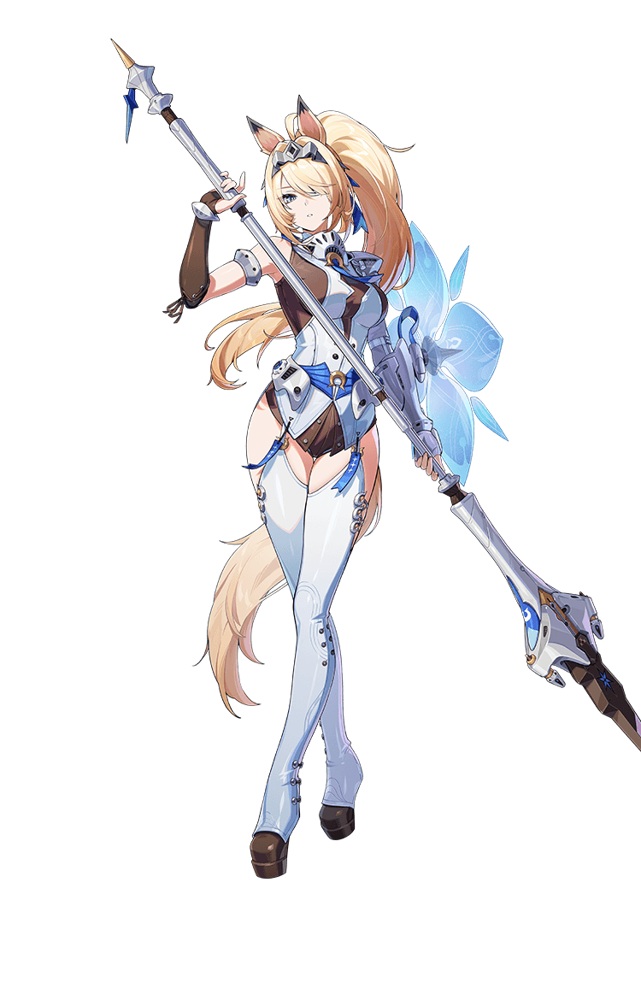

# 希格莉德·德拉叙尔 Sigrid Derksile — 2026.08.05

> 视频类型：A · 角色单人壁纸合集
> 角色来源：绝区零 3.1「漫长的告别」· S级冰属性强攻型
> 身份：罗斯凯利法·空域巡戍局总务次官 / 德拉叙尔家族传人 / 新艾利都战力榜传闻T0级
> 设计参考：白蓝骑士制式制服、兽耳造型、金色高马尾、冰纹长枪与冰晶羽翼护盾，社区昵称「马娘」
> 热点背景：绝区零3.1周年庆版本7月29日已上线，希格莉德为下半卡池限定角色，因骑士气质与「马娘」调侃成为社区二创热议焦点；工作区此前已产出蕾米埃尔（3.1上半角色），本次以希格莉德补齐版本双限定覆盖。
> 选角理由：官方热点权重高（周年庆核心角色，讨论窗口仍在延续）；社区梗热度突出（骑士+长槍+马耳组合的"马娘"称号持续发酵）；角色气质反差萌鲜明（严肃巡官 × 对空气炸锅充满好奇的软萌内核），适合多场景演绎；工作区尚未覆盖该角色。

# 必需

Refer to the attached reference image (Figure 1). Generate a similar style image of Sigrid Derksile from Zenless Zone Zero sitting in front of a bold graffiti wall, wearing modern street fashion with a composed yet faintly curious expression, looking at the camera with quiet confidence. Preserve her recognizable features: long golden-blonde high ponytail, pale blue fantasy horse-like ears peeking through her hair, sharp icy-blue eyes, fair sculpted features. She wears a cropped white-and-navy varsity jacket with silver zipper trim over a fitted dark top, pleated navy-blue mini skirt, thigh-high white socks, and chunky white sneakers with pale blue accents. The graffiti wall behind her features icy-blue frost patterns, lance and shield motifs, and abstract snowflake tags echoing her knight design. Hands resting naturally at her sides, perfect hands, five fingers on each hand, well-defined fingers, natural hand pose. 16:9 2K wallpaper format.

Negative Prompt: low quality, worst quality, blurry, pixelated, bad anatomy, bad hands, extra fingers, fewer fingers, missing fingers, fused fingers, webbed fingers, merged fingers, overlapping fingers, deformed fingers, mutated fingers, six fingers, four fingers, three fingers, more than five fingers, less than five fingers, disfigured hands, poorly drawn hands, bad hand anatomy, asymmetrical hands, broken fingers, claw hands, blurry hands, indistinct fingers, smeared hands, extra limbs, chibi, childish, wrong hair color, wrong eye color, missing ears, full horse body, text, watermark, logo, signature.

# 人物设定

## 1 — 荣光，引领我们前行（巡戍宣誓·浮空城墙）

Positive Prompt:

16:9 wallpaper, Sigrid Derksile from Zenless Zone Zero, highly detailed anime-style illustration, polished game-art quality, epic heroic composition, cinematic dawn lighting, noble and resolute atmosphere.

Depict Sigrid standing atop the outer ramparts of the floating city of Rose Kelly Law at dawn, her long golden-blonde ponytail streaming in the high-altitude wind, pale blue horse-like ears alert and upright. Her icy-blue eyes gaze forward with unwavering resolve, echoing her motto "Glory guides us forward." She wears her full ceremonial patrol uniform: a structured white-and-navy officer's coat with silver epaulettes and frost-blue trim, a fitted underlayer, pleated navy skirt, and knee-high white boots with icy accents. She grips her long lance firmly in one hand, planted beside her, while her other hand rests on a floating crystalline ice shield hovering at her side, perfect hands, five fingers on each hand, well-defined fingers, natural confident grip.

The background shows the vast floating city stretching below through morning mist, distant spires catching golden sunrise light, faint frost patterns crystallizing along the ramparts where she stands. Wide heroic composition with Sigrid centered, cape and hair trailing dramatically, the sky transitioning from deep indigo to warm dawn gold.

Negative Prompt:
low quality, blurry, bad anatomy, bad hands, extra fingers, fewer fingers, missing fingers, fused fingers, webbed fingers, merged fingers, overlapping fingers, deformed fingers, mutated fingers, six fingers, four fingers, three fingers, more than five fingers, less than five fingers, disfigured hands, poorly drawn hands, bad hand anatomy, asymmetrical hands, broken fingers, claw hands, blurry hands, indistinct fingers, smeared hands, extra limbs, chibi style, flat lighting, warm tropical setting, fire effects, missing ears, full horse body, wrong hair color, wrong eye color, casual clothing, text, watermark.

## 2 — 空气炸锅的秘密（反差萌·生活探索）

Positive Prompt:

16:9 wallpaper, Sigrid Derksile from Zenless Zone Zero, highly detailed anime-style illustration, cozy kitchen atmosphere, soft warm lighting, adorable slice-of-life mood, polished character art.

Depict Sigrid off-duty in a bright modern kitchen, leaning forward with wide-eyed curiosity as she inspects an air fryer on the counter, her golden ponytail falling over one shoulder, pale blue ears tilted forward in fascination. Her usually composed expression softens into genuine childlike wonder, lips slightly parted as if murmuring "no open flame, yet it bakes?" She wears a simplified off-duty outfit: a loose cream sweater over dark trousers, sleeves pushed up. One hand rests on the counter, the other reaches toward the appliance's dial, perfect hands, five fingers on each hand, well-defined fingers, natural curious gesture.

The kitchen is warm and homely: wooden countertops, a bowl of dough nearby (she is considering testing it in the fryer), soft afternoon light through a window, a neatly folded scarf she knitted herself draped on a chair. The mood should be endearing and gently humorous, capturing the private side no one on the patrol force has seen. Medium-close composition, slightly elevated angle, warm color palette.

Negative Prompt:
low quality, blurry, bad anatomy, bad hands, extra fingers, fewer fingers, missing fingers, fused fingers, webbed fingers, deformed fingers, six fingers, four fingers, disfigured hands, poorly drawn hands, extra limbs, chibi, combat outfit, weapon, aggressive expression, dark atmosphere, missing ears, full horse body, wrong hair color, text, watermark.

## 3 — 冰刃破空（空洞讨伐·全力状态）

Positive Prompt:

16:9 wallpaper, Sigrid Derksile from Zenless Zone Zero, highly detailed anime-style illustration, dynamic action composition, dramatic icy elemental effects, polished game-art quality, epic battle scene.

Depict Sigrid unleashing her rumored T0-level full combat power against a Hollow monstrosity in the ruins of an old district. She lunges forward mid-thrust, her long ice-forged lance piercing through a wave of frost, her golden ponytail whipping behind her, ears pinned back in fierce concentration. Crystalline ice shards erupt around her point of impact, and a translucent shield of hovering ice fragments orbits protectively near her shoulder. Her grip is precise and controlled, perfect hands, five fingers on each hand, well-defined fingers, anatomically correct grip on the lance shaft. Her icy-blue eyes are sharp and utterly focused — not rage, but the calm precision of someone who has never shown her true strength before.

The battlefield is a crumbling stone plaza half-frozen by her power, dark Hollow corruption shattering into glittering ice fragments where her lance connects. The sky above is fractured with pale aurora-like light. Dynamic diagonal composition, Sigrid centered in a burst of frost and motion, strong sense of unstoppable momentum.

Negative Prompt:
low quality, blurry, bad anatomy, bad hands, extra fingers, fewer fingers, missing fingers, fused fingers, webbed fingers, deformed fingers, six fingers, four fingers, disfigured hands, poorly drawn hands, extra limbs, static pose, weak motion, chibi, fire effects, warm colors, missing ears, full horse body, wrong hair color, casual clothing, text, watermark.

## 4 — 无情击飞布之谜（诺姆的发明·幽默日常）

Positive Prompt:

16:9 wallpaper, Sigrid Derksile from Zenless Zone Zero, highly detailed anime-style illustration, whimsical urban setting, gentle comedic atmosphere, polished character art, soft daylight.

Depict a lighthearted moment in a New Eridu side street where Sigrid is caught mid-gesture, offering a small wrapped trinket to a passerby with genuine warmth, while in the background, out of focus, a researcher figure clutches a comically oversized cloth labeled with abstract patterns (a nod to the "merciless deflector cloth" invented to intercept her gifts). Sigrid's expression is gently amused, one eyebrow slightly raised as if she has noticed the attempt and finds it endearing rather than offensive. Her golden ponytail sways as she leans slightly forward, pale blue ears relaxed. She wears her patrol uniform jacket unbuttoned over a casual shirt, off-duty style. One hand extends the small gift, perfect hands, five fingers on each hand, well-defined fingers, natural giving gesture.

The street is lined with quirky New Eridu shopfronts, hanging lanterns, and soft midday light. The overall tone is warm, comedic, and full of character charm, showcasing the community's fond exasperation with her generosity. Medium-shot composition, Sigrid on the right third, blurred comedic background action on the left.

Negative Prompt:
low quality, blurry, bad anatomy, bad hands, extra fingers, fewer fingers, missing fingers, fused fingers, webbed fingers, deformed fingers, six fingers, four fingers, disfigured hands, poorly drawn hands, extra limbs, chibi, combat scene, weapon drawn, dark mood, missing ears, full horse body, wrong hair color, text, watermark.

## 5 — 赛博新艾利都·御姐制服改造（现代高定风）

Positive Prompt:

16:9 wallpaper, Sigrid Derksile from Zenless Zone Zero, highly detailed anime-style illustration, modern high-fashion aesthetic, neon-lit urban night, sleek and mysterious, polished character art.

Reimagine Sigrid walking through a sleek New Eridu plaza at night, her tailored white-and-navy trench coat reinterpreted with glossy frost-pattern panels over a fitted black bodysuit, thigh-high boots with icy LED trim, and slim silver jewelry shaped like tiny lances. Her long golden ponytail is styled sleek and high, pale blue ears now subtly accented with small cybernetic frost-cuffs. Her icy-blue eyes look back over her shoulder toward the viewer with composed, alluring confidence. One hand rests on her hip, the other lightly trails along a holographic railing, perfect hands, five fingers on each hand, well-defined fingers, natural elegant pose.

The background features towering neon skyscrapers, holographic patrol advertisements, and softly falling synthetic snow that never quite melts. Cyan, deep navy, and warm amber city-light reflections create a sophisticated palette. Medium-full body composition, Sigrid on the right third, shallow depth of field with glowing bokeh.

Negative Prompt:
low quality, blurry, bad anatomy, bad hands, extra fingers, fewer fingers, missing fingers, fused fingers, webbed fingers, deformed fingers, six fingers, four fingers, disfigured hands, poorly drawn hands, extra limbs, chibi, daytime, tropical setting, readable text, watermark, logo, missing ears, full horse body, wrong hair color.

## 6 — 军功与爵位（并肩作战·战场信赖）

Positive Prompt:

16:9 wallpaper, Sigrid Derksile from Zenless Zone Zero, highly detailed anime-style illustration, cinematic battlefield camaraderie, dramatic dusk lighting, polished game-art quality.

Depict Sigrid standing back-to-back with an unseen ally on a fog-shrouded battlefield at dusk, her lance raised in a defensive stance, ice shield fully deployed and glowing faintly blue in front of her. Her expression is calm and protective, golden ponytail catching the last amber light of sunset mixed with cool blue frost mist. Her uniform shows light battle wear — a few frost cracks along the coat's edge, testament to a hard-fought engagement. One hand steadies the lance while the other channels a faint stream of icy light toward her unseen companion, perfect hands, five fingers on each hand, well-defined fingers, precise controlled gesture.

The environment is a ruined watchtower district with scattered ice crystals embedded in broken stone, distant silhouettes of retreating Hollow creatures dissolving into frost particles. The lighting blends warm dusk orange with cool cyan frost glow, symbolizing trust and support amid chaos. Wide cinematic composition, Sigrid in the lower-right third, dramatic empty space above suggesting the scale of the battlefield.

Negative Prompt:
low quality, blurry, bad anatomy, bad hands, extra fingers, fewer fingers, missing fingers, fused fingers, webbed fingers, deformed fingers, six fingers, four fingers, disfigured hands, poorly drawn hands, extra limbs, chibi, fire effects, bright daylight, cheerful expression, missing ears, full horse body, wrong hair color, blood, gore, text, watermark.

## 7 — 编织的午后（母亲的温度·私人时光）

Positive Prompt:

16:9 wallpaper, Sigrid Derksile from Zenless Zone Zero, highly detailed anime-style illustration, soft pastel lighting, cozy indoor atmosphere, tender slice-of-life mood, polished character art.

Depict Sigrid seated by a sunlit window, quietly knitting a scarf just like the ones her mother used to make. Her golden ponytail is loosely gathered, a few strands falling free, pale blue ears relaxed and slightly drooping in peaceful concentration. Her expression is soft, almost wistful, a rare unguarded moment. She wears a simple cream cardigan over a pale blue dress, knitting needles held delicately, perfect hands, five fingers on each hand, well-defined fingers, natural relaxed grip, ball of navy-blue yarn resting in her lap.

The room is warm and quiet: soft linen curtains, a shelf with a few personal keepsakes including a small model lance, a cup of tea cooling on the windowsill. Outside, the floating city drifts by in soft-focus daylight. The mood should feel intimate, nostalgic, and gentle — a side of the stern knight commander rarely seen. Medium-close interior composition with warm natural window light.

Negative Prompt:
low quality, blurry, bad anatomy, bad hands, extra fingers, fewer fingers, missing fingers, fused fingers, webbed fingers, deformed fingers, six fingers, four fingers, disfigured hands, poorly drawn hands, extra limbs, chibi, combat outfit, weapon, aggressive expression, harsh lighting, missing ears, full horse body, wrong hair color, text, watermark.

## 8 — 共犯之约（与蕾米埃尔的羁绊·月下对峙）

Positive Prompt:

16:9 wallpaper, Sigrid Derksile from Zenless Zone Zero, highly detailed anime-style illustration, mysterious moonlit rooftop, dramatic tension with a hint of playfulness, polished game-art quality, cinematic dual-tone lighting.

Depict Sigrid standing alone on a moonlit rooftop of Rose Kelly Law, arms crossed, one eyebrow slightly raised with a knowing half-smile, as if she has just discovered a certain pink-haired troublemaker's secret and is quietly amused rather than alarmed — a nod to her line about becoming "accomplices" rather than mere dance partners. Her golden ponytail glows faintly silver under the full moon, pale blue ears alert. She wears her uniform coat draped over her shoulders like a cape, hands tucked loosely at her sides, perfect hands, five fingers on each hand, well-defined fingers, natural relaxed pose.

The rooftop overlooks the vast floating city under a brilliant full moon, faint white feather motes drifting past in the distance (a subtle visual echo of Remielle), frost crystallizing delicately along the railing where she stands. The atmosphere is quietly charged — two guardians of the same city, bound by an unspoken understanding. Medium-wide composition, Sigrid on the left third, the moonlit skyline filling the right side of frame.

Negative Prompt:
low quality, blurry, bad anatomy, bad hands, extra fingers, fewer fingers, missing fingers, fused fingers, webbed fingers, deformed fingers, six fingers, four fingers, disfigured hands, poorly drawn hands, extra limbs, chibi, daytime, combat pose, weapon drawn, missing ears, full horse body, wrong hair color, multiple fully rendered characters, text, watermark.

## 9 — 周年庆典盛装（浮空舞会·荣耀礼服）

Positive Prompt:

16:9 wallpaper, Sigrid Derksile from Zenless Zone Zero, highly detailed anime-style illustration, polished game-art quality, grand ballroom atmosphere, celebratory anniversary mood, cinematic warm lighting.

Create a special anniversary tribute artwork depicting Sigrid at a grand celebration ball held in the floating city, honoring the Aerial Patrol Division's history. She wears an elegant white-and-silver gown that reinterprets her combat silhouette — a fitted bodice with frost-blue embroidery, a flowing skirt with translucent icy layers, and delicate lance-shaped hairpins securing part of her golden ponytail. Her pale blue ears are adorned with tiny crystalline charms. She extends one hand gracefully as if inviting a dance partner, fingers elegantly relaxed, perfect hands, five fingers on each hand, well-defined fingers, natural hand pose, a warm and genuine smile replacing her usual composed calm.

The ballroom is breathtaking: crystal chandeliers refracting soft blue light, tall arched windows revealing the floating city and starry sky beyond, other guests in formalwear softly blurred in the background. Delicate snowflake-shaped light particles drift through the air like a gentle blessing. Symmetrical centered composition with Sigrid as the sole sharp focal point, warm golden light mixing with cool frost-blue highlights.

Negative Prompt:
low quality, blurry, bad anatomy, bad hands, extra fingers, fewer fingers, missing fingers, fused fingers, webbed fingers, deformed fingers, six fingers, four fingers, disfigured hands, poorly drawn hands, extra limbs, chibi, combat outfit, aggressive expression, dark atmosphere, casual clothing, missing ears, full horse body, wrong hair color, text, watermark.

## 10 — 雨后浮空城的巡逻手记（手机竖屏壁纸）

Positive Prompt:

9:16 2K mobile wallpaper, Sigrid Derksile from Zenless Zone Zero, highly detailed anime-style illustration, tranquil post-rain atmosphere, soft cinematic lighting, polished character art.

Depict Sigrid standing on a rain-washed balcony of a patrol outpost overlooking the floating city just after a storm has passed. Her golden ponytail is slightly damp, clinging faintly to her shoulder, pale blue ears alert as she gazes out at a faint rainbow arching over the clouds below. She wears her patrol uniform with the coat slightly open, one hand resting on the balcony railing, the other holding a small notebook where she records daily observations, perfect hands, five fingers on each hand, well-defined fingers, natural relaxed grip.

Water droplets bead on the railing and catch the emerging sunlight, faint mist rising from the clouds below the floating city. The vertical composition places Sigrid in the lower half of the frame with ample sky and rainbow visible above for a balanced mobile wallpaper layout, comfortable spacing on all sides for phone screen icons.

Negative Prompt:
low quality, blurry, cropped, bad anatomy, bad hands, extra fingers, fewer fingers, missing fingers, fused fingers, webbed fingers, deformed fingers, six fingers, four fingers, disfigured hands, poorly drawn hands, extra limbs, chibi, combat scene, weapon drawn, dark stormy mood, missing ears, full horse body, wrong hair color, text, watermark.
