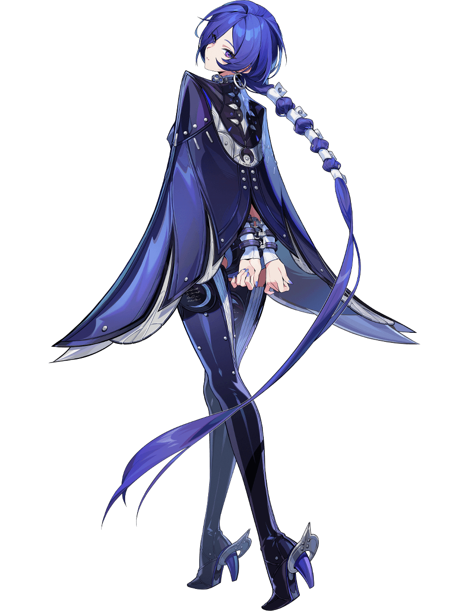

# 普罗米娅 Promeia — 2026.09.09
> 视频类型：A · 角色单人壁纸合集
> 角色来源：绝区零（Zenless Zone Zero）2.8「新·艾利都日落时」首发 · S级冰属性异常（异放体系核心）· 3.2版本复刻
> 身份：「坎卜斯黑枝」（Krampus）裁决官 / 处刑者 · 前外环清道夫 · 沉默审判官
> 阵营：坎卜斯黑枝（同阵营伙伴：琉音、照、般岳）
> 配音：中配谢莹 / 日配内田真礼
> 热点背景：3.2版本「她与她的隐秘往事」今日（9月9日）正式上线，普罗米娅为版本复刻UP（与南宫羽并列）；昨日猫猫batch-3已完成「3.2四大UP猫猫图鉴」预热，今日以本篇作为普罗米娅首次单人深度呈现，承接上线日热度
> 今日特殊：3.2上线日；「天使应援大作战」免费时装活动同日开启
> 选定类型理由：版本上线日重大热点（权重40%）→ 类型A深度呈现
> 选定角色理由：工作区首次单人覆盖（克拉蕾9/6、洛克茜8/28、南宫羽8/31均已完成，仅普罗米娅缺席）；角色辨识度极强（蓝紫短发+银环分节长辫+金属手铐+披风），「月光下的处刑者」「手铐赎罪」「冰山」等社区梗素材丰富；冰属性异放体系与复刻搭档南宫羽强关联，3.2规划讨论热度高
> 参考图校对：`splash-art.png`（官方立绘·背面全身）与 `agent-profile-03.png`（官方影画展示·彩色侧面特写）已用视觉工具逐张确认发色/瞳色/服饰/手铐/项圈细节；`agent-profile-01.png` 为紫色剪影版、`agent-profile-02.png` 为灰版仅作构图参考

---

# 必需

## 1 — 涂鸦墙街头风（Graffiti Wall Street Style）

Refer to the attached reference image (Figure 1). Generate a similar style image of Promeia from Zenless Zone Zero sitting casually in front of a bold graffiti wall. Promeia is seated in a relaxed but confident posture, perched on a low riveted metal crate with one knee raised and her forearm resting loosely on it, her other leg extended with the silver high-heeled boot flat on the ground, both legs clearly separated with a visible gap and never crossing or overlapping, her other hand idly turning a small silver cuff bracelet between her fingers, her body language calm, controlled, and quietly commanding. Her expression should show cold, disdainful eyes, aloof, sharp, and superior — her gaze measured and unimpressed, as if she has already seen everything, only the faintest arch of her brow betraying that she has even noticed you.

Keep Promeia's recognizable features: chin-length indigo-violet hair with pale lilac inner gradient layers and choppy asymmetric bangs partially covering one eye, a single very long low braid hanging behind her secured at intervals by wide silver-white cuff-like rings, vivid violet eyes, a large silver hoop earring with small violet helix studs, and her signature silver O-ring collar with a short chain and polished sphere pendant. Blend her canonical design with a modern edgy streetwear aesthetic: a white cropped tube top with a layered thin silver chain necklace under an open cropped glacier-blue bomber jacket with frost-white lining worn off one shoulder, a dark violet pleated mini skirt with a silver chain belt and a small ring-shaped charm, one sheer white thigh-high stocking with pale snowflake print and one bare leg, and chunky silver-buckled ankle boots. Keep her original character design cues while giving her a fresh urban street-style look.

The graffiti wall behind her should be vivid and layered, full of expressive abstract shapes and energetic street-art textures in glacier blue, deep violet, and silver-white tones, with graffiti elements including "PROMEIA" in icy gothic blackletter lettering, spray-painted interlocking ring-and-chain motifs, a giant new-moon crescent stencil, snowflake and frost-crystal patterns, abstract shard-like geometric shapes, and dripping paint effects, creating a rebellious urban backdrop that resonates with her character theme. Add subtle drifting frost particles and faint violet-white ice crystals glinting in the air around her to reinforce her theme.

Use a wide cinematic framing suitable for a 16:9 wallpaper, with Promeia as the main focal point while still showing enough of the graffiti wall and surrounding environment for atmosphere. The mood should feel cool, stylish, mysterious, and effortlessly confident. Highly detailed background, rich shadows, glacier-blue and violet glowing highlights, sharp focus on Promeia, and a refined high-end anime illustration look.

perfect hands, five fingers on each hand, anatomically correct hands, well-defined fingers, natural hand pose, one forearm resting on her raised knee, the other idly holding a small silver cuff bracelet.

Negative Prompt:
low quality, worst quality, blurry, pixelated, bad anatomy, extra limbs, bad hands, extra fingers, fewer fingers, missing fingers, fused fingers, webbed fingers, merged fingers, overlapping fingers, deformed fingers, mutated fingers, six fingers, four fingers, three fingers, more than five fingers, less than five fingers, disfigured hands, poorly drawn hands, bad hand anatomy, asymmetrical hands, broken fingers, claw hands, blurry hands, indistinct fingers, smeared hands, standing, standing pose, upright posture, singing, open mouth singing, warm smile, gentle smile, cheerful expression, adorable, sweet, innocent, game canonical outfit, official costume, fantasy dress, medieval clothing, armor, full gown, formal dress, beach background, ocean background, nature background, indoor background, plain background, minimal background, missing graffiti wall, low detail graffiti, generic graffiti, wrong graffiti colors, wrong streetwear, missing crop top, missing jacket, missing skirt, long dress, full pants, business suit, school uniform, wrong hair color, wrong eye color, text, watermark, logo, signature.

---

## 2 — 铐环自锢·审判者的天平（角色特写肖像 / Close-up Portrait）

Refer to the attached reference image (Figure 2). Generate a cinematic close-up portrait of Promeia from Zenless Zone Zero. She holds a single open silver shackle-cuff — the restraint she chose to wear herself — between her slender fingers close to the left side of her face, the cuff raised to eye height, its cold metallic ring partially obscuring her left eye so that only a sliver of her violet iris glimmers past the inner edge of the shackle. Her visible right eye gazes directly at the viewer — simultaneously judging and surrendering, the look of an executioner deciding your sentence while silently asking whether a chain can ever truly absolve its wearer. Expression: glacial composure layered over a faint, unguarded longing that never reaches her lips, the barest tremor in her lashes, as if the cuff recalls every debt written in blood that she vowed never to pay again. Dramatic single-source lighting from the upper left casts deep chiaroscuro across her features, the silver shackle glowing cold platinum where the light strikes its open ring, a faint glacier-blue shimmer of frost creeping along its edge. Her fair skin contrasts sharply against a pure black background. Her signature indigo-violet hair with pale lilac inner layers spills across the right side of the frame, choppy bangs half-veiling her brow; her silver O-ring collar with its chained sphere pendant catches one sharp highlight. An executioner who forged her own shackles — the judge and the sentenced, bound by the same ring of silver. 16:9 2K wallpaper.

perfect hands, five fingers on each hand, anatomically correct hands, well-defined fingers, fingers elegantly holding the open silver cuff in a relaxed pose.

Negative Prompt:
low quality, worst quality, blurry, pixelated, bad anatomy, extra limbs, bad hands, extra fingers, fewer fingers, missing fingers, fused fingers, webbed fingers, merged fingers, overlapping fingers, deformed fingers, mutated fingers, six fingers, four fingers, three fingers, more than five fingers, less than five fingers, disfigured hands, poorly drawn hands, bad hand anatomy, asymmetrical hands, broken fingers, claw hands, blurry hands, indistinct fingers, smeared hands, full body shot, wide shot, landscape, multiple subjects, busy background, bright cheerful lighting, outdoor scene, action pose, weapon drawn, standing, chibi, wrong hair color, wrong eye color, text, watermark, logo, signature.

---

# 人物设定

## 3 — 月光下的处刑者（身份/阵营场景 · SP委托同名特别版）

Positive Prompt:
16:9 2K wallpaper, Promeia from Zenless Zone Zero, highly detailed anime-style illustration, polished 3D-cel-shaded game-art quality, moonlit execution-ground atmosphere, glacial silver-violet palette.

Depict Promeia standing upright facing the viewer in a ruined outer-ring demolition site under an enormous full moon, the "Moonlit Executioner" awaiting the verdict she is about to carry out. Her posture is natural and grounded: shoulders and hips aligned in the same direction, weight resting evenly on both legs, spine straight, head level. Her unmistakable features command the scene: chin-length indigo-violet hair with pale lilac inner gradient and choppy asymmetric bangs partially veiling one eye, a single very long low braid secured by wide silver-white cuff-rings swaying behind her, vivid violet eyes gleaming with calm, merciless focus. She wears her canonical outfit fully rendered: a dark blue-black high-collar shoulderless skin-tight bodysuit with silver studs, crossed chest straps and an etched round metal shoulder disc, silver metal shackles worn on both wrists, dark high-heeled ankle boots with silver wing-shaped heel ornaments.

Her right arm is extended forward in the follow-through of a throw; she has just hurled her great indigo cape into the air. The cape is no longer on her shoulders — she stands in the tight-fitting dark blue-black bodysuit alone, shoulders bare, the full silhouette of her outfit unobstructed. Mid-air before her, the detached cape unfolds and whirls into a colossal dart-like shroud of violet-white light and frost, spinning above the frosted ground like a giant thrown blade made of cloth and moonlight, ring-and-chain patterns glowing across its surface as it carves a curved trail through the drifting mist. Ribbons of frost trail behind the spinning cape in the cold night wind. Silver frost spreads in crystalline veins across the rubble, drifts of moonlit mist coiling around her boots, and the moon behind her forms a vast cold halo. The mood is solemn, lethal, and hauntingly beautiful — the verdict has been delivered, and the executioner never misses.

anatomically correct body proportions, aligned shoulders and hips, natural upright standing pose, perfect hands, five fingers on each hand, well-defined fingers, right arm extended forward in a throwing follow-through, fingers naturally spread, left arm relaxed at her side.

Negative Prompt:
low quality, worst quality, blurry, pixelated, bad anatomy, extra limbs, sword, weapon blade, twisted torso, contorted body, dislocated joints, misaligned hips, broken pose, bad hands, extra fingers, fewer fingers, missing fingers, fused fingers, webbed fingers, merged fingers, overlapping fingers, deformed fingers, mutated fingers, six fingers, four fingers, three fingers, more than five fingers, less than five fingers, disfigured hands, poorly drawn hands, bad hand anatomy, asymmetrical hands, broken fingers, claw hands, blurry hands, indistinct fingers, smeared hands, wrong hair color, wrong eye color, missing shackles, missing cape, warm cheerful daylight, cute peaceful expression, fire effects, chibi, photorealistic, text, watermark, logo, signature.

---

## 4 — 坎卜斯黑枝·裁决官的冰霜法庭（身份/阵营场景）

Positive Prompt:
16:9 2K wallpaper, Promeia from Zenless Zone Zero, highly detailed anime-style illustration, polished 3D-cel-shaded game-art quality, gothic tribunal atmosphere, deep indigo and silver palette with violet accents.

Depict Promeia presiding as chief judge in the frost-covered tribunal hall of the Krampus Black Branch. She stands at the top of a short flight of dark marble steps before a towering judge's bench, one hand resting on the frozen bench-back, the other holding a heavy ice-crystal gavel lowered to her side, her posture upright and absolute. Her canonical outfit fully rendered: dark blue-black high-collar shoulderless bodysuit with silver studs and crossed chest straps, etched round metal shoulder disc, her deep indigo cape-coat cascading down the steps behind her like a judicial robe, pale lining glimmering, silver shackles visible on her wrists, very long low braid with silver-white cuff-rings draped over one shoulder.

Behind her, the hall is a cathedral of judgment: towering dark pillars wreathed in creeping frost, a giant cracked scale of justice encased in translucent ice above the bench, stained-glass windows glowing cold violet moonlight, and drifting snow-motes suspended in the air. On the bench lies an open verdict ledger rimmed with ice, a glowing violet seal stamped with a chain-and-ring sigil — the "presumption of guilt" already written. Her violet eyes look down at the viewer with detached, inevitable calm. The mood is imposing, sacred, and merciless — in her courtroom, the verdict precedes the trial.

perfect hands, five fingers on each hand, anatomically correct hands, well-defined fingers, one hand resting on the frozen bench-back, the other holding the ice gavel naturally at her side.

Negative Prompt:
low quality, worst quality, blurry, pixelated, bad anatomy, extra limbs, bad hands, extra fingers, fewer fingers, missing fingers, fused fingers, webbed fingers, merged fingers, overlapping fingers, deformed fingers, mutated fingers, six fingers, four fingers, three fingers, more than five fingers, less than five fingers, disfigured hands, poorly drawn hands, bad hand anatomy, asymmetrical hands, broken fingers, claw hands, blurry hands, indistinct fingers, smeared hands, wrong hair color, wrong eye color, missing shackles, modern courtroom, bright daylight, cheerful atmosphere, crowd, extra characters, chibi, photorealistic, text, watermark, logo, signature.

---

## 5 — 镣锁赦罪·处刑式绝裁（动态/战斗场景）

Positive Prompt:
16:9 2K wallpaper, Promeia from Zenless Zone Zero, highly detailed anime-style illustration, dynamic action composition, dramatic Ice elemental effects, polished 3D-cel-shaded game-art quality, epic battle atmosphere.

Depict Promeia mid-battle in a shattered industrial hollow zone, executing her ultimate judgment. She has just hurled her great indigo cape forward — the cape unfurls mid-air into a colossal dart-like shroud of spectral frost edged with silver chain motifs, wheeling above the battlefield like a giant thrown star about to fall. Her dark blue-black shoulderless bodysuit with silver studs and crossed straps is fully rendered, etched round metal shoulder disc catching the flash of combat light, silver shackles glowing on her bare wrists as frost energy spirals up her arms, her very long low braid with silver-white cuff-rings whipping through the frozen air behind her, vivid violet eyes blazing with cold fury beneath choppy indigo bangs.

Around her, a storm of ice-crystal throwing darts hangs suspended in the air, each trailing violet-white light. Where the whirling cape strikes, a ring of sharpened frost shards erupts outward from the ground like the impact of a colossal thrown dart, enemy silhouettes caught mid-freeze inside rising columns of crystalline ice. Her shoulders are bare where the cape once hung, frost energy still trailing from her fingertips. The explosion of her anomalous strike blooms outward like a frozen supernova — violet core, silver-white shockwave, snow-flurry debris suspended in the frozen moment. Dynamic diagonal composition with Promeia as the luminous center. The color palette contrasts deep indigo blacks with glacier blue, blazing violet-white ice light, and cold silver accents. The mood is exhilarating, absolute, and terrifyingly elegant — the sentence is carried out in a single breath.

perfect hands, five fingers on each hand, anatomically correct hands, well-defined fingers, both hands extended forward in a fluid casting pose with fingers elegantly spread, natural hand pose.

Negative Prompt:
low quality, worst quality, blurry, pixelated, bad anatomy, extra limbs, bad hands, extra fingers, fewer fingers, missing fingers, fused fingers, webbed fingers, merged fingers, overlapping fingers, deformed fingers, mutated fingers, six fingers, four fingers, three fingers, more than five fingers, less than five fingers, disfigured hands, poorly drawn hands, bad hand anatomy, asymmetrical hands, broken fingers, claw hands, blurry hands, indistinct fingers, smeared hands, wrong hair color, wrong eye color, missing shackles, sword, weapon blade, warm cheerful daylight, cute peaceful expression, fire effects, water effects, chibi, text, watermark, logo, signature.

---

## 6 — 铐环之外·雪夜的温柔（情感/反差场景）

Positive Prompt:
16:9 2K wallpaper, Promeia from Zenless Zone Zero, highly detailed anime-style illustration, polished 3D-cel-shaded game-art quality, quiet snowfall atmosphere, soft moonlit blues with gentle violet warmth.

Depict Promeia in the deep quiet of a snowy night, long after the battle has ended, kneeling in fresh snow within a ruined courtyard to lay a small bouquet of white flowers against a low fragment of concrete — the secret tenderness the executioner shows only to those who can no longer speak. Her great indigo cape-coat is draped around her shoulders like a blanket, pale lining catching the moonlight; her dark blue-black bodysuit and silver-studded straps are softened by a dusting of snow. Her silver shackles, unfastened for once, lie open in the snow beside her knees, the connecting chain slack — the only time she ever sets them aside. Her chin-length indigo-violet hair with pale lilac inner layers is slightly tousled by the wind, and her vivid violet eyes, usually so merciless, are lowered and gentle, her expression soft, quiet, and unguarded, the faintest melancholy smile that never quite forms.

Snowflakes drift down slowly through the cold air, settling on her lashes and shoulders. Behind her, frost-lit ruins stand silent under the moon, and the only color in the monochrome night is the small white bouquet and the violet of her eyes. The mood is intimate, melancholic, and deeply human — the executioner who buries strangers and asks nothing in return. A side of her the battlefield never shows.

perfect hands, five fingers on each hand, anatomically correct hands, well-defined fingers, both hands gently arranging the white flowers in the snow, fingers relaxed and delicate.

Negative Prompt:
low quality, worst quality, blurry, pixelated, bad anatomy, extra limbs, bad hands, extra fingers, fewer fingers, missing fingers, fused fingers, webbed fingers, merged fingers, overlapping fingers, deformed fingers, mutated fingers, six fingers, four fingers, three fingers, more than five fingers, less than five fingers, disfigured hands, poorly drawn hands, bad hand anatomy, asymmetrical hands, broken fingers, claw hands, blurry hands, indistinct fingers, smeared hands, wrong hair color, wrong eye color, battle scene, action pose, aggressive expression, enemies, blood, extra characters, harsh lighting, chibi, text, watermark, logo, signature.

---

## 7 — 子夜都会·冰蓝大衣穿搭志（现代风改造）

Positive Prompt:
16:9 2K wallpaper, Promeia from Zenless Zone Zero, highly detailed anime-style illustration, polished game-art quality, fashion-editorial night city atmosphere, cinematic street photography composition.

Reimagine Promeia as a haute street-fashion icon walking straight toward the viewer down an empty downtown street at midnight. Her iconic features remain: chin-length indigo-violet hair with pale lilac inner gradient and choppy asymmetric bangs partially covering one eye, the very long low braid with silver-white cuff-rings swinging at her back, vivid violet eyes, large silver hoop earring with violet helix studs, and her silver O-ring collar worn as a statement choker with its chained sphere pendant. Her modernized outfit is a luxury winter-editorial look inspired by her canonical design: a floor-sweeping oversized glacier-blue wool coat with wing-like folded lapels and silver-stud cuffs worn open over a fitted black ribbed turtleneck, high-waisted dark violet tailored trousers, a thin silver chain belt with a small ring-shaped pendant, silver cuff bracelets echoing her canonical shackles on one wrist, and sleek pointed heeled boots with silver heel ornaments. Her posture is natural and aligned: head upright and level, shoulders square, hips facing the direction of movement, both feet pointing forward in a relaxed mid-stride walk.

She walks through falling light snow between glowing violet and blue neon storefronts, wet asphalt mirroring the city lights in long streaks, one hand tucked in her coat pocket, the other resting lightly on her coat lapel, the long braid swinging freely behind her, her gaze meeting the camera calmly — cool, unhurried, luminous. Traffic lights blur into bokeh behind her. The mood is magnetic, editorial, and effortlessly confident — a runway arrived in the real world, and the city instinctively lowers its voice.

perfect hands, five fingers on each hand, anatomically correct hands, well-defined fingers, head upright and level, both feet pointing forward, one hand tucked in her coat pocket, the other resting lightly on her coat lapel.

Negative Prompt:
low quality, worst quality, blurry, pixelated, bad anatomy, extra limbs, tilted head, twisted neck, head turned sideways, feet pointing in opposite directions, splayed feet, pigeon-toed, twisted torso, misaligned hips, bad hands, extra fingers, fewer fingers, missing fingers, fused fingers, webbed fingers, merged fingers, overlapping fingers, deformed fingers, mutated fingers, six fingers, four fingers, three fingers, more than five fingers, less than five fingers, disfigured hands, poorly drawn hands, bad hand anatomy, asymmetrical hands, broken fingers, claw hands, blurry hands, indistinct fingers, smeared hands, wrong hair color, wrong eye color, game canonical outfit, fantasy armor, cape, daytime scene, bright cheerful colors, crowd, chibi, photorealistic face, text, watermark, logo, signature.

---

# 参考图

## 8 — 立绘重制·冰封回眸（官方立绘变体 16:9）

Referring to the attached official character art, generate a similar style image of Promeia from Zenless Zone Zero, reimagined as a wide 16:9 wallpaper with richer environmental storytelling.

Depict Promeia in her full canonical design exactly as shown in the reference: chin-length indigo-violet hair with pale lilac inner gradient and choppy asymmetric bangs, the single very long low braid secured by wide silver-white cuff-like rings tapering to a pale violet tip, vivid violet eyes glancing back over her shoulder, large silver hoop earring with violet helix studs, silver O-ring collar with chained sphere pendant, dark blue-black high-collar shoulderless skin-tight bodysuit with silver studs, crossed chest straps and etched round metal shoulder disc, her great deep indigo cape-coat with wing-shaped shoulders and pale blue-white inner lining spread wide, silver metal shackles joined by a chain at her wrists, skin-tight dark legs with one lighter grey-blue panel, and dark high-heeled ankle boots with silver wing-shaped heel ornaments — captured in the same over-the-shoulder pose as the reference art.

Transform the plain dark background into a dramatic wide scene: a moonlit frozen cloister of black stone pillars draped in heavy silver chains, frost blooming up the columns in crystalline ferns, violet-tinted mist flowing across the ground, and pale moonbeams slicing down from a shattered glass ceiling. Faint ice crystals drift around her like slow snow. Low-angle cinematic composition with Promeia as the focal point, her braid and cape catching an unseen wind. Color palette: indigo violet, glacier blue, cold silver, pale moonlit white. Highly detailed, polished 3D-cel-shaded game-art quality, solemn and hauntingly beautiful atmosphere.

perfect hands, five fingers on each hand, anatomically correct hands, well-defined fingers, both wrists loosely bound by the shackle chain held in front of her, fingers relaxed and natural.

Negative Prompt:
low quality, worst quality, blurry, pixelated, bad anatomy, extra limbs, bad hands, extra fingers, fewer fingers, missing fingers, fused fingers, webbed fingers, merged fingers, overlapping fingers, deformed fingers, mutated fingers, six fingers, four fingers, three fingers, more than five fingers, less than five fingers, disfigured hands, poorly drawn hands, bad hand anatomy, asymmetrical hands, broken fingers, claw hands, blurry hands, indistinct fingers, smeared hands, wrong hair color, wrong eye color, missing shackles, missing cape, plain background, flat lighting, chibi, photorealistic, text, watermark, logo, signature.

---

## 9 — 竖屏壁纸·长辫与月（手机竖屏版）

Positive Prompt:
9:16 2K vertical wallpaper, Promeia from Zenless Zone Zero, highly detailed anime-style illustration, polished 3D-cel-shaded game-art quality, dramatic vertical composition, cinematic low-angle shot.

Depict Promeia standing beneath a colossal full moon, shot from a low angle that draws the eye upward along her entire silhouette. Her very long low braid with silver-white cuff-rings cascades down past her hip, tapering to a pale violet tip that nearly touches the frost-covered ground — the braid's descent is the vertical spine of the composition. She wears her full canonical outfit exactly as in the reference: dark blue-black high-collar shoulderless bodysuit with silver studs, crossed chest straps and etched round metal shoulder disc, the great indigo cape-coat with wing-shaped shoulders and pale lining billowing softly behind her, silver shackles chained at her wrists, and dark high-heeled ankle boots with silver wing-shaped heel ornaments. Her vivid violet eyes gaze down at the viewer past choppy indigo bangs with glacial, mesmerizing calm, one hand raised so the shackle chain hangs in a graceful silver curve.

Rising curtains of ice crystals and drifting snow frame her figure on both sides, moonlight haloing her silhouette in cold silver. The vertical composition guides the eye from the frosted chains and ice shards at the ground, up the flowing lines of braid and cape, to her luminous violet eyes and the vast moon crowning the frame. Color palette: indigo violet, glacier blue, silver white, pale moonlight. Keep the same polished anime style and solemn, haunting atmosphere.

perfect hands, five fingers on each hand, anatomically correct hands, well-defined fingers, one hand raised with the shackle chain draped naturally, fingers elegantly relaxed.

Negative Prompt:
low quality, worst quality, blurry, pixelated, bad anatomy, extra limbs, bad hands, extra fingers, fewer fingers, missing fingers, fused fingers, webbed fingers, merged fingers, overlapping fingers, deformed fingers, mutated fingers, six fingers, four fingers, three fingers, more than five fingers, less than five fingers, disfigured hands, poorly drawn hands, bad hand anatomy, asymmetrical hands, broken fingers, claw hands, blurry hands, indistinct fingers, smeared hands, wrong hair color, wrong eye color, missing shackles, horizontal composition, wide shot, bright cheerful colors, chibi, text, watermark, logo, signature.

---

# 跨领域参考图

## 10 —「坠入冰海」× 水下摄影融合（跨领域融合版）

Positive Prompt:
16:9 2K wallpaper, Promeia from Zenless Zone Zero, highly detailed anime-style illustration merged with cinematic underwater photography, polished game-art quality, deep-sea atmosphere, glacial palette with violet accents.

Refer to the attached reference image for mood and composition — a figure drifting weightlessly just beneath the water surface, hair and clothes floating upward toward the light, the vast dark deep below — and generate a scene of Promeia sinking into a moonlit arctic sea, seen from an underwater vantage looking slightly upward. She has just fallen through the surface: her body drifts in the upper third of the frame just beneath the water ceiling, diagonal and weightless, her full body visible from head to heeled boots, limbs relaxed and natural, gently extended as if surrendering to the sea — no tension, no struggle. Her chin-length indigo-violet hair and her very long low braid with silver-white cuff-rings float upward toward the light, ribbons of her dark blue-black outfit and her great indigo cape blooming around her like slow petals. Her eyes are closed, her expression calm and quietly at peace — the executioner letting go of her own weight for the first time. The silver shackles remain on her wrists, their short chain drifting, the only thing still pulling her down.

Above her, the water surface glitters like a rippling silver mirror, moonlight breaking through in soft caustic columns that reach down toward her; strings of small bubbles rise past her toward the air. Below her, the sea fades into a vast, endless gradient of deep blue-violet darkness filling the lower two thirds of the frame — bottomless, silent, patient. In the far distance, the pale ghostly silhouette of the iceberg's submerged mass looms faintly in the gloom. Both the water, light and bubbles retain the photographic realism of documentary underwater photography while Promeia remains in crisp, polished anime rendering — a deliberate fusion of the two. The mood is poetic, melancholic and quietly devastating: falling, for her, looks almost like finally resting.

perfect hands, five fingers on each hand, anatomically correct hands, well-defined fingers, arms drifting gently outward with fingers naturally relaxed, natural floating pose, anatomically correct body proportions.

Negative Prompt:
low quality, worst quality, blurry, pixelated, bad anatomy, extra limbs, body merging with ice, twisted torso, contorted body, dislocated joints, bad hands, extra fingers, fewer fingers, missing fingers, fused fingers, webbed fingers, merged fingers, overlapping fingers, deformed fingers, mutated fingers, six fingers, four fingers, three fingers, more than five fingers, less than five fingers, disfigured hands, poorly drawn hands, bad hand anatomy, asymmetrical hands, broken fingers, claw hands, blurry hands, indistinct fingers, smeared hands, wrong hair color, wrong eye color, missing shackles, standing on ice, above water only, tropical sea, warm sunlight, beach swimwear, cartoon water, flat lighting, chibi, full photorealistic character face, panicked expression, text, watermark, logo, signature.

---

## 注

**角色准确外观要点**（经官方立绘与影画展示视觉确认）：
- 发色：蓝紫色（靛蓝偏紫），中短发碎发，斜刘海遮一侧眼，内层与发梢浅紫罗兰渐变
- 标志发型：一条超长低马尾辫，用多个银白色宽环扣（袖口环状）分段固定，辫节鼓起如被束缚的脊椎，尾端细长渐浅紫
- 瞳色：紫罗兰色（紫色眼眸），锐利清冷
- 耳部：银色大圈耳环 + 紫色耳骨钉
- 颈部：银色金属O环项圈，垂下银链连接抛光银色球状坠饰（镣铐球意象）
- 上衣：深蓝黑色高领露肩紧身连体衣，银色铆钉、胸前交叉绑带、刻字金属圆盘肩饰
- 披风：深蓝黑色重披风大衣，肩部翼形/鳍状展开，浅蓝白内衬，边缘银色铆钉
- 手腕：银白色金属手铐（双腕链相连）——角色主动佩戴的自我束缚，标志道具；蓝紫色指甲油
- 腿部：深蓝黑紧身裤，单腿带浅灰蓝色块（不对称设计）
- 鞋：深蓝高跟短靴，银色翼形/锚形饰跟（社区公认神设计）
- 元素：冰；职业体系：异常（异放核心），机制【寒蚀值】【霜刑】【镣锁赦罪】（第四段普攻抛出披风进入）、强化特殊技挂【有罪推定】无视40%防御
- 阵营：坎卜斯黑枝（Krampus）裁决官，同伴：琉音、照、般岳
- 气质：隐藏在水面下的冰山、沉默审判官、处刑者、束缚美学、冷冽中藏温柔

**伴生元素处理说明**：
- 手铐（标志道具）：已通过立绘视觉确认（双腕银白手铐），在必需2、场景3、6、8、9中作为核心视觉元素
- 项圈球坠：影画展示彩色版（agent-profile-03.png）确认银链球坠结构
- 武器设定修正：普罗米娅没有刀剑类传统武器，披风即她的武器——战斗中将披风掷出化作巨型飞镖（官方技能：第四段普攻抛出披风进入【镣锁赦罪】状态），战斗状态下角色处于脱披风状态。战斗场景一律描写「掷出的披风飞镖 + 角色裸肩紧身衣状态」，不出现刀剑冰刃；专武音擎「朔月裁霜」未获取清晰参考图，不描写音擎本体外观
- 场景10构图：坠海失重叙事（参考用户提供的落水少女构图）——人物悬浮于水面之下上三分之一处、发丝与衣摆向上漂、下方三分之二是幽暗深渊，冰山仅作远景轮廓，腕上银铐是唯一还在拖她下沉的东西
- agent-profile-01.png 为紫色剪影版影画Banner（无法校对色彩细节，仅作构图参考）；agent-profile-02.png 为灰版

**社区热梗素材**（供titles.md使用）：
- 「由我执行，对你的处决。」——代表台词
- 「我早已做好折断的准备了。」——2.8攻略金句
- 「一封邀请函寄来了对飞蛾的审判」——角色档案文案
- 「但更大的罪愆击败了决意。我彷徨在这两者之间，不知先向哪一方履行。」——剧情金句
- 手铐自我约束设定：过往手上沾满鲜血，以此警醒自己不能滥用力量；面对无辜受害者时罕见流露温柔，默默清理现场、埋葬亡者——「戴手铐是为了赎罪」抖音热题
- 「轮椅输出」：长按普攻连发「处刑式·绝裁」，操作简单俗称轮椅
- 「有罪推定」debuff：无视40%防御力，跨属性异常队完美适配
- 角色展示《致命拍品》：拍卖会名场面，金丝笼、颈缚、电击圈、拐杖拨动下巴，知乎热议「束缚美学」；「六分街魅魔」梗
- SP委托「月光下的处刑者」——「普罗米娅，不止是美学！」
- 百度百科：「相比于黑枝里其他性格鲜明的裁决官，她更像是一座隐藏在水面下的冰山」——冰山设定
- 配队：南宫羽+普罗米娅 =「异常版伊芙琳」，3.2双复刻规划讨论热帖
- 强度对比：「和星见雅正面对比完，结论很残酷」——B站/抖音攻略标题
- 日配内田真礼、中配谢莹；专武「朔月裁霜」「专到离谱」抽卡讨论
- 3.2版本（9/9上线）与南宫羽双复刻；昨日猫猫batch-3已含其猫猫形象预热

